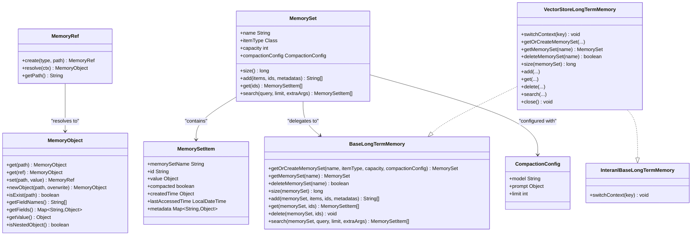

# Memory System

<cite>
**Referenced Files in This Document**
- [MemoryObject.java](file://api/src/main/java/org/apache/flink/agents/api/context/MemoryObject.java)
- [MemoryRef.java](file://api/src/main/java/org/apache/flink/agents/api/context/MemoryRef.java)
- [MemorySet.java](file://api/src/main/java/org/apache/flink/agents/api/memory/MemorySet.java)
- [MemorySetItem.java](file://api/src/main/java/org/apache/flink/agents/api/memory/MemorySetItem.java)
- [BaseLongTermMemory.java](file://api/src/main/java/org/apache/flink/agents/api/memory/BaseLongTermMemory.java)
- [LongTermMemoryOptions.java](file://api/src/main/java/org/apache/flink/agents/api/memory/LongTermMemoryOptions.java)
- [CompactionConfig.java](file://api/src/main/java/org/apache/flink/agents/api/memory/compaction/CompactionConfig.java)
- [VectorStoreLongTermMemory.java](file://runtime/src/main/java/org/apache/flink/agents/runtime/memory/VectorStoreLongTermMemory.java)
- [InteranlBaseLongTermMemory.java](file://runtime/src/main/java/org/apache/flink/agents/runtime/memory/InteranlBaseLongTermMemory.java)
- [CompactionFunctions.java](file://runtime/src/main/java/org/apache/flink/agents/runtime/memory/CompactionFunctions.java)
- [MemoryObjectTest.java](file://runtime/src/test/java/org/apache/flink/agents/runtime/memory/MemoryObjectTest.java)
- [VectorStoreLongTermMemoryTest.java](file://e2e-test/flink-agents-end-to-end-tests-integration/src/test/java/org/apache/flink/agents/integration/test/VectorStoreLongTermMemoryTest.java)
</cite>

## Table of Contents
1. [Introduction](#introduction)
2. [Project Structure](#project-structure)
3. [Core Components](#core-components)
4. [Architecture Overview](#architecture-overview)
5. [Detailed Component Analysis](#detailed-component-analysis)
6. [Dependency Analysis](#dependency-analysis)
7. [Performance Considerations](#performance-considerations)
8. [Troubleshooting Guide](#troubleshooting-guide)
9. [Conclusion](#conclusion)
10. [Appendices](#appendices)

## Introduction
This document explains the memory system in Flink Agents with a focus on the three-tier memory hierarchy:
- Sensory memory: temporary data storage for immediate perception and short-lived context.
- Short-term memory: persistent structured memory for active agent reasoning and tool use, with references and updates.
- Long-term memory: durable, vector-backed storage for semantic recall and knowledge retention, managed via memory sets and compaction.

It covers MemoryObject and MemoryRef for short-term memory access, MemorySet and MemorySetItem for long-term memory organization, BaseLongTermMemory and its VectorStoreLongTermMemory implementation, compaction and async execution, persistence backends, configuration, and practical usage patterns.

## Project Structure
The memory system spans API abstractions and runtime implementations:
- API layer defines interfaces and data models for memory access and long-term memory operations.
- Runtime layer implements long-term memory backed by vector stores and provides compaction utilities.
- Tests demonstrate usage and integration patterns.

**Diagram sources**
- [MemoryObject.java](file://api/src/main/java/org/apache/flink/agents/api/context/MemoryObject.java#L29-L131)
- [MemoryRef.java](file://api/src/main/java/org/apache/flink/agents/api/context/MemoryRef.java#L28-L87)
- [MemorySet.java](file://api/src/main/java/org/apache/flink/agents/api/memory/MemorySet.java#L32-L159)
- [MemorySetItem.java](file://api/src/main/java/org/apache/flink/agents/api/memory/MemorySetItem.java#L23-L94)
- [BaseLongTermMemory.java](file://api/src/main/java/org/apache/flink/agents/api/memory/BaseLongTermMemory.java#L33-L133)
- [LongTermMemoryOptions.java](file://api/src/main/java/org/apache/flink/agents/api/memory/LongTermMemoryOptions.java#L22-L52)
- [CompactionConfig.java](file://api/src/main/java/org/apache/flink/agents/api/memory/compaction/CompactionConfig.java#L29-L92)
- [VectorStoreLongTermMemory.java](file://runtime/src/main/java/org/apache/flink/agents/runtime/memory/VectorStoreLongTermMemory.java#L57-L314)
- [InteranlBaseLongTermMemory.java](file://runtime/src/main/java/org/apache/flink/agents/runtime/memory/InteranlBaseLongTermMemory.java#L22-L30)
- [CompactionFunctions.java](file://runtime/src/main/java/org/apache/flink/agents/runtime/memory/CompactionFunctions.java#L47-L215)

**Section sources**
- [MemoryObject.java](file://api/src/main/java/org/apache/flink/agents/api/context/MemoryObject.java#L1-L132)
- [MemoryRef.java](file://api/src/main/java/org/apache/flink/agents/api/context/MemoryRef.java#L1-L88)
- [MemorySet.java](file://api/src/main/java/org/apache/flink/agents/api/memory/MemorySet.java#L1-L160)
- [MemorySetItem.java](file://api/src/main/java/org/apache/flink/agents/api/memory/MemorySetItem.java#L1-L95)
- [BaseLongTermMemory.java](file://api/src/main/java/org/apache/flink/agents/api/memory/BaseLongTermMemory.java#L1-L134)
- [LongTermMemoryOptions.java](file://api/src/main/java/org/apache/flink/agents/api/memory/LongTermMemoryOptions.java#L1-L53)
- [CompactionConfig.java](file://api/src/main/java/org/apache/flink/agents/api/memory/compaction/CompactionConfig.java#L1-L93)
- [VectorStoreLongTermMemory.java](file://runtime/src/main/java/org/apache/flink/agents/runtime/memory/VectorStoreLongTermMemory.java#L1-L315)
- [InteranlBaseLongTermMemory.java](file://runtime/src/main/java/org/apache/flink/agents/runtime/memory/InteranlBaseLongTermMemory.java#L1-L31)
- [CompactionFunctions.java](file://runtime/src/main/java/org/apache/flink/agents/runtime/memory/CompactionFunctions.java#L1-L216)

## Core Components
- MemoryObject: abstraction for accessing and mutating fields in short-term memory, supporting relative/absolute paths, nested objects, and primitive values.
- MemoryRef: serializable reference to a specific data item in short-term memory, enabling lightweight passing of large objects.
- MemorySet: typed, bounded collection of memory items persisted in long-term memory; delegates operations to BaseLongTermMemory.
- MemorySetItem: a persisted item with identity, value, compaction state, timestamps, and metadata.
- BaseLongTermMemory: interface for long-term memory operations (create/get/delete/retrieve/search) and memory set lifecycle.
- VectorStoreLongTermMemory: runtime implementation backed by a vector store, managing collections per job and context key, adding items with metadata, and triggering compaction.
- CompactionConfig: configuration for compaction including model, optional prompt, and limit.
- LongTermMemoryOptions: configuration options for backend selection, async compaction, and thread pool size.

**Section sources**
- [MemoryObject.java](file://api/src/main/java/org/apache/flink/agents/api/context/MemoryObject.java#L29-L131)
- [MemoryRef.java](file://api/src/main/java/org/apache/flink/agents/api/context/MemoryRef.java#L28-L87)
- [MemorySet.java](file://api/src/main/java/org/apache/flink/agents/api/memory/MemorySet.java#L32-L159)
- [MemorySetItem.java](file://api/src/main/java/org/apache/flink/agents/api/memory/MemorySetItem.java#L23-L94)
- [BaseLongTermMemory.java](file://api/src/main/java/org/apache/flink/agents/api/memory/BaseLongTermMemory.java#L33-L133)
- [VectorStoreLongTermMemory.java](file://runtime/src/main/java/org/apache/flink/agents/runtime/memory/VectorStoreLongTermMemory.java#L57-L314)
- [CompactionConfig.java](file://api/src/main/java/org/apache/flink/agents/api/memory/compaction/CompactionConfig.java#L29-L92)
- [LongTermMemoryOptions.java](file://api/src/main/java/org/apache/flink/agents/api/memory/LongTermMemoryOptions.java#L22-L52)

## Architecture Overview
The memory system separates concerns across tiers:
- Sensory and short-term memory are accessed via MemoryObject and MemoryRef.
- Long-term memory is organized into MemorySet instances and persisted via BaseLongTermMemory implementations.
- VectorStoreLongTermMemory integrates with vector stores for semantic search and retrieval, and applies compaction to reduce storage and improve query performance.

**Diagram sources**
- [MemoryObject.java](file://api/src/main/java/org/apache/flink/agents/api/context/MemoryObject.java#L29-L131)
- [MemoryRef.java](file://api/src/main/java/org/apache/flink/agents/api/context/MemoryRef.java#L28-L87)
- [MemorySet.java](file://api/src/main/java/org/apache/flink/agents/api/memory/MemorySet.java#L32-L159)
- [MemorySetItem.java](file://api/src/main/java/org/apache/flink/agents/api/memory/MemorySetItem.java#L23-L94)
- [BaseLongTermMemory.java](file://api/src/main/java/org/apache/flink/agents/api/memory/BaseLongTermMemory.java#L33-L133)
- [VectorStoreLongTermMemory.java](file://runtime/src/main/java/org/apache/flink/agents/runtime/memory/VectorStoreLongTermMemory.java#L57-L314)
- [InteranlBaseLongTermMemory.java](file://runtime/src/main/java/org/apache/flink/agents/runtime/memory/InteranlBaseLongTermMemory.java#L22-L30)
- [CompactionConfig.java](file://api/src/main/java/org/apache/flink/agents/api/memory/compaction/CompactionConfig.java#L29-L92)

## Detailed Component Analysis

### MemoryObject and MemoryRef (Short-Term Memory Access)
- MemoryObject supports path-based navigation, creation of nested objects, existence checks, and retrieval of fields/values.
- MemoryRef encapsulates a path and resolves to the actual MemoryObject using the RunnerContext, enabling safe passing of references across actions.

**Diagram sources**
- [MemoryRef.java](file://api/src/main/java/org/apache/flink/agents/api/context/MemoryRef.java#L56-L64)
- [MemoryObject.java](file://api/src/main/java/org/apache/flink/agents/api/context/MemoryObject.java#L44-L121)

**Section sources**
- [MemoryObject.java](file://api/src/main/java/org/apache/flink/agents/api/context/MemoryObject.java#L29-L131)
- [MemoryRef.java](file://api/src/main/java/org/apache/flink/agents/api/context/MemoryRef.java#L28-L87)
- [MemoryObjectTest.java](file://runtime/src/test/java/org/apache/flink/agents/runtime/memory/MemoryObjectTest.java#L161-L186)

### MemorySet and MemorySetItem (Long-Term Memory Organization)
- MemorySet defines a typed, bounded collection with compaction configuration and delegates operations to BaseLongTermMemory.
- MemorySetItem carries the persisted value, compaction markers, timestamps, and metadata.

**Diagram sources**
- [MemorySet.java](file://api/src/main/java/org/apache/flink/agents/api/memory/MemorySet.java#L73-L108)
- [MemorySetItem.java](file://api/src/main/java/org/apache/flink/agents/api/memory/MemorySetItem.java#L23-L94)
- [VectorStoreLongTermMemory.java](file://runtime/src/main/java/org/apache/flink/agents/runtime/memory/VectorStoreLongTermMemory.java#L137-L218)
- [CompactionFunctions.java](file://runtime/src/main/java/org/apache/flink/agents/runtime/memory/CompactionFunctions.java#L86-L160)

**Section sources**
- [MemorySet.java](file://api/src/main/java/org/apache/flink/agents/api/memory/MemorySet.java#L32-L159)
- [MemorySetItem.java](file://api/src/main/java/org/apache/flink/agents/api/memory/MemorySetItem.java#L23-L94)

### BaseLongTermMemory and VectorStoreLongTermMemory (Persistence and Semantic Search)
- BaseLongTermMemory defines the contract for memory set lifecycle and operations.
- VectorStoreLongTermMemory implements the contract using a vector store:
  - Names collections by combining job ID, context key, and memory set name.
  - Stores serialized item content and metadata per document.
  - Triggers compaction when capacity is exceeded, optionally asynchronously.
  - Supports semantic search via vector queries.

**Diagram sources**
- [BaseLongTermMemory.java](file://api/src/main/java/org/apache/flink/agents/api/memory/BaseLongTermMemory.java#L33-L133)
- [VectorStoreLongTermMemory.java](file://runtime/src/main/java/org/apache/flink/agents/runtime/memory/VectorStoreLongTermMemory.java#L137-L244)
- [CompactionFunctions.java](file://runtime/src/main/java/org/apache/flink/agents/runtime/memory/CompactionFunctions.java#L86-L160)

**Section sources**
- [BaseLongTermMemory.java](file://api/src/main/java/org/apache/flink/agents/api/memory/BaseLongTermMemory.java#L33-L133)
- [VectorStoreLongTermMemory.java](file://runtime/src/main/java/org/apache/flink/agents/runtime/memory/VectorStoreLongTermMemory.java#L57-L314)
- [InteranlBaseLongTermMemory.java](file://runtime/src/main/java/org/apache/flink/agents/runtime/memory/InteranlBaseLongTermMemory.java#L22-L30)

### Compaction and Async Execution
- CompactionConfig controls the model used for summarization and the topic limit.
- CompactionFunctions summarizes items, deletes originals, and upserts compacted summaries with aggregated timestamps.
- VectorStoreLongTermMemory conditionally runs compaction asynchronously and manages a fixed thread pool.

**Diagram sources**
- [CompactionConfig.java](file://api/src/main/java/org/apache/flink/agents/api/memory/compaction/CompactionConfig.java#L29-L92)
- [CompactionFunctions.java](file://runtime/src/main/java/org/apache/flink/agents/runtime/memory/CompactionFunctions.java#L86-L160)
- [VectorStoreLongTermMemory.java](file://runtime/src/main/java/org/apache/flink/agents/runtime/memory/VectorStoreLongTermMemory.java#L285-L292)
- [LongTermMemoryOptions.java](file://api/src/main/java/org/apache/flink/agents/api/memory/LongTermMemoryOptions.java#L45-L52)

**Section sources**
- [CompactionConfig.java](file://api/src/main/java/org/apache/flink/agents/api/memory/compaction/CompactionConfig.java#L29-L92)
- [CompactionFunctions.java](file://runtime/src/main/java/org/apache/flink/agents/runtime/memory/CompactionFunctions.java#L47-L215)
- [VectorStoreLongTermMemory.java](file://runtime/src/main/java/org/apache/flink/agents/runtime/memory/VectorStoreLongTermMemory.java#L285-L305)
- [LongTermMemoryOptions.java](file://api/src/main/java/org/apache/flink/agents/api/memory/LongTermMemoryOptions.java#L45-L52)

### Memory Persistence and Recovery Strategies
- Persistence: MemorySet items are persisted as documents in a vector store collection. Metadata tracks compaction state, creation/access timestamps, and user-provided attributes.
- Recovery: MemorySet metadata is stored in the collection’s metadata and rehydrated upon retrieval. VectorStoreLongTermMemory reconstructs MemorySet instances and restores item values by type.
- Context isolation: switchContext enables multiple logical contexts within the same job by mangling collection names with job ID and key.

**Diagram sources**
- [VectorStoreLongTermMemory.java](file://runtime/src/main/java/org/apache/flink/agents/runtime/memory/VectorStoreLongTermMemory.java#L100-L122)
- [MemorySet.java](file://api/src/main/java/org/apache/flink/agents/api/memory/MemorySet.java#L39-L49)

**Section sources**
- [VectorStoreLongTermMemory.java](file://runtime/src/main/java/org/apache/flink/agents/runtime/memory/VectorStoreLongTermMemory.java#L92-L122)
- [MemorySet.java](file://api/src/main/java/org/apache/flink/agents/api/memory/MemorySet.java#L39-L49)

### Practical Usage Patterns and Integration with Vector Stores
- Creating a memory set for chat history with compaction:
  - Define MemorySet with item type ChatMessage and capacity.
  - Configure CompactionConfig with a chat model and topic limit.
  - Use BaseLongTermMemory.getOrCreateMemorySet to create or retrieve the set.
- Adding items and triggering compaction:
  - Call MemorySet.add with optional IDs and metadata; when capacity is reached, compaction may run asynchronously.
- Retrieving and semantic search:
  - Use MemorySet.get to fetch items by ID or all items.
  - Use MemorySet.search to find semantically similar items.
- E2E integration:
  - VectorStoreLongTermMemoryTest demonstrates end-to-end scenarios integrating vector store backends and memory operations.

**Section sources**
- [VectorStoreLongTermMemoryTest.java](file://e2e-test/flink-agents-end-to-end-tests-integration/src/test/java/org/apache/flink/agents/integration/test/VectorStoreLongTermMemoryTest.java)
- [MemorySet.java](file://api/src/main/java/org/apache/flink/agents/api/memory/MemorySet.java#L73-L108)
- [VectorStoreLongTermMemory.java](file://runtime/src/main/java/org/apache/flink/agents/runtime/memory/VectorStoreLongTermMemory.java#L137-L244)

## Dependency Analysis
- MemoryObject and MemoryRef are part of the short-term memory access API.
- MemorySet depends on BaseLongTermMemory for persistence and on CompactionConfig for capacity management.
- VectorStoreLongTermMemory implements BaseLongTermMemory and uses CompactionFunctions for summarization.
- LongTermMemoryOptions governs backend selection and async compaction behavior.

**Diagram sources**
- [MemoryObject.java](file://api/src/main/java/org/apache/flink/agents/api/context/MemoryObject.java#L29-L131)
- [MemoryRef.java](file://api/src/main/java/org/apache/flink/agents/api/context/MemoryRef.java#L28-L87)
- [MemorySet.java](file://api/src/main/java/org/apache/flink/agents/api/memory/MemorySet.java#L32-L159)
- [BaseLongTermMemory.java](file://api/src/main/java/org/apache/flink/agents/api/memory/BaseLongTermMemory.java#L33-L133)
- [VectorStoreLongTermMemory.java](file://runtime/src/main/java/org/apache/flink/agents/runtime/memory/VectorStoreLongTermMemory.java#L57-L314)
- [CompactionFunctions.java](file://runtime/src/main/java/org/apache/flink/agents/runtime/memory/CompactionFunctions.java#L47-L215)
- [CompactionConfig.java](file://api/src/main/java/org/apache/flink/agents/api/memory/compaction/CompactionConfig.java#L29-L92)
- [LongTermMemoryOptions.java](file://api/src/main/java/org/apache/flink/agents/api/memory/LongTermMemoryOptions.java#L22-L52)

**Section sources**
- [MemoryObject.java](file://api/src/main/java/org/apache/flink/agents/api/context/MemoryObject.java#L29-L131)
- [MemoryRef.java](file://api/src/main/java/org/apache/flink/agents/api/context/MemoryRef.java#L28-L87)
- [MemorySet.java](file://api/src/main/java/org/apache/flink/agents/api/memory/MemorySet.java#L32-L159)
- [BaseLongTermMemory.java](file://api/src/main/java/org/apache/flink/agents/api/memory/BaseLongTermMemory.java#L33-L133)
- [VectorStoreLongTermMemory.java](file://runtime/src/main/java/org/apache/flink/agents/runtime/memory/VectorStoreLongTermMemory.java#L57-L314)
- [CompactionFunctions.java](file://runtime/src/main/java/org/apache/flink/agents/runtime/memory/CompactionFunctions.java#L47-L215)
- [CompactionConfig.java](file://api/src/main/java/org/apache/flink/agents/api/memory/compaction/CompactionConfig.java#L29-L92)
- [LongTermMemoryOptions.java](file://api/src/main/java/org/apache/flink/agents/api/memory/LongTermMemoryOptions.java#L22-L52)

## Performance Considerations
- Async compaction: Enable LongTermMemoryOptions.ASYNC_COMPACTION and tune LongTermMemoryOptions.THREAD_COUNT to balance throughput and latency.
- Capacity sizing: Choose MemorySet.capacity to control when compaction triggers; larger capacities reduce frequency but increase memory footprint.
- Batched operations: Prefer batched add and get to minimize round trips; note that current get retrieves all items, which may risk OOM for very large sets.
- Vector store indexing: Ensure vector store configuration aligns with query patterns and embedding model characteristics.
- Metadata minimization: Keep metadata concise to reduce storage overhead and query costs.

[No sources needed since this section provides general guidance]

## Troubleshooting Guide
- Capacity not triggering compaction:
  - Verify MemorySet.capacity and actual size calculation via BaseLongTermMemory.size.
  - Confirm LongTermMemoryOptions.ASYNC_COMPACTION setting and thread pool availability.
- Async compaction not running:
  - Check for exceptions captured in CompletableFuture exceptionally handler and ensure workerExecutor is initialized.
- Serialization errors:
  - Ensure MemorySetItem values are serializable; VectorStoreLongTermMemory stores content as JSON strings and expects proper deserialization.
- Context isolation issues:
  - Use InteranlBaseLongTermMemory.switchContext to isolate data by key; verify collection name mangling includes job ID and key.
- Memory growth:
  - Review compaction configuration and limits; adjust CompactionConfig.limit and model quality to optimize summarization granularity.

**Section sources**
- [VectorStoreLongTermMemory.java](file://runtime/src/main/java/org/apache/flink/agents/runtime/memory/VectorStoreLongTermMemory.java#L188-L215)
- [VectorStoreLongTermMemory.java](file://runtime/src/main/java/org/apache/flink/agents/runtime/memory/VectorStoreLongTermMemory.java#L294-L305)
- [VectorStoreLongTermMemory.java](file://runtime/src/main/java/org/apache/flink/agents/runtime/memory/VectorStoreLongTermMemory.java#L246-L248)
- [LongTermMemoryOptions.java](file://api/src/main/java/org/apache/flink/agents/api/memory/LongTermMemoryOptions.java#L45-L52)

## Conclusion
Flink Agents’ memory system provides a robust, extensible architecture:
- Sensory and short-term memory enable efficient, structured access and mutation.
- Long-term memory organizes data into typed, bounded sets with configurable compaction.
- VectorStoreLongTermMemory integrates with vector stores for scalable semantic search and retrieval.
- Configuration options allow tuning for performance and reliability.

[No sources needed since this section summarizes without analyzing specific files]

## Appendices

### Configuration Options
- Backend selection: LongTermMemoryOptions.BACKEND selects the long-term memory backend.
- External vector store name: LongTermMemoryOptions.EXTERNAL_VECTOR_STORE_NAME identifies the vector store resource.
- Async compaction: LongTermMemoryOptions.ASYNC_COMPACTION toggles asynchronous compaction.
- Thread count: LongTermMemoryOptions.THREAD_COUNT sets the fixed thread pool size for compaction workers.

**Section sources**
- [LongTermMemoryOptions.java](file://api/src/main/java/org/apache/flink/agents/api/memory/LongTermMemoryOptions.java#L37-L52)

### Best Practices
- Use MemoryRef to pass references instead of large objects across actions.
- Configure MemorySet.capacity conservatively to avoid frequent compaction.
- Tune CompactionConfig.limit to balance recall and storage efficiency.
- Monitor compaction logs and adjust thread counts for workload patterns.
- Isolate contexts using switchContext to prevent cross-job interference.

[No sources needed since this section provides general guidance]