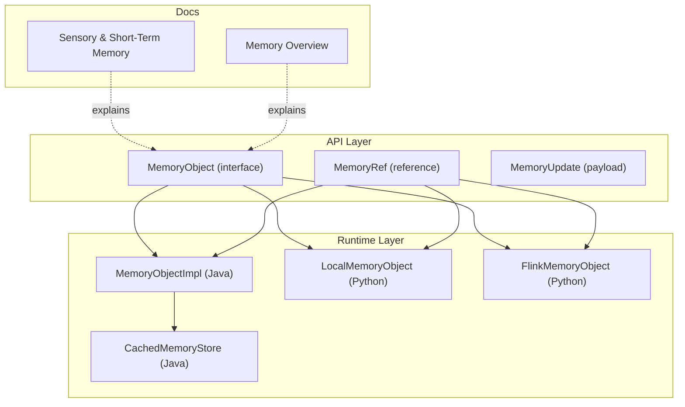
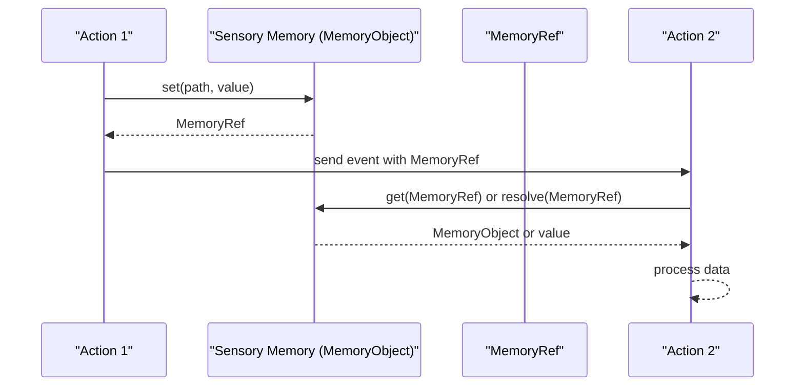
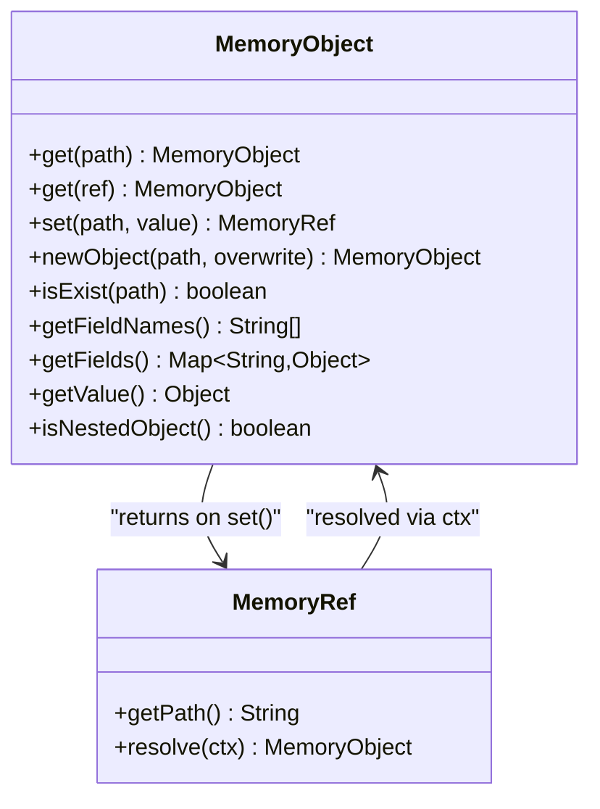
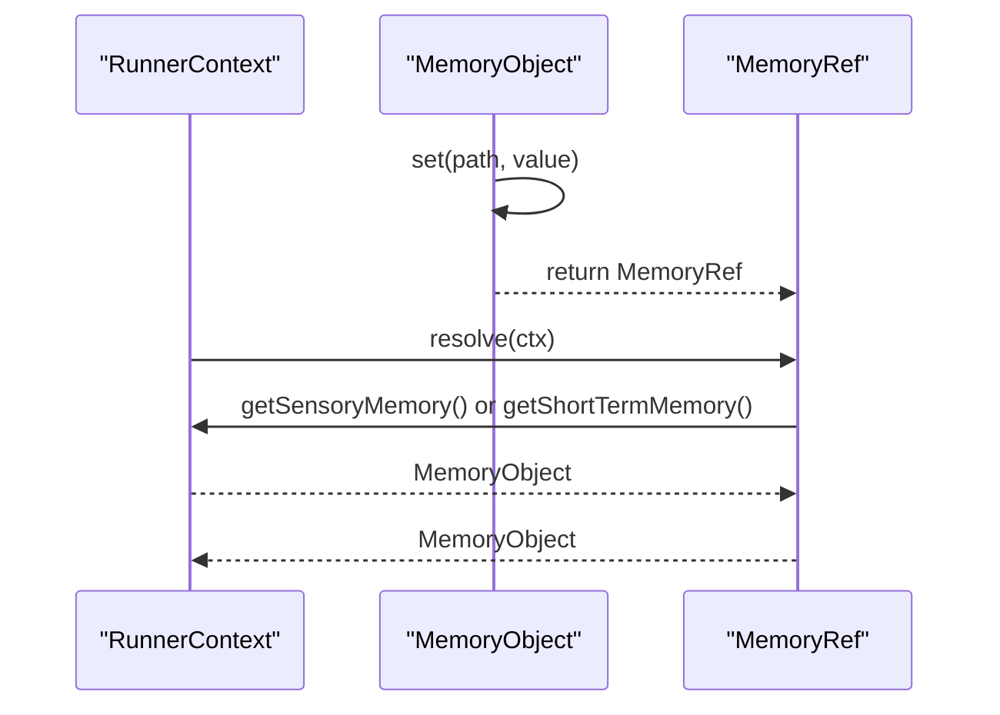
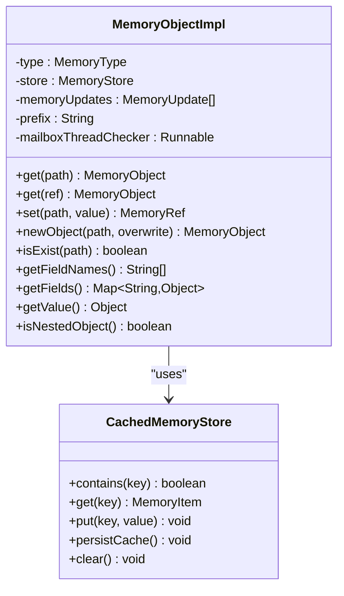
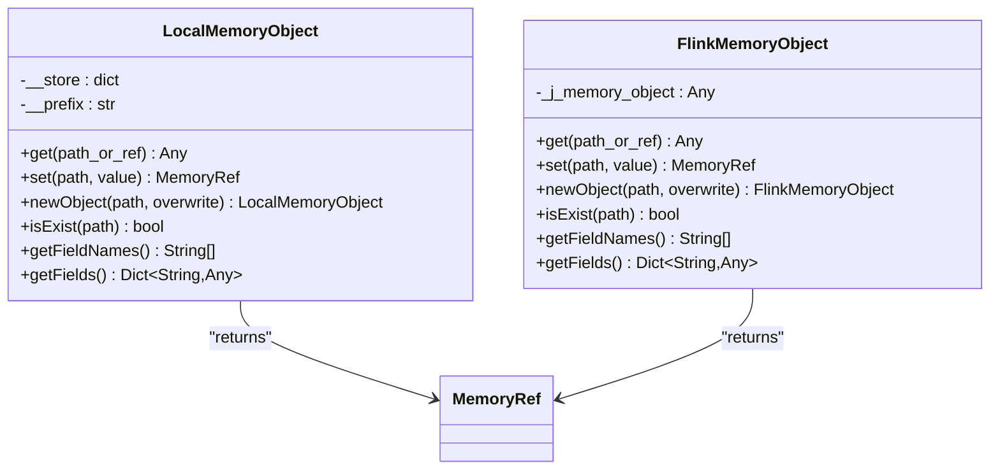
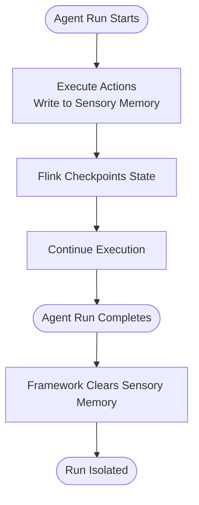
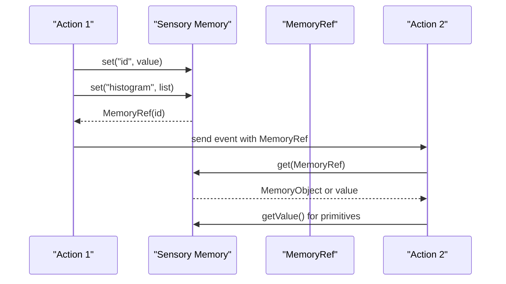
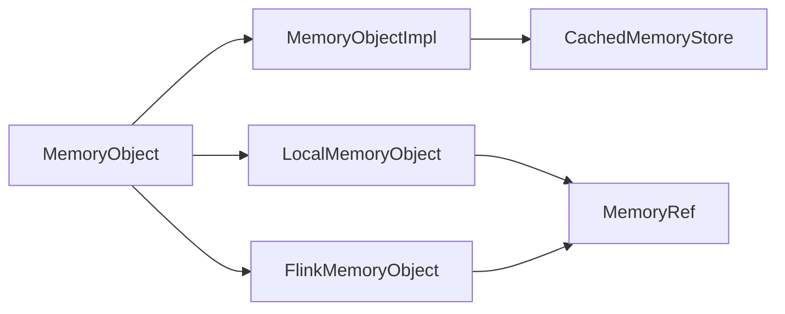

# Sensory Memory Management

<cite>
**Referenced Files in This Document**
- [MemoryObject.java](file://api/src/main/java/org/apache/flink/agents/api/context/MemoryObject.java)
- [MemoryRef.java](file://api/src/main/java/org/apache/flink/agents/api/context/MemoryRef.java)
- [MemoryUpdate.java](file://api/src/main/java/org/apache/flink/agents/api/context/MemoryUpdate.java)
- [sensory_and_short_term_memory.md](file://docs/content/docs/development/memory/sensory_and_short_term_memory.md)
- [overview.md](file://docs/content/docs/development/memory/overview.md)
- [FlinkMemoryObject.java](file://python/flink_agents/runtime/flink_memory_object.py)
- [LocalMemoryObject.java](file://python/flink_agents/runtime/local_memory_object.py)
- [MemoryObjectImpl.java](file://runtime/src/main/java/org/apache/flink/agents/runtime/memory/MemoryObjectImpl.java)
- [CachedMemoryStore.java](file://runtime/src/main/java/org/apache/flink/agents/runtime/memory/CachedMemoryStore.java)
- [ProductSuggestionAgent.java](file://examples/src/main/java/org/apache/flink/agents/examples/agents/ProductSuggestionAgent.java)
</cite>

## Table of Contents
1. [Introduction](#introduction)
2. [Project Structure](#project-structure)
3. [Core Components](#core-components)
4. [Architecture Overview](#architecture-overview)
5. [Detailed Component Analysis](#detailed-component-analysis)
6. [Dependency Analysis](#dependency-analysis)
7. [Performance Considerations](#performance-considerations)
8. [Troubleshooting Guide](#troubleshooting-guide)
9. [Conclusion](#conclusion)

## Introduction
This document explains how Flink Agents manages sensory memory during agent execution. Sensory memory is a temporary, per-run storage mechanism that enables actions to share intermediate results and pass references to large objects efficiently. It is automatically cleaned up after each agent run to ensure isolation between runs. The documentation covers the MemoryObject interface, MemoryRef usage, lifecycle and cleanup behavior, and practical patterns for setting and retrieving values, managing nested structures, and optimizing performance.

## Project Structure
The sensory memory system spans three layers:
- API surface: Java interfaces and Python wrappers define the contract and usage patterns.
- Runtime implementation: Java MemoryObjectImpl and Python LocalMemoryObject/FlinkMemoryObject provide concrete implementations.
- Documentation: Guides explain supported types, operations, and lifecycle behavior.

**Diagram sources**
- [MemoryObject.java](file://api/src/main/java/org/apache/flink/agents/api/context/MemoryObject.java#L29-L131)
- [MemoryRef.java](file://api/src/main/java/org/apache/flink/agents/api/context/MemoryRef.java#L28-L87)
- [MemoryUpdate.java](file://api/src/main/java/org/apache/flink/agents/api/context/MemoryUpdate.java#L30-L83)
- [MemoryObjectImpl.java](file://runtime/src/main/java/org/apache/flink/agents/runtime/memory/MemoryObjectImpl.java#L33-L120)
- [CachedMemoryStore.java](file://runtime/src/main/java/org/apache/flink/agents/runtime/memory/CachedMemoryStore.java#L41-L65)
- [LocalMemoryObject.java](file://python/flink_agents/runtime/local_memory_object.py#L24-L244)
- [FlinkMemoryObject.java](file://python/flink_agents/runtime/flink_memory_object.py#L24-L109)
- [sensory_and_short_term_memory.md](file://docs/content/docs/development/memory/sensory_and_short_term_memory.md#L25-L263)
- [overview.md](file://docs/content/docs/development/memory/overview.md#L25-L82)

**Section sources**
- [MemoryObject.java](file://api/src/main/java/org/apache/flink/agents/api/context/MemoryObject.java#L29-L131)
- [MemoryRef.java](file://api/src/main/java/org/apache/flink/agents/api/context/MemoryRef.java#L28-L87)
- [MemoryUpdate.java](file://api/src/main/java/org/apache/flink/agents/api/context/MemoryUpdate.java#L30-L83)
- [sensory_and_short_term_memory.md](file://docs/content/docs/development/memory/sensory_and_short_term_memory.md#L25-L263)
- [overview.md](file://docs/content/docs/development/memory/overview.md#L25-L82)

## Core Components
- MemoryObject: Defines the contract for storing and retrieving values and nested objects, including direct field access, nested object creation, and metadata queries.
- MemoryRef: A serializable reference to a specific memory location, enabling lightweight passing of large data between actions.
- MemoryUpdate: A structured update payload carrying a path and value for batch updates.
- MemoryObjectImpl (Java): The runtime implementation of MemoryObject, backed by a MemoryStore and supporting incremental updates.
- LocalMemoryObject (Python): A local, flattened key-value store implementation for Python execution.
- FlinkMemoryObject (Python): A Python wrapper around the Java MemoryObjectImpl for Flink environments.

Key capabilities:
- Direct field access via getValue() for primitive-like values.
- Nested object access via get() returning either a value or a MemoryObject.
- Automatic creation of intermediate nested objects when setting deep paths.
- Field enumeration via getFieldNames() and getFields().
- Reference-based passing via set() returning MemoryRef.

**Section sources**
- [MemoryObject.java](file://api/src/main/java/org/apache/flink/agents/api/context/MemoryObject.java#L29-L131)
- [MemoryRef.java](file://api/src/main/java/org/apache/flink/agents/api/context/MemoryRef.java#L28-L87)
- [MemoryUpdate.java](file://api/src/main/java/org/apache/flink/agents/api/context/MemoryUpdate.java#L30-L83)
- [MemoryObjectImpl.java](file://runtime/src/main/java/org/apache/flink/agents/runtime/memory/MemoryObjectImpl.java#L33-L120)
- [LocalMemoryObject.java](file://python/flink_agents/runtime/local_memory_object.py#L24-L244)
- [FlinkMemoryObject.java](file://python/flink_agents/runtime/flink_memory_object.py#L24-L109)

## Architecture Overview
Sensory memory is a temporary, per-run store that is isolated between agent executions. It supports hierarchical key-value structures and can hold primitives, collections, POJOs, general classes, and nested MemoryObjects. MemoryRef enables efficient passing of large objects by reference.

**Diagram sources**
- [MemoryObject.java](file://api/src/main/java/org/apache/flink/agents/api/context/MemoryObject.java#L44-L66)
- [MemoryRef.java](file://api/src/main/java/org/apache/flink/agents/api/context/MemoryRef.java#L56-L64)
- [sensory_and_short_term_memory.md](file://docs/content/docs/development/memory/sensory_and_short_term_memory.md#L190-L251)

## Detailed Component Analysis

### MemoryObject Interface
- Purpose: Unified API for reading/writing primitive values and nested objects, enumerating fields, and checking existence.
- Direct vs nested fields: getValue() returns a primitive value; isNestedObject() distinguishes nested objects.
- Paths and references: get(String) and get(MemoryRef) resolve to a MemoryObject or value.
- Creation: newObject(path, overwrite) creates nested objects; set(path, value) sets direct fields and returns MemoryRef.

**Diagram sources**
- [MemoryObject.java](file://api/src/main/java/org/apache/flink/agents/api/context/MemoryObject.java#L29-L131)
- [MemoryRef.java](file://api/src/main/java/org/apache/flink/agents/api/context/MemoryRef.java#L28-L87)

**Section sources**
- [MemoryObject.java](file://api/src/main/java/org/apache/flink/agents/api/context/MemoryObject.java#L29-L131)
- [MemoryRef.java](file://api/src/main/java/org/apache/flink/agents/api/context/MemoryRef.java#L28-L87)

### MemoryRef Usage and Resolution
- Creation: set(path, value) returns a MemoryRef with the absolute path to the stored item.
- Resolution: MemoryRef.resolve(ctx) resolves to a MemoryObject from either sensory or short-term memory depending on type.
- Passing large data: Prefer sending MemoryRef over raw objects to reduce payload size and avoid unnecessary serialization/copy.

**Diagram sources**
- [MemoryRef.java](file://api/src/main/java/org/apache/flink/agents/api/context/MemoryRef.java#L56-L64)
- [sensory_and_short_term_memory.md](file://docs/content/docs/development/memory/sensory_and_short_term_memory.md#L190-L251)

**Section sources**
- [MemoryRef.java](file://api/src/main/java/org/apache/flink/agents/api/context/MemoryRef.java#L28-L87)
- [sensory_and_short_term_memory.md](file://docs/content/docs/development/memory/sensory_and_short_term_memory.md#L190-L251)

### MemoryObject Implementation (Java)
- MemoryObjectImpl: Implements MemoryObject against a MemoryStore with support for incremental updates and thread checks.
- Prefix-based addressing: Nested objects are addressed via dot-separated paths.
- Root initialization: Ensures a root object exists on construction.
- Incremental updates: Maintains a list of MemoryUpdate entries for batch processing.

**Diagram sources**
- [MemoryObjectImpl.java](file://runtime/src/main/java/org/apache/flink/agents/runtime/memory/MemoryObjectImpl.java#L33-L120)
- [CachedMemoryStore.java](file://runtime/src/main/java/org/apache/flink/agents/runtime/memory/CachedMemoryStore.java#L41-L65)

**Section sources**
- [MemoryObjectImpl.java](file://runtime/src/main/java/org/apache/flink/agents/runtime/memory/MemoryObjectImpl.java#L33-L120)
- [CachedMemoryStore.java](file://runtime/src/main/java/org/apache/flink/agents/runtime/memory/CachedMemoryStore.java#L41-L65)

### Python Implementations
- LocalMemoryObject: Flat key-value store with nested object markers; supports path flattening and parent creation.
- FlinkMemoryObject: Bridges Python and Java by delegating to a Java-backed MemoryObjectImpl and returning MemoryRef instances.

**Diagram sources**
- [LocalMemoryObject.java](file://python/flink_agents/runtime/local_memory_object.py#L24-L244)
- [FlinkMemoryObject.java](file://python/flink_agents/runtime/flink_memory_object.py#L24-L109)

**Section sources**
- [LocalMemoryObject.java](file://python/flink_agents/runtime/local_memory_object.py#L24-L244)
- [FlinkMemoryObject.java](file://python/flink_agents/runtime/flink_memory_object.py#L24-L109)

### Lifecycle and Auto-Cleanup
- Sensory memory is temporary and isolated per agent run.
- Auto-cleanup: The framework clears all sensory memory after a run completes, ensuring no cross-run leakage.
- Fault tolerance: While running, sensory memory participates in Flink checkpointing; after completion, it is fully cleared.

**Diagram sources**
- [sensory_and_short_term_memory.md](file://docs/content/docs/development/memory/sensory_and_short_term_memory.md#L252-L263)
- [overview.md](file://docs/content/docs/development/memory/overview.md#L47-L49)

**Section sources**
- [sensory_and_short_term_memory.md](file://docs/content/docs/development/memory/sensory_and_short_term_memory.md#L252-L263)
- [overview.md](file://docs/content/docs/development/memory/overview.md#L47-L49)

### Practical Patterns and Examples
- Setting and retrieving primitive values:
  - Use set(path, value) to store primitives and collections.
  - Retrieve values via get(path).getValue() for direct fields.
- Managing nested objects:
  - Create nested objects with newObject(path).
  - Access nested fields either from the innermost object or via absolute paths.
- Using MemoryRef:
  - After set(), capture the returned MemoryRef and pass it in events.
  - Resolve MemoryRef in downstream actions to access the stored data.
- Example usage pattern:
  - Short-term memory usage in an agent action chain demonstrates storing identifiers and histograms, then retrieving them to construct outputs.

**Diagram sources**
- [sensory_and_short_term_memory.md](file://docs/content/docs/development/memory/sensory_and_short_term_memory.md#L76-L132)
- [ProductSuggestionAgent.java](file://examples/src/main/java/org/apache/flink/agents/examples/agents/ProductSuggestionAgent.java#L74-L112)

**Section sources**
- [sensory_and_short_term_memory.md](file://docs/content/docs/development/memory/sensory_and_short_term_memory.md#L76-L132)
- [ProductSuggestionAgent.java](file://examples/src/main/java/org/apache/flink/agents/examples/agents/ProductSuggestionAgent.java#L74-L112)

## Dependency Analysis
- MemoryObjectImpl depends on MemoryStore and maintains a list of MemoryUpdate entries for incremental updates.
- CachedMemoryStore provides caching and persistence helpers, clearing both cache and underlying store.
- Python wrappers delegate to Java implementations and return MemoryRef instances for cross-language compatibility.

**Diagram sources**
- [MemoryObjectImpl.java](file://runtime/src/main/java/org/apache/flink/agents/runtime/memory/MemoryObjectImpl.java#L33-L120)
- [CachedMemoryStore.java](file://runtime/src/main/java/org/apache/flink/agents/runtime/memory/CachedMemoryStore.java#L41-L65)
- [LocalMemoryObject.java](file://python/flink_agents/runtime/local_memory_object.py#L24-L244)
- [FlinkMemoryObject.java](file://python/flink_agents/runtime/flink_memory_object.py#L24-L109)
- [MemoryObject.java](file://api/src/main/java/org/apache/flink/agents/api/context/MemoryObject.java#L29-L131)

**Section sources**
- [MemoryObjectImpl.java](file://runtime/src/main/java/org/apache/flink/agents/runtime/memory/MemoryObjectImpl.java#L33-L120)
- [CachedMemoryStore.java](file://runtime/src/main/java/org/apache/flink/agents/runtime/memory/CachedMemoryStore.java#L41-L65)
- [LocalMemoryObject.java](file://python/flink_agents/runtime/local_memory_object.py#L24-L244)
- [FlinkMemoryObject.java](file://python/flink_agents/runtime/flink_memory_object.py#L24-L109)
- [MemoryObject.java](file://api/src/main/java/org/apache/flink/agents/api/context/MemoryObject.java#L29-L131)

## Performance Considerations
- Prefer MemoryRef for large payloads: Sending a small reference avoids copying and serializing large objects across actions.
- Minimize deep nesting: While nested objects are supported, excessive nesting increases path resolution overhead.
- Batch updates: Use MemoryUpdate for structured batch writes to reduce repeated store operations.
- Avoid primitive-to-object conflicts: set() on an existing nested object path requires overwrite semantics; otherwise, exceptions are raised.
- Use newObject() for nested structures: Creating nested objects explicitly prevents accidental primitive overwrites.

Best practices:
- Pass MemoryRef instead of raw objects when chaining actions.
- Keep top-level field names concise and meaningful for efficient enumeration.
- Leverage isExist() and getFields() judiciously to avoid unnecessary lookups.

[No sources needed since this section provides general guidance]

## Troubleshooting Guide
Common issues and resolutions:
- Attempting to set a MemoryObject directly: Use newObject(path) to create nested objects instead of assigning MemoryObject instances directly.
- Overwriting nested objects with primitives: Ensure overwrite=true when calling newObject(path, true) if you intend to replace an existing nested object.
- Resolving MemoryRef fails: Verify the reference type matches the intended memory (SENSORY vs SHORT_TERM) and that the path exists.
- Retrieving values: For direct fields, call getValue() on the returned MemoryObject; for nested objects, call get(path) again to navigate deeper.

**Section sources**
- [LocalMemoryObject.java](file://python/flink_agents/runtime/local_memory_object.py#L104-L112)
- [LocalMemoryObject.java](file://python/flink_agents/runtime/local_memory_object.py#L143-L148)
- [MemoryRef.java](file://api/src/main/java/org/apache/flink/agents/api/context/MemoryRef.java#L56-L64)
- [MemoryObject.java](file://api/src/main/java/org/apache/flink/agents/api/context/MemoryObject.java#L114-L130)

## Conclusion
Sensory memory in Flink Agents provides a robust, temporary storage mechanism for sharing intermediate results and large objects across actions within a single run. The MemoryObject interface and MemoryRef enable flexible, efficient data handling, while the runtime implementations offer both local and Flink-backed storage. Sensory memory is automatically cleaned up after each run, ensuring isolation and preventing unintended persistence. By following the recommended patterns—using MemoryRef for large payloads, managing nested structures with newObject(), and leveraging getValue() for direct fields—you can build efficient and maintainable agent workflows.