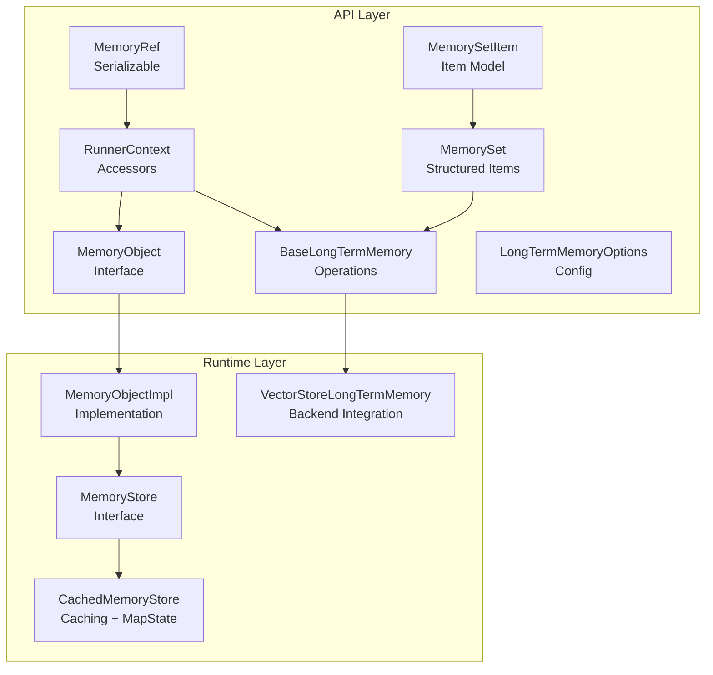
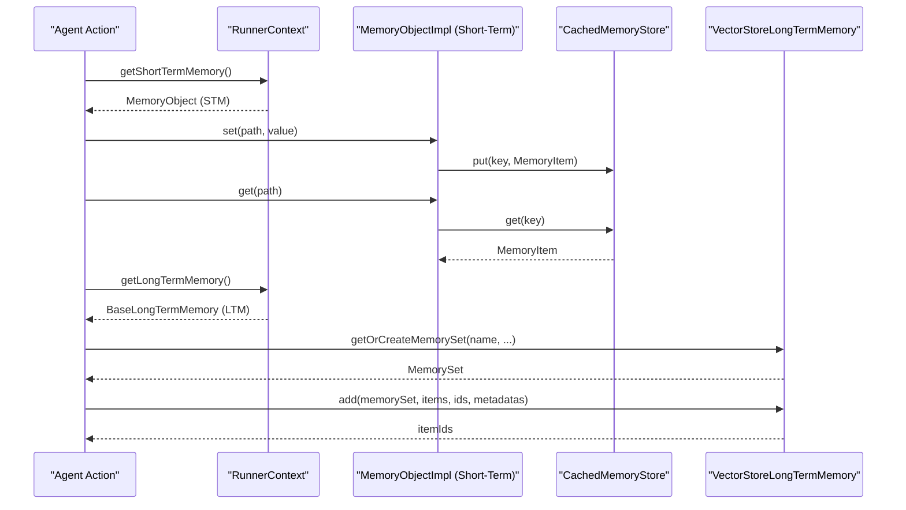
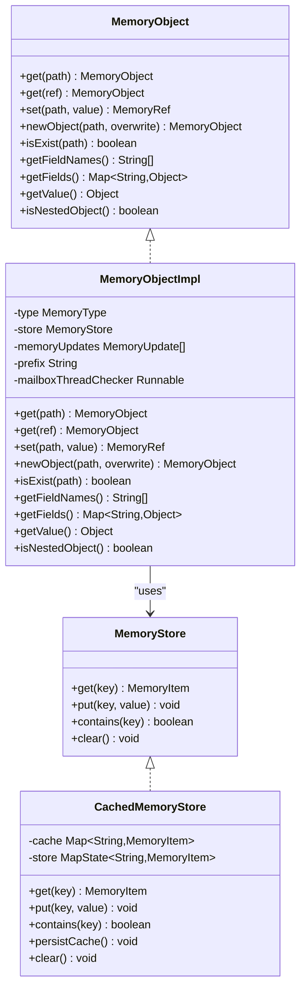
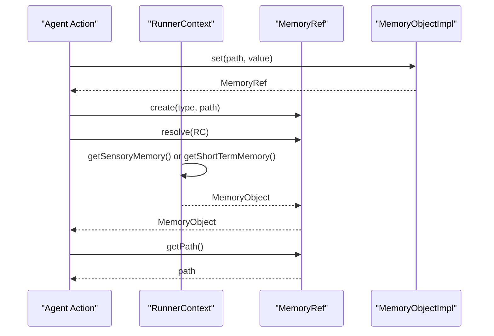
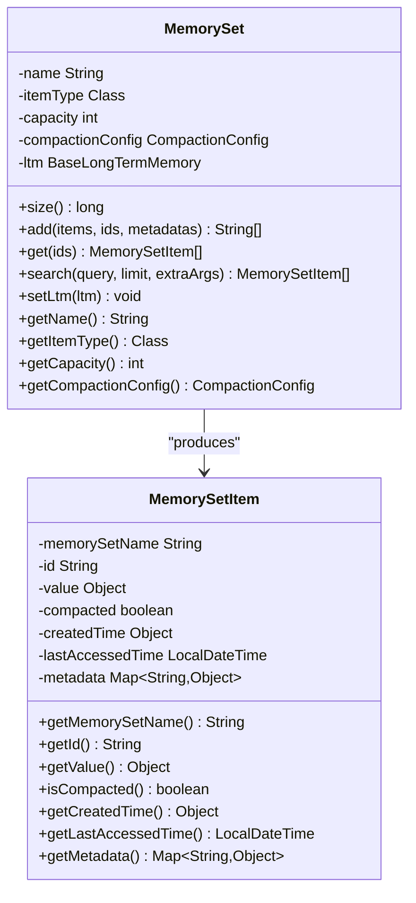
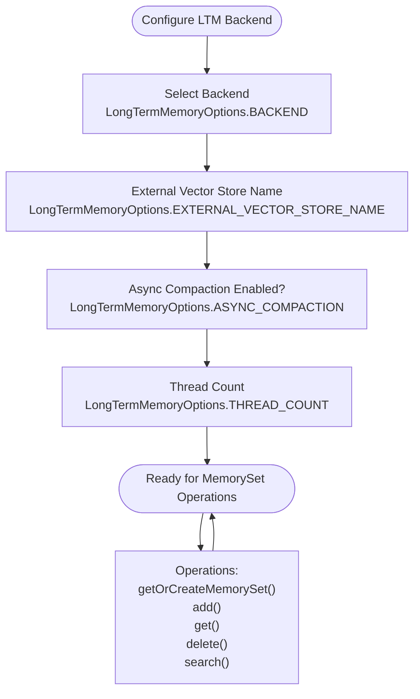
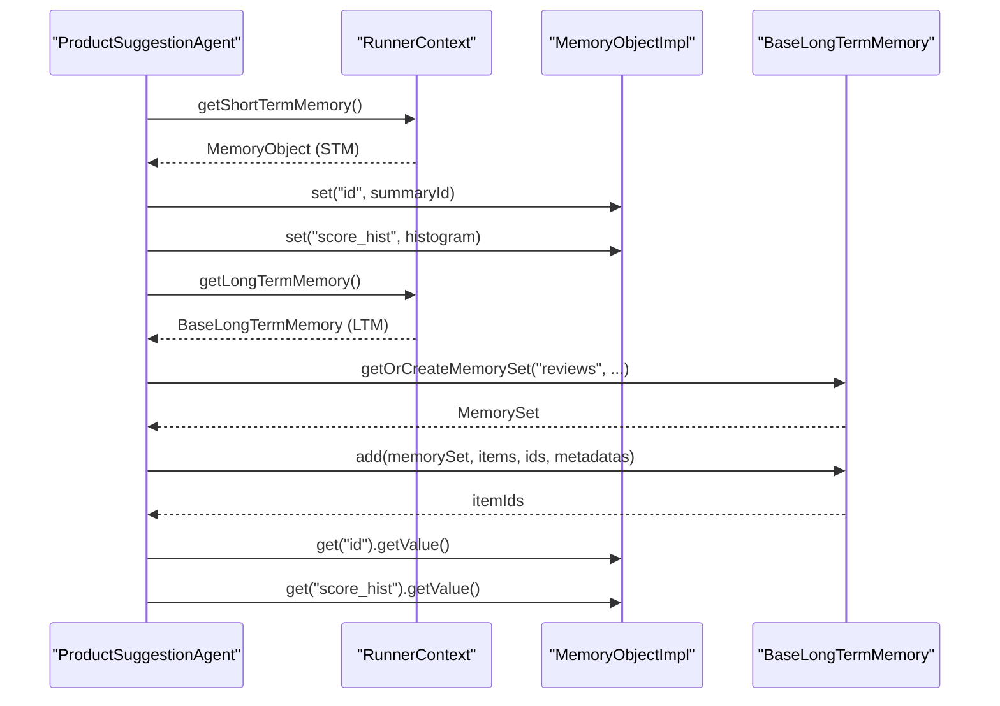
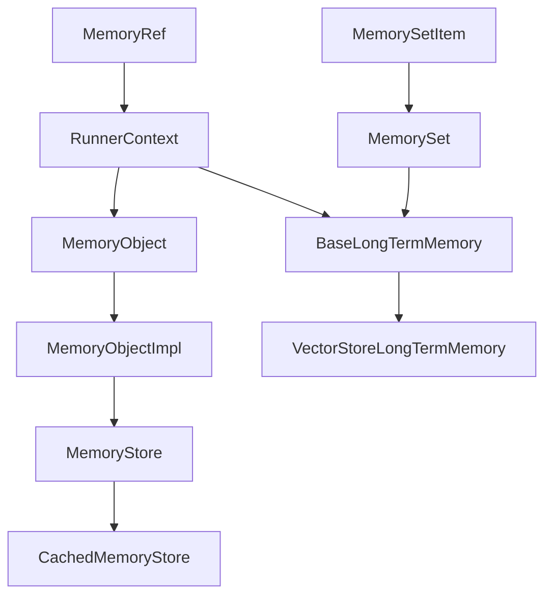

# Short-term Memory Configuration

<cite>
**Referenced Files in This Document**
- [MemoryObject.java](file://api/src/main/java/org/apache/flink/agents/api/context/MemoryObject.java)
- [MemoryRef.java](file://api/src/main/java/org/apache/flink/agents/api/context/MemoryRef.java)
- [RunnerContext.java](file://api/src/main/java/org/apache/flink/agents/api/context/RunnerContext.java)
- [MemoryObjectImpl.java](file://runtime/src/main/java/org/apache/flink/agents/runtime/memory/MemoryObjectImpl.java)
- [MemoryStore.java](file://runtime/src/main/java/org/apache/flink/agents/runtime/memory/MemoryStore.java)
- [CachedMemoryStore.java](file://runtime/src/main/java/org/apache/flink/agents/runtime/memory/CachedMemoryStore.java)
- [MemorySet.java](file://api/src/main/java/org/apache/flink/agents/api/memory/MemorySet.java)
- [MemorySetItem.java](file://api/src/main/java/org/apache/flink/agents/api/memory/MemorySetItem.java)
- [BaseLongTermMemory.java](file://api/src/main/java/org/apache/flink/agents/api/memory/BaseLongTermMemory.java)
- [LongTermMemoryOptions.java](file://api/src/main/java/org/apache/flink/agents/api/memory/LongTermMemoryOptions.java)
- [VectorStoreLongTermMemory.java](file://runtime/src/main/java/org/apache/flink/agents/runtime/memory/VectorStoreLongTermMemory.java)
- [ProductSuggestionAgent.java](file://examples/src/main/java/org/apache/flink/agents/examples/agents/ProductSuggestionAgent.java)
- [MemoryObjectTest.java](file://runtime/src/test/java/org/apache/flink/agents/runtime/memory/MemoryObjectTest.java)
- [MemoryRefTest.java](file://runtime/src/test/java/org/apache/flink/agents/runtime/memory/MemoryRefTest.java)
</cite>

## Table of Contents
1. [Introduction](#introduction)
2. [Project Structure](#project-structure)
3. [Core Components](#core-components)
4. [Architecture Overview](#architecture-overview)
5. [Detailed Component Analysis](#detailed-component-analysis)
6. [Dependency Analysis](#dependency-analysis)
7. [Performance Considerations](#performance-considerations)
8. [Troubleshooting Guide](#troubleshooting-guide)
9. [Conclusion](#conclusion)
10. [Appendices](#appendices)

## Introduction
This document explains how to configure and use short-term memory in Flink Agents, focusing on persistent state management beyond the immediate execution context. It covers:
- MemoryObject capabilities for complex data structures, field manipulation, and nested object handling
- MemoryRef for durable references to memory locations
- MemorySet and MemorySetItem for organizing related memory items
- Configuration options for memory persistence, serialization, and state backend integration
- Practical examples for setting up persistent memory structures, managing nested objects, and implementing memory-aware agent behaviors
- Optimization strategies and troubleshooting tips for persistent memory issues

## Project Structure
The short-term memory subsystem spans API interfaces and runtime implementations:
- API layer defines the contract for memory access and long-term memory operations
- Runtime layer implements short-term memory storage and persistence, and integrates with long-term memory backends

**Diagram sources**
- [MemoryObject.java](file://api/src/main/java/org/apache/flink/agents/api/context/MemoryObject.java#L29-L131)
- [MemoryRef.java](file://api/src/main/java/org/apache/flink/agents/api/context/MemoryRef.java#L28-L87)
- [RunnerContext.java](file://api/src/main/java/org/apache/flink/agents/api/context/RunnerContext.java#L33-L137)
- [MemoryObjectImpl.java](file://runtime/src/main/java/org/apache/flink/agents/runtime/memory/MemoryObjectImpl.java#L33-L258)
- [MemoryStore.java](file://runtime/src/main/java/org/apache/flink/agents/runtime/memory/MemoryStore.java#L23-L51)
- [CachedMemoryStore.java](file://runtime/src/main/java/org/apache/flink/agents/runtime/memory/CachedMemoryStore.java#L25-L65)
- [MemorySet.java](file://api/src/main/java/org/apache/flink/agents/api/memory/MemorySet.java#L32-L159)
- [MemorySetItem.java](file://api/src/main/java/org/apache/flink/agents/api/memory/MemorySetItem.java#L23-L94)
- [BaseLongTermMemory.java](file://api/src/main/java/org/apache/flink/agents/api/memory/BaseLongTermMemory.java#L33-L133)
- [LongTermMemoryOptions.java](file://api/src/main/java/org/apache/flink/agents/api/memory/LongTermMemoryOptions.java#L22-L52)
- [VectorStoreLongTermMemory.java](file://runtime/src/main/java/org/apache/flink/agents/runtime/memory/VectorStoreLongTermMemory.java#L70-L97)

**Section sources**
- [MemoryObject.java](file://api/src/main/java/org/apache/flink/agents/api/context/MemoryObject.java#L29-L131)
- [MemoryObjectImpl.java](file://runtime/src/main/java/org/apache/flink/agents/runtime/memory/MemoryObjectImpl.java#L33-L258)
- [MemoryStore.java](file://runtime/src/main/java/org/apache/flink/agents/runtime/memory/MemoryStore.java#L23-L51)
- [CachedMemoryStore.java](file://runtime/src/main/java/org/apache/flink/agents/runtime/memory/CachedMemoryStore.java#L25-L65)
- [MemorySet.java](file://api/src/main/java/org/apache/flink/agents/api/memory/MemorySet.java#L32-L159)
- [MemorySetItem.java](file://api/src/main/java/org/apache/flink/agents/api/memory/MemorySetItem.java#L23-L94)
- [BaseLongTermMemory.java](file://api/src/main/java/org/apache/flink/agents/api/memory/BaseLongTermMemory.java#L33-L133)
- [LongTermMemoryOptions.java](file://api/src/main/java/org/apache/flink/agents/api/memory/LongTermMemoryOptions.java#L22-L52)
- [VectorStoreLongTermMemory.java](file://runtime/src/main/java/org/apache/flink/agents/runtime/memory/VectorStoreLongTermMemory.java#L70-L97)

## Core Components
- MemoryObject: Provides path-based access to short-term memory, supports direct values and nested objects, and exposes field enumeration and existence checks.
- MemoryRef: A serializable, durable reference to a memory location enabling efficient passing of large objects between actions.
- MemoryObjectImpl: Runtime implementation of MemoryObject backed by a MemoryStore with caching and update tracking.
- MemoryStore and CachedMemoryStore: Abstractions for storing MemoryItem entries, with a cache layer backed by MapState for persistence.
- MemorySet and MemorySetItem: Structured containers for long-term memory items with metadata, timestamps, and compaction awareness.
- BaseLongTermMemory and VectorStoreLongTermMemory: Long-term memory operations and backend integration using external vector stores.
- RunnerContext: Exposes access to sensory memory, short-term memory, and long-term memory, plus configuration and metrics.

Key capabilities:
- Path-based navigation and mutation of nested structures
- Field existence checks and top-level field enumeration
- Primitive value retrieval and nested object detection
- Durable references for cross-action sharing
- Structured organization of memory items with metadata and search

**Section sources**
- [MemoryObject.java](file://api/src/main/java/org/apache/flink/agents/api/context/MemoryObject.java#L29-L131)
- [MemoryRef.java](file://api/src/main/java/org/apache/flink/agents/api/context/MemoryRef.java#L28-L87)
- [MemoryObjectImpl.java](file://runtime/src/main/java/org/apache/flink/agents/runtime/memory/MemoryObjectImpl.java#L33-L258)
- [MemoryStore.java](file://runtime/src/main/java/org/apache/flink/agents/runtime/memory/MemoryStore.java#L23-L51)
- [CachedMemoryStore.java](file://runtime/src/main/java/org/apache/flink/agents/runtime/memory/CachedMemoryStore.java#L25-L65)
- [MemorySet.java](file://api/src/main/java/org/apache/flink/agents/api/memory/MemorySet.java#L32-L159)
- [MemorySetItem.java](file://api/src/main/java/org/apache/flink/agents/api/memory/MemorySetItem.java#L23-L94)
- [BaseLongTermMemory.java](file://api/src/main/java/org/apache/flink/agents/api/memory/BaseLongTermMemory.java#L33-L133)
- [VectorStoreLongTermMemory.java](file://runtime/src/main/java/org/apache/flink/agents/runtime/memory/VectorStoreLongTermMemory.java#L70-L97)
- [RunnerContext.java](file://api/src/main/java/org/apache/flink/agents/api/context/RunnerContext.java#L33-L137)

## Architecture Overview
The short-term memory architecture separates concerns between API contracts and runtime persistence:
- RunnerContext provides access to MemoryObject instances for sensory and short-term memory
- MemoryObjectImpl manages hierarchical paths, parent creation, and update recording
- CachedMemoryStore caches writes and persists to MapState for durability
- Long-term memory is integrated via BaseLongTermMemory and VectorStoreLongTermMemory, with MemorySet and MemorySetItem encapsulating item metadata and search

**Diagram sources**
- [RunnerContext.java](file://api/src/main/java/org/apache/flink/agents/api/context/RunnerContext.java#L50-L65)
- [MemoryObjectImpl.java](file://runtime/src/main/java/org/apache/flink/agents/runtime/memory/MemoryObjectImpl.java#L88-L113)
- [CachedMemoryStore.java](file://runtime/src/main/java/org/apache/flink/agents/runtime/memory/CachedMemoryStore.java#L35-L59)
- [BaseLongTermMemory.java](file://api/src/main/java/org/apache/flink/agents/api/memory/BaseLongTermMemory.java#L45-L94)
- [VectorStoreLongTermMemory.java](file://runtime/src/main/java/org/apache/flink/agents/runtime/memory/VectorStoreLongTermMemory.java#L70-L97)

## Detailed Component Analysis

### MemoryObject and MemoryObjectImpl
MemoryObject defines the contract for accessing and mutating short-term memory:
- Path-based navigation via get(String path) and get(MemoryRef)
- Value setting with automatic parent creation via set(String path, Object value)
- Nested object creation via newObject(String path, boolean overwrite)
- Existence checks and field enumeration via isExist(String), getFieldNames(), getFields()
- Primitive value retrieval and nested object detection via getValue() and isNestedObject()

MemoryObjectImpl implements these semantics:
- Uses a dot-separated path scheme with a ROOT_KEY prefix
- Automatically creates parent nodes when setting values or nested objects
- Tracks updates in a list for durable execution support
- Stores MemoryItem entries representing either primitive values or nested objects

**Diagram sources**
- [MemoryObject.java](file://api/src/main/java/org/apache/flink/agents/api/context/MemoryObject.java#L29-L131)
- [MemoryObjectImpl.java](file://runtime/src/main/java/org/apache/flink/agents/runtime/memory/MemoryObjectImpl.java#L33-L258)
- [MemoryStore.java](file://runtime/src/main/java/org/apache/flink/agents/runtime/memory/MemoryStore.java#L23-L51)
- [CachedMemoryStore.java](file://runtime/src/main/java/org/apache/flink/agents/runtime/memory/CachedMemoryStore.java#L25-L65)

**Section sources**
- [MemoryObject.java](file://api/src/main/java/org/apache/flink/agents/api/context/MemoryObject.java#L29-L131)
- [MemoryObjectImpl.java](file://runtime/src/main/java/org/apache/flink/agents/runtime/memory/MemoryObjectImpl.java#L74-L225)
- [MemoryStore.java](file://runtime/src/main/java/org/apache/flink/agents/runtime/memory/MemoryStore.java#L23-L51)
- [CachedMemoryStore.java](file://runtime/src/main/java/org/apache/flink/agents/runtime/memory/CachedMemoryStore.java#L25-L65)

### MemoryRef for Durable References
MemoryRef encapsulates a memory location as a serializable reference:
- Created via MemoryRef.create(MemoryType, path)
- Resolved using RunnerContext to obtain the actual MemoryObject
- Supports both sensory and short-term memory types
- Equality and hashing based on path

**Diagram sources**
- [MemoryRef.java](file://api/src/main/java/org/apache/flink/agents/api/context/MemoryRef.java#L28-L87)
- [RunnerContext.java](file://api/src/main/java/org/apache/flink/agents/api/context/RunnerContext.java#L50-L65)
- [MemoryObjectImpl.java](file://runtime/src/main/java/org/apache/flink/agents/runtime/memory/MemoryObjectImpl.java#L84-L86)

**Section sources**
- [MemoryRef.java](file://api/src/main/java/org/apache/flink/agents/api/context/MemoryRef.java#L28-L87)
- [RunnerContext.java](file://api/src/main/java/org/apache/flink/agents/api/context/RunnerContext.java#L50-L65)

### MemorySet and MemorySetItem for Structured Organization
MemorySet organizes long-term memory items:
- Named collections with a configurable item type and capacity
- Compaction configuration for memory management
- Operations: size(), add(), get(), search()

MemorySetItem represents an item with:
- Memory set name, item id, value, compaction flag
- Creation and last-access timestamps
- Metadata map for additional attributes

**Diagram sources**
- [MemorySet.java](file://api/src/main/java/org/apache/flink/agents/api/memory/MemorySet.java#L32-L159)
- [MemorySetItem.java](file://api/src/main/java/org/apache/flink/agents/api/memory/MemorySetItem.java#L23-L94)

**Section sources**
- [MemorySet.java](file://api/src/main/java/org/apache/flink/agents/api/memory/MemorySet.java#L32-L159)
- [MemorySetItem.java](file://api/src/main/java/org/apache/flink/agents/api/memory/MemorySetItem.java#L23-L94)

### Long-term Memory Backend Integration
Long-term memory operations are defined by BaseLongTermMemory and implemented by VectorStoreLongTermMemory:
- Backend selection via LongTermMemoryOptions (e.g., external vector store)
- Memory set lifecycle: getOrCreateMemorySet, getMemorySet, deleteMemorySet
- Item operations: add, get, delete, search
- Optional asynchronous compaction with configurable thread count

**Diagram sources**
- [LongTermMemoryOptions.java](file://api/src/main/java/org/apache/flink/agents/api/memory/LongTermMemoryOptions.java#L22-L52)
- [BaseLongTermMemory.java](file://api/src/main/java/org/apache/flink/agents/api/memory/BaseLongTermMemory.java#L45-L132)
- [VectorStoreLongTermMemory.java](file://runtime/src/main/java/org/apache/flink/agents/runtime/memory/VectorStoreLongTermMemory.java#L70-L97)

**Section sources**
- [LongTermMemoryOptions.java](file://api/src/main/java/org/apache/flink/agents/api/memory/LongTermMemoryOptions.java#L22-L52)
- [BaseLongTermMemory.java](file://api/src/main/java/org/apache/flink/agents/api/memory/BaseLongTermMemory.java#L33-L133)
- [VectorStoreLongTermMemory.java](file://runtime/src/main/java/org/apache/flink/agents/runtime/memory/VectorStoreLongTermMemory.java#L70-L97)

### Example: Setting Up Persistent Memory Structures
The ProductSuggestionAgent demonstrates:
- Storing structured data in short-term memory using set()
- Retrieving values later via get().getValue()
- Passing references across actions using MemoryRef

**Diagram sources**
- [ProductSuggestionAgent.java](file://examples/src/main/java/org/apache/flink/agents/examples/agents/ProductSuggestionAgent.java#L75-L112)
- [RunnerContext.java](file://api/src/main/java/org/apache/flink/agents/api/context/RunnerContext.java#L50-L65)
- [MemoryObjectImpl.java](file://runtime/src/main/java/org/apache/flink/agents/runtime/memory/MemoryObjectImpl.java#L88-L113)
- [BaseLongTermMemory.java](file://api/src/main/java/org/apache/flink/agents/api/memory/BaseLongTermMemory.java#L45-L94)

**Section sources**
- [ProductSuggestionAgent.java](file://examples/src/main/java/org/apache/flink/agents/examples/agents/ProductSuggestionAgent.java#L75-L112)
- [RunnerContext.java](file://api/src/main/java/org/apache/flink/agents/api/context/RunnerContext.java#L50-L65)

## Dependency Analysis
The following diagram shows key dependencies among memory components:

**Diagram sources**
- [RunnerContext.java](file://api/src/main/java/org/apache/flink/agents/api/context/RunnerContext.java#L50-L65)
- [MemoryObject.java](file://api/src/main/java/org/apache/flink/agents/api/context/MemoryObject.java#L29-L131)
- [MemoryObjectImpl.java](file://runtime/src/main/java/org/apache/flink/agents/runtime/memory/MemoryObjectImpl.java#L33-L258)
- [MemoryStore.java](file://runtime/src/main/java/org/apache/flink/agents/runtime/memory/MemoryStore.java#L23-L51)
- [CachedMemoryStore.java](file://runtime/src/main/java/org/apache/flink/agents/runtime/memory/CachedMemoryStore.java#L25-L65)
- [BaseLongTermMemory.java](file://api/src/main/java/org/apache/flink/agents/api/memory/BaseLongTermMemory.java#L33-L133)
- [VectorStoreLongTermMemory.java](file://runtime/src/main/java/org/apache/flink/agents/runtime/memory/VectorStoreLongTermMemory.java#L70-L97)
- [MemorySet.java](file://api/src/main/java/org/apache/flink/agents/api/memory/MemorySet.java#L32-L159)
- [MemorySetItem.java](file://api/src/main/java/org/apache/flink/agents/api/memory/MemorySetItem.java#L23-L94)
- [MemoryRef.java](file://api/src/main/java/org/apache/flink/agents/api/context/MemoryRef.java#L28-L87)

**Section sources**
- [RunnerContext.java](file://api/src/main/java/org/apache/flink/agents/api/context/RunnerContext.java#L50-L65)
- [MemoryObjectImpl.java](file://runtime/src/main/java/org/apache/flink/agents/runtime/memory/MemoryObjectImpl.java#L33-L258)
- [CachedMemoryStore.java](file://runtime/src/main/java/org/apache/flink/agents/runtime/memory/CachedMemoryStore.java#L25-L65)
- [BaseLongTermMemory.java](file://api/src/main/java/org/apache/flink/agents/api/memory/BaseLongTermMemory.java#L33-L133)
- [VectorStoreLongTermMemory.java](file://runtime/src/main/java/org/apache/flink/agents/runtime/memory/VectorStoreLongTermMemory.java#L70-L97)
- [MemorySet.java](file://api/src/main/java/org/apache/flink/agents/api/memory/MemorySet.java#L32-L159)
- [MemorySetItem.java](file://api/src/main/java/org/apache/flink/agents/api/memory/MemorySetItem.java#L23-L94)
- [MemoryRef.java](file://api/src/main/java/org/apache/flink/agents/api/context/MemoryRef.java#L28-L87)

## Performance Considerations
- Caching and persistence: CachedMemoryStore maintains an in-memory cache and persists to MapState to balance latency and durability. Persist cache periodically to reduce state churn.
- Path traversal and parent creation: Automatic parent creation ensures structural consistency but can increase write volume; batch updates when possible.
- Long-term memory compaction: Enable asynchronous compaction for large-scale memory sets to avoid blocking operations; tune thread count according to workload.
- Serialization overhead: Use MemoryRef to pass large objects efficiently across actions; avoid serializing entire nested structures repeatedly.
- Field enumeration: getFieldNames() and getFields() iterate top-level keys; prefer targeted path queries for large structures.

[No sources needed since this section provides general guidance]

## Troubleshooting Guide
Common issues and resolutions:
- Overwriting nested objects with primitive values: Attempting to set a primitive value at a path that resolves to an existing nested object throws an error. Use newObject(path, overwrite=true) to replace.
- Non-existent references: Resolving a MemoryRef may return null if the path does not exist; validate existence via isExist(path) before resolving.
- State-backend failures: Methods that access state may throw exceptions; wrap calls with try-catch and handle errors gracefully.
- Memory growth: Monitor MemorySet size and enable compaction to prevent unbounded growth; adjust capacity and compaction thresholds.

Validation references:
- MemoryObjectImpl path resolution and parent creation
- MemoryRef resolution and equality
- MemorySet operations and MemorySetItem metadata

**Section sources**
- [MemoryObjectImpl.java](file://runtime/src/main/java/org/apache/flink/agents/runtime/memory/MemoryObjectImpl.java#L94-L106)
- [MemoryRef.java](file://api/src/main/java/org/apache/flink/agents/api/context/MemoryRef.java#L56-L64)
- [MemorySet.java](file://api/src/main/java/org/apache/flink/agents/api/memory/MemorySet.java#L57-L92)
- [MemorySetItem.java](file://api/src/main/java/org/apache/flink/agents/api/memory/MemorySetItem.java#L23-L94)

## Conclusion
Flink Agents provides a robust, persistent short-term memory system with:
- MemoryObject for flexible, path-based access to nested structures
- MemoryRef for durable, serializable references across actions
- MemorySet and MemorySetItem for structured, searchable long-term memory
- Long-term memory backend integration with configurable compaction and thread pools

By leveraging these components, developers can implement memory-aware agent behaviors that persist across runs, scale with compaction, and remain efficient through caching and reference-based sharing.

[No sources needed since this section summarizes without analyzing specific files]

## Appendices

### Configuration Options for Memory Persistence
- Backend selection: long-term-memory.backend
- External vector store name: long-term-memory.external-vector-store-name
- Async compaction: long-term-memory.async-compaction
- Async compaction thread count: long-term-memory.async-compaction.thread-count

**Section sources**
- [LongTermMemoryOptions.java](file://api/src/main/java/org/apache/flink/agents/api/memory/LongTermMemoryOptions.java#L38-L51)

### Example Usage Patterns
- Setting and retrieving values in short-term memory
- Creating nested objects and enumerating fields
- Using MemoryRef to pass references across actions
- Managing long-term memory sets with add, get, and search

**Section sources**
- [MemoryObjectTest.java](file://runtime/src/test/java/org/apache/flink/agents/runtime/memory/MemoryObjectTest.java#L72-L186)
- [MemoryRefTest.java](file://runtime/src/test/java/org/apache/flink/agents/runtime/memory/MemoryRefTest.java#L146-L167)
- [ProductSuggestionAgent.java](file://examples/src/main/java/org/apache/flink/agents/examples/agents/ProductSuggestionAgent.java#L75-L112)