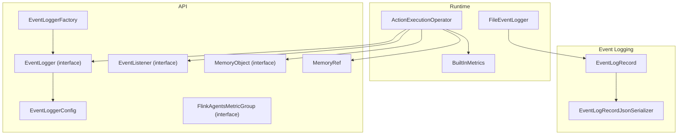
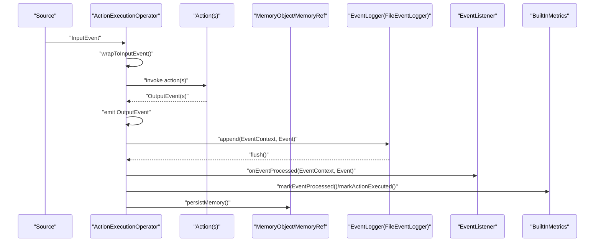
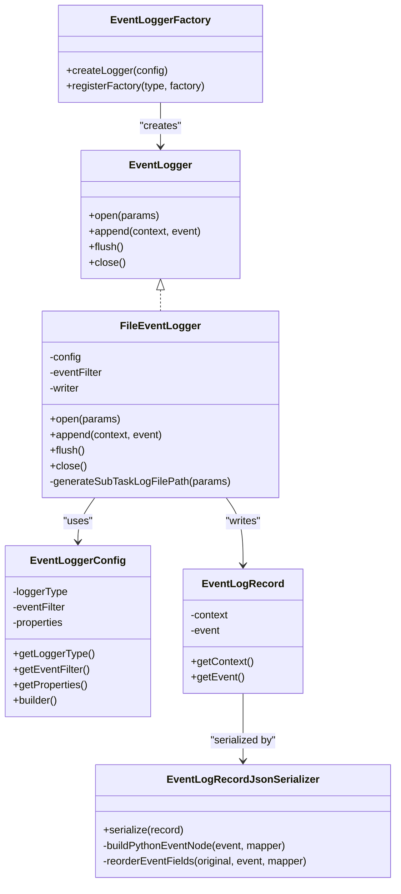
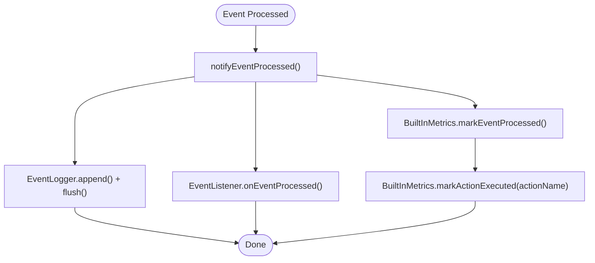
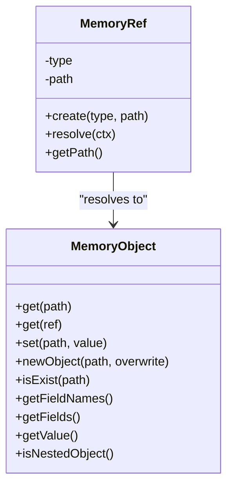
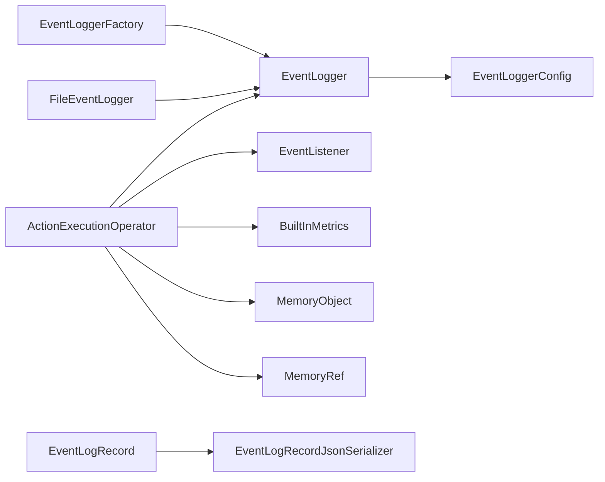
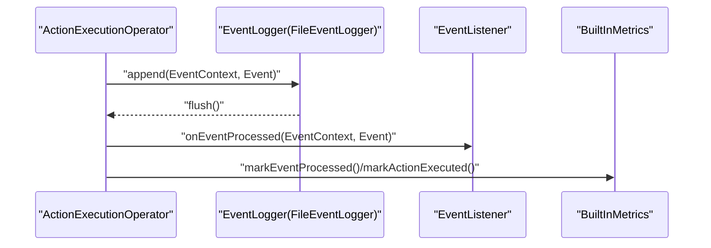

# Debugging and Troubleshooting

<cite>
**Referenced Files in This Document**
- [ActionExecutionOperator.java](file://runtime/src/main/java/org/apache/flink/agents/runtime/operator/ActionExecutionOperator.java)
- [FileEventLogger.java](file://runtime/src/main/java/org/apache/flink/agents/runtime/eventlog/FileEventLogger.java)
- [EventLogger.java](file://api/src/main/java/org/apache/flink/agents/api/logger/EventLogger.java)
- [EventLoggerConfig.java](file://api/src/main/java/org/apache/flink/agents/api/logger/EventLoggerConfig.java)
- [EventLoggerFactory.java](file://api/src/main/java/org/apache/flink/agents/api/logger/EventLoggerFactory.java)
- [EventLogRecord.java](file://runtime/src/main/java/org/apache/flink/agents/runtime/eventlog/EventLogRecord.java)
- [EventLogRecordJsonSerializer.java](file://runtime/src/main/java/org/apache/flink/agents/runtime/eventlog/EventLogRecordJsonSerializer.java)
- [EventListener.java](file://api/src/main/java/org/apache/flink/agents/api/listener/EventListener.java)
- [MemoryObject.java](file://api/src/main/java/org/apache/flink/agents/api/context/MemoryObject.java)
- [MemoryRef.java](file://api/src/main/java/org/apache/flink/agents/api/context/MemoryRef.java)
- [FlinkAgentsMetricGroup.java](file://api/src/main/java/org/apache/flink/agents/api/metrics/FlinkAgentsMetricGroup.java)
- [BuiltInMetrics.java](file://runtime/src/main/java/org/apache/flink/agents/runtime/metrics/BuiltInMetrics.java)
- [configuration.md](file://docs/content/docs/operations/configuration.md)
- [monitoring.md](file://docs/content/docs/operations/monitoring.md)
- [ActionExecutionOperatorTest.java](file://runtime/src/test/java/org/apache/flink/agents/runtime/operator/ActionExecutionOperatorTest.java)
- [FileEventLoggerTest.java](file://runtime/src/test/java/org/apache/flink/agents/runtime/eventlog/FileEventLoggerTest.java)
</cite>

## Table of Contents
1. [Introduction](#introduction)
2. [Project Structure](#project-structure)
3. [Core Components](#core-components)
4. [Architecture Overview](#architecture-overview)
5. [Detailed Component Analysis](#detailed-component-analysis)
6. [Dependency Analysis](#dependency-analysis)
7. [Performance Considerations](#performance-considerations)
8. [Troubleshooting Guide](#troubleshooting-guide)
9. [Conclusion](#conclusion)
10. [Appendices](#appendices)

## Introduction
This document provides a comprehensive troubleshooting and debugging guide for Flink Agents. It focuses on diagnosing agent execution issues, tracing event flows, and identifying performance bottlenecks. It explains how to use the event logging system for debugging, interpret feedback logs, and analyze agent behavior patterns. It covers common issues such as resource provider failures, memory management problems, cross-language communication errors, and integration failures. Step-by-step debugging workflows, diagnostic commands, and inspection techniques are included for agents, resources, and memory. Guidance is also provided on reading error messages, interpreting stack traces, and using Flink’s web interface for monitoring. Production debugging strategies, log analysis techniques, and escalation procedures for complex issues are outlined.

## Project Structure
Flink Agents integrates a streaming operator pipeline with event logging, metrics, and memory management. The runtime operator orchestrates event processing, while the API defines logging, filtering, and listener interfaces. Metrics expose built-in counters and meters. Memory abstractions provide structured access to short-term and sensory memory.

**Diagram sources**
- [ActionExecutionOperator.java](file://runtime/src/main/java/org/apache/flink/agents/runtime/operator/ActionExecutionOperator.java#L118-L236)
- [FileEventLogger.java](file://runtime/src/main/java/org/apache/flink/agents/runtime/eventlog/FileEventLogger.java#L77-L157)
- [EventLogger.java](file://api/src/main/java/org/apache/flink/agents/api/logger/EventLogger.java#L31-L79)
- [EventLoggerConfig.java](file://api/src/main/java/org/apache/flink/agents/api/logger/EventLoggerConfig.java#L45-L220)
- [EventLoggerFactory.java](file://api/src/main/java/org/apache/flink/agents/api/logger/EventLoggerFactory.java#L70-L153)
- [EventListener.java](file://api/src/main/java/org/apache/flink/agents/api/listener/EventListener.java#L35-L52)
- [MemoryObject.java](file://api/src/main/java/org/apache/flink/agents/api/context/MemoryObject.java#L29-L132)
- [MemoryRef.java](file://api/src/main/java/org/apache/flink/agents/api/context/MemoryRef.java#L28-L88)
- [FlinkAgentsMetricGroup.java](file://api/src/main/java/org/apache/flink/agents/api/metrics/FlinkAgentsMetricGroup.java#L30-L93)
- [EventLogRecord.java](file://runtime/src/main/java/org/apache/flink/agents/runtime/eventlog/EventLogRecord.java#L35-L53)
- [EventLogRecordJsonSerializer.java](file://runtime/src/main/java/org/apache/flink/agents/runtime/eventlog/EventLogRecordJsonSerializer.java#L95-L120)

**Section sources**
- [ActionExecutionOperator.java](file://runtime/src/main/java/org/apache/flink/agents/runtime/operator/ActionExecutionOperator.java#L118-L236)
- [configuration.md](file://docs/content/docs/operations/configuration.md#L122-L151)
- [monitoring.md](file://docs/content/docs/operations/monitoring.md#L25-L162)

## Core Components
- ActionExecutionOperator: Orchestrates event processing, action execution, memory updates, and logging. It initializes the event logger, notifies listeners, and tracks metrics.
- EventLogger and FileEventLogger: Provide structured event logging to files with JSON Lines format and per-subtask file naming.
- EventLoggerConfig and EventLoggerFactory: Configure and instantiate loggers with filters and properties.
- EventLogRecord and EventLogRecordJsonSerializer: Encapsulate and serialize event-context pairs for logging.
- EventListener: Callback interface invoked after event processing for monitoring and diagnostics.
- MemoryObject and MemoryRef: Abstractions for accessing and referencing memory items in short-term and sensory memory.
- FlinkAgentsMetricGroup and BuiltInMetrics: Expose counters and meters for event and action throughput.

**Section sources**
- [ActionExecutionOperator.java](file://runtime/src/main/java/org/apache/flink/agents/runtime/operator/ActionExecutionOperator.java#L372-L424)
- [EventLogger.java](file://api/src/main/java/org/apache/flink/agents/api/logger/EventLogger.java#L31-L79)
- [FileEventLogger.java](file://runtime/src/main/java/org/apache/flink/agents/runtime/eventlog/FileEventLogger.java#L77-L157)
- [EventLoggerConfig.java](file://api/src/main/java/org/apache/flink/agents/api/logger/EventLoggerConfig.java#L45-L220)
- [EventLoggerFactory.java](file://api/src/main/java/org/apache/flink/agents/api/logger/EventLoggerFactory.java#L70-L153)
- [EventLogRecord.java](file://runtime/src/main/java/org/apache/flink/agents/runtime/eventlog/EventLogRecord.java#L35-L53)
- [EventLogRecordJsonSerializer.java](file://runtime/src/main/java/org/apache/flink/agents/runtime/eventlog/EventLogRecordJsonSerializer.java#L95-L120)
- [EventListener.java](file://api/src/main/java/org/apache/flink/agents/api/listener/EventListener.java#L35-L52)
- [MemoryObject.java](file://api/src/main/java/org/apache/flink/agents/api/context/MemoryObject.java#L29-L132)
- [MemoryRef.java](file://api/src/main/java/org/apache/flink/agents/api/context/MemoryRef.java#L28-L88)
- [FlinkAgentsMetricGroup.java](file://api/src/main/java/org/apache/flink/agents/api/metrics/FlinkAgentsMetricGroup.java#L30-L93)
- [BuiltInMetrics.java](file://runtime/src/main/java/org/apache/flink/agents/runtime/metrics/BuiltInMetrics.java#L34-L73)

## Architecture Overview
The operator receives input events, wraps them, triggers actions, and emits outputs. During processing, it logs events, notifies listeners, and updates metrics. Memory updates are persisted upon action completion.

**Diagram sources**
- [ActionExecutionOperator.java](file://runtime/src/main/java/org/apache/flink/agents/runtime/operator/ActionExecutionOperator.java#L345-L424)
- [FileEventLogger.java](file://runtime/src/main/java/org/apache/flink/agents/runtime/eventlog/FileEventLogger.java#L123-L147)
- [EventListener.java](file://api/src/main/java/org/apache/flink/agents/api/listener/EventListener.java#L35-L52)
- [BuiltInMetrics.java](file://runtime/src/main/java/org/apache/flink/agents/runtime/metrics/BuiltInMetrics.java#L59-L71)
- [MemoryObject.java](file://api/src/main/java/org/apache/flink/agents/api/context/MemoryObject.java#L29-L132)

## Detailed Component Analysis

### Event Logging System
- Purpose: Capture and persist event flows for debugging and auditing.
- Implementation: File-based logger writes JSON Lines records with EventLogRecord serialization.
- Configuration: EventLoggerConfig supports logger type, event filter, and properties. Factory registers and instantiates loggers.
- Filtering: EventFilter applied per-event to reduce log volume.
- File Naming: Per-subtask naming aligned with Flink logging conventions.

**Diagram sources**
- [EventLogger.java](file://api/src/main/java/org/apache/flink/agents/api/logger/EventLogger.java#L31-L79)
- [FileEventLogger.java](file://runtime/src/main/java/org/apache/flink/agents/runtime/eventlog/FileEventLogger.java#L77-L157)
- [EventLoggerConfig.java](file://api/src/main/java/org/apache/flink/agents/api/logger/EventLoggerConfig.java#L45-L220)
- [EventLoggerFactory.java](file://api/src/main/java/org/apache/flink/agents/api/logger/EventLoggerFactory.java#L70-L153)
- [EventLogRecord.java](file://runtime/src/main/java/org/apache/flink/agents/runtime/eventlog/EventLogRecord.java#L35-L53)
- [EventLogRecordJsonSerializer.java](file://runtime/src/main/java/org/apache/flink/agents/runtime/eventlog/EventLogRecordJsonSerializer.java#L95-L120)

**Section sources**
- [EventLogger.java](file://api/src/main/java/org/apache/flink/agents/api/logger/EventLogger.java#L31-L79)
- [FileEventLogger.java](file://runtime/src/main/java/org/apache/flink/agents/runtime/eventlog/FileEventLogger.java#L77-L157)
- [EventLoggerConfig.java](file://api/src/main/java/org/apache/flink/agents/api/logger/EventLoggerConfig.java#L45-L220)
- [EventLoggerFactory.java](file://api/src/main/java/org/apache/flink/agents/api/logger/EventLoggerFactory.java#L70-L153)
- [EventLogRecord.java](file://runtime/src/main/java/org/apache/flink/agents/runtime/eventlog/EventLogRecord.java#L35-L53)
- [EventLogRecordJsonSerializer.java](file://runtime/src/main/java/org/apache/flink/agents/runtime/eventlog/EventLogRecordJsonSerializer.java#L95-L120)

### Event Listener and Metrics
- EventListener: Lightweight callback invoked after event processing; avoid blocking operations.
- Built-in Metrics: Counters and meters for events processed and actions executed per second; per-action metrics grouped under the agent metric group.

**Diagram sources**
- [ActionExecutionOperator.java](file://runtime/src/main/java/org/apache/flink/agents/runtime/operator/ActionExecutionOperator.java#L407-L424)
- [EventListener.java](file://api/src/main/java/org/apache/flink/agents/api/listener/EventListener.java#L35-L52)
- [BuiltInMetrics.java](file://runtime/src/main/java/org/apache/flink/agents/runtime/metrics/BuiltInMetrics.java#L59-L71)

**Section sources**
- [EventListener.java](file://api/src/main/java/org/apache/flink/agents/api/listener/EventListener.java#L35-L52)
- [BuiltInMetrics.java](file://runtime/src/main/java/org/apache/flink/agents/runtime/metrics/BuiltInMetrics.java#L34-L73)
- [ActionExecutionOperator.java](file://runtime/src/main/java/org/apache/flink/agents/runtime/operator/ActionExecutionOperator.java#L407-L424)

### Memory Management
- MemoryObject: Provides get/set/newObject/getFields/getValue/isNestedObject for structured memory access.
- MemoryRef: Serializable reference to memory items enabling efficient passing between actions.
- Persistence: Memory is persisted when an action task finishes.

**Diagram sources**
- [MemoryObject.java](file://api/src/main/java/org/apache/flink/agents/api/context/MemoryObject.java#L29-L132)
- [MemoryRef.java](file://api/src/main/java/org/apache/flink/agents/api/context/MemoryRef.java#L28-L88)

**Section sources**
- [MemoryObject.java](file://api/src/main/java/org/apache/flink/agents/api/context/MemoryObject.java#L29-L132)
- [MemoryRef.java](file://api/src/main/java/org/apache/flink/agents/api/context/MemoryRef.java#L28-L88)
- [ActionExecutionOperator.java](file://runtime/src/main/java/org/apache/flink/agents/runtime/operator/ActionExecutionOperator.java#L536-L538)

## Dependency Analysis
- ActionExecutionOperator depends on EventLogger, EventListener, BuiltInMetrics, MemoryObject, and MemoryRef.
- EventLoggerFactory provides pluggable logger creation; FileEventLogger implements EventLogger.
- EventLogRecord encapsulates Event and EventContext; JSON serializer handles polymorphic event types.

**Diagram sources**
- [ActionExecutionOperator.java](file://runtime/src/main/java/org/apache/flink/agents/runtime/operator/ActionExecutionOperator.java#L118-L236)
- [EventLogger.java](file://api/src/main/java/org/apache/flink/agents/api/logger/EventLogger.java#L31-L79)
- [EventLoggerConfig.java](file://api/src/main/java/org/apache/flink/agents/api/logger/EventLoggerConfig.java#L45-L220)
- [EventLoggerFactory.java](file://api/src/main/java/org/apache/flink/agents/api/logger/EventLoggerFactory.java#L70-L153)
- [FileEventLogger.java](file://runtime/src/main/java/org/apache/flink/agents/runtime/eventlog/FileEventLogger.java#L77-L157)
- [EventLogRecord.java](file://runtime/src/main/java/org/apache/flink/agents/runtime/eventlog/EventLogRecord.java#L35-L53)
- [EventLogRecordJsonSerializer.java](file://runtime/src/main/java/org/apache/flink/agents/runtime/eventlog/EventLogRecordJsonSerializer.java#L95-L120)

**Section sources**
- [ActionExecutionOperator.java](file://runtime/src/main/java/org/apache/flink/agents/runtime/operator/ActionExecutionOperator.java#L118-L236)
- [EventLoggerFactory.java](file://api/src/main/java/org/apache/flink/agents/api/logger/EventLoggerFactory.java#L70-L153)

## Performance Considerations
- Event logging overhead: Immediate flush per event ensures visibility but increases I/O. Consider tuning logging frequency or batching in high-throughput scenarios.
- Asynchronous execution: Built-in async options for chat, tool calls, and retrieval can improve latency; monitor metrics for saturation.
- Memory persistence: Persisting memory on action completion reduces risk but adds state operations; ensure state backend performance matches workload.
- Metrics granularity: Use per-action metrics to isolate hotspots; watch event and action rates to detect backpressure.

[No sources needed since this section provides general guidance]

## Troubleshooting Guide

### Systematic Approaches to Diagnose Agent Execution Issues
- Verify configuration precedence and correctness:
  - Confirm AgentsExecutionEnvironment vs. Flink YAML configuration loading and overrides.
  - Validate built-in options such as baseLogDir, error-handling-strategy, and async toggles.
- Inspect event logs:
  - Locate per-subtask log files using the naming convention and base directory.
  - Filter events using EventLoggerConfig filters to focus on relevant flows.
- Monitor metrics:
  - Track event and action rates; watch for drops indicating backpressure or stalls.
  - Drill down into per-action metrics to identify problematic actions.
- Trace memory state:
  - Use MemoryObject APIs to inspect and validate memory updates across actions.
  - Resolve MemoryRef references to confirm data availability.

**Section sources**
- [configuration.md](file://docs/content/docs/operations/configuration.md#L25-L151)
- [monitoring.md](file://docs/content/docs/operations/monitoring.md#L25-L162)
- [FileEventLogger.java](file://runtime/src/main/java/org/apache/flink/agents/runtime/eventlog/FileEventLogger.java#L106-L121)
- [EventLoggerConfig.java](file://api/src/main/java/org/apache/flink/agents/api/logger/EventLoggerConfig.java#L68-L108)
- [BuiltInMetrics.java](file://runtime/src/main/java/org/apache/flink/agents/runtime/metrics/BuiltInMetrics.java#L34-L73)
- [MemoryObject.java](file://api/src/main/java/org/apache/flink/agents/api/context/MemoryObject.java#L29-L132)
- [MemoryRef.java](file://api/src/main/java/org/apache/flink/agents/api/context/MemoryRef.java#L28-L88)

### Tracing Event Flows Through the System
- Use ActionExecutionOperator logs and listener callbacks to trace event lifecycles.
- Correlate timestamps and sequence numbers to identify delays.
- Replay logs to reconstruct end-to-end flows.

**Diagram sources**
- [ActionExecutionOperator.java](file://runtime/src/main/java/org/apache/flink/agents/runtime/operator/ActionExecutionOperator.java#L407-L424)
- [FileEventLogger.java](file://runtime/src/main/java/org/apache/flink/agents/runtime/eventlog/FileEventLogger.java#L123-L147)
- [EventListener.java](file://api/src/main/java/org/apache/flink/agents/api/listener/EventListener.java#L35-L52)
- [BuiltInMetrics.java](file://runtime/src/main/java/org/apache/flink/agents/runtime/metrics/BuiltInMetrics.java#L59-L71)

### Identifying Performance Bottlenecks
- Symptom: Low event/sec or action/sec rates.
  - Check BuiltInMetrics counters and meters.
  - Investigate backpressure indicators and operator lag.
- Symptom: Elevated latency in specific actions.
  - Compare per-action metrics to isolate slow actions.
  - Review action logic and external integrations.
- Symptom: High I/O or disk pressure.
  - Evaluate event logging frequency and baseLogDir location.
  - Consider reducing log verbosity or adjusting filters.

**Section sources**
- [BuiltInMetrics.java](file://runtime/src/main/java/org/apache/flink/agents/runtime/metrics/BuiltInMetrics.java#L34-L73)
- [monitoring.md](file://docs/content/docs/operations/monitoring.md#L25-L162)

### Using the Event Logging System for Debugging
- Enable file-based event logging and adjust filters to reduce noise.
- Inspect EventLogRecord entries for event types, timestamps, and context.
- For Python events, rely on JSON serializer fallbacks and field reordering.

**Section sources**
- [EventLoggerConfig.java](file://api/src/main/java/org/apache/flink/agents/api/logger/EventLoggerConfig.java#L68-L108)
- [EventLogRecord.java](file://runtime/src/main/java/org/apache/flink/agents/runtime/eventlog/EventLogRecord.java#L35-L53)
- [EventLogRecordJsonSerializer.java](file://runtime/src/main/java/org/apache/flink/agents/runtime/eventlog/EventLogRecordJsonSerializer.java#L95-L120)
- [FileEventLogger.java](file://runtime/src/main/java/org/apache/flink/agents/runtime/eventlog/FileEventLogger.java#L123-L147)

### Interpreting Feedback Logs and Analyzing Patterns
- Look for recurring patterns in event types and timings.
- Correlate log entries with metrics spikes or dips.
- Use EventLoggerConfig filters to focus on specific event categories.

**Section sources**
- [EventLoggerConfig.java](file://api/src/main/java/org/apache/flink/agents/api/logger/EventLoggerConfig.java#L68-L108)
- [ActionExecutionOperator.java](file://runtime/src/main/java/org/apache/flink/agents/runtime/operator/ActionExecutionOperator.java#L407-L424)

### Common Issues and Remediation

#### Resource Provider Failures
- Symptoms: Exceptions when retrieving resources, timeouts, or adapter misconfiguration.
- Steps:
  - Verify resource provider registration and availability in the agent plan.
  - Check Python resource adapter initialization and environment manager setup.
  - Confirm resource descriptors and serializability.
- Tests:
  - Use operator tests to validate resource resolution and adapter behavior.

**Section sources**
- [ActionExecutionOperator.java](file://runtime/src/main/java/org/apache/flink/agents/runtime/operator/ActionExecutionOperator.java#L604-L610)
- [ActionExecutionOperator.java](file://runtime/src/main/java/org/apache/flink/agents/runtime/operator/ActionExecutionOperator.java#L612-L688)
- [ActionExecutionOperatorTest.java](file://runtime/src/test/java/org/apache/flink/agents/runtime/operator/ActionExecutionOperatorTest.java)

#### Memory Management Problems
- Symptoms: Missing data, incorrect updates, or persistence failures.
- Steps:
  - Inspect MemoryObject operations (get/set/newObject) and MemoryRef resolution.
  - Validate memory persistence on action completion.
  - Check state backend health and capacity.
- Tests:
  - Use memory-related tests to validate MemoryObject and MemoryRef behavior.

**Section sources**
- [MemoryObject.java](file://api/src/main/java/org/apache/flink/agents/api/context/MemoryObject.java#L29-L132)
- [MemoryRef.java](file://api/src/main/java/org/apache/flink/agents/api/context/MemoryRef.java#L28-L88)
- [ActionExecutionOperator.java](file://runtime/src/main/java/org/apache/flink/agents/runtime/operator/ActionExecutionOperator.java#L536-L538)
- [FileEventLoggerTest.java](file://runtime/src/test/java/org/apache/flink/agents/runtime/eventlog/FileEventLoggerTest.java)

#### Cross-Language Communication Errors
- Symptoms: Python interpreter initialization failures, adapter errors, or serialization issues.
- Steps:
  - Confirm Python environment manager and interpreter setup.
  - Validate PythonActionExecutor and adapters for Java/Python interop.
  - Inspect JSON serialization for Python events.
- Tests:
  - Use cross-language tests to validate MCP and resource integrations.

**Section sources**
- [ActionExecutionOperator.java](file://runtime/src/main/java/org/apache/flink/agents/runtime/operator/ActionExecutionOperator.java#L612-L688)
- [EventLogRecordJsonSerializer.java](file://runtime/src/main/java/org/apache/flink/agents/runtime/eventlog/EventLogRecordJsonSerializer.java#L95-L120)

#### Integration Failures
- Symptoms: Chat model, embedding, or vector store integration errors.
- Steps:
  - Validate integration setup and credentials.
  - Check async configuration and timeouts.
  - Review integration-specific metrics and logs.
- Tests:
  - Use integration tests to validate end-to-end flows.

**Section sources**
- [configuration.md](file://docs/content/docs/operations/configuration.md#L122-L151)
- [monitoring.md](file://docs/content/docs/operations/monitoring.md#L25-L162)

### Step-by-Step Debugging Workflows

#### Workflow 1: Diagnose Slowdowns
1. Observe BuiltInMetrics for event/sec and action/sec.
2. Drill down into per-action metrics to identify bottlenecks.
3. Enable event logging with filters to capture relevant events.
4. Inspect logs for delays and correlate with memory updates.
5. Adjust async settings or scale resources accordingly.

**Section sources**
- [BuiltInMetrics.java](file://runtime/src/main/java/org/apache/flink/agents/runtime/metrics/BuiltInMetrics.java#L34-L73)
- [EventLoggerConfig.java](file://api/src/main/java/org/apache/flink/agents/api/logger/EventLoggerConfig.java#L68-L108)
- [monitoring.md](file://docs/content/docs/operations/monitoring.md#L25-L162)

#### Workflow 2: Investigate Missing Data
1. Verify MemoryObject operations and MemoryRef resolution.
2. Confirm memory persistence on action completion.
3. Check state backend health and capacity.
4. Use event logs to trace data flow and pinpoint missing updates.

**Section sources**
- [MemoryObject.java](file://api/src/main/java/org/apache/flink/agents/api/context/MemoryObject.java#L29-L132)
- [MemoryRef.java](file://api/src/main/java/org/apache/flink/agents/api/context/MemoryRef.java#L28-L88)
- [ActionExecutionOperator.java](file://runtime/src/main/java/org/apache/flink/agents/runtime/operator/ActionExecutionOperator.java#L536-L538)

#### Workflow 3: Resolve Resource Provider Issues
1. Validate resource provider registration and descriptors.
2. Confirm Python resource adapter initialization.
3. Run operator tests to reproduce and isolate failures.
4. Adjust configuration and retry logic as needed.

**Section sources**
- [ActionExecutionOperator.java](file://runtime/src/main/java/org/apache/flink/agents/runtime/operator/ActionExecutionOperator.java#L604-L610)
- [ActionExecutionOperator.java](file://runtime/src/main/java/org/apache/flink/agents/runtime/operator/ActionExecutionOperator.java#L612-L688)
- [ActionExecutionOperatorTest.java](file://runtime/src/test/java/org/apache/flink/agents/runtime/operator/ActionExecutionOperatorTest.java)

#### Workflow 4: Debug Cross-Language Communication
1. Verify Python environment manager and interpreter setup.
2. Inspect PythonActionExecutor and adapters.
3. Review JSON serialization for Python events.
4. Use cross-language tests to validate integrations.

**Section sources**
- [ActionExecutionOperator.java](file://runtime/src/main/java/org/apache/flink/agents/runtime/operator/ActionExecutionOperator.java#L612-L688)
- [EventLogRecordJsonSerializer.java](file://runtime/src/main/java/org/apache/flink/agents/runtime/eventlog/EventLogRecordJsonSerializer.java#L95-L120)

### Diagnostic Commands and Inspection Techniques
- Flink Web UI:
  - Use metric identifiers to inspect event and action rates.
  - Navigate to TaskManager logs and operator logs for detailed traces.
- Local/MiniCluster:
  - Export FLINK_CONF_DIR for YAML loading.
  - Use AgentsExecutionEnvironment.get_configuration() to load YAML directly.
- Log Locations:
  - Per-subtask event logs stored under baseLogDir with structured filenames.

**Section sources**
- [monitoring.md](file://docs/content/docs/operations/monitoring.md#L112-L141)
- [configuration.md](file://docs/content/docs/operations/configuration.md#L82-L121)
- [FileEventLogger.java](file://runtime/src/main/java/org/apache/flink/agents/runtime/eventlog/FileEventLogger.java#L106-L121)

### Reading Error Messages and Interpreting Stack Traces
- ActionExecutionOperator wraps exceptions and rethrows them via mailbox execution to surface actionable errors.
- Use stack traces to identify failing actions, resource adapters, or Python environments.
- Combine with event logs and metrics to reconstruct failure timelines.

**Section sources**
- [ActionExecutionOperator.java](file://runtime/src/main/java/org/apache/flink/agents/runtime/operator/ActionExecutionOperator.java#L426-L437)

### Production Debugging Strategies, Log Analysis, and Escalation
- Production Debugging:
  - Reduce log verbosity in high-volume jobs; use filters and sampling.
  - Monitor BuiltInMetrics continuously; alert on sustained drops.
  - Use EventLoggerConfig to tailor logs for specific failure domains.
- Log Analysis:
  - Parse JSON Lines logs; extract timestamps, event types, and correlation IDs.
  - Correlate with metrics to identify root causes.
- Escalation Procedures:
  - Capture operator state snapshots and logs.
  - Provide configuration, metrics, and representative log samples.
  - Engage integration owners for model/provider-specific issues.

**Section sources**
- [EventLoggerConfig.java](file://api/src/main/java/org/apache/flink/agents/api/logger/EventLoggerConfig.java#L68-L108)
- [BuiltInMetrics.java](file://runtime/src/main/java/org/apache/flink/agents/runtime/metrics/BuiltInMetrics.java#L34-L73)
- [monitoring.md](file://docs/content/docs/operations/monitoring.md#L25-L162)

## Conclusion
Effective debugging of Flink Agents requires a combination of structured event logging, robust metrics, and disciplined memory management. By leveraging the event logging system, BuiltInMetrics, and MemoryObject abstractions, teams can systematically diagnose agent execution issues, trace event flows, and identify performance bottlenecks. Applying the step-by-step workflows and escalation procedures outlined here will improve incident response and operational reliability in production environments.

[No sources needed since this section summarizes without analyzing specific files]

## Appendices

### Appendix A: Key Configuration Options
- baseLogDir: Base directory for file-based event logs.
- error-handling-strategy: fail, retry, ignore.
- max-retries: Number of retries when using retry strategy.
- chat.async, tool-call.async, rag.async: Toggle async behavior for built-in actions.
- num-async-threads: Async executor thread pool size.
- job-identifier: Unique job identifier for long-term memory visibility.

**Section sources**
- [configuration.md](file://docs/content/docs/operations/configuration.md#L122-L151)

### Appendix B: Built-in Metrics Reference
- Agent-level:
  - numOfEventProcessed: Total events processed.
  - numOfEventProcessedPerSec: Events per second.
  - numOfActionsExecuted: Total actions executed.
  - numOfActionsExecutedPerSec: Actions per second.
- Action-level:
  - <action_name>.numOfActionsExecuted and per-second variants.

**Section sources**
- [monitoring.md](file://docs/content/docs/operations/monitoring.md#L25-L162)
- [BuiltInMetrics.java](file://runtime/src/main/java/org/apache/flink/agents/runtime/metrics/BuiltInMetrics.java#L34-L73)