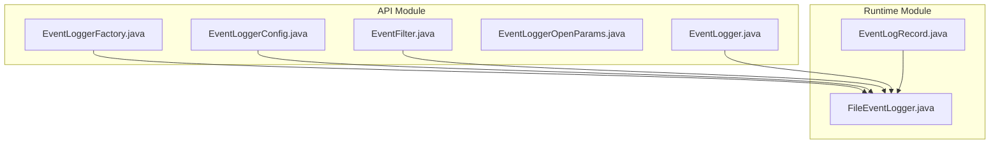
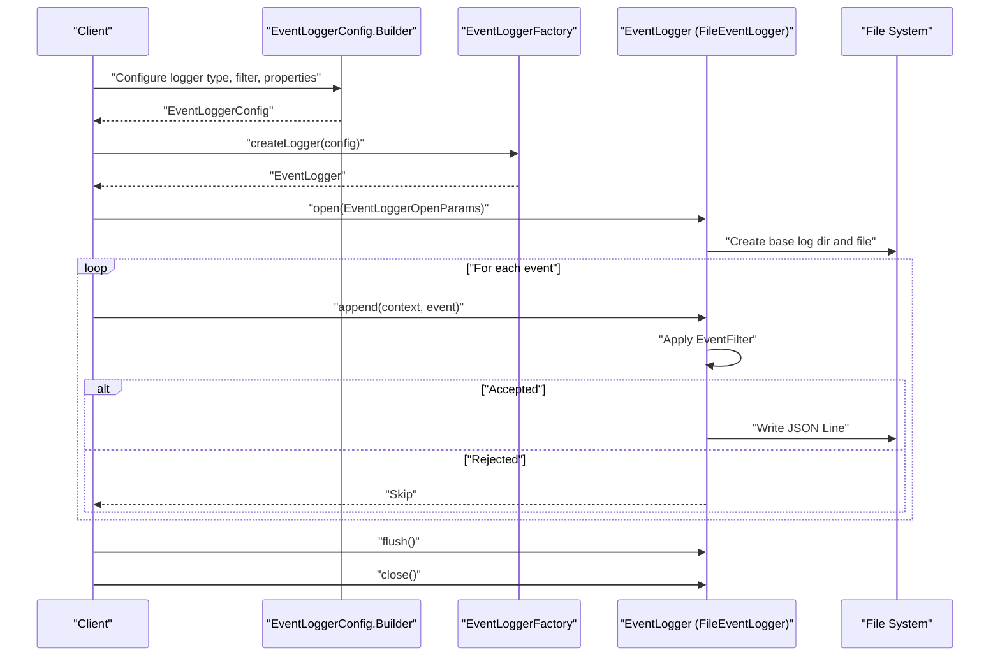
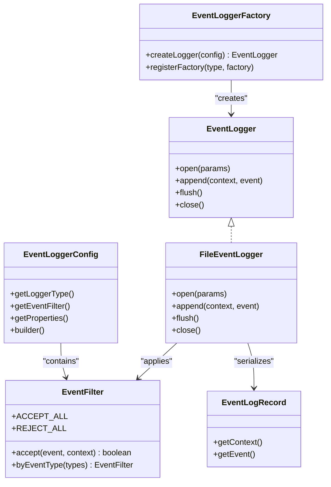
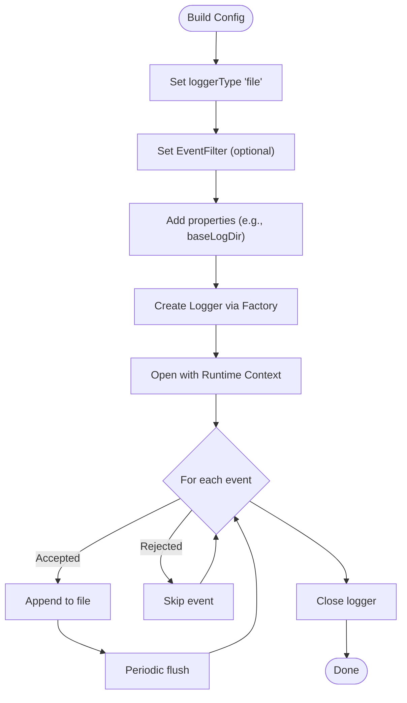
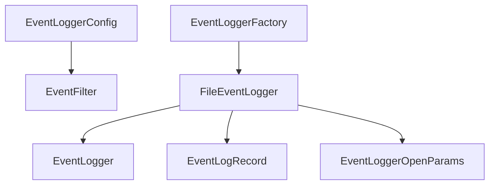

# Event Logging System

<cite>
**Referenced Files in This Document**
- [EventLogger.java](file://api/src/main/java/org/apache/flink/agents/api/logger/EventLogger.java)
- [EventLoggerConfig.java](file://api/src/main/java/org/apache/flink/agents/api/logger/EventLoggerConfig.java)
- [EventLoggerFactory.java](file://api/src/main/java/org/apache/flink/agents/api/logger/EventLoggerFactory.java)
- [EventLoggerOpenParams.java](file://api/src/main/java/org/apache/flink/agents/api/logger/EventLoggerOpenParams.java)
- [EventFilter.java](file://api/src/main/java/org/apache/flink/agents/api/EventFilter.java)
- [FileEventLogger.java](file://runtime/src/main/java/org/apache/flink/agents/runtime/eventlog/FileEventLogger.java)
- [EventLogRecord.java](file://runtime/src/main/java/org/apache/flink/agents/runtime/eventlog/EventLogRecord.java)
- [FileEventLoggerTest.java](file://runtime/src/test/java/org/apache/flink/agents/runtime/eventlog/FileEventLoggerTest.java)
</cite>

## Table of Contents
1. [Introduction](#introduction)
2. [Project Structure](#project-structure)
3. [Core Components](#core-components)
4. [Architecture Overview](#architecture-overview)
5. [Detailed Component Analysis](#detailed-component-analysis)
6. [Dependency Analysis](#dependency-analysis)
7. [Performance Considerations](#performance-considerations)
8. [Troubleshooting Guide](#troubleshooting-guide)
9. [Conclusion](#conclusion)

## Introduction
This document describes the Flink Agents event logging system. It focuses on the EventLogger interface and its implementations, the EventLoggerConfig builder pattern, and the EventLoggerFactory registry mechanism. It explains how to configure file-based logging, customize event filtering, implement custom loggers via factory registration, and meet event-driven architecture logging requirements such as serialization, aggregation, and performance. Practical examples are provided for setting up file-based logging, configuring log directories, registering custom logger factories, and filtering sensitive events. Thread safety, error handling, and integration with external logging frameworks are also covered.

## Project Structure
The event logging system spans two modules:
- API module: Defines the logging contract, configuration, factory, and filter interfaces.
- Runtime module: Provides the built-in file-based logger implementation and supporting record types.

**Diagram sources**
- [EventLogger.java](file://api/src/main/java/org/apache/flink/agents/api/logger/EventLogger.java#L31-L78)
- [EventLoggerConfig.java](file://api/src/main/java/org/apache/flink/agents/api/logger/EventLoggerConfig.java#L45-L219)
- [EventLoggerFactory.java](file://api/src/main/java/org/apache/flink/agents/api/logger/EventLoggerFactory.java#L68-L186)
- [EventLoggerOpenParams.java](file://api/src/main/java/org/apache/flink/agents/api/logger/EventLoggerOpenParams.java#L23-L33)
- [EventFilter.java](file://api/src/main/java/org/apache/flink/agents/api/EventFilter.java#L27-L61)
- [FileEventLogger.java](file://runtime/src/main/java/org/apache/flink/agents/runtime/eventlog/FileEventLogger.java#L77-L157)
- [EventLogRecord.java](file://runtime/src/main/java/org/apache/flink/agents/runtime/eventlog/EventLogRecord.java#L37-L53)

**Section sources**
- [EventLogger.java](file://api/src/main/java/org/apache/flink/agents/api/logger/EventLogger.java#L24-L78)
- [EventLoggerConfig.java](file://api/src/main/java/org/apache/flink/agents/api/logger/EventLoggerConfig.java#L28-L219)
- [EventLoggerFactory.java](file://api/src/main/java/org/apache/flink/agents/api/logger/EventLoggerFactory.java#L26-L186)
- [EventLoggerOpenParams.java](file://api/src/main/java/org/apache/flink/agents/api/logger/EventLoggerOpenParams.java#L23-L33)
- [EventFilter.java](file://api/src/main/java/org/apache/flink/agents/api/EventFilter.java#L27-L61)
- [FileEventLogger.java](file://runtime/src/main/java/org/apache/flink/agents/runtime/eventlog/FileEventLogger.java#L36-L157)
- [EventLogRecord.java](file://runtime/src/main/java/org/apache/flink/agents/runtime/eventlog/EventLogRecord.java#L26-L53)

## Core Components
- EventLogger: The logging contract with open, append, flush, and close lifecycle methods.
- EventLoggerConfig: Fluent builder for logger configuration including logger type, event filter, and properties.
- EventLoggerFactory: Registry-based factory for creating EventLogger instances by type, with built-in file logger support.
- EventLoggerOpenParams: Encapsulates the Flink runtime context passed to open.
- EventFilter: Functional interface for event filtering with convenience utilities.
- FileEventLogger: Built-in file-based logger implementation that writes JSON Lines per subtask.
- EventLogRecord: Wrapper for serialized event logging with polymorphic JSON handling.

Key responsibilities:
- EventLogger defines the logging lifecycle and operations.
- EventLoggerConfig centralizes configuration and validation.
- EventLoggerFactory decouples logger instantiation from usage.
- EventFilter controls which events are logged.
- FileEventLogger implements file-based persistence with thread-safety considerations.

**Section sources**
- [EventLogger.java](file://api/src/main/java/org/apache/flink/agents/api/logger/EventLogger.java#L31-L78)
- [EventLoggerConfig.java](file://api/src/main/java/org/apache/flink/agents/api/logger/EventLoggerConfig.java#L45-L219)
- [EventLoggerFactory.java](file://api/src/main/java/org/apache/flink/agents/api/logger/EventLoggerFactory.java#L68-L186)
- [EventLoggerOpenParams.java](file://api/src/main/java/org/apache/flink/agents/api/logger/EventLoggerOpenParams.java#L23-L33)
- [EventFilter.java](file://api/src/main/java/org/apache/flink/agents/api/EventFilter.java#L27-L61)
- [FileEventLogger.java](file://runtime/src/main/java/org/apache/flink/agents/runtime/eventlog/FileEventLogger.java#L77-L157)
- [EventLogRecord.java](file://runtime/src/main/java/org/apache/flink/agents/runtime/eventlog/EventLogRecord.java#L37-L53)

## Architecture Overview
The system follows a contract-driven architecture:
- Clients configure an EventLoggerConfig and optionally set an EventFilter.
- EventLoggerFactory resolves the logger implementation by type and constructs it with the configuration.
- FileEventLogger (or other implementations) receive open with runtime context, append filtered events, and flush/close as needed.

**Diagram sources**
- [EventLoggerConfig.java](file://api/src/main/java/org/apache/flink/agents/api/logger/EventLoggerConfig.java#L144-L219)
- [EventLoggerFactory.java](file://api/src/main/java/org/apache/flink/agents/api/logger/EventLoggerFactory.java#L92-L119)
- [FileEventLogger.java](file://runtime/src/main/java/org/apache/flink/agents/runtime/eventlog/FileEventLogger.java#L94-L155)

## Detailed Component Analysis

### EventLogger Interface
Responsibilities:
- Lifecycle: open, append, flush, close.
- Contract: receives EventContext and Event, persists them.

Thread safety:
- Not specified by the interface; implementations must document their guarantees.

Error handling:
- Methods declare Exception, enabling robust failure reporting.

Practical usage:
- Implementations must guard against uninitialized state (e.g., append without open).

**Section sources**
- [EventLogger.java](file://api/src/main/java/org/apache/flink/agents/api/logger/EventLogger.java#L31-L78)

### EventLoggerConfig Builder Pattern
Key features:
- loggerType: identifies the logger implementation (default "file").
- eventFilter: applied to decide whether to log each event (defaults to accept-all).
- properties: map of implementation-specific settings (e.g., base log directory for file logger).

Validation:
- Builder validates non-empty loggerType and non-null values for properties.
- Properties map is copied and made immutable.

Usage examples:
- Configure file-based logging with a base directory.
- Combine with EventFilter to restrict logging to specific event types.

**Section sources**
- [EventLoggerConfig.java](file://api/src/main/java/org/apache/flink/agents/api/logger/EventLoggerConfig.java#L45-L219)

### EventLoggerFactory Registry System
Registry:
- ConcurrentHashMap maps logger type to a factory function.
- Built-in factory registration for "file" logger via reflection.

Thread safety:
- Factory is thread-safe; registry operations are atomic.

Custom factories:
- registerFactory allows adding custom logger implementations.
- createLogger resolves the factory by type and constructs the logger.

Error handling:
- Throws IllegalArgumentException for invalid inputs.
- Wraps factory exceptions in RuntimeException with context.

**Section sources**
- [EventLoggerFactory.java](file://api/src/main/java/org/apache/flink/agents/api/logger/EventLoggerFactory.java#L68-L186)

### EventFilter
Capabilities:
- accept(Event, EventContext): predicate-based filtering.
- byEventType(...): convenience to accept only specified types.
- ACCEPT_ALL and REJECT_ALL constants.

Integration:
- Used by FileEventLogger to decide whether to serialize and write an event.

**Section sources**
- [EventFilter.java](file://api/src/main/java/org/apache/flink/agents/api/EventFilter.java#L27-L61)

### FileEventLogger Implementation
Logging behavior:
- JSON Lines format per event.
- Structured file naming aligned with Flink conventions: events-{jobId}-{taskName}-{subtaskId}.log.
- Default base log directory falls back to a temporary directory if not configured.

Open/Append/Flush/Close:
- open creates base directory and initializes writer.
- append applies filter, serializes to JSON, and writes a line.
- flush ensures buffered data is persisted.
- close flushes and closes the writer.

Thread safety:
- Documented as thread-safe at the Flink subtask level due to single-threaded mailbox execution per subtask.

Error handling:
- Validates initialization before operations.
- Relies on Jackson for serialization; errors propagate as exceptions.

**Section sources**
- [FileEventLogger.java](file://runtime/src/main/java/org/apache/flink/agents/runtime/eventlog/FileEventLogger.java#L77-L157)
- [EventLogRecord.java](file://runtime/src/main/java/org/apache/flink/agents/runtime/eventlog/EventLogRecord.java#L37-L53)

### EventLogRecord Serialization
Structure:
- Holds EventContext and Event for logging.
- Uses custom JSON serializer/deserializer to preserve polymorphic event types.

Implications:
- Enables structured retrieval and downstream processing of logged events.

**Section sources**
- [EventLogRecord.java](file://runtime/src/main/java/org/apache/flink/agents/runtime/eventlog/EventLogRecord.java#L37-L53)

## Architecture Overview

**Diagram sources**
- [EventLogger.java](file://api/src/main/java/org/apache/flink/agents/api/logger/EventLogger.java#L31-L78)
- [EventLoggerConfig.java](file://api/src/main/java/org/apache/flink/agents/api/logger/EventLoggerConfig.java#L45-L219)
- [EventLoggerFactory.java](file://api/src/main/java/org/apache/flink/agents/api/logger/EventLoggerFactory.java#L68-L186)
- [EventFilter.java](file://api/src/main/java/org/apache/flink/agents/api/EventFilter.java#L27-L61)
- [FileEventLogger.java](file://runtime/src/main/java/org/apache/flink/agents/runtime/eventlog/FileEventLogger.java#L77-L157)
- [EventLogRecord.java](file://runtime/src/main/java/org/apache/flink/agents/runtime/eventlog/EventLogRecord.java#L37-L53)

## Detailed Component Analysis

### File-Based Logging Setup
Steps:
- Build EventLoggerConfig with loggerType "file".
- Optionally set baseLogDir property and EventFilter.
- Create logger via EventLoggerFactory.createLogger(config).
- Open with EventLoggerOpenParams containing the Flink runtime context.
- Append events; flush periodically; close on completion.

**Diagram sources**
- [EventLoggerConfig.java](file://api/src/main/java/org/apache/flink/agents/api/logger/EventLoggerConfig.java#L144-L219)
- [EventLoggerFactory.java](file://api/src/main/java/org/apache/flink/agents/api/logger/EventLoggerFactory.java#L92-L119)
- [FileEventLogger.java](file://runtime/src/main/java/org/apache/flink/agents/runtime/eventlog/FileEventLogger.java#L94-L155)

**Section sources**
- [FileEventLoggerTest.java](file://runtime/src/test/java/org/apache/flink/agents/runtime/eventlog/FileEventLoggerTest.java#L437-L495)

### Custom Logger Factory Registration
To implement a custom logger:
- Implement EventLogger.
- Register a factory function with EventLoggerFactory.registerFactory("your-type", cfg -> new YourLogger(cfg)).
- Use EventLoggerConfig.builder().loggerType("your-type") to select it.

Benefits:
- Extends the system without modifying the API.
- Supports diverse backends (e.g., database, Kafka, cloud sinks).

**Section sources**
- [EventLoggerFactory.java](file://api/src/main/java/org/apache/flink/agents/api/logger/EventLoggerFactory.java#L135-L143)

### Event Filtering and Sensitive Data Handling
- Use EventFilter.byEventType(...) to log only specific event types.
- Implement a custom EventFilter to exclude sensitive payloads or metadata.
- Default behavior logs everything (ACCEPT_ALL); explicitly configure filters for production.

Validation:
- Tests confirm default filter logs all events and custom filters selectively log.

**Section sources**
- [EventFilter.java](file://api/src/main/java/org/apache/flink/agents/api/EventFilter.java#L44-L61)
- [FileEventLoggerTest.java](file://runtime/src/test/java/org/apache/flink/agents/runtime/eventlog/FileEventLoggerTest.java#L466-L495)

### Event Serialization and Log Aggregation
- FileEventLogger writes JSON Lines; each line is a serialized EventLogRecord.
- EventLogRecord preserves event type information for deserialization.
- Aggregation:
  - Use external log collectors (e.g., Fluent Bit, Logstash) to ingest JSON Lines files.
  - Partition by job and subtask for multi-tenant or multi-job environments.

**Section sources**
- [FileEventLogger.java](file://runtime/src/main/java/org/apache/flink/agents/runtime/eventlog/FileEventLogger.java#L123-L138)
- [EventLogRecord.java](file://runtime/src/main/java/org/apache/flink/agents/runtime/eventlog/EventLogRecord.java#L37-L53)

### Integration with External Logging Frameworks
- FileEventLogger writes to local files; integrate with existing log shippers.
- For centralized logging, ship files to a log aggregator or SIEM.
- Ensure file permissions and retention policies align with organizational standards.

[No sources needed since this section provides general guidance]

## Dependency Analysis

**Diagram sources**
- [EventLoggerConfig.java](file://api/src/main/java/org/apache/flink/agents/api/logger/EventLoggerConfig.java#L45-L219)
- [EventLoggerFactory.java](file://api/src/main/java/org/apache/flink/agents/api/logger/EventLoggerFactory.java#L68-L186)
- [FileEventLogger.java](file://runtime/src/main/java/org/apache/flink/agents/runtime/eventlog/FileEventLogger.java#L77-L157)
- [EventLogRecord.java](file://runtime/src/main/java/org/apache/flink/agents/runtime/eventlog/EventLogRecord.java#L37-L53)
- [EventLoggerOpenParams.java](file://api/src/main/java/org/apache/flink/agents/api/logger/EventLoggerOpenParams.java#L23-L33)

**Section sources**
- [EventLoggerConfig.java](file://api/src/main/java/org/apache/flink/agents/api/logger/EventLoggerConfig.java#L45-L219)
- [EventLoggerFactory.java](file://api/src/main/java/org/apache/flink/agents/api/logger/EventLoggerFactory.java#L68-L186)
- [FileEventLogger.java](file://runtime/src/main/java/org/apache/flink/agents/runtime/eventlog/FileEventLogger.java#L77-L157)
- [EventLogRecord.java](file://runtime/src/main/java/org/apache/flink/agents/runtime/eventlog/EventLogRecord.java#L37-L53)
- [EventLoggerOpenParams.java](file://api/src/main/java/org/apache/flink/agents/api/logger/EventLoggerOpenParams.java#L23-L33)

## Performance Considerations
- File I/O:
  - Use buffered writers and periodic flush to balance durability and throughput.
  - Avoid excessive flush frequency in hot loops; batch where appropriate.
- Serialization:
  - JSON Lines adds overhead; ensure payload sizes are reasonable.
- Filtering:
  - Apply EventFilter early to reduce I/O volume.
- Concurrency:
  - FileEventLogger is safe at the subtask level; avoid cross-subtask sharing of the same file handle.
- Disk space:
  - Monitor base log directory growth; implement retention policies externally.

[No sources needed since this section provides general guidance]

## Troubleshooting Guide
Common issues and resolutions:
- Logger not initialized:
  - Symptom: IllegalStateException indicating open() was not called.
  - Resolution: Ensure open(EventLoggerOpenParams) is invoked before append/flush/close.
- Unknown logger type:
  - Symptom: IllegalArgumentException mentioning unregistered type.
  - Resolution: Register a factory for the type or use a built-in type ("file").
- No events logged:
  - Symptom: Empty or missing files.
  - Resolution: Verify EventFilter acceptance and that append is called after open.
- Serialization failures:
  - Symptom: Exceptions during append.
  - Resolution: Confirm event types are JSON serializable; inspect EventLogRecord usage.

**Section sources**
- [FileEventLogger.java](file://runtime/src/main/java/org/apache/flink/agents/runtime/eventlog/FileEventLogger.java#L123-L155)
- [EventLoggerFactory.java](file://api/src/main/java/org/apache/flink/agents/api/logger/EventLoggerFactory.java#L92-L119)
- [FileEventLoggerTest.java](file://runtime/src/test/java/org/apache/flink/agents/runtime/eventlog/FileEventLoggerTest.java#L437-L495)

## Conclusion
The Flink Agents event logging system provides a clean, extensible architecture for capturing agent events. The EventLogger interface and EventLoggerConfig builder offer a consistent configuration model, while EventLoggerFactory enables built-in and custom logger implementations. FileEventLogger delivers reliable, structured file-based logging aligned with Flink’s execution model. By combining EventFilter with proper configuration and external log aggregation, teams can achieve robust, scalable event logging for production-grade streaming agents.