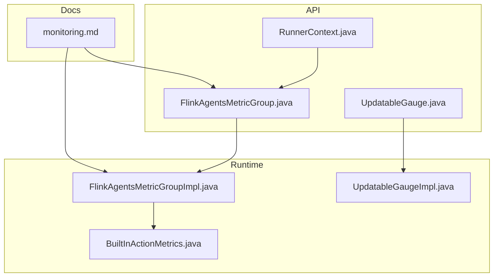
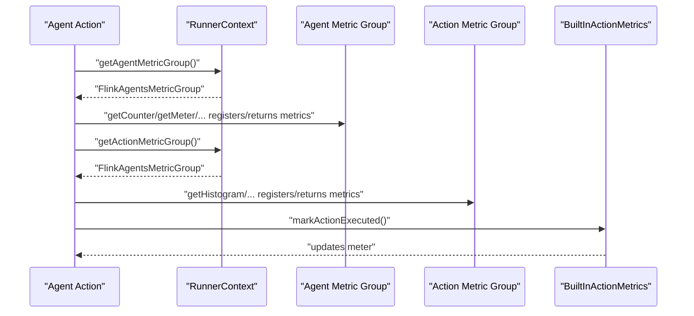
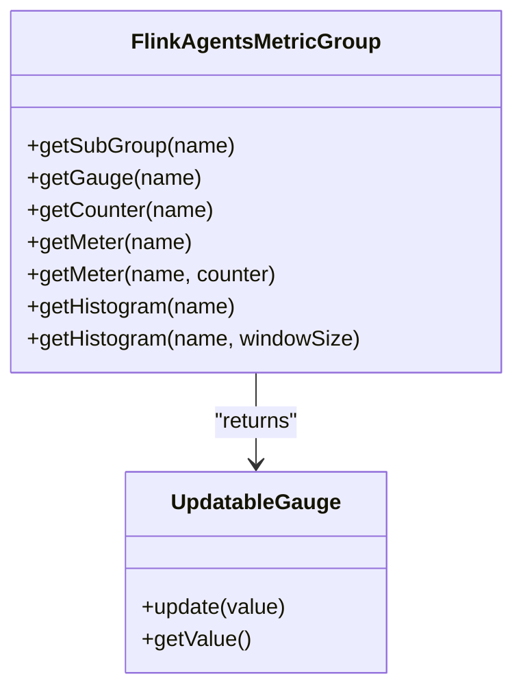
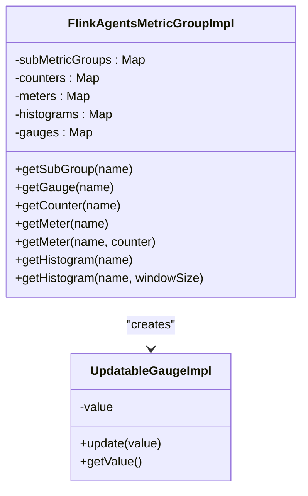
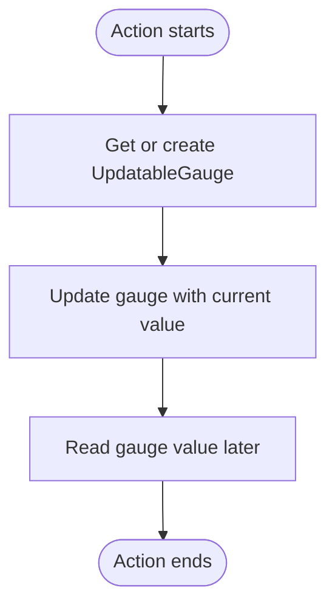
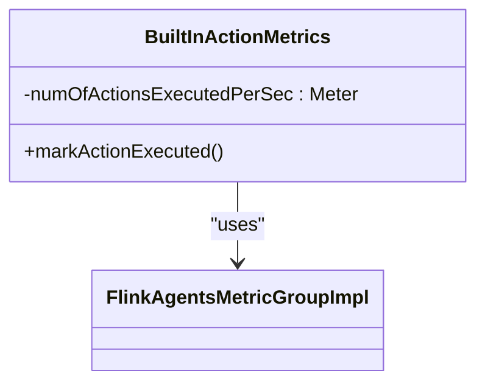
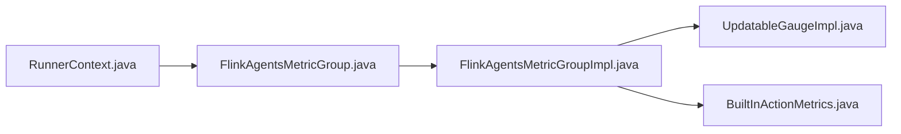

# Metrics Collection

<cite>
**Referenced Files in This Document**
- [FlinkAgentsMetricGroup.java](file://api/src/main/java/org/apache/flink/agents/api/metrics/FlinkAgentsMetricGroup.java)
- [UpdatableGauge.java](file://api/src/main/java/org/apache/flink/agents/api/metrics/UpdatableGauge.java)
- [FlinkAgentsMetricGroupImpl.java](file://runtime/src/main/java/org/apache/flink/agents/runtime/metrics/FlinkAgentsMetricGroupImpl.java)
- [UpdatableGaugeImpl.java](file://runtime/src/main/java/org/apache/flink/agents/runtime/metrics/UpdatableGaugeImpl.java)
- [BuiltInActionMetrics.java](file://runtime/src/main/java/org/apache/flink/agents/runtime/metrics/BuiltInActionMetrics.java)
- [RunnerContext.java](file://api/src/main/java/org/apache/flink/agents/api/context/RunnerContext.java)
- [monitoring.md](file://docs/content/docs/operations/monitoring.md)
- [FlinkAgentsMetricGroupImplTest.java](file://runtime/src/test/java/org/apache/flink/agents/runtime/metrics/FlinkAgentsMetricGroupImplTest.java)
</cite>

## Table of Contents
1. [Introduction](#introduction)
2. [Project Structure](#project-structure)
3. [Core Components](#core-components)
4. [Architecture Overview](#architecture-overview)
5. [Detailed Component Analysis](#detailed-component-analysis)
6. [Dependency Analysis](#dependency-analysis)
7. [Performance Considerations](#performance-considerations)
8. [Troubleshooting Guide](#troubleshooting-guide)
9. [Conclusion](#conclusion)
10. [Appendices](#appendices)

## Introduction
This document explains the metrics collection framework in Flink Agents. It covers the FlinkAgentsMetricGroup abstraction and its runtime implementation, custom metric registration patterns, and built-in action metrics. It also explains how to create and manage updatable gauges, register custom metrics, and integrate with Flink’s metric system. Practical examples show how to instrument agent code with metrics, configure reporting, and access metrics via Flink’s web interface. Guidance is included for metric naming, aggregation strategies, and integration with monitoring systems such as Prometheus or JMX.

## Project Structure
The metrics framework spans the API and runtime modules:
- API module defines the metric abstractions and interfaces used by agents.
- Runtime module implements the metric group and gauges, and exposes built-in metrics for actions.
- Documentation describes built-in metrics, usage patterns, and integration with Flink’s metric reporters and web UI.

**Diagram sources**
- [FlinkAgentsMetricGroup.java](file://api/src/main/java/org/apache/flink/agents/api/metrics/FlinkAgentsMetricGroup.java#L30-L92)
- [UpdatableGauge.java](file://api/src/main/java/org/apache/flink/agents/api/metrics/UpdatableGauge.java#L24-L37)
- [RunnerContext.java](file://api/src/main/java/org/apache/flink/agents/api/context/RunnerContext.java#L33-L79)
- [FlinkAgentsMetricGroupImpl.java](file://runtime/src/main/java/org/apache/flink/agents/runtime/metrics/FlinkAgentsMetricGroupImpl.java#L38-L104)
- [UpdatableGaugeImpl.java](file://runtime/src/main/java/org/apache/flink/agents/runtime/metrics/UpdatableGaugeImpl.java#L24-L42)
- [BuiltInActionMetrics.java](file://runtime/src/main/java/org/apache/flink/agents/runtime/metrics/BuiltInActionMetrics.java#L25-L44)
- [monitoring.md](file://docs/content/docs/operations/monitoring.md#L25-L118)

**Section sources**
- [FlinkAgentsMetricGroup.java](file://api/src/main/java/org/apache/flink/agents/api/metrics/FlinkAgentsMetricGroup.java#L26-L92)
- [FlinkAgentsMetricGroupImpl.java](file://runtime/src/main/java/org/apache/flink/agents/runtime/metrics/FlinkAgentsMetricGroupImpl.java#L33-L104)
- [monitoring.md](file://docs/content/docs/operations/monitoring.md#L25-L118)

## Core Components
- FlinkAgentsMetricGroup: Defines methods to create/retrieve subgroups, counters, meters, histograms, and gauges. Gauges are exposed as UpdatableGauge to support dynamic updates.
- UpdatableGauge: Extends the Flink Gauge interface and adds an update method to change the observed value.
- FlinkAgentsMetricGroupImpl: Implements the metric group, caching instances of counters, meters, histograms, and gauges per name, and delegating to Flink’s MetricGroup.
- UpdatableGaugeImpl: Stores and returns the latest value for a gauge.
- BuiltInActionMetrics: Provides built-in metrics for action execution counts and rates, backed by a counter and a meter associated with that counter.
- RunnerContext: Exposes getAgentMetricGroup() and getActionMetricGroup() so agents can record metrics during execution.

**Section sources**
- [FlinkAgentsMetricGroup.java](file://api/src/main/java/org/apache/flink/agents/api/metrics/FlinkAgentsMetricGroup.java#L30-L92)
- [UpdatableGauge.java](file://api/src/main/java/org/apache/flink/agents/api/metrics/UpdatableGauge.java#L24-L37)
- [FlinkAgentsMetricGroupImpl.java](file://runtime/src/main/java/org/apache/flink/agents/runtime/metrics/FlinkAgentsMetricGroupImpl.java#L38-L104)
- [UpdatableGaugeImpl.java](file://runtime/src/main/java/org/apache/flink/agents/runtime/metrics/UpdatableGaugeImpl.java#L24-L42)
- [BuiltInActionMetrics.java](file://runtime/src/main/java/org/apache/flink/agents/runtime/metrics/BuiltInActionMetrics.java#L25-L44)
- [RunnerContext.java](file://api/src/main/java/org/apache/flink/agents/api/context/RunnerContext.java#L67-L79)

## Architecture Overview
The metrics architecture integrates agent actions with Flink’s metric system:
- Agents receive RunnerContext with access to agent-wide and per-action metric groups.
- Built-in metrics are registered automatically for actions.
- Users can register custom counters, meters, histograms, and updatable gauges.
- Metrics are exported via Flink’s metric reporters and visible in the web UI.

**Diagram sources**
- [RunnerContext.java](file://api/src/main/java/org/apache/flink/agents/api/context/RunnerContext.java#L67-L79)
- [FlinkAgentsMetricGroupImpl.java](file://runtime/src/main/java/org/apache/flink/agents/runtime/metrics/FlinkAgentsMetricGroupImpl.java#L69-L103)
- [BuiltInActionMetrics.java](file://runtime/src/main/java/org/apache/flink/agents/runtime/metrics/BuiltInActionMetrics.java#L34-L43)

## Detailed Component Analysis

### FlinkAgentsMetricGroup Abstraction
- Purpose: Provide a unified API to create or retrieve metric instances by name.
- Capabilities:
  - Subgroups for hierarchical grouping.
  - Updatable gauges (standardized to String value for cross-language compatibility).
  - Counters, meters, and histograms with optional window sizing.

**Diagram sources**
- [FlinkAgentsMetricGroup.java](file://api/src/main/java/org/apache/flink/agents/api/metrics/FlinkAgentsMetricGroup.java#L30-L92)
- [UpdatableGauge.java](file://api/src/main/java/org/apache/flink/agents/api/metrics/UpdatableGauge.java#L24-L37)

**Section sources**
- [FlinkAgentsMetricGroup.java](file://api/src/main/java/org/apache/flink/agents/api/metrics/FlinkAgentsMetricGroup.java#L30-L92)
- [UpdatableGauge.java](file://api/src/main/java/org/apache/flink/agents/api/metrics/UpdatableGauge.java#L24-L37)

### FlinkAgentsMetricGroupImpl Implementation
- Caching: Maintains maps for subgroups, counters, meters, histograms, and gauges keyed by name.
- Delegation: Uses Flink’s MetricGroup to register and retrieve metrics.
- Behavior:
  - Subgroups are lazily created and reused.
  - Gauges are created via UpdatableGaugeImpl.
  - Meters can be bound to a specific counter.
  - Histograms use a descriptive statistics window with default or configured size.

**Diagram sources**
- [FlinkAgentsMetricGroupImpl.java](file://runtime/src/main/java/org/apache/flink/agents/runtime/metrics/FlinkAgentsMetricGroupImpl.java#L38-L104)
- [UpdatableGaugeImpl.java](file://runtime/src/main/java/org/apache/flink/agents/runtime/metrics/UpdatableGaugeImpl.java#L24-L42)

**Section sources**
- [FlinkAgentsMetricGroupImpl.java](file://runtime/src/main/java/org/apache/flink/agents/runtime/metrics/FlinkAgentsMetricGroupImpl.java#L38-L104)
- [UpdatableGaugeImpl.java](file://runtime/src/main/java/org/apache/flink/agents/runtime/metrics/UpdatableGaugeImpl.java#L24-L42)

### Updatable Gauge Management
- UpdatableGaugeImpl stores the last reported value and exposes it via getValue().
- Agents can update the gauge value dynamically during action execution.

**Diagram sources**
- [UpdatableGaugeImpl.java](file://runtime/src/main/java/org/apache/flink/agents/runtime/metrics/UpdatableGaugeImpl.java#L33-L41)

**Section sources**
- [UpdatableGaugeImpl.java](file://runtime/src/main/java/org/apache/flink/agents/runtime/metrics/UpdatableGaugeImpl.java#L24-L42)

### Built-in Action Metrics
- BuiltInActionMetrics creates:
  - A counter for total actions executed.
  - A meter for actions per second, bound to the counter.
- Agents trigger BuiltInActionMetrics when an action completes to increment the rate.

**Diagram sources**
- [BuiltInActionMetrics.java](file://runtime/src/main/java/org/apache/flink/agents/runtime/metrics/BuiltInActionMetrics.java#L25-L44)
- [FlinkAgentsMetricGroupImpl.java](file://runtime/src/main/java/org/apache/flink/agents/runtime/metrics/FlinkAgentsMetricGroupImpl.java#L69-L87)

**Section sources**
- [BuiltInActionMetrics.java](file://runtime/src/main/java/org/apache/flink/agents/runtime/metrics/BuiltInActionMetrics.java#L25-L44)

### Instrumenting Agent Code with Metrics
- Access metric groups from RunnerContext:
  - getAgentMetricGroup() for shared agent metrics.
  - getActionMetricGroup() for per-action metrics.
- Typical patterns:
  - Increment counters for totals.
  - Mark meters for rates.
  - Record latency histograms for action durations.
  - Update updatable gauges for instantaneous values.

Practical examples are documented in the project’s monitoring guide for both Python and Java.

**Section sources**
- [RunnerContext.java](file://api/src/main/java/org/apache/flink/agents/api/context/RunnerContext.java#L67-L79)
- [monitoring.md](file://docs/content/docs/operations/monitoring.md#L59-L109)

## Dependency Analysis
- RunnerContext depends on FlinkAgentsMetricGroup to expose metric accessors.
- FlinkAgentsMetricGroupImpl depends on Flink’s MetricGroup and MeterView/Histogram implementations.
- BuiltInActionMetrics depends on FlinkAgentsMetricGroupImpl to register and update built-in metrics.

**Diagram sources**
- [RunnerContext.java](file://api/src/main/java/org/apache/flink/agents/api/context/RunnerContext.java#L67-L79)
- [FlinkAgentsMetricGroup.java](file://api/src/main/java/org/apache/flink/agents/api/metrics/FlinkAgentsMetricGroup.java#L30-L92)
- [FlinkAgentsMetricGroupImpl.java](file://runtime/src/main/java/org/apache/flink/agents/runtime/metrics/FlinkAgentsMetricGroupImpl.java#L38-L104)
- [UpdatableGaugeImpl.java](file://runtime/src/main/java/org/apache/flink/agents/runtime/metrics/UpdatableGaugeImpl.java#L24-L42)
- [BuiltInActionMetrics.java](file://runtime/src/main/java/org/apache/flink/agents/runtime/metrics/BuiltInActionMetrics.java#L25-L44)

**Section sources**
- [RunnerContext.java](file://api/src/main/java/org/apache/flink/agents/api/context/RunnerContext.java#L67-L79)
- [FlinkAgentsMetricGroupImpl.java](file://runtime/src/main/java/org/apache/flink/agents/runtime/metrics/FlinkAgentsMetricGroupImpl.java#L38-L104)
- [BuiltInActionMetrics.java](file://runtime/src/main/java/org/apache/flink/agents/runtime/metrics/BuiltInActionMetrics.java#L25-L44)

## Performance Considerations
- Metric creation is cached by name to avoid repeated registration overhead.
- Updatable gauges minimize allocations by updating an internal value rather than creating new objects.
- Histograms and meters use fixed windows; choose window sizes appropriate to workload characteristics to balance accuracy and memory.
- Prefer counters and meters for high-frequency metrics to reduce cardinality compared to histograms where possible.

[No sources needed since this section provides general guidance]

## Troubleshooting Guide
- Missing metrics in web UI:
  - Verify metric reporter configuration and prefix format for the cluster.
  - Confirm metric names are consistent and not filtered out by reporter settings.
- Unexpected zero values:
  - Ensure counters are incremented and meters are marked in the same JVM where metrics are registered.
  - For updatable gauges, confirm update calls occur before the next scrape.
- Built-in metrics not appearing:
  - Ensure BuiltInActionMetrics is invoked when actions complete.
  - Check that the agent metric group is used for built-in metrics and the action metric group for per-action metrics.

**Section sources**
- [monitoring.md](file://docs/content/docs/operations/monitoring.md#L112-L118)
- [BuiltInActionMetrics.java](file://runtime/src/main/java/org/apache/flink/agents/runtime/metrics/BuiltInActionMetrics.java#L34-L43)

## Conclusion
Flink Agents provides a robust, extensible metrics framework that integrates seamlessly with Flink’s metric system. The FlinkAgentsMetricGroup abstraction enables consistent metric registration across Java and Python, while BuiltInActionMetrics and RunnerContext simplify instrumentation for built-in and custom metrics. By following the naming and aggregation strategies outlined here and leveraging Flink’s metric reporters, teams can effectively monitor agent performance and operational health.

[No sources needed since this section summarizes without analyzing specific files]

## Appendices

### Built-in Metrics Reference
- Agent-level:
  - Total events processed
  - Events per second
  - Total actions executed
  - Actions per second
- Per-action:
  - Total executions for a named action
  - Executions per second for a named action
- Token usage (when using chat models):
  - Prompt tokens per action and model
  - Completion tokens per action and model

**Section sources**
- [monitoring.md](file://docs/content/docs/operations/monitoring.md#L27-L50)

### Metric Naming Conventions and Aggregation Strategies
- Use hierarchical names with dot separators for clarity (e.g., action-specific metrics).
- Prefer counters for totals and meters for rates to reduce cardinality.
- Use histograms for latency or sized distributions; tune window sizes to balance fidelity and memory.

**Section sources**
- [FlinkAgentsMetricGroupImpl.java](file://runtime/src/main/java/org/apache/flink/agents/runtime/metrics/FlinkAgentsMetricGroupImpl.java#L69-L103)
- [UpdatableGaugeImpl.java](file://runtime/src/main/java/org/apache/flink/agents/runtime/metrics/UpdatableGaugeImpl.java#L33-L41)

### Integration with Monitoring Systems
- Configure Flink metric reporters to export metrics to Prometheus or JMX.
- Use the documented metric identifier prefix to locate metrics in the web UI and external systems.

**Section sources**
- [monitoring.md](file://docs/content/docs/operations/monitoring.md#L112-L118)

### Example Usage Patterns
- Java: Access agent and action metric groups, increment counters, mark meters, and update histograms or gauges.
- Python: Similar patterns using RunnerContext properties for metric groups.

**Section sources**
- [monitoring.md](file://docs/content/docs/operations/monitoring.md#L59-L109)

### Test Coverage for Metric Groups
- Unit tests validate retrieval and caching behavior for subgroups, gauges, counters, meters, and histograms.

**Section sources**
- [FlinkAgentsMetricGroupImplTest.java](file://runtime/src/test/java/org/apache/flink/agents/runtime/metrics/FlinkAgentsMetricGroupImplTest.java#L34-L86)