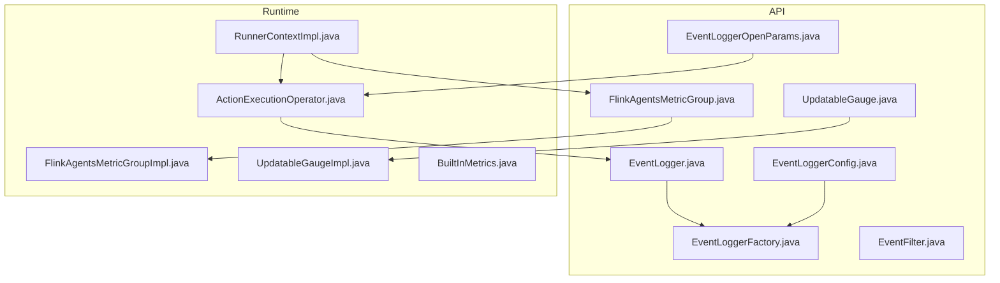
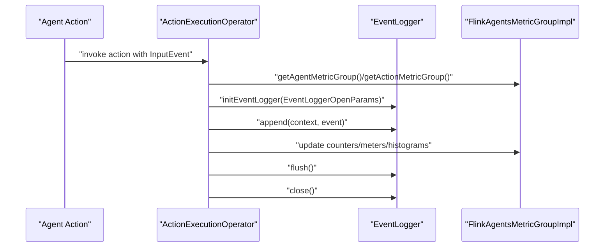
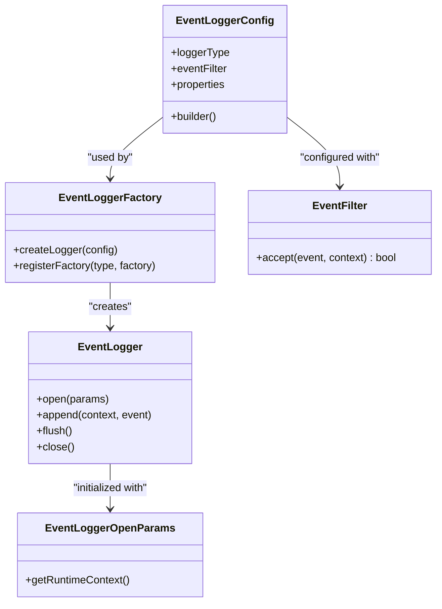
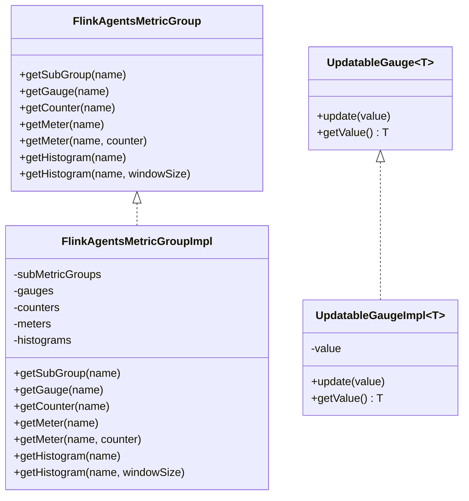
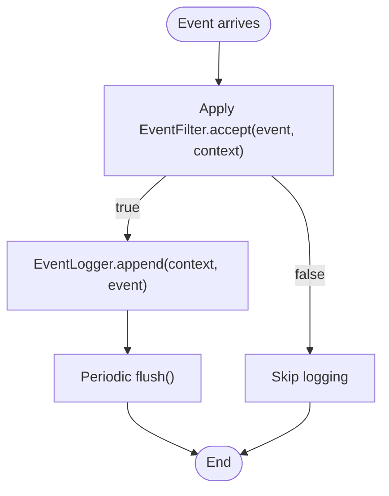
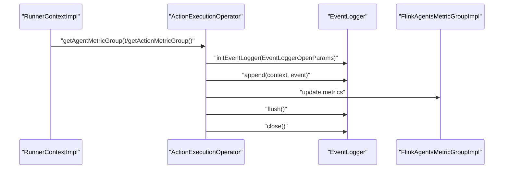
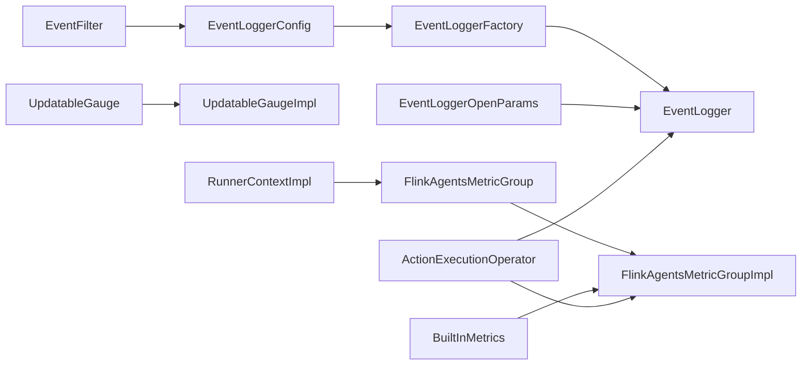

# Monitoring and Observability

<cite>
**Referenced Files in This Document**
- [EventLogger.java](file://api/src/main/java/org/apache/flink/agents/api/logger/EventLogger.java)
- [EventLoggerConfig.java](file://api/src/main/java/org/apache/flink/agents/api/logger/EventLoggerConfig.java)
- [EventLoggerFactory.java](file://api/src/main/java/org/apache/flink/agents/api/logger/EventLoggerFactory.java)
- [EventLoggerOpenParams.java](file://api/src/main/java/org/apache/flink/agents/api/logger/EventLoggerOpenParams.java)
- [EventFilter.java](file://api/src/main/java/org/apache/flink/agents/api/EventFilter.java)
- [FlinkAgentsMetricGroup.java](file://api/src/main/java/org/apache/flink/agents/api/metrics/FlinkAgentsMetricGroup.java)
- [UpdatableGauge.java](file://api/src/main/java/org/apache/flink/agents/api/metrics/UpdatableGauge.java)
- [FlinkAgentsMetricGroupImpl.java](file://runtime/src/main/java/org/apache/flink/agents/runtime/metrics/FlinkAgentsMetricGroupImpl.java)
- [UpdatableGaugeImpl.java](file://runtime/src/main/java/org/apache/flink/agents/runtime/metrics/UpdatableGaugeImpl.java)
- [BuiltInMetrics.java](file://runtime/src/main/java/org/apache/flink/agents/runtime/metrics/BuiltInMetrics.java)
- [monitoring.md](file://docs/content/docs/operations/monitoring.md)
- [ActionExecutionOperator.java](file://runtime/src/main/java/org/apache/flink/agents/runtime/operator/ActionExecutionOperator.java)
- [RunnerContextImpl.java](file://runtime/src/main/java/org/apache/flink/agents/runtime/context/RunnerContextImpl.java)
</cite>

## Table of Contents
1. [Introduction](#introduction)
2. [Project Structure](#project-structure)
3. [Core Components](#core-components)
4. [Architecture Overview](#architecture-overview)
5. [Detailed Component Analysis](#detailed-component-analysis)
6. [Dependency Analysis](#dependency-analysis)
7. [Performance Considerations](#performance-considerations)
8. [Troubleshooting Guide](#troubleshooting-guide)
9. [Conclusion](#conclusion)
10. [Appendices](#appendices)

## Introduction
This document explains monitoring and observability in Flink Agents, focusing on the event logging system and metrics collection framework. It covers:
- Event logging: EventLogger interface, configuration, filtering, and file-based aggregation
- Metrics: FlinkAgentsMetricGroup, built-in metrics, and custom metric registration
- Performance monitoring, debugging, and troubleshooting
- Tracing agent execution flows via event logs and metrics
- Configuration options and alerting strategies
- Practical examples for diagnosing bottlenecks and integrating with external monitoring systems

## Project Structure
The monitoring and observability features span the API and Runtime modules:
- API module defines logging interfaces, filters, and metrics abstractions
- Runtime module implements the metrics group and built-in metrics, and integrates logging into operators

**Diagram sources**
- [EventLogger.java](file://api/src/main/java/org/apache/flink/agents/api/logger/EventLogger.java#L24-L79)
- [EventLoggerConfig.java](file://api/src/main/java/org/apache/flink/agents/api/logger/EventLoggerConfig.java#L59-L149)
- [EventLoggerFactory.java](file://api/src/main/java/org/apache/flink/agents/api/logger/EventLoggerFactory.java#L70-L153)
- [EventLoggerOpenParams.java](file://api/src/main/java/org/apache/flink/agents/api/logger/EventLoggerOpenParams.java#L23-L34)
- [EventFilter.java](file://api/src/main/java/org/apache/flink/agents/api/EventFilter.java#L27-L36)
- [FlinkAgentsMetricGroup.java](file://api/src/main/java/org/apache/flink/agents/api/metrics/FlinkAgentsMetricGroup.java#L26-L93)
- [UpdatableGauge.java](file://api/src/main/java/org/apache/flink/agents/api/metrics/UpdatableGauge.java#L24-L38)
- [FlinkAgentsMetricGroupImpl.java](file://runtime/src/main/java/org/apache/flink/agents/runtime/metrics/FlinkAgentsMetricGroupImpl.java#L33-L104)
- [UpdatableGaugeImpl.java](file://runtime/src/main/java/org/apache/flink/agents/runtime/metrics/UpdatableGaugeImpl.java#L24-L43)
- [BuiltInMetrics.java](file://runtime/src/main/java/org/apache/flink/agents/runtime/metrics/BuiltInMetrics.java#L28-L38)
- [ActionExecutionOperator.java](file://runtime/src/main/java/org/apache/flink/agents/runtime/operator/ActionExecutionOperator.java)
- [RunnerContextImpl.java](file://runtime/src/main/java/org/apache/flink/agents/runtime/context/RunnerContextImpl.java)

**Section sources**
- [EventLogger.java](file://api/src/main/java/org/apache/flink/agents/api/logger/EventLogger.java#L24-L79)
- [FlinkAgentsMetricGroup.java](file://api/src/main/java/org/apache/flink/agents/api/metrics/FlinkAgentsMetricGroup.java#L26-L93)
- [FlinkAgentsMetricGroupImpl.java](file://runtime/src/main/java/org/apache/flink/agents/runtime/metrics/FlinkAgentsMetricGroupImpl.java#L33-L104)

## Core Components
- Event logging
  - EventLogger: unified interface for logging events with open, append, flush, and close
  - EventLoggerConfig: builder-based configuration with logger type, event filter, and properties
  - EventLoggerFactory: registry and creation of logger implementations
  - EventLoggerOpenParams: runtime context injection for logger initialization
  - EventFilter: functional interface to filter events before logging
- Metrics
  - FlinkAgentsMetricGroup: abstraction for counters, meters, histograms, gauges, and subgroups
  - UpdatableGauge: updatable gauge value for dynamic metrics
  - FlinkAgentsMetricGroupImpl: runtime implementation backed by Flink metrics
  - BuiltInMetrics: built-in agent and action metrics managed by the runtime

**Section sources**
- [EventLogger.java](file://api/src/main/java/org/apache/flink/agents/api/logger/EventLogger.java#L24-L79)
- [EventLoggerConfig.java](file://api/src/main/java/org/apache/flink/agents/api/logger/EventLoggerConfig.java#L59-L149)
- [EventLoggerFactory.java](file://api/src/main/java/org/apache/flink/agents/api/logger/EventLoggerFactory.java#L70-L153)
- [EventLoggerOpenParams.java](file://api/src/main/java/org/apache/flink/agents/api/logger/EventLoggerOpenParams.java#L23-L34)
- [EventFilter.java](file://api/src/main/java/org/apache/flink/agents/api/EventFilter.java#L27-L36)
- [FlinkAgentsMetricGroup.java](file://api/src/main/java/org/apache/flink/agents/api/metrics/FlinkAgentsMetricGroup.java#L26-L93)
- [UpdatableGauge.java](file://api/src/main/java/org/apache/flink/agents/api/metrics/UpdatableGauge.java#L24-L38)
- [FlinkAgentsMetricGroupImpl.java](file://runtime/src/main/java/org/apache/flink/agents/runtime/metrics/FlinkAgentsMetricGroupImpl.java#L33-L104)
- [UpdatableGaugeImpl.java](file://runtime/src/main/java/org/apache/flink/agents/runtime/metrics/UpdatableGaugeImpl.java#L24-L43)
- [BuiltInMetrics.java](file://runtime/src/main/java/org/apache/flink/agents/runtime/metrics/BuiltInMetrics.java#L28-L38)

## Architecture Overview
The observability architecture connects agents, operators, and runtime contexts to produce logs and metrics.

**Diagram sources**
- [ActionExecutionOperator.java](file://runtime/src/main/java/org/apache/flink/agents/runtime/operator/ActionExecutionOperator.java)
- [EventLogger.java](file://api/src/main/java/org/apache/flink/agents/api/logger/EventLogger.java#L33-L76)
- [EventLoggerOpenParams.java](file://api/src/main/java/org/apache/flink/agents/api/logger/EventLoggerOpenParams.java#L23-L34)
- [FlinkAgentsMetricGroupImpl.java](file://runtime/src/main/java/org/apache/flink/agents/runtime/metrics/FlinkAgentsMetricGroupImpl.java#L55-L103)

## Detailed Component Analysis

### Event Logging System
- EventLogger interface
  - Defines lifecycle: open, append, flush, close
  - Accepts EventContext and Event for append
- EventLoggerConfig
  - Provides builder with defaults: loggerType "file", eventFilter ACCEPT_ALL
  - Properties map for backend-specific settings
- EventLoggerFactory
  - Registry of logger factories keyed by type
  - Built-in file logger factory registered at initialization
- EventFilter
  - Functional predicate to decide whether to log an event
- EventLoggerOpenParams
  - Supplies StreamingRuntimeContext to loggers for resource initialization

**Diagram sources**
- [EventLogger.java](file://api/src/main/java/org/apache/flink/agents/api/logger/EventLogger.java#L24-L79)
- [EventLoggerConfig.java](file://api/src/main/java/org/apache/flink/agents/api/logger/EventLoggerConfig.java#L59-L149)
- [EventLoggerFactory.java](file://api/src/main/java/org/apache/flink/agents/api/logger/EventLoggerFactory.java#L70-L153)
- [EventFilter.java](file://api/src/main/java/org/apache/flink/agents/api/EventFilter.java#L27-L36)
- [EventLoggerOpenParams.java](file://api/src/main/java/org/apache/flink/agents/api/logger/EventLoggerOpenParams.java#L23-L34)

**Section sources**
- [EventLogger.java](file://api/src/main/java/org/apache/flink/agents/api/logger/EventLogger.java#L24-L79)
- [EventLoggerConfig.java](file://api/src/main/java/org/apache/flink/agents/api/logger/EventLoggerConfig.java#L59-L149)
- [EventLoggerFactory.java](file://api/src/main/java/org/apache/flink/agents/api/logger/EventLoggerFactory.java#L70-L153)
- [EventFilter.java](file://api/src/main/java/org/apache/flink/agents/api/EventFilter.java#L27-L36)
- [EventLoggerOpenParams.java](file://api/src/main/java/org/apache/flink/agents/api/logger/EventLoggerOpenParams.java#L23-L34)

### Metrics Collection Framework
- FlinkAgentsMetricGroup
  - Subgroups, gauges, counters, meters, histograms
  - Optional association of meter with a counter
- FlinkAgentsMetricGroupImpl
  - Proxies to Flink MetricGroup
  - Caches and lazily creates metrics
  - Default window sizes for meters and histograms
- UpdatableGauge and UpdatableGaugeImpl
  - Dynamic value updates for runtime metrics
- BuiltInMetrics
  - Tracks agent-level and action-level throughput and counts

**Diagram sources**
- [FlinkAgentsMetricGroup.java](file://api/src/main/java/org/apache/flink/agents/api/metrics/FlinkAgentsMetricGroup.java#L26-L93)
- [FlinkAgentsMetricGroupImpl.java](file://runtime/src/main/java/org/apache/flink/agents/runtime/metrics/FlinkAgentsMetricGroupImpl.java#L33-L104)
- [UpdatableGauge.java](file://api/src/main/java/org/apache/flink/agents/api/metrics/UpdatableGauge.java#L24-L38)
- [UpdatableGaugeImpl.java](file://runtime/src/main/java/org/apache/flink/agents/runtime/metrics/UpdatableGaugeImpl.java#L24-L43)

**Section sources**
- [FlinkAgentsMetricGroup.java](file://api/src/main/java/org/apache/flink/agents/api/metrics/FlinkAgentsMetricGroup.java#L26-L93)
- [FlinkAgentsMetricGroupImpl.java](file://runtime/src/main/java/org/apache/flink/agents/runtime/metrics/FlinkAgentsMetricGroupImpl.java#L33-L104)
- [UpdatableGauge.java](file://api/src/main/java/org/apache/flink/agents/api/metrics/UpdatableGauge.java#L24-L38)
- [UpdatableGaugeImpl.java](file://runtime/src/main/java/org/apache/flink/agents/runtime/metrics/UpdatableGaugeImpl.java#L24-L43)
- [BuiltInMetrics.java](file://runtime/src/main/java/org/apache/flink/agents/runtime/metrics/BuiltInMetrics.java#L28-L38)

### Event Filtering and Log Aggregation
- Filtering
  - EventFilter controls which events are logged
  - EventLoggerConfig.builder sets filter and logger type
- Aggregation
  - File-based event log stores events in JSON Lines format
  - Logs are flushed and closed by the operator lifecycle

**Diagram sources**
- [EventFilter.java](file://api/src/main/java/org/apache/flink/agents/api/EventFilter.java#L27-L36)
- [EventLogger.java](file://api/src/main/java/org/apache/flink/agents/api/logger/EventLogger.java#L45-L66)
- [EventLoggerConfig.java](file://api/src/main/java/org/apache/flink/agents/api/logger/EventLoggerConfig.java#L144-L176)

**Section sources**
- [EventFilter.java](file://api/src/main/java/org/apache/flink/agents/api/EventFilter.java#L27-L36)
- [EventLogger.java](file://api/src/main/java/org/apache/flink/agents/api/logger/EventLogger.java#L45-L66)
- [EventLoggerConfig.java](file://api/src/main/java/org/apache/flink/agents/api/logger/EventLoggerConfig.java#L144-L176)

### Operator Integration and Execution Flow
- ActionExecutionOperator initializes and coordinates logging and metrics
- RunnerContextImpl exposes agent and action metric groups to actions
- Operators manage logger lifecycle: init, append, flush, close

**Diagram sources**
- [RunnerContextImpl.java](file://runtime/src/main/java/org/apache/flink/agents/runtime/context/RunnerContextImpl.java)
- [ActionExecutionOperator.java](file://runtime/src/main/java/org/apache/flink/agents/runtime/operator/ActionExecutionOperator.java)
- [EventLoggerOpenParams.java](file://api/src/main/java/org/apache/flink/agents/api/logger/EventLoggerOpenParams.java#L23-L34)
- [FlinkAgentsMetricGroupImpl.java](file://runtime/src/main/java/org/apache/flink/agents/runtime/metrics/FlinkAgentsMetricGroupImpl.java#L55-L103)

**Section sources**
- [RunnerContextImpl.java](file://runtime/src/main/java/org/apache/flink/agents/runtime/context/RunnerContextImpl.java)
- [ActionExecutionOperator.java](file://runtime/src/main/java/org/apache/flink/agents/runtime/operator/ActionExecutionOperator.java)
- [EventLoggerOpenParams.java](file://api/src/main/java/org/apache/flink/agents/api/logger/EventLoggerOpenParams.java#L23-L34)
- [FlinkAgentsMetricGroupImpl.java](file://runtime/src/main/java/org/apache/flink/agents/runtime/metrics/FlinkAgentsMetricGroupImpl.java#L55-L103)

## Dependency Analysis
- Event logging depends on:
  - EventLogger interface and factory
  - EventFilter for pre-append decisions
  - EventLoggerOpenParams for runtime context
- Metrics depends on:
  - FlinkAgentsMetricGroup abstraction
  - FlinkAgentsMetricGroupImpl for runtime implementation
  - UpdatableGauge for dynamic values
- Built-in metrics depend on operator-level counters and meters

**Diagram sources**
- [EventFilter.java](file://api/src/main/java/org/apache/flink/agents/api/EventFilter.java#L27-L36)
- [EventLoggerConfig.java](file://api/src/main/java/org/apache/flink/agents/api/logger/EventLoggerConfig.java#L59-L149)
- [EventLoggerFactory.java](file://api/src/main/java/org/apache/flink/agents/api/logger/EventLoggerFactory.java#L70-L153)
- [EventLogger.java](file://api/src/main/java/org/apache/flink/agents/api/logger/EventLogger.java#L24-L79)
- [EventLoggerOpenParams.java](file://api/src/main/java/org/apache/flink/agents/api/logger/EventLoggerOpenParams.java#L23-L34)
- [FlinkAgentsMetricGroup.java](file://api/src/main/java/org/apache/flink/agents/api/metrics/FlinkAgentsMetricGroup.java#L26-L93)
- [FlinkAgentsMetricGroupImpl.java](file://runtime/src/main/java/org/apache/flink/agents/runtime/metrics/FlinkAgentsMetricGroupImpl.java#L33-L104)
- [UpdatableGauge.java](file://api/src/main/java/org/apache/flink/agents/api/metrics/UpdatableGauge.java#L24-L38)
- [UpdatableGaugeImpl.java](file://runtime/src/main/java/org/apache/flink/agents/runtime/metrics/UpdatableGaugeImpl.java#L24-L43)
- [BuiltInMetrics.java](file://runtime/src/main/java/org/apache/flink/agents/runtime/metrics/BuiltInMetrics.java#L28-L38)
- [ActionExecutionOperator.java](file://runtime/src/main/java/org/apache/flink/agents/runtime/operator/ActionExecutionOperator.java)
- [RunnerContextImpl.java](file://runtime/src/main/java/org/apache/flink/agents/runtime/context/RunnerContextImpl.java)

**Section sources**
- [EventLoggerFactory.java](file://api/src/main/java/org/apache/flink/agents/api/logger/EventLoggerFactory.java#L70-L153)
- [FlinkAgentsMetricGroupImpl.java](file://runtime/src/main/java/org/apache/flink/agents/runtime/metrics/FlinkAgentsMetricGroupImpl.java#L33-L104)

## Performance Considerations
- Event logging overhead
  - Prefer lightweight filters to reduce append frequency
  - Batch or throttle high-frequency events when possible
- Metrics cardinality
  - Limit unique metric names and subgroups
  - Use shared counters for meters where supported
- Histogram windows
  - Tune window sizes for latency histograms to balance responsiveness and cost
- Flush cadence
  - Align flush intervals with throughput to avoid excessive disk I/O

[No sources needed since this section provides general guidance]

## Troubleshooting Guide
- Verify logger initialization
  - Confirm EventLoggerFactory.registerFactory is called for custom loggers
  - Ensure EventLoggerConfig builder sets loggerType and eventFilter appropriately
- Validate metrics availability
  - Use RunnerContextImpl to obtain agent and action metric groups
  - Check that metrics are created lazily and cached by FlinkAgentsMetricGroupImpl
- Inspect built-in metrics
  - Built-in metrics track event/action counts and rates; confirm operator-level metrics appear in the UI
- Check logs
  - File-based event logs are stored under the configured base directory; verify file naming and JSONL format

**Section sources**
- [EventLoggerFactory.java](file://api/src/main/java/org/apache/flink/agents/api/logger/EventLoggerFactory.java#L135-L143)
- [EventLoggerConfig.java](file://api/src/main/java/org/apache/flink/agents/api/logger/EventLoggerConfig.java#L144-L176)
- [RunnerContextImpl.java](file://runtime/src/main/java/org/apache/flink/agents/runtime/context/RunnerContextImpl.java)
- [FlinkAgentsMetricGroupImpl.java](file://runtime/src/main/java/org/apache/flink/agents/runtime/metrics/FlinkAgentsMetricGroupImpl.java#L55-L103)
- [monitoring.md](file://docs/content/docs/operations/monitoring.md#L142-L162)

## Conclusion
Flink Agents provides a robust observability foundation:
- Event logging via a configurable, filterable logger interface with a file-based default
- Rich metrics via FlinkAgentsMetricGroup with built-in agent and action metrics
- Clear operator integration enabling lifecycle-aware logging and metrics updates
Adopt the recommended practices to maintain low overhead, high visibility, and seamless integration with external monitoring systems.

[No sources needed since this section summarizes without analyzing specific files]

## Appendices

### Configuration Options and Alerting Strategies
- Logging
  - Logger type: configure via EventLoggerConfig.builder.loggerType
  - Event filter: configure via EventLoggerConfig.builder.eventFilter
  - File-based log directory: override the base directory in configuration
- Metrics
  - Access via RunnerContextImpl agent and action metric groups
  - Built-in metrics include event/action counts and rates
  - Use histograms for latency, meters for throughput, counters for totals
- Alerting
  - Expose metrics to external systems using Flink’s metric reporter identifiers
  - Set thresholds on rates and latencies to trigger alerts

**Section sources**
- [EventLoggerConfig.java](file://api/src/main/java/org/apache/flink/agents/api/logger/EventLoggerConfig.java#L144-L176)
- [monitoring.md](file://docs/content/docs/operations/monitoring.md#L25-L119)

### Practical Examples
- Monitoring agent performance
  - Increment counters for input events and mark meters for per-second rates
  - Record action latency in histograms for percentile analysis
- Identifying bottlenecks
  - Track action execution rates and latencies; compare across actions
  - Monitor token usage metrics when invoking chat models
- Diagnosing execution issues
  - Use event logs to trace end-to-end flows and inspect filtered events
  - Correlate metrics spikes with log entries to pinpoint failures

**Section sources**
- [monitoring.md](file://docs/content/docs/operations/monitoring.md#L51-L119)
- [FlinkAgentsMetricGroupImpl.java](file://runtime/src/main/java/org/apache/flink/agents/runtime/metrics/FlinkAgentsMetricGroupImpl.java#L69-L103)