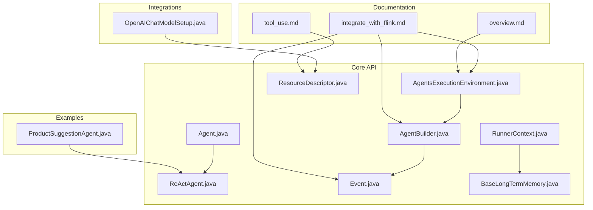
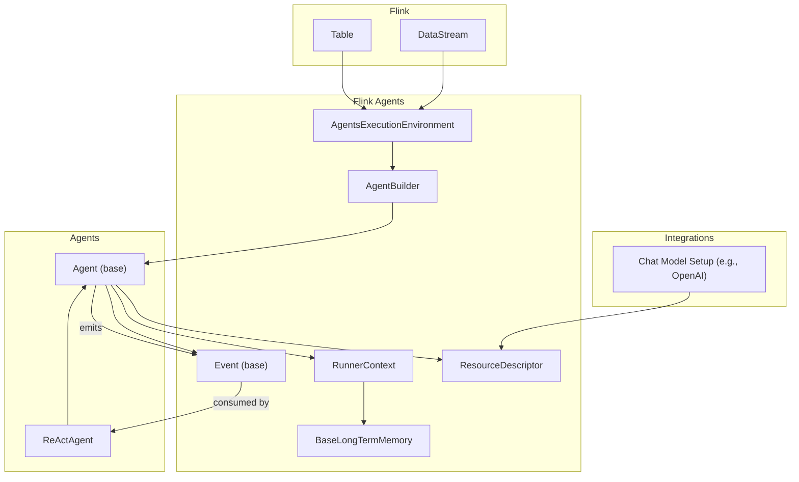
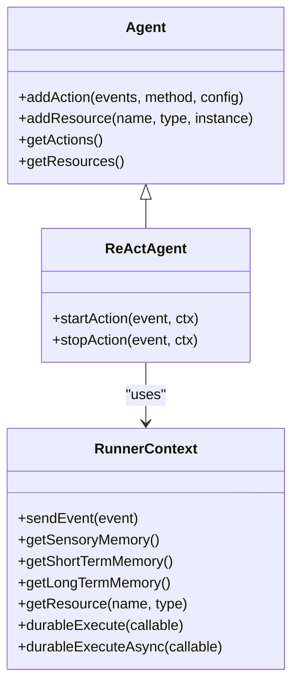
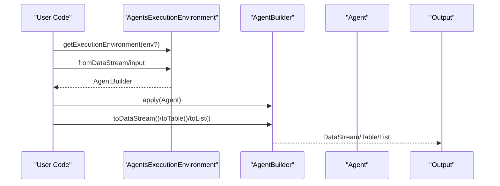
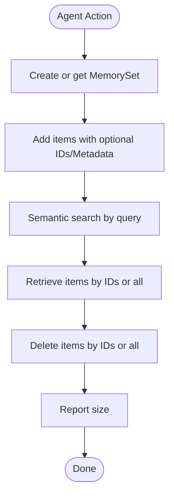
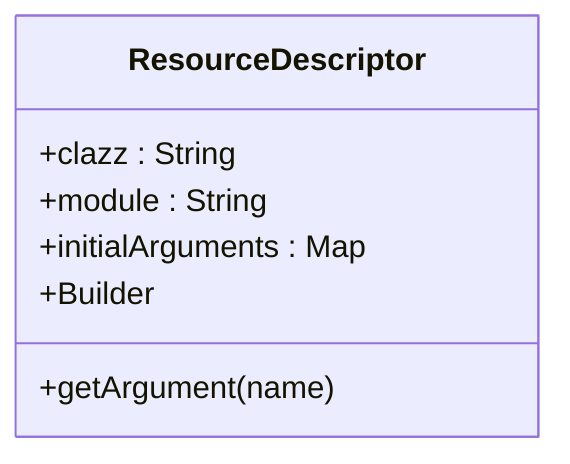
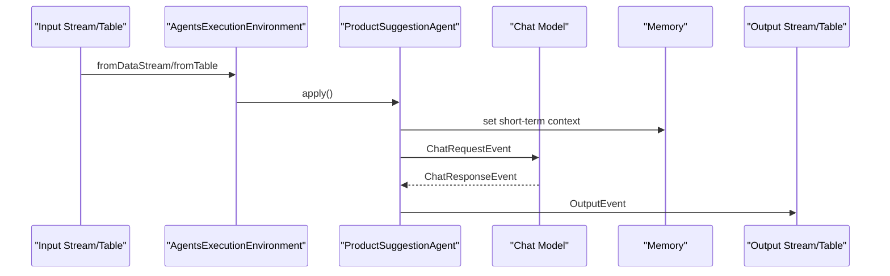
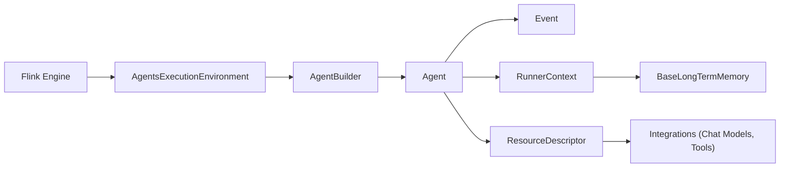

# Project Overview

<cite>
**Referenced Files in This Document**
- [README.md](file://README.md)
- [overview.md](file://docs/content/docs/get-started/overview.md)
- [integrate_with_flink.md](file://docs/content/docs/development/integrate_with_flink.md)
- [Agent.java](file://api/src/main/java/org/apache/flink/agents/api/agents/Agent.java)
- [ReActAgent.java](file://api/src/main/java/org/apache/flink/agents/api/agents/ReActAgent.java)
- [AgentBuilder.java](file://api/src/main/java/org/apache/flink/agents/api/AgentBuilder.java)
- [AgentsExecutionEnvironment.java](file://api/src/main/java/org/apache/flink/agents/api/AgentsExecutionEnvironment.java)
- [RunnerContext.java](file://api/src/main/java/org/apache/flink/agents/api/context/RunnerContext.java)
- [Event.java](file://api/src/main/java/org/apache/flink/agents/api/Event.java)
- [BaseLongTermMemory.java](file://api/src/main/java/org/apache/flink/agents/api/memory/BaseLongTermMemory.java)
- [ResourceDescriptor.java](file://api/src/main/java/org/apache/flink/agents/api/resource/ResourceDescriptor.java)
- [OpenAIChatModelSetup.java](file://integrations/chat-models/openai/src/main/java/org/apache/flink/agents/integrations/chatmodels/openai/OpenAIChatModelSetup.java)
- [ProductSuggestionAgent.java](file://examples/src/main/java/org/apache/flink/agents/examples/agents/ProductSuggestionAgent.java)
- [tool_use.md](file://docs/content/docs/development/tool_use.md)
</cite>

## Table of Contents
1. [Introduction](#introduction)
2. [Project Structure](#project-structure)
3. [Core Components](#core-components)
4. [Architecture Overview](#architecture-overview)
5. [Detailed Component Analysis](#detailed-component-analysis)
6. [Dependency Analysis](#dependency-analysis)
7. [Performance Considerations](#performance-considerations)
8. [Troubleshooting Guide](#troubleshooting-guide)
9. [Conclusion](#conclusion)
10. [Appendices](#appendices)

## Introduction
Apache Flink Agents is an open-source Agentic AI framework built on Apache Flink. It brings event-driven, streaming-first agent logic to Flink’s distributed, fault-tolerant, and stateful engine. The framework provides first-class abstractions for AI agent building blocks—large language models (LLMs), prompts, tools, memory, dynamic orchestration, and observability—while enabling seamless integration with Flink’s DataStream and Table APIs. It supports both Java and Python, offering cross-language resource compatibility and MCP-based tooling to accelerate real-time AI applications.

Target audience spans from beginners exploring quickstarts to enterprise developers building production-grade streaming AI systems. Flink Agents fits naturally in the AI/ML ecosystem as a streaming orchestration layer that augments structured data processing with semantic AI capabilities, enabling use cases such as real-time recommendation engines, anomaly detection with explainability, and adaptive customer service automation.

## Project Structure
At a high level, the repository is organized into:
- api: Core agent APIs, agent base classes, execution environments, events, memory, and resource abstractions
- docs: User and developer documentation, quickstarts, and integration guides
- examples: End-to-end agent examples (e.g., product suggestion, review analysis)
- integrations: Ready-to-use connectors for chat models, embeddings, vector stores, and MCP
- plan: Serialization and plan representation for cross-language execution
- python: Python SDK mirroring the Java APIs, including runtime bridges and examples
- runtime: Runtime implementations for local and remote environments
- e2e-test: End-to-end tests validating cross-language and integration scenarios

**Diagram sources**
- [Agent.java](file://api/src/main/java/org/apache/flink/agents/api/agents/Agent.java#L34-L131)
- [ReActAgent.java](file://api/src/main/java/org/apache/flink/agents/api/agents/ReActAgent.java#L51-L183)
- [AgentsExecutionEnvironment.java](file://api/src/main/java/org/apache/flink/agents/api/AgentsExecutionEnvironment.java#L43-L223)
- [AgentBuilder.java](file://api/src/main/java/org/apache/flink/agents/api/AgentBuilder.java#L35-L77)
- [Event.java](file://api/src/main/java/org/apache/flink/agents/api/Event.java#L30-L90)
- [RunnerContext.java](file://api/src/main/java/org/apache/flink/agents/api/context/RunnerContext.java#L33-L138)
- [BaseLongTermMemory.java](file://api/src/main/java/org/apache/flink/agents/api/memory/BaseLongTermMemory.java#L33-L134)
- [ResourceDescriptor.java](file://api/src/main/java/org/apache/flink/agents/api/resource/ResourceDescriptor.java#L29-L144)
- [overview.md](file://docs/content/docs/get-started/overview.md#L25-L48)
- [integrate_with_flink.md](file://docs/content/docs/development/integrate_with_flink.md#L24-L178)
- [tool_use.md](file://docs/content/docs/development/tool_use.md#L25-L185)
- [ProductSuggestionAgent.java](file://examples/src/main/java/org/apache/flink/agents/examples/agents/ProductSuggestionAgent.java#L52-L114)
- [OpenAIChatModelSetup.java](file://integrations/chat-models/openai/src/main/java/org/apache/flink/agents/integrations/chatmodels/openai/OpenAIChatModelSetup.java#L61-L220)

**Section sources**
- [README.md](file://README.md#L1-L44)
- [overview.md](file://docs/content/docs/get-started/overview.md#L25-L48)

## Core Components
- Agent: Base class for agent logic with action registration and resource management
- ReActAgent: Built-in ReAct-style agent that orchestrates LLM interactions and emits structured outputs
- AgentsExecutionEnvironment: Entry point for integrating with Flink DataStream/Table or running locally
- AgentBuilder: Fluent builder to configure agent pipelines and produce DataStream/Table/List outputs
- Event: Event base class enabling event-driven orchestration and observability
- RunnerContext: Action execution context exposing memory, metrics, resources, and durable execution helpers
- BaseLongTermMemory: Persistent memory abstraction for retrieval and semantic search
- ResourceDescriptor: Cross-language resource descriptor enabling Java/Python interoperability
- Integrations: Prebuilt adapters for chat models, embeddings, vector stores, and MCP tooling

Key benefits:
- Real-time AI agent processing via Flink streaming engine
- Streaming intelligence with exactly-once semantics and strong state management
- Cross-language integration with Java and Python
- Rich ecosystem of LLMs, prompts, tools, and vector stores
- Observability through event-centric orchestration

**Section sources**
- [Agent.java](file://api/src/main/java/org/apache/flink/agents/api/agents/Agent.java#L34-L131)
- [ReActAgent.java](file://api/src/main/java/org/apache/flink/agents/api/agents/ReActAgent.java#L51-L183)
- [AgentsExecutionEnvironment.java](file://api/src/main/java/org/apache/flink/agents/api/AgentsExecutionEnvironment.java#L43-L223)
- [AgentBuilder.java](file://api/src/main/java/org/apache/flink/agents/api/AgentBuilder.java#L35-L77)
- [Event.java](file://api/src/main/java/org/apache/flink/agents/api/Event.java#L30-L90)
- [RunnerContext.java](file://api/src/main/java/org/apache/flink/agents/api/context/RunnerContext.java#L33-L138)
- [BaseLongTermMemory.java](file://api/src/main/java/org/apache/flink/agents/api/memory/BaseLongTermMemory.java#L33-L134)
- [ResourceDescriptor.java](file://api/src/main/java/org/apache/flink/agents/api/resource/ResourceDescriptor.java#L29-L144)
- [overview.md](file://docs/content/docs/get-started/overview.md#L31-L41)

## Architecture Overview
Flink Agents sits atop Apache Flink, consuming structured data streams and tables, and emitting AI-driven outputs back into Flink pipelines. The execution environment adapts to local or remote contexts, and agents communicate via typed events. Resources (LLMs, prompts, tools, memory) are registered centrally and resolved at runtime. Cross-language resource descriptors enable Java-defined resources to be used from Python and vice versa.

**Diagram sources**
- [AgentsExecutionEnvironment.java](file://api/src/main/java/org/apache/flink/agents/api/AgentsExecutionEnvironment.java#L68-L121)
- [AgentBuilder.java](file://api/src/main/java/org/apache/flink/agents/api/AgentBuilder.java#L35-L77)
- [Agent.java](file://api/src/main/java/org/apache/flink/agents/api/agents/Agent.java#L34-L131)
- [ReActAgent.java](file://api/src/main/java/org/apache/flink/agents/api/agents/ReActAgent.java#L51-L183)
- [Event.java](file://api/src/main/java/org/apache/flink/agents/api/Event.java#L30-L90)
- [RunnerContext.java](file://api/src/main/java/org/apache/flink/agents/api/context/RunnerContext.java#L33-L138)
- [BaseLongTermMemory.java](file://api/src/main/java/org/apache/flink/agents/api/memory/BaseLongTermMemory.java#L33-L134)
- [ResourceDescriptor.java](file://api/src/main/java/org/apache/flink/agents/api/resource/ResourceDescriptor.java#L29-L144)
- [OpenAIChatModelSetup.java](file://integrations/chat-models/openai/src/main/java/org/apache/flink/agents/integrations/chatmodels/openai/OpenAIChatModelSetup.java#L61-L220)

**Section sources**
- [integrate_with_flink.md](file://docs/content/docs/development/integrate_with_flink.md#L24-L178)
- [overview.md](file://docs/content/docs/get-started/overview.md#L25-L48)

## Detailed Component Analysis

### Agent Orchestration and Actions
Agents define actions that listen to specific events and execute logic via RunnerContext. Actions can emit new events, mutate memory, and interact with resources. The base Agent class manages action registration and resource binding, while ReActAgent demonstrates a canonical pattern for prompting, invoking chat models, and returning structured outputs.

**Diagram sources**
- [Agent.java](file://api/src/main/java/org/apache/flink/agents/api/agents/Agent.java#L34-L131)
- [ReActAgent.java](file://api/src/main/java/org/apache/flink/agents/api/agents/ReActAgent.java#L51-L183)
- [RunnerContext.java](file://api/src/main/java/org/apache/flink/agents/api/context/RunnerContext.java#L33-L138)

**Section sources**
- [Agent.java](file://api/src/main/java/org/apache/flink/agents/api/agents/Agent.java#L34-L131)
- [ReActAgent.java](file://api/src/main/java/org/apache/flink/agents/api/agents/ReActAgent.java#L51-L183)
- [RunnerContext.java](file://api/src/main/java/org/apache/flink/agents/api/context/RunnerContext.java#L33-L138)

### Execution Environments and Outputs
AgentsExecutionEnvironment provides factory methods to obtain local or remote environments. AgentBuilder exposes toList, toDataStream, and toTable to materialize agent outputs in the desired form, enabling downstream consumption in Flink pipelines.

**Diagram sources**
- [AgentsExecutionEnvironment.java](file://api/src/main/java/org/apache/flink/agents/api/AgentsExecutionEnvironment.java#L68-L121)
- [AgentBuilder.java](file://api/src/main/java/org/apache/flink/agents/api/AgentBuilder.java#L35-L77)

**Section sources**
- [AgentsExecutionEnvironment.java](file://api/src/main/java/org/apache/flink/agents/api/AgentsExecutionEnvironment.java#L68-L121)
- [AgentBuilder.java](file://api/src/main/java/org/apache/flink/agents/api/AgentBuilder.java#L35-L77)
- [integrate_with_flink.md](file://docs/content/docs/development/integrate_with_flink.md#L24-L178)

### Memory and Persistence
Long-term memory enables persistent storage and retrieval of items with semantic search. Memory sets can be compacted when capacity thresholds are exceeded, ensuring efficient use of state.

**Diagram sources**
- [BaseLongTermMemory.java](file://api/src/main/java/org/apache/flink/agents/api/memory/BaseLongTermMemory.java#L45-L132)

**Section sources**
- [BaseLongTermMemory.java](file://api/src/main/java/org/apache/flink/agents/api/memory/BaseLongTermMemory.java#L33-L134)

### Cross-Language Resource Compatibility
ResourceDescriptor encapsulates cross-language resource creation, supporting Java classes and Python modules. This enables Java-defined resources to be used from Python and vice versa, simplifying heterogeneous team workflows.

**Diagram sources**
- [ResourceDescriptor.java](file://api/src/main/java/org/apache/flink/agents/api/resource/ResourceDescriptor.java#L29-L144)

**Section sources**
- [ResourceDescriptor.java](file://api/src/main/java/org/apache/flink/agents/api/resource/ResourceDescriptor.java#L29-L144)

### Practical Examples and Use Cases
Common use cases include:
- Real-time product suggestion generation from aggregated review summaries
- Tool-driven anomaly response (e.g., notifying shipping managers on negative reviews)
- Structured extraction and validation using ReActAgent with JSON schema constraints

**Diagram sources**
- [ProductSuggestionAgent.java](file://examples/src/main/java/org/apache/flink/agents/examples/agents/ProductSuggestionAgent.java#L74-L113)
- [integrate_with_flink.md](file://docs/content/docs/development/integrate_with_flink.md#L24-L178)

**Section sources**
- [ProductSuggestionAgent.java](file://examples/src/main/java/org/apache/flink/agents/examples/agents/ProductSuggestionAgent.java#L52-L114)
- [tool_use.md](file://docs/content/docs/development/tool_use.md#L25-L185)

## Dependency Analysis
Flink Agents leverages Flink’s streaming engine for distributed processing and stateful operations. The agent lifecycle depends on:
- AgentsExecutionEnvironment for environment selection and input binding
- AgentBuilder for output materialization
- Event-driven actions orchestrated by RunnerContext
- ResourceDescriptor for cross-language resource resolution
- Integrations for chat models and tools

**Diagram sources**
- [AgentsExecutionEnvironment.java](file://api/src/main/java/org/apache/flink/agents/api/AgentsExecutionEnvironment.java#L68-L121)
- [AgentBuilder.java](file://api/src/main/java/org/apache/flink/agents/api/AgentBuilder.java#L35-L77)
- [Agent.java](file://api/src/main/java/org/apache/flink/agents/api/agents/Agent.java#L34-L131)
- [Event.java](file://api/src/main/java/org/apache/flink/agents/api/Event.java#L30-L90)
- [RunnerContext.java](file://api/src/main/java/org/apache/flink/agents/api/context/RunnerContext.java#L33-L138)
- [BaseLongTermMemory.java](file://api/src/main/java/org/apache/flink/agents/api/memory/BaseLongTermMemory.java#L33-L134)
- [ResourceDescriptor.java](file://api/src/main/java/org/apache/flink/agents/api/resource/ResourceDescriptor.java#L29-L144)
- [OpenAIChatModelSetup.java](file://integrations/chat-models/openai/src/main/java/org/apache/flink/agents/integrations/chatmodels/openai/OpenAIChatModelSetup.java#L61-L220)

**Section sources**
- [AgentsExecutionEnvironment.java](file://api/src/main/java/org/apache/flink/agents/api/AgentsExecutionEnvironment.java#L68-L121)
- [AgentBuilder.java](file://api/src/main/java/org/apache/flink/agents/api/AgentBuilder.java#L35-L77)
- [Agent.java](file://api/src/main/java/org/apache/flink/agents/api/agents/Agent.java#L34-L131)
- [Event.java](file://api/src/main/java/org/apache/flink/agents/api/Event.java#L30-L90)
- [RunnerContext.java](file://api/src/main/java/org/apache/flink/agents/api/context/RunnerContext.java#L33-L138)
- [BaseLongTermMemory.java](file://api/src/main/java/org/apache/flink/agents/api/memory/BaseLongTermMemory.java#L33-L134)
- [ResourceDescriptor.java](file://api/src/main/java/org/apache/flink/agents/api/resource/ResourceDescriptor.java#L29-L144)
- [OpenAIChatModelSetup.java](file://integrations/chat-models/openai/src/main/java/org/apache/flink/agents/integrations/chatmodels/openai/OpenAIChatModelSetup.java#L61-L220)

## Performance Considerations
- Prefer keyed streams for stateful agents to ensure deterministic state and efficient checkpointing
- Use exactly-once semantics with Flink’s checkpointing and write-ahead logs to guarantee action consistency
- Keep prompt and tool definitions concise to reduce latency in LLM interactions
- Utilize memory compaction policies to manage long-term memory growth
- Choose appropriate output modes (DataStream vs Table) depending on downstream processing needs

[No sources needed since this section provides general guidance]

## Troubleshooting Guide
- Resource conflicts: Adding duplicate resource names or unsupported resource types will raise errors during registration
- Missing keying: Integrating with DataStream/Table requires a proper KeySelector for stateful operations
- Cross-language resource mismatches: Ensure ResourceDescriptor module/class alignment between Java and Python
- Tool metadata: For Python tools, accurate docstrings improve LLM understanding and reliability

**Section sources**
- [AgentsExecutionEnvironment.java](file://api/src/main/java/org/apache/flink/agents/api/AgentsExecutionEnvironment.java#L207-L221)
- [integrate_with_flink.md](file://docs/content/docs/development/integrate_with_flink.md#L94-L178)
- [tool_use.md](file://docs/content/docs/development/tool_use.md#L33-L35)

## Conclusion
Apache Flink Agents delivers a robust, streaming-first foundation for building agentic AI systems at scale. By combining Flink’s distributed processing with first-class agent abstractions, it enables real-time, observable, and cross-language AI workflows. Whether you are prototyping with quickstarts or deploying production-grade agents, Flink Agents offers the flexibility and performance needed to integrate AI capabilities directly into Flink pipelines.

[No sources needed since this section summarizes without analyzing specific files]

## Appendices
- Target audience: Beginners (quickstarts), intermediate developers (examples and integrations), and enterprise teams (cross-language, observability, and production deployments)
- Position in AI/ML ecosystem: Streaming orchestration layer augmenting structured data processing with semantic AI and tooling
- Comparison highlights: Unlike standalone agent frameworks, Flink Agents emphasizes streaming scale, fault tolerance, and tight Flink integration

[No sources needed since this section provides general guidance]