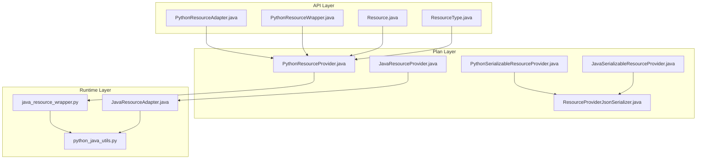
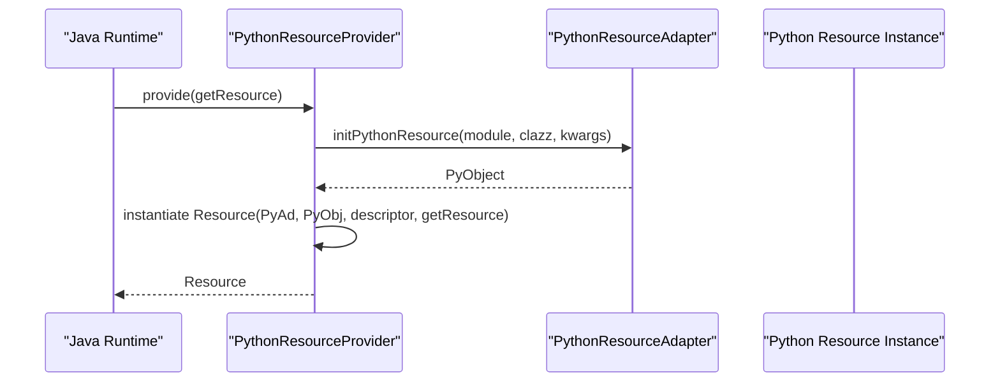
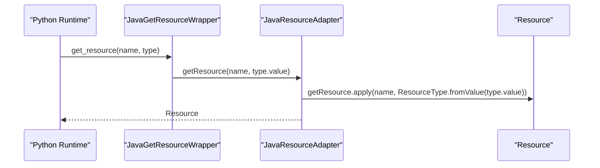
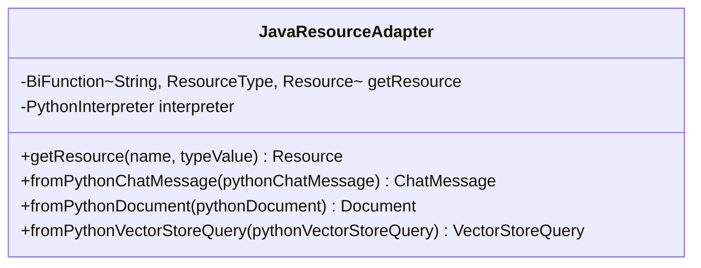
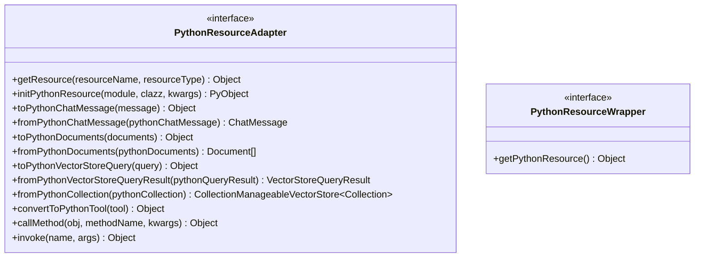
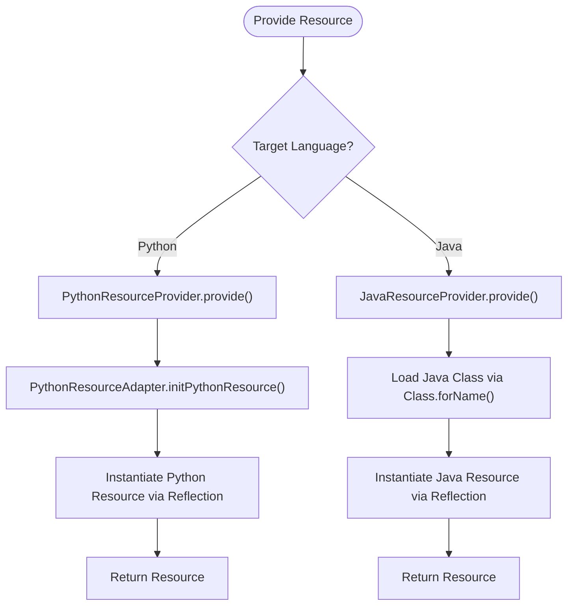
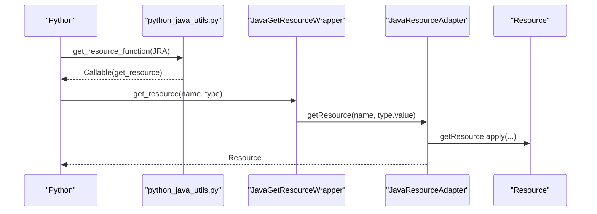
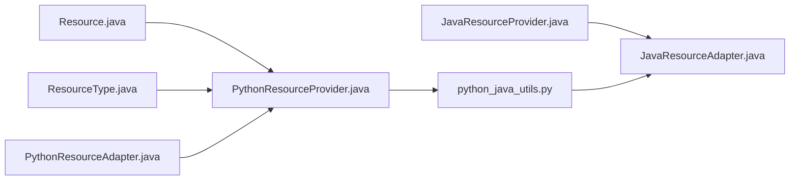

# Cross-Language Communication

<cite>
**Referenced Files in This Document**
- [JavaResourceAdapter.java](file://runtime/src/main/java/org/apache/flink/agents/runtime/python/utils/JavaResourceAdapter.java)
- [PythonResourceAdapter.java](file://api/src/main/java/org/apache/flink/agents/api/resource/python/PythonResourceAdapter.java)
- [PythonResourceWrapper.java](file://api/src/main/java/org/apache/flink/agents/api/resource/python/PythonResourceWrapper.java)
- [Resource.java](file://api/src/main/java/org/apache/flink/agents/api/resource/Resource.java)
- [ResourceType.java](file://api/src/main/java/org/apache/flink/agents/api/resource/ResourceType.java)
- [PythonResourceProvider.java](file://plan/src/main/java/org/apache/flink/agents/plan/resourceprovider/PythonResourceProvider.java)
- [JavaResourceProvider.java](file://plan/src/main/java/org/apache/flink/agents/plan/resourceprovider/JavaResourceProvider.java)
- [PythonSerializableResourceProvider.java](file://plan/src/main/java/org/apache/flink/agents/plan/resourceprovider/PythonSerializableResourceProvider.java)
- [JavaSerializableResourceProvider.java](file://plan/src/main/java/org/apache/flink/agents/plan/resourceprovider/JavaSerializableResourceProvider.java)
- [ResourceProviderJsonSerializer.java](file://plan/src/main/java/org/apache/flink/agents/plan/serializer/ResourceProviderJsonSerializer.java)
- [java_resource_wrapper.py](file://python/flink_agents/runtime/java/java_resource_wrapper.py)
- [python_java_utils.py](file://python/flink_agents/runtime/python_java_utils.py)
- [ChatModelCrossLanguageTest.java](file://e2e-test/flink-agents-end-to-end-tests-resource-cross-language/src/test/java/org/apache/flink/agents/resource/test/ChatModelCrossLanguageTest.java)
- [vector_stores.md](file://docs/content/docs/development/vector_stores.md)
</cite>

## Table of Contents
1. [Introduction](#introduction)
2. [Project Structure](#project-structure)
3. [Core Components](#core-components)
4. [Architecture Overview](#architecture-overview)
5. [Detailed Component Analysis](#detailed-component-analysis)
6. [Dependency Analysis](#dependency-analysis)
7. [Performance Considerations](#performance-considerations)
8. [Troubleshooting Guide](#troubleshooting-guide)
9. [Conclusion](#conclusion)
10. [Appendices](#appendices)

## Introduction
This document explains cross-language communication between Python and Java in Flink Agents. It focuses on how resources are serialized and deserialized across language boundaries, how JavaResourceAdapter and PythonResourceAdapter enable interoperability, and how method invocation, parameter passing, and return value handling work. It also covers debugging techniques, memory management considerations, and optimization strategies for efficient cross-language calls.

## Project Structure
Cross-language capabilities span three layers:
- API layer: Resource abstractions and adapters that define the contract for cross-language operations.
- Plan layer: Resource providers and serializers that package resource metadata and serialized forms for transport.
- Runtime layer: Adapters and wrappers that bridge Java and Python environments and handle conversions.

**Diagram sources**
- [PythonResourceAdapter.java](file://api/src/main/java/org/apache/flink/agents/api/resource/python/PythonResourceAdapter.java#L37-L140)
- [PythonResourceWrapper.java](file://api/src/main/java/org/apache/flink/agents/api/resource/python/PythonResourceWrapper.java#L24-L32)
- [Resource.java](file://api/src/main/java/org/apache/flink/agents/api/resource/Resource.java#L30-L70)
- [ResourceType.java](file://api/src/main/java/org/apache/flink/agents/api/resource/ResourceType.java#L26-L61)
- [PythonResourceProvider.java](file://plan/src/main/java/org/apache/flink/agents/plan/resourceprovider/PythonResourceProvider.java#L47-L126)
- [JavaResourceProvider.java](file://plan/src/main/java/org/apache/flink/agents/plan/resourceprovider/JavaResourceProvider.java#L29-L51)
- [PythonSerializableResourceProvider.java](file://plan/src/main/java/org/apache/flink/agents/plan/resourceprovider/PythonSerializableResourceProvider.java#L37-L84)
- [JavaSerializableResourceProvider.java](file://plan/src/main/java/org/apache/flink/agents/plan/resourceprovider/JavaSerializableResourceProvider.java#L36-L62)
- [ResourceProviderJsonSerializer.java](file://plan/src/main/java/org/apache/flink/agents/plan/serializer/ResourceProviderJsonSerializer.java#L75-L99)
- [JavaResourceAdapter.java](file://runtime/src/main/java/org/apache/flink/agents/runtime/python/utils/JavaResourceAdapter.java#L34-L104)
- [java_resource_wrapper.py](file://python/flink_agents/runtime/java/java_resource_wrapper.py#L69-L79)
- [python_java_utils.py](file://python/flink_agents/runtime/python_java_utils.py#L93-L102)

**Section sources**
- [PythonResourceAdapter.java](file://api/src/main/java/org/apache/flink/agents/api/resource/python/PythonResourceAdapter.java#L32-L140)
- [PythonResourceProvider.java](file://plan/src/main/java/org/apache/flink/agents/plan/resourceprovider/PythonResourceProvider.java#L41-L126)
- [JavaResourceProvider.java](file://plan/src/main/java/org/apache/flink/agents/plan/resourceprovider/JavaResourceProvider.java#L28-L51)
- [JavaResourceAdapter.java](file://runtime/src/main/java/org/apache/flink/agents/runtime/python/utils/JavaResourceAdapter.java#L33-L104)
- [java_resource_wrapper.py](file://python/flink_agents/runtime/java/java_resource_wrapper.py#L69-L79)
- [python_java_utils.py](file://python/flink_agents/runtime/python_java_utils.py#L93-L102)

## Core Components
- Resource abstraction: Defines lifecycle and type identification for all resources.
- Resource types: Enumerates supported resource categories and their string identifiers.
- PythonResourceAdapter: Contract for invoking Python resources and converting data between Java and Python.
- JavaResourceAdapter: Bridge for retrieving Java resources from Python and converting Python objects to Java equivalents.
- Resource providers: Package resource metadata and constructors for cross-language instantiation.
- Serializers: Encode/decode resource providers for plan transport.

Key responsibilities:
- Serialization/Deserialization: Transport resource descriptors and serialized forms across languages.
- Resource Wrapping/Unwrapping: Provide unified access to underlying Python/Java resources.
- Interoperability: Enable method invocation and data conversion with minimal overhead.

**Section sources**
- [Resource.java](file://api/src/main/java/org/apache/flink/agents/api/resource/Resource.java#L30-L70)
- [ResourceType.java](file://api/src/main/java/org/apache/flink/agents/api/resource/ResourceType.java#L26-L61)
- [PythonResourceAdapter.java](file://api/src/main/java/org/apache/flink/agents/api/resource/python/PythonResourceAdapter.java#L37-L140)
- [JavaResourceAdapter.java](file://runtime/src/main/java/org/apache/flink/agents/runtime/python/utils/JavaResourceAdapter.java#L34-L104)
- [PythonResourceProvider.java](file://plan/src/main/java/org/apache/flink/agents/plan/resourceprovider/PythonResourceProvider.java#L47-L126)
- [JavaResourceProvider.java](file://plan/src/main/java/org/apache/flink/agents/plan/resourceprovider/JavaResourceProvider.java#L29-L51)
- [PythonSerializableResourceProvider.java](file://plan/src/main/java/org/apache/flink/agents/plan/resourceprovider/PythonSerializableResourceProvider.java#L37-L84)
- [JavaSerializableResourceProvider.java](file://plan/src/main/java/org/apache/flink/agents/plan/resourceprovider/JavaSerializableResourceProvider.java#L36-L62)
- [ResourceProviderJsonSerializer.java](file://plan/src/main/java/org/apache/flink/agents/plan/serializer/ResourceProviderJsonSerializer.java#L75-L99)

## Architecture Overview
The cross-language architecture enables:
- Java to call Python resources via a PythonResourceAdapter-backed provider.
- Python to call Java resources via a JavaResourceAdapter-backed wrapper.
- Consistent resource type identification and conversion utilities.

**Diagram sources**
- [PythonResourceProvider.java](file://plan/src/main/java/org/apache/flink/agents/plan/resourceprovider/PythonResourceProvider.java#L76-L126)
- [PythonResourceAdapter.java](file://api/src/main/java/org/apache/flink/agents/api/resource/python/PythonResourceAdapter.java#L56-L56)

**Diagram sources**
- [java_resource_wrapper.py](file://python/flink_agents/runtime/java/java_resource_wrapper.py#L77-L79)
- [JavaResourceAdapter.java](file://runtime/src/main/java/org/apache/flink/agents/runtime/python/utils/JavaResourceAdapter.java#L54-L56)

## Detailed Component Analysis

### JavaResourceAdapter
Purpose:
- Bridges Python to Java by exposing getResource and conversion helpers to Python.
- Converts Python objects to Java equivalents using the embedded Python interpreter.

Key methods:
- getResource(name, typeValue): resolves a Resource by name and type.
- fromPythonChatMessage(pythonChatMessage): updates a Java ChatMessage from Python.
- fromPythonDocument(pythonDocument): constructs a Java Document from Python attributes.
- fromPythonVectorStoreQuery(pythonVectorStoreQuery): constructs a Java VectorStoreQuery from Python attributes.

Design notes:
- Uses a transient PythonInterpreter to invoke helper functions for robust attribute access.
- Provides convenience methods to avoid direct Python class reflection pitfalls.

**Diagram sources**
- [JavaResourceAdapter.java](file://runtime/src/main/java/org/apache/flink/agents/runtime/python/utils/JavaResourceAdapter.java#L34-L104)

**Section sources**
- [JavaResourceAdapter.java](file://runtime/src/main/java/org/apache/flink/agents/runtime/python/utils/JavaResourceAdapter.java#L34-L104)

### PythonResourceAdapter and PythonResourceWrapper
Purpose:
- Defines the contract for Python-side resource access and conversions from Java.
- Provides wrappers to access underlying Python resource objects.

Key methods:
- getResource(resourceName, resourceType): retrieves a Python resource by name/type.
- initPythonResource(module, clazz, kwargs): instantiates a Python resource via the adapter.
- Data conversion helpers: to/from Python ChatMessage, Documents, VectorStoreQuery, Collections, Tools.

Wrapper interface:
- PythonResourceWrapper exposes getPythonResource() to access the underlying Python object.

**Diagram sources**
- [PythonResourceAdapter.java](file://api/src/main/java/org/apache/flink/agents/api/resource/python/PythonResourceAdapter.java#L37-L140)
- [PythonResourceWrapper.java](file://api/src/main/java/org/apache/flink/agents/api/resource/python/PythonResourceWrapper.java#L24-L32)

**Section sources**
- [PythonResourceAdapter.java](file://api/src/main/java/org/apache/flink/agents/api/resource/python/PythonResourceAdapter.java#L37-L140)
- [PythonResourceWrapper.java](file://api/src/main/java/org/apache/flink/agents/api/resource/python/PythonResourceWrapper.java#L24-L32)

### Resource Providers and Serialization
Purpose:
- Encapsulate resource metadata and constructors for cross-language provisioning.
- Serialize/deserialize resource providers for plan transport.

Key components:
- PythonResourceProvider: builds Python resources using PythonResourceAdapter and reflection.
- JavaResourceProvider: loads Java classes and constructs resources via reflection.
- PythonSerializableResourceProvider and JavaSerializableResourceProvider: carry serialized forms for transport and reconstruction.
- ResourceProviderJsonSerializer: writes serialized provider fields for cross-language persistence.

**Diagram sources**
- [PythonResourceProvider.java](file://plan/src/main/java/org/apache/flink/agents/plan/resourceprovider/PythonResourceProvider.java#L76-L126)
- [JavaResourceProvider.java](file://plan/src/main/java/org/apache/flink/agents/plan/resourceprovider/JavaResourceProvider.java#L37-L51)

**Section sources**
- [PythonResourceProvider.java](file://plan/src/main/java/org/apache/flink/agents/plan/resourceprovider/PythonResourceProvider.java#L47-L126)
- [JavaResourceProvider.java](file://plan/src/main/java/org/apache/flink/agents/plan/resourceprovider/JavaResourceProvider.java#L29-L51)
- [PythonSerializableResourceProvider.java](file://plan/src/main/java/org/apache/flink/agents/plan/resourceprovider/PythonSerializableResourceProvider.java#L37-L84)
- [JavaSerializableResourceProvider.java](file://plan/src/main/java/org/apache/flink/agents/plan/resourceprovider/JavaSerializableResourceProvider.java#L36-L62)
- [ResourceProviderJsonSerializer.java](file://plan/src/main/java/org/apache/flink/agents/plan/serializer/ResourceProviderJsonSerializer.java#L75-L99)

### Python-Java Interoperability Layer
Purpose:
- Provide method invocation, parameter passing, and return value handling across languages.
- Offer conversion utilities for common types.

Implementation highlights:
- PythonResourceAdapter defines method invocation and conversion APIs.
- JavaResourceAdapter exposes getResource and conversion helpers to Python.
- python_java_utils bridges conversions and resource creation in Python.
- java_resource_wrapper.py exposes JavaResourceAdapter to Python via a thin wrapper.

**Diagram sources**
- [python_java_utils.py](file://python/flink_agents/runtime/python_java_utils.py#L93-L102)
- [java_resource_wrapper.py](file://python/flink_agents/runtime/java/java_resource_wrapper.py#L77-L79)
- [JavaResourceAdapter.java](file://runtime/src/main/java/org/apache/flink/agents/runtime/python/utils/JavaResourceAdapter.java#L54-L56)

**Section sources**
- [python_java_utils.py](file://python/flink_agents/runtime/python_java_utils.py#L93-L102)
- [java_resource_wrapper.py](file://python/flink_agents/runtime/java/java_resource_wrapper.py#L69-L79)
- [JavaResourceAdapter.java](file://runtime/src/main/java/org/apache/flink/agents/runtime/python/utils/JavaResourceAdapter.java#L34-L104)

### Examples of Cross-Language Resource Usage
- Using Java vector stores in Python: wrap with the Java wrapper resource name and specify the Java provider class via a dedicated parameter.
- Using Python vector stores in Java: wrap with the Python wrapper resource name and specify the Python provider via a dedicated parameter.

These usage patterns are documented in the vector store guide.

**Section sources**
- [vector_stores.md](file://docs/content/docs/development/vector_stores.md#L609-L624)

## Dependency Analysis
High-level dependencies:
- API layer depends on runtime converters and plan serializers.
- Plan layer depends on API resource abstractions and adapters.
- Runtime layer depends on Python interpreter bindings and Java class loaders.

**Diagram sources**
- [Resource.java](file://api/src/main/java/org/apache/flink/agents/api/resource/Resource.java#L30-L70)
- [ResourceType.java](file://api/src/main/java/org/apache/flink/agents/api/resource/ResourceType.java#L26-L61)
- [PythonResourceAdapter.java](file://api/src/main/java/org/apache/flink/agents/api/resource/python/PythonResourceAdapter.java#L37-L140)
- [PythonResourceProvider.java](file://plan/src/main/java/org/apache/flink/agents/plan/resourceprovider/PythonResourceProvider.java#L47-L126)
- [JavaResourceProvider.java](file://plan/src/main/java/org/apache/flink/agents/plan/resourceprovider/JavaResourceProvider.java#L29-L51)
- [python_java_utils.py](file://python/flink_agents/runtime/python_java_utils.py#L93-L102)
- [JavaResourceAdapter.java](file://runtime/src/main/java/org/apache/flink/agents/runtime/python/utils/JavaResourceAdapter.java#L34-L104)

**Section sources**
- [PythonResourceProvider.java](file://plan/src/main/java/org/apache/flink/agents/plan/resourceprovider/PythonResourceProvider.java#L47-L126)
- [JavaResourceProvider.java](file://plan/src/main/java/org/apache/flink/agents/plan/resourceprovider/JavaResourceProvider.java#L29-L51)
- [JavaResourceAdapter.java](file://runtime/src/main/java/org/apache/flink/agents/runtime/python/utils/JavaResourceAdapter.java#L34-L104)
- [python_java_utils.py](file://python/flink_agents/runtime/python_java_utils.py#L93-L102)

## Performance Considerations
- Minimize cross-language boundary crossings by batching operations where possible.
- Prefer lightweight conversions and avoid deep copies of large objects.
- Use cached PythonFunction instances for frequently invoked Python callables to reduce repeated lookup costs.
- Keep resource construction off-hot-path by pre-warming resources via resource providers.
- Avoid excessive reflection by reusing loaded classes and adapters.

[No sources needed since this section provides general guidance]

## Troubleshooting Guide
Common issues and remedies:
- Resource type mismatch: Ensure ResourceType string values match between Java and Python.
- Python class resolution errors: Verify module and class names are correct and importable in the Python environment.
- Java class loading failures: Confirm class names and classpath entries are valid in the Java runtime.
- Conversion errors: Validate that Python objects expose expected attributes and that Java adapters receive compatible types.
- Interpreter state: Ensure the Python interpreter is initialized and configured before invoking conversion helpers.

Validation references:
- End-to-end tests demonstrate successful cross-language resource usage and pipeline execution.

**Section sources**
- [ChatModelCrossLanguageTest.java](file://e2e-test/flink-agents-end-to-end-tests-resource-cross-language/src/test/java/org/apache/flink/agents/resource/test/ChatModelCrossLanguageTest.java#L48-L104)

## Conclusion
Flink Agents implements robust cross-language communication between Python and Java through a layered design:
- Clear resource abstractions and type identification.
- Resource providers that package metadata and constructors for cross-language provisioning.
- Adapters that bridge Java and Python environments and handle conversions.
- Utilities that streamline method invocation and data exchange.

By following the patterns outlined here, developers can reliably compose agents that leverage resources from both languages while maintaining performance and debuggability.

[No sources needed since this section summarizes without analyzing specific files]

## Appendices

### Data Conversion Reference
- ChatMessage: bidirectional conversion between Java and Python.
- Document: conversion with content, metadata, and optional embeddings.
- VectorStoreQuery/Result: conversion with mode, query text, limits, and collections.
- Tool metadata: conversion of tool schemas and metadata for cross-language tool use.

**Section sources**
- [python_java_utils.py](file://python/flink_agents/runtime/python_java_utils.py#L174-L254)
- [JavaResourceAdapter.java](file://runtime/src/main/java/org/apache/flink/agents/runtime/python/utils/JavaResourceAdapter.java#L65-L103)