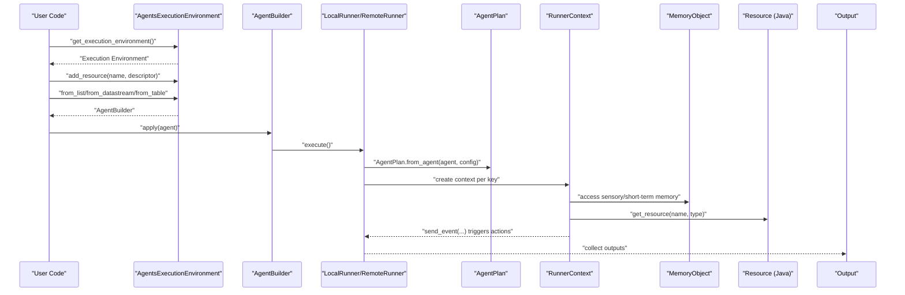
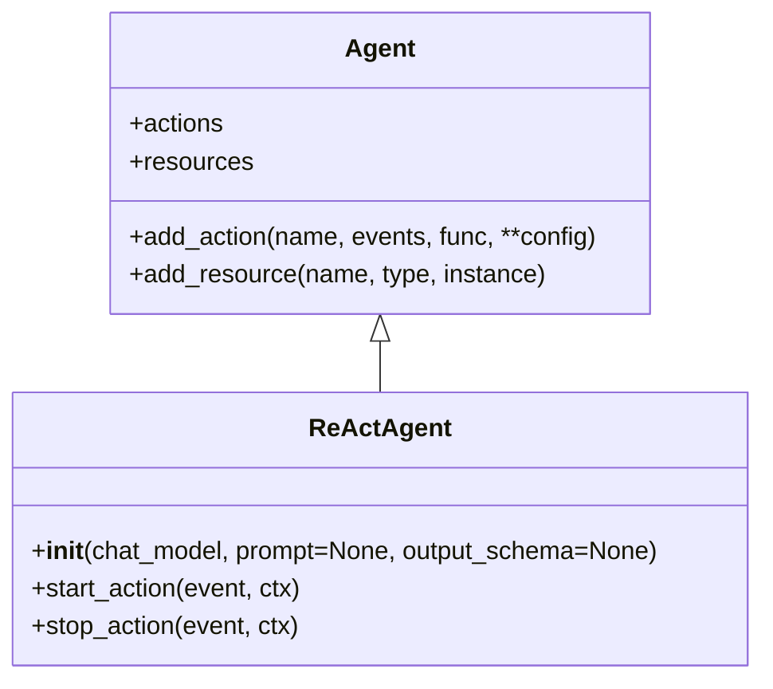
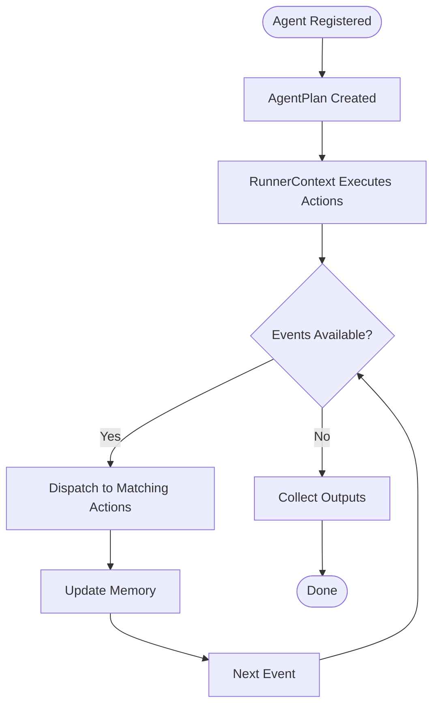
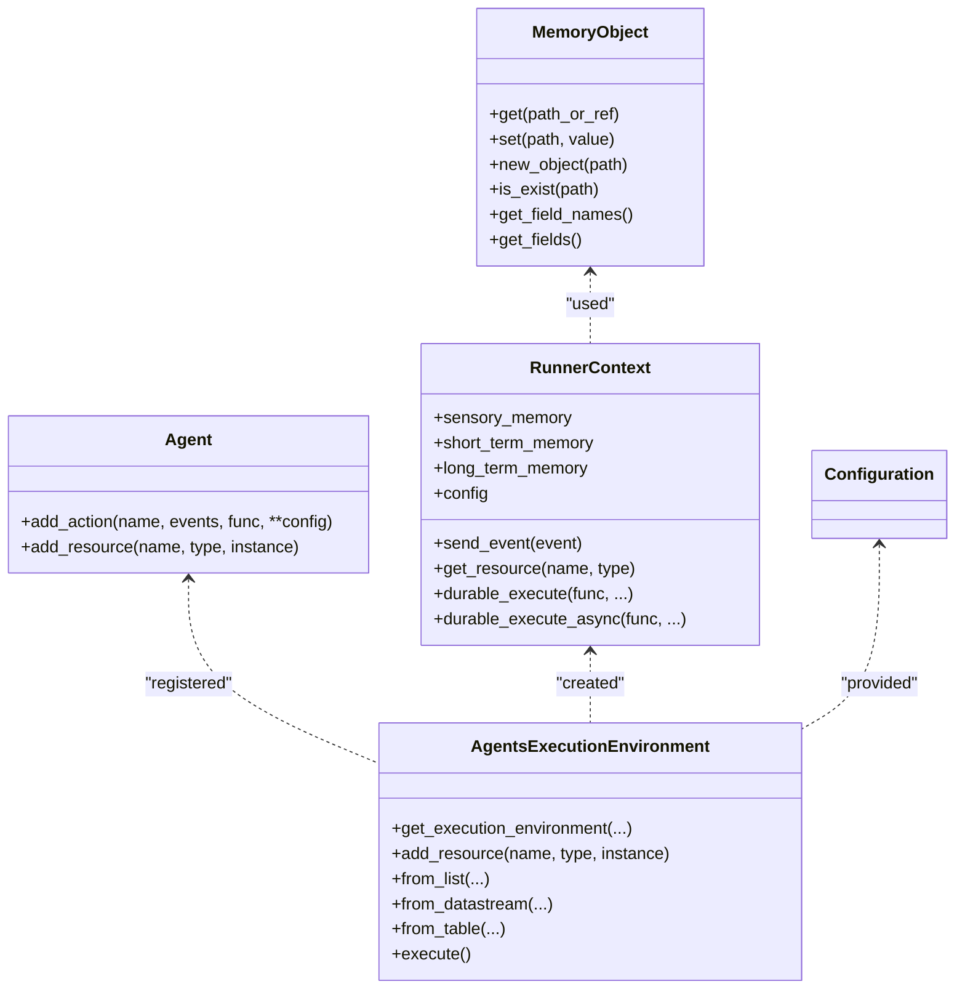
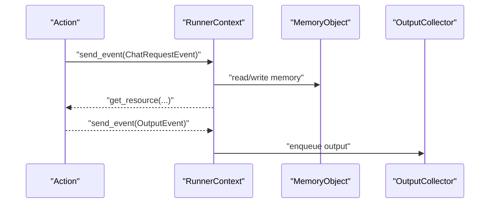
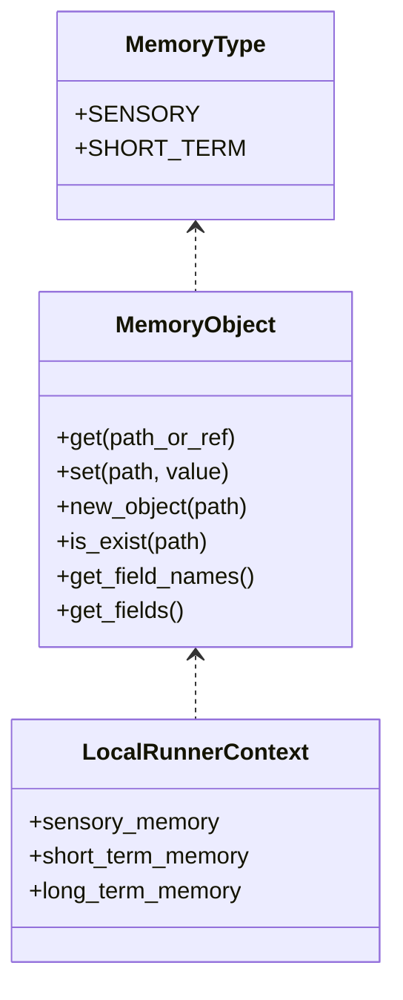
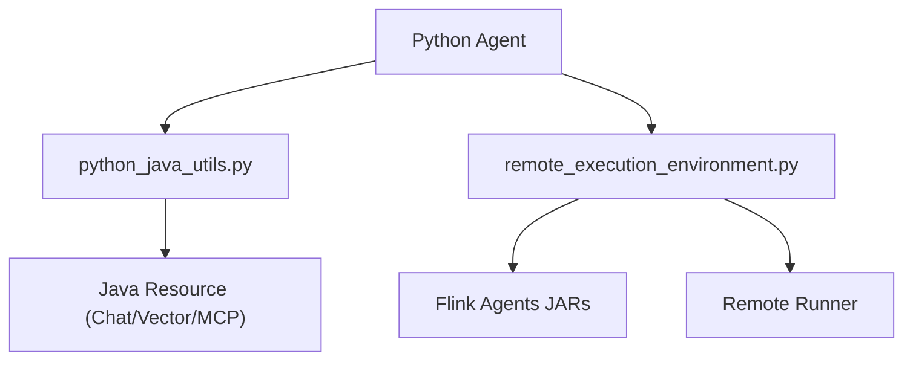
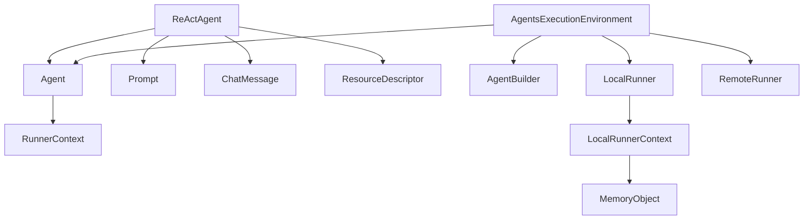

# Python Agent Development

<cite>
**Referenced Files in This Document**
- [python/flink_agents/api/agents/react_agent.py](file://python/flink_agents/api/agents/react_agent.py)
- [python/flink_agents/api/agents/agent.py](file://python/flink_agents/api/agents/agent.py)
- [python/flink_agents/api/execution_environment.py](file://python/flink_agents/api/execution_environment.py)
- [python/flink_agents/api/runner_context.py](file://python/flink_agents/api/runner_context.py)
- [python/flink_agents/api/memory_object.py](file://python/flink_agents/api/memory_object.py)
- [python/flink_agents/api/configuration.py](file://python/flink_agents/api/configuration.py)
- [python/flink_agents/runtime/local_runner.py](file://python/flink_agents/runtime/local_runner.py)
- [python/flink_agents/runtime/agent_runner.py](file://python/flink_agents/runtime/agent_runner.py)
- [python/flink_agents/plan/agent_plan.py](file://python/flink_agents/plan/agent_plan.py)
- [python/flink_agents/plan/function.py](file://python/flink_agents/plan/function.py)
- [python/flink_agents/plan/actions/action.py](file://python/flink_agents/plan/actions/action.py)
- [python/flink_agents/plan/actions/chat_model_action.py](file://python/flink_agents/plan/actions/chat_model_action.py)
- [python/flink_agents/plan/actions/tool_call_action.py](file://python/flink_agents/plan/actions/tool_call_action.py)
- [python/flink_agents/plan/actions/context_retrieval_action.py](file://python/flink_agents/plan/actions/context_retrieval_action.py)
- [python/flink_agents/runtime/local_execution_environment.py](file://python/flink_agents/runtime/local_execution_environment.py)
- [python/flink_agents/runtime/remote_execution_environment.py](file://python/flink_agents/runtime/remote_execution_environment.py)
- [python/flink_agents/runtime/flink_runner_context.py](file://python/flink_agents/runtime/flink_runner_context.py)
- [python/flink_agents/runtime/flink_memory_object.py](file://python/flink_agents/runtime/flink_memory_object.py)
- [python/flink_agents/runtime/python_java_utils.py](file://python/flink_agents/runtime/python_java_utils.py)
- [python/flink_agents/integrations/chat_models/ollama_chat_model.py](file://python/flink_agents/integrations/chat_models/ollama_chat_model.py)
- [python/flink_agents/integrations/vector_stores/chroma/chroma_vector_store.py](file://python/flink_agents/integrations/vector_stores/chroma/chroma_vector_store.py)
- [python/flink_agents/integrations/embedding_models/local/ollama_embedding_model.py](file://python/flink_agents/integrations/embedding_models/local/ollama_embedding_model.py)
- [python/flink_agents/integrations/mcp/mcp.py](file://python/flink_agents/integrations/mcp/mcp.py)
- [examples/src/main/java/org/apache/flink/agents/examples/ReActAgentExample.java](file://examples/src/main/java/org/apache/flink/agents/examples/ReActAgentExample.java)
- [e2e-test/flink-agents-end-to-end-tests-resource-cross-language/src/test/java/org/apache/flink/agents/resource/test/ChatModelCrossLanguageTest.java](file://e2e-test/flink-agents-end-to-end-tests-resource-cross-language/src/test/java/org/apache/flink/agents/resource/test/ChatModelCrossLanguageTest.java)
- [e2e-test/flink-agents-end-to-end-tests-resource-cross-language/src/test/resources/mcp_server.py](file://e2e-test/flink-agents-end-to-end-tests-resource-cross-language/src/test/resources/mcp_server.py)
</cite>

## Table of Contents
1. [Introduction](#introduction)
2. [Project Structure](#project-structure)
3. [Core Components](#core-components)
4. [Architecture Overview](#architecture-overview)
5. [Detailed Component Analysis](#detailed-component-analysis)
6. [Dependency Analysis](#dependency-analysis)
7. [Performance Considerations](#performance-considerations)
8. [Troubleshooting Guide](#troubleshooting-guide)
9. [Conclusion](#conclusion)
10. [Appendices](#appendices)

## Introduction
This document explains how to develop Python-based agents in Flink Agents. It focuses on the Python ReAct agent implementation, agent lifecycle management, and development patterns. It documents Python-specific agent APIs including configuration, execution context, and output handling. It also covers agent state management, memory integration, and cross-language communication patterns with Java. Practical examples show how to build custom Python agents, configure agent parameters, and integrate with external Python libraries. Finally, it provides debugging techniques, performance optimization tips, and migration strategies between Python and Java agent implementations.

## Project Structure
Flink Agents separates concerns into:
- API layer: Agent base classes, execution environments, runner context, configuration, memory abstractions, and event types.
- Plan layer: Serialization and plan representation of agents, actions, and resources.
- Runtime layer: Execution runners (local and remote), memory implementations, and Python-Java bridge utilities.
- Integrations: Ready-to-use connectors for chat models, embeddings, vector stores, and MCP.

```mermaid
graph TB
subgraph "API Layer"
A1["agents/agent.py"]
A2["agents/react_agent.py"]
A3["execution_environment.py"]
A4["runner_context.py"]
A5["memory_object.py"]
A6["configuration.py"]
end
subgraph "Plan Layer"
P1["plan/agent_plan.py"]
P2["plan/function.py"]
P3["plan/actions/action.py"]
P4["plan/actions/chat_model_action.py"]
P5["plan/actions/tool_call_action.py"]
P6["plan/actions/context_retrieval_action.py"]
end
subgraph "Runtime Layer"
R1["runtime/local_runner.py"]
R2["runtime/agent_runner.py"]
R3["runtime/local_execution_environment.py"]
R4["runtime/remote_execution_environment.py"]
R5["runtime/flink_runner_context.py"]
R6["runtime/flink_memory_object.py"]
R7["runtime/python_java_utils.py"]
end
subgraph "Integrations"
I1["integrations/chat_models/ollama_chat_model.py"]
I2["integrations/vector_stores/chroma/chroma_vector_store.py"]
I3["integrations/embedding_models/local/ollama_embedding_model.py"]
I4["integrations/mcp/mcp.py"]
end
A2 --> A1
A3 --> A1
A4 --> A1
A5 --> A1
A6 --> A1
P1 --> A1
P2 --> A1
P3 --> A1
P4 --> A1
P5 --> A1
P6 --> A1
R1 --> A1
R2 --> A1
R3 --> A3
R4 --> A3
R5 --> A4
R6 --> A5
R7 --> A1
I1 --> A1
I2 --> A1
I3 --> A1
I4 --> A1
```

**Diagram sources**
- [python/flink_agents/api/agents/react_agent.py](file://python/flink_agents/api/agents/react_agent.py#L42-L212)
- [python/flink_agents/api/agents/agent.py](file://python/flink_agents/api/agents/agent.py#L31-L160)
- [python/flink_agents/api/execution_environment.py](file://python/flink_agents/api/execution_environment.py#L91-L253)
- [python/flink_agents/api/runner_context.py](file://python/flink_agents/api/runner_context.py#L76-L291)
- [python/flink_agents/api/memory_object.py](file://python/flink_agents/api/memory_object.py#L32-L126)
- [python/flink_agents/api/configuration.py](file://python/flink_agents/api/configuration.py#L22-L170)
- [python/flink_agents/plan/agent_plan.py](file://python/flink_agents/plan/agent_plan.py)
- [python/flink_agents/plan/function.py](file://python/flink_agents/plan/function.py)
- [python/flink_agents/plan/actions/action.py](file://python/flink_agents/plan/actions/action.py)
- [python/flink_agents/plan/actions/chat_model_action.py](file://python/flink_agents/plan/actions/chat_model_action.py)
- [python/flink_agents/plan/actions/tool_call_action.py](file://python/flink_agents/plan/actions/tool_call_action.py)
- [python/flink_agents/plan/actions/context_retrieval_action.py](file://python/flink_agents/plan/actions/context_retrieval_action.py)
- [python/flink_agents/runtime/local_runner.py](file://python/flink_agents/runtime/local_runner.py#L252-L356)
- [python/flink_agents/runtime/agent_runner.py](file://python/flink_agents/runtime/agent_runner.py#L22-L44)
- [python/flink_agents/runtime/local_execution_environment.py](file://python/flink_agents/runtime/local_execution_environment.py)
- [python/flink_agents/runtime/remote_execution_environment.py](file://python/flink_agents/runtime/remote_execution_environment.py)
- [python/flink_agents/runtime/flink_runner_context.py](file://python/flink_agents/runtime/flink_runner_context.py)
- [python/flink_agents/runtime/flink_memory_object.py](file://python/flink_agents/runtime/flink_memory_object.py)
- [python/flink_agents/runtime/python_java_utils.py](file://python/flink_agents/runtime/python_java_utils.py)
- [python/flink_agents/integrations/chat_models/ollama_chat_model.py](file://python/flink_agents/integrations/chat_models/ollama_chat_model.py)
- [python/flink_agents/integrations/vector_stores/chroma/chroma_vector_store.py](file://python/flink_agents/integrations/vector_stores/chroma/chroma_vector_store.py)
- [python/flink_agents/integrations/embedding_models/local/ollama_embedding_model.py](file://python/flink_agents/integrations/embedding_models/local/ollama_embedding_model.py)
- [python/flink_agents/integrations/mcp/mcp.py](file://python/flink_agents/integrations/mcp/mcp.py)

**Section sources**
- [python/flink_agents/api/agents/react_agent.py](file://python/flink_agents/api/agents/react_agent.py#L42-L212)
- [python/flink_agents/api/agents/agent.py](file://python/flink_agents/api/agents/agent.py#L31-L160)
- [python/flink_agents/api/execution_environment.py](file://python/flink_agents/api/execution_environment.py#L91-L253)
- [python/flink_agents/api/runner_context.py](file://python/flink_agents/api/runner_context.py#L76-L291)
- [python/flink_agents/api/memory_object.py](file://python/flink_agents/api/memory_object.py#L32-L126)
- [python/flink_agents/api/configuration.py](file://python/flink_agents/api/configuration.py#L22-L170)
- [python/flink_agents/runtime/local_runner.py](file://python/flink_agents/runtime/local_runner.py#L252-L356)
- [python/flink_agents/runtime/agent_runner.py](file://python/flink_agents/runtime/agent_runner.py#L22-L44)
- [python/flink_agents/runtime/local_execution_environment.py](file://python/flink_agents/runtime/local_execution_environment.py)
- [python/flink_agents/runtime/remote_execution_environment.py](file://python/flink_agents/runtime/remote_execution_environment.py)
- [python/flink_agents/runtime/flink_runner_context.py](file://python/flink_agents/runtime/flink_runner_context.py)
- [python/flink_agents/runtime/flink_memory_object.py](file://python/flink_agents/runtime/flink_memory_object.py)
- [python/flink_agents/runtime/python_java_utils.py](file://python/flink_agents/runtime/python_java_utils.py)
- [python/flink_agents/integrations/chat_models/ollama_chat_model.py](file://python/flink_agents/integrations/chat_models/ollama_chat_model.py)
- [python/flink_agents/integrations/vector_stores/chroma/chroma_vector_store.py](file://python/flink_agents/integrations/vector_stores/chroma/chroma_vector_store.py)
- [python/flink_agents/integrations/embedding_models/local/ollama_embedding_model.py](file://python/flink_agents/integrations/embedding_models/local/ollama_embedding_model.py)
- [python/flink_agents/integrations/mcp/mcp.py](file://python/flink_agents/integrations/mcp/mcp.py)

## Core Components
- Agent base and ReAct agent: Define agent logic, actions, and resources. The ReAct agent orchestrates prompting, structured output, and tool/function calls via a chat model.
- Execution environment: Provides AgentsExecutionEnvironment to create builders for DataStream/Table/List inputs and to execute agents locally or remotely.
- Runner context: Supplies capabilities to send events, access memory, durable execution, and configuration.
- Memory abstraction: Defines MemoryObject and MemoryType for sensory and short-term memory.
- Configuration: Provides typed configuration options and readable/writable configuration interfaces.
- Plan and actions: Serializes agent plans, functions, and action handlers for execution.
- Runtime runners: LocalRunner for IDE debugging and RemoteRunner for production Flink jobs.
- Cross-language utilities: Bridges Python and Java worlds for resources and execution.

**Section sources**
- [python/flink_agents/api/agents/agent.py](file://python/flink_agents/api/agents/agent.py#L31-L160)
- [python/flink_agents/api/agents/react_agent.py](file://python/flink_agents/api/agents/react_agent.py#L42-L212)
- [python/flink_agents/api/execution_environment.py](file://python/flink_agents/api/execution_environment.py#L91-L253)
- [python/flink_agents/api/runner_context.py](file://python/flink_agents/api/runner_context.py#L76-L291)
- [python/flink_agents/api/memory_object.py](file://python/flink_agents/api/memory_object.py#L32-L126)
- [python/flink_agents/api/configuration.py](file://python/flink_agents/api/configuration.py#L22-L170)
- [python/flink_agents/runtime/local_runner.py](file://python/flink_agents/runtime/local_runner.py#L252-L356)
- [python/flink_agents/runtime/agent_runner.py](file://python/flink_agents/runtime/agent_runner.py#L22-L44)
- [python/flink_agents/runtime/python_java_utils.py](file://python/flink_agents/runtime/python_java_utils.py)

## Architecture Overview
The Python agent pipeline integrates user-defined agents with Flink’s streaming runtime. Agents declare actions and resources, which are serialized into an AgentPlan. The runtime executes actions in response to events, manages memory, and handles durable execution. Cross-language bridges enable Java-backed resources (chat models, vector stores) to be used seamlessly from Python.

**Diagram sources**
- [python/flink_agents/api/execution_environment.py](file://python/flink_agents/api/execution_environment.py#L108-L222)
- [python/flink_agents/runtime/local_runner.py](file://python/flink_agents/runtime/local_runner.py#L273-L356)
- [python/flink_agents/plan/agent_plan.py](file://python/flink_agents/plan/agent_plan.py)
- [python/flink_agents/runtime/flink_runner_context.py](file://python/flink_agents/runtime/flink_runner_context.py)
- [python/flink_agents/runtime/flink_memory_object.py](file://python/flink_agents/runtime/flink_memory_object.py)

## Detailed Component Analysis

### Python ReAct Agent Implementation
The ReAct agent encapsulates a function-call-based reasoning loop:
- Initialization registers a default chat model resource and optional schema/system prompts.
- The start action formats user input into ChatMessage lists, optionally guided by a user prompt and enforced by a schema prompt.
- On receiving a chat response, the stop action emits structured or raw output.

**Diagram sources**
- [python/flink_agents/api/agents/agent.py](file://python/flink_agents/api/agents/agent.py#L31-L160)
- [python/flink_agents/api/agents/react_agent.py](file://python/flink_agents/api/agents/react_agent.py#L42-L212)

**Section sources**
- [python/flink_agents/api/agents/react_agent.py](file://python/flink_agents/api/agents/react_agent.py#L97-L212)
- [python/flink_agents/api/agents/agent.py](file://python/flink_agents/api/agents/agent.py#L108-L160)

### Agent Lifecycle Management
Lifecycle stages:
- Registration: Resources and actions are registered on the agent instance.
- Planning: AgentPlan serializes the agent definition and resources.
- Execution: RunnerContext drives actions in response to events, managing memory and durable execution.
- Output: Outputs are collected and emitted as OutputEvents.

**Diagram sources**
- [python/flink_agents/plan/agent_plan.py](file://python/flink_agents/plan/agent_plan.py)
- [python/flink_agents/runtime/local_runner.py](file://python/flink_agents/runtime/local_runner.py#L324-L345)

**Section sources**
- [python/flink_agents/runtime/local_runner.py](file://python/flink_agents/runtime/local_runner.py#L273-L356)

### Python-Specific Agent APIs
- Agent base: add_action, add_resource, and introspection of actions/resources.
- Execution environment: AgentsExecutionEnvironment provides get_execution_environment, add_resource, and builder methods for DataStream/Table/List inputs.
- Runner context: send_event, get_resource, memory accessors, durable_execute/durable_execute_async, and configuration access.
- Memory: MemoryObject defines get/set/new_object/is_exist/get_field_names/get_fields.
- Configuration: ConfigOption, ReadableConfiguration, WritableConfiguration.

**Diagram sources**
- [python/flink_agents/api/agents/agent.py](file://python/flink_agents/api/agents/agent.py#L108-L160)
- [python/flink_agents/api/execution_environment.py](file://python/flink_agents/api/execution_environment.py#L108-L222)
- [python/flink_agents/api/runner_context.py](file://python/flink_agents/api/runner_context.py#L76-L291)
- [python/flink_agents/api/memory_object.py](file://python/flink_agents/api/memory_object.py#L32-L126)
- [python/flink_agents/api/configuration.py](file://python/flink_agents/api/configuration.py#L22-L170)

**Section sources**
- [python/flink_agents/api/agents/agent.py](file://python/flink_agents/api/agents/agent.py#L108-L160)
- [python/flink_agents/api/execution_environment.py](file://python/flink_agents/api/execution_environment.py#L108-L222)
- [python/flink_agents/api/runner_context.py](file://python/flink_agents/api/runner_context.py#L76-L291)
- [python/flink_agents/api/memory_object.py](file://python/flink_agents/api/memory_object.py#L32-L126)
- [python/flink_agents/api/configuration.py](file://python/flink_agents/api/configuration.py#L22-L170)

### Execution Context and Output Handling
- RunnerContext provides synchronous and asynchronous durable execution to ensure determinism during recovery.
- Output is produced by actions sending OutputEvent, which the runner collects.
- Memory access is separated into sensory (auto-cleared) and short-term memory.

**Diagram sources**
- [python/flink_agents/api/runner_context.py](file://python/flink_agents/api/runner_context.py#L193-L275)
- [python/flink_agents/runtime/local_runner.py](file://python/flink_agents/runtime/local_runner.py#L324-L345)

**Section sources**
- [python/flink_agents/api/runner_context.py](file://python/flink_agents/api/runner_context.py#L193-L275)
- [python/flink_agents/runtime/local_runner.py](file://python/flink_agents/runtime/local_runner.py#L324-L345)

### State Management and Memory Integration
- MemoryObject supports direct and indirect fields, path-based access, and nested object creation.
- LocalRunnerContext exposes sensory and short-term memory backed by in-memory stores.
- Long-term memory is not supported in local execution (raises NotImplementedError).

**Diagram sources**
- [python/flink_agents/api/memory_object.py](file://python/flink_agents/api/memory_object.py#L27-L126)
- [python/flink_agents/runtime/local_runner.py](file://python/flink_agents/runtime/local_runner.py#L45-L181)

**Section sources**
- [python/flink_agents/api/memory_object.py](file://python/flink_agents/api/memory_object.py#L32-L126)
- [python/flink_agents/runtime/local_runner.py](file://python/flink_agents/runtime/local_runner.py#L45-L181)

### Cross-Language Communication Patterns
- Python-Java bridge utilities enable invoking Java resources from Python agents.
- Remote execution environment adds Flink Agents JARs based on detected Flink version and delegates to a remote runner.
- Examples include chat models, vector stores, and MCP servers integrated from Python.

**Diagram sources**
- [python/flink_agents/runtime/python_java_utils.py](file://python/flink_agents/runtime/python_java_utils.py)
- [python/flink_agents/runtime/remote_execution_environment.py](file://python/flink_agents/runtime/remote_execution_environment.py)
- [python/flink_agents/integrations/chat_models/ollama_chat_model.py](file://python/flink_agents/integrations/chat_models/ollama_chat_model.py)
- [python/flink_agents/integrations/vector_stores/chroma/chroma_vector_store.py](file://python/flink_agents/integrations/vector_stores/chroma/chroma_vector_store.py)
- [python/flink_agents/integrations/mcp/mcp.py](file://python/flink_agents/integrations/mcp/mcp.py)

**Section sources**
- [python/flink_agents/runtime/python_java_utils.py](file://python/flink_agents/runtime/python_java_utils.py)
- [python/flink_agents/runtime/remote_execution_environment.py](file://python/flink_agents/runtime/remote_execution_environment.py)
- [python/flink_agents/integrations/chat_models/ollama_chat_model.py](file://python/flink_agents/integrations/chat_models/ollama_chat_model.py)
- [python/flink_agents/integrations/vector_stores/chroma/chroma_vector_store.py](file://python/flink_agents/integrations/vector_stores/chroma/chroma_vector_store.py)
- [python/flink_agents/integrations/mcp/mcp.py](file://python/flink_agents/integrations/mcp/mcp.py)

### Practical Examples
- Building a ReAct agent with a chat model and output schema is demonstrated in the ReAct agent module docstring.
- Integrating external Python libraries is supported through resources and tools; see integration modules for ready-to-use connectors.

**Section sources**
- [python/flink_agents/api/agents/react_agent.py](file://python/flink_agents/api/agents/react_agent.py#L53-L95)
- [python/flink_agents/integrations/chat_models/ollama_chat_model.py](file://python/flink_agents/integrations/chat_models/ollama_chat_model.py)
- [python/flink_agents/integrations/vector_stores/chroma/chroma_vector_store.py](file://python/flink_agents/integrations/vector_stores/chroma/chroma_vector_store.py)
- [python/flink_agents/integrations/embedding_models/local/ollama_embedding_model.py](file://python/flink_agents/integrations/embedding_models/local/ollama_embedding_model.py)
- [python/flink_agents/integrations/mcp/mcp.py](file://python/flink_agents/integrations/mcp/mcp.py)

### Relationship Between Python and Java Agent Implementations
- Both share the same agent plan serialization and execution model.
- Java agents define resources and actions natively; Python agents register resources via descriptors and leverage Python-Java bridging.
- Migration strategies:
  - Start with Python agents for rapid iteration using local execution environment.
  - Move to remote execution environment for production Flink jobs.
  - Use cross-language resource integration to reuse Java-backed chat models, vector stores, and MCP servers.

**Section sources**
- [python/flink_agents/runtime/local_execution_environment.py](file://python/flink_agents/runtime/local_execution_environment.py)
- [python/flink_agents/runtime/remote_execution_environment.py](file://python/flink_agents/runtime/remote_execution_environment.py)
- [python/flink_agents/runtime/python_java_utils.py](file://python/flink_agents/runtime/python_java_utils.py)

## Dependency Analysis
Key dependencies:
- Agent depends on RunnerContext for eventing and memory.
- ReActAgent depends on Prompt, ChatMessage, and ResourceDescriptor.
- Execution environment depends on plan serialization and runtime runners.
- LocalRunner depends on LocalRunnerContext and MemoryObject.
- Remote execution environment depends on version detection and JAR injection.

**Diagram sources**
- [python/flink_agents/api/agents/agent.py](file://python/flink_agents/api/agents/agent.py#L31-L160)
- [python/flink_agents/api/agents/react_agent.py](file://python/flink_agents/api/agents/react_agent.py#L26-L35)
- [python/flink_agents/api/execution_environment.py](file://python/flink_agents/api/execution_environment.py#L91-L253)
- [python/flink_agents/runtime/local_runner.py](file://python/flink_agents/runtime/local_runner.py#L252-L356)
- [python/flink_agents/runtime/agent_runner.py](file://python/flink_agents/runtime/agent_runner.py#L22-L44)

**Section sources**
- [python/flink_agents/api/agents/agent.py](file://python/flink_agents/api/agents/agent.py#L31-L160)
- [python/flink_agents/api/agents/react_agent.py](file://python/flink_agents/api/agents/react_agent.py#L26-L35)
- [python/flink_agents/api/execution_environment.py](file://python/flink_agents/api/execution_environment.py#L91-L253)
- [python/flink_agents/runtime/local_runner.py](file://python/flink_agents/runtime/local_runner.py#L252-L356)
- [python/flink_agents/runtime/agent_runner.py](file://python/flink_agents/runtime/agent_runner.py#L22-L44)

## Performance Considerations
- Prefer structured output schemas to reduce post-processing overhead.
- Use durable_execute for deterministic, idempotent operations to enable recovery without recomputation.
- Minimize memory churn by reusing MemoryObject subtrees and clearing sensory memory after runs.
- Batch inputs using from_datastream/from_table for throughput in remote execution.
- Keep prompt formatting lightweight; cache or reuse prompts where possible.

[No sources needed since this section provides general guidance]

## Troubleshooting Guide
Common issues and remedies:
- Missing or duplicate resource registration: Ensure unique names per ResourceType when adding resources.
- Unsupported input types: Provide a prompt to convert complex inputs to ChatMessage.
- Local execution limitations: Long-term memory and metrics are not supported in local runner; use remote execution for production features.
- Cross-language resource errors: Verify Flink version detection and JAR availability in remote execution environment.

**Section sources**
- [python/flink_agents/api/agents/agent.py](file://python/flink_agents/api/agents/agent.py#L135-L160)
- [python/flink_agents/api/agents/react_agent.py](file://python/flink_agents/api/agents/react_agent.py#L156-L171)
- [python/flink_agents/runtime/local_runner.py](file://python/flink_agents/runtime/local_runner.py#L164-L181)
- [python/flink_agents/runtime/remote_execution_environment.py](file://python/flink_agents/runtime/remote_execution_environment.py#L131-L154)

## Conclusion
Python agent development in Flink Agents centers on a flexible agent model, robust execution environments, and strong memory and configuration APIs. The ReAct agent demonstrates a practical pattern for function-call-based reasoning with structured output. By leveraging cross-language communication, developers can integrate Java-backed resources while iterating quickly in Python. Following the lifecycle, debugging, and performance guidance in this document will help build reliable, scalable Python agents.

[No sources needed since this section summarizes without analyzing specific files]

## Appendices

### End-to-End Cross-Language Example
- The end-to-end tests demonstrate cross-language resource usage, including chat models, embeddings, and MCP servers, with a Python-side server for integration.

**Section sources**
- [e2e-test/flink-agents-end-to-end-tests-resource-cross-language/src/test/java/org/apache/flink/agents/resource/test/ChatModelCrossLanguageTest.java](file://e2e-test/flink-agents-end-to-end-tests-resource-cross-language/src/test/java/org/apache/flink/agents/resource/test/ChatModelCrossLanguageTest.java)
- [e2e-test/flink-agents-end-to-end-tests-resource-cross-language/src/test/resources/mcp_server.py](file://e2e-test/flink-agents-end-to-end-tests-resource-cross-language/src/test/resources/mcp_server.py)

### Java Example Reference
- The Java ReAct agent example illustrates how to wire agents, resources, and execution environments in Java for comparison and migration.

**Section sources**
- [examples/src/main/java/org/apache/flink/agents/examples/ReActAgentExample.java](file://examples/src/main/java/org/apache/flink/agents/examples/ReActAgentExample.java)