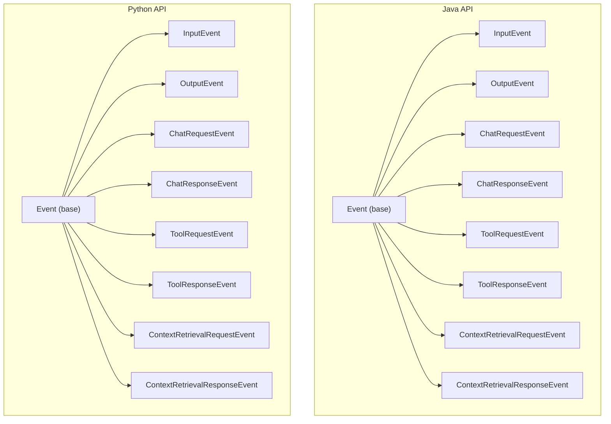
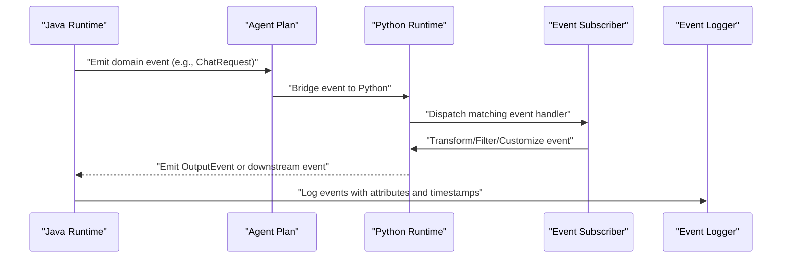
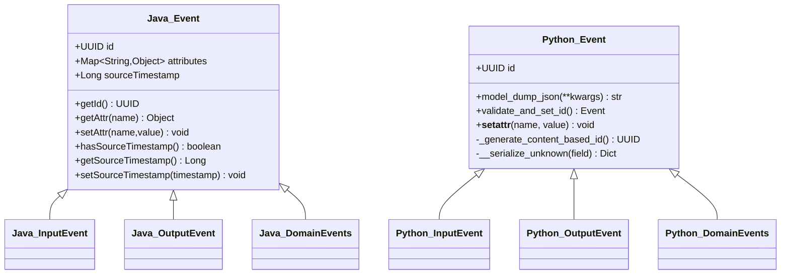
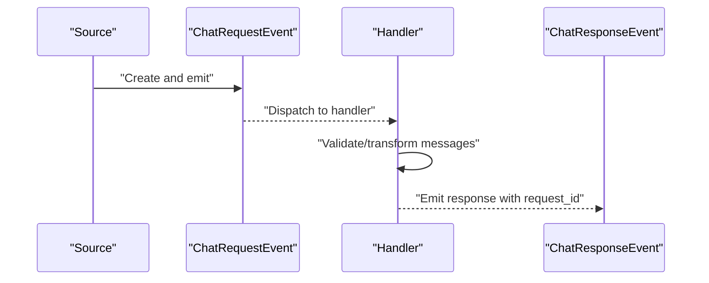
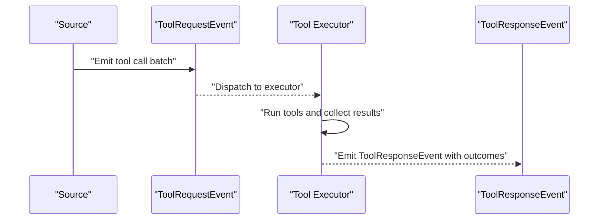
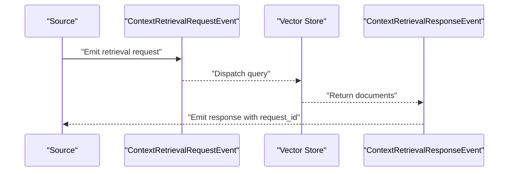
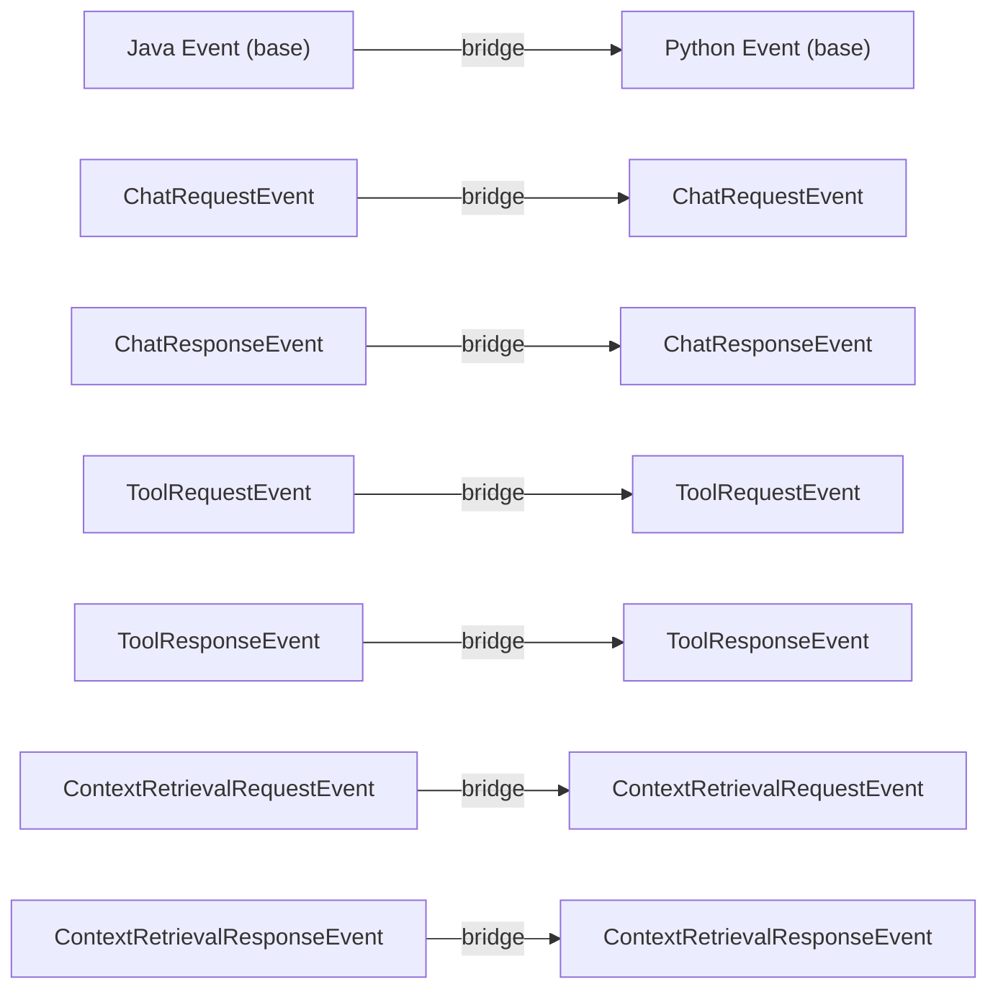

# Python Event Processing

<cite>
**Referenced Files in This Document**
- [Event.java](file://api/src/main/java/org/apache/flink/agents/api/Event.java)
- [InputEvent.java](file://api/src/main/java/org/apache/flink/agents/api/InputEvent.java)
- [OutputEvent.java](file://api/src/main/java/org/apache/flink/agents/api/OutputEvent.java)
- [ChatRequestEvent.java](file://api/src/main/java/org/apache/flink/agents/api/event/ChatRequestEvent.java)
- [ChatResponseEvent.java](file://api/src/main/java/org/apache/flink/agents/api/event/ChatResponseEvent.java)
- [ToolRequestEvent.java](file://api/src/main/java/org/apache/flink/agents/api/event/ToolRequestEvent.java)
- [ToolResponseEvent.java](file://api/src/main/java/org/apache/flink/agents/api/event/ToolResponseEvent.java)
- [ContextRetrievalRequestEvent.java](file://api/src/main/java/org/apache/flink/agents/api/event/ContextRetrievalRequestEvent.java)
- [ContextRetrievalResponseEvent.java](file://api/src/main/java/org/apache/flink/agents/api/event/ContextRetrievalResponseEvent.java)
- [event.py](file://python/flink_agents/api/events/event.py)
- [chat_event.py](file://python/flink_agents/api/events/chat_event.py)
- [tool_event.py](file://python/flink_agents/api/events/tool_event.py)
- [context_retrieval_event.py](file://python/flink_agents/api/events/context_retrieval_event.py)
</cite>

## Table of Contents
1. [Introduction](#introduction)
2. [Project Structure](#project-structure)
3. [Core Components](#core-components)
4. [Architecture Overview](#architecture-overview)
5. [Detailed Component Analysis](#detailed-component-analysis)
6. [Dependency Analysis](#dependency-analysis)
7. [Performance Considerations](#performance-considerations)
8. [Troubleshooting Guide](#troubleshooting-guide)
9. [Conclusion](#conclusion)

## Introduction
This document explains Python event processing in Flink Agents, focusing on the Python event model and its relationship with the Java event system. It covers event types, event handling patterns, and cross-language execution. It also documents chat events, tool events, and context retrieval events, including their data structures and processing workflows. Topics include event subscription, filtering, transformation, custom event processing, logging, debugging, performance considerations, and best practices for building event-driven Python agents.

## Project Structure
Flink Agents defines a unified event model across Java and Python:
- Java base event types and concrete event types live under the Java API package.
- Python event types mirror the Java event semantics and are defined under the Python API’s events module.
- Both sides share common concepts: base event with identity and attributes, input/output events for framework-generated and agent-emitted results, and domain-specific events for chat, tool use, and context retrieval.

**Diagram sources**
- [Event.java](file://api/src/main/java/org/apache/flink/agents/api/Event.java#L29-L90)
- [InputEvent.java](file://api/src/main/java/org/apache/flink/agents/api/InputEvent.java#L27-L49)
- [OutputEvent.java](file://api/src/main/java/org/apache/flink/agents/api/OutputEvent.java#L27-L52)
- [ChatRequestEvent.java](file://api/src/main/java/org/apache/flink/agents/api/event/ChatRequestEvent.java#L28-L58)
- [ChatResponseEvent.java](file://api/src/main/java/org/apache/flink/agents/api/event/ChatResponseEvent.java#L26-L43)
- [ToolRequestEvent.java](file://api/src/main/java/org/apache/flink/agents/api/event/ToolRequestEvent.java#L26-L63)
- [ToolResponseEvent.java](file://api/src/main/java/org/apache/flink/agents/api/event/ToolResponseEvent.java#L27-L95)
- [ContextRetrievalRequestEvent.java](file://api/src/main/java/org/apache/flink/agents/api/event/ContextRetrievalRequestEvent.java#L23-L70)
- [ContextRetrievalResponseEvent.java](file://api/src/main/java/org/apache/flink/agents/api/event/ContextRetrievalResponseEvent.java#L27-L65)
- [event.py](file://python/flink_agents/api/events/event.py#L33-L114)
- [chat_event.py](file://python/flink_agents/api/events/chat_event.py#L26-L57)
- [tool_event.py](file://python/flink_agents/api/events/tool_event.py#L24-L56)
- [context_retrieval_event.py](file://python/flink_agents/api/events/context_retrieval_event.py#L25-L57)

**Section sources**
- [Event.java](file://api/src/main/java/org/apache/flink/agents/api/Event.java#L29-L90)
- [InputEvent.java](file://api/src/main/java/org/apache/flink/agents/api/InputEvent.java#L27-L49)
- [OutputEvent.java](file://api/src/main/java/org/apache/flink/agents/api/OutputEvent.java#L27-L52)
- [event.py](file://python/flink_agents/api/events/event.py#L33-L114)

## Core Components
- Base event model
  - Java: Base class with a stable identity, attributes map, and optional source timestamp.
  - Python: Pydantic-based base class with deterministic content-based ID generation, JSON serialization support, and dynamic extra fields.
- Input and Output events
  - Java: InputEvent carries framework-provided input; OutputEvent carries agent-emitted results.
  - Python: Mirrors these semantics with typed fields for input and output.
- Domain events
  - Chat events: Request and response events for chat model interactions.
  - Tool events: Request and response events for tool invocation and results.
  - Context retrieval events: Request and response events for vector store queries.

**Section sources**
- [Event.java](file://api/src/main/java/org/apache/flink/agents/api/Event.java#L29-L90)
- [InputEvent.java](file://api/src/main/java/org/apache/flink/agents/api/InputEvent.java#L27-L49)
- [OutputEvent.java](file://api/src/main/java/org/apache/flink/agents/api/OutputEvent.java#L27-L52)
- [event.py](file://python/flink_agents/api/events/event.py#L33-L114)
- [chat_event.py](file://python/flink_agents/api/events/chat_event.py#L26-L57)
- [tool_event.py](file://python/flink_agents/api/events/tool_event.py#L24-L56)
- [context_retrieval_event.py](file://python/flink_agents/api/events/context_retrieval_event.py#L25-L57)

## Architecture Overview
The event processing architecture connects Java-defined event types with Python event types. The Python event classes inherit the same semantic roles as their Java counterparts, enabling cross-language interoperability. Events flow through the runtime, where actions subscribe to specific event types, filter them, transform them, and emit new events.

[No sources needed since this diagram shows conceptual workflow, not actual code structure]

## Detailed Component Analysis

### Base Event Model
- Java Event
  - Provides a stable UUID identity, a mutable attributes map, and optional source timestamp.
  - Enables attaching metadata to events and correlating related events.
- Python Event
  - Deterministic content-based ID generation ensures reproducible identities for equivalent event payloads.
  - Robust JSON serialization with a fallback for non-serializable types (e.g., Row).
  - Supports dynamic extra fields while maintaining schema safety via Pydantic validators.

**Diagram sources**
- [Event.java](file://api/src/main/java/org/apache/flink/agents/api/Event.java#L29-L90)
- [InputEvent.java](file://api/src/main/java/org/apache/flink/agents/api/InputEvent.java#L27-L49)
- [OutputEvent.java](file://api/src/main/java/org/apache/flink/agents/api/OutputEvent.java#L27-L52)
- [event.py](file://python/flink_agents/api/events/event.py#L33-L114)

**Section sources**
- [Event.java](file://api/src/main/java/org/apache/flink/agents/api/Event.java#L29-L90)
- [event.py](file://python/flink_agents/api/events/event.py#L33-L114)

### Chat Events
- Java ChatRequestEvent
  - Fields: model name, message list, optional output schema.
  - Used to initiate chat model interactions.
- Java ChatResponseEvent
  - Fields: request correlation ID and response message.
  - Carries the model’s response back to the caller.
- Python ChatRequestEvent
  - Fields: model, messages, optional output_schema.
- Python ChatResponseEvent
  - Fields: request_id, response.

Processing workflow:
- Emit ChatRequestEvent (Java or Python).
- Subscribe to ChatRequestEvent handlers.
- Transform messages or apply output schema constraints.
- Emit ChatResponseEvent with correlated request_id.

**Diagram sources**
- [ChatRequestEvent.java](file://api/src/main/java/org/apache/flink/agents/api/event/ChatRequestEvent.java#L28-L58)
- [ChatResponseEvent.java](file://api/src/main/java/org/apache/flink/agents/api/event/ChatResponseEvent.java#L26-L43)
- [chat_event.py](file://python/flink_agents/api/events/chat_event.py#L26-L57)

**Section sources**
- [ChatRequestEvent.java](file://api/src/main/java/org/apache/flink/agents/api/event/ChatRequestEvent.java#L28-L58)
- [ChatResponseEvent.java](file://api/src/main/java/org/apache/flink/agents/api/event/ChatResponseEvent.java#L26-L43)
- [chat_event.py](file://python/flink_agents/api/events/chat_event.py#L26-L57)

### Tool Events
- Java ToolRequestEvent
  - Fields: model, toolCalls list, timestamp.
- Java ToolResponseEvent
  - Fields: request correlation ID, per-call responses, success/error maps, optional external IDs, timestamp.
- Python ToolRequestEvent
  - Fields: model, tool_calls list.
- Python ToolResponseEvent
  - Fields: request_id, responses dict, external_ids dict.

Processing workflow:
- Emit ToolRequestEvent with a batch of tool calls.
- Subscribe to ToolRequestEvent handlers.
- Execute tools and collect results.
- Emit ToolResponseEvent with per-call outcomes and optional external IDs.

**Diagram sources**
- [ToolRequestEvent.java](file://api/src/main/java/org/apache/flink/agents/api/event/ToolRequestEvent.java#L26-L63)
- [ToolResponseEvent.java](file://api/src/main/java/org/apache/flink/agents/api/event/ToolResponseEvent.java#L27-L95)
- [tool_event.py](file://python/flink_agents/api/events/tool_event.py#L24-L56)

**Section sources**
- [ToolRequestEvent.java](file://api/src/main/java/org/apache/flink/agents/api/event/ToolRequestEvent.java#L26-L63)
- [ToolResponseEvent.java](file://api/src/main/java/org/apache/flink/agents/api/event/ToolResponseEvent.java#L27-L95)
- [tool_event.py](file://python/flink_agents/api/events/tool_event.py#L24-L56)

### Context Retrieval Events
- Java ContextRetrievalRequestEvent
  - Fields: query, vector store name, max results (with default).
- Java ContextRetrievalResponseEvent
  - Fields: request correlation ID, query, documents list.
- Python ContextRetrievalRequestEvent
  - Fields: query, vector store, max_results with default.
- Python ContextRetrievalResponseEvent
  - Fields: request_id, query, documents list.

Processing workflow:
- Emit ContextRetrievalRequestEvent with query and vector store.
- Subscribe to request handlers.
- Query vector store and collect documents.
- Emit ContextRetrievalResponseEvent with retrieved documents.

**Diagram sources**
- [ContextRetrievalRequestEvent.java](file://api/src/main/java/org/apache/flink/agents/api/event/ContextRetrievalRequestEvent.java#L23-L70)
- [ContextRetrievalResponseEvent.java](file://api/src/main/java/org/apache/flink/agents/api/event/ContextRetrievalResponseEvent.java#L27-L65)
- [context_retrieval_event.py](file://python/flink_agents/api/events/context_retrieval_event.py#L25-L57)

**Section sources**
- [ContextRetrievalRequestEvent.java](file://api/src/main/java/org/apache/flink/agents/api/event/ContextRetrievalRequestEvent.java#L23-L70)
- [ContextRetrievalResponseEvent.java](file://api/src/main/java/org/apache/flink/agents/api/event/ContextRetrievalResponseEvent.java#L27-L65)
- [context_retrieval_event.py](file://python/flink_agents/api/events/context_retrieval_event.py#L25-L57)

### Event Subscription, Filtering, and Transformation
- Subscription
  - Handlers subscribe to specific event types (e.g., ChatRequestEvent, ToolRequestEvent).
  - The runtime dispatches events to matching subscribers.
- Filtering
  - Use event attributes or request correlation IDs to filter irrelevant events.
  - Apply predicates on fields such as model name, vector store, or tool call types.
- Transformation
  - Convert between Java and Python event representations during cross-language execution.
  - Normalize message formats, enrich attributes, or adapt schemas (e.g., output_schema).

[No sources needed since this section provides general guidance]

### Custom Event Processing and Logging
- Custom event processing
  - Define custom event subclasses extending the base Event class in Python.
  - Implement handlers that consume and transform events.
- Event logging
  - Attach metadata via attributes on Java events or extra fields on Python events.
  - Use the runtime’s event logging facilities to capture events with timestamps and IDs.

[No sources needed since this section provides general guidance]

### Relationship Between Python Events and Java Events
- Semantics parity
  - Python event classes mirror Java event semantics for input/output and domain events.
- Cross-language bridging
  - The runtime bridges Java events to Python and vice versa, preserving IDs and attributes.
- Serialization compatibility
  - Python’s deterministic ID and robust serialization align with Java’s event identity and attribute model.

**Diagram sources**
- [Event.java](file://api/src/main/java/org/apache/flink/agents/api/Event.java#L29-L90)
- [InputEvent.java](file://api/src/main/java/org/apache/flink/agents/api/InputEvent.java#L27-L49)
- [OutputEvent.java](file://api/src/main/java/org/apache/flink/agents/api/OutputEvent.java#L27-L52)
- [ChatRequestEvent.java](file://api/src/main/java/org/apache/flink/agents/api/event/ChatRequestEvent.java#L28-L58)
- [ChatResponseEvent.java](file://api/src/main/java/org/apache/flink/agents/api/event/ChatResponseEvent.java#L26-L43)
- [ToolRequestEvent.java](file://api/src/main/java/org/apache/flink/agents/api/event/ToolRequestEvent.java#L26-L63)
- [ToolResponseEvent.java](file://api/src/main/java/org/apache/flink/agents/api/event/ToolResponseEvent.java#L27-L95)
- [ContextRetrievalRequestEvent.java](file://api/src/main/java/org/apache/flink/agents/api/event/ContextRetrievalRequestEvent.java#L23-L70)
- [ContextRetrievalResponseEvent.java](file://api/src/main/java/org/apache/flink/agents/api/event/ContextRetrievalResponseEvent.java#L27-L65)
- [event.py](file://python/flink_agents/api/events/event.py#L33-L114)
- [chat_event.py](file://python/flink_agents/api/events/chat_event.py#L26-L57)
- [tool_event.py](file://python/flink_agents/api/events/tool_event.py#L24-L56)
- [context_retrieval_event.py](file://python/flink_agents/api/events/context_retrieval_event.py#L25-L57)

## Dependency Analysis
- Cohesion
  - Each event type encapsulates a single responsibility (request/response or input/output).
- Coupling
  - Handlers depend on event interfaces rather than concrete implementations.
  - Cross-language coupling is mediated by the runtime bridge and shared semantics.
- Serialization and identity
  - Java events rely on Jackson annotations and attribute maps.
  - Python events rely on Pydantic and deterministic ID generation.

```mermaid
graph TB
E["Event (base)"] --> I["InputEvent"]
E --> O["OutputEvent"]
E --> CReq["ChatRequestEvent"]
E --> CResp["ChatResponseEvent"]
E --> TReq["ToolRequestEvent"]
E --> TResp["ToolResponseEvent"]
E --> RReq["ContextRetrievalRequestEvent"]
E --> RResp["ContextRetrievalResponseEvent"]
P_E["Event (base)"] --> P_I["InputEvent"]
P_E --> P_O["OutputEvent"]
P_E --> P_CReq["ChatRequestEvent"]
P_E --> P_CResp["ChatResponseEvent"]
P_E --> P_TReq["ToolRequestEvent"]
P_E --> P_TResp["ToolResponseEvent"]
P_E --> P_RReq["ContextRetrievalRequestEvent"]
P_E --> P_RResp["ContextRetrievalResponseEvent"]
```

**Diagram sources**
- [Event.java](file://api/src/main/java/org/apache/flink/agents/api/Event.java#L29-L90)
- [InputEvent.java](file://api/src/main/java/org/apache/flink/agents/api/InputEvent.java#L27-L49)
- [OutputEvent.java](file://api/src/main/java/org/apache/flink/agents/api/OutputEvent.java#L27-L52)
- [ChatRequestEvent.java](file://api/src/main/java/org/apache/flink/agents/api/event/ChatRequestEvent.java#L28-L58)
- [ChatResponseEvent.java](file://api/src/main/java/org/apache/flink/agents/api/event/ChatResponseEvent.java#L26-L43)
- [ToolRequestEvent.java](file://api/src/main/java/org/apache/flink/agents/api/event/ToolRequestEvent.java#L26-L63)
- [ToolResponseEvent.java](file://api/src/main/java/org/apache/flink/agents/api/event/ToolResponseEvent.java#L27-L95)
- [ContextRetrievalRequestEvent.java](file://api/src/main/java/org/apache/flink/agents/api/event/ContextRetrievalRequestEvent.java#L23-L70)
- [ContextRetrievalResponseEvent.java](file://api/src/main/java/org/apache/flink/agents/api/event/ContextRetrievalResponseEvent.java#L27-L65)
- [event.py](file://python/flink_agents/api/events/event.py#L33-L114)
- [chat_event.py](file://python/flink_agents/api/events/chat_event.py#L26-L57)
- [tool_event.py](file://python/flink_agents/api/events/tool_event.py#L24-L56)
- [context_retrieval_event.py](file://python/flink_agents/api/events/context_retrieval_event.py#L25-L57)

**Section sources**
- [Event.java](file://api/src/main/java/org/apache/flink/agents/api/Event.java#L29-L90)
- [event.py](file://python/flink_agents/api/events/event.py#L33-L114)

## Performance Considerations
- Deterministic IDs reduce duplication and enable efficient deduplication in state stores.
- Prefer lightweight attributes and avoid large payloads in event bodies.
- Batch tool calls when possible to minimize event volume.
- Use event filtering early to reduce unnecessary handler invocations.
- Ensure serialization performance by avoiding expensive transformations inside event constructors.

[No sources needed since this section provides general guidance]

## Troubleshooting Guide
- Event identity issues
  - Verify deterministic ID generation and ensure content changes trigger ID recalculation.
- Serialization errors
  - Confirm all fields are JSON serializable; use the provided fallback for special types.
- Correlation problems
  - Always propagate request_id in response events to maintain end-to-end traceability.
- Attribute inspection
  - Use attributes to attach contextual metadata for debugging; log events with timestamps for replay.

[No sources needed since this section provides general guidance]

## Conclusion
Flink Agents’ Python event processing builds on a robust, cross-language event model. The base event semantics, input/output events, and domain-specific events (chat, tool, context retrieval) provide a cohesive foundation for event-driven agent behavior. By leveraging deterministic IDs, strong typing, and cross-runtime bridging, developers can implement reliable, high-throughput event processing pipelines with clear filtering, transformation, and logging capabilities.