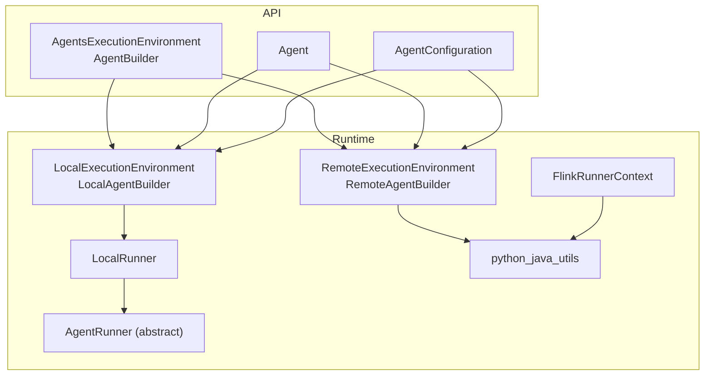
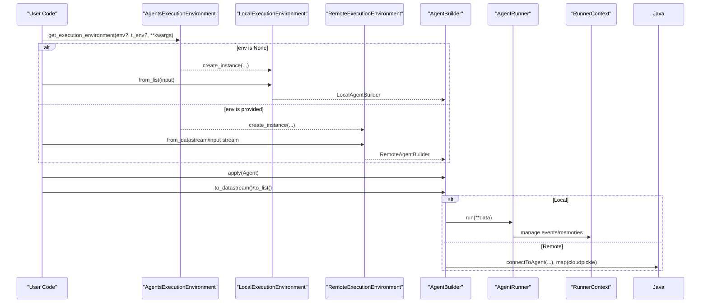
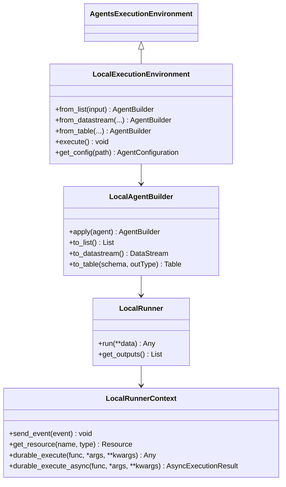
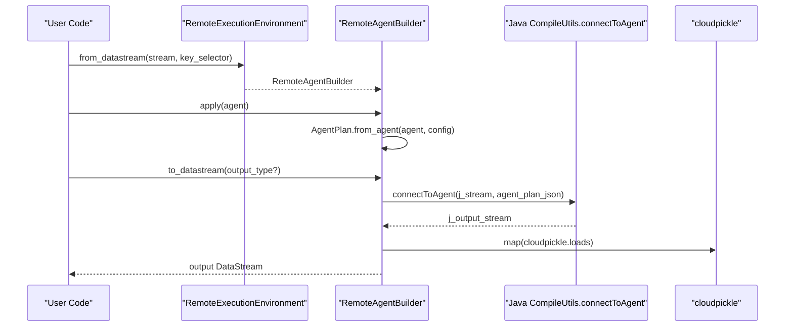
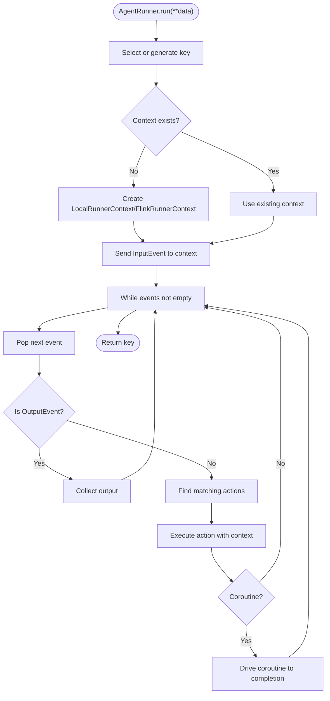
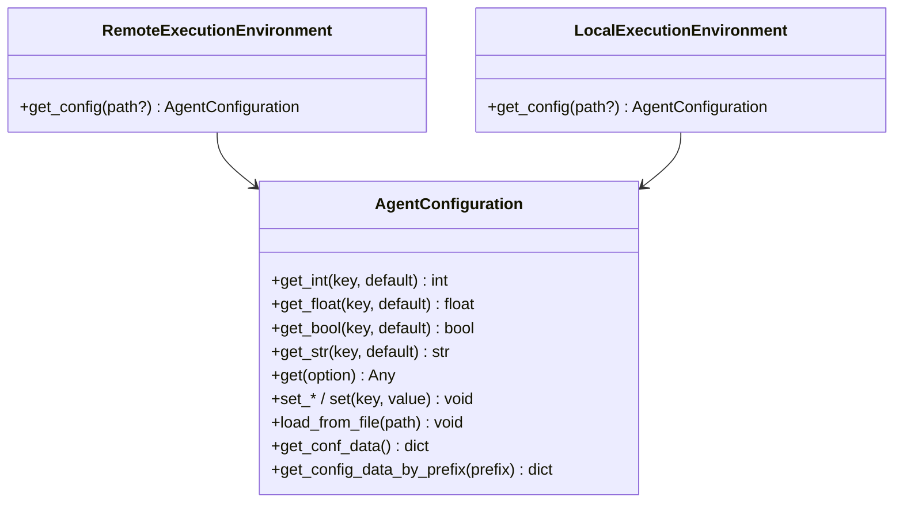
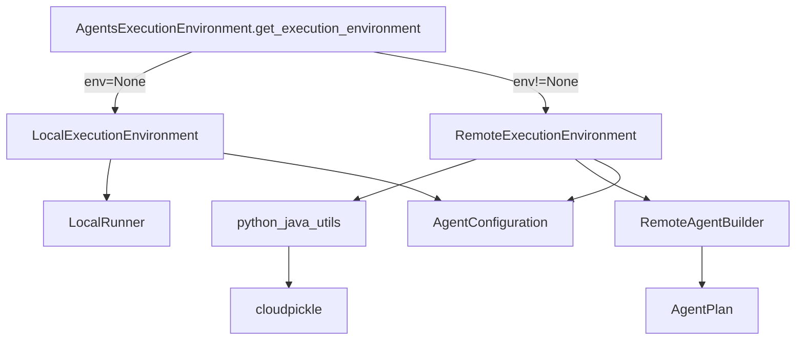

# Python Execution Environment

<cite>
**Referenced Files in This Document**
- [execution_environment.py](file://python/flink_agents/api/execution_environment.py)
- [local_execution_environment.py](file://python/flink_agents/runtime/local_execution_environment.py)
- [remote_execution_environment.py](file://python/flink_agents/runtime/remote_execution_environment.py)
- [agent_runner.py](file://python/flink_agents/runtime/agent_runner.py)
- [local_runner.py](file://python/flink_agents/runtime/local_runner.py)
- [flink_runner_context.py](file://python/flink_agents/runtime/flink_runner_context.py)
- [python_java_utils.py](file://python/flink_agents/runtime/python_java_utils.py)
- [configuration.py](file://python/flink_agents/plan/configuration.py)
- [agent.py](file://python/flink_agents/api/agents/agent.py)
- [ReActAgentExample.java](file://examples/src/main/java/org/apache/flink/agents/examples/ReActAgentExample.java)
</cite>

## Table of Contents
1. [Introduction](#introduction)
2. [Project Structure](#project-structure)
3. [Core Components](#core-components)
4. [Architecture Overview](#architecture-overview)
5. [Detailed Component Analysis](#detailed-component-analysis)
6. [Dependency Analysis](#dependency-analysis)
7. [Performance Considerations](#performance-considerations)
8. [Troubleshooting Guide](#troubleshooting-guide)
9. [Conclusion](#conclusion)
10. [Appendices](#appendices)

## Introduction
This document explains the Python execution environment in Flink Agents, focusing on how agents run locally versus remotely, how execution contexts are managed, and how environment configuration works. It covers the AgentRunner abstraction, environment setup, resource initialization, and cleanup. It also provides guidance on environment configuration, execution mode selection, environment-specific optimizations, debugging techniques, performance tuning, and migration strategies between local and remote modes.

## Project Structure
The Python execution environment spans several modules:
- API abstractions define the execution environment contract and builder pattern.
- Runtime implementations provide local and remote environments.
- Runners encapsulate agent execution logic and context management.
- Utilities bridge Python and Java worlds for cross-language resource and memory access.
- Configuration models support loading and flattening configuration data.

**Diagram sources**
- [execution_environment.py](file://python/flink_agents/api/execution_environment.py#L91-L253)
- [local_execution_environment.py](file://python/flink_agents/runtime/local_execution_environment.py#L92-L179)
- [remote_execution_environment.py](file://python/flink_agents/runtime/remote_execution_environment.py#L160-L335)
- [agent_runner.py](file://python/flink_agents/runtime/agent_runner.py#L22-L44)
- [local_runner.py](file://python/flink_agents/runtime/local_runner.py#L252-L356)
- [flink_runner_context.py](file://python/flink_agents/runtime/flink_runner_context.py#L181-L572)
- [python_java_utils.py](file://python/flink_agents/runtime/python_java_utils.py#L48-L284)
- [configuration.py](file://python/flink_agents/plan/configuration.py#L58-L174)
- [agent.py](file://python/flink_agents/api/agents/agent.py#L31-L160)

**Section sources**
- [execution_environment.py](file://python/flink_agents/api/execution_environment.py#L91-L253)
- [local_execution_environment.py](file://python/flink_agents/runtime/local_execution_environment.py#L92-L179)
- [remote_execution_environment.py](file://python/flink_agents/runtime/remote_execution_environment.py#L160-L335)
- [agent_runner.py](file://python/flink_agents/runtime/agent_runner.py#L22-L44)
- [local_runner.py](file://python/flink_agents/runtime/local_runner.py#L252-L356)
- [flink_runner_context.py](file://python/flink_agents/runtime/flink_runner_context.py#L181-L572)
- [python_java_utils.py](file://python/flink_agents/runtime/python_java_utils.py#L48-L284)
- [configuration.py](file://python/flink_agents/plan/configuration.py#L58-L174)
- [agent.py](file://python/flink_agents/api/agents/agent.py#L31-L160)

## Core Components
- AgentsExecutionEnvironment: Abstract base for environments, exposing resource registration, input configuration, and execution orchestration.
- LocalExecutionEnvironment: Local-only environment supporting list-based input and synchronous execution with LocalRunner.
- RemoteExecutionEnvironment: Remote environment integrated with PyFlink DataStream/Table, using RemoteAgentBuilder and Java interop.
- AgentRunner: Abstract interface for agent execution; LocalRunner implements it for local runs.
- FlinkRunnerContext: Context for remote execution, enabling durable execution, memory access, metrics, and Java interop.
- python_java_utils: Serialization/deserialization helpers and adapters bridging Python and Java resources/events.
- AgentConfiguration: Flat configuration model supporting YAML loading and typed getters.

**Section sources**
- [execution_environment.py](file://python/flink_agents/api/execution_environment.py#L91-L253)
- [local_execution_environment.py](file://python/flink_agents/runtime/local_execution_environment.py#L92-L179)
- [remote_execution_environment.py](file://python/flink_agents/runtime/remote_execution_environment.py#L160-L335)
- [agent_runner.py](file://python/flink_agents/runtime/agent_runner.py#L22-L44)
- [local_runner.py](file://python/flink_agents/runtime/local_runner.py#L252-L356)
- [flink_runner_context.py](file://python/flink_agents/runtime/flink_runner_context.py#L181-L572)
- [python_java_utils.py](file://python/flink_agents/runtime/python_java_utils.py#L48-L284)
- [configuration.py](file://python/flink_agents/plan/configuration.py#L58-L174)

## Architecture Overview
The execution environment selects between local and remote modes based on whether a PyFlink environment is provided. Local mode runs inside Python with LocalRunner and LocalRunnerContext semantics. Remote mode integrates with PyFlink streams, bridges to Java via pemja, and uses FlinkRunnerContext for durable execution and memory.

**Diagram sources**
- [execution_environment.py](file://python/flink_agents/api/execution_environment.py#L109-L155)
- [local_execution_environment.py](file://python/flink_agents/runtime/local_execution_environment.py#L107-L135)
- [remote_execution_environment.py](file://python/flink_agents/runtime/remote_execution_environment.py#L211-L231)
- [local_runner.py](file://python/flink_agents/runtime/local_runner.py#L286-L345)
- [flink_runner_context.py](file://python/flink_agents/runtime/flink_runner_context.py#L408-L443)

## Detailed Component Analysis

### Local Execution Environment
- Purpose: Local-only execution for development and testing.
- Capabilities:
  - from_list(input): Accepts a list of records; each record must include a value or v field.
  - apply(agent): Attaches a single agent; merges environment resources into agent resources.
  - execute(): Iterates over input, runs LocalRunner per record, collects outputs.
  - Unsupported conversions: to_datastream/to_table are not implemented for local.
- LocalRunner:
  - Creates LocalRunnerContext per key; manages event queue and memory stores.
  - Supports durable_execute and durable_execute_async with synchronous behavior and warnings.
  - Processes InputEvent and OutputEvent; drives coroutines for async actions.
  - Cleanup: closes agent plan on context close.

**Diagram sources**
- [execution_environment.py](file://python/flink_agents/api/execution_environment.py#L91-L253)
- [local_execution_environment.py](file://python/flink_agents/runtime/local_execution_environment.py#L92-L179)
- [local_runner.py](file://python/flink_agents/runtime/local_runner.py#L252-L356)

**Section sources**
- [local_execution_environment.py](file://python/flink_agents/runtime/local_execution_environment.py#L92-L179)
- [local_runner.py](file://python/flink_agents/runtime/local_runner.py#L252-L356)

### Remote Execution Environment
- Purpose: Production-grade execution integrated with PyFlink DataStream/Table.
- Capabilities:
  - from_datastream(input, key_selector): Requires a KeyedStream or a key_selector; builds RemoteAgentBuilder.
  - from_table(input, key_selector): Converts Table to DataStream, applies keying, builds RemoteAgentBuilder.
  - apply(agent): Builds AgentPlan from agent and configuration; merges environment resources.
  - to_datastream(): Bridges to Java via invoke_method("connectToAgent"), maps back with cloudpickle.
  - to_table(): Converts output DataStream to Table using StreamTableEnvironment.
  - execute(): Triggers Flink job execution.
  - Configuration: Loads from FLINK_CONF_DIR/config.yaml or legacy flink-conf.yaml if present.
- Cross-language integration:
  - Uses pemja to call Java methods and cloudpickle for serialization.
  - python_java_utils provides wrappers for Java resources, tools, prompts, and documents.

**Diagram sources**
- [remote_execution_environment.py](file://python/flink_agents/runtime/remote_execution_environment.py#L160-L231)
- [remote_execution_environment.py](file://python/flink_agents/runtime/remote_execution_environment.py#L101-L132)
- [python_java_utils.py](file://python/flink_agents/runtime/python_java_utils.py#L48-L77)

**Section sources**
- [remote_execution_environment.py](file://python/flink_agents/runtime/remote_execution_environment.py#L160-L335)
- [python_java_utils.py](file://python/flink_agents/runtime/python_java_utils.py#L48-L284)

### AgentRunner and Execution Context Management
- AgentRunner: Abstract interface defining run(**data) for agent execution.
- LocalRunner: Implements run by creating or retrieving a LocalRunnerContext per key, sending InputEvent, driving actions, and collecting OutputEvent results.
- FlinkRunnerContext: Provides durable execution support, memory access (sensory/short-term), metrics, and Java interop. Supports caching and recording of results for recovery.

**Diagram sources**
- [agent_runner.py](file://python/flink_agents/runtime/agent_runner.py#L22-L44)
- [local_runner.py](file://python/flink_agents/runtime/local_runner.py#L286-L345)
- [flink_runner_context.py](file://python/flink_agents/runtime/flink_runner_context.py#L408-L443)

**Section sources**
- [agent_runner.py](file://python/flink_agents/runtime/agent_runner.py#L22-L44)
- [local_runner.py](file://python/flink_agents/runtime/local_runner.py#L286-L345)
- [flink_runner_context.py](file://python/flink_agents/runtime/flink_runner_context.py#L181-L572)

### Environment Configuration Options
- AgentConfiguration:
  - Typed getters for int/float/bool/str and generic get(option).
  - load_from_file(config_path): Reads YAML, flattens nested keys under agent, updates internal conf_data.
  - Utility methods: get_conf_data(), get_config_data_by_prefix(prefix).
- RemoteExecutionEnvironment:
  - get_config(path?): Returns AgentConfiguration; optionally loads from FLINK_CONF_DIR/config.yaml or legacy flink-conf.yaml.
- LocalExecutionEnvironment:
  - get_config(path?): Returns AgentConfiguration; optionally loads from a file path.

**Diagram sources**
- [configuration.py](file://python/flink_agents/plan/configuration.py#L58-L174)
- [remote_execution_environment.py](file://python/flink_agents/runtime/remote_execution_environment.py#L188-L196)
- [local_execution_environment.py](file://python/flink_agents/runtime/local_execution_environment.py#L101-L105)

**Section sources**
- [configuration.py](file://python/flink_agents/plan/configuration.py#L58-L174)
- [remote_execution_environment.py](file://python/flink_agents/runtime/remote_execution_environment.py#L188-L196)
- [local_execution_environment.py](file://python/flink_agents/runtime/local_execution_environment.py#L101-L105)

### Resource Initialization and Cleanup
- Resource Registration:
  - AgentsExecutionEnvironment.add_resource(name, type, instance): Registers resources by type and name.
  - LocalAgentBuilder.apply(agent): Merges environment resources into agent.resources before creating LocalRunner.
  - RemoteAgentBuilder.apply(agent): Builds AgentPlan and merges environment resources into agent.resources.
- Cleanup:
  - LocalRunnerContext.close(): Closes agent plan.
  - FlinkRunnerContext.close(): Closes long-term memory and agent plan.

**Section sources**
- [execution_environment.py](file://python/flink_agents/api/execution_environment.py#L228-L253)
- [local_execution_environment.py](file://python/flink_agents/runtime/local_execution_environment.py#L63-L68)
- [remote_execution_environment.py](file://python/flink_agents/runtime/remote_execution_environment.py#L93-L96)
- [local_runner.py](file://python/flink_agents/runtime/local_runner.py#L243-L250)
- [flink_runner_context.py](file://python/flink_agents/runtime/flink_runner_context.py#L502-L511)

### Examples of Environment Configuration and Mode Selection
- Local mode:
  - Use AgentsExecutionEnvironment.get_execution_environment() without passing env to select local.
  - Configure AgentConfiguration via get_config(path) and load_from_file().
- Remote mode:
  - Pass a PyFlink StreamExecutionEnvironment to get_execution_environment(env) to select remote.
  - Configure via FLINK_CONF_DIR/config.yaml or legacy flink-conf.yaml.
- Example usage in Java shows setting AgentExecutionOptions.NUM_ASYNC_THREADS and adding resources.

**Section sources**
- [execution_environment.py](file://python/flink_agents/api/execution_environment.py#L109-L155)
- [remote_execution_environment.py](file://python/flink_agents/runtime/remote_execution_environment.py#L272-L312)
- [ReActAgentExample.java](file://examples/src/main/java/org/apache/flink/agents/examples/ReActAgentExample.java#L81-L103)

### Environment-Specific Optimizations
- Local:
  - Ideal for iterative development and unit testing; deterministic execution per record.
  - Limitations: No DataStream/Table integration; no durable execution.
- Remote:
  - Full Flink integration; supports windowing, state, and checkpointing via durable execution.
  - Use AgentExecutionOptions.NUM_ASYNC_THREADS to cap async requests and reduce load on external services.
  - Prefer keyed streams and proper key selectors for predictable state locality.

**Section sources**
- [remote_execution_environment.py](file://python/flink_agents/runtime/remote_execution_environment.py#L211-L231)
- [ReActAgentExample.java](file://examples/src/main/java/org/apache/flink/agents/examples/ReActAgentExample.java#L87-L88)

## Dependency Analysis
- Local vs Remote selection:
  - Determined by presence of StreamExecutionEnvironment in get_execution_environment.
- Java interop:
  - Remote path relies on pemja to invoke Java methods and cloudpickle for serialization.
- Resource binding:
  - Both builders merge environment resources into agent resources prior to execution.
- Configuration precedence:
  - Remote loads from FLINK_CONF_DIR with fallback to legacy filename.

**Diagram sources**
- [execution_environment.py](file://python/flink_agents/api/execution_environment.py#L109-L155)
- [remote_execution_environment.py](file://python/flink_agents/runtime/remote_execution_environment.py#L160-L231)
- [python_java_utils.py](file://python/flink_agents/runtime/python_java_utils.py#L48-L77)

**Section sources**
- [execution_environment.py](file://python/flink_agents/api/execution_environment.py#L109-L155)
- [remote_execution_environment.py](file://python/flink_agents/runtime/remote_execution_environment.py#L160-L231)
- [python_java_utils.py](file://python/flink_agents/runtime/python_java_utils.py#L48-L77)

## Performance Considerations
- Concurrency and async:
  - Remote mode supports durable_execute and durable_execute_async; ensure proper awaiting to enable recovery recording.
  - Tune NUM_ASYNC_THREADS to balance throughput and external service load.
- Serialization overhead:
  - Remote path uses cloudpickle; minimize payload sizes and avoid large non-serializable objects.
- Memory:
  - LocalRunnerContext maintains in-memory stores; avoid storing excessive state per key.
  - FlinkRunnerContext provides long-term memory integration in remote mode; configure backend appropriately.
- Streaming:
  - Ensure proper keying to leverage keyed state and reduce skew.

[No sources needed since this section provides general guidance]

## Troubleshooting Guide
- Local mode errors:
  - Multiple from_list or execute calls are not supported; ensure single invocation per environment instance.
  - LocalAgentBuilder.to_datastream/to_table/to_list raise NotImplementedError; use local execution semantics.
- Remote mode errors:
  - from_datastream requires a KeyedStream or key_selector; provide a selector when input is not keyed.
  - Missing FLINK_CONF_DIR or config file leads to silent fallback; verify environment variable and file existence.
  - Java interop failures: verify pemja availability and that Java-side method signatures match expectations.
- Durable execution:
  - In local mode, durable_execute is not supported; use synchronous execution semantics.
  - In remote mode, ensure results are awaited for recovery recording; fire-and-forget calls are not recorded.

**Section sources**
- [local_execution_environment.py](file://python/flink_agents/runtime/local_execution_environment.py#L107-L156)
- [remote_execution_environment.py](file://python/flink_agents/runtime/remote_execution_environment.py#L209-L231)
- [remote_execution_environment.py](file://python/flink_agents/runtime/remote_execution_environment.py#L272-L312)
- [local_runner.py](file://python/flink_agents/runtime/local_runner.py#L182-L233)
- [flink_runner_context.py](file://python/flink_agents/runtime/flink_runner_context.py#L408-L443)

## Conclusion
Flink Agents provides a unified abstraction for agent execution across local and remote environments. Local mode simplifies development and testing, while remote mode integrates deeply with PyFlink and Flink’s runtime for production-scale streaming. Proper configuration, resource management, and understanding of execution contexts are key to effective operation. Choose the appropriate mode based on your needs, tune concurrency and serialization, and leverage durable execution in remote mode for robust recovery.

[No sources needed since this section summarizes without analyzing specific files]

## Appendices

### Relationship Between Python and Java Execution Environments
- Remote mode depends on Java-side compilation and runtime integration via pemja.
- python_java_utils bridges Python and Java for resources, tools, prompts, and documents.
- FlinkRunnerContext synchronizes Python execution with Java state and metrics.

**Section sources**
- [remote_execution_environment.py](file://python/flink_agents/runtime/remote_execution_environment.py#L115-L132)
- [python_java_utils.py](file://python/flink_agents/runtime/python_java_utils.py#L78-L152)
- [flink_runner_context.py](file://python/flink_agents/runtime/flink_runner_context.py#L181-L572)

### Migration Strategies Between Execution Modes
- Start local: Develop and test agent logic using LocalExecutionEnvironment and LocalRunner.
- Validate resources and configuration with AgentConfiguration.
- Switch to remote: Provide StreamExecutionEnvironment to get_execution_environment(env) and ensure FLINK_CONF_DIR/config.yaml is present.
- Verify keyed streams and key selectors; confirm Java interop and pemja availability.
- Monitor durable execution behavior and adjust async thread limits.

**Section sources**
- [execution_environment.py](file://python/flink_agents/api/execution_environment.py#L109-L155)
- [remote_execution_environment.py](file://python/flink_agents/runtime/remote_execution_environment.py#L272-L312)
- [ReActAgentExample.java](file://examples/src/main/java/org/apache/flink/agents/examples/ReActAgentExample.java#L81-L103)