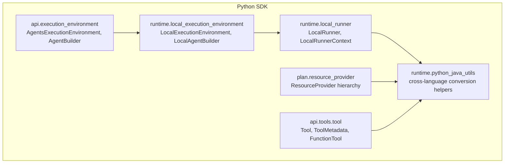
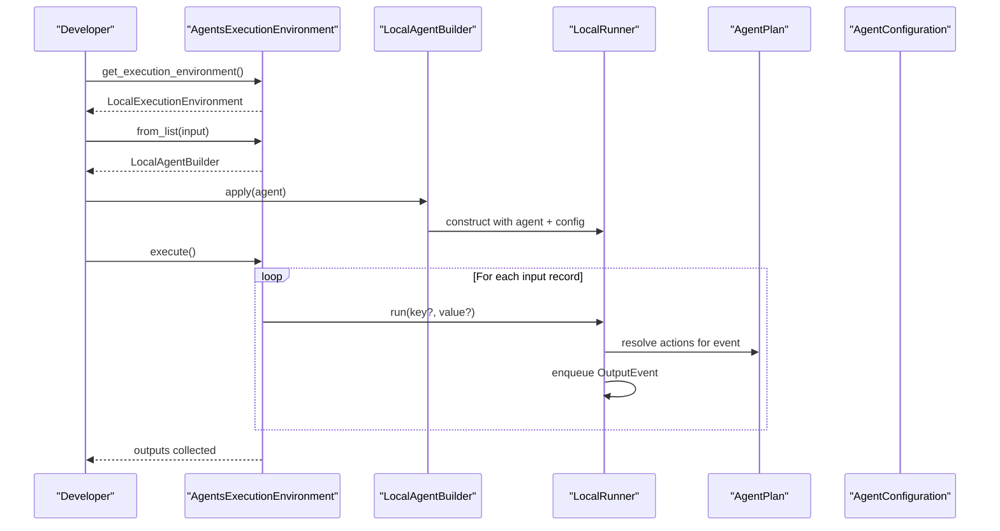
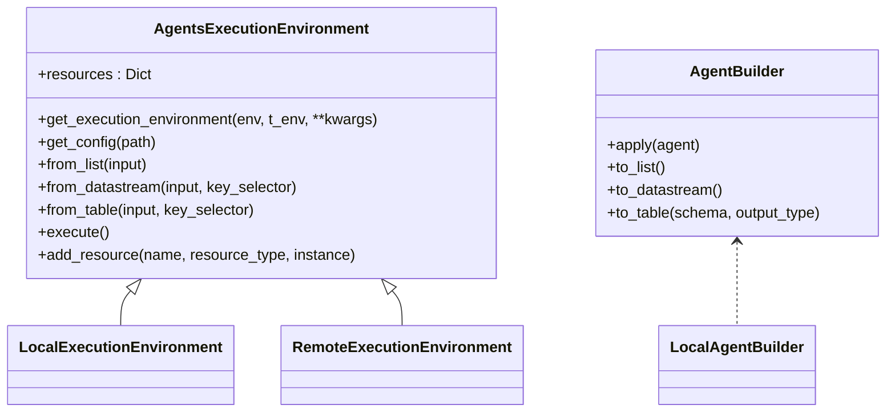
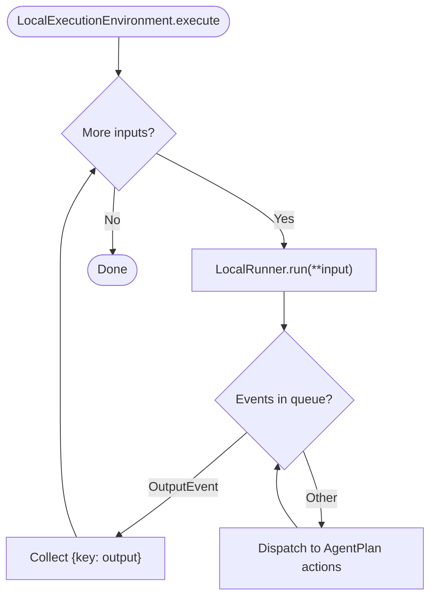
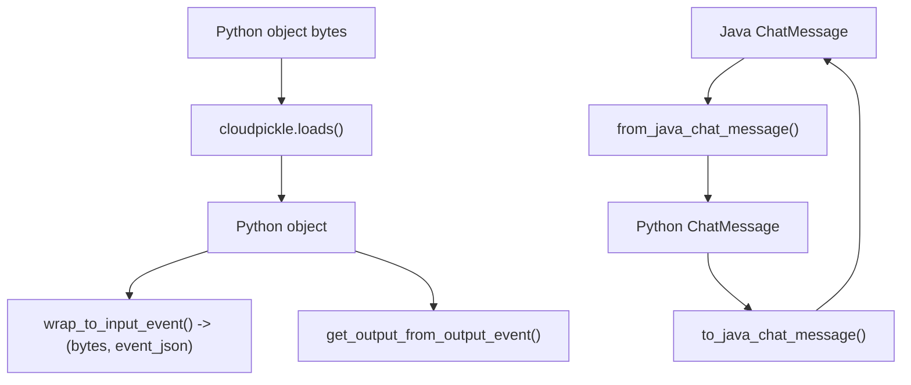
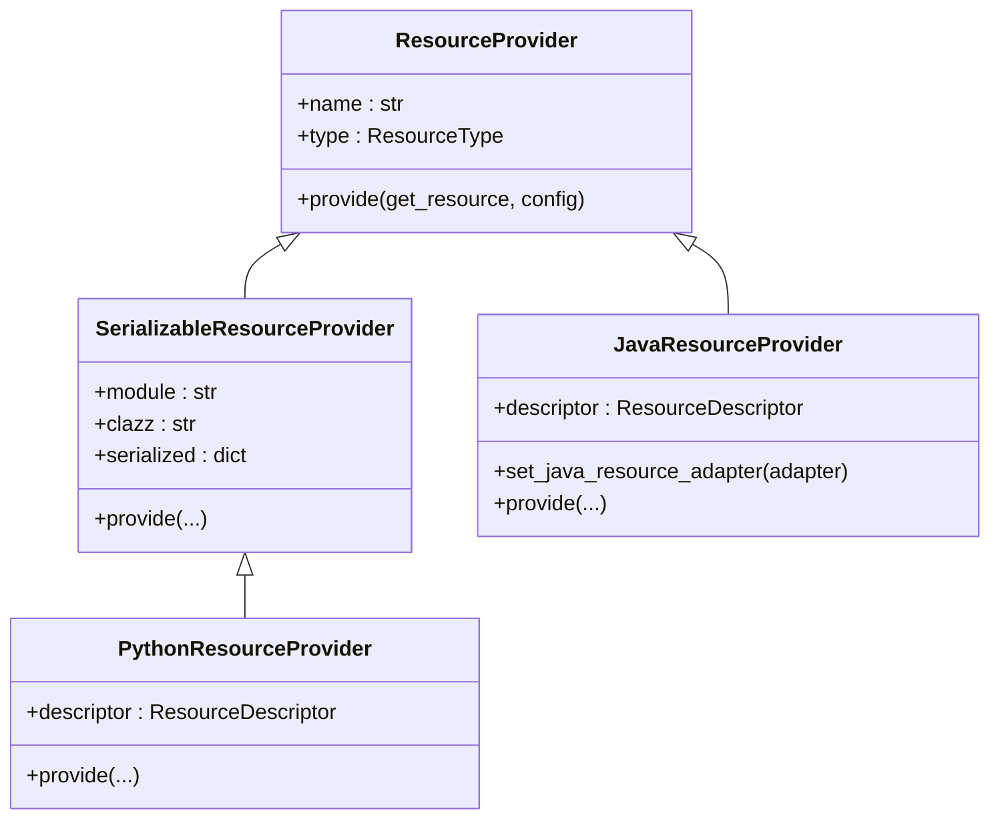
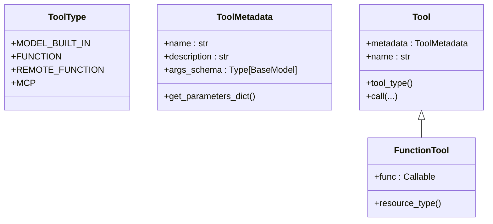
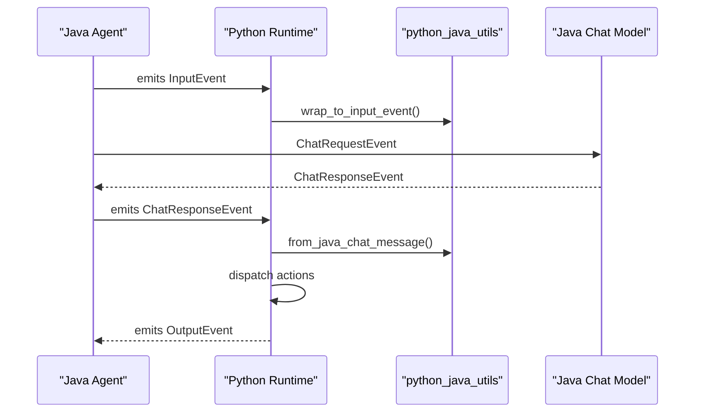
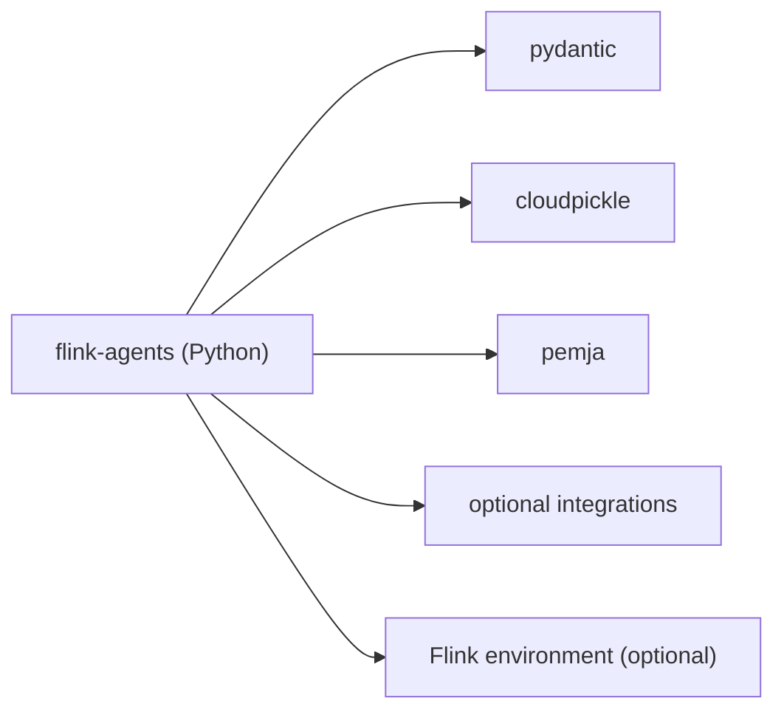

# Python SDK

<cite>
**Referenced Files in This Document**
- [__init__.py](file://python/flink_agents/__init__.py)
- [execution_environment.py](file://python/flink_agents/api/execution_environment.py)
- [agent_runner.py](file://python/flink_agents/runtime/agent_runner.py)
- [local_execution_environment.py](file://python/flink_agents/runtime/local_execution_environment.py)
- [local_runner.py](file://python/flink_agents/runtime/local_runner.py)
- [python_java_utils.py](file://python/flink_agents/runtime/python_java_utils.py)
- [resource_provider.py](file://python/flink_agents/plan/resource_provider.py)
- [tool.py](file://python/flink_agents/api/tools/tool.py)
- [pyproject.toml](file://python/pyproject.toml)
- [ProductSuggestionAgent.java](file://examples/src/main/java/org/apache/flink/agents/examples/agents/ProductSuggestionAgent.java)
</cite>

## Table of Contents
1. [Introduction](#introduction)
2. [Project Structure](#project-structure)
3. [Core Components](#core-components)
4. [Architecture Overview](#architecture-overview)
5. [Detailed Component Analysis](#detailed-component-analysis)
6. [Dependency Analysis](#dependency-analysis)
7. [Performance Considerations](#performance-considerations)
8. [Troubleshooting Guide](#troubleshooting-guide)
9. [Conclusion](#conclusion)
10. [Appendices](#appendices)

## Introduction
This document explains the Python SDK for Flink Agents, focusing on the Python execution environment, its integration with the Java runtime, cross-language communication mechanisms, resource provider implementations, and Python-specific APIs for agent creation, tool development, and event processing. It also covers serialization/deserialization for cross-language data exchange, practical development patterns, performance considerations, debugging techniques, and best practices for choosing between Python and Java implementations.

## Project Structure
The Python SDK is organized around:
- API surface for building agents, tools, resources, and execution environments
- Runtime components for local and remote execution
- Cross-language utilities for Java interop
- Plan and resource provider abstractions enabling dynamic resource creation

**Diagram sources**
- [execution_environment.py](file://python/flink_agents/api/execution_environment.py#L91-L253)
- [local_execution_environment.py](file://python/flink_agents/runtime/local_execution_environment.py#L92-L179)
- [local_runner.py](file://python/flink_agents/runtime/local_runner.py#L252-L356)
- [python_java_utils.py](file://python/flink_agents/runtime/python_java_utils.py#L48-L284)
- [resource_provider.py](file://python/flink_agents/plan/resource_provider.py#L35-L230)
- [tool.py](file://python/flink_agents/api/tools/tool.py#L116-L156)

**Section sources**
- [execution_environment.py](file://python/flink_agents/api/execution_environment.py#L91-L253)
- [local_execution_environment.py](file://python/flink_agents/runtime/local_execution_environment.py#L92-L179)
- [local_runner.py](file://python/flink_agents/runtime/local_runner.py#L252-L356)
- [python_java_utils.py](file://python/flink_agents/runtime/python_java_utils.py#L48-L284)
- [resource_provider.py](file://python/flink_agents/plan/resource_provider.py#L35-L230)
- [tool.py](file://python/flink_agents/api/tools/tool.py#L116-L156)

## Core Components
- Execution Environment API: Defines the environment abstraction and builder pattern for integrating agents with input streams and retrieving outputs as lists, DataStream, or Table.
- Local Execution Environment: Provides a lightweight local runner for iterative development and debugging.
- Local Runner: Drives agent execution locally, manages contexts, memory, and event queues.
- Cross-Language Utilities: Handles serialization/deserialization and conversion between Python and Java representations for events, tools, prompts, chat messages, documents, and vector store queries.
- Resource Providers: Abstractions for creating resources in runtime, including Python-native, serializable, and Java-backed providers.
- Tools: Typed tool definitions and metadata for function-based tools.

**Section sources**
- [execution_environment.py](file://python/flink_agents/api/execution_environment.py#L37-L253)
- [local_execution_environment.py](file://python/flink_agents/runtime/local_execution_environment.py#L33-L179)
- [local_runner.py](file://python/flink_agents/runtime/local_runner.py#L252-L356)
- [python_java_utils.py](file://python/flink_agents/runtime/python_java_utils.py#L48-L284)
- [resource_provider.py](file://python/flink_agents/plan/resource_provider.py#L35-L230)
- [tool.py](file://python/flink_agents/api/tools/tool.py#L30-L156)

## Architecture Overview
The Python SDK orchestrates agent execution through a layered architecture:
- API layer defines the contract for building and configuring agents and execution environments.
- Runtime layer executes agents locally or remotely, managing contexts, memory, and event loops.
- Cross-language layer translates Python objects to Java equivalents and vice versa for interoperability with Java components (chat models, embeddings, vector stores).
- Resource provider layer resolves and instantiates resources (tools, models, vector stores) at runtime.

**Diagram sources**
- [execution_environment.py](file://python/flink_agents/api/execution_environment.py#L108-L155)
- [local_execution_environment.py](file://python/flink_agents/runtime/local_execution_environment.py#L107-L135)
- [local_runner.py](file://python/flink_agents/runtime/local_runner.py#L286-L345)

## Detailed Component Analysis

### Execution Environment API
- Responsibilities:
  - Provide factory to select local vs remote execution environment.
  - Define builder pattern to attach agents to inputs and materialize outputs.
  - Manage resource registration and retrieval.
- Key behaviors:
  - Local vs remote selection via optional Flink environment injection.
  - Resource registration keyed by type and name.
  - Input adapters for list, DataStream, and Table.

**Diagram sources**
- [execution_environment.py](file://python/flink_agents/api/execution_environment.py#L91-L253)
- [local_execution_environment.py](file://python/flink_agents/runtime/local_execution_environment.py#L33-L90)

**Section sources**
- [execution_environment.py](file://python/flink_agents/api/execution_environment.py#L91-L253)
- [local_execution_environment.py](file://python/flink_agents/runtime/local_execution_environment.py#L92-L179)

### Local Execution Environment and Runner
- LocalExecutionEnvironment:
  - Stores input, runner, and output buffers.
  - Supports from_list and execute for local runs.
  - Does not support streaming/table conversions in local mode.
- LocalRunner:
  - Creates or reuses contexts per key.
  - Converts input dicts to InputEvent and drives actions until OutputEvent.
  - Supports synchronous and async-like durable execution with warnings.

**Diagram sources**
- [local_execution_environment.py](file://python/flink_agents/runtime/local_execution_environment.py#L122-L135)
- [local_runner.py](file://python/flink_agents/runtime/local_runner.py#L286-L345)

**Section sources**
- [local_execution_environment.py](file://python/flink_agents/runtime/local_execution_environment.py#L92-L179)
- [local_runner.py](file://python/flink_agents/runtime/local_runner.py#L252-L356)

### Cross-Language Communication and Serialization
- Serialization:
  - Uses cloudpickle for Python object serialization/deserialization.
  - Wraps inputs as InputEvent and extracts outputs from OutputEvent.
- Java interop:
  - Converts Python chat messages, documents, vector store queries/results, and roles to Java equivalents.
  - Builds event log strings for logging and tracing.
  - Provides helpers to create Python wrappers from Java resources and tools.
- Tool metadata:
  - Serializes/deserializes tool metadata schemas between Python and Java.

**Diagram sources**
- [python_java_utils.py](file://python/flink_agents/runtime/python_java_utils.py#L48-L284)

**Section sources**
- [python_java_utils.py](file://python/flink_agents/runtime/python_java_utils.py#L48-L284)

### Resource Providers
- Abstractions:
  - ResourceProvider: declares name, type, and provide(get_resource, config).
  - SerializableResourceProvider: carries serialized resource data.
  - PythonResourceProvider: constructs Python resources using descriptors and configuration.
  - JavaResourceProvider: obtains Java resources via adapters and wraps them for Python.
- Java resource mapping:
  - Maps ResourceType to Java implementation classes for chat models, embeddings, and vector stores.

**Diagram sources**
- [resource_provider.py](file://python/flink_agents/plan/resource_provider.py#L35-L230)

**Section sources**
- [resource_provider.py](file://python/flink_agents/plan/resource_provider.py#L35-L230)

### Tools API
- ToolType enumerates built-in, function, remote, and MCP tools.
- ToolMetadata captures name, description, and JSON schema of arguments.
- Tool is an abstract base for tools; FunctionTool holds a callable and marks itself as a TOOL resource.

**Diagram sources**
- [tool.py](file://python/flink_agents/api/tools/tool.py#L30-L156)

**Section sources**
- [tool.py](file://python/flink_agents/api/tools/tool.py#L30-L156)

### Relationship Between Python and Java Implementations
- Java agents define prompts, models, and actions declaratively and emit events.
- Python runtime consumes these events, converts them to Python representations, and executes actions.
- Cross-language utilities translate between Python and Java types for chat messages, documents, vector store queries, and tool metadata.
- Example Java agent demonstrates prompt wiring, memory usage, and event-driven processing.

**Diagram sources**
- [python_java_utils.py](file://python/flink_agents/runtime/python_java_utils.py#L63-L131)
- [ProductSuggestionAgent.java](file://examples/src/main/java/org/apache/flink/agents/examples/agents/ProductSuggestionAgent.java#L74-L112)

**Section sources**
- [python_java_utils.py](file://python/flink_agents/runtime/python_java_utils.py#L63-L131)
- [ProductSuggestionAgent.java](file://examples/src/main/java/org/apache/flink/agents/examples/agents/ProductSuggestionAgent.java#L52-L114)

## Dependency Analysis
- Python SDK depends on:
  - pydantic for data modeling and serialization
  - cloudpickle for cross-language object serialization
  - pemja for Java class lookup and interop
  - Optional integrations for chat models, embeddings, vector stores, and MCP
- The SDK exposes a local-only environment by default; remote execution requires a Flink environment and version-specific JARs.

**Diagram sources**
- [pyproject.toml](file://python/pyproject.toml#L44-L59)

**Section sources**
- [pyproject.toml](file://python/pyproject.toml#L44-L59)

## Performance Considerations
- Serialization overhead:
  - cloudpickle is flexible but can be heavier than specialized serializers; prefer serializable resources where feasible.
- Event-driven loop:
  - LocalRunner processes events iteratively; keep actions efficient and avoid blocking operations inside actions.
- Async execution:
  - LocalRunner simulates durable async execution; ensure long-running tasks are properly awaited or offloaded.
- Java interop:
  - Java class lookups and conversions add overhead; minimize round-trips and batch operations when possible.
- Resource instantiation:
  - ResourceProviders cache and reuse instances; avoid recreating heavy resources unnecessarily.

[No sources needed since this section provides general guidance]

## Troubleshooting Guide
- Local vs remote environment:
  - LocalExecutionEnvironment does not support DataStream/Table conversions; use from_list and execute for local runs.
- Resource conflicts:
  - Adding a resource with an existing name/type raises an error; ensure unique names per type.
- Java resource mapping:
  - Missing Java resource mapping for a ResourceType causes a ValueError; verify resource type and mapping.
- Tool metadata:
  - ToolMetadata serialization/deserialization relies on JSON schema; ensure args_schema is a valid Pydantic model.
- Logging:
  - LocalRunner logs events and actions; enable INFO-level logging to trace execution.

**Section sources**
- [local_execution_environment.py](file://python/flink_agents/runtime/local_execution_environment.py#L75-L89)
- [execution_environment.py](file://python/flink_agents/api/execution_environment.py#L247-L252)
- [resource_provider.py](file://python/flink_agents/plan/resource_provider.py#L157-L163)
- [tool.py](file://python/flink_agents/api/tools/tool.py#L71-L91)
- [local_runner.py](file://python/flink_agents/runtime/local_runner.py#L39-L42)

## Conclusion
The Python SDK for Flink Agents provides a cohesive framework for building, testing, and executing agents locally, with robust mechanisms for cross-language communication and resource management. By leveraging the Execution Environment API, Local Runner, and cross-language utilities, developers can implement Python-based agents that integrate seamlessly with Java-backed resources and services. Choose Python for rapid iteration and local debugging, and Java for production-grade integrations requiring native JVM capabilities.

[No sources needed since this section summarizes without analyzing specific files]

## Appendices

### Practical Development Patterns
- Agent creation:
  - Use AgentsExecutionEnvironment.get_execution_environment to select environment.
  - Register resources via add_resource and attach agents via AgentBuilder.apply.
  - Execute with from_list and collect outputs via to_list.
- Tool development:
  - Define ToolMetadata with a Pydantic args_schema; implement Tool.call.
  - Use FunctionTool.from_callable for simple function-based tools.
- Event processing:
  - Emit InputEvent for initial processing; dispatch actions based on event types.
  - Handle OutputEvent to produce final results.

**Section sources**
- [execution_environment.py](file://python/flink_agents/api/execution_environment.py#L108-L155)
- [tool.py](file://python/flink_agents/api/tools/tool.py#L116-L156)
- [local_execution_environment.py](file://python/flink_agents/runtime/local_execution_environment.py#L107-L135)

### Integration with External Libraries
- Optional dependencies include popular providers and vector stores; install extras as needed for integrations.
- Use ResourceDescriptor and ResourceProvider to wire external libraries into the agent plan.

**Section sources**
- [pyproject.toml](file://python/pyproject.toml#L72-L89)
- [resource_provider.py](file://python/flink_agents/plan/resource_provider.py#L93-L118)