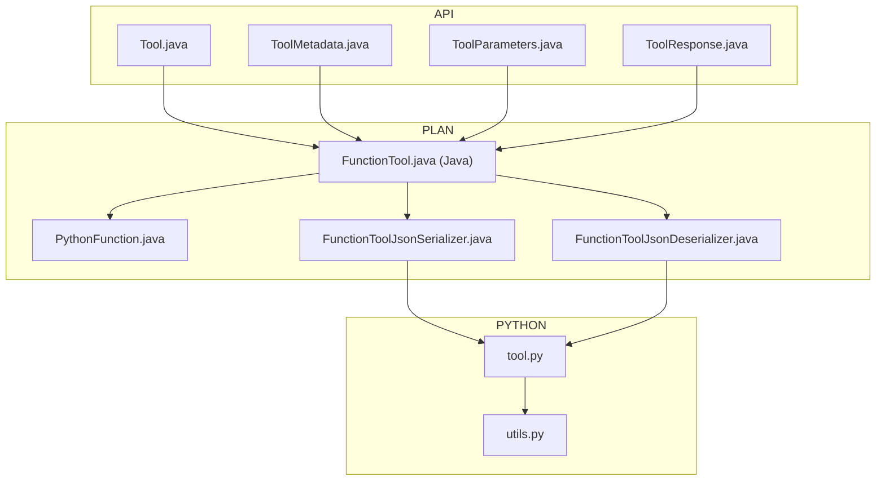
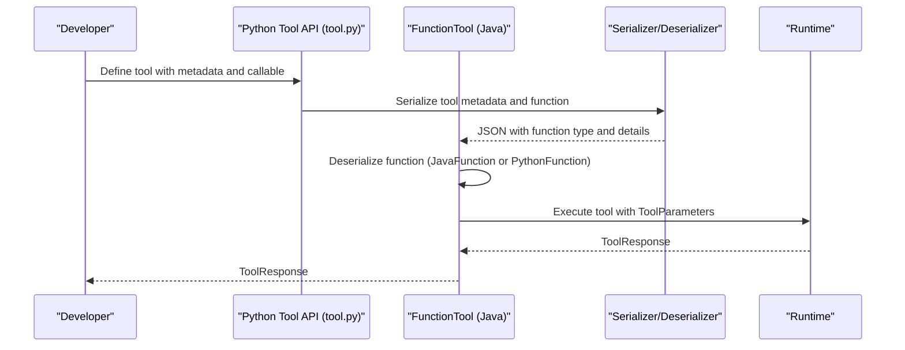
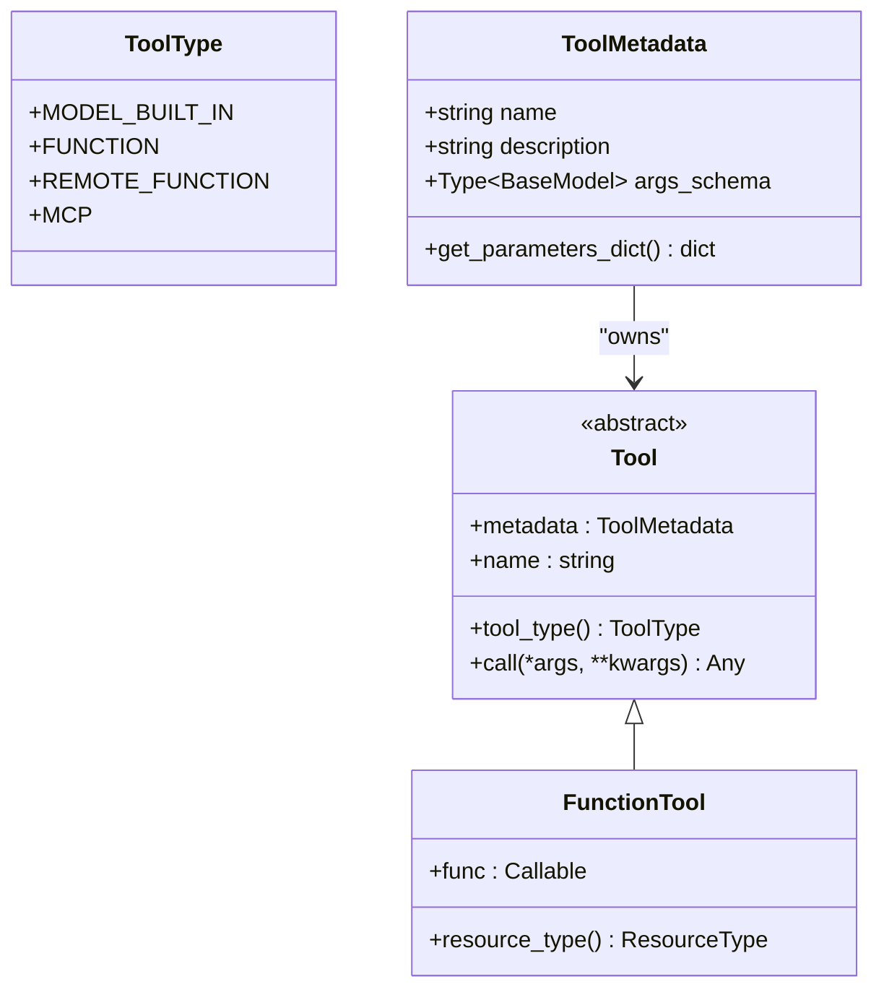
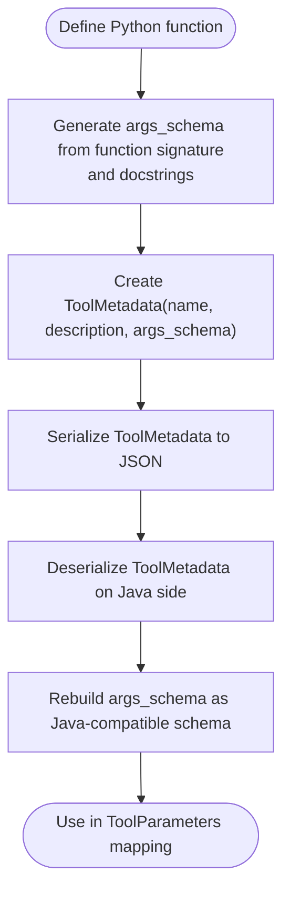
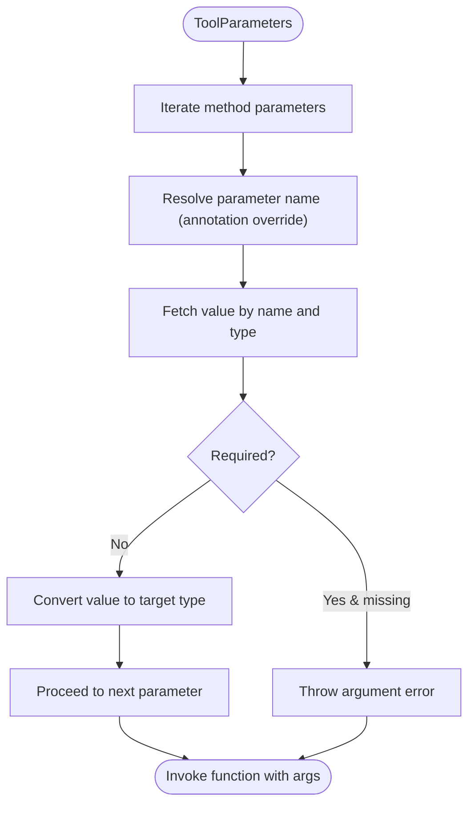
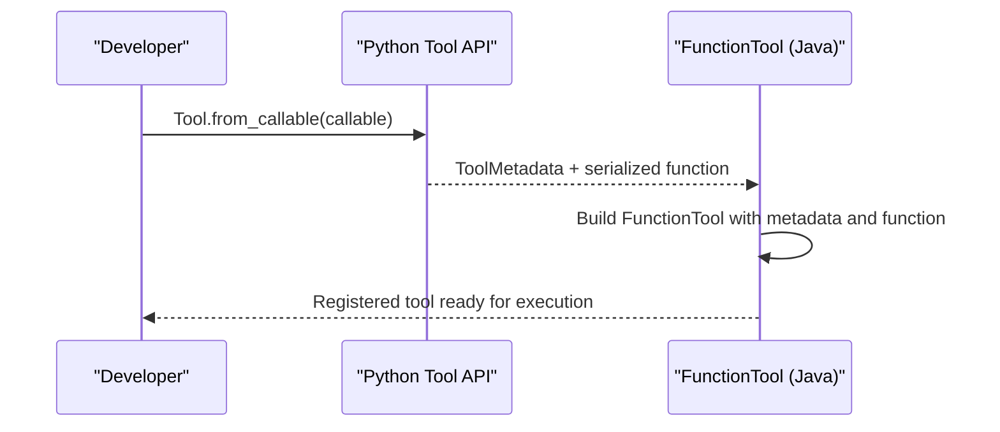
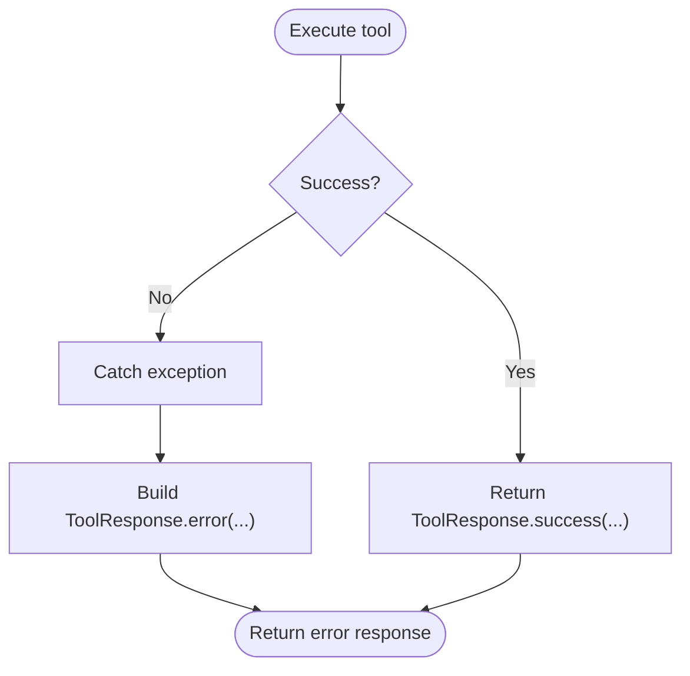
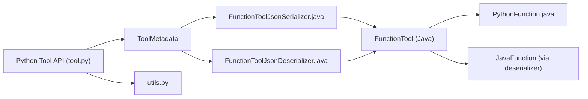

# Python Tool Development

<cite>
**Referenced Files in This Document**
- [Tool.java](file://api/src/main/java/org/apache/flink/agents/api/tools/Tool.java)
- [ToolMetadata.java](file://api/src/main/java/org/apache/flink/agents/api/tools/ToolMetadata.java)
- [ToolParameters.java](file://api/src/main/java/org/apache/flink/agents/api/tools/ToolParameters.java)
- [ToolResponse.java](file://api/src/main/java/org/apache/flink/agents/api/tools/ToolResponse.java)
- [FunctionTool.java (Java)](file://plan/src/main/java/org/apache/flink/agents/plan/tools/FunctionTool.java)
- [PythonFunction.java](file://plan/src/main/java/org/apache/flink/agents/plan/PythonFunction.java)
- [FunctionToolJsonSerializer.java](file://plan/src/main/java/org/apache/flink/agents/plan/tools/serializer/FunctionToolJsonSerializer.java)
- [FunctionToolJsonDeserializer.java](file://plan/src/main/java/org/apache/flink/agents/plan/tools/serializer/FunctionToolJsonDeserializer.java)
- [tool.py](file://python/flink_agents/api/tools/tool.py)
- [utils.py](file://python/flink_agents/api/tools/utils.py)
</cite>

## Table of Contents
1. [Introduction](#introduction)
2. [Project Structure](#project-structure)
3. [Core Components](#core-components)
4. [Architecture Overview](#architecture-overview)
5. [Detailed Component Analysis](#detailed-component-analysis)
6. [Dependency Analysis](#dependency-analysis)
7. [Performance Considerations](#performance-considerations)
8. [Troubleshooting Guide](#troubleshooting-guide)
9. [Conclusion](#conclusion)
10. [Appendices](#appendices)

## Introduction
This document explains how to develop Python tools in Flink Agents. It covers the Python tool API, tool registration patterns, parameter validation, metadata specification, input/output schema definition, error handling, best practices, and the relationship between Python tools and Java tools. Practical examples are provided via file references and diagrams mapped to actual code.

## Project Structure
Flink Agents separates concerns across modules:
- API module defines the tool contract and data models used by both Java and Python.
- PLAN module implements tool execution plans and cross-language serialization.
- PYTHON module provides the Python-side tool API, schema generation, and utilities.

**Diagram sources**
- [Tool.java](file://api/src/main/java/org/apache/flink/agents/api/tools/Tool.java#L30-L69)
- [ToolMetadata.java](file://api/src/main/java/org/apache/flink/agents/api/tools/ToolMetadata.java#L32-L88)
- [ToolParameters.java](file://api/src/main/java/org/apache/flink/agents/api/tools/ToolParameters.java#L28-L122)
- [ToolResponse.java](file://api/src/main/java/org/apache/flink/agents/api/tools/ToolResponse.java#L27-L183)
- [FunctionTool.java (Java)](file://plan/src/main/java/org/apache/flink/agents/plan/tools/FunctionTool.java#L47-L141)
- [PythonFunction.java](file://plan/src/main/java/org/apache/flink/agents/plan/PythonFunction.java#L24-L76)
- [FunctionToolJsonSerializer.java](file://plan/src/main/java/org/apache/flink/agents/plan/tools/serializer/FunctionToolJsonSerializer.java#L34-L90)
- [FunctionToolJsonDeserializer.java](file://plan/src/main/java/org/apache/flink/agents/plan/tools/serializer/FunctionToolJsonDeserializer.java#L38-L99)
- [tool.py](file://python/flink_agents/api/tools/tool.py#L103-L156)
- [utils.py](file://python/flink_agents/api/tools/utils.py#L28-L231)

**Section sources**
- [Tool.java](file://api/src/main/java/org/apache/flink/agents/api/tools/Tool.java#L26-L69)
- [FunctionTool.java (Java)](file://plan/src/main/java/org/apache/flink/agents/plan/tools/FunctionTool.java#L40-L97)
- [tool.py](file://python/flink_agents/api/tools/tool.py#L103-L156)

## Core Components
- Tool: Abstract base for tools, exposing metadata, type, and call semantics.
- ToolMetadata: Immutable metadata with name, description, and input schema.
- ToolParameters: Type-safe parameter container with conversion helpers.
- ToolResponse: Unified result/error envelope with execution timing.
- FunctionTool (Java): Wraps a static Java method into an executable tool.
- PythonFunction: Represents a Python callable for cross-language execution.
- Python Tool API: Python-side Tool, ToolMetadata, and utilities for schema generation.

Key responsibilities:
- Tool defines the contract for tool discovery and invocation.
- ToolMetadata carries the tool’s identity and input schema.
- ToolParameters validates and converts incoming parameters.
- ToolResponse standardizes success and error outcomes.
- FunctionTool (Java) maps ToolParameters to method arguments and executes.
- PythonFunction bridges Java execution to Python via a Python interpreter.
- Python tool.py provides a Python-native tool model with Pydantic-based schema.

**Section sources**
- [Tool.java](file://api/src/main/java/org/apache/flink/agents/api/tools/Tool.java#L30-L69)
- [ToolMetadata.java](file://api/src/main/java/org/apache/flink/agents/api/tools/ToolMetadata.java#L32-L88)
- [ToolParameters.java](file://api/src/main/java/org/apache/flink/agents/api/tools/ToolParameters.java#L28-L122)
- [ToolResponse.java](file://api/src/main/java/org/apache/flink/agents/api/tools/ToolResponse.java#L27-L183)
- [FunctionTool.java (Java)](file://plan/src/main/java/org/apache/flink/agents/plan/tools/FunctionTool.java#L47-L141)
- [PythonFunction.java](file://plan/src/main/java/org/apache/flink/agents/plan/PythonFunction.java#L24-L76)
- [tool.py](file://python/flink_agents/api/tools/tool.py#L103-L156)

## Architecture Overview
The Python tool pipeline integrates Java and Python layers:
- Java constructs a FunctionTool with ToolMetadata and a Function (JavaFunction or PythonFunction).
- Serialization/deserialization preserves metadata and function identity.
- Execution routes to the appropriate function implementation.
- Results are wrapped in ToolResponse for consistent handling.

**Diagram sources**
- [FunctionToolJsonSerializer.java](file://plan/src/main/java/org/apache/flink/agents/plan/tools/serializer/FunctionToolJsonSerializer.java#L42-L90)
- [FunctionToolJsonDeserializer.java](file://plan/src/main/java/org/apache/flink/agents/plan/tools/serializer/FunctionToolJsonDeserializer.java#L44-L99)
- [FunctionTool.java (Java)](file://plan/src/main/java/org/apache/flink/agents/plan/tools/FunctionTool.java#L104-L136)
- [tool.py](file://python/flink_agents/api/tools/tool.py#L103-L156)

## Detailed Component Analysis

### Python Tool API
The Python tool API centers around:
- ToolType: Enumerates supported tool types (function, remote_function, mcp).
- ToolMetadata: Pydantic model with name, description, and args_schema.
- Tool: Abstract base with metadata and call interface.
- FunctionTool: Holds a callable for later compilation into a runtime tool.

**Diagram sources**
- [tool.py](file://python/flink_agents/api/tools/tool.py#L30-L156)

**Section sources**
- [tool.py](file://python/flink_agents/api/tools/tool.py#L30-L156)

### Tool Metadata Specification and Schema Definition
- Java ToolMetadata includes name, description, and inputSchema.
- Python ToolMetadata serializes args_schema to JSON schema and reconstructs it during deserialization.
- Utilities generate Pydantic models from function signatures and reverse-engineer Java-compatible schemas.

**Diagram sources**
- [utils.py](file://python/flink_agents/api/tools/utils.py#L28-L72)
- [utils.py](file://python/flink_agents/api/tools/utils.py#L109-L194)
- [ToolMetadata.java](file://api/src/main/java/org/apache/flink/agents/api/tools/ToolMetadata.java#L32-L88)
- [tool.py](file://python/flink_agents/api/tools/tool.py#L53-L101)

**Section sources**
- [utils.py](file://python/flink_agents/api/tools/utils.py#L28-L231)
- [tool.py](file://python/flink_agents/api/tools/tool.py#L53-L101)
- [ToolMetadata.java](file://api/src/main/java/org/apache/flink/agents/api/tools/ToolMetadata.java#L32-L88)

### Parameter Validation and Mapping
- Java FunctionTool maps ToolParameters to method arguments by name and type.
- ToolParameters supports type conversion for primitives and strings.
- Validation ensures required parameters are present and typed correctly.

**Diagram sources**
- [FunctionTool.java (Java)](file://plan/src/main/java/org/apache/flink/agents/plan/tools/FunctionTool.java#L104-L136)
- [ToolParameters.java](file://api/src/main/java/org/apache/flink/agents/api/tools/ToolParameters.java#L46-L116)

**Section sources**
- [FunctionTool.java (Java)](file://plan/src/main/java/org/apache/flink/agents/plan/tools/FunctionTool.java#L57-L97)
- [ToolParameters.java](file://api/src/main/java/org/apache/flink/agents/api/tools/ToolParameters.java#L28-L122)

### Tool Registration Patterns
- Java: Static method-based registration via FunctionTool.fromStaticMethod.
- Python: Create a callable tool using Tool.from_callable and pass to the runtime plan.

**Diagram sources**
- [tool.py](file://python/flink_agents/api/tools/tool.py#L127-L131)
- [FunctionTool.java (Java)](file://plan/src/main/java/org/apache/flink/agents/plan/tools/FunctionTool.java#L57-L97)

**Section sources**
- [tool.py](file://python/flink_agents/api/tools/tool.py#L127-L131)
- [FunctionTool.java (Java)](file://plan/src/main/java/org/apache/flink/agents/plan/tools/FunctionTool.java#L57-L97)

### Error Handling Strategies
- ToolResponse encapsulates success/failure, error messages, and execution time.
- Exceptions thrown during execution are captured and converted to error responses.
- Java tool call sites wrap exceptions into ToolResponse.error variants.

**Diagram sources**
- [ToolResponse.java](file://api/src/main/java/org/apache/flink/agents/api/tools/ToolResponse.java#L44-L101)
- [FunctionTool.java (Java)](file://plan/src/main/java/org/apache/flink/agents/plan/tools/FunctionTool.java#L133-L135)

**Section sources**
- [ToolResponse.java](file://api/src/main/java/org/apache/flink/agents/api/tools/ToolResponse.java#L27-L183)
- [FunctionTool.java (Java)](file://plan/src/main/java/org/apache/flink/agents/plan/tools/FunctionTool.java#L104-L136)

### Tool Composition and Result Formatting
- Tools can be composed by chaining results and passing structured data via ToolParameters.
- Result formatting is standardized through ToolResponse; developers should return structured objects consumable downstream.

Best practices:
- Keep ToolMetadata concise and descriptive.
- Use Pydantic models to enforce input schemas in Python.
- Return domain-specific result objects from Tool.call and rely on ToolResponse for transport.

**Section sources**
- [tool.py](file://python/flink_agents/api/tools/tool.py#L116-L156)
- [ToolResponse.java](file://api/src/main/java/org/apache/flink/agents/api/tools/ToolResponse.java#L103-L156)

### Practical Examples
- Creating a custom Python tool:
  - Define a callable with documented parameters.
  - Generate args_schema using utilities.
  - Wrap with Tool.from_callable and register in the plan.

- Integrating external Python libraries:
  - Import required packages inside the callable.
  - Ensure dependencies are available in the Python runtime environment.

- Handling tool dependencies:
  - Use a virtual environment or containerized runtime.
  - Serialize only the callable identity; avoid bundling large binaries.

References:
- [tool.py](file://python/flink_agents/api/tools/tool.py#L127-L131)
- [utils.py](file://python/flink_agents/api/tools/utils.py#L28-L72)

**Section sources**
- [tool.py](file://python/flink_agents/api/tools/tool.py#L103-L156)
- [utils.py](file://python/flink_agents/api/tools/utils.py#L28-L72)

### Testing Strategies and Debugging
- Unit test Python tool callables independently with mocked inputs.
- Validate ToolMetadata serialization roundtrip on both sides.
- Use ToolResponse assertions to verify success and error paths.
- For cross-language issues, compare serialized function details (module, qualname, method name).

References:
- [FunctionToolJsonSerializer.java](file://plan/src/main/java/org/apache/flink/agents/plan/tools/serializer/FunctionToolJsonSerializer.java#L65-L89)
- [FunctionToolJsonDeserializer.java](file://plan/src/main/java/org/apache/flink/agents/plan/tools/serializer/FunctionToolJsonDeserializer.java#L67-L98)
- [ToolResponse.java](file://api/src/main/java/org/apache/flink/agents/api/tools/ToolResponse.java#L103-L156)

**Section sources**
- [FunctionToolJsonSerializer.java](file://plan/src/main/java/org/apache/flink/agents/plan/tools/serializer/FunctionToolJsonSerializer.java#L34-L90)
- [FunctionToolJsonDeserializer.java](file://plan/src/main/java/org/apache/flink/agents/plan/tools/serializer/FunctionToolJsonDeserializer.java#L38-L99)
- [ToolResponse.java](file://api/src/main/java/org/apache/flink/agents/api/tools/ToolResponse.java#L27-L183)

## Dependency Analysis
The Java and Python tool systems interoperate through a shared metadata contract and cross-language function representation.

**Diagram sources**
- [tool.py](file://python/flink_agents/api/tools/tool.py#L53-L101)
- [utils.py](file://python/flink_agents/api/tools/utils.py#L109-L194)
- [FunctionToolJsonSerializer.java](file://plan/src/main/java/org/apache/flink/agents/plan/tools/serializer/FunctionToolJsonSerializer.java#L42-L90)
- [FunctionToolJsonDeserializer.java](file://plan/src/main/java/org/apache/flink/agents/plan/tools/serializer/FunctionToolJsonDeserializer.java#L44-L99)
- [FunctionTool.java (Java)](file://plan/src/main/java/org/apache/flink/agents/plan/tools/FunctionTool.java#L47-L141)
- [PythonFunction.java](file://plan/src/main/java/org/apache/flink/agents/plan/PythonFunction.java#L24-L76)

**Section sources**
- [FunctionToolJsonSerializer.java](file://plan/src/main/java/org/apache/flink/agents/plan/tools/serializer/FunctionToolJsonSerializer.java#L34-L90)
- [FunctionToolJsonDeserializer.java](file://plan/src/main/java/org/apache/flink/agents/plan/tools/serializer/FunctionToolJsonDeserializer.java#L38-L99)
- [FunctionTool.java (Java)](file://plan/src/main/java/org/apache/flink/agents/plan/tools/FunctionTool.java#L47-L141)
- [PythonFunction.java](file://plan/src/main/java/org/apache/flink/agents/plan/PythonFunction.java#L24-L76)

## Performance Considerations
- Minimize cross-language overhead by batching tool invocations when possible.
- Keep ToolMetadata small and focused; avoid heavy nested schemas.
- Prefer primitive types in ToolParameters to reduce conversion costs.
- Cache expensive initialization steps inside the callable if safe and idempotent.
- Monitor ToolResponse executionTimeMs to identify slow tools.

## Troubleshooting Guide
Common issues and remedies:
- Missing required parameters: Ensure ToolParam annotations and defaults are correctly set; verify ToolParameters keys match expected names.
- Type conversion errors: Confirm parameter types align with expected Java types; use explicit conversions where necessary.
- Serialization failures: Verify function type markers and function details are intact during serialization/deserialization.
- Python interpreter not configured: Ensure PythonFunction.setInterpreter is called before execution.

References:
- [FunctionTool.java (Java)](file://plan/src/main/java/org/apache/flink/agents/plan/tools/FunctionTool.java#L111-L129)
- [ToolParameters.java](file://api/src/main/java/org/apache/flink/agents/api/tools/ToolParameters.java#L92-L116)
- [FunctionToolJsonSerializer.java](file://plan/src/main/java/org/apache/flink/agents/plan/tools/serializer/FunctionToolJsonSerializer.java#L50-L74)
- [FunctionToolJsonDeserializer.java](file://plan/src/main/java/org/apache/flink/agents/plan/tools/serializer/FunctionToolJsonDeserializer.java#L52-L71)
- [PythonFunction.java](file://plan/src/main/java/org/apache/flink/agents/plan/PythonFunction.java#L38-L49)

**Section sources**
- [FunctionTool.java (Java)](file://plan/src/main/java/org/apache/flink/agents/plan/tools/FunctionTool.java#L104-L136)
- [ToolParameters.java](file://api/src/main/java/org/apache/flink/agents/api/tools/ToolParameters.java#L92-L116)
- [FunctionToolJsonSerializer.java](file://plan/src/main/java/org/apache/flink/agents/plan/tools/serializer/FunctionToolJsonSerializer.java#L50-L74)
- [FunctionToolJsonDeserializer.java](file://plan/src/main/java/org/apache/flink/agents/plan/tools/serializer/FunctionToolJsonDeserializer.java#L52-L71)
- [PythonFunction.java](file://plan/src/main/java/org/apache/flink/agents/plan/PythonFunction.java#L38-L49)

## Conclusion
Flink Agents provides a robust, cross-language tool framework. Python developers define tools with clear metadata and schemas, while Java handles execution, serialization, and runtime integration. By following the patterns outlined here—rigorous metadata, strict parameter validation, and consistent error handling—you can build reliable, maintainable Python tools that integrate seamlessly with Java-based agents.

## Appendices

### Migration Patterns Between Tool Implementations
- From Java static methods to Python callables:
  - Extract ToolMetadata and input schema from Java tool.
  - Recreate args_schema in Python using utilities.
  - Wrap the Python callable with Tool.from_callable and register in the plan.

References:
- [FunctionTool.java (Java)](file://plan/src/main/java/org/apache/flink/agents/plan/tools/FunctionTool.java#L57-L97)
- [utils.py](file://python/flink_agents/api/tools/utils.py#L181-L194)
- [tool.py](file://python/flink_agents/api/tools/tool.py#L127-L131)

**Section sources**
- [FunctionTool.java (Java)](file://plan/src/main/java/org/apache/flink/agents/plan/tools/FunctionTool.java#L57-L97)
- [utils.py](file://python/flink_agents/api/tools/utils.py#L181-L194)
- [tool.py](file://python/flink_agents/api/tools/tool.py#L127-L131)