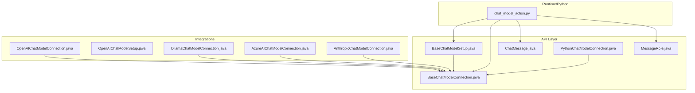
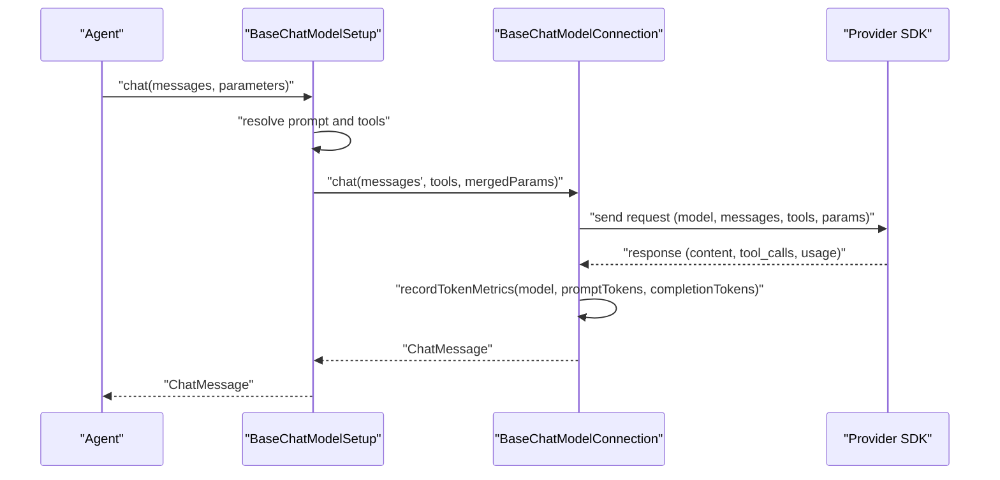
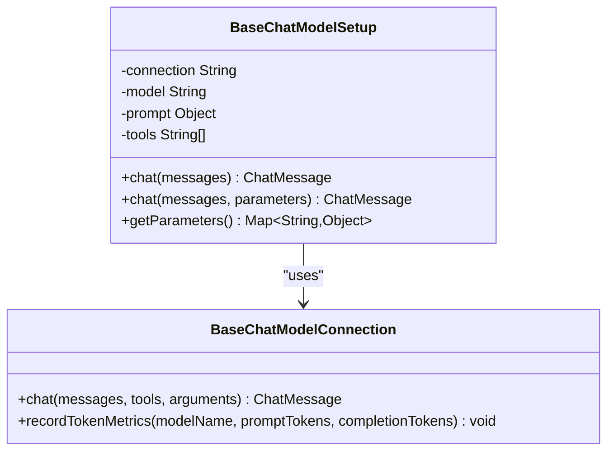
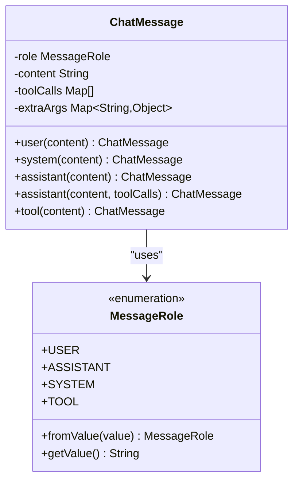
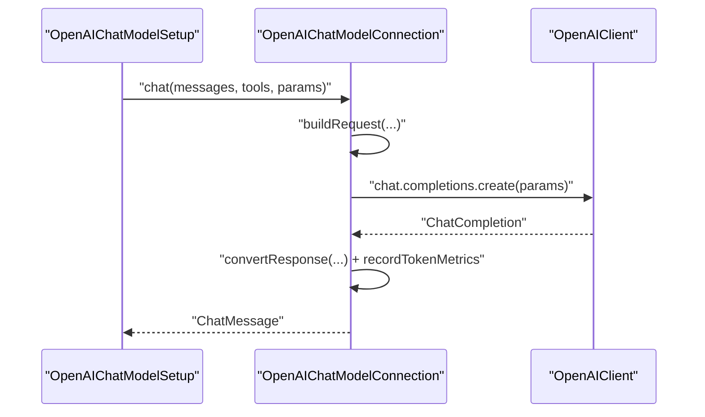
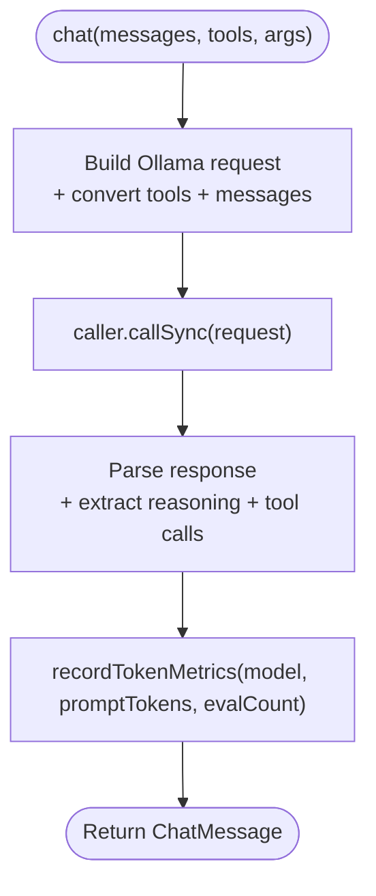
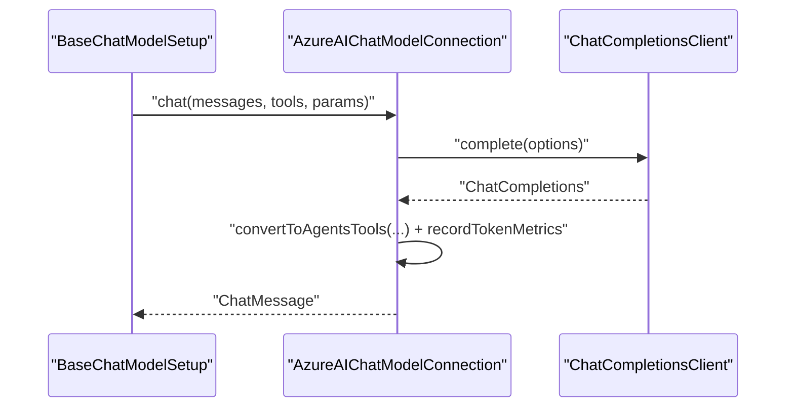
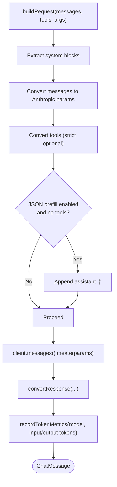
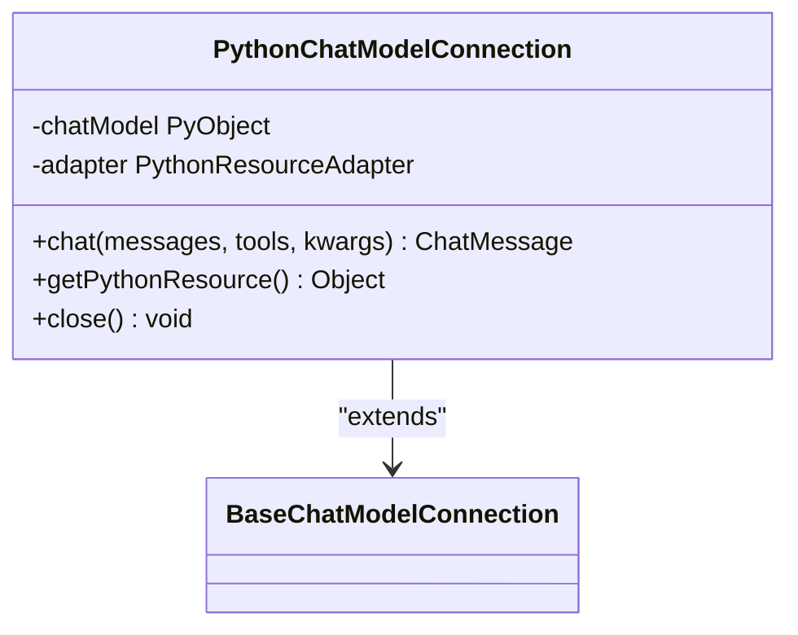
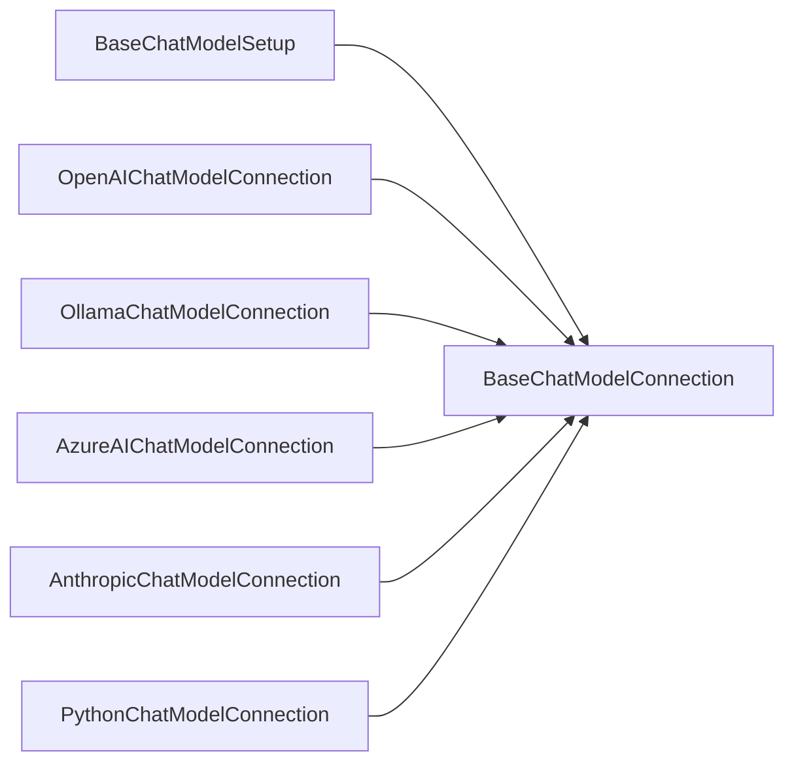

# Chat Model Integration

<cite>
**Referenced Files in This Document**
- [BaseChatModelConnection.java](file://api/src/main/java/org/apache/flink/agents/api/chat/model/BaseChatModelConnection.java)
- [BaseChatModelSetup.java](file://api/src/main/java/org/apache/flink/agents/api/chat/model/BaseChatModelSetup.java)
- [ChatMessage.java](file://api/src/main/java/org/apache/flink/agents/api/chat/messages/ChatMessage.java)
- [MessageRole.java](file://api/src/main/java/org/apache/flink/agents/api/chat/messages/MessageRole.java)
- [PythonChatModelConnection.java](file://api/src/main/java/org/apache/flink/agents/api/chat/model/python/PythonChatModelConnection.java)
- [OpenAIChatModelConnection.java](file://integrations/chat-models/openai/src/main/java/org/apache/flink/agents/integrations/chatmodels/openai/OpenAIChatModelConnection.java)
- [OpenAIChatModelSetup.java](file://integrations/chat-models/openai/src/main/java/org/apache/flink/agents/integrations/chatmodels/openai/OpenAIChatModelSetup.java)
- [OllamaChatModelConnection.java](file://integrations/chat-models/ollama/src/main/java/org/apache/flink/agents/integrations/chatmodels/ollama/OllamaChatModelConnection.java)
- [AnthropicChatModelConnection.java](file://integrations/chat-models/anthropic/src/main/java/org/apache/flink/agents/integrations/chatmodels/anthropic/AnthropicChatModelConnection.java)
- [AzureAIChatModelConnection.java](file://integrations/chat-models/azureai/src/main/java/org/apache/flink/agents/integrations/chatmodels/azureai/AzureAIChatModelConnection.java)
- [BaseChatModelConnectionTokenMetricsTest.java](file://api/src/test/java/org/apache/flink/agents/api/chat/model/BaseChatModelConnectionTokenMetricsTest.java)
- [chat_model_action.py](file://python/flink_agents/plan/actions/chat_model_action.py)
</cite>

## Table of Contents
1. [Introduction](#introduction)
2. [Project Structure](#project-structure)
3. [Core Components](#core-components)
4. [Architecture Overview](#architecture-overview)
5. [Detailed Component Analysis](#detailed-component-analysis)
6. [Dependency Analysis](#dependency-analysis)
7. [Performance Considerations](#performance-considerations)
8. [Troubleshooting Guide](#troubleshooting-guide)
9. [Conclusion](#conclusion)
10. [Appendices](#appendices)

## Introduction
This document explains how chat model integration works in Flink Agents. It focuses on the BaseChatModelConnection and BaseChatModelSetup abstractions that connect to multiple providers (OpenAI, Ollama, Azure AI, Anthropic). It documents the ChatMessage and MessageRole classes for conversation context and message formatting, and covers token counting, response parsing, error handling, streaming support, context window management, conversation history handling, rate limiting, retries, and fallback strategies for production deployments.

## Project Structure
Flink Agents separates the generic chat model abstraction from provider-specific implementations:
- API layer: BaseChatModelConnection, BaseChatModelSetup, ChatMessage, MessageRole, and Python wrapper
- Integrations: Provider-specific connections and setups (OpenAI, Ollama, Azure AI, Anthropic)
- Runtime/Python: Plan actions that orchestrate chat requests, error handling, and token metrics recording

**Diagram sources**
- [BaseChatModelConnection.java](file://api/src/main/java/org/apache/flink/agents/api/chat/model/BaseChatModelConnection.java#L32-L79)
- [BaseChatModelSetup.java](file://api/src/main/java/org/apache/flink/agents/api/chat/model/BaseChatModelSetup.java#L37-L128)
- [ChatMessage.java](file://api/src/main/java/org/apache/flink/agents/api/chat/messages/ChatMessage.java#L29-L158)
- [MessageRole.java](file://api/src/main/java/org/apache/flink/agents/api/chat/messages/MessageRole.java#L21-L63)
- [PythonChatModelConnection.java](file://api/src/main/java/org/apache/flink/agents/api/chat/model/python/PythonChatModelConnection.java#L36-L96)
- [OpenAIChatModelConnection.java](file://integrations/chat-models/openai/src/main/java/org/apache/flink/agents/integrations/chatmodels/openai/OpenAIChatModelConnection.java#L62-L460)
- [OpenAIChatModelSetup.java](file://integrations/chat-models/openai/src/main/java/org/apache/flink/agents/integrations/chatmodels/openai/OpenAIChatModelSetup.java#L32-L220)
- [OllamaChatModelConnection.java](file://integrations/chat-models/ollama/src/main/java/org/apache/flink/agents/integrations/chatmodels/ollama/OllamaChatModelConnection.java#L40-L279)
- [AzureAIChatModelConnection.java](file://integrations/chat-models/azureai/src/main/java/org/apache/flink/agents/integrations/chatmodels/azureai/AzureAIChatModelConnection.java#L40-L234)
- [AnthropicChatModelConnection.java](file://integrations/chat-models/anthropic/src/main/java/org/apache/flink/agents/integrations/chatmodels/anthropic/AnthropicChatModelConnection.java#L55-L530)
- [chat_model_action.py](file://python/flink_agents/plan/actions/chat_model_action.py#L199-L220)

**Section sources**
- [BaseChatModelConnection.java](file://api/src/main/java/org/apache/flink/agents/api/chat/model/BaseChatModelConnection.java#L32-L79)
- [BaseChatModelSetup.java](file://api/src/main/java/org/apache/flink/agents/api/chat/model/BaseChatModelSetup.java#L37-L128)
- [ChatMessage.java](file://api/src/main/java/org/apache/flink/agents/api/chat/messages/ChatMessage.java#L29-L158)
- [MessageRole.java](file://api/src/main/java/org/apache/flink/agents/api/chat/messages/MessageRole.java#L21-L63)
- [PythonChatModelConnection.java](file://api/src/main/java/org/apache/flink/agents/api/chat/model/python/PythonChatModelConnection.java#L36-L96)
- [OpenAIChatModelConnection.java](file://integrations/chat-models/openai/src/main/java/org/apache/flink/agents/integrations/chatmodels/openai/OpenAIChatModelConnection.java#L62-L460)
- [OpenAIChatModelSetup.java](file://integrations/chat-models/openai/src/main/java/org/apache/flink/agents/integrations/chatmodels/openai/OpenAIChatModelSetup.java#L32-L220)
- [OllamaChatModelConnection.java](file://integrations/chat-models/ollama/src/main/java/org/apache/flink/agents/integrations/chatmodels/ollama/OllamaChatModelConnection.java#L40-L279)
- [AzureAIChatModelConnection.java](file://integrations/chat-models/azureai/src/main/java/org/apache/flink/agents/integrations/chatmodels/azureai/AzureAIChatModelConnection.java#L40-L234)
- [AnthropicChatModelConnection.java](file://integrations/chat-models/anthropic/src/main/java/org/apache/flink/agents/integrations/chatmodels/anthropic/AnthropicChatModelConnection.java#L55-L530)
- [chat_model_action.py](file://python/flink_agents/plan/actions/chat_model_action.py#L199-L220)

## Core Components
- BaseChatModelConnection: Defines the contract for connecting to a chat model provider, including chat invocation and token metrics recording.
- BaseChatModelSetup: Provides per-invocation configuration (model, temperature, tools, prompt formatting) and orchestrates the call via the connection resource.
- ChatMessage and MessageRole: Represent conversation messages with roles (user, assistant, system, tool) and optional tool calls and extra arguments.
- PythonChatModelConnection: Bridges Java to a Python chat model object for cross-language integrations.

Key responsibilities:
- Token counting: Implemented in BaseChatModelConnection.recordTokenMetrics and provider-specific classes record usage.
- Response parsing: Provider connections convert provider-specific responses into ChatMessage and tool calls.
- Error handling: Providers wrap exceptions and propagate failures; runtime action supports retry and ignore strategies.

**Section sources**
- [BaseChatModelConnection.java](file://api/src/main/java/org/apache/flink/agents/api/chat/model/BaseChatModelConnection.java#L32-L79)
- [BaseChatModelSetup.java](file://api/src/main/java/org/apache/flink/agents/api/chat/model/BaseChatModelSetup.java#L37-L128)
- [ChatMessage.java](file://api/src/main/java/org/apache/flink/agents/api/chat/messages/ChatMessage.java#L29-L158)
- [MessageRole.java](file://api/src/main/java/org/apache/flink/agents/api/chat/messages/MessageRole.java#L21-L63)
- [PythonChatModelConnection.java](file://api/src/main/java/org/apache/flink/agents/api/chat/model/python/PythonChatModelConnection.java#L36-L96)

## Architecture Overview
The runtime composes a BaseChatModelSetup with a BaseChatModelConnection to execute chat requests. The setup resolves prompt templates and tools, merges parameters, and delegates to the connection. The connection performs provider-specific request building, sends the request, parses the response, records token metrics, and returns a ChatMessage.

**Diagram sources**
- [BaseChatModelSetup.java](file://api/src/main/java/org/apache/flink/agents/api/chat/model/BaseChatModelSetup.java#L54-L101)
- [BaseChatModelConnection.java](file://api/src/main/java/org/apache/flink/agents/api/chat/model/BaseChatModelConnection.java#L50-L79)
- [OpenAIChatModelConnection.java](file://integrations/chat-models/openai/src/main/java/org/apache/flink/agents/integrations/chatmodels/openai/OpenAIChatModelConnection.java#L139-L165)
- [OllamaChatModelConnection.java](file://integrations/chat-models/ollama/src/main/java/org/apache/flink/agents/integrations/chatmodels/ollama/OllamaChatModelConnection.java#L179-L244)
- [AzureAIChatModelConnection.java](file://integrations/chat-models/azureai/src/main/java/org/apache/flink/agents/integrations/chatmodels/azureai/AzureAIChatModelConnection.java#L164-L205)
- [AnthropicChatModelConnection.java](file://integrations/chat-models/anthropic/src/main/java/org/apache/flink/agents/integrations/chatmodels/anthropic/AnthropicChatModelConnection.java#L114-L155)

## Detailed Component Analysis

### BaseChatModelConnection and BaseChatModelSetup
- BaseChatModelConnection
  - chat(List<ChatMessage>, List<Tool>, Map<String,Object>): Executes a single chat request and returns a ChatMessage.
  - recordTokenMetrics(String, long, long): Records prompt and completion token counts per model.
- BaseChatModelSetup
  - Resolves connection resource by name and type.
  - Optionally formats messages using a Prompt resource and appends meaningful prior messages.
  - Resolves tools by name and passes them to the connection.
  - Merges setup parameters with per-call parameters and invokes the connection.

**Diagram sources**
- [BaseChatModelConnection.java](file://api/src/main/java/org/apache/flink/agents/api/chat/model/BaseChatModelConnection.java#L32-L79)
- [BaseChatModelSetup.java](file://api/src/main/java/org/apache/flink/agents/api/chat/model/BaseChatModelSetup.java#L37-L128)

**Section sources**
- [BaseChatModelConnection.java](file://api/src/main/java/org/apache/flink/agents/api/chat/model/BaseChatModelConnection.java#L32-L79)
- [BaseChatModelSetup.java](file://api/src/main/java/org/apache/flink/agents/api/chat/model/BaseChatModelSetup.java#L37-L128)

### ChatMessage and MessageRole
- ChatMessage encapsulates role, content, toolCalls, and extraArgs. Includes convenience constructors and static factories for user/system/assistant/tool.
- MessageRole enumerates supported roles and provides safe parsing from string values.

**Diagram sources**
- [ChatMessage.java](file://api/src/main/java/org/apache/flink/agents/api/chat/messages/ChatMessage.java#L29-L158)
- [MessageRole.java](file://api/src/main/java/org/apache/flink/agents/api/chat/messages/MessageRole.java#L21-L63)

**Section sources**
- [ChatMessage.java](file://api/src/main/java/org/apache/flink/agents/api/chat/messages/ChatMessage.java#L29-L158)
- [MessageRole.java](file://api/src/main/java/org/apache/flink/agents/api/chat/messages/MessageRole.java#L21-L63)

### Provider Integrations

#### OpenAI
- Connection parameters: api_key (required), api_base_url (optional), timeout, max_retries, default_headers, model.
- Request building: maps ChatMessage roles to OpenAI message types, converts tools to function tools, supports strict mode, reasoning effort, logprobs, and additional kwargs.
- Response parsing: extracts content, refusal, and tool calls; serializes/deserializes tool arguments.
- Token metrics: reads usage and records prompt/completion tokens.

**Diagram sources**
- [OpenAIChatModelSetup.java](file://integrations/chat-models/openai/src/main/java/org/apache/flink/agents/integrations/chatmodels/openai/OpenAIChatModelSetup.java#L154-L178)
- [OpenAIChatModelConnection.java](file://integrations/chat-models/openai/src/main/java/org/apache/flink/agents/integrations/chatmodels/openai/OpenAIChatModelConnection.java#L139-L165)
- [OpenAIChatModelConnection.java](file://integrations/chat-models/openai/src/main/java/org/apache/flink/agents/integrations/chatmodels/openai/OpenAIChatModelConnection.java#L167-L226)
- [OpenAIChatModelConnection.java](file://integrations/chat-models/openai/src/main/java/org/apache/flink/agents/integrations/chatmodels/openai/OpenAIChatModelConnection.java#L356-L374)

**Section sources**
- [OpenAIChatModelConnection.java](file://integrations/chat-models/openai/src/main/java/org/apache/flink/agents/integrations/chatmodels/openai/OpenAIChatModelConnection.java#L62-L460)
- [OpenAIChatModelSetup.java](file://integrations/chat-models/openai/src/main/java/org/apache/flink/agents/integrations/chatmodels/openai/OpenAIChatModelSetup.java#L32-L220)

#### Ollama
- Connection parameters: endpoint (required), requestTimeout (optional).
- Tool conversion: expects JSON schema with properties/required; builds Ollama tool specs.
- Message conversion: maps roles to Ollama roles; supports thinking modes and reasoning extraction.
- Response parsing: extracts assistant content, optional reasoning, and tool calls; records token metrics.

**Diagram sources**
- [OllamaChatModelConnection.java](file://integrations/chat-models/ollama/src/main/java/org/apache/flink/agents/integrations/chatmodels/ollama/OllamaChatModelConnection.java#L179-L244)

**Section sources**
- [OllamaChatModelConnection.java](file://integrations/chat-models/ollama/src/main/java/org/apache/flink/agents/integrations/chatmodels/ollama/OllamaChatModelConnection.java#L40-L279)

#### Azure AI
- Connection parameters: endpoint (required), apiKey (required).
- Tool conversion: converts tool schemas to Azure AI FunctionDefinition.
- Message conversion: maps roles to Azure AI message types; handles tool calls in assistant messages.
- Response parsing: extracts content and tool calls; records token metrics.

**Diagram sources**
- [AzureAIChatModelConnection.java](file://integrations/chat-models/azureai/src/main/java/org/apache/flink/agents/integrations/chatmodels/azureai/AzureAIChatModelConnection.java#L164-L205)

**Section sources**
- [AzureAIChatModelConnection.java](file://integrations/chat-models/azureai/src/main/java/org/apache/flink/agents/integrations/chatmodels/azureai/AzureAIChatModelConnection.java#L40-L234)

#### Anthropic
- Connection parameters: api_key (required), timeout, max_retries, model.
- System messages: extracted separately; assistant tool_use blocks supported.
- Strict tools: toggled via argument; adds beta header for structured outputs.
- JSON prefill: optional; when enabled and no tools, appends an assistant message starting with "{".
- Response parsing: aggregates text content, extracts tool_use blocks, and optionally extracts JSON from markdown code blocks.

**Diagram sources**
- [AnthropicChatModelConnection.java](file://integrations/chat-models/anthropic/src/main/java/org/apache/flink/agents/integrations/chatmodels/anthropic/AnthropicChatModelConnection.java#L157-L233)
- [AnthropicChatModelConnection.java](file://integrations/chat-models/anthropic/src/main/java/org/apache/flink/agents/integrations/chatmodels/anthropic/AnthropicChatModelConnection.java#L366-L421)

**Section sources**
- [AnthropicChatModelConnection.java](file://integrations/chat-models/anthropic/src/main/java/org/apache/flink/agents/integrations/chatmodels/anthropic/AnthropicChatModelConnection.java#L55-L530)

### Python Bridge (Cross-Language)
- PythonChatModelConnection wraps a Python chat model object and translates messages/tools between Java and Python representations, delegating chat execution to the Python object.

**Diagram sources**
- [PythonChatModelConnection.java](file://api/src/main/java/org/apache/flink/agents/api/chat/model/python/PythonChatModelConnection.java#L36-L96)

**Section sources**
- [PythonChatModelConnection.java](file://api/src/main/java/org/apache/flink/agents/api/chat/model/python/PythonChatModelConnection.java#L36-L96)

## Dependency Analysis
- Cohesion: BaseChatModelSetup and BaseChatModelConnection are cohesive around chat execution and configuration.
- Coupling: Provider connections depend on BaseChatModelConnection; BaseChatModelSetup depends on BaseChatModelConnection and resource resolution.
- External dependencies: Each provider integrates via its official SDK; Python bridge depends on pemja and adapter utilities.

**Diagram sources**
- [BaseChatModelConnection.java](file://api/src/main/java/org/apache/flink/agents/api/chat/model/BaseChatModelConnection.java#L32-L79)
- [BaseChatModelSetup.java](file://api/src/main/java/org/apache/flink/agents/api/chat/model/BaseChatModelSetup.java#L37-L128)
- [OpenAIChatModelConnection.java](file://integrations/chat-models/openai/src/main/java/org/apache/flink/agents/integrations/chatmodels/openai/OpenAIChatModelConnection.java#L62-L460)
- [OllamaChatModelConnection.java](file://integrations/chat-models/ollama/src/main/java/org/apache/flink/agents/integrations/chatmodels/ollama/OllamaChatModelConnection.java#L40-L279)
- [AzureAIChatModelConnection.java](file://integrations/chat-models/azureai/src/main/java/org/apache/flink/agents/integrations/chatmodels/azureai/AzureAIChatModelConnection.java#L40-L234)
- [AnthropicChatModelConnection.java](file://integrations/chat-models/anthropic/src/main/java/org/apache/flink/agents/integrations/chatmodels/anthropic/AnthropicChatModelConnection.java#L55-L530)
- [PythonChatModelConnection.java](file://api/src/main/java/org/apache/flink/agents/api/chat/model/python/PythonChatModelConnection.java#L36-L96)

**Section sources**
- [BaseChatModelConnection.java](file://api/src/main/java/org/apache/flink/agents/api/chat/model/BaseChatModelConnection.java#L32-L79)
- [BaseChatModelSetup.java](file://api/src/main/java/org/apache/flink/agents/api/chat/model/BaseChatModelSetup.java#L37-L128)
- [OpenAIChatModelConnection.java](file://integrations/chat-models/openai/src/main/java/org/apache/flink/agents/integrations/chatmodels/openai/OpenAIChatModelConnection.java#L62-L460)
- [OllamaChatModelConnection.java](file://integrations/chat-models/ollama/src/main/java/org/apache/flink/agents/integrations/chatmodels/ollama/OllamaChatModelConnection.java#L40-L279)
- [AzureAIChatModelConnection.java](file://integrations/chat-models/azureai/src/main/java/org/apache/flink/agents/integrations/chatmodels/azureai/AzureAIChatModelConnection.java#L40-L234)
- [AnthropicChatModelConnection.java](file://integrations/chat-models/anthropic/src/main/java/org/apache/flink/agents/integrations/chatmodels/anthropic/AnthropicChatModelConnection.java#L55-L530)
- [PythonChatModelConnection.java](file://api/src/main/java/org/apache/flink/agents/api/chat/model/python/PythonChatModelConnection.java#L36-L96)

## Performance Considerations
- Token counting: Providers record prompt and completion tokens; ensure model names are present to enable accurate grouping.
- Context window management: Configure max_tokens appropriately per provider; monitor usage to avoid truncation.
- Streaming: Current provider implementations perform synchronous requests. For streaming, consider adapting provider SDKs to emit incremental chunks and aggregate them into ChatMessage updates.
- Retry and rate limiting: Providers set internal timeouts and max_retries; tune these parameters per SLA. Implement application-level backoff and jitter for transient errors.

[No sources needed since this section provides general guidance]

## Troubleshooting Guide
- Token metrics recording
  - Ensure the connection’s metric group is set by BaseChatModelSetup so recordTokenMetrics can increment counters.
  - Verify model name is available when recording usage.
- Error handling in runtime
  - The runtime action supports IGNORE, RETRY, and RAISE strategies. Use IGNORE for non-critical steps, RETRY with bounded attempts for transient failures, and RAISE for immediate failure propagation.
- Common issues
  - Missing api_key or invalid endpoint: Provider constructors validate required credentials and throw descriptive exceptions.
  - Tool schema parsing: Ensure tool schemas are valid JSON with properties and required fields for Ollama and Azure AI.
  - Role mapping: Unsupported roles cause IllegalArgumentException during message conversion.

**Section sources**
- [BaseChatModelConnectionTokenMetricsTest.java](file://api/src/test/java/org/apache/flink/agents/api/chat/model/BaseChatModelConnectionTokenMetricsTest.java#L133-L157)
- [chat_model_action.py](file://python/flink_agents/plan/actions/chat_model_action.py#L199-L220)
- [OpenAIChatModelConnection.java](file://integrations/chat-models/openai/src/main/java/org/apache/flink/agents/integrations/chatmodels/openai/OpenAIChatModelConnection.java#L106-L137)
- [OllamaChatModelConnection.java](file://integrations/chat-models/ollama/src/main/java/org/apache/flink/agents/integrations/chatmodels/ollama/OllamaChatModelConnection.java#L76-L84)
- [AzureAIChatModelConnection.java](file://integrations/chat-models/azureai/src/main/java/org/apache/flink/agents/integrations/chatmodels/azureai/AzureAIChatModelConnection.java#L80-L90)
- [AnthropicChatModelConnection.java](file://integrations/chat-models/anthropic/src/main/java/org/apache/flink/agents/integrations/chatmodels/anthropic/AnthropicChatModelConnection.java#L93-L112)

## Conclusion
Flink Agents provides a clean separation between configuration (BaseChatModelSetup) and connectivity (BaseChatModelConnection), enabling pluggable providers. The ChatMessage and MessageRole classes standardize conversation representation, while provider integrations handle request construction, response parsing, and token accounting. Production deployments should leverage built-in retry/backoff, explicit rate limiting, and structured error handling to achieve reliability and observability.

[No sources needed since this section summarizes without analyzing specific files]

## Appendices

### Practical Integration Examples (by provider)
- OpenAI
  - Connection: api_key, api_base_url, timeout, max_retries, default_headers, model.
  - Setup: model, temperature, max_tokens, logprobs/top_logprobs, strict, reasoning_effort, tools, additional_kwargs.
- Ollama
  - Connection: endpoint, requestTimeout.
  - Tools: JSON schema with properties and required fields.
- Azure AI
  - Connection: endpoint, apiKey.
  - Tools: function definitions built from tool schemas.
- Anthropic
  - Connection: api_key, timeout, max_retries, model.
  - Features: strict_tools, json_prefill, additional kwargs (top_k, top_p, stop_sequences).

[No sources needed since this section provides general guidance]