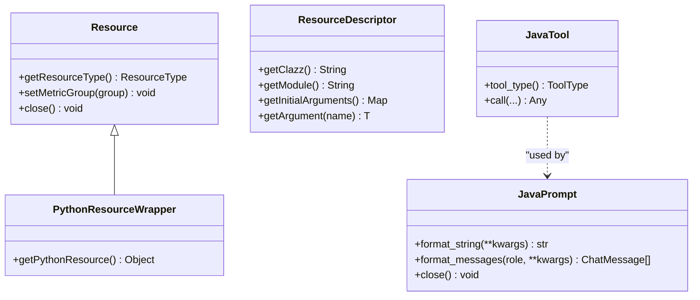

# Cross-Language Resource Sharing

<cite>
**Referenced Files in This Document**
- [PythonResourceAdapter.java](file://api/src/main/java/org/apache/flink/agents/api/resource/python/PythonResourceAdapter.java)
- [PythonResourceAdapterImpl.java](file://runtime/src/main/java/org/apache/flink/agents/runtime/python/utils/PythonResourceAdapterImpl.java)
- [JavaResourceAdapter.java](file://runtime/src/main/java/org/apache/flink/agents/runtime/python/utils/JavaResourceAdapter.java)
- [PythonResourceProvider.java](file://plan/src/main/java/org/apache/flink/agents/plan/resourceprovider/PythonResourceProvider.java)
- [JavaResourceProvider.java](file://plan/src/main/java/org/apache/flink/agents/plan/resourceprovider/JavaResourceProvider.java)
- [ResourceProvider.java](file://plan/src/main/java/org/apache/flink/agents/plan/resourceprovider/ResourceProvider.java)
- [Resource.java](file://api/src/main/java/org/apache/flink/agents/api/resource/Resource.java)
- [ResourceDescriptor.java](file://api/src/main/java/org/apache/flink/agents/api/resource/ResourceDescriptor.java)
- [PythonResourceWrapper.java](file://api/src/main/java/org/apache/flink/agents/api/resource/python/PythonResourceWrapper.java)
- [python_java_utils.py](file://python/flink_agents/runtime/python_java_utils.py)
- [java_resource_wrapper.py](file://python/flink_agents/runtime/java/java_resource_wrapper.py)
- [PythonResourceAdapterImplTest.java](file://runtime/src/test/java/org/apache/flink/agents/runtime/python/utils/PythonResourceAdapterImplTest.java)
</cite>

## Table of Contents
1. [Introduction](#introduction)
2. [Project Structure](#project-structure)
3. [Core Components](#core-components)
4. [Architecture Overview](#architecture-overview)
5. [Detailed Component Analysis](#detailed-component-analysis)
6. [Dependency Analysis](#dependency-analysis)
7. [Performance Considerations](#performance-considerations)
8. [Troubleshooting Guide](#troubleshooting-guide)
9. [Conclusion](#conclusion)
10. [Appendices](#appendices)

## Introduction
This document explains how Flink Agents enables cross-language resource sharing between Java and Python environments. It focuses on the PythonResourceProvider and JavaResourceProvider implementations, the PythonResourceAdapterImpl bridge that connects Python objects to Java contexts, and the serialization and marshaling strategies used to move data across language boundaries. Practical examples show how Java-defined tools and Python-implemented models can cooperate seamlessly, along with performance, error handling, and debugging guidance for cross-language interactions.

## Project Structure
Cross-language resource sharing spans three layers:
- Plan layer: Resource descriptors and providers that carry metadata and construct runtime resources.
- API layer: Shared resource abstractions and adapters that define interoperability contracts.
- Runtime layer: Python-Java bridges and utilities that perform object marshaling and method invocation.

**Diagram sources**
- [ResourceProvider.java](file://plan/src/main/java/org/apache/flink/agents/plan/resourceprovider/ResourceProvider.java#L38-L75)
- [JavaResourceProvider.java](file://plan/src/main/java/org/apache/flink/agents/plan/resourceprovider/JavaResourceProvider.java#L29-L56)
- [PythonResourceProvider.java](file://plan/src/main/java/org/apache/flink/agents/plan/resourceprovider/PythonResourceProvider.java#L47-L126)
- [ResourceDescriptor.java](file://api/src/main/java/org/apache/flink/agents/api/resource/ResourceDescriptor.java#L29-L88)
- [Resource.java](file://api/src/main/java/org/apache/flink/agents/api/resource/Resource.java#L30-L70)
- [PythonResourceAdapter.java](file://api/src/main/java/org/apache/flink/agents/api/resource/python/PythonResourceAdapter.java#L37-L140)
- [PythonResourceWrapper.java](file://api/src/main/java/org/apache/flink/agents/api/resource/python/PythonResourceWrapper.java#L24-L32)
- [PythonResourceAdapterImpl.java](file://runtime/src/main/java/org/apache/flink/agents/runtime/python/utils/PythonResourceAdapterImpl.java#L41-L203)
- [JavaResourceAdapter.java](file://runtime/src/main/java/org/apache/flink/agents/runtime/python/utils/JavaResourceAdapter.java#L34-L104)
- [python_java_utils.py](file://python/flink_agents/runtime/python_java_utils.py#L78-L151)
- [java_resource_wrapper.py](file://python/flink_agents/runtime/java/java_resource_wrapper.py#L69-L79)

**Section sources**
- [ResourceProvider.java](file://plan/src/main/java/org/apache/flink/agents/plan/resourceprovider/ResourceProvider.java#L30-L75)
- [ResourceDescriptor.java](file://api/src/main/java/org/apache/flink/agents/api/resource/ResourceDescriptor.java#L28-L98)
- [PythonResourceAdapter.java](file://api/src/main/java/org/apache/flink/agents/api/resource/python/PythonResourceAdapter.java#L32-L140)
- [PythonResourceAdapterImpl.java](file://runtime/src/main/java/org/apache/flink/agents/runtime/python/utils/PythonResourceAdapterImpl.java#L41-L203)
- [JavaResourceAdapter.java](file://runtime/src/main/java/org/apache/flink/agents/runtime/python/utils/JavaResourceAdapter.java#L33-L104)
- [PythonResourceProvider.java](file://plan/src/main/java/org/apache/flink/agents/plan/resourceprovider/PythonResourceProvider.java#L41-L126)
- [JavaResourceProvider.java](file://plan/src/main/java/org/apache/flink/agents/plan/resourceprovider/JavaResourceProvider.java#L28-L56)
- [Resource.java](file://api/src/main/java/org/apache/flink/agents/api/resource/Resource.java#L25-L70)
- [PythonResourceWrapper.java](file://api/src/main/java/org/apache/flink/agents/api/resource/python/PythonResourceWrapper.java#L20-L32)
- [python_java_utils.py](file://python/flink_agents/runtime/python_java_utils.py#L78-L151)
- [java_resource_wrapper.py](file://python/flink_agents/runtime/java/java_resource_wrapper.py#L69-L79)

## Core Components
- ResourceProvider: Abstract factory for constructing runtime resources from serialized descriptors.
- JavaResourceProvider: Instantiates Java-side resources using class names and initial arguments.
- PythonResourceProvider: Instantiates Python-side resources via a PythonResourceAdapter using module/class and kwargs.
- PythonResourceAdapter: Defines conversions and invocations between Java and Python objects.
- PythonResourceAdapterImpl: Implements PythonResourceAdapter using a Python interpreter and a JavaResourceAdapter bridge.
- JavaResourceAdapter: Provides reverse conversions and helpers for Python to call back into Java.
- Resource and ResourceDescriptor: Shared abstractions for typed resources and their construction metadata.
- PythonResourceWrapper: Allows Java to expose Python objects as resources.
- python_java_utils.py: Serialization utilities and marshaling functions for cross-language data exchange.
- java_resource_wrapper.py: Python wrappers for Java resources/tools/prompts enabling Python-side consumption.

**Section sources**
- [ResourceProvider.java](file://plan/src/main/java/org/apache/flink/agents/plan/resourceprovider/ResourceProvider.java#L30-L75)
- [JavaResourceProvider.java](file://plan/src/main/java/org/apache/flink/agents/plan/resourceprovider/JavaResourceProvider.java#L28-L56)
- [PythonResourceProvider.java](file://plan/src/main/java/org/apache/flink/agents/plan/resourceprovider/PythonResourceProvider.java#L41-L126)
- [PythonResourceAdapter.java](file://api/src/main/java/org/apache/flink/agents/api/resource/python/PythonResourceAdapter.java#L32-L140)
- [PythonResourceAdapterImpl.java](file://runtime/src/main/java/org/apache/flink/agents/runtime/python/utils/PythonResourceAdapterImpl.java#L41-L203)
- [JavaResourceAdapter.java](file://runtime/src/main/java/org/apache/flink/agents/runtime/python/utils/JavaResourceAdapter.java#L33-L104)
- [Resource.java](file://api/src/main/java/org/apache/flink/agents/api/resource/Resource.java#L25-L70)
- [ResourceDescriptor.java](file://api/src/main/java/org/apache/flink/agents/api/resource/ResourceDescriptor.java#L28-L98)
- [PythonResourceWrapper.java](file://api/src/main/java/org/apache/flink/agents/api/resource/python/PythonResourceWrapper.java#L20-L32)
- [python_java_utils.py](file://python/flink_agents/runtime/python_java_utils.py#L78-L151)
- [java_resource_wrapper.py](file://python/flink_agents/runtime/java/java_resource_wrapper.py#L69-L79)

## Architecture Overview
The cross-language architecture centers on a provider pattern and adapter interfaces. Providers carry metadata to construct resources at runtime. Adapters translate between Java and Python representations and enable method invocation across language boundaries.

**Diagram sources**
- [PythonResourceProvider.java](file://plan/src/main/java/org/apache/flink/agents/plan/resourceprovider/PythonResourceProvider.java#L76-L126)
- [PythonResourceAdapterImpl.java](file://runtime/src/main/java/org/apache/flink/agents/runtime/python/utils/PythonResourceAdapterImpl.java#L119-L123)
- [python_java_utils.py](file://python/flink_agents/runtime/python_java_utils.py#L78-L91)
- [JavaResourceAdapter.java](file://runtime/src/main/java/org/apache/flink/agents/runtime/python/utils/JavaResourceAdapter.java#L34-L43)

## Detailed Component Analysis

### PythonResourceProvider
- Purpose: Construct Python resources by resolving module/class and kwargs, then instantiating the appropriate resource class with a PythonResourceAdapter and ResourceDescriptor.
- Key behaviors:
  - Validates resource type mapping and throws if unsupported.
  - Derives module/class from descriptor or kwargs if not provided.
  - Delegates instantiation to PythonResourceAdapter and constructs the resource via reflection.
- Integration: Works with ResourceDescriptor to carry cross-language metadata and with PythonResourceAdapter to initialize Python objects.

**Diagram sources**
- [PythonResourceProvider.java](file://plan/src/main/java/org/apache/flink/agents/plan/resourceprovider/PythonResourceProvider.java#L76-L126)

**Section sources**
- [PythonResourceProvider.java](file://plan/src/main/java/org/apache/flink/agents/plan/resourceprovider/PythonResourceProvider.java#L41-L126)
- [ResourceDescriptor.java](file://api/src/main/java/org/apache/flink/agents/api/resource/ResourceDescriptor.java#L28-L98)

### JavaResourceProvider
- Purpose: Instantiate Java resources directly from a fully qualified class name and initial arguments.
- Key behaviors:
  - Loads class via current thread’s context class loader.
  - Constructs resource with ResourceDescriptor and a getResource helper.
- Integration: Used alongside PythonResourceProvider to support mixed-language agent plans.

**Section sources**
- [JavaResourceProvider.java](file://plan/src/main/java/org/apache/flink/agents/plan/resourceprovider/JavaResourceProvider.java#L28-L56)
- [ResourceDescriptor.java](file://api/src/main/java/org/apache/flink/agents/api/resource/ResourceDescriptor.java#L28-L98)

### PythonResourceAdapter and PythonResourceAdapterImpl
- Purpose: Bridge Java and Python objects, enabling conversions and method invocation across language boundaries.
- Responsibilities:
  - Retrieve resources by name/type and convert Java objects to Python equivalents.
  - Initialize Python resources from module/class with kwargs.
  - Convert ChatMessage, Document, VectorStoreQuery, and Tool instances.
  - Invoke methods on Python objects and raw Python functions by name.
- Implementation highlights:
  - Imports and binds a Python function that wraps JavaResourceAdapter for Python to fetch Java resources.
  - Uses a Python interpreter to call functions in python_java_utils.py for conversions and creation.
  - Maintains a JavaResourceAdapter for reverse conversions and callbacks.

**Diagram sources**
- [PythonResourceAdapter.java](file://api/src/main/java/org/apache/flink/agents/api/resource/python/PythonResourceAdapter.java#L37-L140)
- [PythonResourceAdapterImpl.java](file://runtime/src/main/java/org/apache/flink/agents/runtime/python/utils/PythonResourceAdapterImpl.java#L41-L203)
- [JavaResourceAdapter.java](file://runtime/src/main/java/org/apache/flink/agents/runtime/python/utils/JavaResourceAdapter.java#L34-L104)

**Section sources**
- [PythonResourceAdapter.java](file://api/src/main/java/org/apache/flink/agents/api/resource/python/PythonResourceAdapter.java#L32-L140)
- [PythonResourceAdapterImpl.java](file://runtime/src/main/java/org/apache/flink/agents/runtime/python/utils/PythonResourceAdapterImpl.java#L41-L203)
- [JavaResourceAdapter.java](file://runtime/src/main/java/org/apache/flink/agents/runtime/python/utils/JavaResourceAdapter.java#L33-L104)

### Resource Abstractions and Wrappers
- Resource: Base class for all resources with metric binding and lifecycle hooks.
- ResourceDescriptor: Encapsulates class/module and initial arguments for cross-language construction.
- PythonResourceWrapper: Allows Java to expose Python objects as resources.
- java_resource_wrapper.py: Provides Python wrappers for Java resources (JavaTool, JavaPrompt, JavaGetResourceWrapper).

**Diagram sources**
- [Resource.java](file://api/src/main/java/org/apache/flink/agents/api/resource/Resource.java#L30-L70)
- [ResourceDescriptor.java](file://api/src/main/java/org/apache/flink/agents/api/resource/ResourceDescriptor.java#L29-L98)
- [PythonResourceWrapper.java](file://api/src/main/java/org/apache/flink/agents/api/resource/python/PythonResourceWrapper.java#L24-L32)
- [java_resource_wrapper.py](file://python/flink_agents/runtime/java/java_resource_wrapper.py#L29-L67)

**Section sources**
- [Resource.java](file://api/src/main/java/org/apache/flink/agents/api/resource/Resource.java#L25-L70)
- [ResourceDescriptor.java](file://api/src/main/java/org/apache/flink/agents/api/resource/ResourceDescriptor.java#L28-L98)
- [PythonResourceWrapper.java](file://api/src/main/java/org/apache/flink/agents/api/resource/python/PythonResourceWrapper.java#L20-L32)
- [java_resource_wrapper.py](file://python/flink_agents/runtime/java/java_resource_wrapper.py#L29-L67)

### Serialization Strategies and Object Marshaling
- CloudPickle-based utilities in python_java_utils.py:
  - convert_to_python_object: Deserializes bytes to Python objects.
  - wrap_to_input_event and get_output_from_output_event: Wrap/unwrap events for cross-language transport.
- Marshaling functions:
  - from_java_* and to_java_* functions convert between Java and Python representations for ChatMessage, Document, VectorStoreQuery, and related types.
  - call_method: Dynamically invokes methods on Python objects with kwargs.
- Resource creation:
  - from_java_resource: Maps Java resource type to a Python resource class and instantiates it with kwargs.
  - create_resource: Dynamically imports a module and class to instantiate a Python resource.

**Diagram sources**
- [python_java_utils.py](file://python/flink_agents/runtime/python_java_utils.py#L48-L76)
- [python_java_utils.py](file://python/flink_agents/runtime/python_java_utils.py#L174-L227)
- [python_java_utils.py](file://python/flink_agents/runtime/python_java_utils.py#L264-L283)

**Section sources**
- [python_java_utils.py](file://python/flink_agents/runtime/python_java_utils.py#L48-L76)
- [python_java_utils.py](file://python/flink_agents/runtime/python_java_utils.py#L174-L227)
- [python_java_utils.py](file://python/flink_agents/runtime/python_java_utils.py#L264-L283)

### Practical Examples: Sharing Resources Across Languages
- Java-defined Tool consumed by Python-implemented model:
  - JavaResourceProvider constructs a Java Tool.
  - PythonResourceAdapterImpl converts the Java Tool to a Python JavaTool wrapper for Python-side usage.
  - The Python model can call methods on the wrapper via callMethod or invoke.
- Python-implemented Chat Model used by Java:
  - PythonResourceProvider resolves module/class and initializes a Python resource via PythonResourceAdapterImpl.
  - The resulting Python object is exposed to Java as a resource, and Java can call conversion methods to marshal data.

These scenarios rely on:
- ResourceDescriptor to carry cross-language metadata.
- PythonResourceAdapterImpl to perform conversions and method dispatch.
- python_java_utils.py for low-level marshaling and dynamic resource creation.

**Section sources**
- [JavaResourceProvider.java](file://plan/src/main/java/org/apache/flink/agents/plan/resourceprovider/JavaResourceProvider.java#L28-L56)
- [PythonResourceProvider.java](file://plan/src/main/java/org/apache/flink/agents/plan/resourceprovider/PythonResourceProvider.java#L76-L126)
- [PythonResourceAdapterImpl.java](file://runtime/src/main/java/org/apache/flink/agents/runtime/python/utils/PythonResourceAdapterImpl.java#L119-L123)
- [python_java_utils.py](file://python/flink_agents/runtime/python_java_utils.py#L104-L131)

## Dependency Analysis
- Provider-to-adapter coupling:
  - PythonResourceProvider depends on PythonResourceAdapter for Python object initialization.
  - Both PythonResourceAdapterImpl and JavaResourceAdapter depend on Resource and ResourceDescriptor abstractions.
- Python interpreter dependency:
  - PythonResourceAdapterImpl relies on a PythonInterpreter to call functions in python_java_utils.py.
- Reverse bridging:
  - JavaResourceAdapter exposes JavaResourceAdapter to Python via get_resource_function, enabling Python to fetch Java resources dynamically.

**Diagram sources**
- [PythonResourceProvider.java](file://plan/src/main/java/org/apache/flink/agents/plan/resourceprovider/PythonResourceProvider.java#L76-L126)
- [PythonResourceAdapter.java](file://api/src/main/java/org/apache/flink/agents/api/resource/python/PythonResourceAdapter.java#L37-L140)
- [PythonResourceAdapterImpl.java](file://runtime/src/main/java/org/apache/flink/agents/runtime/python/utils/PythonResourceAdapterImpl.java#L41-L203)
- [JavaResourceAdapter.java](file://runtime/src/main/java/org/apache/flink/agents/runtime/python/utils/JavaResourceAdapter.java#L34-L104)
- [python_java_utils.py](file://python/flink_agents/runtime/python_java_utils.py#L93-L102)
- [ResourceDescriptor.java](file://api/src/main/java/org/apache/flink/agents/api/resource/ResourceDescriptor.java#L29-L98)
- [Resource.java](file://api/src/main/java/org/apache/flink/agents/api/resource/Resource.java#L30-L70)
- [PythonResourceWrapper.java](file://api/src/main/java/org/apache/flink/agents/api/resource/python/PythonResourceWrapper.java#L24-L32)

**Section sources**
- [PythonResourceProvider.java](file://plan/src/main/java/org/apache/flink/agents/plan/resourceprovider/PythonResourceProvider.java#L76-L126)
- [PythonResourceAdapterImpl.java](file://runtime/src/main/java/org/apache/flink/agents/runtime/python/utils/PythonResourceAdapterImpl.java#L76-L88)
- [JavaResourceAdapter.java](file://runtime/src/main/java/org/apache/flink/agents/runtime/python/utils/JavaResourceAdapter.java#L34-L43)
- [python_java_utils.py](file://python/flink_agents/runtime/python_java_utils.py#L93-L102)
- [ResourceDescriptor.java](file://api/src/main/java/org/apache/flink/agents/api/resource/ResourceDescriptor.java#L29-L98)
- [Resource.java](file://api/src/main/java/org/apache/flink/agents/api/resource/Resource.java#L30-L70)
- [PythonResourceWrapper.java](file://api/src/main/java/org/apache/flink/agents/api/resource/python/PythonResourceWrapper.java#L24-L32)

## Performance Considerations
- Minimize cross-boundary calls:
  - Batch conversions where possible (e.g., convert lists of documents or messages together).
  - Cache frequently accessed Python functions and Java classes via the adapter.
- Efficient serialization:
  - Prefer lightweight representations for frequent transfers; leverage existing conversion functions to avoid redundant marshaling.
- Interpreter lifecycle:
  - Keep the Python interpreter warm and reuse it across calls to reduce startup overhead.
- Avoid excessive reflection:
  - Cache constructors and method handles when feasible to reduce reflection costs.

## Troubleshooting Guide
- Common errors and diagnostics:
  - Unsupported Python resource type: Ensure the ResourceType is mapped in PythonResourceProvider.
  - Missing PythonResourceAdapter: Verify that setPythonResourceAdapter was called before provide().
  - Invalid module/class specification: Confirm module/class resolution from descriptor or kwargs.
  - Python interpreter not initialized: Ensure PythonResourceAdapterImpl.open() is invoked before conversions.
  - Missing Java class loader context: Confirm the class name resolution in JavaResourceProvider.
- Debugging techniques:
  - Enable logging around adapter conversions and method invocations.
  - Use PythonResourceAdapterImplTest as a reference for expected behaviors and edge cases.
  - Validate ResourceDescriptor fields (module, clazz, initialArguments) before provider execution.

**Section sources**
- [PythonResourceProvider.java](file://plan/src/main/java/org/apache/flink/agents/plan/resourceprovider/PythonResourceProvider.java#L82-L84)
- [PythonResourceAdapterImpl.java](file://runtime/src/main/java/org/apache/flink/agents/runtime/python/utils/PythonResourceAdapterImpl.java#L90-L93)
- [PythonResourceAdapterImplTest.java](file://runtime/src/test/java/org/apache/flink/agents/runtime/python/utils/PythonResourceAdapterImplTest.java)

## Conclusion
Flink Agents achieves robust cross-language resource sharing by combining resource providers, adapter interfaces, and Python-Java marshaling utilities. PythonResourceProvider and JavaResourceProvider encapsulate cross-language construction, while PythonResourceAdapterImpl and JavaResourceAdapter enable seamless object conversion and method invocation. Serialization utilities and wrappers ensure efficient and reliable data exchange across language boundaries, supporting practical scenarios such as Java-defined tools used by Python-implemented models and vice versa.

## Appendices
- Embedded Python environment management:
  - The Python interpreter is managed within PythonResourceAdapterImpl and is used to execute functions in python_java_utils.py. Ensure the interpreter is properly opened and reused across calls.
- Resource lifecycle coordination:
  - Resources implement close() for cleanup. Bind metric groups via Resource.setMetricGroup for observability. Use ResourceDescriptor to carry initialization arguments consistently across languages.