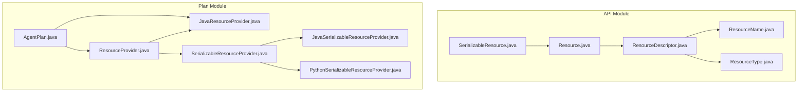
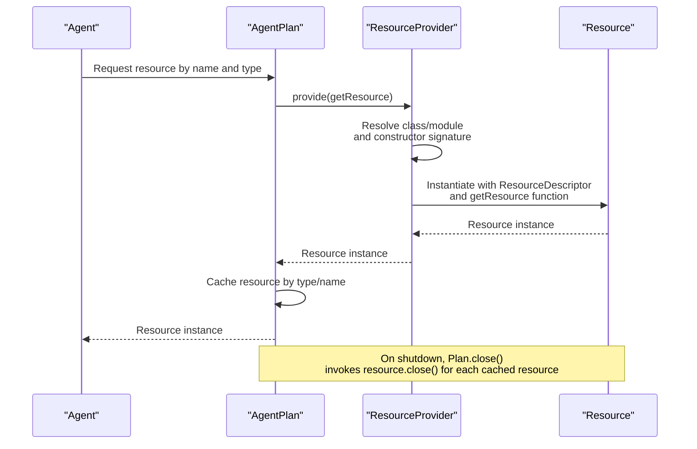
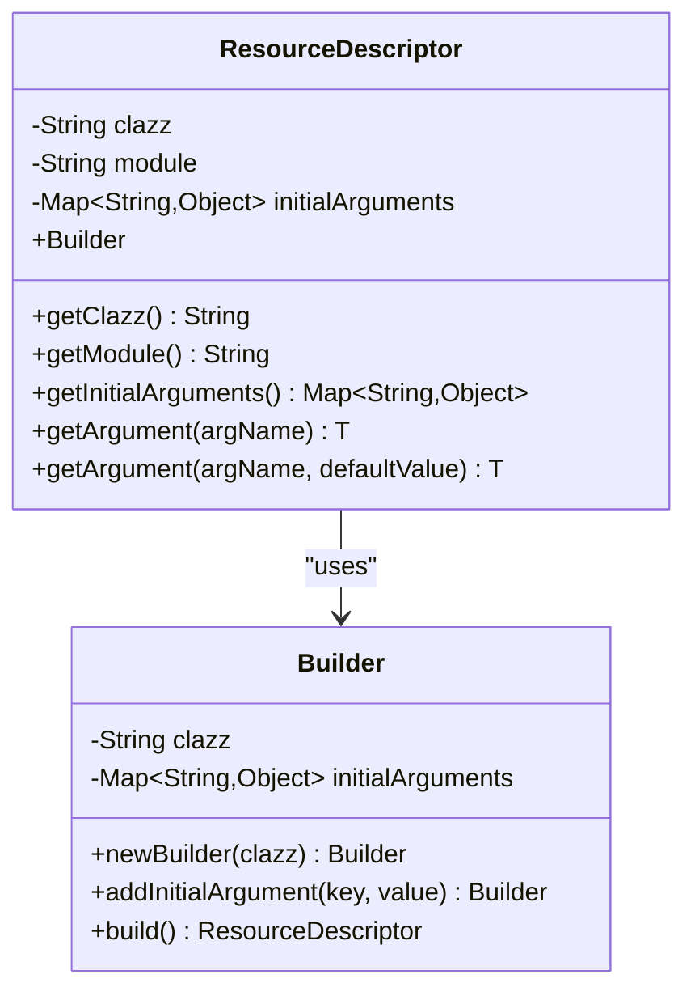
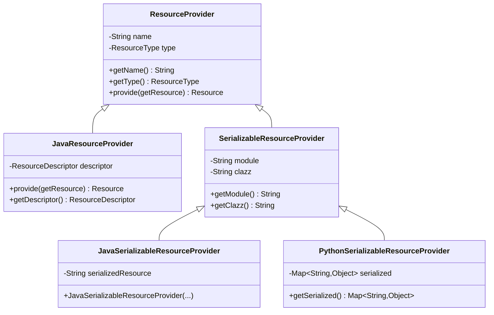
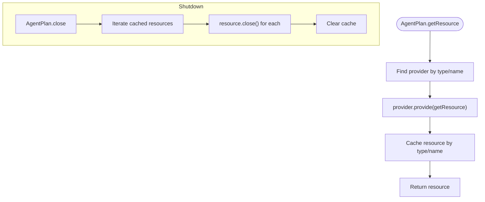
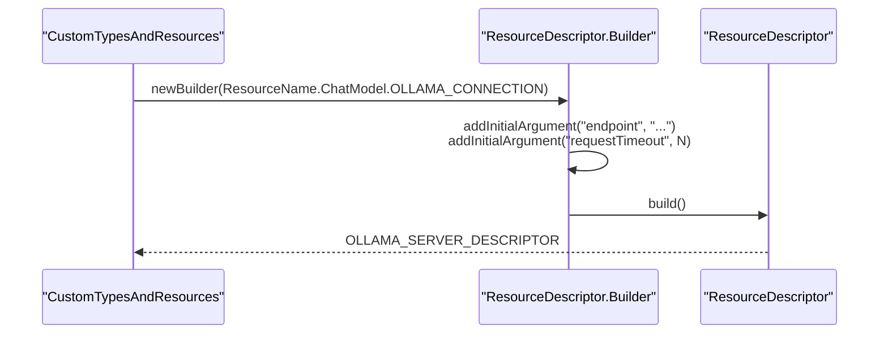
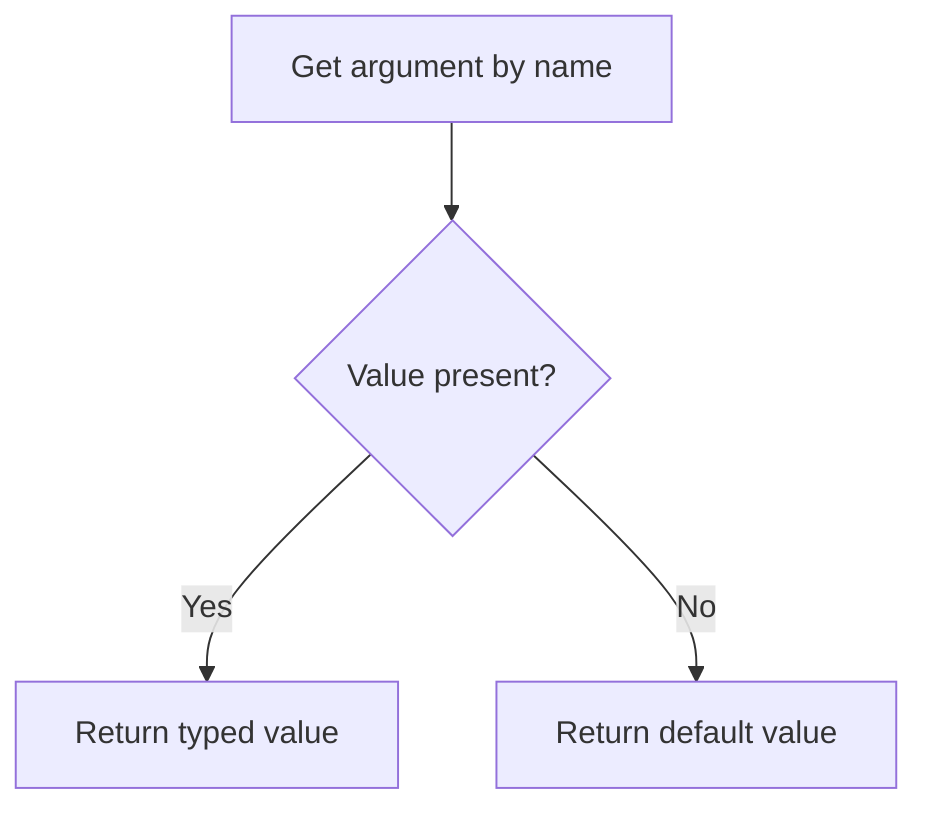
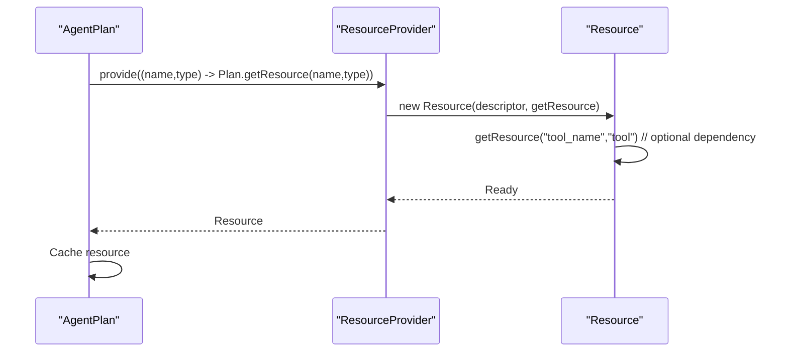
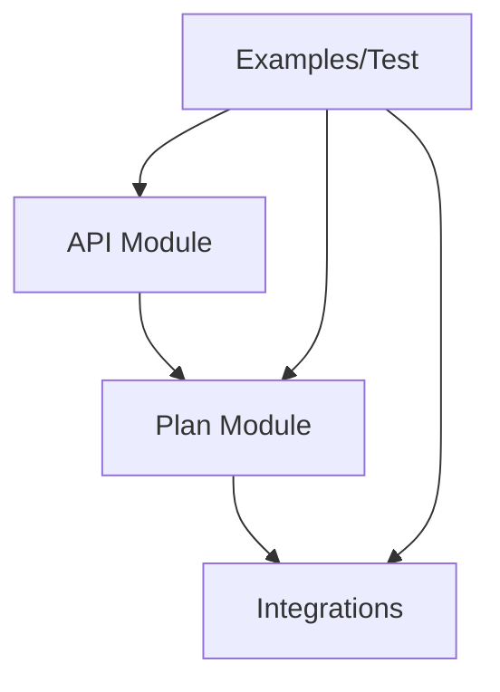

# Resource Descriptor System

<cite>
**Referenced Files in This Document**
- [Resource.java](file://api/src/main/java/org/apache/flink/agents/api/resource/Resource.java)
- [ResourceDescriptor.java](file://api/src/main/java/org/apache/flink/agents/api/resource/ResourceDescriptor.java)
- [ResourceName.java](file://api/src/main/java/org/apache/flink/agents/api/resource/ResourceName.java)
- [ResourceType.java](file://api/src/main/java/org/apache/flink/agents/api/resource/ResourceType.java)
- [SerializableResource.java](file://api/src/main/java/org/apache/flink/agents/api/resource/SerializableResource.java)
- [ResourceProvider.java](file://plan/src/main/java/org/apache/flink/agents/plan/resourceprovider/ResourceProvider.java)
- [JavaResourceProvider.java](file://plan/src/main/java/org/apache/flink/agents/plan/resourceprovider/JavaResourceProvider.java)
- [SerializableResourceProvider.java](file://plan/src/main/java/org/apache/flink/agents/plan/resourceprovider/SerializableResourceProvider.java)
- [JavaSerializableResourceProvider.java](file://plan/src/main/java/org/apache/flink/agents/plan/resourceprovider/JavaSerializableResourceProvider.java)
- [PythonSerializableResourceProvider.java](file://plan/src/main/java/org/apache/flink/agents/plan/resourceprovider/PythonSerializableResourceProvider.java)
- [AgentPlan.java](file://plan/src/main/java/org/apache/flink/agents/plan/AgentPlan.java)
- [ResourceDescriptorTest.java](file://api/src/test/java/org/apache/flink/agents/api/resource/ResourceDescriptorTest.java)
- [CustomTypesAndResources.java](file://examples/src/main/java/org/apache/flink/agents/examples/agents/CustomTypesAndResources.java)
- [OllamaChatModelConnection.java](file://integrations/chat-models/ollama/src/main/java/org/apache/flink/agents/integrations/chatmodels/ollama/OllamaChatModelConnection.java)
</cite>

## Table of Contents
1. [Introduction](#introduction)
2. [Project Structure](#project-structure)
3. [Core Components](#core-components)
4. [Architecture Overview](#architecture-overview)
5. [Detailed Component Analysis](#detailed-component-analysis)
6. [Dependency Analysis](#dependency-analysis)
7. [Performance Considerations](#performance-considerations)
8. [Troubleshooting Guide](#troubleshooting-guide)
9. [Conclusion](#conclusion)

## Introduction
This document explains the resource descriptor system that defines and manages resources in Flink Agents. It covers the ResourceDescriptor class structure, resource naming conventions, type definitions, configuration parameters, and the supporting infrastructure for resource lifecycle management. It also documents the ResourceName enumeration for supported resource types, the SerializableResource wrapper for persistent configurations, validation and type-safety mechanisms, and practical examples for creating descriptors and managing dependencies.

## Project Structure
The resource descriptor system spans the API module (resource definitions) and the Plan module (runtime provider and lifecycle management). The key files are organized as follows:
- API resource definitions: Resource, ResourceDescriptor, ResourceName, ResourceType, SerializableResource
- Plan resource providers: ResourceProvider, JavaResourceProvider, SerializableResourceProvider variants
- Runtime orchestration: AgentPlan for resource creation, caching, and cleanup
- Examples and tests: Demonstrations of descriptor usage and serialization validation

**Diagram sources**
- [Resource.java](file://api/src/main/java/org/apache/flink/agents/api/resource/Resource.java#L30-L71)
- [ResourceDescriptor.java](file://api/src/main/java/org/apache/flink/agents/api/resource/ResourceDescriptor.java#L29-L144)
- [ResourceName.java](file://api/src/main/java/org/apache/flink/agents/api/resource/ResourceName.java#L43-L185)
- [ResourceType.java](file://api/src/main/java/org/apache/flink/agents/api/resource/ResourceType.java#L26-L62)
- [SerializableResource.java](file://api/src/main/java/org/apache/flink/agents/api/resource/SerializableResource.java#L30-L50)
- [ResourceProvider.java](file://plan/src/main/java/org/apache/flink/agents/plan/resourceprovider/ResourceProvider.java#L38-L76)
- [JavaResourceProvider.java](file://plan/src/main/java/org/apache/flink/agents/plan/resourceprovider/JavaResourceProvider.java#L29-L56)
- [SerializableResourceProvider.java](file://plan/src/main/java/org/apache/flink/agents/plan/resourceprovider/SerializableResourceProvider.java#L35-L59)
- [JavaSerializableResourceProvider.java](file://plan/src/main/java/org/apache/flink/agents/plan/resourceprovider/JavaSerializableResourceProvider.java#L36-L62)
- [PythonSerializableResourceProvider.java](file://plan/src/main/java/org/apache/flink/agents/plan/resourceprovider/PythonSerializableResourceProvider.java#L37-L68)
- [AgentPlan.java](file://plan/src/main/java/org/apache/flink/agents/plan/AgentPlan.java#L240-L286)

**Section sources**
- [Resource.java](file://api/src/main/java/org/apache/flink/agents/api/resource/Resource.java#L25-L71)
- [ResourceDescriptor.java](file://api/src/main/java/org/apache/flink/agents/api/resource/ResourceDescriptor.java#L28-L144)
- [ResourceName.java](file://api/src/main/java/org/apache/flink/agents/api/resource/ResourceName.java#L21-L185)
- [ResourceType.java](file://api/src/main/java/org/apache/flink/agents/api/resource/ResourceType.java#L21-L62)
- [SerializableResource.java](file://api/src/main/java/org/apache/flink/agents/api/resource/SerializableResource.java#L25-L50)
- [ResourceProvider.java](file://plan/src/main/java/org/apache/flink/agents/plan/resourceprovider/ResourceProvider.java#L30-L76)
- [JavaResourceProvider.java](file://plan/src/main/java/org/apache/flink/agents/plan/resourceprovider/JavaResourceProvider.java#L28-L56)
- [SerializableResourceProvider.java](file://plan/src/main/java/org/apache/flink/agents/plan/resourceprovider/SerializableResourceProvider.java#L32-L59)
- [JavaSerializableResourceProvider.java](file://plan/src/main/java/org/apache/flink/agents/plan/resourceprovider/JavaSerializableResourceProvider.java#L30-L62)
- [PythonSerializableResourceProvider.java](file://plan/src/main/java/org/apache/flink/agents/plan/resourceprovider/PythonSerializableResourceProvider.java#L31-L68)
- [AgentPlan.java](file://plan/src/main/java/org/apache/flink/agents/plan/AgentPlan.java#L240-L286)

## Core Components
- Resource: Base abstract class for all resources, exposing resource type, metric binding, and lifecycle close hook.
- ResourceDescriptor: Immutable descriptor carrying class/module identifiers and initial arguments for resource instantiation.
- ResourceName: Enumeration-style class grouping fully-qualified class names for supported resource implementations (Java and Python).
- ResourceType: Enumerated resource categories (chat models, embeddings, vector stores, tools, prompts, MCP servers).
- SerializableResource: Abstract base for resources requiring persistence, with JSON serialization validation.
- ResourceProvider family: Providers that encapsulate resource metadata and create runtime instances.

Key capabilities:
- Cross-language compatibility: Java and Python resource classes are supported via module/class fields.
- Parameter binding: Initial arguments map enables typed configuration injection.
- Lifecycle management: AgentPlan caches and closes resources deterministically.
- Serialization: ResourceDescriptor and SerializableResource enforce JSON-safe configurations.

**Section sources**
- [Resource.java](file://api/src/main/java/org/apache/flink/agents/api/resource/Resource.java#L30-L71)
- [ResourceDescriptor.java](file://api/src/main/java/org/apache/flink/agents/api/resource/ResourceDescriptor.java#L29-L144)
- [ResourceName.java](file://api/src/main/java/org/apache/flink/agents/api/resource/ResourceName.java#L43-L185)
- [ResourceType.java](file://api/src/main/java/org/apache/flink/agents/api/resource/ResourceType.java#L26-L62)
- [SerializableResource.java](file://api/src/main/java/org/apache/flink/agents/api/resource/SerializableResource.java#L30-L50)
- [ResourceProvider.java](file://plan/src/main/java/org/apache/flink/agents/plan/resourceprovider/ResourceProvider.java#L38-L76)

## Architecture Overview
The resource system separates definition (API) from instantiation (Plan). Descriptors define what to instantiate; providers materialize them at runtime; AgentPlan orchestrates creation, caching, and cleanup.

**Diagram sources**
- [AgentPlan.java](file://plan/src/main/java/org/apache/flink/agents/plan/AgentPlan.java#L249-L264)
- [JavaResourceProvider.java](file://plan/src/main/java/org/apache/flink/agents/plan/resourceprovider/JavaResourceProvider.java#L37-L51)
- [Resource.java](file://api/src/main/java/org/apache/flink/agents/api/resource/Resource.java#L68-L70)

## Detailed Component Analysis

### ResourceDescriptor: Structure and Usage
ResourceDescriptor encapsulates:
- clazz: Fully qualified Java class name or simple Python class name
- module: Python module path when declaring Python resources from Java
- initialArguments: Map of typed configuration parameters

Builder pattern simplifies construction and argument addition. Arguments can be retrieved with generics and defaults.

Practical usage examples:
- Creating a chat model descriptor for Ollama with endpoint and timeout
- Building a tool descriptor with JSON schema-compatible parameters

**Diagram sources**
- [ResourceDescriptor.java](file://api/src/main/java/org/apache/flink/agents/api/resource/ResourceDescriptor.java#L29-L144)

**Section sources**
- [ResourceDescriptor.java](file://api/src/main/java/org/apache/flink/agents/api/resource/ResourceDescriptor.java#L43-L98)
- [ResourceDescriptorTest.java](file://api/src/test/java/org/apache/flink/agents/api/resource/ResourceDescriptorTest.java#L32-L54)
- [CustomTypesAndResources.java](file://examples/src/main/java/org/apache/flink/agents/examples/agents/CustomTypesAndResources.java#L112-L118)

### ResourceName: Supported Resource Types and Naming Conventions
ResourceName groups fully-qualified class names for supported implementations:
- ChatModel: Java and Python variants for Anthropic, Azure AI, Ollama, OpenAI, and Python wrappers
- EmbeddingModel: Java and Python variants for Ollama, OpenAI, and Python wrappers
- VectorStore: Java Elasticsearch and Python wrappers; Chroma for Python
- MCP: Placeholder indicating runtime selection of MCP server

Naming conventions:
- Java implementations: Full package path
- Python implementations: Python module path with simple class name

**Section sources**
- [ResourceName.java](file://api/src/main/java/org/apache/flink/agents/api/resource/ResourceName.java#L47-L185)

### ResourceType: Categorization and Validation
ResourceType enumerates supported categories:
- chat_model, chat_model_connection
- embedding_model, embedding_model_connection
- vector_store
- prompt
- tool
- mcp_server

Validation occurs via fromValue with IllegalArgumentException for unknown values.

**Section sources**
- [ResourceType.java](file://api/src/main/java/org/apache/flink/agents/api/resource/ResourceType.java#L26-L61)

### SerializableResource: Persistent Resource Configuration
SerializableResource extends Resource and adds JSON serialization validation. Resources must be serializable to support persistence and cross-language scenarios.

Validation mechanism:
- validateSerializable attempts JSON serialization and throws IllegalArgumentException on failure

**Section sources**
- [SerializableResource.java](file://api/src/main/java/org/apache/flink/agents/api/resource/SerializableResource.java#L30-L49)

### ResourceProvider Family: Creation and Cross-Language Support
ResourceProvider abstracts resource creation and is extended by:
- JavaResourceProvider: Instantiates Java classes using ResourceDescriptor and constructor signature
- SerializableResourceProvider variants: Carry module/class info and serialized forms for Java/Python resources

Cross-language compatibility:
- JavaResourceProvider resolves clazzName from descriptor.module or descriptor.clazz
- For Python resources declared from Java, initialArguments contains a java_clazz entry

**Diagram sources**
- [ResourceProvider.java](file://plan/src/main/java/org/apache/flink/agents/plan/resourceprovider/ResourceProvider.java#L38-L76)
- [JavaResourceProvider.java](file://plan/src/main/java/org/apache/flink/agents/plan/resourceprovider/JavaResourceProvider.java#L29-L56)
- [SerializableResourceProvider.java](file://plan/src/main/java/org/apache/flink/agents/plan/resourceprovider/SerializableResourceProvider.java#L35-L59)
- [JavaSerializableResourceProvider.java](file://plan/src/main/java/org/apache/flink/agents/plan/resourceprovider/JavaSerializableResourceProvider.java#L36-L62)
- [PythonSerializableResourceProvider.java](file://plan/src/main/java/org/apache/flink/agents/plan/resourceprovider/PythonSerializableResourceProvider.java#L37-L68)

**Section sources**
- [JavaResourceProvider.java](file://plan/src/main/java/org/apache/flink/agents/plan/resourceprovider/JavaResourceProvider.java#L37-L51)
- [SerializableResourceProvider.java](file://plan/src/main/java/org/apache/flink/agents/plan/resourceprovider/SerializableResourceProvider.java#L47-L58)
- [JavaSerializableResourceProvider.java](file://plan/src/main/java/org/apache/flink/agents/plan/resourceprovider/JavaSerializableResourceProvider.java#L42-L62)
- [PythonSerializableResourceProvider.java](file://plan/src/main/java/org/apache/flink/agents/plan/resourceprovider/PythonSerializableResourceProvider.java#L41-L68)

### AgentPlan: Resource Lifecycle Orchestration
AgentPlan coordinates resource creation, caching, and cleanup:
- Creation: Uses ResourceProvider.provide with a getResource helper to resolve dependencies
- Caching: Stores resources in a type/name map for reuse
- Cleanup: Iterates cached resources and invokes close()

**Diagram sources**
- [AgentPlan.java](file://plan/src/main/java/org/apache/flink/agents/plan/AgentPlan.java#L249-L281)

**Section sources**
- [AgentPlan.java](file://plan/src/main/java/org/apache/flink/agents/plan/AgentPlan.java#L249-L264)
- [AgentPlan.java](file://plan/src/main/java/org/apache/flink/agents/plan/AgentPlan.java#L274-L281)

### Practical Examples: Creating ResourceDescriptor Instances
Examples demonstrate building descriptors for different resource types:
- Chat model connection (Ollama): endpoint and request timeout
- Tool parameters: JSON schema-compatible properties and required fields
- Serializable resources: validateSerializable for persistence

**Diagram sources**
- [CustomTypesAndResources.java](file://examples/src/main/java/org/apache/flink/agents/examples/agents/CustomTypesAndResources.java#L112-L118)
- [ResourceDescriptor.java](file://api/src/main/java/org/apache/flink/agents/api/resource/ResourceDescriptor.java#L121-L142)

**Section sources**
- [CustomTypesAndResources.java](file://examples/src/main/java/org/apache/flink/agents/examples/agents/CustomTypesAndResources.java#L112-L118)
- [ResourceDescriptorTest.java](file://api/src/test/java/org/apache/flink/agents/api/resource/ResourceDescriptorTest.java#L32-L54)

### Resource Validation and Type Safety
- ResourceDescriptor equality and hashing ensure stable identity for caching and lookup
- ResourceName centralizes class names to avoid magic strings and improve discoverability
- ResourceType.fromValue validates category membership at runtime
- SerializableResource.validateSerializable enforces JSON compatibility for persistence

**Diagram sources**
- [ResourceDescriptor.java](file://api/src/main/java/org/apache/flink/agents/api/resource/ResourceDescriptor.java#L90-L98)

**Section sources**
- [ResourceDescriptor.java](file://api/src/main/java/org/apache/flink/agents/api/resource/ResourceDescriptor.java#L100-L119)
- [ResourceName.java](file://api/src/main/java/org/apache/flink/agents/api/resource/ResourceName.java#L21-L42)
- [ResourceType.java](file://api/src/main/java/org/apache/flink/agents/api/resource/ResourceType.java#L53-L61)
- [SerializableResource.java](file://api/src/main/java/org/apache/flink/agents/api/resource/SerializableResource.java#L40-L48)

### Resource Lifecycle Events and Dependency Resolution
Lifecycle:
- Creation: AgentPlan retrieves provider and instantiates resource
- Usage: Cached for subsequent requests
- Shutdown: AgentPlan.close invokes resource.close()

Dependency resolution:
- ResourceProvider.provide receives a getResource function enabling cross-resource references
- AgentPlan passes a lambda that delegates to its own getResource, preventing circular dependencies by leveraging the cache

**Diagram sources**
- [AgentPlan.java](file://plan/src/main/java/org/apache/flink/agents/plan/AgentPlan.java#L249-L264)
- [JavaResourceProvider.java](file://plan/src/main/java/org/apache/flink/agents/plan/resourceprovider/JavaResourceProvider.java#L37-L51)

**Section sources**
- [AgentPlan.java](file://plan/src/main/java/org/apache/flink/agents/plan/AgentPlan.java#L249-L264)
- [Resource.java](file://api/src/main/java/org/apache/flink/agents/api/resource/Resource.java#L68-L70)

## Dependency Analysis
The system exhibits low coupling and high cohesion:
- API module defines contracts and descriptors
- Plan module implements providers and lifecycle
- Integrations provide concrete implementations for specific vendors
- Examples and tests validate behavior

**Diagram sources**
- [Resource.java](file://api/src/main/java/org/apache/flink/agents/api/resource/Resource.java#L25-L71)
- [ResourceProvider.java](file://plan/src/main/java/org/apache/flink/agents/plan/resourceprovider/ResourceProvider.java#L30-L76)
- [OllamaChatModelConnection.java](file://integrations/chat-models/ollama/src/main/java/org/apache/flink/agents/integrations/chatmodels/ollama/OllamaChatModelConnection.java#L62-L100)

**Section sources**
- [Resource.java](file://api/src/main/java/org/apache/flink/agents/api/resource/Resource.java#L25-L71)
- [ResourceProvider.java](file://plan/src/main/java/org/apache/flink/agents/plan/resourceprovider/ResourceProvider.java#L30-L76)
- [OllamaChatModelConnection.java](file://integrations/chat-models/ollama/src/main/java/org/apache/flink/agents/integrations/chatmodels/ollama/OllamaChatModelConnection.java#L62-L100)

## Performance Considerations
- Caching: AgentPlan caches resources by type and name to avoid repeated instantiation
- Lazy instantiation: Resources are created only when requested
- Minimal reflection overhead: Providers resolve classes once per resource type
- Serialization cost: validateSerializable performs JSON serialization; keep descriptors minimal and JSON-safe

## Troubleshooting Guide
Common issues and resolutions:
- Unknown ResourceType: Ensure the value matches one of the enumerated values; otherwise fromValue throws an exception
- Non-serializable resource: validateSerializable fails if the resource contains non-JSON-serializable fields
- Missing endpoint or invalid configuration: Resource constructors validate required parameters (e.g., endpoint for chat models)
- Circular dependencies: AgentPlan prevents cycles by resolving dependencies via cached instances

**Section sources**
- [ResourceType.java](file://api/src/main/java/org/apache/flink/agents/api/resource/ResourceType.java#L53-L61)
- [SerializableResource.java](file://api/src/main/java/org/apache/flink/agents/api/resource/SerializableResource.java#L40-L48)
- [OllamaChatModelConnection.java](file://integrations/chat-models/ollama/src/main/java/org/apache/flink/agents/integrations/chatmodels/ollama/OllamaChatModelConnection.java#L73-L84)
- [AgentPlan.java](file://plan/src/main/java/org/apache/flink/agents/plan/AgentPlan.java#L249-L264)

## Conclusion
The resource descriptor system provides a robust, type-safe, and cross-language framework for defining, configuring, and managing resources in Flink Agents. ResourceDescriptor offers flexible parameter binding, ResourceName consolidates implementation references, ResourceType ensures categorization, and SerializableResource guarantees persistence. The provider and lifecycle orchestration in the Plan module enable reliable resource creation, caching, and cleanup, while validation mechanisms maintain correctness and reliability.