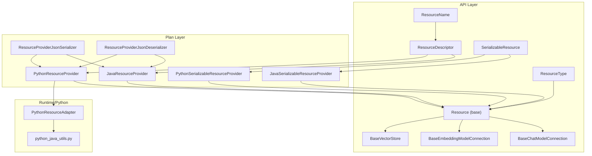
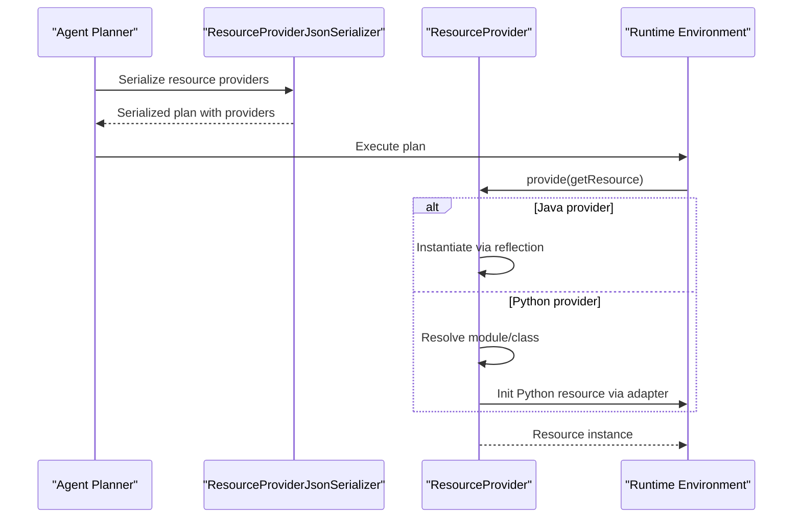
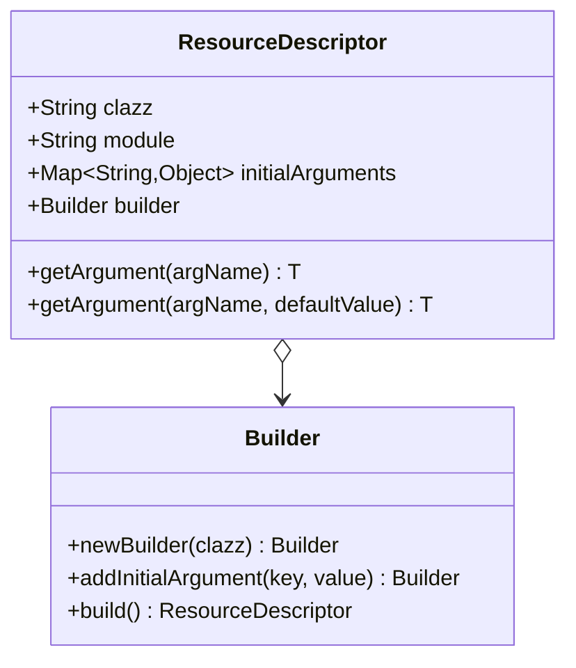
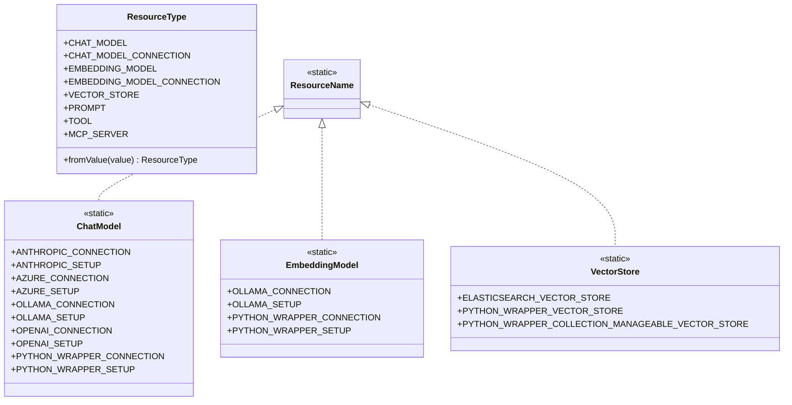
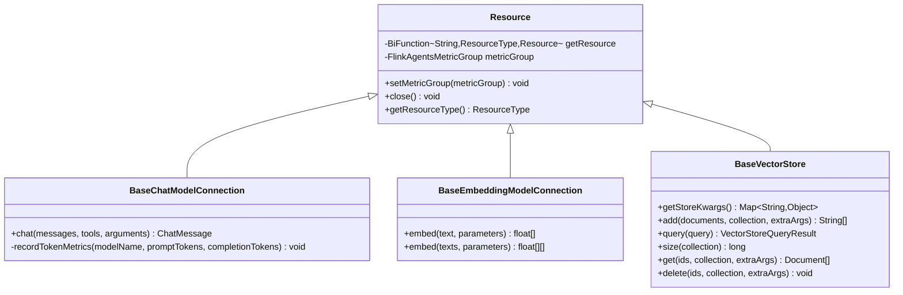
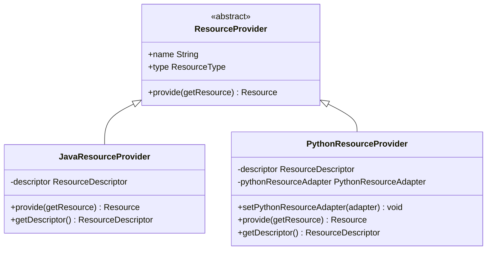
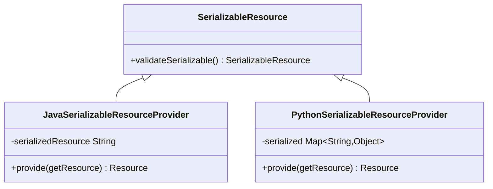
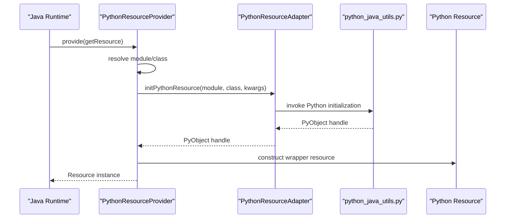
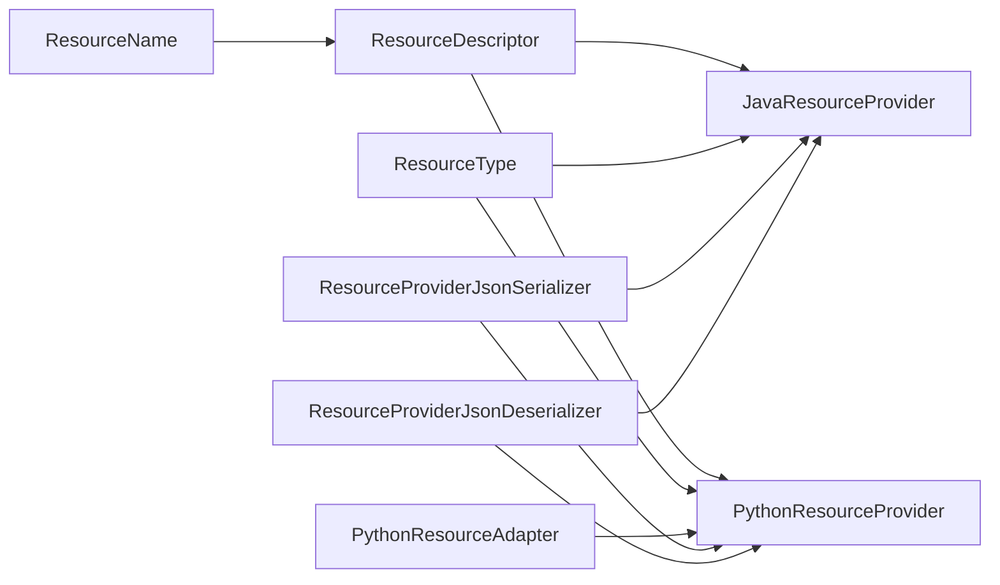

# Resource Management

<cite>
**Referenced Files in This Document**
- [ResourceDescriptor.java](file://api/src/main/java/org/apache/flink/agents/api/resource/ResourceDescriptor.java)
- [Resource.java](file://api/src/main/java/org/apache/flink/agents/api/resource/Resource.java)
- [ResourceName.java](file://api/src/main/java/org/apache/flink/agents/api/resource/ResourceName.java)
- [ResourceType.java](file://api/src/main/java/org/apache/flink/agents/api/resource/ResourceType.java)
- [SerializableResource.java](file://api/src/main/java/org/apache/flink/agents/api/resource/SerializableResource.java)
- [JavaResourceProvider.java](file://plan/src/main/java/org/apache/flink/agents/plan/resourceprovider/JavaResourceProvider.java)
- [PythonResourceProvider.java](file://plan/src/main/java/org/apache/flink/agents/plan/resourceprovider/PythonResourceProvider.java)
- [JavaSerializableResourceProvider.java](file://plan/src/main/java/org/apache/flink/agents/plan/resourceprovider/JavaSerializableResourceProvider.java)
- [PythonSerializableResourceProvider.java](file://plan/src/main/java/org/apache/flink/agents/plan/resourceprovider/PythonSerializableResourceProvider.java)
- [BaseChatModelConnection.java](file://api/src/main/java/org/apache/flink/agents/api/chat/model/BaseChatModelConnection.java)
- [BaseEmbeddingModelConnection.java](file://api/src/main/java/org/apache/flink/agents/api/embedding/model/BaseEmbeddingModelConnection.java)
- [BaseVectorStore.java](file://api/src/main/java/org/apache/flink/agents/api/vectorstores/BaseVectorStore.java)
- [ResourceProviderJsonSerializer.java](file://plan/src/main/java/org/apache/flink/agents/plan/serializer/ResourceProviderJsonSerializer.java)
- [ResourceProviderJsonDeserializer.java](file://plan/src/main/java/org/apache/flink/agents/plan/serializer/ResourceProviderJsonDeserializer.java)
- [PythonResourceAdapter.java](file://api/src/main/java/org/apache/flink/agents/api/resource/python/PythonResourceAdapter.java)
- [python_java_utils.py](file://python/flink_agents/runtime/python_java_utils.py)
- [ChatModelCrossLanguageTest.java](file://e2e-test/flink-agents-end-to-end-tests-resource-cross-language/src/test/java/org/apache/flink/agents/resource/test/ChatModelCrossLanguageTest.java)
- [EmbeddingCrossLanguageTest.java](file://e2e-test/flink-agents-end-to-end-tests-resource-cross-language/src/test/java/org/apache/flink/agents/resource/test/EmbeddingCrossLanguageTest.java)
- [VectorStoreCrossLanguageTest.java](file://e2e-test/flink-agents-end-to-end-tests-resource-cross-language/src/test/java/org/apache/flink/agents/resource/test/VectorStoreCrossLanguageTest.java)
- [MCPCrossLanguageTest.java](file://e2e-test/flink-agents-end-to-end-tests-resource-cross-language/src/test/java/org/apache/flink/agents/resource/test/MCPCrossLanguageTest.java)
</cite>

## Table of Contents
1. [Introduction](#introduction)
2. [Project Structure](#project-structure)
3. [Core Components](#core-components)
4. [Architecture Overview](#architecture-overview)
5. [Detailed Component Analysis](#detailed-component-analysis)
6. [Dependency Analysis](#dependency-analysis)
7. [Performance Considerations](#performance-considerations)
8. [Troubleshooting Guide](#troubleshooting-guide)
9. [Conclusion](#conclusion)

## Introduction
This document explains resource management in Flink Agents, focusing on how external services are integrated via standardized interfaces. It covers the ResourceDescriptor system for defining and managing resources (chat models, tools, and vector stores), the resource provider architecture for Java and Python, cross-language resource sharing, lifecycle management, connection pooling, error handling, and how resources are discovered, validated, and accessed during agent planning and execution.

## Project Structure
Resource management spans the API surface for resource abstractions and the Plan layer for serialization and provider creation. Cross-language integration is enabled by adapters and serializers that bridge Java and Python worlds.

**Diagram sources**
- [ResourceDescriptor.java](file://api/src/main/java/org/apache/flink/agents/api/resource/ResourceDescriptor.java#L29-L143)
- [Resource.java](file://api/src/main/java/org/apache/flink/agents/api/resource/Resource.java#L30-L70)
- [ResourceName.java](file://api/src/main/java/org/apache/flink/agents/api/resource/ResourceName.java#L43-L184)
- [ResourceType.java](file://api/src/main/java/org/apache/flink/agents/api/resource/ResourceType.java#L26-L61)
- [SerializableResource.java](file://api/src/main/java/org/apache/flink/agents/api/resource/SerializableResource.java#L30-L49)
- [JavaResourceProvider.java](file://plan/src/main/java/org/apache/flink/agents/plan/resourceprovider/JavaResourceProvider.java#L28-L56)
- [PythonResourceProvider.java](file://plan/src/main/java/org/apache/flink/agents/plan/resourceprovider/PythonResourceProvider.java#L47-L148)
- [JavaSerializableResourceProvider.java](file://plan/src/main/java/org/apache/flink/agents/plan/resourceprovider/JavaSerializableResourceProvider.java#L36-L95)
- [PythonSerializableResourceProvider.java](file://plan/src/main/java/org/apache/flink/agents/plan/resourceprovider/PythonSerializableResourceProvider.java#L37-L109)
- [ResourceProviderJsonSerializer.java](file://plan/src/main/java/org/apache/flink/agents/plan/serializer/ResourceProviderJsonSerializer.java)
- [ResourceProviderJsonDeserializer.java](file://plan/src/main/java/org/apache/flink/agents/plan/serializer/ResourceProviderJsonDeserializer.java)
- [PythonResourceAdapter.java](file://api/src/main/java/org/apache/flink/agents/api/resource/python/PythonResourceAdapter.java)
- [python_java_utils.py](file://python/flink_agents/runtime/python_java_utils.py)

**Section sources**
- [ResourceDescriptor.java](file://api/src/main/java/org/apache/flink/agents/api/resource/ResourceDescriptor.java#L29-L143)
- [Resource.java](file://api/src/main/java/org/apache/flink/agents/api/resource/Resource.java#L30-L70)
- [ResourceName.java](file://api/src/main/java/org/apache/flink/agents/api/resource/ResourceName.java#L43-L184)
- [ResourceType.java](file://api/src/main/java/org/apache/flink/agents/api/resource/ResourceType.java#L26-L61)
- [SerializableResource.java](file://api/src/main/java/org/apache/flink/agents/api/resource/SerializableResource.java#L30-L49)
- [JavaResourceProvider.java](file://plan/src/main/java/org/apache/flink/agents/plan/resourceprovider/JavaResourceProvider.java#L28-L56)
- [PythonResourceProvider.java](file://plan/src/main/java/org/apache/flink/agents/plan/resourceprovider/PythonResourceProvider.java#L47-L148)
- [JavaSerializableResourceProvider.java](file://plan/src/main/java/org/apache/flink/agents/plan/resourceprovider/JavaSerializableResourceProvider.java#L36-L95)
- [PythonSerializableResourceProvider.java](file://plan/src/main/java/org/apache/flink/agents/plan/resourceprovider/PythonSerializableResourceProvider.java#L37-L109)
- [ResourceProviderJsonSerializer.java](file://plan/src/main/java/org/apache/flink/agents/plan/serializer/ResourceProviderJsonSerializer.java)
- [ResourceProviderJsonDeserializer.java](file://plan/src/main/java/org/apache/flink/agents/plan/serializer/ResourceProviderJsonDeserializer.java)
- [PythonResourceAdapter.java](file://api/src/main/java/org/apache/flink/agents/api/resource/python/PythonResourceAdapter.java)
- [python_java_utils.py](file://python/flink_agents/runtime/python_java_utils.py)

## Core Components
- ResourceDescriptor: Describes a resource with class/module identifiers and initial arguments, enabling cross-language compatibility.
- Resource: Base abstraction for all resources with lifecycle hooks and metrics binding.
- ResourceType: Enumerates supported resource categories (chat model/connection, embedding model/connection, vector store, prompt, tool, MCP server).
- ResourceName: Hierarchical constants mapping logical resource kinds to Java/Python implementation class names.
- SerializableResource: Ensures resources are JSON serializable for transport and persistence.
- Resource Providers: Factory-like classes that instantiate resources at runtime from descriptors and serialized forms.

Key responsibilities:
- Define resource identity and configuration via ResourceDescriptor.
- Standardize resource types and discoverable names via ResourceType and ResourceName.
- Provide instantiation mechanisms for Java and Python resources.
- Support serialization/deserialization for cross-language transport.

**Section sources**
- [ResourceDescriptor.java](file://api/src/main/java/org/apache/flink/agents/api/resource/ResourceDescriptor.java#L29-L143)
- [Resource.java](file://api/src/main/java/org/apache/flink/agents/api/resource/Resource.java#L30-L70)
- [ResourceType.java](file://api/src/main/java/org/apache/flink/agents/api/resource/ResourceType.java#L26-L61)
- [ResourceName.java](file://api/src/main/java/org/apache/flink/agents/api/resource/ResourceName.java#L43-L184)
- [SerializableResource.java](file://api/src/main/java/org/apache/flink/agents/api/resource/SerializableResource.java#L30-L49)

## Architecture Overview
The resource management architecture separates concerns between:
- Definition: ResourceDescriptor and ResourceName define what a resource is and where to find it.
- Discovery: ResourceName maps logical kinds to concrete implementations.
- Instantiation: Resource providers construct runtime instances using reflection (Java) or Python adapter (Python).
- Serialization: Providers serialize/deserialize resources for plan transport and execution.

**Diagram sources**
- [ResourceProviderJsonSerializer.java](file://plan/src/main/java/org/apache/flink/agents/plan/serializer/ResourceProviderJsonSerializer.java)
- [JavaResourceProvider.java](file://plan/src/main/java/org/apache/flink/agents/plan/resourceprovider/JavaResourceProvider.java#L37-L51)
- [PythonResourceProvider.java](file://plan/src/main/java/org/apache/flink/agents/plan/resourceprovider/PythonResourceProvider.java#L76-L126)

## Detailed Component Analysis

### ResourceDescriptor System
ResourceDescriptor encapsulates:
- Target class name (fully qualified for Java; simple name for Python).
- Python module path for cross-language resolution.
- Initial arguments map for constructor parameters.

It supports:
- Cross-language compatibility by distinguishing Java vs Python descriptors.
- Builder pattern for ergonomic construction.
- Argument retrieval helpers with defaults.

**Diagram sources**
- [ResourceDescriptor.java](file://api/src/main/java/org/apache/flink/agents/api/resource/ResourceDescriptor.java#L29-L143)

**Section sources**
- [ResourceDescriptor.java](file://api/src/main/java/org/apache/flink/agents/api/resource/ResourceDescriptor.java#L29-L143)

### Resource Types and Names
ResourceType enumerates supported categories. ResourceName provides constants mapping logical kinds to implementation class names for both Java and Python.

**Diagram sources**
- [ResourceType.java](file://api/src/main/java/org/apache/flink/agents/api/resource/ResourceType.java#L26-L61)
- [ResourceName.java](file://api/src/main/java/org/apache/flink/agents/api/resource/ResourceName.java#L43-L184)

**Section sources**
- [ResourceType.java](file://api/src/main/java/org/apache/flink/agents/api/resource/ResourceType.java#L26-L61)
- [ResourceName.java](file://api/src/main/java/org/apache/flink/agents/api/resource/ResourceName.java#L43-L184)

### Resource Lifecycle and Metrics
Resource defines lifecycle hooks and metrics binding. Subclasses implement resource-type-specific behavior and can record metrics.

**Diagram sources**
- [Resource.java](file://api/src/main/java/org/apache/flink/agents/api/resource/Resource.java#L30-L70)
- [BaseChatModelConnection.java](file://api/src/main/java/org/apache/flink/agents/api/chat/model/BaseChatModelConnection.java#L38-L78)
- [BaseEmbeddingModelConnection.java](file://api/src/main/java/org/apache/flink/agents/api/embedding/model/BaseEmbeddingModelConnection.java#L45-L83)
- [BaseVectorStore.java](file://api/src/main/java/org/apache/flink/agents/api/vectorstores/BaseVectorStore.java#L38-L173)

**Section sources**
- [Resource.java](file://api/src/main/java/org/apache/flink/agents/api/resource/Resource.java#L30-L70)
- [BaseChatModelConnection.java](file://api/src/main/java/org/apache/flink/agents/api/chat/model/BaseChatModelConnection.java#L38-L78)
- [BaseEmbeddingModelConnection.java](file://api/src/main/java/org/apache/flink/agents/api/embedding/model/BaseEmbeddingModelConnection.java#L45-L83)
- [BaseVectorStore.java](file://api/src/main/java/org/apache/flink/agents/api/vectorstores/BaseVectorStore.java#L38-L173)

### Resource Providers: Java and Python
JavaResourceProvider constructs resources via reflection using the descriptor’s class name and loader context. It expects constructors accepting ResourceDescriptor and a resource lookup function.

PythonResourceProvider carries module/class metadata and uses a PythonResourceAdapter to initialize Python-side resources. It maps resource types to adapter classes and supports dynamic resolution of Python module/class from kwargs if not provided directly.

**Diagram sources**
- [JavaResourceProvider.java](file://plan/src/main/java/org/apache/flink/agents/plan/resourceprovider/JavaResourceProvider.java#L28-L56)
- [PythonResourceProvider.java](file://plan/src/main/java/org/apache/flink/agents/plan/resourceprovider/PythonResourceProvider.java#L47-L148)

**Section sources**
- [JavaResourceProvider.java](file://plan/src/main/java/org/apache/flink/agents/plan/resourceprovider/JavaResourceProvider.java#L28-L56)
- [PythonResourceProvider.java](file://plan/src/main/java/org/apache/flink/agents/plan/resourceprovider/PythonResourceProvider.java#L47-L148)

### Serializable Resources and Cross-Language Transport
SerializableResource validates that resources are JSON serializable. JavaSerializableResourceProvider stores a serialized representation and deserializes on demand. PythonSerializableResourceProvider carries a serialized map and reconstructs Python-native resources (prompt/tool) at runtime.

**Diagram sources**
- [SerializableResource.java](file://api/src/main/java/org/apache/flink/agents/api/resource/SerializableResource.java#L30-L49)
- [JavaSerializableResourceProvider.java](file://plan/src/main/java/org/apache/flink/agents/plan/resourceprovider/JavaSerializableResourceProvider.java#L36-L95)
- [PythonSerializableResourceProvider.java](file://plan/src/main/java/org/apache/flink/agents/plan/resourceprovider/PythonSerializableResourceProvider.java#L37-L109)

**Section sources**
- [SerializableResource.java](file://api/src/main/java/org/apache/flink/agents/api/resource/SerializableResource.java#L30-L49)
- [JavaSerializableResourceProvider.java](file://plan/src/main/java/org/apache/flink/agents/plan/resourceprovider/JavaSerializableResourceProvider.java#L36-L95)
- [PythonSerializableResourceProvider.java](file://plan/src/main/java/org/apache/flink/agents/plan/resourceprovider/PythonSerializableResourceProvider.java#L37-L109)

### Cross-Language Resource Sharing
Cross-language sharing is achieved via:
- PythonResourceAdapter: A bridge interface to initialize Python resources from Java.
- python_java_utils.py: Utilities for invoking Python code from Java.
- PythonResourceProvider: Resolves Python module/class and initializes via adapter.
- ResourceName: Provides Python-side class names for chat models, embedding models, and vector stores.

**Diagram sources**
- [PythonResourceProvider.java](file://plan/src/main/java/org/apache/flink/agents/plan/resourceprovider/PythonResourceProvider.java#L76-L126)
- [PythonResourceAdapter.java](file://api/src/main/java/org/apache/flink/agents/api/resource/python/PythonResourceAdapter.java)
- [python_java_utils.py](file://python/flink_agents/runtime/python_java_utils.py)

**Section sources**
- [PythonResourceProvider.java](file://plan/src/main/java/org/apache/flink/agents/plan/resourceprovider/PythonResourceProvider.java#L47-L148)
- [PythonResourceAdapter.java](file://api/src/main/java/org/apache/flink/agents/api/resource/python/PythonResourceAdapter.java)
- [python_java_utils.py](file://python/flink_agents/runtime/python_java_utils.py)

### Practical Examples: Registering Resources and Configuring Providers
- Define a ResourceDescriptor with target class/module and initial arguments.
- Choose ResourceName constants to select Java or Python implementations.
- Register resources via the execution environment or planner; providers will instantiate them at runtime.
- For Python resources, ensure the adapter is configured and reachable.

Examples of cross-language tests demonstrate registration and usage patterns for chat models, embedding models, vector stores, and MCP servers.

**Section sources**
- [ResourceDescriptor.java](file://api/src/main/java/org/apache/flink/agents/api/resource/ResourceDescriptor.java#L29-L143)
- [ResourceName.java](file://api/src/main/java/org/apache/flink/agents/api/resource/ResourceName.java#L43-L184)
- [ChatModelCrossLanguageTest.java](file://e2e-test/flink-agents-end-to-end-tests-resource-cross-language/src/test/java/org/apache/flink/agents/resource/test/ChatModelCrossLanguageTest.java)
- [EmbeddingCrossLanguageTest.java](file://e2e-test/flink-agents-end-to-end-tests-resource-cross-language/src/test/java/org/apache/flink/agents/resource/test/EmbeddingCrossLanguageTest.java)
- [VectorStoreCrossLanguageTest.java](file://e2e-test/flink-agents-end-to-end-tests-resource-cross-language/src/test/java/org/apache/flink/agents/resource/test/VectorStoreCrossLanguageTest.java)
- [MCPCrossLanguageTest.java](file://e2e-test/flink-agents-end-to-end-tests-resource-cross-language/src/test/java/org/apache/flink/agents/resource/test/MCPCrossLanguageTest.java)

## Dependency Analysis
Resource providers depend on:
- ResourceDescriptor for identity and configuration.
- ResourceName for implementation selection.
- ResourceType for categorization.
- PythonResourceAdapter for Python resource initialization.
- Serializers for plan transport.

**Diagram sources**
- [ResourceDescriptor.java](file://api/src/main/java/org/apache/flink/agents/api/resource/ResourceDescriptor.java#L29-L143)
- [ResourceName.java](file://api/src/main/java/org/apache/flink/agents/api/resource/ResourceName.java#L43-L184)
- [ResourceType.java](file://api/src/main/java/org/apache/flink/agents/api/resource/ResourceType.java#L26-L61)
- [JavaResourceProvider.java](file://plan/src/main/java/org/apache/flink/agents/plan/resourceprovider/JavaResourceProvider.java#L28-L56)
- [PythonResourceProvider.java](file://plan/src/main/java/org/apache/flink/agents/plan/resourceprovider/PythonResourceProvider.java#L47-L148)
- [PythonResourceAdapter.java](file://api/src/main/java/org/apache/flink/agents/api/resource/python/PythonResourceAdapter.java)
- [ResourceProviderJsonSerializer.java](file://plan/src/main/java/org/apache/flink/agents/plan/serializer/ResourceProviderJsonSerializer.java)
- [ResourceProviderJsonDeserializer.java](file://plan/src/main/java/org/apache/flink/agents/plan/serializer/ResourceProviderJsonDeserializer.java)

**Section sources**
- [JavaResourceProvider.java](file://plan/src/main/java/org/apache/flink/agents/plan/resourceprovider/JavaResourceProvider.java#L28-L56)
- [PythonResourceProvider.java](file://plan/src/main/java/org/apache/flink/agents/plan/resourceprovider/PythonResourceProvider.java#L47-L148)
- [ResourceProviderJsonSerializer.java](file://plan/src/main/java/org/apache/flink/agents/plan/serializer/ResourceProviderJsonSerializer.java)
- [ResourceProviderJsonDeserializer.java](file://plan/src/main/java/org/apache/flink/agents/plan/serializer/ResourceProviderJsonDeserializer.java)

## Performance Considerations
- Connection pooling: Integrate with underlying service clients to reuse connections and reduce latency.
- Batch operations: For embedding and vector store operations, batch requests where supported to improve throughput.
- Serialization overhead: Prefer JavaSerializableResourceProvider for Java resources to avoid repeated reflection costs; cache deserialized instances when safe.
- Lazy initialization: Defer expensive initialization until first use; leverage provide() to manage lifetimes.
- Metrics instrumentation: Use built-in token metrics recording for chat models to monitor usage and costs.

[No sources needed since this section provides general guidance]

## Troubleshooting Guide
Common issues and resolutions:
- Unknown resource type: Ensure ResourceType matches supported values; use fromValue() safely.
- Missing Python adapter: PythonResourceProvider requires a configured adapter; set it before provide().
- Invalid Python class format: Ensure pythonClazz is in module.ClassName format when module is not provided.
- Serialization failures: Validate resources with validateSerializable(); inspect ObjectMapper exceptions.
- Reflection errors: Verify class names and constructors accept (ResourceDescriptor, BiFunction).

**Section sources**
- [ResourceType.java](file://api/src/main/java/org/apache/flink/agents/api/resource/ResourceType.java#L53-L60)
- [PythonResourceProvider.java](file://plan/src/main/java/org/apache/flink/agents/plan/resourceprovider/PythonResourceProvider.java#L76-L126)
- [SerializableResource.java](file://api/src/main/java/org/apache/flink/agents/api/resource/SerializableResource.java#L40-L48)
- [JavaResourceProvider.java](file://plan/src/main/java/org/apache/flink/agents/plan/resourceprovider/JavaResourceProvider.java#L37-L51)

## Conclusion
Flink Agents resource management provides a robust, extensible framework for integrating external services across Java and Python. ResourceDescriptor and ResourceName standardize definition and discovery, while resource providers enable flexible instantiation and serialization. The system supports lifecycle management, metrics, and cross-language interoperability, enabling efficient agent planning and execution with chat models, embedding models, vector stores, tools, and prompts.