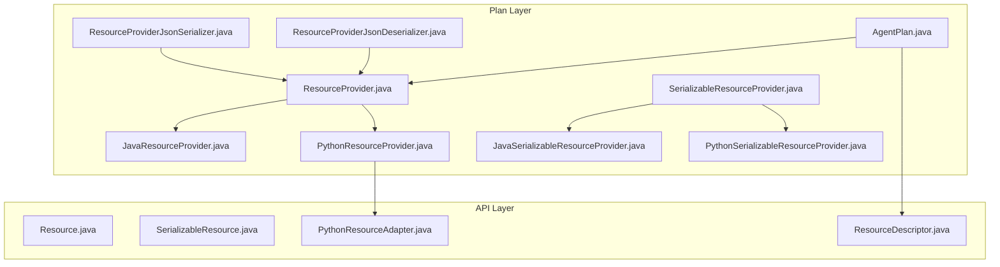
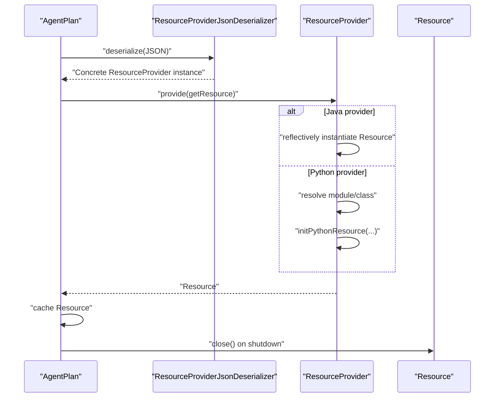
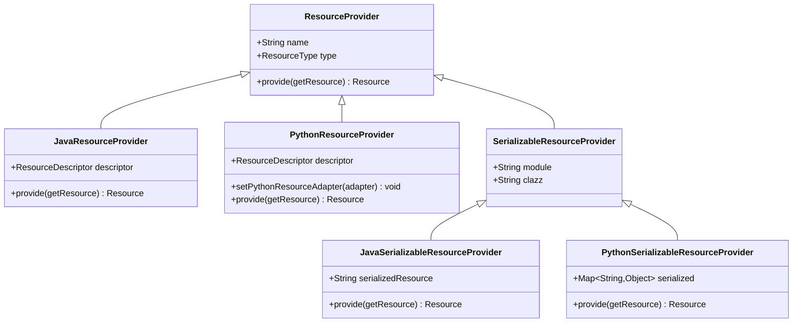
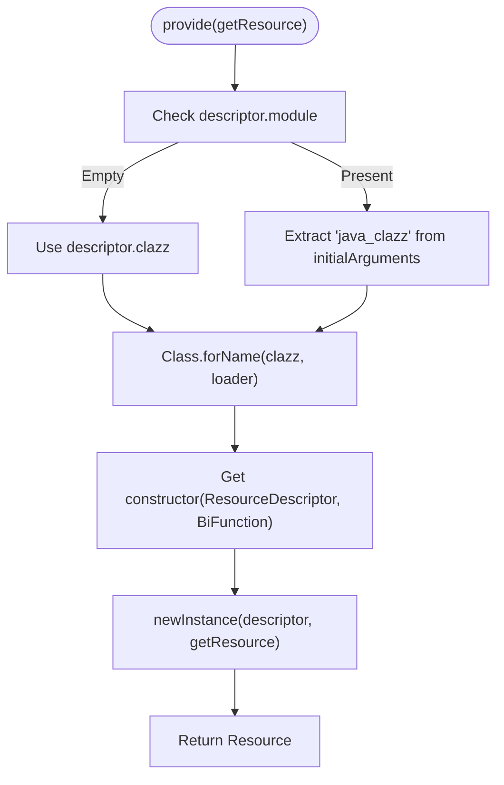
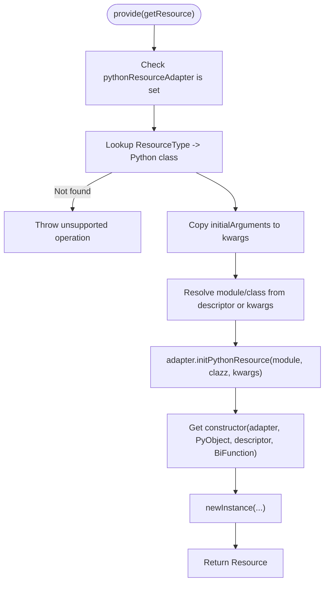
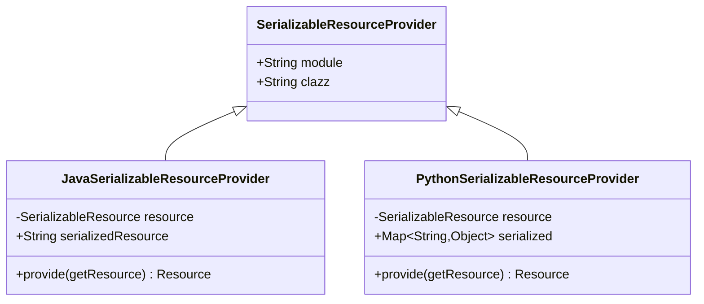
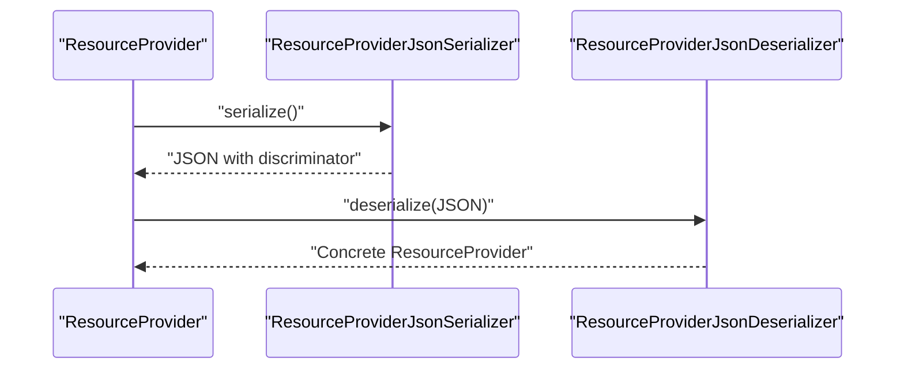
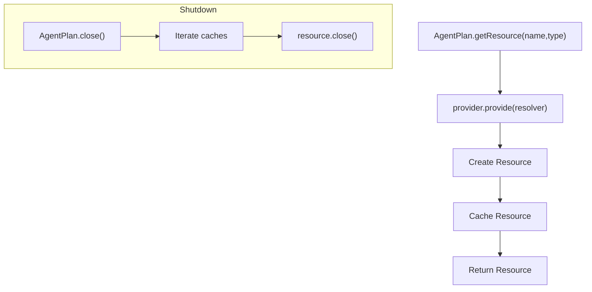
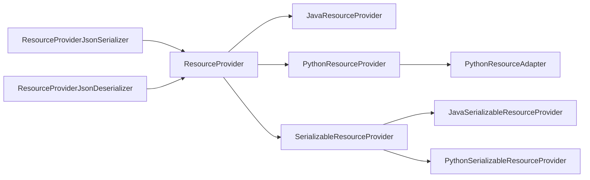

# Resource Provider Architecture

<cite>
**Referenced Files in This Document**
- [ResourceProvider.java](file://plan/src/main/java/org/apache/flink/agents/plan/resourceprovider/ResourceProvider.java)
- [JavaResourceProvider.java](file://plan/src/main/java/org/apache/flink/agents/plan/resourceprovider/JavaResourceProvider.java)
- [PythonResourceProvider.java](file://plan/src/main/java/org/apache/flink/agents/plan/resourceprovider/PythonResourceProvider.java)
- [SerializableResourceProvider.java](file://plan/src/main/java/org/apache/flink/agents/plan/resourceprovider/SerializableResourceProvider.java)
- [JavaSerializableResourceProvider.java](file://plan/src/main/java/org/apache/flink/agents/plan/resourceprovider/JavaSerializableResourceProvider.java)
- [PythonSerializableResourceProvider.java](file://plan/src/main/java/org/apache/flink/agents/plan/resourceprovider/PythonSerializableResourceProvider.java)
- [ResourceProviderJsonSerializer.java](file://plan/src/main/java/org/apache/flink/agents/plan/serializer/ResourceProviderJsonSerializer.java)
- [ResourceProviderJsonDeserializer.java](file://plan/src/main/java/org/apache/flink/agents/plan/serializer/ResourceProviderJsonDeserializer.java)
- [Resource.java](file://api/src/main/java/org/apache/flink/agents/api/resource/Resource.java)
- [SerializableResource.java](file://api/src/main/java/org/apache/flink/agents/api/resource/SerializableResource.java)
- [ResourceDescriptor.java](file://api/src/main/java/org/apache/flink/agents/api/resource/ResourceDescriptor.java)
- [PythonResourceAdapter.java](file://api/src/main/java/org/apache/flink/agents/api/resource/python/PythonResourceAdapter.java)
- [AgentPlan.java](file://plan/src/main/java/org/apache/flink/agents/plan/AgentPlan.java)
- [CustomTypesAndResources.java](file://examples/src/main/java/org/apache/flink/agents/examples/agents/CustomTypesAndResources.java)
</cite>

## Table of Contents
1. [Introduction](#introduction)
2. [Project Structure](#project-structure)
3. [Core Components](#core-components)
4. [Architecture Overview](#architecture-overview)
5. [Detailed Component Analysis](#detailed-component-analysis)
6. [Dependency Analysis](#dependency-analysis)
7. [Performance Considerations](#performance-considerations)
8. [Troubleshooting Guide](#troubleshooting-guide)
9. [Conclusion](#conclusion)

## Introduction
This document explains the resource provider architecture in Flink Agents, focusing on how the system enables cross-language resource integration between Java and Python environments. It covers the abstract ResourceProvider interface, its implementations for Java and Python, the SerializableResourceProvider family for persistent configurations, and the factory-like discovery and instantiation mechanism used at runtime. Practical guidance is included for implementing custom resource providers and integrating them into the agent execution environment, along with validation, error handling, and performance optimization strategies.

## Project Structure
The resource provider architecture spans two primary packages:
- plan/resourceprovider: Defines the provider abstractions and concrete implementations for Java and Python, plus serializable variants.
- plan/serializer: Provides Jackson-based JSON serialization/deserialization for resource providers.
- api/resource: Defines the Resource base class, serializable resource base, and descriptors used by providers.
- api/resource/python: Defines the PythonResourceAdapter interface that bridges Java and Python interoperability.
- plan/AgentPlan: Orchestrates resource discovery and instantiation during agent execution.

**Diagram sources**
- [ResourceProvider.java](file://plan/src/main/java/org/apache/flink/agents/plan/resourceprovider/ResourceProvider.java#L38-L75)
- [JavaResourceProvider.java](file://plan/src/main/java/org/apache/flink/agents/plan/resourceprovider/JavaResourceProvider.java#L29-L56)
- [PythonResourceProvider.java](file://plan/src/main/java/org/apache/flink/agents/plan/resourceprovider/PythonResourceProvider.java#L47-L126)
- [SerializableResourceProvider.java](file://plan/src/main/java/org/apache/flink/agents/plan/resourceprovider/SerializableResourceProvider.java#L30-L59)
- [JavaSerializableResourceProvider.java](file://plan/src/main/java/org/apache/flink/agents/plan/resourceprovider/JavaSerializableResourceProvider.java#L36-L95)
- [PythonSerializableResourceProvider.java](file://plan/src/main/java/org/apache/flink/agents/plan/resourceprovider/PythonSerializableResourceProvider.java#L37-L110)
- [ResourceProviderJsonSerializer.java](file://plan/src/main/java/org/apache/flink/agents/plan/serializer/ResourceProviderJsonSerializer.java#L36-L121)
- [ResourceProviderJsonDeserializer.java](file://plan/src/main/java/org/apache/flink/agents/plan/serializer/ResourceProviderJsonDeserializer.java#L43-L124)
- [Resource.java](file://api/src/main/java/org/apache/flink/agents/api/resource/Resource.java#L30-L70)
- [SerializableResource.java](file://api/src/main/java/org/apache/flink/agents/api/resource/SerializableResource.java#L30-L49)
- [ResourceDescriptor.java](file://api/src/main/java/org/apache/flink/agents/api/resource/ResourceDescriptor.java#L74-L143)
- [PythonResourceAdapter.java](file://api/src/main/java/org/apache/flink/agents/api/resource/python/PythonResourceAdapter.java#L37-L141)
- [AgentPlan.java](file://plan/src/main/java/org/apache/flink/agents/plan/AgentPlan.java#L249-L281)

**Section sources**
- [ResourceProvider.java](file://plan/src/main/java/org/apache/flink/agents/plan/resourceprovider/ResourceProvider.java#L30-L75)
- [Resource.java](file://api/src/main/java/org/apache/flink/agents/api/resource/Resource.java#L25-L70)
- [ResourceDescriptor.java](file://api/src/main/java/org/apache/flink/agents/api/resource/ResourceDescriptor.java#L74-L143)
- [PythonResourceAdapter.java](file://api/src/main/java/org/apache/flink/agents/api/resource/python/PythonResourceAdapter.java#L32-L141)
- [AgentPlan.java](file://plan/src/main/java/org/apache/flink/agents/plan/AgentPlan.java#L249-L281)

## Core Components
- ResourceProvider: Abstract base for all resource providers. Carries resource metadata and creates Resource instances at runtime via a BiFunction callback to resolve other resources.
- JavaResourceProvider: Instantiates Java Resource subclasses using reflection with a ResourceDescriptor and a resolver callback.
- PythonResourceProvider: Creates Python-backed resources via PythonResourceAdapter, mapping ResourceType to specific Python classes and handling module/class resolution.
- SerializableResourceProvider and its Java/Python variants: Encapsulate serializable resources either as JSON-serializable maps (Python) or JSON strings (Java) for durable configuration and cross-process transport.
- ResourceProviderJsonSerializer/Deserializer: Jackson-based serializers/deserializers that encode/decode provider instances with a discriminator field to support polymorphic handling.
- Resource and SerializableResource: Base classes for all resources, with validation helpers for serializability.

Key responsibilities:
- Lifecycle: ResourceProvider.create(...) constructs resources; Resource.close() tears them down.
- Serialization: Providers serialize/deserialize themselves and their contained resources for persistence and distribution.
- Interoperability: PythonResourceAdapter bridges Java and Python objects for cross-language resource creation and method invocation.

**Section sources**
- [ResourceProvider.java](file://plan/src/main/java/org/apache/flink/agents/plan/resourceprovider/ResourceProvider.java#L30-L75)
- [JavaResourceProvider.java](file://plan/src/main/java/org/apache/flink/agents/plan/resourceprovider/JavaResourceProvider.java#L28-L56)
- [PythonResourceProvider.java](file://plan/src/main/java/org/apache/flink/agents/plan/resourceprovider/PythonResourceProvider.java#L41-L126)
- [SerializableResourceProvider.java](file://plan/src/main/java/org/apache/flink/agents/plan/resourceprovider/SerializableResourceProvider.java#L23-L59)
- [JavaSerializableResourceProvider.java](file://plan/src/main/java/org/apache/flink/agents/plan/resourceprovider/JavaSerializableResourceProvider.java#L30-L95)
- [PythonSerializableResourceProvider.java](file://plan/src/main/java/org/apache/flink/agents/plan/resourceprovider/PythonSerializableResourceProvider.java#L31-L110)
- [ResourceProviderJsonSerializer.java](file://plan/src/main/java/org/apache/flink/agents/plan/serializer/ResourceProviderJsonSerializer.java#L32-L121)
- [ResourceProviderJsonDeserializer.java](file://plan/src/main/java/org/apache/flink/agents/plan/serializer/ResourceProviderJsonDeserializer.java#L39-L124)
- [Resource.java](file://api/src/main/java/org/apache/flink/agents/api/resource/Resource.java#L25-L70)
- [SerializableResource.java](file://api/src/main/java/org/apache/flink/agents/api/resource/SerializableResource.java#L25-L49)

## Architecture Overview
The resource provider architecture supports a factory-like discovery and instantiation pattern:
- AgentPlan loads serialized ResourceProvider instances (JSON).
- The deserializer identifies the concrete provider type via a discriminator field.
- The provider’s provide(...) method constructs a Resource using reflection (Java) or PythonResourceAdapter (Python).
- Resources are cached per type/name and closed on shutdown.

**Diagram sources**
- [AgentPlan.java](file://plan/src/main/java/org/apache/flink/agents/plan/AgentPlan.java#L249-L281)
- [ResourceProviderJsonDeserializer.java](file://plan/src/main/java/org/apache/flink/agents/plan/serializer/ResourceProviderJsonDeserializer.java#L50-L72)
- [JavaResourceProvider.java](file://plan/src/main/java/org/apache/flink/agents/plan/resourceprovider/JavaResourceProvider.java#L37-L51)
- [PythonResourceProvider.java](file://plan/src/main/java/org/apache/flink/agents/plan/resourceprovider/PythonResourceProvider.java#L76-L126)
- [Resource.java](file://api/src/main/java/org/apache/flink/agents/api/resource/Resource.java#L68-L70)

## Detailed Component Analysis

### Abstract ResourceProvider
- Purpose: Encapsulates resource metadata (name, type) and defines provide(...), which constructs a Resource at runtime using a resolver callback to fetch other resources.
- Extends: java.io.Serializable for transport across processes.
- Serialization: Annotated with custom Jackson serializer/deserializer.

**Diagram sources**
- [ResourceProvider.java](file://plan/src/main/java/org/apache/flink/agents/plan/resourceprovider/ResourceProvider.java#L38-L75)
- [JavaResourceProvider.java](file://plan/src/main/java/org/apache/flink/agents/plan/resourceprovider/JavaResourceProvider.java#L29-L56)
- [PythonResourceProvider.java](file://plan/src/main/java/org/apache/flink/agents/plan/resourceprovider/PythonResourceProvider.java#L47-L126)
- [SerializableResourceProvider.java](file://plan/src/main/java/org/apache/flink/agents/plan/resourceprovider/SerializableResourceProvider.java#L30-L59)
- [JavaSerializableResourceProvider.java](file://plan/src/main/java/org/apache/flink/agents/plan/resourceprovider/JavaSerializableResourceProvider.java#L36-L95)
- [PythonSerializableResourceProvider.java](file://plan/src/main/java/org/apache/flink/agents/plan/resourceprovider/PythonSerializableResourceProvider.java#L37-L110)

**Section sources**
- [ResourceProvider.java](file://plan/src/main/java/org/apache/flink/agents/plan/resourceprovider/ResourceProvider.java#L30-L75)

### JavaResourceProvider
- Behavior: Uses ResourceDescriptor to locate a Java Resource class via reflection and constructs it with a ResourceDescriptor and the resolver callback.
- Module resolution: If module is absent, uses clazz directly; otherwise extracts a java_clazz argument from initial arguments.
- Constructor signature: Requires (ResourceDescriptor, BiFunction<String, ResourceType, Resource>).

**Diagram sources**
- [JavaResourceProvider.java](file://plan/src/main/java/org/apache/flink/agents/plan/resourceprovider/JavaResourceProvider.java#L37-L51)

**Section sources**
- [JavaResourceProvider.java](file://plan/src/main/java/org/apache/flink/agents/plan/resourceprovider/JavaResourceProvider.java#L28-L56)
- [ResourceDescriptor.java](file://api/src/main/java/org/apache/flink/agents/api/resource/ResourceDescriptor.java#L74-L143)

### PythonResourceProvider
- Behavior: Maps ResourceType to specific Python classes, resolves module/class (directly from descriptor or via pythonClazz argument), initializes a PyObject via PythonResourceAdapter, and constructs a Resource wrapper with the adapter, PyObject, descriptor, and resolver.
- Validation: Enforces presence of PythonResourceAdapter and supported resource types; validates pythonClazz format.
- Special case: MCP_SERVER uses a fixed module/class mapping.

**Diagram sources**
- [PythonResourceProvider.java](file://plan/src/main/java/org/apache/flink/agents/plan/resourceprovider/PythonResourceProvider.java#L76-L126)
- [PythonResourceAdapter.java](file://api/src/main/java/org/apache/flink/agents/api/resource/python/PythonResourceAdapter.java#L37-L141)

**Section sources**
- [PythonResourceProvider.java](file://plan/src/main/java/org/apache/flink/agents/plan/resourceprovider/PythonResourceProvider.java#L41-L126)
- [PythonResourceAdapter.java](file://api/src/main/java/org/apache/flink/agents/api/resource/python/PythonResourceAdapter.java#L32-L141)

### SerializableResourceProvider Family
- Purpose: Enable persistent resource configurations by carrying serialized forms of resources.
- Java variant: Stores a JSON string of a SerializableResource; deserializes lazily on first provide(...).
- Python variant: Stores a Map of serialized fields; reconstructs specific resource types (e.g., PROMPT, TOOL) on demand.

**Diagram sources**
- [SerializableResourceProvider.java](file://plan/src/main/java/org/apache/flink/agents/plan/resourceprovider/SerializableResourceProvider.java#L30-L59)
- [JavaSerializableResourceProvider.java](file://plan/src/main/java/org/apache/flink/agents/plan/resourceprovider/JavaSerializableResourceProvider.java#L36-L95)
- [PythonSerializableResourceProvider.java](file://plan/src/main/java/org/apache/flink/agents/plan/resourceprovider/PythonSerializableResourceProvider.java#L37-L110)

**Section sources**
- [SerializableResourceProvider.java](file://plan/src/main/java/org/apache/flink/agents/plan/resourceprovider/SerializableResourceProvider.java#L23-L59)
- [JavaSerializableResourceProvider.java](file://plan/src/main/java/org/apache/flink/agents/plan/resourceprovider/JavaSerializableResourceProvider.java#L30-L95)
- [PythonSerializableResourceProvider.java](file://plan/src/main/java/org/apache/flink/agents/plan/resourceprovider/PythonSerializableResourceProvider.java#L31-L110)

### Serialization and Deserialization
- Serializer: Writes a discriminator field and provider-specific fields; supports all concrete provider types.
- Deserializer: Reads discriminator to select the correct provider constructor and rebuilds the provider instance.

**Diagram sources**
- [ResourceProviderJsonSerializer.java](file://plan/src/main/java/org/apache/flink/agents/plan/serializer/ResourceProviderJsonSerializer.java#L32-L121)
- [ResourceProviderJsonDeserializer.java](file://plan/src/main/java/org/apache/flink/agents/plan/serializer/ResourceProviderJsonDeserializer.java#L39-L124)

**Section sources**
- [ResourceProviderJsonSerializer.java](file://plan/src/main/java/org/apache/flink/agents/plan/serializer/ResourceProviderJsonSerializer.java#L32-L121)
- [ResourceProviderJsonDeserializer.java](file://plan/src/main/java/org/apache/flink/agents/plan/serializer/ResourceProviderJsonDeserializer.java#L39-L124)

### Resource Lifecycle Management
- Creation: AgentPlan.getResource(...) invokes provider.provide(...) with a resolver to fetch other resources.
- Caching: Resources are cached per type/name to avoid repeated instantiation.
- Shutdown: AgentPlan.close() iterates cached resources and calls close() on each.

**Diagram sources**
- [AgentPlan.java](file://plan/src/main/java/org/apache/flink/agents/plan/AgentPlan.java#L249-L281)
- [Resource.java](file://api/src/main/java/org/apache/flink/agents/api/resource/Resource.java#L68-L70)

**Section sources**
- [AgentPlan.java](file://plan/src/main/java/org/apache/flink/agents/plan/AgentPlan.java#L249-L281)
- [Resource.java](file://api/src/main/java/org/apache/flink/agents/api/resource/Resource.java#L68-L70)

### Practical Implementation Examples
- Defining ResourceDescriptors: Use ResourceDescriptor.Builder to specify clazz/module and initial arguments for providers.
- Example usage: The CustomTypesAndResources example demonstrates constructing a ResourceDescriptor for a chat model connection and building prompts/tools.

**Section sources**
- [CustomTypesAndResources.java](file://examples/src/main/java/org/apache/flink/agents/examples/agents/CustomTypesAndResources.java#L112-L118)

## Dependency Analysis
- Coupling:
  - JavaResourceProvider depends on ResourceDescriptor and reflection to construct Resource instances.
  - PythonResourceProvider depends on PythonResourceAdapter and maps ResourceType to Python classes.
  - SerializableResourceProvider variants depend on JSON serialization libraries and specific resource reconstruction logic.
- Cohesion:
  - Each provider class encapsulates its own construction logic and serialization concerns.
- External dependencies:
  - Jackson for JSON serialization/deserialization.
  - Reflection for Java instantiation.
  - PythonResourceAdapter for Python interoperability.

**Diagram sources**
- [ResourceProvider.java](file://plan/src/main/java/org/apache/flink/agents/plan/resourceprovider/ResourceProvider.java#L38-L75)
- [JavaResourceProvider.java](file://plan/src/main/java/org/apache/flink/agents/plan/resourceprovider/JavaResourceProvider.java#L29-L56)
- [PythonResourceProvider.java](file://plan/src/main/java/org/apache/flink/agents/plan/resourceprovider/PythonResourceProvider.java#L47-L126)
- [SerializableResourceProvider.java](file://plan/src/main/java/org/apache/flink/agents/plan/resourceprovider/SerializableResourceProvider.java#L30-L59)
- [JavaSerializableResourceProvider.java](file://plan/src/main/java/org/apache/flink/agents/plan/resourceprovider/JavaSerializableResourceProvider.java#L36-L95)
- [PythonSerializableResourceProvider.java](file://plan/src/main/java/org/apache/flink/agents/plan/resourceprovider/PythonSerializableResourceProvider.java#L37-L110)
- [ResourceProviderJsonSerializer.java](file://plan/src/main/java/org/apache/flink/agents/plan/serializer/ResourceProviderJsonSerializer.java#L36-L121)
- [ResourceProviderJsonDeserializer.java](file://plan/src/main/java/org/apache/flink/agents/plan/serializer/ResourceProviderJsonDeserializer.java#L43-L124)
- [PythonResourceAdapter.java](file://api/src/main/java/org/apache/flink/agents/api/resource/python/PythonResourceAdapter.java#L37-L141)

**Section sources**
- [ResourceProvider.java](file://plan/src/main/java/org/apache/flink/agents/plan/resourceprovider/ResourceProvider.java#L30-L75)
- [PythonResourceAdapter.java](file://api/src/main/java/org/apache/flink/agents/api/resource/python/PythonResourceAdapter.java#L32-L141)

## Performance Considerations
- Lazy deserialization: JavaSerializableResourceProvider defers deserialization until first provide(...) to reduce startup overhead.
- Reflection caching: Consider caching Class and Constructor lookups in JavaResourceProvider for frequently used resource types.
- Python adapter reuse: Ensure PythonResourceAdapter is configured once and reused across providers to minimize Python interpreter initialization costs.
- JSON serialization: Prefer compact JSON and avoid unnecessary fields in serialized maps for PythonSerializableResourceProvider.
- Resource caching: Leverage AgentPlan’s cache to avoid repeated instantiation; ensure resources are stateless or properly reset between uses.

[No sources needed since this section provides general guidance]

## Troubleshooting Guide
- Unsupported resource type: PythonResourceProvider throws an exception for unsupported ResourceType; verify the mapping in the provider.
- Missing or invalid pythonClazz: Ensure pythonClazz is provided and follows the "module.ClassName" format; the provider validates and throws descriptive errors.
- PythonResourceAdapter not set: PythonResourceProvider requires a PythonResourceAdapter; ensure it is injected before provide(...) is called.
- Serialization errors: ResourceProviderJsonDeserializer expects a discriminator field; missing or incorrect discriminator leads to errors during deserialization.
- Java class loading: JavaResourceProvider relies on the current thread’s context classloader; ensure the target Resource class is on the classpath.
- Resource lifecycle: Always call close() on resources during shutdown; AgentPlan.close() performs this automatically but custom environments should replicate the pattern.

**Section sources**
- [PythonResourceProvider.java](file://plan/src/main/java/org/apache/flink/agents/plan/resourceprovider/PythonResourceProvider.java#L79-L126)
- [ResourceProviderJsonDeserializer.java](file://plan/src/main/java/org/apache/flink/agents/plan/serializer/ResourceProviderJsonDeserializer.java#L56-L71)
- [JavaResourceProvider.java](file://plan/src/main/java/org/apache/flink/agents/plan/resourceprovider/JavaResourceProvider.java#L40-L51)
- [AgentPlan.java](file://plan/src/main/java/org/apache/flink/agents/plan/AgentPlan.java#L274-L281)

## Conclusion
The Flink Agents resource provider architecture cleanly separates cross-language resource creation from runtime execution. The abstract ResourceProvider interface and its Java/Python implementations enable flexible, extensible resource provisioning, while the SerializableResourceProvider family supports durable, transportable configurations. Together with Jackson-based serialization and AgentPlan’s resource lifecycle management, the system delivers robust cross-language integration suitable for production-grade agent deployments.