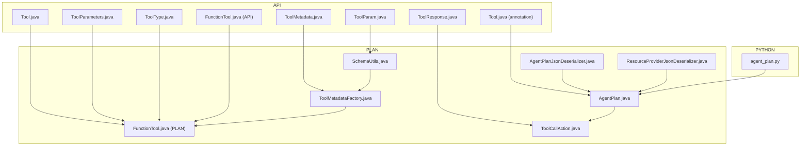
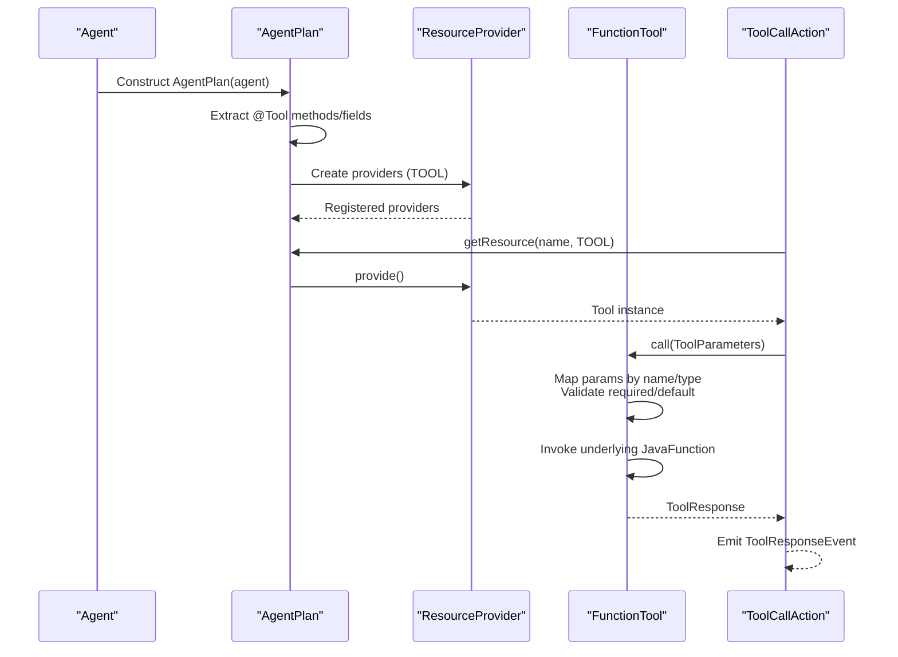
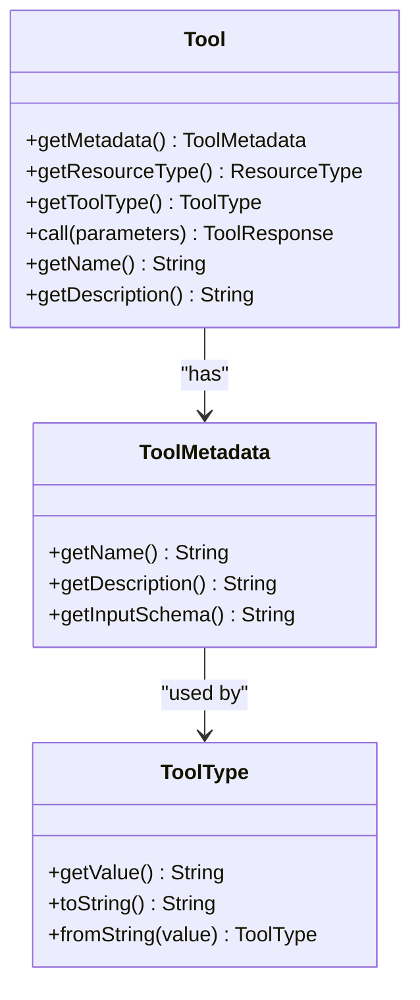
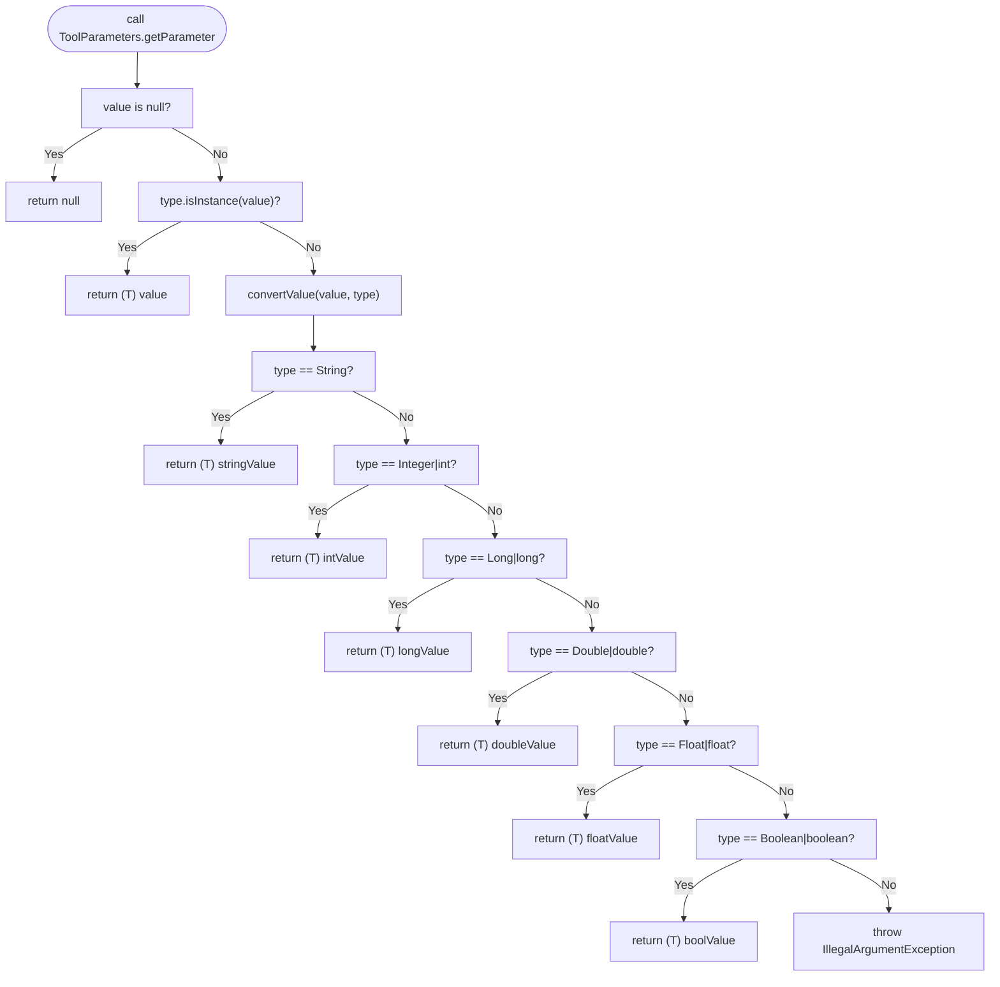
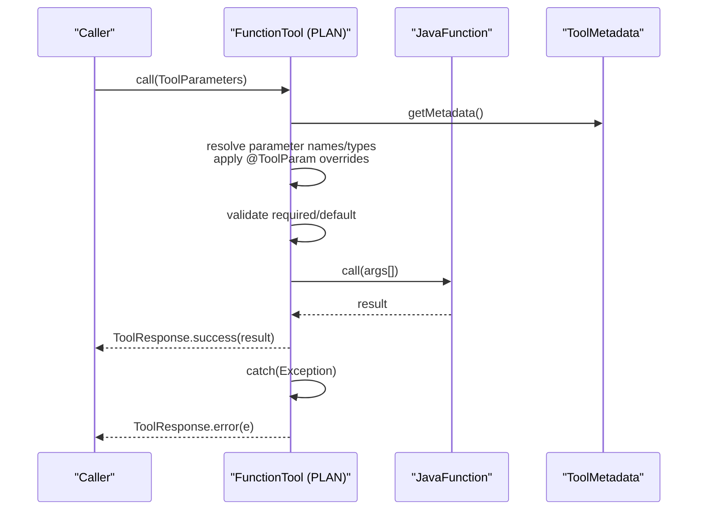
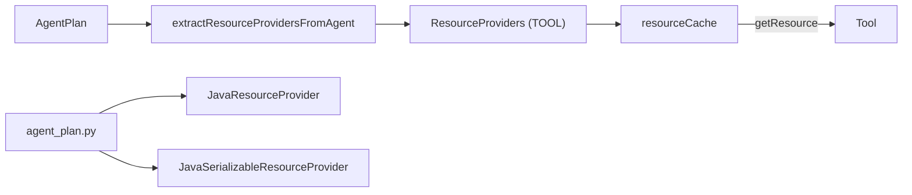
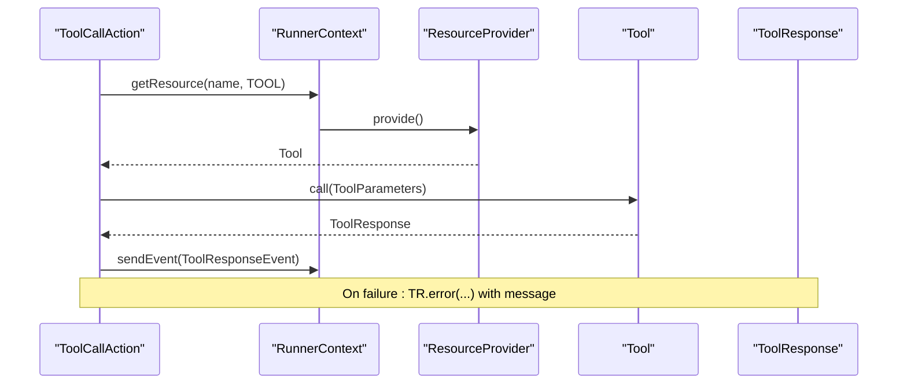
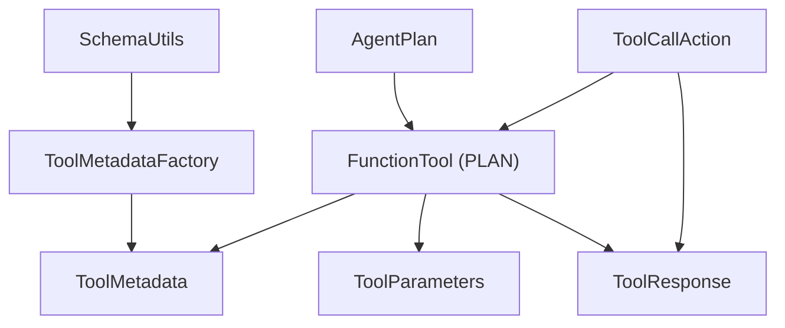

# Tool Registration and Discovery

<cite>
**Referenced Files in This Document**
- [Tool.java](file://api/src/main/java/org/apache/flink/agents/api/tools/Tool.java)
- [ToolMetadata.java](file://api/src/main/java/org/apache/flink/agents/api/tools/ToolMetadata.java)
- [ToolParameters.java](file://api/src/main/java/org/apache/flink/agents/api/tools/ToolParameters.java)
- [ToolResponse.java](file://api/src/main/java/org/apache/flink/agents/api/tools/ToolResponse.java)
- [ToolType.java](file://api/src/main/java/org/apache/flink/agents/api/tools/ToolType.java)
- [FunctionTool.java](file://api/src/main/java/org/apache/flink/agents/api/tools/FunctionTool.java)
- [Tool.java (annotation)](file://api/src/main/java/org/apache/flink/agents/api/annotation/Tool.java)
- [ToolParam.java](file://api/src/main/java/org/apache/flink/agents/api/annotation/ToolParam.java)
- [SchemaUtils.java](file://plan/src/main/java/org/apache/flink/agents/plan/tools/SchemaUtils.java)
- [ToolMetadataFactory.java](file://plan/src/main/java/org/apache/flink/agents/plan/tools/ToolMetadataFactory.java)
- [FunctionTool.java (plan)](file://plan/src/main/java/org/apache/flink/agents/plan/tools/FunctionTool.java)
- [AgentPlan.java](file://plan/src/main/java/org/apache/flink/agents/plan/AgentPlan.java)
- [ToolCallAction.java](file://plan/src/main/java/org/apache/flink/agents/plan/actions/ToolCallAction.java)
- [AgentPlanDeclareToolMethodTest.java](file://plan/src/test/java/org/apache/flink/agents/plan/AgentPlanDeclareToolMethodTest.java)
- [AgentPlanDeclareToolFieldTest.java](file://plan/src/test/java/org/apache/flink/agents/plan/AgentPlanDeclareToolFieldTest.java)
- [FunctionToolTest.java](file://plan/src/test/java/org/apache/flink/agents/plan/tools/FunctionToolTest.java)
- [FunctionToolPlanTest.java](file://plan/src/test/java/org/apache/flink/agents/plan/FunctionToolPlanTest.java)
- [AgentPlanJsonDeserializer.java](file://plan/src/main/java/org/apache/flink/agents/plan/serializer/AgentPlanJsonDeserializer.java)
- [ResourceProviderJsonDeserializer.java](file://plan/src/main/java/org/apache/flink/agents/plan/serializer/ResourceProviderJsonDeserializer.java)
- [agent_plan.py](file://python/flink_agents/plan/agent_plan.py)
</cite>

## Table of Contents
1. [Introduction](#introduction)
2. [Project Structure](#project-structure)
3. [Core Components](#core-components)
4. [Architecture Overview](#architecture-overview)
5. [Detailed Component Analysis](#detailed-component-analysis)
6. [Dependency Analysis](#dependency-analysis)
7. [Performance Considerations](#performance-considerations)
8. [Troubleshooting Guide](#troubleshooting-guide)
9. [Conclusion](#conclusion)
10. [Appendices](#appendices)

## Introduction
This document explains the tool registration and discovery mechanisms in Flink Agents. It covers how tools are defined, described, validated, and executed, focusing on:
- The Tool interface and ToolMetadata system for capability and description modeling
- The ToolParameters class for parameter validation and schema-driven definition
- The FunctionTool implementation for wrapping static Java methods as callable tools
- Tool discovery, registration workflows, and dynamic loading across Java and Python
- Practical examples and error-handling strategies for robust tool usage

## Project Structure
The tool system spans the API and PLAN modules:
- API defines the public tool contract, metadata, parameters, responses, and annotations
- PLAN implements discovery, metadata generation, and execution wiring
- Python runtime integrates cross-language tool execution via the AgentPlan bridge

**Diagram sources**
- [Tool.java](file://api/src/main/java/org/apache/flink/agents/api/tools/Tool.java#L30-L69)
- [ToolMetadata.java](file://api/src/main/java/org/apache/flink/agents/api/tools/ToolMetadata.java#L32-L88)
- [ToolParameters.java](file://api/src/main/java/org/apache/flink/agents/api/tools/ToolParameters.java#L28-L122)
- [ToolResponse.java](file://api/src/main/java/org/apache/flink/agents/api/tools/ToolResponse.java#L27-L183)
- [ToolType.java](file://api/src/main/java/org/apache/flink/agents/api/tools/ToolType.java#L21-L58)
- [FunctionTool.java](file://api/src/main/java/org/apache/flink/agents/api/tools/FunctionTool.java#L26-L42)
- [Tool.java (annotation)](file://api/src/main/java/org/apache/flink/agents/api/annotation/Tool.java#L26-L42)
- [ToolParam.java](file://api/src/main/java/org/apache/flink/agents/api/annotation/ToolParam.java#L29-L63)
- [SchemaUtils.java](file://plan/src/main/java/org/apache/flink/agents/plan/tools/SchemaUtils.java#L34-L96)
- [ToolMetadataFactory.java](file://plan/src/main/java/org/apache/flink/agents/plan/tools/ToolMetadataFactory.java#L34-L53)
- [FunctionTool.java (plan)](file://plan/src/main/java/org/apache/flink/agents/plan/tools/FunctionTool.java#L75-L141)
- [AgentPlan.java](file://plan/src/main/java/org/apache/flink/agents/plan/AgentPlan.java#L132-L180)
- [ToolCallAction.java](file://plan/src/main/java/org/apache/flink/agents/plan/actions/ToolCallAction.java#L61-L112)
- [AgentPlanJsonDeserializer.java](file://plan/src/main/java/org/apache/flink/agents/plan/serializer/AgentPlanJsonDeserializer.java#L113-L138)
- [ResourceProviderJsonDeserializer.java](file://plan/src/main/java/org/apache/flink/agents/plan/serializer/ResourceProviderJsonDeserializer.java#L102-L124)
- [agent_plan.py](file://python/flink_agents/plan/agent_plan.py#L202-L243)

**Section sources**
- [Tool.java](file://api/src/main/java/org/apache/flink/agents/api/tools/Tool.java#L19-L69)
- [ToolMetadata.java](file://api/src/main/java/org/apache/flink/agents/api/tools/ToolMetadata.java#L19-L88)
- [ToolParameters.java](file://api/src/main/java/org/apache/flink/agents/api/tools/ToolParameters.java#L21-L122)
- [ToolResponse.java](file://api/src/main/java/org/apache/flink/agents/api/tools/ToolResponse.java#L19-L183)
- [ToolType.java](file://api/src/main/java/org/apache/flink/agents/api/tools/ToolType.java#L19-L58)
- [FunctionTool.java](file://api/src/main/java/org/apache/flink/agents/api/tools/FunctionTool.java#L19-L42)
- [Tool.java (annotation)](file://api/src/main/java/org/apache/flink/agents/api/annotation/Tool.java#L19-L42)
- [ToolParam.java](file://api/src/main/java/org/apache/flink/agents/api/annotation/ToolParam.java#L19-L63)
- [SchemaUtils.java](file://plan/src/main/java/org/apache/flink/agents/plan/tools/SchemaUtils.java#L20-L96)
- [ToolMetadataFactory.java](file://plan/src/main/java/org/apache/flink/agents/plan/tools/ToolMetadataFactory.java#L20-L53)
- [FunctionTool.java (plan)](file://plan/src/main/java/org/apache/flink/agents/plan/tools/FunctionTool.java#L75-L141)
- [AgentPlan.java](file://plan/src/main/java/org/apache/flink/agents/plan/AgentPlan.java#L132-L180)
- [ToolCallAction.java](file://plan/src/main/java/org/apache/flink/agents/plan/actions/ToolCallAction.java#L61-L112)
- [AgentPlanJsonDeserializer.java](file://plan/src/main/java/org/apache/flink/agents/plan/serializer/AgentPlanJsonDeserializer.java#L113-L138)
- [ResourceProviderJsonDeserializer.java](file://plan/src/main/java/org/apache/flink/agents/plan/serializer/ResourceProviderJsonDeserializer.java#L102-L124)
- [agent_plan.py](file://python/flink_agents/plan/agent_plan.py#L202-L243)

## Core Components
- Tool: Abstract base for all tools, exposing metadata, resource type, tool type, and the call interface.
- ToolMetadata: Immutable API-level metadata containing name, description, and JSON input schema.
- ToolParameters: Type-safe container for tool arguments with automatic conversion and validation hooks.
- ToolResponse: Unified result/error envelope with success flags, execution time, and typed result access.
- ToolType: Enumerates supported tool categories (model-built-in, function, remote-function, mcp).
- FunctionTool (API): Lightweight holder of a Method for serialization/deserialization.
- FunctionTool (PLAN): Executable wrapper around a JavaFunction that maps ToolParameters to method arguments and executes them.
- Annotations: @Tool and @ToolParam drive discovery and schema generation.

**Section sources**
- [Tool.java](file://api/src/main/java/org/apache/flink/agents/api/tools/Tool.java#L30-L69)
- [ToolMetadata.java](file://api/src/main/java/org/apache/flink/agents/api/tools/ToolMetadata.java#L32-L88)
- [ToolParameters.java](file://api/src/main/java/org/apache/flink/agents/api/tools/ToolParameters.java#L28-L122)
- [ToolResponse.java](file://api/src/main/java/org/apache/flink/agents/api/tools/ToolResponse.java#L27-L183)
- [ToolType.java](file://api/src/main/java/org/apache/flink/agents/api/tools/ToolType.java#L21-L58)
- [FunctionTool.java](file://api/src/main/java/org/apache/flink/agents/api/tools/FunctionTool.java#L26-L42)
- [FunctionTool.java (plan)](file://plan/src/main/java/org/apache/flink/agents/plan/tools/FunctionTool.java#L75-L141)
- [Tool.java (annotation)](file://api/src/main/java/org/apache/flink/agents/api/annotation/Tool.java#L26-L42)
- [ToolParam.java](file://api/src/main/java/org/apache/flink/agents/api/annotation/ToolParam.java#L29-L63)

## Architecture Overview
The tool lifecycle spans discovery, registration, and execution:
- Discovery: AgentPlan scans for @Tool-annotated static methods and fields, generating ToolMetadata and FunctionTool entries.
- Registration: Resource providers are created and cached per resource type/name.
- Execution: ToolCallAction resolves tools by name, constructs ToolParameters, invokes FunctionTool.call, and emits ToolResponseEvent.

**Diagram sources**
- [AgentPlan.java](file://plan/src/main/java/org/apache/flink/agents/plan/AgentPlan.java#L132-L180)
- [ToolCallAction.java](file://plan/src/main/java/org/apache/flink/agents/plan/actions/ToolCallAction.java#L61-L112)
- [FunctionTool.java (plan)](file://plan/src/main/java/org/apache/flink/agents/plan/tools/FunctionTool.java#L104-L141)

## Detailed Component Analysis

### Tool Interface and Metadata System
- Tool encapsulates metadata and exposes getToolType and call signatures. It also provides convenience getters for name and description.
- ToolMetadata holds name, description, and inputSchema. The schema is generated from method signatures and annotations.
- ToolType enumerates supported categories and supports string parsing for interoperability.

**Diagram sources**
- [Tool.java](file://api/src/main/java/org/apache/flink/agents/api/tools/Tool.java#L30-L69)
- [ToolMetadata.java](file://api/src/main/java/org/apache/flink/agents/api/tools/ToolMetadata.java#L32-L88)
- [ToolType.java](file://api/src/main/java/org/apache/flink/agents/api/tools/ToolType.java#L21-L58)

**Section sources**
- [Tool.java](file://api/src/main/java/org/apache/flink/agents/api/tools/Tool.java#L30-L69)
- [ToolMetadata.java](file://api/src/main/java/org/apache/flink/agents/api/tools/ToolMetadata.java#L32-L88)
- [ToolType.java](file://api/src/main/java/org/apache/flink/agents/api/tools/ToolType.java#L21-L58)

### Tool Parameters and Validation
- ToolParameters stores a map of parameter names to values and offers:
  - hasParameter(name)
  - getParameter(name) and getParameter(name, type) with automatic conversion
  - addParameter(name, value)
  - Iteration helpers (names, values, size, isEmpty)
- Automatic conversion supports String, primitive wrappers, and numeric types; unsupported conversions raise IllegalArgumentException.

**Diagram sources**
- [ToolParameters.java](file://api/src/main/java/org/apache/flink/agents/api/tools/ToolParameters.java#L46-L116)

**Section sources**
- [ToolParameters.java](file://api/src/main/java/org/apache/flink/agents/api/tools/ToolParameters.java#L28-L122)

### FunctionTool Implementation
- API-level FunctionTool holds a Method for serialization/deserialization.
- PLAN-level FunctionTool wraps a JavaFunction and:
  - Maps ToolParameters to method arguments by parameter name and @ToolParam overrides
  - Validates required parameters and defaults
  - Executes the underlying function and returns ToolResponse
  - Converts exceptions into error responses

**Diagram sources**
- [FunctionTool.java (plan)](file://plan/src/main/java/org/apache/flink/agents/plan/tools/FunctionTool.java#L104-L141)
- [ToolMetadata.java](file://api/src/main/java/org/apache/flink/agents/api/tools/ToolMetadata.java#L32-L88)

**Section sources**
- [FunctionTool.java](file://api/src/main/java/org/apache/flink/agents/api/tools/FunctionTool.java#L26-L42)
- [FunctionTool.java (plan)](file://plan/src/main/java/org/apache/flink/agents/plan/tools/FunctionTool.java#L75-L141)

### Tool Discovery, Registration, and Dynamic Loading
- Discovery: AgentPlan scans the agent class for @Tool-annotated static methods and fields, and for @ToolParam annotations to build schemas.
- Registration: Providers are created and cached per resource type and name; JavaSerializableResourceProvider is used for serializable resources.
- Dynamic loading: Python runtime bridges via agent_plan.py to instantiate Java providers and lazily fetch resources.

**Diagram sources**
- [AgentPlan.java](file://plan/src/main/java/org/apache/flink/agents/plan/AgentPlan.java#L132-L180)
- [agent_plan.py](file://python/flink_agents/plan/agent_plan.py#L202-L243)

**Section sources**
- [AgentPlan.java](file://plan/src/main/java/org/apache/flink/agents/plan/AgentPlan.java#L132-L180)
- [AgentPlan.java](file://plan/src/main/java/org/apache/flink/agents/plan/AgentPlan.java#L588-L624)
- [AgentPlanJsonDeserializer.java](file://plan/src/main/java/org/apache/flink/agents/plan/serializer/AgentPlanJsonDeserializer.java#L113-L138)
- [ResourceProviderJsonDeserializer.java](file://plan/src/main/java/org/apache/flink/agents/plan/serializer/ResourceProviderJsonDeserializer.java#L102-L124)
- [agent_plan.py](file://python/flink_agents/plan/agent_plan.py#L202-L243)

### Tool Execution Flow and Error Propagation
- ToolCallAction resolves tools by name, executes them synchronously or asynchronously, and emits ToolResponseEvent with success flags, responses, and error details.
- ToolResponse provides multiple constructors for success and error cases, including exception-based error construction.

**Diagram sources**
- [ToolCallAction.java](file://plan/src/main/java/org/apache/flink/agents/plan/actions/ToolCallAction.java#L61-L112)
- [ToolResponse.java](file://api/src/main/java/org/apache/flink/agents/api/tools/ToolResponse.java#L59-L101)

**Section sources**
- [ToolCallAction.java](file://plan/src/main/java/org/apache/flink/agents/plan/actions/ToolCallAction.java#L61-L112)
- [ToolResponse.java](file://api/src/main/java/org/apache/flink/agents/api/tools/ToolResponse.java#L27-L183)

## Dependency Analysis
- Tool depends on ToolMetadata and ToolType; ToolParameters supplies arguments; ToolResponse carries outcomes.
- PLAN’s FunctionTool depends on ToolMetadataFactory and SchemaUtils to derive metadata and schemas from @Tool/@ToolParam.
- AgentPlan orchestrates discovery and provider registration; ToolCallAction consumes tools and emits events.

**Diagram sources**
- [ToolMetadataFactory.java](file://plan/src/main/java/org/apache/flink/agents/plan/tools/ToolMetadataFactory.java#L34-L53)
- [SchemaUtils.java](file://plan/src/main/java/org/apache/flink/agents/plan/tools/SchemaUtils.java#L34-L96)
- [FunctionTool.java (plan)](file://plan/src/main/java/org/apache/flink/agents/plan/tools/FunctionTool.java#L75-L141)
- [ToolParameters.java](file://api/src/main/java/org/apache/flink/agents/api/tools/ToolParameters.java#L28-L122)
- [ToolResponse.java](file://api/src/main/java/org/apache/flink/agents/api/tools/ToolResponse.java#L27-L183)
- [AgentPlan.java](file://plan/src/main/java/org/apache/flink/agents/plan/AgentPlan.java#L132-L180)
- [ToolCallAction.java](file://plan/src/main/java/org/apache/flink/agents/plan/actions/ToolCallAction.java#L61-L112)

**Section sources**
- [ToolMetadataFactory.java](file://plan/src/main/java/org/apache/flink/agents/plan/tools/ToolMetadataFactory.java#L34-L53)
- [SchemaUtils.java](file://plan/src/main/java/org/apache/flink/agents/plan/tools/SchemaUtils.java#L34-L96)
- [FunctionTool.java (plan)](file://plan/src/main/java/org/apache/flink/agents/plan/tools/FunctionTool.java#L75-L141)
- [ToolParameters.java](file://api/src/main/java/org/apache/flink/agents/api/tools/ToolParameters.java#L28-L122)
- [ToolResponse.java](file://api/src/main/java/org/apache/flink/agents/api/tools/ToolResponse.java#L27-L183)
- [AgentPlan.java](file://plan/src/main/java/org/apache/flink/agents/plan/AgentPlan.java#L132-L180)
- [ToolCallAction.java](file://plan/src/main/java/org/apache/flink/agents/plan/actions/ToolCallAction.java#L61-L112)

## Performance Considerations
- Parameter conversion overhead is minimal but occurs per call; caching ToolMetadata and avoiding repeated reflection-based lookups can help.
- ToolResponse creation is lightweight; prefer returning primitive results to minimize boxing costs.
- Asynchronous execution via durable execution reduces blocking; use async mode for long-running tools.

## Troubleshooting Guide
Common issues and resolutions:
- Missing required parameters: Ensure @ToolParam(required=true) aligns with invocation; supply defaults via defaultValue when appropriate.
- Type mismatch: ToolParameters converts common primitives; if conversion fails, adjust parameter types or pass compatible values.
- Tool not found: Verify @Tool annotation presence on static methods and correct tool name resolution.
- Execution errors: Inspect ToolResponse.isError and getError; exceptions are captured and surfaced as error responses.

**Section sources**
- [FunctionTool.java (plan)](file://plan/src/main/java/org/apache/flink/agents/plan/tools/FunctionTool.java#L120-L135)
- [ToolResponse.java](file://api/src/main/java/org/apache/flink/agents/api/tools/ToolResponse.java#L59-L101)
- [ToolCallAction.java](file://plan/src/main/java/org/apache/flink/agents/plan/actions/ToolCallAction.java#L67-L108)

## Conclusion
Flink Agents provides a robust, annotation-driven tool system:
- Tools are defined declaratively with @Tool and @ToolParam
- ToolMetadata and JSON schemas describe capabilities and parameters
- FunctionTool bridges static methods to executable tools with strong parameter validation
- AgentPlan discovers, registers, and caches tools; ToolCallAction executes them reliably
- Cross-language integration enables dynamic tool loading and execution

## Appendices

### Practical Examples and Recipes

- Creating a custom Function tool from a static method
  - Annotate a static method with @Tool and @ToolParam to define inputs and behavior
  - Use ToolMetadataFactory.fromStaticMethod to generate metadata and schema
  - Register via AgentPlan; retrieve and call using ToolParameters

  **Section sources**
  - [Tool.java (annotation)](file://api/src/main/java/org/apache/flink/agents/api/annotation/Tool.java#L26-L42)
  - [ToolParam.java](file://api/src/main/java/org/apache/flink/agents/api/annotation/ToolParam.java#L29-L63)
  - [ToolMetadataFactory.java](file://plan/src/main/java/org/apache/flink/agents/plan/tools/ToolMetadataFactory.java#L34-L53)
  - [AgentPlanDeclareToolMethodTest.java](file://plan/src/test/java/org/apache/flink/agents/plan/AgentPlanDeclareToolMethodTest.java#L96-L105)

- Defining tool schemas
  - SchemaUtils generates JSON schema from method signatures and @ToolParam annotations
  - Required fields and custom parameter names are reflected in the schema

  **Section sources**
  - [SchemaUtils.java](file://plan/src/main/java/org/apache/flink/agents/plan/tools/SchemaUtils.java#L34-L96)

- Handling tool execution errors
  - ToolResponse.error(Throwable) captures exception messages
  - ToolCallAction catches failures and emits ToolResponseEvent with error details

  **Section sources**
  - [ToolResponse.java](file://api/src/main/java/org/apache/flink/agents/api/tools/ToolResponse.java#L85-L101)
  - [ToolCallAction.java](file://plan/src/main/java/org/apache/flink/agents/plan/actions/ToolCallAction.java#L67-L108)

- Parameter validation and type conversion
  - ToolParameters.getParameter(name, type) performs automatic conversion for common types
  - Throws IllegalArgumentException for unsupported conversions

  **Section sources**
  - [ToolParameters.java](file://api/src/main/java/org/apache/flink/agents/api/tools/ToolParameters.java#L46-L116)

- Dynamic tool loading across languages
  - agent_plan.py sets Java resource adapters and lazily provides resources
  - AgentPlanJsonDeserializer and ResourceProviderJsonDeserializer handle serialization boundaries

  **Section sources**
  - [agent_plan.py](file://python/flink_agents/plan/agent_plan.py#L202-L243)
  - [AgentPlanJsonDeserializer.java](file://plan/src/main/java/org/apache/flink/agents/plan/serializer/AgentPlanJsonDeserializer.java#L113-L138)
  - [ResourceProviderJsonDeserializer.java](file://plan/src/main/java/org/apache/flink/agents/plan/serializer/ResourceProviderJsonDeserializer.java#L102-L124)