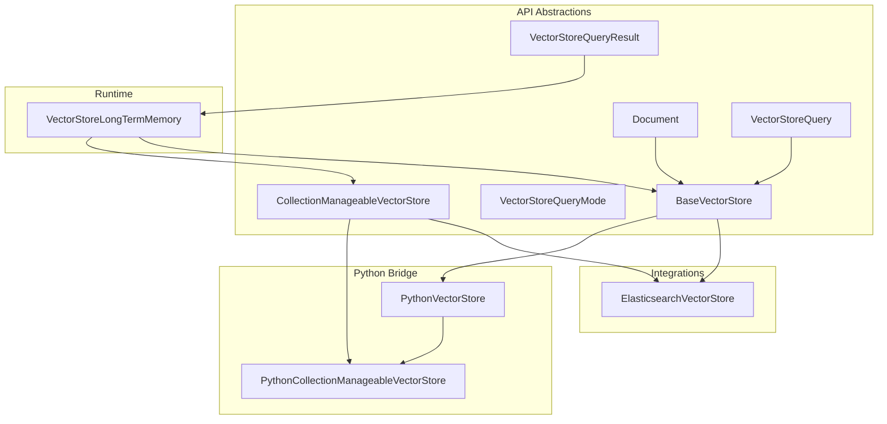
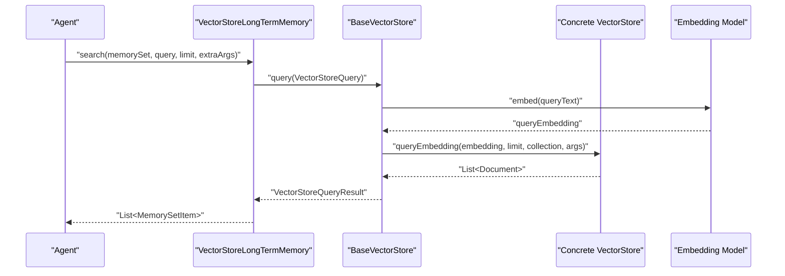
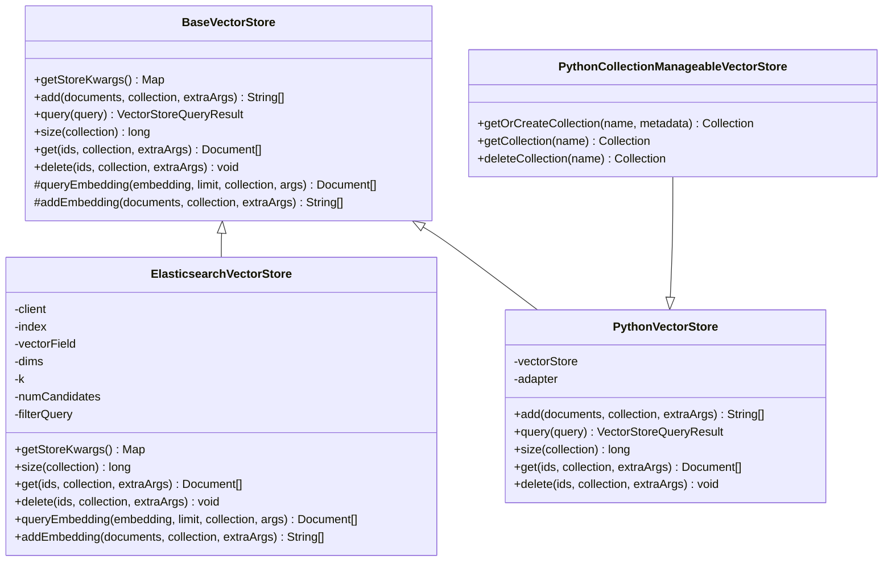
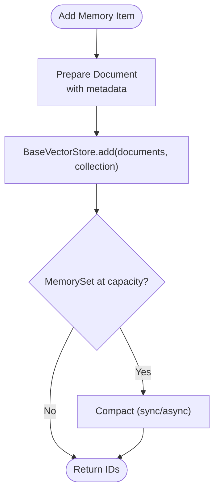
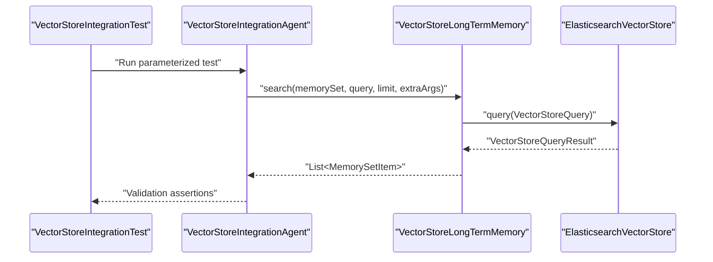
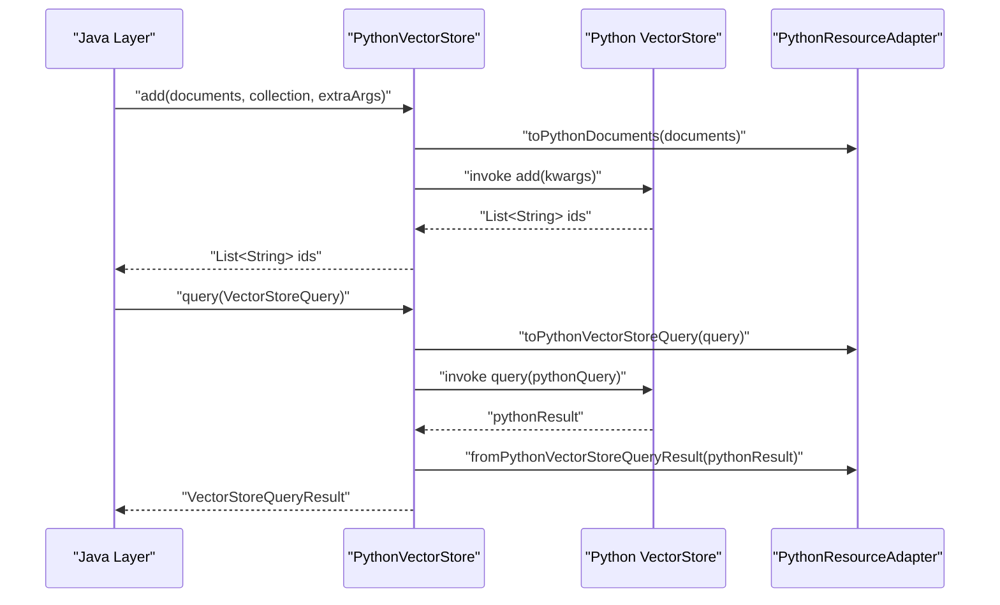
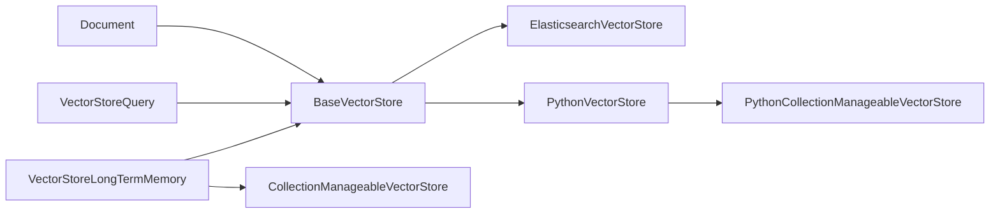

# Vector Store Integration

<cite>
**Referenced Files in This Document**
- [BaseVectorStore.java](file://api/src/main/java/org/apache/flink/agents/api/vectorstores/BaseVectorStore.java)
- [Document.java](file://api/src/main/java/org/apache/flink/agents/api/vectorstores/Document.java)
- [VectorStoreQuery.java](file://api/src/main/java/org/apache/flink/agents/api/vectorstores/VectorStoreQuery.java)
- [VectorStoreQueryMode.java](file://api/src/main/java/org/apache/flink/agents/api/vectorstores/VectorStoreQueryMode.java)
- [VectorStoreQueryResult.java](file://api/src/main/java/org/apache/flink/agents/api/vectorstores/VectorStoreQueryResult.java)
- [CollectionManageableVectorStore.java](file://api/src/main/java/org/apache/flink/agents/api/vectorstores/CollectionManageableVectorStore.java)
- [ElasticsearchVectorStore.java](file://integrations/vector-stores/elasticsearch/src/main/java/org/apache/flink/agents/integrations/vectorstores/elasticsearch/ElasticsearchVectorStore.java)
- [PythonVectorStore.java](file://api/src/main/java/org/apache/flink/agents/api/vectorstores/python/PythonVectorStore.java)
- [PythonCollectionManageableVectorStore.java](file://api/src/main/java/org/apache/flink/agents/api/vectorstores/python/PythonCollectionManageableVectorStore.java)
- [VectorStoreLongTermMemory.java](file://runtime/src/main/java/org/apache/flink/agents/runtime/memory/VectorStoreLongTermMemory.java)
- [VectorStoreIntegrationTest.java](file://e2e-test/flink-agents-end-to-end-tests-integration/src/test/java/org/apache/flink/agents/integration/test/VectorStoreIntegrationTest.java)
- [VectorStoreIntegrationAgent.java](file://e2e-test/flink-agents-end-to-end-tests-integration/src/test/java/org/apache/flink/agents/integration/test/VectorStoreIntegrationAgent.java)
</cite>

## Table of Contents
1. [Introduction](#introduction)
2. [Project Structure](#project-structure)
3. [Core Components](#core-components)
4. [Architecture Overview](#architecture-overview)
5. [Detailed Component Analysis](#detailed-component-analysis)
6. [Dependency Analysis](#dependency-analysis)
7. [Performance Considerations](#performance-considerations)
8. [Troubleshooting Guide](#troubleshooting-guide)
9. [Conclusion](#conclusion)
10. [Appendices](#appendices)

## Introduction
This document explains vector store integration in Flink Agents with a focus on semantic memory and retrieval augmented generation (RAG). It covers the BaseVectorStore abstraction and its implementations, the Document model for storing and retrieving vectorized content, and the query APIs (VectorStoreQuery and VectorStoreQueryMode). Practical integration patterns are demonstrated for Elasticsearch, and cross-language bridging for Python-based vector stores. The guide also addresses embedding model integration, batch operations, indexing strategies, query optimization, result ranking, and context filtering for agent decision-making.

## Project Structure
Flink Agents organizes vector store functionality in the API module and integrates with runtime and integrations modules:
- API vector store abstractions and models live under api/src/main/java/.../vectorstores
- Elasticsearch integration lives under integrations/vector-stores/elasticsearch
- Python bridge implementations live under api/src/main/java/.../vectorstores/python
- Runtime memory integration for long-term memory backed by vector stores lives under runtime/src/main/java/.../runtime/memory

**Diagram sources**
- [BaseVectorStore.java](file://api/src/main/java/org/apache/flink/agents/api/vectorstores/BaseVectorStore.java#L38-L173)
- [Document.java](file://api/src/main/java/org/apache/flink/agents/api/vectorstores/Document.java#L34-L110)
- [VectorStoreQuery.java](file://api/src/main/java/org/apache/flink/agents/api/vectorstores/VectorStoreQuery.java#L33-L109)
- [VectorStoreQueryMode.java](file://api/src/main/java/org/apache/flink/agents/api/vectorstores/VectorStoreQueryMode.java#L28-L61)
- [VectorStoreQueryResult.java](file://api/src/main/java/org/apache/flink/agents/api/vectorstores/VectorStoreQueryResult.java#L29-L46)
- [CollectionManageableVectorStore.java](file://api/src/main/java/org/apache/flink/agents/api/vectorstores/CollectionManageableVectorStore.java#L23-L67)
- [ElasticsearchVectorStore.java](file://integrations/vector-stores/elasticsearch/src/main/java/org/apache/flink/agents/integrations/vectorstores/elasticsearch/ElasticsearchVectorStore.java#L118-L800)
- [PythonVectorStore.java](file://api/src/main/java/org/apache/flink/agents/api/vectorstores/python/PythonVectorStore.java#L49-L156)
- [PythonCollectionManageableVectorStore.java](file://api/src/main/java/org/apache/flink/agents/api/vectorstores/python/PythonCollectionManageableVectorStore.java#L42-L85)
- [VectorStoreLongTermMemory.java](file://runtime/src/main/java/org/apache/flink/agents/runtime/memory/VectorStoreLongTermMemory.java#L57-L315)

**Section sources**
- [BaseVectorStore.java](file://api/src/main/java/org/apache/flink/agents/api/vectorstores/BaseVectorStore.java#L33-L173)
- [ElasticsearchVectorStore.java](file://integrations/vector-stores/elasticsearch/src/main/java/org/apache/flink/agents/integrations/vectorstores/elasticsearch/ElasticsearchVectorStore.java#L74-L250)

## Core Components
- BaseVectorStore: Abstract base class that integrates embedding models and exposes add, query, get, delete, and size operations. It converts text queries to embeddings and delegates vector search to concrete implementations.
- Document: Immutable content container with id, content, metadata, and optional embedding vector.
- VectorStoreQuery: Encapsulates query text, limit, collection, and extra arguments; supports a query mode (currently SEMANTIC).
- VectorStoreQueryMode: Enumerates supported query execution modes (SEMANTIC).
- VectorStoreQueryResult: Wraps a list of Documents returned by a query.
- CollectionManageableVectorStore: Optional capability to manage named collections (get/create/delete) with metadata.

Key responsibilities:
- Embedding orchestration: BaseVectorStore resolves an embedding model resource and embeds content or queries when needed.
- Batch operations: add supports lists of documents; Elasticsearch implementation uses bulk APIs for efficient ingestion.
- Query composition: query merges store defaults with per-query arguments and returns ranked results.

**Section sources**
- [BaseVectorStore.java](file://api/src/main/java/org/apache/flink/agents/api/vectorstores/BaseVectorStore.java#L38-L173)
- [Document.java](file://api/src/main/java/org/apache/flink/agents/api/vectorstores/Document.java#L34-L110)
- [VectorStoreQuery.java](file://api/src/main/java/org/apache/flink/agents/api/vectorstores/VectorStoreQuery.java#L33-L109)
- [VectorStoreQueryMode.java](file://api/src/main/java/org/apache/flink/agents/api/vectorstores/VectorStoreQueryMode.java#L28-L61)
- [VectorStoreQueryResult.java](file://api/src/main/java/org/apache/flink/agents/api/vectorstores/VectorStoreQueryResult.java#L29-L46)
- [CollectionManageableVectorStore.java](file://api/src/main/java/org/apache/flink/agents/api/vectorstores/CollectionManageableVectorStore.java#L23-L67)

## Architecture Overview
The vector store architecture separates concerns between:
- Abstraction (BaseVectorStore) for unified operations and embedding integration
- Implementations (ElasticsearchVectorStore, PythonVectorStore) for concrete backends
- Runtime integration (VectorStoreLongTermMemory) for semantic memory and RAG workflows
- Query pipeline (VectorStoreQuery) for flexible, extensible search

**Diagram sources**
- [VectorStoreLongTermMemory.java](file://runtime/src/main/java/org/apache/flink/agents/runtime/memory/VectorStoreLongTermMemory.java#L235-L244)
- [BaseVectorStore.java](file://api/src/main/java/org/apache/flink/agents/api/vectorstores/BaseVectorStore.java#L97-L112)
- [ElasticsearchVectorStore.java](file://integrations/vector-stores/elasticsearch/src/main/java/org/apache/flink/agents/integrations/vectorstores/elasticsearch/ElasticsearchVectorStore.java#L702-L741)

## Detailed Component Analysis

### BaseVectorStore and Implementations
BaseVectorStore centralizes embedding integration and common operations:
- add(List<Document>, collection, extraArgs): Ensures embeddings are present; merges store kwargs with extraArgs; delegates to addEmbedding.
- query(VectorStoreQuery): Embeds query text; merges store kwargs with query extraArgs; delegates to queryEmbedding; wraps results.
- get/delete/size: Abstract hooks for concrete implementations.
- queryEmbedding/addEmbedding: Protected hooks for vector search and ingestion.

Implementations:
- ElasticsearchVectorStore: Implements approximate nearest neighbor (ANN) KNN search, bulk indexing, collection management, and configurable defaults (k, num_candidates, filter_query).
- PythonVectorStore and PythonCollectionManageableVectorStore: Bridge Java to Python vector stores via a PythonResourceAdapter, delegating add, query, get, delete, and collection management.

**Diagram sources**
- [BaseVectorStore.java](file://api/src/main/java/org/apache/flink/agents/api/vectorstores/BaseVectorStore.java#L38-L173)
- [ElasticsearchVectorStore.java](file://integrations/vector-stores/elasticsearch/src/main/java/org/apache/flink/agents/integrations/vectorstores/elasticsearch/ElasticsearchVectorStore.java#L118-L800)
- [PythonVectorStore.java](file://api/src/main/java/org/apache/flink/agents/api/vectorstores/python/PythonVectorStore.java#L49-L156)
- [PythonCollectionManageableVectorStore.java](file://api/src/main/java/org/apache/flink/agents/api/vectorstores/python/PythonCollectionManageableVectorStore.java#L42-L85)

**Section sources**
- [BaseVectorStore.java](file://api/src/main/java/org/apache/flink/agents/api/vectorstores/BaseVectorStore.java#L71-L172)
- [ElasticsearchVectorStore.java](file://integrations/vector-stores/elasticsearch/src/main/java/org/apache/flink/agents/integrations/vectorstores/elasticsearch/ElasticsearchVectorStore.java#L459-L741)
- [PythonVectorStore.java](file://api/src/main/java/org/apache/flink/agents/api/vectorstores/python/PythonVectorStore.java#L72-L155)
- [PythonCollectionManageableVectorStore.java](file://api/src/main/java/org/apache/flink/agents/api/vectorstores/python/PythonCollectionManageableVectorStore.java#L61-L84)

### Document Model
Document encapsulates:
- id: Optional unique identifier
- content: The textual payload
- metadata: Arbitrary key-value map for filtering and provenance
- embedding: Optional float[] vector for similarity search

Usage patterns:
- Populate embedding during ingestion or rely on BaseVectorStore.add to embed lazily.
- Metadata supports downstream filtering and context shaping.

**Section sources**
- [Document.java](file://api/src/main/java/org/apache/flink/agents/api/vectorstores/Document.java#L34-L110)

### VectorStoreQuery and Query Modes
VectorStoreQuery defines:
- mode: SEMANTIC (others are reserved for future use)
- queryText: Text to embed and search
- limit: Max results
- collection: Optional target collection/index
- extraArgs: Store-specific parameters (e.g., k, num_candidates, filter_query)

VectorStoreQueryMode currently supports SEMANTIC; additional modes (KEYWORD, HYBRID) are reserved.

**Section sources**
- [VectorStoreQuery.java](file://api/src/main/java/org/apache/flink/agents/api/vectorstores/VectorStoreQuery.java#L33-L109)
- [VectorStoreQueryMode.java](file://api/src/main/java/org/apache/flink/agents/api/vectorstores/VectorStoreQueryMode.java#L28-L61)

### Collection Management
CollectionManageableVectorStore enables:
- getOrCreateCollection(name, metadata)
- getCollection(name)
- deleteCollection(name)

ElasticsearchVectorStore implements this interface to manage indices and metadata separately.

**Section sources**
- [CollectionManageableVectorStore.java](file://api/src/main/java/org/apache/flink/agents/api/vectorstores/CollectionManageableVectorStore.java#L23-L67)
- [ElasticsearchVectorStore.java](file://integrations/vector-stores/elasticsearch/src/main/java/org/apache/flink/agents/integrations/vectorstores/elasticsearch/ElasticsearchVectorStore.java#L257-L448)

### Runtime Integration for Semantic Memory and RAG
VectorStoreLongTermMemory integrates vector stores into agent memory:
- Manages collections per memory set
- Adds documents with metadata timestamps and flags
- Searches with VectorStoreQuery and converts results to MemorySetItem
- Supports asynchronous compaction and thread-pooled workers

**Diagram sources**
- [VectorStoreLongTermMemory.java](file://runtime/src/main/java/org/apache/flink/agents/runtime/memory/VectorStoreLongTermMemory.java#L137-L218)
- [BaseVectorStore.java](file://api/src/main/java/org/apache/flink/agents/api/vectorstores/BaseVectorStore.java#L71-L88)

**Section sources**
- [VectorStoreLongTermMemory.java](file://runtime/src/main/java/org/apache/flink/agents/runtime/memory/VectorStoreLongTermMemory.java#L57-L315)

### Practical Integration Examples

#### Elasticsearch Integration
- Configuration: index, vector_field, dims, k, num_candidates, filter_query, host(s), auth (basic or API key)
- Operations:
  - add: Bulk index with vectors and metadata
  - query: KNN search with optional post-filter
  - get/delete: Multi-get by IDs or delete-by-query with filters
  - collections: Create/get/delete indices and metadata

**Diagram sources**
- [VectorStoreIntegrationTest.java](file://e2e-test/flink-agents-end-to-end-tests-integration/src/test/java/org/apache/flink/agents/integration/test/VectorStoreIntegrationTest.java#L50-L82)
- [VectorStoreIntegrationAgent.java](file://e2e-test/flink-agents-end-to-end-tests-integration/src/test/java/org/apache/flink/agents/integration/test/VectorStoreIntegrationAgent.java#L95-L154)
- [VectorStoreLongTermMemory.java](file://runtime/src/main/java/org/apache/flink/agents/runtime/memory/VectorStoreLongTermMemory.java#L235-L244)
- [ElasticsearchVectorStore.java](file://integrations/vector-stores/elasticsearch/src/main/java/org/apache/flink/agents/integrations/vectorstores/elasticsearch/ElasticsearchVectorStore.java#L702-L741)

**Section sources**
- [ElasticsearchVectorStore.java](file://integrations/vector-stores/elasticsearch/src/main/java/org/apache/flink/agents/integrations/vectorstores/elasticsearch/ElasticsearchVectorStore.java#L118-L250)
- [VectorStoreIntegrationTest.java](file://e2e-test/flink-agents-end-to-end-tests-integration/src/test/java/org/apache/flink/agents/integration/test/VectorStoreIntegrationTest.java#L48-L121)
- [VectorStoreIntegrationAgent.java](file://e2e-test/flink-agents-end-to-end-tests-integration/src/test/java/org/apache/flink/agents/integration/test/VectorStoreIntegrationAgent.java#L69-L93)

#### Python Bridge Integration
- PythonVectorStore: Delegates add, query, get, delete to a Python vector store object via a PythonResourceAdapter.
- PythonCollectionManageableVectorStore: Adds collection management by invoking Python-side methods.

**Diagram sources**
- [PythonVectorStore.java](file://api/src/main/java/org/apache/flink/agents/api/vectorstores/python/PythonVectorStore.java#L72-L96)
- [PythonCollectionManageableVectorStore.java](file://api/src/main/java/org/apache/flink/agents/api/vectorstores/python/PythonCollectionManageableVectorStore.java#L61-L84)

**Section sources**
- [PythonVectorStore.java](file://api/src/main/java/org/apache/flink/agents/api/vectorstores/python/PythonVectorStore.java#L49-L156)
- [PythonCollectionManageableVectorStore.java](file://api/src/main/java/org/apache/flink/agents/api/vectorstores/python/PythonCollectionManageableVectorStore.java#L42-L85)

## Dependency Analysis
- BaseVectorStore depends on:
  - Resource resolution to obtain embedding models
  - Concrete implementations for queryEmbedding and addEmbedding
- ElasticsearchVectorStore depends on:
  - Elasticsearch client libraries for KNN search, bulk operations, and index management
  - ResourceDescriptor arguments for connection and defaults
- PythonVectorStore depends on:
  - PythonResourceAdapter for marshalling/unmarshalling Documents and queries
  - Python object for actual storage operations
- VectorStoreLongTermMemory depends on:
  - BaseVectorStore for persistence and retrieval
  - CollectionManageableVectorStore for collection lifecycle

**Diagram sources**
- [BaseVectorStore.java](file://api/src/main/java/org/apache/flink/agents/api/vectorstores/BaseVectorStore.java#L38-L173)
- [ElasticsearchVectorStore.java](file://integrations/vector-stores/elasticsearch/src/main/java/org/apache/flink/agents/integrations/vectorstores/elasticsearch/ElasticsearchVectorStore.java#L118-L800)
- [PythonVectorStore.java](file://api/src/main/java/org/apache/flink/agents/api/vectorstores/python/PythonVectorStore.java#L49-L156)
- [PythonCollectionManageableVectorStore.java](file://api/src/main/java/org/apache/flink/agents/api/vectorstores/python/PythonCollectionManageableVectorStore.java#L42-L85)
- [VectorStoreLongTermMemory.java](file://runtime/src/main/java/org/apache/flink/agents/runtime/memory/VectorStoreLongTermMemory.java#L57-L315)

**Section sources**
- [BaseVectorStore.java](file://api/src/main/java/org/apache/flink/agents/api/vectorstores/BaseVectorStore.java#L43-L52)
- [ElasticsearchVectorStore.java](file://integrations/vector-stores/elasticsearch/src/main/java/org/apache/flink/agents/integrations/vectorstores/elasticsearch/ElasticsearchVectorStore.java#L202-L249)
- [PythonVectorStore.java](file://api/src/main/java/org/apache/flink/agents/api/vectorstores/python/PythonVectorStore.java#L62-L70)
- [VectorStoreLongTermMemory.java](file://runtime/src/main/java/org/apache/flink/agents/runtime/memory/VectorStoreLongTermMemory.java#L104-L108)

## Performance Considerations
- Embedding costs: BaseVectorStore.add embeds documents when missing; batch operations reduce per-request overhead.
- Elasticsearch KNN:
  - k and num_candidates control recall and latency trade-offs; defaults validated in constructor.
  - filter_query as post-filter narrows results after ANN search.
  - Bulk indexing minimizes network overhead.
- Result limits: ElasticsearchVectorStore caps retrieval window; consider pagination or filters for large datasets.
- Asynchronous compaction: VectorStoreLongTermMemory can offload summarization to a fixed thread pool.

[No sources needed since this section provides general guidance]

## Troubleshooting Guide
Common issues and resolutions:
- Missing required arguments: ElasticsearchVectorStore validates k vs num_candidates and requires index and vector_field.
- Authentication failures: Ensure username/password or API key configuration matches Elasticsearch setup.
- Empty results:
  - Verify embedding model produces non-zero vectors.
  - Confirm index mapping includes the configured vector_field with correct dims.
  - Adjust k and num_candidates for better recall.
- Bulk operation errors: Inspect individual item errors and retry failed operations.
- Python bridge mismatches: Ensure PythonResourceAdapter correctly serializes Documents and VectorStoreQuery.

**Section sources**
- [ElasticsearchVectorStore.java](file://integrations/vector-stores/elasticsearch/src/main/java/org/apache/flink/agents/integrations/vectorstores/elasticsearch/ElasticsearchVectorStore.java#L194-L199)
- [ElasticsearchVectorStore.java](file://integrations/vector-stores/elasticsearch/src/main/java/org/apache/flink/agents/integrations/vectorstores/elasticsearch/ElasticsearchVectorStore.java#L636-L647)
- [PythonVectorStore.java](file://api/src/main/java/org/apache/flink/agents/api/vectorstores/python/PythonVectorStore.java#L93-L95)

## Conclusion
Flink Agents provides a robust, extensible vector store framework:
- BaseVectorStore unifies embedding integration and query semantics
- ElasticsearchVectorStore delivers production-ready ANN search and collection management
- PythonVectorStore enables cross-language vector store integration
- VectorStoreLongTermMemory powers semantic memory and RAG with batch operations, compaction, and filtering

These components enable scalable, agent-driven semantic search and memory for Retrieval Augmented Generation workflows.

[No sources needed since this section summarizes without analyzing specific files]

## Appendices

### Query Optimization and Result Ranking
- Use k and num_candidates tuned to dataset scale and latency targets.
- Apply filter_query to constrain search space and improve precision.
- Rank by similarity score; leverage metadata to further refine context selection.

[No sources needed since this section provides general guidance]

### Context Filtering for Agent Decision-Making
- Filter by metadata fields (e.g., source, timestamp) to narrow relevant context.
- Limit results by collection to isolate domain-specific knowledge.
- Post-process results to remove duplicates or low-relevance entries before agent action.

[No sources needed since this section provides general guidance]