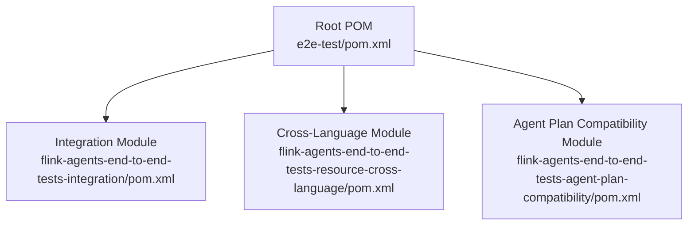
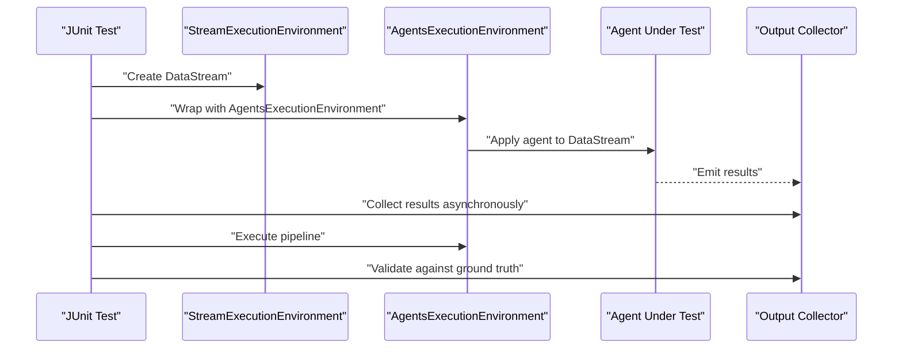
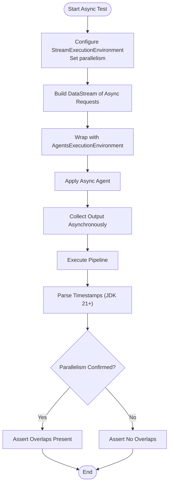
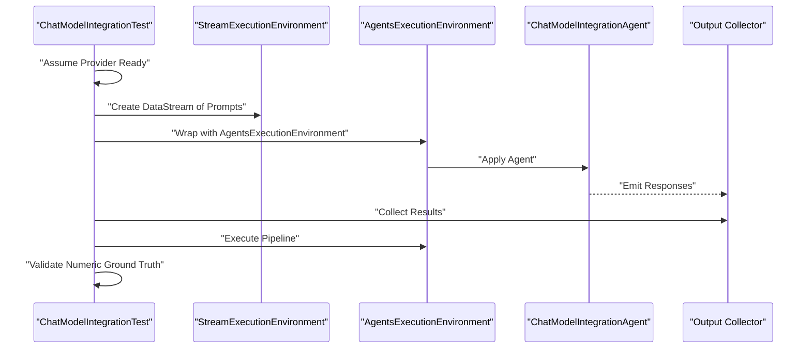
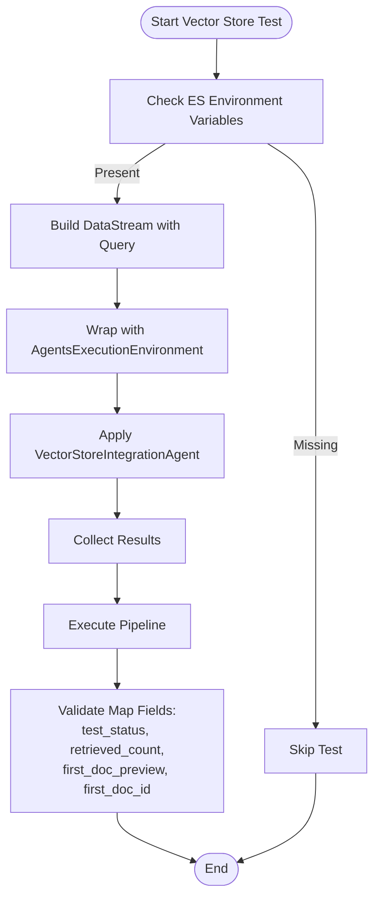
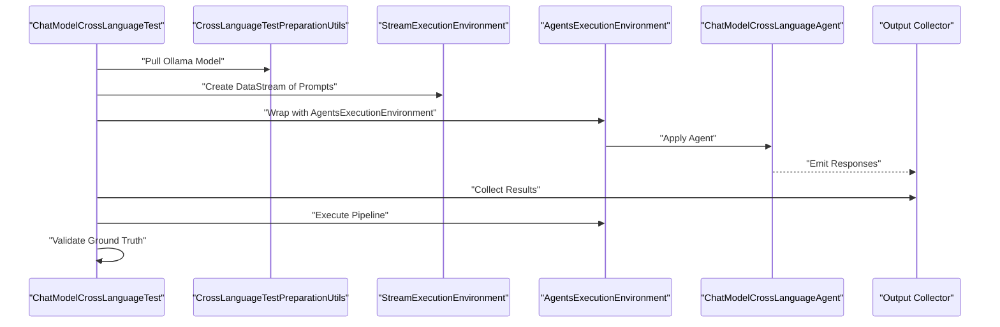
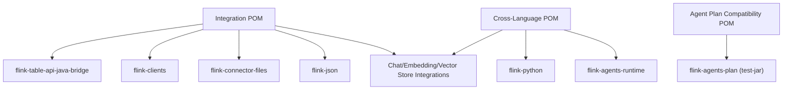

# Integration Testing

<cite>
**Referenced Files in This Document**
- [pom.xml](file://e2e-test/pom.xml)
- [integration/pom.xml](file://e2e-test/flink-agents-end-to-end-tests-integration/pom.xml)
- [cross-language/pom.xml](file://e2e-test/flink-agents-end-to-end-tests-resource-cross-language/pom.xml)
- [agent-plan-compatibility/pom.xml](file://e2e-test/flink-agents-end-to-end-tests-agent-plan-compatibility/pom.xml)
- [AsyncExecutionTest.java](file://e2e-test/flink-agents-end-to-end-tests-integration/src/test/java/org/apache/flink/agents/integration/test/AsyncExecutionTest.java)
- [ChatModelIntegrationTest.java](file://e2e-test/flink-agents-end-to-end-tests-integration/src/test/java/org/apache/flink/agents/integration/test/ChatModelIntegrationTest.java)
- [VectorStoreIntegrationTest.java](file://e2e-test/flink-agents-end-to-end-tests-integration/src/test/java/org/apache/flink/agents/integration/test/VectorStoreIntegrationTest.java)
- [ChatModelCrossLanguageTest.java](file://e2e-test/flink-agents-end-to-end-tests-resource-cross-language/src/test/java/org/apache/flink/agents/resource/test/ChatModelCrossLanguageTest.java)
- [log4j2-test.properties](file://e2e-test/flink-agents-end-to-end-tests-integration/src/test/resources/log4j2-test.properties)
- [ollama_pull_model.sh](file://e2e-test/flink-agents-end-to-end-tests-resource-cross-language/src/test/resources/ollama_pull_model.sh)
</cite>

## Table of Contents
1. [Introduction](#introduction)
2. [Project Structure](#project-structure)
3. [Core Components](#core-components)
4. [Architecture Overview](#architecture-overview)
5. [Detailed Component Analysis](#detailed-component-analysis)
6. [Dependency Analysis](#dependency-analysis)
7. [Performance Considerations](#performance-considerations)
8. [Troubleshooting Guide](#troubleshooting-guide)
9. [Conclusion](#conclusion)
10. [Appendices](#appendices)

## Introduction
This document provides comprehensive integration testing guidance for Flink Agents. It covers end-to-end testing approaches for agent workflows, resource integrations, and memory systems. It explains how to test cross-language resource communication, external service connectivity, and data flow between components. It also includes guidance on test environment setup, test data preparation, and ground truth validation. Additional topics include testing agent plan compatibility, resource provider registration, event processing pipelines, asynchronous execution, fault tolerance, and performance under load.

## Project Structure
The integration testing suite is organized as a Maven multi-module project with dedicated modules for:
- Integration tests covering async execution, chat models, embeddings, vector stores, and memory
- Cross-language resource tests validating interoperability between Java and Python runtimes
- Agent plan compatibility tests ensuring plan serialization and deserialization correctness

**Diagram sources**
- [pom.xml](file://e2e-test/pom.xml#L31-L35)

**Section sources**
- [pom.xml](file://e2e-test/pom.xml#L1-L36)

## Core Components
This section outlines the primary integration test components and their roles:
- AsyncExecutionTest: Validates durable asynchronous execution, chaining multiple async calls, concurrency with multiple keys, and parallelism characteristics on JDK 21+.
- ChatModelIntegrationTest: Exercises chat model providers (Anthropic, Azure, Ollama, OpenAI) via parameterized tests, verifying tool-use triggers and numeric grounding.
- VectorStoreIntegrationTest: Validates semantic queries against Elasticsearch using environment-driven configuration and checks retrieval counts and previews.
- ChatModelCrossLanguageTest: Demonstrates cross-language resource communication using Ollama, ensuring Java-based Flink pipeline interacts with Python-based resources.

Key test utilities and configurations:
- Logging configuration for test runs
- Model provisioning script for Ollama

**Section sources**
- [AsyncExecutionTest.java](file://e2e-test/flink-agents-end-to-end-tests-integration/src/test/java/org/apache/flink/agents/integration/test/AsyncExecutionTest.java#L31-L391)
- [ChatModelIntegrationTest.java](file://e2e-test/flink-agents-end-to-end-tests-integration/src/test/java/org/apache/flink/agents/integration/test/ChatModelIntegrationTest.java#L39-L127)
- [VectorStoreIntegrationTest.java](file://e2e-test/flink-agents-end-to-end-tests-integration/src/test/java/org/apache/flink/agents/integration/test/VectorStoreIntegrationTest.java#L34-L122)
- [ChatModelCrossLanguageTest.java](file://e2e-test/flink-agents-end-to-end-tests-resource-cross-language/src/test/java/org/apache/flink/agents/resource/test/ChatModelCrossLanguageTest.java#L39-L106)
- [log4j2-test.properties](file://e2e-test/flink-agents-end-to-end-tests-integration/src/test/resources/log4j2-test.properties#L19-L29)
- [ollama_pull_model.sh](file://e2e-test/flink-agents-end-to-end-tests-resource-cross-language/src/test/resources/ollama_pull_model.sh#L19-L20)

## Architecture Overview
The integration tests orchestrate Flink Streams with AgentsExecutionEnvironment to apply agents to DataStreams. Results are collected asynchronously and validated against ground truth expectations. Cross-language tests rely on Python-based resources (e.g., Ollama) and Flink’s Python bridge.

**Diagram sources**
- [AsyncExecutionTest.java](file://e2e-test/flink-agents-end-to-end-tests-integration/src/test/java/org/apache/flink/agents/integration/test/AsyncExecutionTest.java#L44-L96)
- [ChatModelIntegrationTest.java](file://e2e-test/flink-agents-end-to-end-tests-integration/src/test/java/org/apache/flink/agents/integration/test/ChatModelIntegrationTest.java#L66-L102)
- [VectorStoreIntegrationTest.java](file://e2e-test/flink-agents-end-to-end-tests-integration/src/test/java/org/apache/flink/agents/integration/test/VectorStoreIntegrationTest.java#L64-L82)
- [ChatModelCrossLanguageTest.java](file://e2e-test/flink-agents-end-to-end-tests-resource-cross-language/src/test/java/org/apache/flink/agents/resource/test/ChatModelCrossLanguageTest.java#L52-L82)

## Detailed Component Analysis

### Asynchronous Execution Testing
Asynchronous execution tests validate:
- Single async action behavior using durableExecuteAsync
- Chaining multiple async calls within a single action
- Concurrent processing across multiple keys
- Parallelism characteristics on JDK 21+ using continuations

**Diagram sources**
- [AsyncExecutionTest.java](file://e2e-test/flink-agents-end-to-end-tests-integration/src/test/java/org/apache/flink/agents/integration/test/AsyncExecutionTest.java#L219-L334)

**Section sources**
- [AsyncExecutionTest.java](file://e2e-test/flink-agents-end-to-end-tests-integration/src/test/java/org/apache/flink/agents/integration/test/AsyncExecutionTest.java#L31-L391)

### Chat Model Integration Testing
Chat model tests exercise multiple providers and validate tool-use triggers and numeric grounding:
- Provider selection via environment property
- Parameterized provider support (Anthropic, Azure, Ollama, OpenAI)
- Environment-based skip logic when credentials or servers are unavailable
- Ground truth validation for numeric conversions

**Diagram sources**
- [ChatModelIntegrationTest.java](file://e2e-test/flink-agents-end-to-end-tests-integration/src/test/java/org/apache/flink/agents/integration/test/ChatModelIntegrationTest.java#L55-L102)

**Section sources**
- [ChatModelIntegrationTest.java](file://e2e-test/flink-agents-end-to-end-tests-integration/src/test/java/org/apache/flink/agents/integration/test/ChatModelIntegrationTest.java#L39-L127)

### Vector Store Integration Testing
Vector store tests validate semantic queries against Elasticsearch:
- Environment-driven configuration (host, index, vector field)
- Parameterized backend selection
- Validation of retrieval count, preview, and optional document ID

**Diagram sources**
- [VectorStoreIntegrationTest.java](file://e2e-test/flink-agents-end-to-end-tests-integration/src/test/java/org/apache/flink/agents/integration/test/VectorStoreIntegrationTest.java#L50-L112)

**Section sources**
- [VectorStoreIntegrationTest.java](file://e2e-test/flink-agents-end-to-end-tests-integration/src/test/java/org/apache/flink/agents/integration/test/VectorStoreIntegrationTest.java#L34-L122)

### Cross-Language Resource Communication Testing
Cross-language tests validate interoperability between Java-based Flink pipelines and Python-based resources:
- Ollama model provisioning via shell script
- Parameterized prompts driving tool-use and numeric grounding
- Aggregated ground truth validation across responses

**Diagram sources**
- [ChatModelCrossLanguageTest.java](file://e2e-test/flink-agents-end-to-end-tests-resource-cross-language/src/test/java/org/apache/flink/agents/resource/test/ChatModelCrossLanguageTest.java#L48-L82)

**Section sources**
- [ChatModelCrossLanguageTest.java](file://e2e-test/flink-agents-end-to-end-tests-resource-cross-language/src/test/java/org/apache/flink/agents/resource/test/ChatModelCrossLanguageTest.java#L39-L106)
- [ollama_pull_model.sh](file://e2e-test/flink-agents-end-to-end-tests-resource-cross-language/src/test/resources/ollama_pull_model.sh#L19-L20)

## Dependency Analysis
The integration test modules declare dependencies aligned with target Flink versions and required integrations. The cross-language module additionally depends on the Python bridge.

**Diagram sources**
- [integration/pom.xml](file://e2e-test/flink-agents-end-to-end-tests-integration/pom.xml#L41-L112)
- [cross-language/pom.xml](file://e2e-test/flink-agents-end-to-end-tests-resource-cross-language/pom.xml#L15-L58)
- [agent-plan-compatibility/pom.xml](file://e2e-test/flink-agents-end-to-end-tests-agent-plan-compatibility/pom.xml#L31-L49)

**Section sources**
- [integration/pom.xml](file://e2e-test/flink-agents-end-to-end-tests-integration/pom.xml#L41-L112)
- [cross-language/pom.xml](file://e2e-test/flink-agents-end-to-end-tests-resource-cross-language/pom.xml#L15-L58)
- [agent-plan-compatibility/pom.xml](file://e2e-test/flink-agents-end-to-end-tests-agent-plan-compatibility/pom.xml#L31-L49)

## Performance Considerations
- Asynchronous execution parallelism: Tests confirm parallel execution on JDK 21+ by validating overlapping execution windows; on older JDKs, tasks execute sequentially.
- Concurrency with multiple keys: Increasing parallelism allows independent processing per key, improving throughput.
- External service latency: Chat model and vector store tests are sensitive to network and server responsiveness; configure timeouts and retry policies externally as needed.
- Logging overhead: Test logging is minimized by default; enable INFO-level logging only when diagnosing issues.

**Section sources**
- [AsyncExecutionTest.java](file://e2e-test/flink-agents-end-to-end-tests-integration/src/test/java/org/apache/flink/agents/integration/test/AsyncExecutionTest.java#L219-L334)
- [log4j2-test.properties](file://e2e-test/flink-agents-end-to-end-tests-integration/src/test/resources/log4j2-test.properties#L19-L29)

## Troubleshooting Guide
Common issues and resolutions:
- Missing environment variables for external services:
  - Chat model tests require provider-specific environment variables; tests skip when not present.
  - Vector store tests require ES_HOST, ES_INDEX, and ES_VECTOR_FIELD; tests skip otherwise.
- Ollama model availability:
  - Use the provided script to pull required models prior to running cross-language tests.
- Logging:
  - Adjust log level in the test log configuration when investigating failures.
- JDK version impact:
  - Asynchronous behavior differs on JDK 21+ versus earlier versions; tests adapt accordingly.

**Section sources**
- [ChatModelIntegrationTest.java](file://e2e-test/flink-agents-end-to-end-tests-integration/src/test/java/org/apache/flink/agents/integration/test/ChatModelIntegrationTest.java#L55-L62)
- [VectorStoreIntegrationTest.java](file://e2e-test/flink-agents-end-to-end-tests-integration/src/test/java/org/apache/flink/agents/integration/test/VectorStoreIntegrationTest.java#L50-L62)
- [ollama_pull_model.sh](file://e2e-test/flink-agents-end-to-end-tests-resource-cross-language/src/test/resources/ollama_pull_model.sh#L19-L20)
- [log4j2-test.properties](file://e2e-test/flink-agents-end-to-end-tests-integration/src/test/resources/log4j2-test.properties#L19-L29)

## Conclusion
The integration testing framework provides robust coverage for agent workflows, resource integrations, and cross-language communication. By leveraging parameterized tests, environment-driven configuration, and asynchronous execution validation, teams can ensure reliability, fault tolerance, and performance across diverse environments and providers.

## Appendices

### Test Environment Setup Checklist
- Install and configure required external services (chat models, vector stores).
- Provision Ollama models using the provided script for cross-language tests.
- Set environment variables for providers and vector store backends as needed.
- Configure logging levels for diagnostics if required.

### Ground Truth Validation Guidelines
- Chat model tests validate numeric grounding and tool-use outcomes.
- Vector store tests validate retrieval counts and document previews.
- Cross-language tests validate aggregated responses against expected substrings.