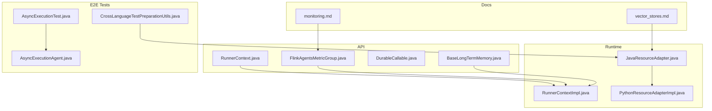
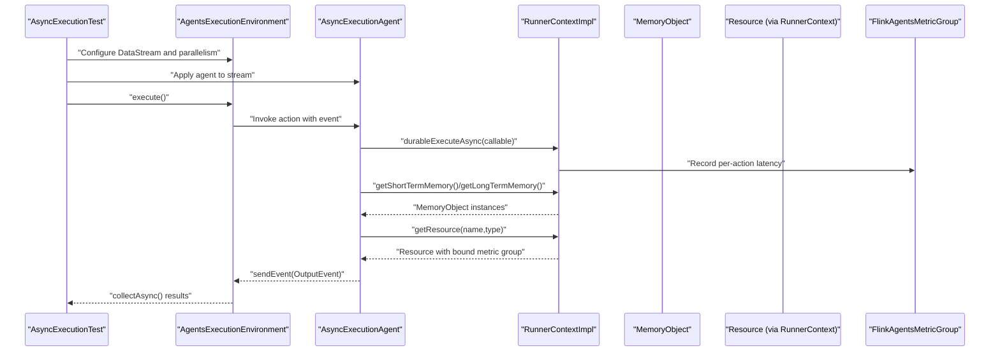
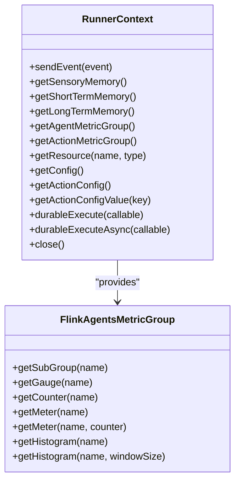
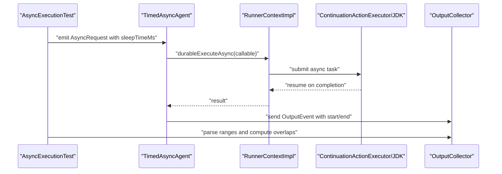
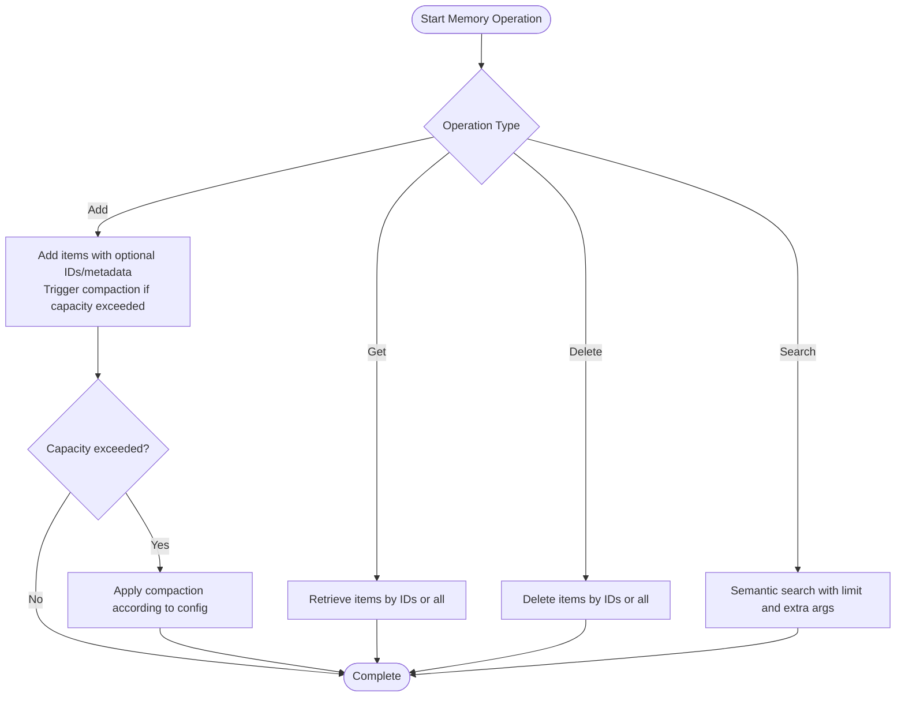
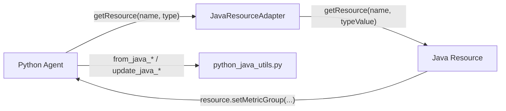
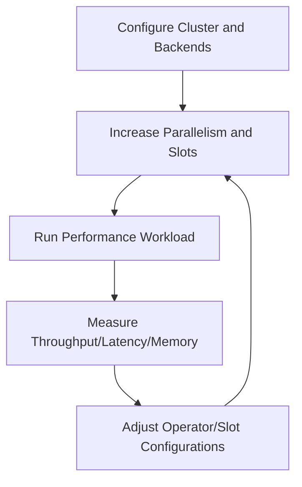
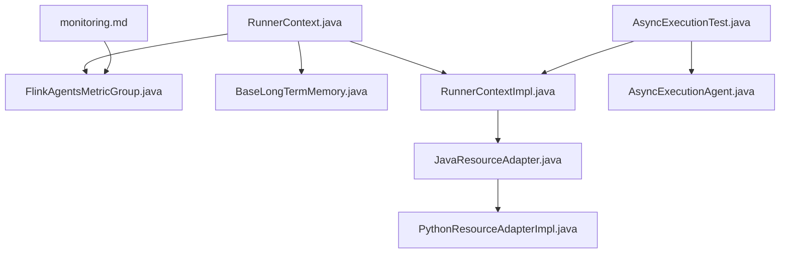

# Performance Testing

<cite>
**Referenced Files in This Document**
- [FlinkAgentsMetricGroup.java](file://api/src/main/java/org/apache/flink/agents/api/metrics/FlinkAgentsMetricGroup.java)
- [RunnerContext.java](file://api/src/main/java/org/apache/flink/agents/api/context/RunnerContext.java)
- [DurableCallable.java](file://api/src/main/java/org/apache/flink/agents/api/context/DurableCallable.java)
- [BaseLongTermMemory.java](file://api/src/main/java/org/apache/flink/agents/api/memory/BaseLongTermMemory.java)
- [RunnerContextImpl.java](file://runtime/src/main/java/org/apache/flink/agents/runtime/context/RunnerContextImpl.java)
- [AsyncExecutionTest.java](file://e2e-test/flink-agents-end-to-end-tests-integration/src/test/java/org/apache/flink/agents/integration/test/AsyncExecutionTest.java)
- [AsyncExecutionAgent.java](file://e2e-test/flink-agents-end-to-end-tests-integration/src/test/java/org/apache/flink/agents/integration/test/AsyncExecutionAgent.java)
- [CrossLanguageTestPreparationUtils.java](file://e2e-test/flink-agents-end-to-end-tests-resource-cross-language/src/test/java/org/apache/flink/agents/resource/test/CrossLanguageTestPreparationUtils.java)
- [monitoring.md](file://docs/content/docs/operations/monitoring.md)
- [vector_stores.md](file://docs/content/docs/development/vector_stores.md)
- [JavaResourceAdapter.java](file://runtime/src/main/java/org/apache/flink/agents/runtime/python/utils/JavaResourceAdapter.java)
- [PythonResourceAdapterImpl.java](file://runtime/src/main/java/org/apache/flink/agents/runtime/python/utils/PythonResourceAdapterImpl.java)
- [python_java_utils.py](file://python/flink_agents/runtime/python_java_utils.py)
- [RescalingTest.java](file://runtime/src/test/java/org/apache/flink/agents/runtime/RescalingTest.java)
</cite>

## Table of Contents
1. [Introduction](#introduction)
2. [Project Structure](#project-structure)
3. [Core Components](#core-components)
4. [Architecture Overview](#architecture-overview)
5. [Detailed Component Analysis](#detailed-component-analysis)
6. [Dependency Analysis](#dependency-analysis)
7. [Performance Considerations](#performance-considerations)
8. [Troubleshooting Guide](#troubleshooting-guide)
9. [Conclusion](#conclusion)
10. [Appendices](#appendices)

## Introduction
This document provides a comprehensive guide to performance testing methodologies for Flink Agents. It focuses on load testing strategies for agent execution, memory operations, and resource utilization. It explains how to measure and optimize agent throughput, latency, and resource consumption, and covers benchmarking, stress testing, and scalability testing. Guidance is included for monitoring metrics during performance tests, identifying bottlenecks, and optimizing agent configurations. Special attention is given to asynchronous execution patterns, memory management under load, and cross-language communication overhead.

## Project Structure
The performance testing landscape in Flink Agents spans several modules:
- API module defines the metrics, context, and memory interfaces used by agents.
- Runtime module implements the execution context and resource adapters for cross-language interoperability.
- E2E tests demonstrate async execution, timing, and cross-language resource usage.
- Docs describe built-in metrics and monitoring practices.

**Diagram sources**
- [FlinkAgentsMetricGroup.java](file://api/src/main/java/org/apache/flink/agents/api/metrics/FlinkAgentsMetricGroup.java#L30-L92)
- [RunnerContext.java](file://api/src/main/java/org/apache/flink/agents/api/context/RunnerContext.java#L33-L137)
- [DurableCallable.java](file://api/src/main/java/org/apache/flink/agents/api/context/DurableCallable.java#L29-L49)
- [BaseLongTermMemory.java](file://api/src/main/java/org/apache/flink/agents/api/memory/BaseLongTermMemory.java#L33-L133)
- [RunnerContextImpl.java](file://runtime/src/main/java/org/apache/flink/agents/runtime/context/RunnerContextImpl.java#L222-L231)
- [JavaResourceAdapter.java](file://runtime/src/main/java/org/apache/flink/agents/runtime/python/utils/JavaResourceAdapter.java#L34-L56)
- [PythonResourceAdapterImpl.java](file://runtime/src/main/java/org/apache/flink/agents/runtime/python/utils/PythonResourceAdapterImpl.java#L49-L79)
- [AsyncExecutionTest.java](file://e2e-test/flink-agents-end-to-end-tests-integration/src/test/java/org/apache/flink/agents/integration/test/AsyncExecutionTest.java#L36-L391)
- [AsyncExecutionAgent.java](file://e2e-test/flink-agents-end-to-end-tests-integration/src/test/java/org/apache/flink/agents/integration/test/AsyncExecutionAgent.java#L279-L301)
- [CrossLanguageTestPreparationUtils.java](file://e2e-test/flink-agents-end-to-end-tests-resource-cross-language/src/test/java/org/apache/flink/agents/resource/test/CrossLanguageTestPreparationUtils.java#L27-L81)
- [monitoring.md](file://docs/content/docs/operations/monitoring.md#L25-L162)
- [vector_stores.md](file://docs/content/docs/development/vector_stores.md#L609-L624)

**Section sources**
- [FlinkAgentsMetricGroup.java](file://api/src/main/java/org/apache/flink/agents/api/metrics/FlinkAgentsMetricGroup.java#L30-L92)
- [RunnerContext.java](file://api/src/main/java/org/apache/flink/agents/api/context/RunnerContext.java#L33-L137)
- [RunnerContextImpl.java](file://runtime/src/main/java/org/apache/flink/agents/runtime/context/RunnerContextImpl.java#L222-L231)
- [monitoring.md](file://docs/content/docs/operations/monitoring.md#L25-L162)

## Core Components
- Metrics and instrumentation: The metric group interface exposes counters, meters, and histograms for throughput and latency measurement.
- Execution context: The runner context provides access to memory, resources, and durable execution APIs for async and sync operations.
- Durable execution: Callable contracts ensure deterministic caching and recovery for long-running operations.
- Memory management: Long-term memory interfaces define capacity-aware storage and retrieval for large datasets.
- Cross-language adapters: Resource adapters facilitate Python-Java interoperability for chat models, tools, prompts, and vector stores.

Key responsibilities:
- Throughput and latency: Track event/action rates and per-action latencies.
- Async behavior: Validate parallelism on JDK 21+ and sequential fallback on older versions.
- Memory scaling: Measure long-term memory add/search performance and compaction impact.
- Cross-language overhead: Benchmark resource acquisition and serialization costs.

**Section sources**
- [FlinkAgentsMetricGroup.java](file://api/src/main/java/org/apache/flink/agents/api/metrics/FlinkAgentsMetricGroup.java#L30-L92)
- [RunnerContext.java](file://api/src/main/java/org/apache/flink/agents/api/context/RunnerContext.java#L33-L137)
- [DurableCallable.java](file://api/src/main/java/org/apache/flink/agents/api/context/DurableCallable.java#L29-L49)
- [BaseLongTermMemory.java](file://api/src/main/java/org/apache/flink/agents/api/memory/BaseLongTermMemory.java#L33-L133)
- [RunnerContextImpl.java](file://runtime/src/main/java/org/apache/flink/agents/runtime/context/RunnerContextImpl.java#L222-L231)

## Architecture Overview
The performance testing architecture integrates metrics collection, async execution, and cross-language resource access. E2E tests exercise async execution and timing, while docs define built-in metrics and monitoring.

**Diagram sources**
- [AsyncExecutionTest.java](file://e2e-test/flink-agents-end-to-end-tests-integration/src/test/java/org/apache/flink/agents/integration/test/AsyncExecutionTest.java#L44-L96)
- [AsyncExecutionAgent.java](file://e2e-test/flink-agents-end-to-end-tests-integration/src/test/java/org/apache/flink/agents/integration/test/AsyncExecutionAgent.java#L279-L301)
- [RunnerContextImpl.java](file://runtime/src/main/java/org/apache/flink/agents/runtime/context/RunnerContextImpl.java#L222-L231)
- [FlinkAgentsMetricGroup.java](file://api/src/main/java/org/apache/flink/agents/api/metrics/FlinkAgentsMetricGroup.java#L30-L92)

## Detailed Component Analysis

### Metrics and Instrumentation
- Metric types: Counters, meters, and histograms are exposed via the metric group interface. Users can attach metrics to agent-wide and per-action scopes.
- Built-in metrics: The documentation enumerates event and action counters and per-second meters, plus token usage metrics for chat models.
- Custom metrics: Examples show how to increment counters, mark meters, and record histograms for latency.

Recommended performance metrics:
- Throughput: Count of processed events and actions; per-second meters.
- Latency: Per-action histograms capturing millisecond latencies.
- Token usage: Prompt and completion token counts for LLM-involved actions.

**Diagram sources**
- [FlinkAgentsMetricGroup.java](file://api/src/main/java/org/apache/flink/agents/api/metrics/FlinkAgentsMetricGroup.java#L30-L92)
- [RunnerContext.java](file://api/src/main/java/org/apache/flink/agents/api/context/RunnerContext.java#L33-L137)

**Section sources**
- [FlinkAgentsMetricGroup.java](file://api/src/main/java/org/apache/flink/agents/api/metrics/FlinkAgentsMetricGroup.java#L30-L92)
- [RunnerContext.java](file://api/src/main/java/org/apache/flink/agents/api/context/RunnerContext.java#L33-L137)
- [monitoring.md](file://docs/content/docs/operations/monitoring.md#L31-L50)
- [monitoring.md](file://docs/content/docs/operations/monitoring.md#L51-L109)

### Asynchronous Execution and Parallelism
- Async execution: The runner context supports durable async execution with a callable contract ensuring stable identifiers and deterministic recovery.
- Parallelism validation: E2E tests verify that async tasks run in parallel on JDK 21+ (overlapping execution windows) and sequentially on older JDKs.
- Multi-key concurrency: Tests demonstrate concurrent processing across multiple keys with configurable parallelism.

Testing patterns:
- Load with multiple keys and varying sleep durations to assess overlap and throughput.
- Measure end-to-end latency distributions using histograms.
- Validate recovery behavior by reusing durable callable IDs.

**Diagram sources**
- [AsyncExecutionTest.java](file://e2e-test/flink-agents-end-to-end-tests-integration/src/test/java/org/apache/flink/agents/integration/test/AsyncExecutionTest.java#L219-L334)
- [AsyncExecutionAgent.java](file://e2e-test/flink-agents-end-to-end-tests-integration/src/test/java/org/apache/flink/agents/integration/test/AsyncExecutionAgent.java#L279-L301)
- [RunnerContext.java](file://api/src/main/java/org/apache/flink/agents/api/context/RunnerContext.java#L122-L133)

**Section sources**
- [RunnerContext.java](file://api/src/main/java/org/apache/flink/agents/api/context/RunnerContext.java#L122-L133)
- [DurableCallable.java](file://api/src/main/java/org/apache/flink/agents/api/context/DurableCallable.java#L29-L49)
- [AsyncExecutionTest.java](file://e2e-test/flink-agents-end-to-end-tests-integration/src/test/java/org/apache/flink/agents/integration/test/AsyncExecutionTest.java#L219-L334)

### Memory Operations and Long-Term Memory
- Capacity-aware storage: Long-term memory interfaces define creation, retrieval, deletion, and semantic search with capacity limits and compaction.
- Performance considerations: Add/search operations scale with dataset size; compaction impacts write amplification and latency.
- Testing strategies: Benchmark add/get/delete/search under increasing dataset sizes and monitor throughput and latency histograms.

**Diagram sources**
- [BaseLongTermMemory.java](file://api/src/main/java/org/apache/flink/agents/api/memory/BaseLongTermMemory.java#L33-L133)

**Section sources**
- [BaseLongTermMemory.java](file://api/src/main/java/org/apache/flink/agents/api/memory/BaseLongTermMemory.java#L33-L133)

### Cross-Language Communication Overhead
- Resource wrappers: Java and Python resource adapters enable cross-language resource access for chat models, tools, prompts, and vector stores.
- Interop utilities: Serialization and conversion helpers translate between Java and Python representations.
- Testing preparation: Utilities start external servers (e.g., MCP server) and pull models for integration tests.

Performance implications:
- Resource acquisition cost: Retrieving resources via adapters introduces overhead; cache and reuse resources when possible.
- Serialization/deserialization: Converting complex objects across languages adds latency; minimize object sizes and frequency.
- External service round trips: Chat models and vector stores incur network latency; batch operations where feasible.

**Diagram sources**
- [JavaResourceAdapter.java](file://runtime/src/main/java/org/apache/flink/agents/runtime/python/utils/JavaResourceAdapter.java#L34-L56)
- [PythonResourceAdapterImpl.java](file://runtime/src/main/java/org/apache/flink/agents/runtime/python/utils/PythonResourceAdapterImpl.java#L49-L79)
- [python_java_utils.py](file://python/flink_agents/runtime/python_java_utils.py#L196-L226)
- [RunnerContextImpl.java](file://runtime/src/main/java/org/apache/flink/agents/runtime/context/RunnerContextImpl.java#L222-L231)

**Section sources**
- [JavaResourceAdapter.java](file://runtime/src/main/java/org/apache/flink/agents/runtime/python/utils/JavaResourceAdapter.java#L34-L56)
- [PythonResourceAdapterImpl.java](file://runtime/src/main/java/org/apache/flink/agents/runtime/python/utils/PythonResourceAdapterImpl.java#L49-L79)
- [python_java_utils.py](file://python/flink_agents/runtime/python_java_utils.py#L196-L226)
- [vector_stores.md](file://docs/content/docs/development/vector_stores.md#L609-L624)
- [CrossLanguageTestPreparationUtils.java](file://e2e-test/flink-agents-end-to-end-tests-resource-cross-language/src/test/java/org/apache/flink/agents/resource/test/CrossLanguageTestPreparationUtils.java#L27-L81)

### Scalability Testing Methodologies
- Rescaling scenarios: Tests demonstrate rescaling with different state backends and slot configurations, validating job behavior under increased parallelism.
- State backend impact: Different backends (e.g., hashmap vs RocksDB) influence checkpointing and recovery performance.
- Slot allocation: Increasing slots per TaskManager affects throughput and memory footprint.

**Diagram sources**
- [RescalingTest.java](file://runtime/src/test/java/org/apache/flink/agents/runtime/RescalingTest.java#L90-L145)

**Section sources**
- [RescalingTest.java](file://runtime/src/test/java/org/apache/flink/agents/runtime/RescalingTest.java#L90-L145)

## Dependency Analysis
The performance-critical dependencies include:
- RunnerContext to FlinkAgentsMetricGroup for metrics.
- RunnerContext to BaseLongTermMemory for persistent storage.
- Cross-language adapters bridging Python and Java resource access.
- E2E tests validating async execution and timing.

**Diagram sources**
- [RunnerContext.java](file://api/src/main/java/org/apache/flink/agents/api/context/RunnerContext.java#L33-L137)
- [FlinkAgentsMetricGroup.java](file://api/src/main/java/org/apache/flink/agents/api/metrics/FlinkAgentsMetricGroup.java#L30-L92)
- [BaseLongTermMemory.java](file://api/src/main/java/org/apache/flink/agents/api/memory/BaseLongTermMemory.java#L33-L133)
- [RunnerContextImpl.java](file://runtime/src/main/java/org/apache/flink/agents/runtime/context/RunnerContextImpl.java#L222-L231)
- [JavaResourceAdapter.java](file://runtime/src/main/java/org/apache/flink/agents/runtime/python/utils/JavaResourceAdapter.java#L34-L56)
- [PythonResourceAdapterImpl.java](file://runtime/src/main/java/org/apache/flink/agents/runtime/python/utils/PythonResourceAdapterImpl.java#L49-L79)
- [AsyncExecutionTest.java](file://e2e-test/flink-agents-end-to-end-tests-integration/src/test/java/org/apache/flink/agents/integration/test/AsyncExecutionTest.java#L36-L391)
- [AsyncExecutionAgent.java](file://e2e-test/flink-agents-end-to-end-tests-integration/src/test/java/org/apache/flink/agents/integration/test/AsyncExecutionAgent.java#L279-L301)
- [monitoring.md](file://docs/content/docs/operations/monitoring.md#L25-L162)

**Section sources**
- [RunnerContext.java](file://api/src/main/java/org/apache/flink/agents/api/context/RunnerContext.java#L33-L137)
- [FlinkAgentsMetricGroup.java](file://api/src/main/java/org/apache/flink/agents/api/metrics/FlinkAgentsMetricGroup.java#L30-L92)
- [BaseLongTermMemory.java](file://api/src/main/java/org/apache/flink/agents/api/memory/BaseLongTermMemory.java#L33-L133)
- [RunnerContextImpl.java](file://runtime/src/main/java/org/apache/flink/agents/runtime/context/RunnerContextImpl.java#L222-L231)
- [JavaResourceAdapter.java](file://runtime/src/main/java/org/apache/flink/agents/runtime/python/utils/JavaResourceAdapter.java#L34-L56)
- [PythonResourceAdapterImpl.java](file://runtime/src/main/java/org/apache/flink/agents/runtime/python/utils/PythonResourceAdapterImpl.java#L49-L79)
- [AsyncExecutionTest.java](file://e2e-test/flink-agents-end-to-end-tests-integration/src/test/java/org/apache/flink/agents/integration/test/AsyncExecutionTest.java#L36-L391)
- [AsyncExecutionAgent.java](file://e2e-test/flink-agents-end-to-end-tests-integration/src/test/java/org/apache/flink/agents/integration/test/AsyncExecutionAgent.java#L279-L301)
- [monitoring.md](file://docs/content/docs/operations/monitoring.md#L25-L162)

## Performance Considerations
- Throughput optimization
  - Increase parallelism thoughtfully; monitor backpressure and checkpoint overhead.
  - Use durable async execution for IO-bound steps to keep operators responsive.
  - Batch resource acquisitions and reuse where appropriate to reduce cross-language overhead.
- Latency optimization
  - Record per-action histograms to identify hotspots.
  - Prefer short-term memory for transient data; offload large artifacts to long-term memory with careful capacity planning.
  - Minimize serialization/deserialization by limiting object sizes and frequencies.
- Resource consumption
  - Monitor memory usage during compaction and search operations.
  - Tune state backend and checkpoint intervals for your workload.
  - For cross-language resources, pre-warm models and cache frequently used resources.

[No sources needed since this section provides general guidance]

## Troubleshooting Guide
Common performance issues and remedies:
- No parallelism on JDK < 21
  - Symptom: Sequential execution with zero overlaps.
  - Remedy: Upgrade to JDK 21+ or refactor async logic to avoid continuation-dependent paths.
- Excessive contention on memory access
  - Symptom: Exceptions or stalls when accessing memory from non-mailbox threads.
  - Remedy: Use durableExecute/durableExecuteAsync and avoid direct memory access outside mailbox threads.
- Cross-language overhead spikes
  - Symptom: Elevated latency due to resource acquisition or serialization.
  - Remedy: Cache resources, reduce object sizes, and batch operations.
- State backend bottlenecks
  - Symptom: Slow checkpoints or recovery times.
  - Remedy: Choose appropriate backend and tune checkpoint/savepoint directories.

**Section sources**
- [AsyncExecutionTest.java](file://e2e-test/flink-agents-end-to-end-tests-integration/src/test/java/org/apache/flink/agents/integration/test/AsyncExecutionTest.java#L310-L331)
- [RunnerContextImpl.java](file://runtime/src/main/java/org/apache/flink/agents/runtime/context/RunnerContextImpl.java#L194-L231)
- [CrossLanguageTestPreparationUtils.java](file://e2e-test/flink-agents-end-to-end-tests-resource-cross-language/src/test/java/org/apache/flink/agents/resource/test/CrossLanguageTestPreparationUtils.java#L27-L81)

## Conclusion
Effective performance testing in Flink Agents requires a combination of robust metrics instrumentation, validated async execution behavior, and careful memory and cross-language resource management. By leveraging built-in metrics, E2E tests, and targeted scalability experiments, teams can measure throughput, latency, and resource consumption, identify bottlenecks, and iteratively optimize configurations for production workloads.

[No sources needed since this section summarizes without analyzing specific files]

## Appendices
- Benchmarking checklist
  - Define SLOs for throughput and latency.
  - Instrument counters/meters/histograms for events/actions and per-action latencies.
  - Validate async parallelism across JDK versions.
  - Stress test memory operations with increasing dataset sizes.
  - Measure cross-language overhead and optimize resource usage.
  - Evaluate scalability with different state backends and slot allocations.

[No sources needed since this section provides general guidance]