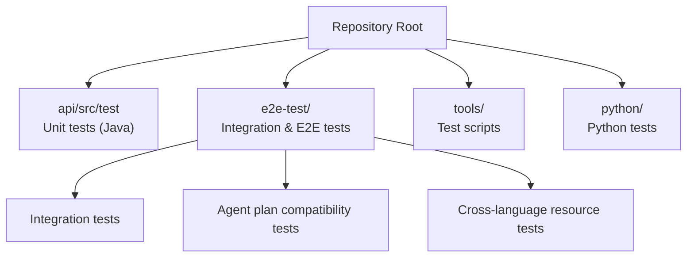
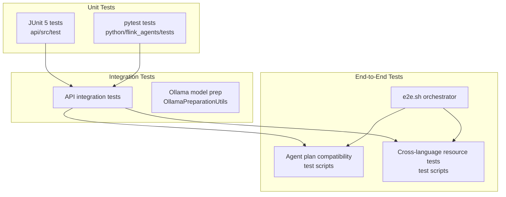
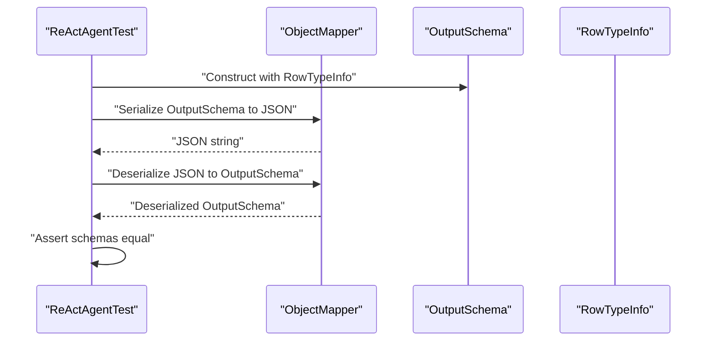
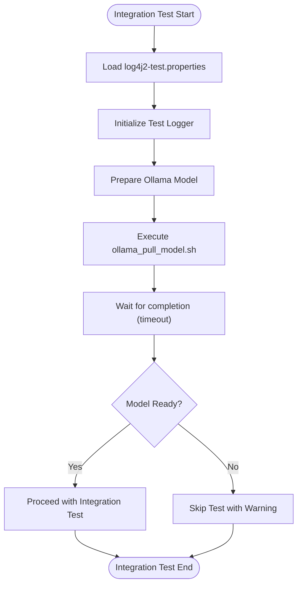
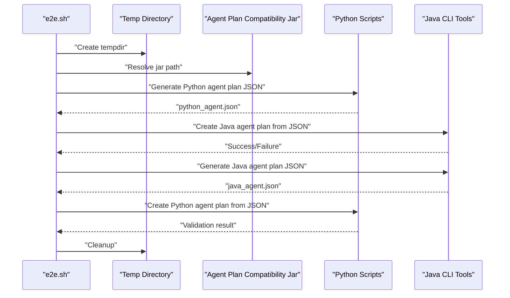
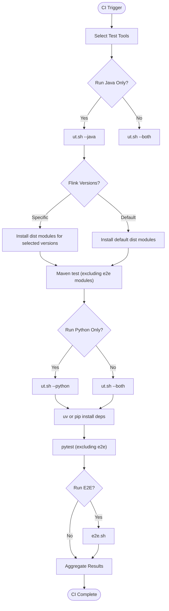
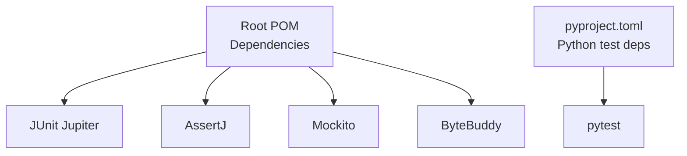

# Test Infrastructure and Utilities

<cite>
**Referenced Files in This Document**
- [pom.xml](file://pom.xml)
- [ut.sh](file://tools/ut.sh)
- [e2e.sh](file://tools/e2e.sh)
- [test_agent_plan_compatibility.sh](file://e2e-test/test-scripts/test_agent_plan_compatibility.sh)
- [test_resource_cross_language.sh](file://e2e-test/test-scripts/test_resource_cross_language.sh)
- [OllamaPreparationUtils.java](file://e2e-test/flink-agents-end-to-end-tests-integration/src/test/java/org/apache/flink/agents/integration/test/OllamaPreparationUtils.java)
- [log4j2-test.properties](file://e2e-test/flink-agents-end-to-end-tests-integration/src/test/resources/log4j2-test.properties)
- [pyproject.toml](file://python/pyproject.toml)
- [ReActAgentTest.java](file://api/src/test/java/org/apache/flink/agents/api/agents/ReActAgentTest.java)
</cite>

## Table of Contents
1. [Introduction](#introduction)
2. [Project Structure](#project-structure)
3. [Core Components](#core-components)
4. [Architecture Overview](#architecture-overview)
5. [Detailed Component Analysis](#detailed-component-analysis)
6. [Dependency Analysis](#dependency-analysis)
7. [Performance Considerations](#performance-considerations)
8. [Troubleshooting Guide](#troubleshooting-guide)
9. [Conclusion](#conclusion)
10. [Appendices](#appendices)

## Introduction
This document describes the test infrastructure and utilities used across unit and integration tests in Flink Agents. It explains the testing framework architecture, test utilities, and helper classes used in unit and integration tests. It also covers test environment setup, mock resource creation, and test data management strategies. The document details the test script infrastructure, automated testing pipelines, and continuous integration practices. Guidance is provided on writing reusable test utilities, managing test dependencies, and organizing test resources. Finally, it addresses debugging test failures, test reporting mechanisms, and maintaining test reliability across different environments.

## Project Structure
The repository organizes tests across multiple modules:
- Unit tests for the Java API module reside under api/src/test.
- Integration and end-to-end tests are organized under e2e-test, including separate modules for agent plan compatibility, integration, and cross-language resource tests.
- Python tests live under python/flink_agents and are orchestrated via pyproject.toml and pytest.
- Test orchestration is handled by shell scripts under tools/, including ut.sh for unified Java/Python test runs and e2e.sh for end-to-end scenarios.

**Diagram sources**
- [pom.xml](file://pom.xml#L58-L67)
- [ut.sh](file://tools/ut.sh#L1-L328)
- [e2e.sh](file://tools/e2e.sh#L1-L166)

**Section sources**
- [pom.xml](file://pom.xml#L58-L67)
- [ut.sh](file://tools/ut.sh#L1-L328)
- [e2e.sh](file://tools/e2e.sh#L1-L166)

## Core Components
- Testing frameworks and libraries:
  - JUnit 5 for Java unit tests.
  - AssertJ and Mockito for assertions and mocking.
  - pytest for Python tests.
- Logging configuration for tests:
  - Log4j2 test properties to control logging verbosity during test runs.
- Test utilities:
  - Ollama preparation utilities for pulling models used in integration tests.
- Orchestration:
  - Shell scripts to run Java and Python tests, manage Flink versions, and coordinate end-to-end tests.

Key implementation references:
- JUnit, AssertJ, and Mockito dependencies are declared at the root level.
- Test logging configuration is provided under e2e-test integration test resources.
- Ollama preparation utilities are implemented in Java for integration tests.
- Python test dependencies and groups are defined in pyproject.toml.

**Section sources**
- [pom.xml](file://pom.xml#L82-L107)
- [log4j2-test.properties](file://e2e-test/flink-agents-end-to-end-tests-integration/src/test/resources/log4j2-test.properties#L1-L29)
- [OllamaPreparationUtils.java](file://e2e-test/flink-agents-end-to-end-tests-integration/src/test/java/org/apache/flink/agents/integration/test/OllamaPreparationUtils.java#L1-L48)
- [pyproject.toml](file://python/pyproject.toml#L85-L88)

## Architecture Overview
The testing architecture combines unit, integration, and end-to-end layers:
- Unit tests validate isolated components (e.g., serialization of OutputSchema).
- Integration tests validate cross-module behavior and external dependencies (e.g., Ollama model pulls).
- End-to-end tests validate cross-language compatibility and resource interoperability.

**Diagram sources**
- [ReActAgentTest.java](file://api/src/test/java/org/apache/flink/agents/api/agents/ReActAgentTest.java#L1-L45)
- [OllamaPreparationUtils.java](file://e2e-test/flink-agents-end-to-end-tests-integration/src/test/java/org/apache/flink/agents/integration/test/OllamaPreparationUtils.java#L1-L48)
- [test_agent_plan_compatibility.sh](file://e2e-test/test-scripts/test_agent_plan_compatibility.sh#L1-L78)
- [test_resource_cross_language.sh](file://e2e-test/test-scripts/test_resource_cross_language.sh#L1-L42)
- [e2e.sh](file://tools/e2e.sh#L1-L166)

## Detailed Component Analysis

### Unit Test Utilities and Patterns
- Serialization validation:
  - Example: OutputSchema serialization test validates round-trip JSON serialization and schema equality.
- Best practices:
  - Keep unit tests focused and deterministic.
  - Use small, isolated test subjects and minimal external dependencies.

**Diagram sources**
- [ReActAgentTest.java](file://api/src/test/java/org/apache/flink/agents/api/agents/ReActAgentTest.java#L30-L43)

**Section sources**
- [ReActAgentTest.java](file://api/src/test/java/org/apache/flink/agents/api/agents/ReActAgentTest.java#L1-L45)

### Integration Test Environment Setup
- Logging configuration:
  - Controls root logger level and console appender pattern for test output.
- External service preparation:
  - Ollama model pull automation via a helper utility that executes a shell script bundled with tests.

**Diagram sources**
- [log4j2-test.properties](file://e2e-test/flink-agents-end-to-end-tests-integration/src/test/resources/log4j2-test.properties#L19-L28)
- [OllamaPreparationUtils.java](file://e2e-test/flink-agents-end-to-end-tests-integration/src/test/java/org/apache/flink/agents/integration/test/OllamaPreparationUtils.java#L30-L46)

**Section sources**
- [log4j2-test.properties](file://e2e-test/flink-agents-end-to-end-tests-integration/src/test/resources/log4j2-test.properties#L1-L29)
- [OllamaPreparationUtils.java](file://e2e-test/flink-agents-end-to-end-tests-integration/src/test/java/org/apache/flink/agents/integration/test/OllamaPreparationUtils.java#L1-L48)

### End-to-End Test Script Infrastructure
- Orchestrator:
  - e2e.sh coordinates multiple end-to-end test scenarios, manages temporary directories, and aggregates pass/fail counts.
- Agent plan compatibility:
  - test_agent_plan_compatibility.sh generates agent plans in one language and validates creation of compatible plans in the other language using Java CLI tools.
- Cross-language resource tests:
  - test_resource_cross_language.sh executes Maven-based tests for cross-language resource interoperability.

**Diagram sources**
- [e2e.sh](file://tools/e2e.sh#L115-L161)
- [test_agent_plan_compatibility.sh](file://e2e-test/test-scripts/test_agent_plan_compatibility.sh#L36-L77)

**Section sources**
- [e2e.sh](file://tools/e2e.sh#L1-L166)
- [test_agent_plan_compatibility.sh](file://e2e-test/test-scripts/test_agent_plan_compatibility.sh#L1-L78)
- [test_resource_cross_language.sh](file://e2e-test/test-scripts/test_resource_cross_language.sh#L1-L42)

### Automated Testing Pipelines and Continuous Integration Practices
- Unified test runner:
  - ut.sh supports running Java and Python tests independently or together, selecting Flink versions, and toggling verbose output.
- End-to-end pipeline:
  - e2e.sh builds artifacts, ensures Python dependencies, and executes targeted end-to-end scenarios.
- Dependency management:
  - Python test dependencies are grouped under pyproject.toml, enabling deterministic installs via uv or pip.

**Diagram sources**
- [ut.sh](file://tools/ut.sh#L67-L108)
- [ut.sh](file://tools/ut.sh#L122-L196)
- [ut.sh](file://tools/ut.sh#L198-L284)
- [e2e.sh](file://tools/e2e.sh#L20-L86)

**Section sources**
- [ut.sh](file://tools/ut.sh#L1-L328)
- [pyproject.toml](file://python/pyproject.toml#L85-L88)
- [e2e.sh](file://tools/e2e.sh#L1-L166)

### Test Data Management Strategies
- Controlled logging:
  - log4j2-test.properties sets a conservative root logger level and a console appender pattern to reduce noise while preserving debuggability.
- Temporary directories:
  - e2e.sh creates a temporary directory for intermediate artifacts and cleans it up after tests.
- Bundled resources:
  - Shell scripts and model preparation utilities rely on resources packaged alongside tests.

**Section sources**
- [log4j2-test.properties](file://e2e-test/flink-agents-end-to-end-tests-integration/src/test/resources/log4j2-test.properties#L19-L28)
- [e2e.sh](file://tools/e2e.sh#L115-L161)
- [OllamaPreparationUtils.java](file://e2e-test/flink-agents-end-to-end-tests-integration/src/test/java/org/apache/flink/agents/integration/test/OllamaPreparationUtils.java#L30-L37)

### Writing Reusable Test Utilities
- Encapsulate environment setup:
  - Centralize external service preparation (e.g., model pulls) in helper classes or scripts.
- Parameterize test runs:
  - Support multiple Flink versions and selective test execution via command-line options.
- Standardize logging:
  - Use a shared logging configuration for consistent test output.

**Section sources**
- [OllamaPreparationUtils.java](file://e2e-test/flink-agents-end-to-end-tests-integration/src/test/java/org/apache/flink/agents/integration/test/OllamaPreparationUtils.java#L1-L48)
- [ut.sh](file://tools/ut.sh#L67-L108)
- [log4j2-test.properties](file://e2e-test/flink-agents-end-to-end-tests-integration/src/test/resources/log4j2-test.properties#L19-L28)

### Managing Test Dependencies
- Java:
  - Dependencies are managed centrally with JUnit, AssertJ, and Mockito declared at the root level.
- Python:
  - Test dependencies are grouped under pyproject.toml, enabling deterministic installs via uv or pip.

**Section sources**
- [pom.xml](file://pom.xml#L82-L107)
- [pyproject.toml](file://python/pyproject.toml#L85-L88)

### Organizing Test Resources
- Place test-specific resources under module test resources directories.
- Use scripts to stage resources and ensure they are available at runtime.
- Keep resource paths configurable and resilient to working directory changes.

**Section sources**
- [OllamaPreparationUtils.java](file://e2e-test/flink-agents-end-to-end-tests-integration/src/test/java/org/apache/flink/agents/integration/test/OllamaPreparationUtils.java#L30-L37)
- [test_agent_plan_compatibility.sh](file://e2e-test/test-scripts/test_agent_plan_compatibility.sh#L20-L27)

## Dependency Analysis
The testing stack relies on:
- Java: JUnit Jupiter, AssertJ, Mockito, ByteBuddy.
- Python: pytest for test execution and discovery.
- Orchestration: Maven for Java modules and shell scripts for cross-language coordination.

**Diagram sources**
- [pom.xml](file://pom.xml#L82-L107)
- [pyproject.toml](file://python/pyproject.toml#L85-L88)

**Section sources**
- [pom.xml](file://pom.xml#L82-L107)
- [pyproject.toml](file://python/pyproject.toml#L85-L88)

## Performance Considerations
- Favor lightweight unit tests over heavy integration tests.
- Parallelize independent test suites where appropriate.
- Minimize external service calls and cache results when feasible.
- Use deterministic fixtures and controlled randomness for reproducibility.

## Troubleshooting Guide
Common issues and remedies:
- Logging floods during CI:
  - Adjust root logger level in log4j2-test.properties to balance visibility and noise.
- External service unavailability:
  - Verify model pull scripts and network connectivity; consider skipping tests with warnings when prerequisites fail.
- Dependency mismatches:
  - Ensure consistent Python dependency resolution via uv or pip and pinned versions in pyproject.toml.
- Cross-language test failures:
  - Confirm that the correct Flink version is installed and that environment variables (e.g., PYTHONPATH) are set for cross-language scenarios.

**Section sources**
- [log4j2-test.properties](file://e2e-test/flink-agents-end-to-end-tests-integration/src/test/resources/log4j2-test.properties#L19-L28)
- [OllamaPreparationUtils.java](file://e2e-test/flink-agents-end-to-end-tests-integration/src/test/java/org/apache/flink/agents/integration/test/OllamaPreparationUtils.java#L30-L46)
- [pyproject.toml](file://python/pyproject.toml#L85-L88)
- [e2e.sh](file://tools/e2e.sh#L66-L76)

## Conclusion
The Flink Agents test infrastructure integrates unit, integration, and end-to-end layers with robust orchestration. Centralized logging, reusable helpers, and shell scripts enable reliable cross-language testing. By following the outlined practices—parameterizing test runs, standardizing logging, and organizing resources—you can maintain high-quality, portable tests across environments.

## Appendices
- Test execution references:
  - Java unit tests: api/src/test.
  - Integration tests: e2e-test modules.
  - Python tests: python/flink_agents/tests.
- Orchestration scripts:
  - ut.sh for unified Java/Python runs.
  - e2e.sh for end-to-end scenarios.