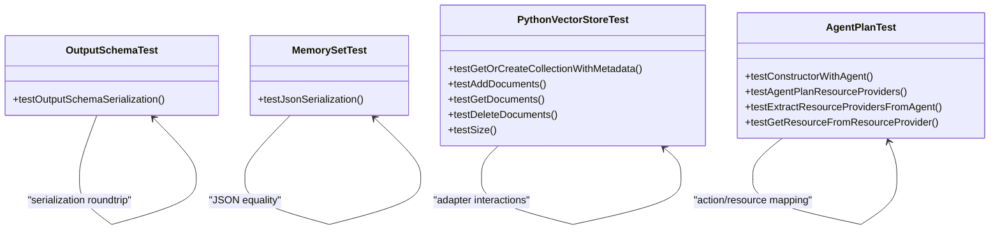

# Testing and Quality Assurance

<cite>
**Referenced Files in This Document**
- [pom.xml](file://pom.xml)
- [tools/ut.sh](file://tools/ut.sh)
- [tools/e2e.sh](file://tools/e2e.sh)
- [e2e-test/flink-agents-end-to-end-tests-integration/src/test/java/org/apache/flink/agents/integration/test/AsyncExecutionTest.java](file://e2e-test/flink-agents-end-to-end-tests-integration/src/test/java/org/apache/flink/agents/integration/test/AsyncExecutionTest.java)
- [e2e-test/flink-agents-end-to-end-tests-integration/src/test/java/org/apache/flink/agents/integration/test/ReActAgentTest.java](file://e2e-test/flink-agents-end-to-end-tests-integration/src/test/java/org/apache/flink/agents/integration/test/ReActAgentTest.java)
- [e2e-test/flink-agents-end-to-end-tests-integration/src/test/resources/log4j2-test.properties](file://e2e-test/flink-agents-end-to-end-tests-integration/src/test/resources/log4j2-test.properties)
- [e2e-test/flink-agents-end-to-end-tests-integration/src/test/java/org/apache/flink/agents/integration/test/OllamaPreparationUtils.java](file://e2e-test/flink-agents-end-to-end-tests-integration/src/test/java/org/apache/flink/agents/integration/test/OllamaPreparationUtils.java)
- [e2e-test/test-scripts/test_agent_plan_compatibility.sh](file://e2e-test/test-scripts/test_agent_plan_compatibility.sh)
- [e2e-test/test-scripts/test_resource_cross_language.sh](file://e2e-test/test-scripts/test_resource_cross_language.sh)
- [e2e-test/test-scripts/test_java_config_in_python.sh](file://e2e-test/test-scripts/test_java_config_in_python.sh)
- [api/src/test/java/org/apache/flink/agents/api/agents/ReActAgentTest.java](file://api/src/test/java/org/apache/flink/agents/api/agents/ReActAgentTest.java)
- [api/src/test/java/org/apache/flink/agents/api/memory/MemorySetTest.java](file://api/src/test/java/org/apache/flink/agents/api/memory/MemorySetTest.java)
- [api/src/test/java/org/apache/flink/agents/api/vectorstores/python/PythonCollectionManageableVectorStoreTest.java](file://api/src/test/java/org/apache/flink/agents/api/vectorstores/python/PythonCollectionManageableVectorStoreTest.java)
- [plan/src/test/java/org/apache/flink/agents/plan/AgentPlanTest.java](file://plan/src/test/java/org/apache/flink/agents/plan/AgentPlanTest.java)
- [python/pyproject.toml](file://python/pyproject.toml)
</cite>

## Table of Contents
1. [Introduction](#introduction)
2. [Project Structure](#project-structure)
3. [Core Components](#core-components)
4. [Architecture Overview](#architecture-overview)
5. [Detailed Component Analysis](#detailed-component-analysis)
6. [Dependency Analysis](#dependency-analysis)
7. [Performance Considerations](#performance-considerations)
8. [Troubleshooting Guide](#troubleshooting-guide)
9. [Conclusion](#conclusion)
10. [Appendices](#appendices)

## Introduction
This document provides comprehensive guidance for testing and quality assurance in Flink Agents. It covers unit testing strategies for agents, resources, and components; integration and end-to-end testing approaches with external services; testing infrastructure including utilities, mocks, and test data management; performance testing methodologies; load testing strategies; benchmarking approaches; continuous integration practices; automated testing pipelines; and quality gates. It also includes practical patterns for testing agent behavior, resource interactions, and memory management, along with debugging strategies for test failures.

## Project Structure
The repository is a multi-module Maven project with dedicated modules for API, Plan, Runtime, Integrations, Examples, Distribution, IDE Support, and End-to-End tests. The testing landscape spans:
- Unit tests in the API, Plan, and Runtime modules using JUnit 5 and AssertJ.
- Integration and end-to-end tests in the e2e-test module, leveraging Apache Flink’s streaming execution environment and external services (e.g., Ollama).
- Python-side tests in the python module using pytest.
- Centralized test orchestration via shell scripts for Java and Python test suites and end-to-end test runners.

**Diagram sources**
- [pom.xml](file://pom.xml#L58-L67)
- [tools/ut.sh](file://tools/ut.sh#L1-L328)
- [tools/e2e.sh](file://tools/e2e.sh#L1-L166)
- [e2e-test/flink-agents-end-to-end-tests-integration/src/test/resources/log4j2-test.properties](file://e2e-test/flink-agents-end-to-end-tests-integration/src/test/resources/log4j2-test.properties#L1-L29)

**Section sources**
- [pom.xml](file://pom.xml#L58-L67)
- [tools/ut.sh](file://tools/ut.sh#L122-L196)
- [tools/e2e.sh](file://tools/e2e.sh#L20-L86)

## Core Components
- Unit tests for agents and resources validate serialization, JSON roundtrip correctness, and resource provider extraction.
- Integration tests exercise asynchronous execution, durable execution, and agent behavior against real external services (e.g., Ollama).
- End-to-end tests validate cross-language resource compatibility and plan compatibility between Java and Python.
- Test utilities encapsulate service preparation and logging configuration for deterministic test runs.

Key unit test coverage areas:
- Output schema serialization for agents.
- Memory set JSON serialization and equality semantics.
- Python vector store wrapper behavior with mocked adapters.
- Agent plan construction, action mapping, and resource provider initialization.

**Section sources**
- [api/src/test/java/org/apache/flink/agents/api/agents/ReActAgentTest.java](file://api/src/test/java/org/apache/flink/agents/api/agents/ReActAgentTest.java#L29-L44)
- [api/src/test/java/org/apache/flink/agents/api/memory/MemorySetTest.java](file://api/src/test/java/org/apache/flink/agents/api/memory/MemorySetTest.java#L27-L42)
- [api/src/test/java/org/apache/flink/agents/api/vectorstores/python/PythonCollectionManageableVectorStoreTest.java](file://api/src/test/java/org/apache/flink/agents/api/vectorstores/python/PythonCollectionManageableVectorStoreTest.java#L47-L355)
- [plan/src/test/java/org/apache/flink/agents/plan/AgentPlanTest.java](file://plan/src/test/java/org/apache/flink/agents/plan/AgentPlanTest.java#L56-L482)

## Architecture Overview
The testing architecture integrates:
- Maven-based unit tests for Java modules.
- Shell-driven orchestration for Java and Python test suites.
- End-to-end test harnesses invoking Java and Python test suites and validating cross-language interoperability.
- Logging configuration tailored for test output.

**Diagram sources**
- [tools/ut.sh](file://tools/ut.sh#L122-L196)
- [tools/e2e.sh](file://tools/e2e.sh#L149-L154)
- [e2e-test/flink-agents-end-to-end-tests-integration/src/test/java/org/apache/flink/agents/integration/test/AsyncExecutionTest.java](file://e2e-test/flink-agents-end-to-end-tests-integration/src/test/java/org/apache/flink/agents/integration/test/AsyncExecutionTest.java#L44-L96)
- [e2e-test/flink-agents-end-to-end-tests-integration/src/test/java/org/apache/flink/agents/integration/test/ReActAgentTest.java](file://e2e-test/flink-agents-end-to-end-tests-integration/src/test/java/org/apache/flink/agents/integration/test/ReActAgentTest.java#L77-L153)

## Detailed Component Analysis

### Unit Testing Strategies
- Serialization and schema correctness:
  - Validate that output schemas serialize and deserialize consistently.
  - Validate that memory sets maintain equality across JSON roundtrips.
- Mock-based resource testing:
  - Use mocks to isolate Python resource adapters and verify method invocations and conversions.
- Plan construction and resource providers:
  - Verify action discovery, event mapping, and resource provider registration.

**Diagram sources**
- [api/src/test/java/org/apache/flink/agents/api/agents/ReActAgentTest.java](file://api/src/test/java/org/apache/flink/agents/api/agents/ReActAgentTest.java#L29-L44)
- [api/src/test/java/org/apache/flink/agents/api/memory/MemorySetTest.java](file://api/src/test/java/org/apache/flink/agents/api/memory/MemorySetTest.java#L27-L42)
- [api/src/test/java/org/apache/flink/agents/api/vectorstores/python/PythonCollectionManageableVectorStoreTest.java](file://api/src/test/java/org/apache/flink/agents/api/vectorstores/python/PythonCollectionManageableVectorStoreTest.java#L47-L355)
- [plan/src/test/java/org/apache/flink/agents/plan/AgentPlanTest.java](file://plan/src/test/java/org/apache/flink/agents/plan/AgentPlanTest.java#L247-L482)

**Section sources**
- [api/src/test/java/org/apache/flink/agents/api/agents/ReActAgentTest.java](file://api/src/test/java/org/apache/flink/agents/api/agents/ReActAgentTest.java#L29-L44)
- [api/src/test/java/org/apache/flink/agents/api/memory/MemorySetTest.java](file://api/src/test/java/org/apache/flink/agents/api/memory/MemorySetTest.java#L27-L42)
- [api/src/test/java/org/apache/flink/agents/api/vectorstores/python/PythonCollectionManageableVectorStoreTest.java](file://api/src/test/java/org/apache/flink/agents/api/vectorstores/python/PythonCollectionManageableVectorStoreTest.java#L76-L355)
- [plan/src/test/java/org/apache/flink/agents/plan/AgentPlanTest.java](file://plan/src/test/java/org/apache/flink/agents/plan/AgentPlanTest.java#L247-L482)

### Integration Testing Approaches
- Asynchronous execution:
  - Validate single async execution, chained async calls, concurrent processing across keys, and actual parallelism on JDK 21+.
- Agent behavior with external services:
  - Register chat model resources, configure tools, and assert output schema alignment with model responses.
- Logging and readiness checks:
  - Configure test logging and pre-warm external services (e.g., pull Ollama models) before running tests.

**Diagram sources**
- [e2e-test/flink-agents-end-to-end-tests-integration/src/test/java/org/apache/flink/agents/integration/test/AsyncExecutionTest.java](file://e2e-test/flink-agents-end-to-end-tests-integration/src/test/java/org/apache/flink/agents/integration/test/AsyncExecutionTest.java#L44-L96)

**Section sources**
- [e2e-test/flink-agents-end-to-end-tests-integration/src/test/java/org/apache/flink/agents/integration/test/AsyncExecutionTest.java](file://e2e-test/flink-agents-end-to-end-tests-integration/src/test/java/org/apache/flink/agents/integration/test/AsyncExecutionTest.java#L44-L391)
- [e2e-test/flink-agents-end-to-end-tests-integration/src/test/java/org/apache/flink/agents/integration/test/ReActAgentTest.java](file://e2e-test/flink-agents-end-to-end-tests-integration/src/test/java/org/apache/flink/agents/integration/test/ReActAgentTest.java#L77-L153)
- [e2e-test/flink-agents-end-to-end-tests-integration/src/test/resources/log4j2-test.properties](file://e2e-test/flink-agents-end-to-end-tests-integration/src/test/resources/log4j2-test.properties#L19-L29)
- [e2e-test/flink-agents-end-to-end-tests-integration/src/test/java/org/apache/flink/agents/integration/test/OllamaPreparationUtils.java](file://e2e-test/flink-agents-end-to-end-tests-integration/src/test/java/org/apache/flink/agents/integration/test/OllamaPreparationUtils.java#L30-L46)

### End-to-End Testing with External Services
- Cross-language resource compatibility:
  - Validate that Java and Python share compatible agent plans and configurations.
- Cross-language configuration:
  - Ensure Java configuration can be consumed by Python and vice versa.
- Resource cross-language tests:
  - Execute end-to-end scenarios spanning both Java and Python test suites.

**Diagram sources**
- [tools/e2e.sh](file://tools/e2e.sh#L149-L154)
- [e2e-test/test-scripts/test_agent_plan_compatibility.sh](file://e2e-test/test-scripts/test_agent_plan_compatibility.sh#L36-L77)
- [e2e-test/test-scripts/test_resource_cross_language.sh](file://e2e-test/test-scripts/test_resource_cross_language.sh)
- [e2e-test/test-scripts/test_java_config_in_python.sh](file://e2e-test/test-scripts/test_java_config_in_python.sh)

**Section sources**
- [tools/e2e.sh](file://tools/e2e.sh#L149-L154)
- [e2e-test/test-scripts/test_agent_plan_compatibility.sh](file://e2e-test/test-scripts/test_agent_plan_compatibility.sh#L36-L77)
- [e2e-test/test-scripts/test_resource_cross_language.sh](file://e2e-test/test-scripts/test_resource_cross_language.sh)
- [e2e-test/test-scripts/test_java_config_in_python.sh](file://e2e-test/test-scripts/test_java_config_in_python.sh)

### Testing Infrastructure and Utilities
- Test orchestration:
  - ut.sh orchestrates Java and Python test suites, supports Flink version targeting, and toggles verbose output.
  - e2e.sh drives end-to-end tests across Java and Python, aggregates pass/fail counts, and manages temporary artifacts.
- Logging:
  - log4j2-test.properties configures console logging for tests with a pattern layout.
- External service preparation:
  - OllamaPreparationUtils pulls required models prior to running ReAct agent tests.

**Diagram sources**
- [tools/ut.sh](file://tools/ut.sh#L122-L196)
- [tools/e2e.sh](file://tools/e2e.sh#L149-L154)
- [e2e-test/flink-agents-end-to-end-tests-integration/src/test/resources/log4j2-test.properties](file://e2e-test/flink-agents-end-to-end-tests-integration/src/test/resources/log4j2-test.properties#L19-L29)
- [e2e-test/flink-agents-end-to-end-tests-integration/src/test/java/org/apache/flink/agents/integration/test/OllamaPreparationUtils.java](file://e2e-test/flink-agents-end-to-end-tests-integration/src/test/java/org/apache/flink/agents/integration/test/OllamaPreparationUtils.java#L30-L46)

**Section sources**
- [tools/ut.sh](file://tools/ut.sh#L1-L328)
- [tools/e2e.sh](file://tools/e2e.sh#L1-L166)
- [e2e-test/flink-agents-end-to-end-tests-integration/src/test/resources/log4j2-test.properties](file://e2e-test/flink-agents-end-to-end-tests-integration/src/test/resources/log4j2-test.properties#L19-L29)
- [e2e-test/flink-agents-end-to-end-tests-integration/src/test/java/org/apache/flink/agents/integration/test/OllamaPreparationUtils.java](file://e2e-test/flink-agents-end-to-end-tests-integration/src/test/java/org/apache/flink/agents/integration/test/OllamaPreparationUtils.java#L30-L46)

### Performance Testing Methodologies
- Asynchronous execution parallelism:
  - Measure execution time ranges for async tasks and assert overlap on JDK 21+ to confirm true concurrency versus sequential execution on older JDKs.
- Throughput and latency:
  - Use Flink’s built-in metrics and custom gauges to record throughput and latency during DataStream/Table processing.
- Load testing:
  - Scale input DataStream cardinality and parallelism to evaluate backpressure and resource utilization.
- Benchmarking:
  - Compare execution times across JDK versions and Flink versions to establish baselines.

**Diagram sources**
- [e2e-test/flink-agents-end-to-end-tests-integration/src/test/java/org/apache/flink/agents/integration/test/AsyncExecutionTest.java](file://e2e-test/flink-agents-end-to-end-tests-integration/src/test/java/org/apache/flink/agents/integration/test/AsyncExecutionTest.java#L219-L334)

**Section sources**
- [e2e-test/flink-agents-end-to-end-tests-integration/src/test/java/org/apache/flink/agents/integration/test/AsyncExecutionTest.java](file://e2e-test/flink-agents-end-to-end-tests-integration/src/test/java/org/apache/flink/agents/integration/test/AsyncExecutionTest.java#L219-L334)

### Load Testing Strategies
- Keyed streams:
  - Validate concurrent processing across multiple keys to uncover contention and resource hotspots.
- High-volume inputs:
  - Increase element count per key and total keys to simulate production-like loads.
- Memory and state:
  - Monitor memory usage and state backend behavior under sustained load.

**Section sources**
- [e2e-test/flink-agents-end-to-end-tests-integration/src/test/java/org/apache/flink/agents/integration/test/AsyncExecutionTest.java](file://e2e-test/flink-agents-end-to-end-tests-integration/src/test/java/org/apache/flink/agents/integration/test/AsyncExecutionTest.java#L158-L207)

### Writing Effective Tests for Agent Behavior, Resource Interactions, and Memory Management
- Agent behavior:
  - Use deterministic inputs and assert on structured outputs; leverage schema validation and row-type info.
- Resource interactions:
  - Mock adapters for Python resources to isolate conversion and invocation logic; verify kwargs and return values.
- Memory management:
  - Serialize/deserialize memory sets and assert equality; validate compaction configuration effects indirectly via serialized form.

**Section sources**
- [api/src/test/java/org/apache/flink/agents/api/agents/ReActAgentTest.java](file://api/src/test/java/org/apache/flink/agents/api/agents/ReActAgentTest.java#L29-L44)
- [api/src/test/java/org/apache/flink/agents/api/memory/MemorySetTest.java](file://api/src/test/java/org/apache/flink/agents/api/memory/MemorySetTest.java#L27-L42)
- [api/src/test/java/org/apache/flink/agents/api/vectorstores/python/PythonCollectionManageableVectorStoreTest.java](file://api/src/test/java/org/apache/flink/agents/api/vectorstores/python/PythonCollectionManageableVectorStoreTest.java#L76-L355)

### Continuous Integration Practices, Automated Pipelines, and Quality Gates
- Orchestration:
  - ut.sh and e2e.sh provide standardized entry points for CI jobs to run Java and Python tests across multiple Flink versions.
- Quality gates:
  - Exit codes signal pass/fail states; CI should enforce non-zero exit codes as failures.
- Logging:
  - Configure log levels to reduce noise and enable targeted debugging.

**Section sources**
- [tools/ut.sh](file://tools/ut.sh#L176-L196)
- [tools/e2e.sh](file://tools/e2e.sh#L33-L38)
- [e2e-test/flink-agents-end-to-end-tests-integration/src/test/resources/log4j2-test.properties](file://e2e-test/flink-agents-end-to-end-tests-integration/src/test/resources/log4j2-test.properties#L19-L29)

### Test Patterns, Mocking Strategies, and Debugging Failures
- Test patterns:
  - Use JUnit assumptions to skip tests when prerequisites (e.g., external models) are unavailable.
  - Use AssertJ for fluent assertions and readable failure messages.
- Mocking strategies:
  - Use Mockito to stub PythonResourceAdapter interactions and verify argument maps.
- Debugging failures:
  - Enable console logging with log4j2-test.properties; inspect execution ranges in async tests to confirm parallelism; validate external service readiness via OllamaPreparationUtils.

**Section sources**
- [e2e-test/flink-agents-end-to-end-tests-integration/src/test/java/org/apache/flink/agents/integration/test/ReActAgentTest.java](file://e2e-test/flink-agents-end-to-end-tests-integration/src/test/java/org/apache/flink/agents/integration/test/ReActAgentTest.java#L77-L79)
- [api/src/test/java/org/apache/flink/agents/api/vectorstores/python/PythonCollectionManageableVectorStoreTest.java](file://api/src/test/java/org/apache/flink/agents/api/vectorstores/python/PythonCollectionManageableVectorStoreTest.java#L103-L127)
- [e2e-test/flink-agents-end-to-end-tests-integration/src/test/resources/log4j2-test.properties](file://e2e-test/flink-agents-end-to-end-tests-integration/src/test/resources/log4j2-test.properties#L19-L29)
- [e2e-test/flink-agents-end-to-end-tests-integration/src/test/java/org/apache/flink/agents/integration/test/OllamaPreparationUtils.java](file://e2e-test/flink-agents-end-to-end-tests-integration/src/test/java/org/apache/flink/agents/integration/test/OllamaPreparationUtils.java#L30-L46)

## Dependency Analysis
The testing stack relies on:
- JUnit 5, AssertJ, and Mockito for Java unit tests.
- pytest for Python tests.
- Shell scripts to coordinate builds and test execution.
- External services (e.g., Ollama) for integration tests.

**Diagram sources**
- [pom.xml](file://pom.xml#L82-L107)
- [python/pyproject.toml](file://python/pyproject.toml#L86-L88)
- [tools/ut.sh](file://tools/ut.sh#L122-L196)
- [tools/e2e.sh](file://tools/e2e.sh#L149-L154)

**Section sources**
- [pom.xml](file://pom.xml#L82-L107)
- [python/pyproject.toml](file://python/pyproject.toml#L86-L88)

## Performance Considerations
- Prefer deterministic inputs and controlled parallelism to isolate performance regressions.
- Use Flink metrics and custom gauges to track latency and throughput.
- Validate async behavior across JDK versions to ensure optimal concurrency.

[No sources needed since this section provides general guidance]

## Troubleshooting Guide
Common issues and resolutions:
- External service unavailability:
  - Use OllamaPreparationUtils to pull required models; wrap tests with assumptions to skip when unavailable.
- Excessive test logs:
  - Adjust log4j2-test.properties rootLogger.level to OFF or INFO as needed.
- Asynchronous execution not parallel:
  - Confirm JDK version and ContinuationActionExecutor support; verify execution ranges overlap on JDK 21+.

**Section sources**
- [e2e-test/flink-agents-end-to-end-tests-integration/src/test/java/org/apache/flink/agents/integration/test/OllamaPreparationUtils.java](file://e2e-test/flink-agents-end-to-end-tests-integration/src/test/java/org/apache/flink/agents/integration/test/OllamaPreparationUtils.java#L30-L46)
- [e2e-test/flink-agents-end-to-end-tests-integration/src/test/resources/log4j2-test.properties](file://e2e-test/flink-agents-end-to-end-tests-integration/src/test/resources/log4j2-test.properties#L19-L29)
- [e2e-test/flink-agents-end-to-end-tests-integration/src/test/java/org/apache/flink/agents/integration/test/AsyncExecutionTest.java](file://e2e-test/flink-agents-end-to-end-tests-integration/src/test/java/org/apache/flink/agents/integration/test/AsyncExecutionTest.java#L219-L334)

## Conclusion
The Flink Agents testing framework combines robust unit tests, integration tests against external services, and comprehensive end-to-end validations across Java and Python. The provided scripts and utilities streamline CI pipelines, while structured patterns and mocking strategies ensure reliable and maintainable tests. Adopt the recommended practices for performance, load testing, and debugging to sustain high-quality releases.

[No sources needed since this section summarizes without analyzing specific files]

## Appendices
- Test data management:
  - Use small, deterministic datasets for unit tests; external service pre-warming for integration tests.
- Python test dependencies:
  - Leverage pyproject.toml extras for test dependencies and pytest configuration.

**Section sources**
- [python/pyproject.toml](file://python/pyproject.toml#L86-L88)