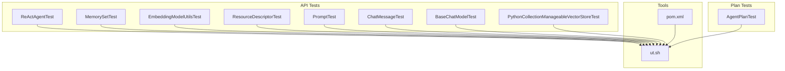
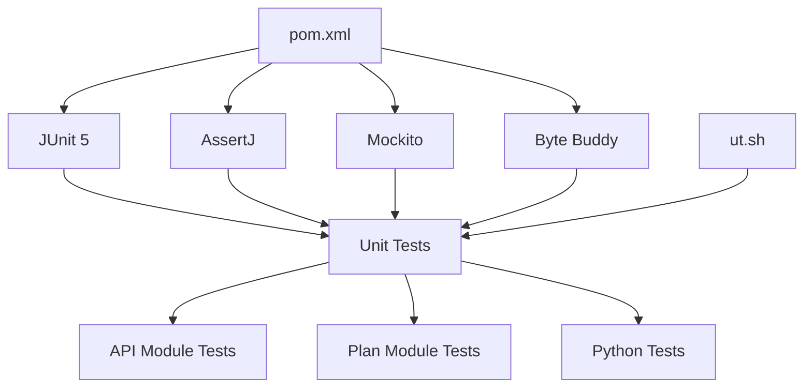
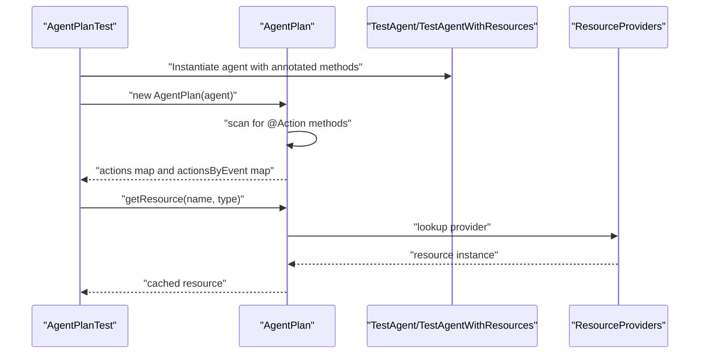
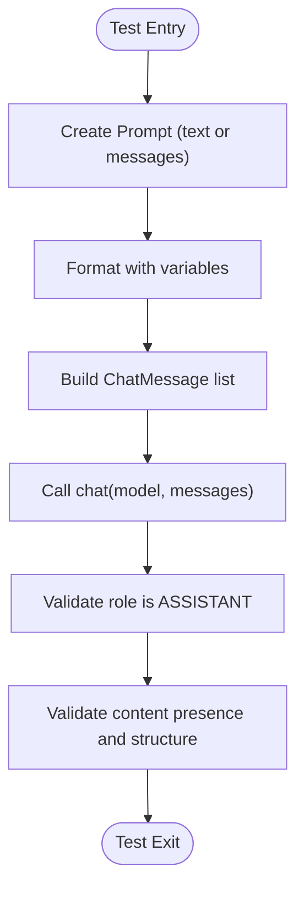
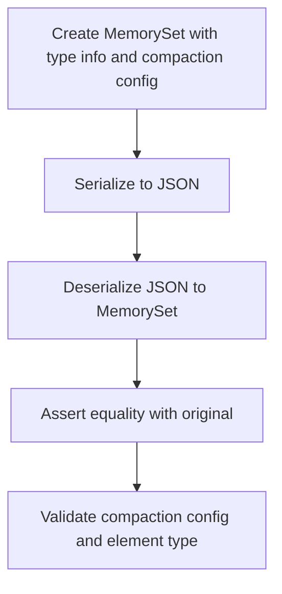
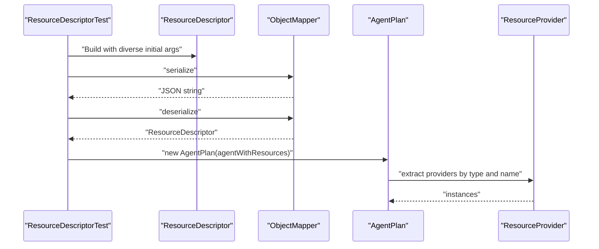
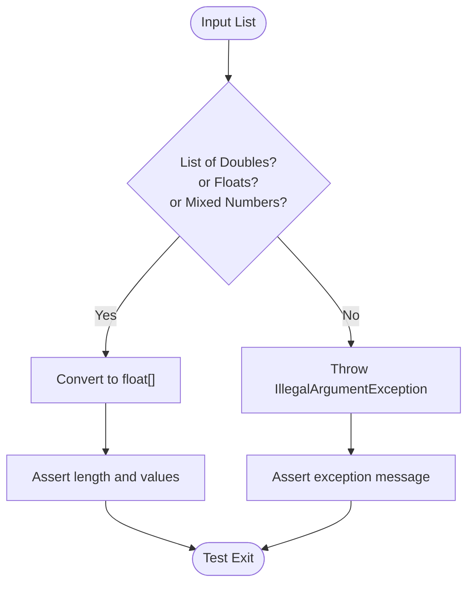
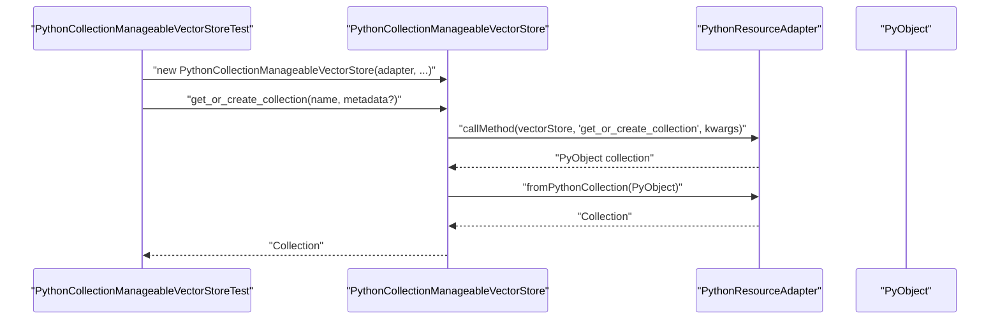
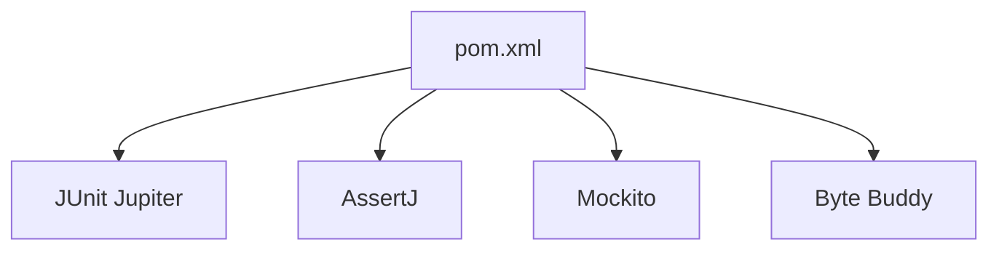

# Unit Testing

<cite>
**Referenced Files in This Document**
- [ReActAgentTest.java](file://api/src/test/java/org/apache/flink/agents/api/agents/ReActAgentTest.java)
- [MemorySetTest.java](file://api/src/test/java/org/apache/flink/agents/api/memory/MemorySetTest.java)
- [EmbeddingModelUtilsTest.java](file://api/src/test/java/org/apache/flink/agents/api/embedding/model/EmbeddingModelUtilsTest.java)
- [ResourceDescriptorTest.java](file://api/src/test/java/org/apache/flink/agents/api/resource/ResourceDescriptorTest.java)
- [PromptTest.java](file://api/src/test/java/org/apache/flink/agents/api/prompt/PromptTest.java)
- [ChatMessageTest.java](file://api/src/test/java/org/apache/flink/agents/api/chat/messages/ChatMessageTest.java)
- [BaseChatModelTest.java](file://api/src/test/java/org/apache/flink/agents/api/chat/model/BaseChatModelTest.java)
- [PythonCollectionManageableVectorStoreTest.java](file://api/src/test/java/org/apache/flink/agents/api/vectorstores/python/PythonCollectionManageableVectorStoreTest.java)
- [AgentPlanTest.java](file://plan/src/test/java/org/apache/flink/agents/plan/AgentPlanTest.java)
- [ut.sh](file://tools/ut.sh)
- [pom.xml](file://pom.xml)
</cite>

## Table of Contents
1. [Introduction](#introduction)
2. [Project Structure](#project-structure)
3. [Core Components](#core-components)
4. [Architecture Overview](#architecture-overview)
5. [Detailed Component Analysis](#detailed-component-analysis)
6. [Dependency Analysis](#dependency-analysis)
7. [Performance Considerations](#performance-considerations)
8. [Troubleshooting Guide](#troubleshooting-guide)
9. [Conclusion](#conclusion)

## Introduction
This document provides a comprehensive guide to unit testing strategies for Flink Agents. It focuses on testing patterns for core components such as agents, chat models, memory systems, and resource management. It explains how to write effective unit tests for agent behavior, resource provider implementations, and utility classes. It also covers mocking strategies for external dependencies, test data management, assertion patterns, and test isolation techniques. Guidance is grounded in the existing test suites present in the repository.

## Project Structure
The repository organizes unit tests primarily under the api module’s test tree and plan module’s test tree. Representative tests include:
- Agents: ReActAgentTest
- Memory: MemorySetTest
- Utilities: EmbeddingModelUtilsTest, PromptTest
- Resources: ResourceDescriptorTest
- Chat model: ChatMessageTest, BaseChatModelTest
- Vector stores (Python): PythonCollectionManageableVectorStoreTest
- Plan and resource providers: AgentPlanTest

**Diagram sources**
- [ReActAgentTest.java](file://api/src/test/java/org/apache/flink/agents/api/agents/ReActAgentTest.java#L1-L45)
- [MemorySetTest.java](file://api/src/test/java/org/apache/flink/agents/api/memory/MemorySetTest.java#L1-L43)
- [EmbeddingModelUtilsTest.java](file://api/src/test/java/org/apache/flink/agents/api/embedding/model/EmbeddingModelUtilsTest.java#L1-L123)
- [ResourceDescriptorTest.java](file://api/src/test/java/org/apache/flink/agents/api/resource/ResourceDescriptorTest.java#L1-L55)
- [PromptTest.java](file://api/src/test/java/org/apache/flink/agents/api/prompt/PromptTest.java#L1-L261)
- [ChatMessageTest.java](file://api/src/test/java/org/apache/flink/agents/api/chat/messages/ChatMessageTest.java#L1-L153)
- [BaseChatModelTest.java](file://api/src/test/java/org/apache/flink/agents/api/chat/model/BaseChatModelTest.java#L1-L256)
- [PythonCollectionManageableVectorStoreTest.java](file://api/src/test/java/org/apache/flink/agents/api/vectorstores/python/PythonCollectionManageableVectorStoreTest.java#L1-L355)
- [AgentPlanTest.java](file://plan/src/test/java/org/apache/flink/agents/plan/AgentPlanTest.java#L1-L482)
- [ut.sh](file://tools/ut.sh#L1-L328)
- [pom.xml](file://pom.xml#L69-L107)

**Section sources**
- [ReActAgentTest.java](file://api/src/test/java/org/apache/flink/agents/api/agents/ReActAgentTest.java#L1-L45)
- [MemorySetTest.java](file://api/src/test/java/org/apache/flink/agents/api/memory/MemorySetTest.java#L1-L43)
- [EmbeddingModelUtilsTest.java](file://api/src/test/java/org/apache/flink/agents/api/embedding/model/EmbeddingModelUtilsTest.java#L1-L123)
- [ResourceDescriptorTest.java](file://api/src/test/java/org/apache/flink/agents/api/resource/ResourceDescriptorTest.java#L1-L55)
- [PromptTest.java](file://api/src/test/java/org/apache/flink/agents/api/prompt/PromptTest.java#L1-L261)
- [ChatMessageTest.java](file://api/src/test/java/org/apache/flink/agents/api/chat/messages/ChatMessageTest.java#L1-L153)
- [BaseChatModelTest.java](file://api/src/test/java/org/apache/flink/agents/api/chat/model/BaseChatModelTest.java#L1-L256)
- [PythonCollectionManageableVectorStoreTest.java](file://api/src/test/java/org/apache/flink/agents/api/vectorstores/python/PythonCollectionManageableVectorStoreTest.java#L1-L355)
- [AgentPlanTest.java](file://plan/src/test/java/org/apache/flink/agents/plan/AgentPlanTest.java#L1-L482)
- [ut.sh](file://tools/ut.sh#L1-L328)
- [pom.xml](file://pom.xml#L69-L107)

## Core Components
This section outlines testing patterns for the major functional areas.

- Agents
  - Serialization and schema correctness: OutputSchema serialization test validates round-trip JSON compatibility for Row-type schemas used by agents.
  - Action discovery and plan construction: AgentPlanTest verifies that annotated actions are discovered, mapped by event types, and that resource providers are initialized correctly.

- Chat Models and Messages
  - Message semantics: ChatMessageTest validates roles, content, tool calls, and equality.
  - Prompt templating and formatting: PromptTest validates text-to-string and text-to-messages formatting, variable substitution, and serialization/deserialization.
  - Model behavior: BaseChatModelTest validates resource type, response generation, conversation handling, and robustness against edge cases.

- Memory Systems
  - MemorySet serialization: MemorySetTest validates JSON serialization/deserialization of memory sets including compaction configuration and chat message types.

- Resource Management
  - ResourceDescriptor serialization: ResourceDescriptorTest validates serializability of descriptors with diverse initial arguments and input events.
  - Resource providers and caching: AgentPlanTest demonstrates extraction of resource providers, caching behavior, and retrieval with proper exceptions when adapters are missing.

- Utilities
  - Embedding arrays: EmbeddingModelUtilsTest validates conversion of numeric lists to float arrays, including empty lists, single-element lists, mixed numeric types, and error handling for non-numeric entries.

- Vector Stores (Python)
  - Python-backed vector store operations: PythonCollectionManageableVectorStoreTest validates collection lifecycle (get/create/delete), document operations (add/get/delete), and size queries, using mocks for PythonResourceAdapter and Python objects.

**Section sources**
- [ReActAgentTest.java](file://api/src/test/java/org/apache/flink/agents/api/agents/ReActAgentTest.java#L30-L43)
- [AgentPlanTest.java](file://plan/src/test/java/org/apache/flink/agents/plan/AgentPlanTest.java#L247-L320)
- [ChatMessageTest.java](file://api/src/test/java/org/apache/flink/agents/api/chat/messages/ChatMessageTest.java#L47-L151)
- [PromptTest.java](file://api/src/test/java/org/apache/flink/agents/api/prompt/PromptTest.java#L78-L259)
- [BaseChatModelTest.java](file://api/src/test/java/org/apache/flink/agents/api/chat/model/BaseChatModelTest.java#L107-L254)
- [MemorySetTest.java](file://api/src/test/java/org/apache/flink/agents/api/memory/MemorySetTest.java#L28-L41)
- [ResourceDescriptorTest.java](file://api/src/test/java/org/apache/flink/agents/api/resource/ResourceDescriptorTest.java#L32-L53)
- [EmbeddingModelUtilsTest.java](file://api/src/test/java/org/apache/flink/agents/api/embedding/model/EmbeddingModelUtilsTest.java#L35-L121)
- [PythonCollectionManageableVectorStoreTest.java](file://api/src/test/java/org/apache/flink/agents/api/vectorstores/python/PythonCollectionManageableVectorStoreTest.java#L76-L354)

## Architecture Overview
The unit testing architecture leverages JUnit 5, AssertJ, and Mockito. The test harness supports both Java and Python test suites, with Maven coordinates and a dedicated script to orchestrate builds and test runs.

**Diagram sources**
- [pom.xml](file://pom.xml#L69-L107)
- [ut.sh](file://tools/ut.sh#L1-L328)

**Section sources**
- [pom.xml](file://pom.xml#L69-L107)
- [ut.sh](file://tools/ut.sh#L1-L328)

## Detailed Component Analysis

### Agent Behavior and Plan Construction
This test suite focuses on verifying agent action discovery, event mapping, and resource provider initialization.

**Diagram sources**
- [AgentPlanTest.java](file://plan/src/test/java/org/apache/flink/agents/plan/AgentPlanTest.java#L247-L480)

Key testing patterns:
- Annotation scanning: Verifies that only annotated methods are included in the plan.
- Event mapping: Ensures actions are indexed per listening event type.
- Resource provider extraction: Confirms providers are created for tools and chat models, including JavaSerializableResourceProvider and PythonResourceProvider.
- Adapter integration: Validates behavior when a PythonResourceAdapter is configured and when it is missing.

Assertions and patterns:
- Size checks on collections of actions and event mappings.
- Parameter type verification for JavaFunction executors.
- Exception assertions for missing resources and missing adapters.

**Section sources**
- [AgentPlanTest.java](file://plan/src/test/java/org/apache/flink/agents/plan/AgentPlanTest.java#L247-L480)

### Chat Models and Prompts
Testing chat models and prompts emphasizes correctness of message formatting, prompt templating, and response generation.

**Diagram sources**
- [BaseChatModelTest.java](file://api/src/test/java/org/apache/flink/agents/api/chat/model/BaseChatModelTest.java#L113-L233)
- [PromptTest.java](file://api/src/test/java/org/apache/flink/agents/api/prompt/PromptTest.java#L78-L133)

Patterns:
- Prompt formatting: Text-to-string and text-to-messages conversions with variable substitution.
- Message roles and equality: Validation of role constants and equality semantics.
- Model behavior: Echo-style response generation with configurable prefixes and robustness against empty or multi-user-message inputs.

**Section sources**
- [BaseChatModelTest.java](file://api/src/test/java/org/apache/flink/agents/api/chat/model/BaseChatModelTest.java#L107-L254)
- [ChatMessageTest.java](file://api/src/test/java/org/apache/flink/agents/api/chat/messages/ChatMessageTest.java#L47-L151)
- [PromptTest.java](file://api/src/test/java/org/apache/flink/agents/api/prompt/PromptTest.java#L78-L259)

### Memory Operations
MemorySet tests focus on serialization and equality semantics for memory sets.

**Diagram sources**
- [MemorySetTest.java](file://api/src/test/java/org/apache/flink/agents/api/memory/MemorySetTest.java#L28-L41)

**Section sources**
- [MemorySetTest.java](file://api/src/test/java/org/apache/flink/agents/api/memory/MemorySetTest.java#L28-L41)

### Resource Provider Implementations
ResourceDescriptor and AgentPlan tests demonstrate serialization and provider extraction.

**Diagram sources**
- [ResourceDescriptorTest.java](file://api/src/test/java/org/apache/flink/agents/api/resource/ResourceDescriptorTest.java#L32-L53)
- [AgentPlanTest.java](file://plan/src/test/java/org/apache/flink/agents/plan/AgentPlanTest.java#L388-L480)

**Section sources**
- [ResourceDescriptorTest.java](file://api/src/test/java/org/apache/flink/agents/api/resource/ResourceDescriptorTest.java#L32-L53)
- [AgentPlanTest.java](file://plan/src/test/java/org/apache/flink/agents/plan/AgentPlanTest.java#L388-L480)

### Utility Classes
EmbeddingModelUtils tests validate numeric conversion and error handling.

**Diagram sources**
- [EmbeddingModelUtilsTest.java](file://api/src/test/java/org/apache/flink/agents/api/embedding/model/EmbeddingModelUtilsTest.java#L35-L121)

**Section sources**
- [EmbeddingModelUtilsTest.java](file://api/src/test/java/org/apache/flink/agents/api/embedding/model/EmbeddingModelUtilsTest.java#L35-L121)

### Vector Store Operations (Python)
Python-backed vector store tests validate collection and document operations using mocks.

**Diagram sources**
- [PythonCollectionManageableVectorStoreTest.java](file://api/src/test/java/org/apache/flink/agents/api/vectorstores/python/PythonCollectionManageableVectorStoreTest.java#L93-L127)

**Section sources**
- [PythonCollectionManageableVectorStoreTest.java](file://api/src/test/java/org/apache/flink/agents/api/vectorstores/python/PythonCollectionManageableVectorStoreTest.java#L93-L127)

## Dependency Analysis
The test dependencies are declared in the project’s dependency management and dependencies sections. The primary libraries used in tests are:
- JUnit Jupiter for test framework
- AssertJ for fluent assertions
- Mockito for mocking
- Byte Buddy for advanced mocking scenarios

**Diagram sources**
- [pom.xml](file://pom.xml#L69-L107)

**Section sources**
- [pom.xml](file://pom.xml#L69-L107)

## Performance Considerations
- Prefer lightweight assertions and deterministic inputs to keep tests fast and reliable.
- Use mocks judiciously to avoid heavyweight external dependencies during unit tests.
- Keep test data minimal and focused to reduce serialization overhead (e.g., small prompts, compact memory sets).
- Avoid unnecessary object creation inside test loops; reuse instances where safe.

## Troubleshooting Guide
Common issues and resolutions:
- Serialization failures
  - Symptom: JSON serialization/deserialization tests fail.
  - Resolution: Ensure all relevant fields are serializable and that constructors support default instantiation. Confirm ObjectMapper usage and field visibility.
  - References:
    - [ReActAgentTest.java](file://api/src/test/java/org/apache/flink/agents/api/agents/ReActAgentTest.java#L30-L43)
    - [MemorySetTest.java](file://api/src/test/java/org/apache/flink/agents/api/memory/MemorySetTest.java#L28-L41)
    - [PromptTest.java](file://api/src/test/java/org/apache/flink/agents/api/prompt/PromptTest.java#L240-L259)
    - [ResourceDescriptorTest.java](file://api/src/test/java/org/apache/flink/agents/api/resource/ResourceDescriptorTest.java#L32-L53)

- Mock misuse
  - Symptom: Mockito argument matchers fail or invocations are not verified.
  - Resolution: Use ArgumentMatchers consistently, verify interactions after asserting outcomes, and ensure mocks are initialized via @BeforeEach or openMocks.
  - References:
    - [PythonCollectionManageableVectorStoreTest.java](file://api/src/test/java/org/apache/flink/agents/api/vectorstores/python/PythonCollectionManageableVectorStoreTest.java#L61-L74)

- Missing adapters for Python resources
  - Symptom: IllegalStateException when retrieving Python resources without a configured adapter.
  - Resolution: Configure a PythonResourceAdapter before retrieving Python resources.
  - References:
    - [AgentPlanTest.java](file://plan/src/test/java/org/apache/flink/agents/plan/AgentPlanTest.java#L466-L476)

- Assertion mismatches
  - Symptom: Fluent assertions fail unexpectedly.
  - Resolution: Use AssertJ assertions for richer diagnostics and clearer failure messages; prefer assertThat(...) over classic assertions for complex objects.
  - References:
    - [AgentPlanTest.java](file://plan/src/test/java/org/apache/flink/agents/plan/AgentPlanTest.java#L255-L304)

## Conclusion
The Flink Agents repository provides a solid foundation for unit testing across agents, chat models, memory systems, resources, utilities, and vector stores. The tests demonstrate effective patterns for serialization validation, annotation-driven action discovery, resource provider extraction, and Python integration via mocks. By following the outlined strategies—serialization-first validations, fluent assertions, targeted mocking, and deterministic test data—you can maintain high confidence in core components while keeping tests fast and maintainable.