# Python API

<cite>
**本文引用的文件**
- [python/flink_agents/api/agents/agent.py](file://python/flink_agents/api/agents/agent.py)
- [python/flink_agents/api/agents/react_agent.py](file://python/flink_agents/api/agents/react_agent.py)
- [python/flink_agents/api/agents/types.py](file://python/flink_agents/api/agents/types.py)
- [python/flink_agents/api/chat_models/chat_model.py](file://python/flink_agents/api/chat_models/chat_model.py)
- [python/flink_agents/api/embedding_models/embedding_model.py](file://python/flink_agents/api/embedding_models/embedding_model.py)
- [python/flink_agents/api/vector_stores/vector_store.py](file://python/flink_agents/api/vector_stores/vector_store.py)
- [python/flink_agents/api/tools/tool.py](file://python/flink_agents/api/tools/tool.py)
- [python/flink_agents/api/resource.py](file://python/flink_agents/api/resource.py)
- [python/flink_agents/api/execution_environment.py](file://python/flink_agents/api/execution_environment.py)
- [python/flink_agents/runtime/agent_runner.py](file://python/flink_agents/runtime/agent_runner.py)
- [python/pyproject.toml](file://python/pyproject.toml)
- [python/flink_agents/__init__.py](file://python/flink_agents/__init__.py)
</cite>

## 目录
1. [简介](#简介)
2. [项目结构](#项目结构)
3. [核心组件](#核心组件)
4. [架构总览](#架构总览)
5. [组件详解](#组件详解)
6. [依赖关系分析](#依赖关系分析)
7. [性能考量](#性能考量)
8. [故障排查指南](#故障排查指南)
9. [结论](#结论)
10. [附录](#附录)

## 简介
本文件为 Apache Flink Agents 的 Python API 使用与实现指南，面向 Python 开发者，系统讲解以下内容：
- Agent 基类与 ReActAgent 实现
- 类型定义（如输出模式、事件、提示词等）
- Python 资源管理：聊天模型、嵌入模型、工具、向量存储的接口与用法
- Python 与 Java 的互操作机制（资源描述、序列化、类型转换、异常处理）
- 安装与配置（依赖、版本兼容性）
- 最佳实践与性能优化
- 常见问题与调试技巧

## 项目结构
Python API 主要位于 flink_agents 包中，按功能域划分为 agents、chat_models、embedding_models、vector_stores、tools、resource、execution_environment、runtime 等子模块；同时提供 pyproject.toml 进行包元信息与依赖管理。

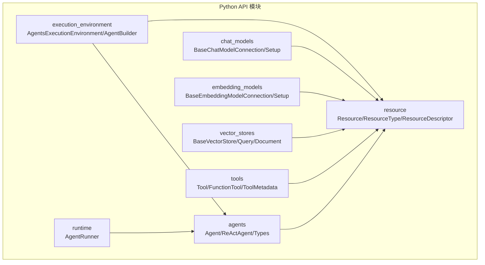

**图表来源**
- [python/flink_agents/api/agents/agent.py](file://python/flink_agents/api/agents/agent.py#L31-L160)
- [python/flink_agents/api/agents/react_agent.py](file://python/flink_agents/api/agents/react_agent.py#L42-L212)
- [python/flink_agents/api/chat_models/chat_model.py](file://python/flink_agents/api/chat_models/chat_model.py#L31-L232)
- [python/flink_agents/api/embedding_models/embedding_model.py](file://python/flink_agents/api/embedding_models/embedding_model.py#L27-L108)
- [python/flink_agents/api/vector_stores/vector_store.py](file://python/flink_agents/api/vector_stores/vector_store.py#L136-L363)
- [python/flink_agents/api/tools/tool.py](file://python/flink_agents/api/tools/tool.py#L103-L156)
- [python/flink_agents/api/resource.py](file://python/flink_agents/api/resource.py#L29-L318)
- [python/flink_agents/api/execution_environment.py](file://python/flink_agents/api/execution_environment.py#L91-L253)
- [python/flink_agents/runtime/agent_runner.py](file://python/flink_agents/runtime/agent_runner.py#L22-L44)

**章节来源**
- [python/flink_agents/api/agents/agent.py](file://python/flink_agents/api/agents/agent.py#L31-L160)
- [python/flink_agents/api/execution_environment.py](file://python/flink_agents/api/execution_environment.py#L91-L253)

## 核心组件
- Agent 基类：统一的动作注册与资源注册接口，支持装饰器声明或运行时添加。
- ReActAgent：内置的基于函数调用能力的 ReAct 实现，自动拼接提示词与输出解析。
- 资源体系：Resource/SerializableResource/ResourceDescriptor/ResourceType，统一管理聊天模型、嵌入模型、工具、向量存储、提示词、MCP 服务器等。
- 聊天模型：BaseChatModelConnection 提供直连服务的能力，BaseChatModelSetup 负责模板、工具绑定与参数合并。
- 嵌入模型：BaseEmbeddingModelConnection/Setup，负责文本到向量的转换。
- 向量存储：BaseVectorStore/CollectionManageableVectorStore，封装嵌入生成与检索流程。
- 工具：Tool/FunctionTool/ToolMetadata，支持从可调用对象创建工具并序列化参数模式。
- 执行环境：AgentsExecutionEnvironment/AgentBuilder，适配本地与远程（Flink）执行，注入资源与 JAR。

**章节来源**
- [python/flink_agents/api/agents/agent.py](file://python/flink_agents/api/agents/agent.py#L31-L160)
- [python/flink_agents/api/agents/react_agent.py](file://python/flink_agents/api/agents/react_agent.py#L42-L212)
- [python/flink_agents/api/resource.py](file://python/flink_agents/api/resource.py#L29-L318)
- [python/flink_agents/api/chat_models/chat_model.py](file://python/flink_agents/api/chat_models/chat_model.py#L31-L232)
- [python/flink_agents/api/embedding_models/embedding_model.py](file://python/flink_agents/api/embedding_models/embedding_model.py#L27-L108)
- [python/flink_agents/api/vector_stores/vector_store.py](file://python/flink_agents/api/vector_stores/vector_store.py#L136-L363)
- [python/flink_agents/api/tools/tool.py](file://python/flink_agents/api/tools/tool.py#L103-L156)
- [python/flink_agents/api/execution_environment.py](file://python/flink_agents/api/execution_environment.py#L91-L253)

## 架构总览
下图展示了 Python 层与 Java 层的交互路径：Python 通过 ResourceDescriptor 描述资源并在执行环境中注册；在远程执行时，会根据 Flink 版本加载对应 JAR 并与 Java 运行时互通。

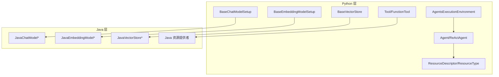

**图表来源**
- [python/flink_agents/api/execution_environment.py](file://python/flink_agents/api/execution_environment.py#L109-L154)
- [python/flink_agents/api/resource.py](file://python/flink_agents/api/resource.py#L215-L318)
- [python/flink_agents/api/chat_models/chat_model.py](file://python/flink_agents/api/chat_models/chat_model.py#L121-L232)
- [python/flink_agents/api/embedding_models/embedding_model.py](file://python/flink_agents/api/embedding_models/embedding_model.py#L64-L108)
- [python/flink_agents/api/vector_stores/vector_store.py](file://python/flink_agents/api/vector_stores/vector_store.py#L136-L363)
- [python/flink_agents/api/tools/tool.py](file://python/flink_agents/api/tools/tool.py#L103-L156)

## 组件详解

### Agent 与 ReActAgent
- Agent 提供动作注册（add_action）与资源注册（add_resource），支持装饰器声明与运行时装配两种方式。
- ReActAgent 内置“开始/停止”动作，自动拼装用户输入、可选提示词与输出模式，并发送聊天请求事件，最终将响应写回输出事件。

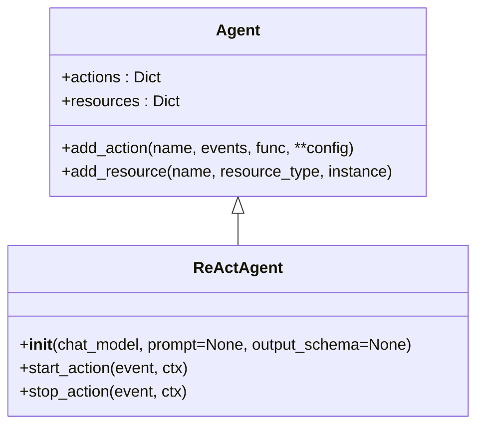

**图表来源**
- [python/flink_agents/api/agents/agent.py](file://python/flink_agents/api/agents/agent.py#L31-L160)
- [python/flink_agents/api/agents/react_agent.py](file://python/flink_agents/api/agents/react_agent.py#L42-L212)

**章节来源**
- [python/flink_agents/api/agents/agent.py](file://python/flink_agents/api/agents/agent.py#L31-L160)
- [python/flink_agents/api/agents/react_agent.py](file://python/flink_agents/api/agents/react_agent.py#L42-L212)

### 输出模式与类型定义
- OutputSchema：用于序列化/反序列化输出模式，支持 Pydantic 模型或 RowTypeInfo，便于跨语言传递。
- 该类型在 ReActAgent 中被用作动作配置项，驱动响应格式约束。

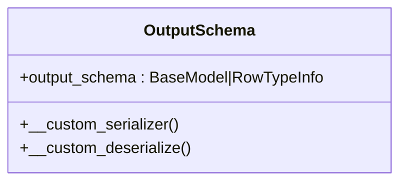

**图表来源**
- [python/flink_agents/api/agents/types.py](file://python/flink_agents/api/agents/types.py#L25-L68)

**章节来源**
- [python/flink_agents/api/agents/types.py](file://python/flink_agents/api/agents/types.py#L25-L68)

### 聊天模型接口
- BaseChatModelConnection：抽象连接层，定义直连服务的 chat 接口与推理文本提取辅助方法。
- BaseChatModelSetup：抽象设置层，负责模板渲染、工具绑定、参数合并与调用连接层，支持令牌用量指标记录。

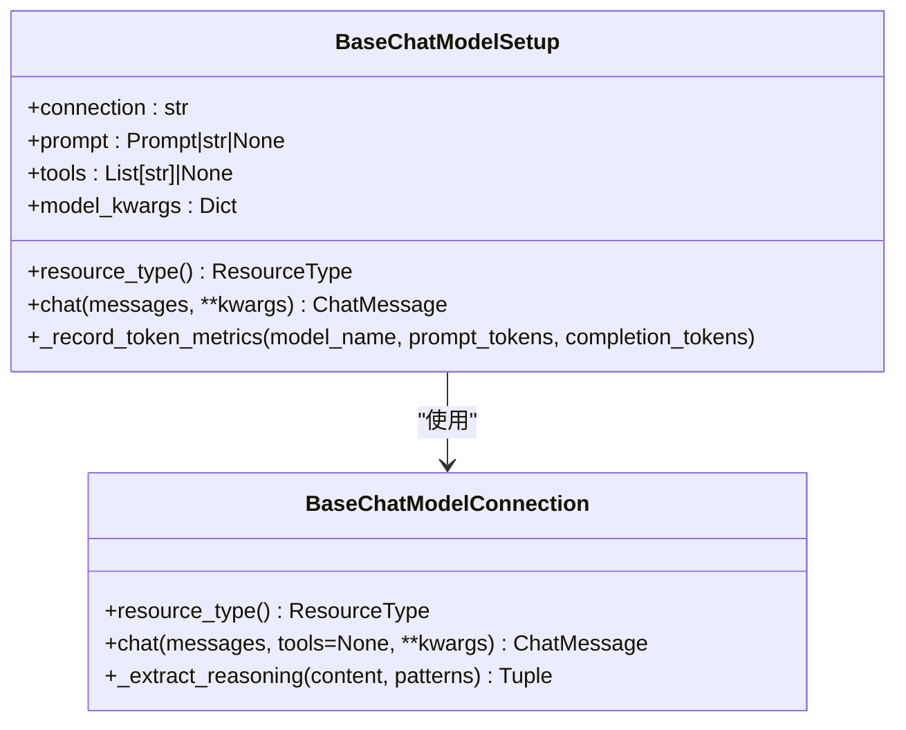

**图表来源**
- [python/flink_agents/api/chat_models/chat_model.py](file://python/flink_agents/api/chat_models/chat_model.py#L31-L232)

**章节来源**
- [python/flink_agents/api/chat_models/chat_model.py](file://python/flink_agents/api/chat_models/chat_model.py#L31-L232)

### 嵌入模型接口
- BaseEmbeddingModelConnection：抽象连接层，提供 embed 接口。
- BaseEmbeddingModelSetup：抽象设置层，负责连接与模型名绑定，合并参数后调用连接层。

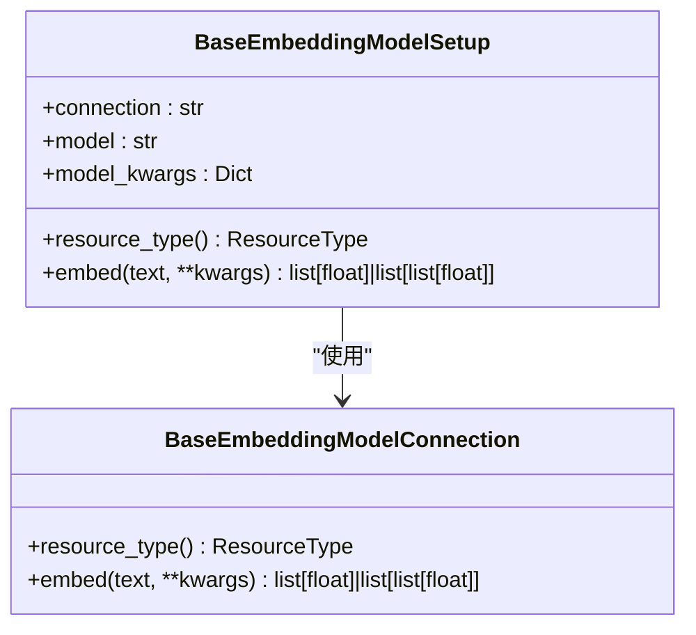

**图表来源**
- [python/flink_agents/api/embedding_models/embedding_model.py](file://python/flink_agents/api/embedding_models/embedding_model.py#L27-L108)

**章节来源**
- [python/flink_agents/api/embedding_models/embedding_model.py](file://python/flink_agents/api/embedding_models/embedding_model.py#L27-L108)

### 向量存储接口
- BaseVectorStore：封装嵌入生成与查询流程，统一 add/query/get/delete；内部通过嵌入模型生成向量。
- CollectionManageableVectorStore：扩展集合管理能力（创建/获取/删除）。
- Document/VectorStoreQuery/VectorStoreQueryResult：标准化文档与查询结果的数据结构。

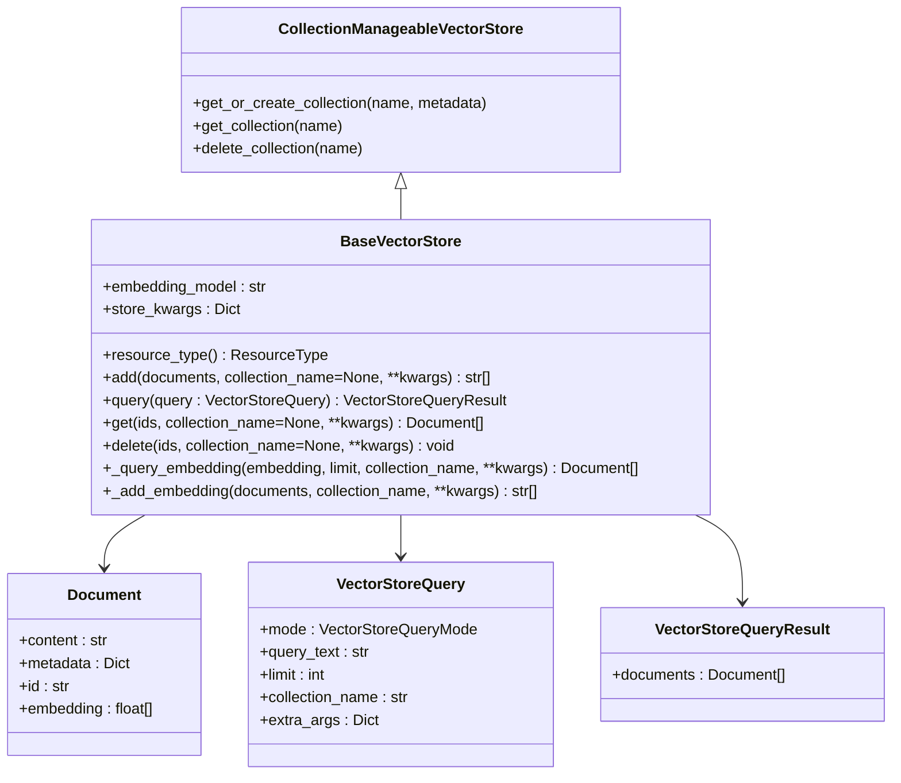

**图表来源**
- [python/flink_agents/api/vector_stores/vector_store.py](file://python/flink_agents/api/vector_stores/vector_store.py#L136-L363)

**章节来源**
- [python/flink_agents/api/vector_stores/vector_store.py](file://python/flink_agents/api/vector_stores/vector_store.py#L136-L363)

### 工具接口
- Tool/FunctionTool/ToolMetadata：支持从可调用对象创建工具，序列化参数模式，统一工具类型枚举。

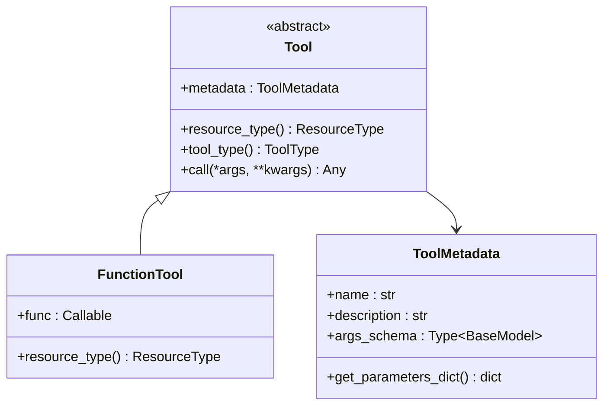

**图表来源**
- [python/flink_agents/api/tools/tool.py](file://python/flink_agents/api/tools/tool.py#L103-L156)

**章节来源**
- [python/flink_agents/api/tools/tool.py](file://python/flink_agents/api/tools/tool.py#L103-L156)

### 资源管理与执行环境
- Resource/SerializableResource/ResourceDescriptor/ResourceType：统一资源生命周期、序列化与类型标识。
- AgentsExecutionEnvironment：注册资源、选择执行环境（本地/远程）、注入 Flink JAR、构建输入输出。
- AgentRunner：抽象执行器接口，具体由运行时实现。

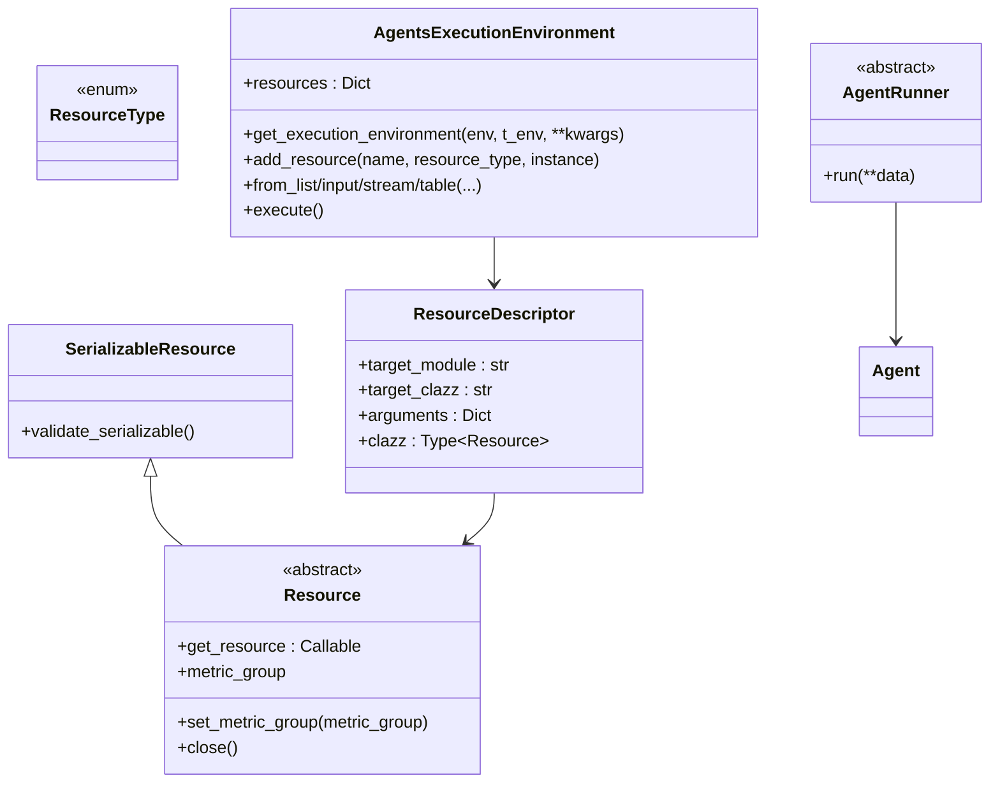

**图表来源**
- [python/flink_agents/api/resource.py](file://python/flink_agents/api/resource.py#L46-L318)
- [python/flink_agents/api/execution_environment.py](file://python/flink_agents/api/execution_environment.py#L91-L253)
- [python/flink_agents/runtime/agent_runner.py](file://python/flink_agents/runtime/agent_runner.py#L22-L44)

**章节来源**
- [python/flink_agents/api/resource.py](file://python/flink_agents/api/resource.py#L46-L318)
- [python/flink_agents/api/execution_environment.py](file://python/flink_agents/api/execution_environment.py#L91-L253)
- [python/flink_agents/runtime/agent_runner.py](file://python/flink_agents/runtime/agent_runner.py#L22-L44)

### Python 与 Java 互操作机制
- 资源描述：通过 ResourceDescriptor 指定目标模块与类名，运行时动态导入，实现跨语言资源绑定。
- 序列化/反序列化：OutputSchema、ToolMetadata 等使用 Pydantic 自定义序列化逻辑，确保跨语言一致。
- 类型转换：ReActAgent 在 start_action 中对输入进行类型转换与提示词格式化；向量存储在 add/query 中自动调用嵌入模型生成向量。
- 异常处理：资源重复注册、版本不匹配、JAR 缺失等场景均抛出明确异常，便于定位问题。

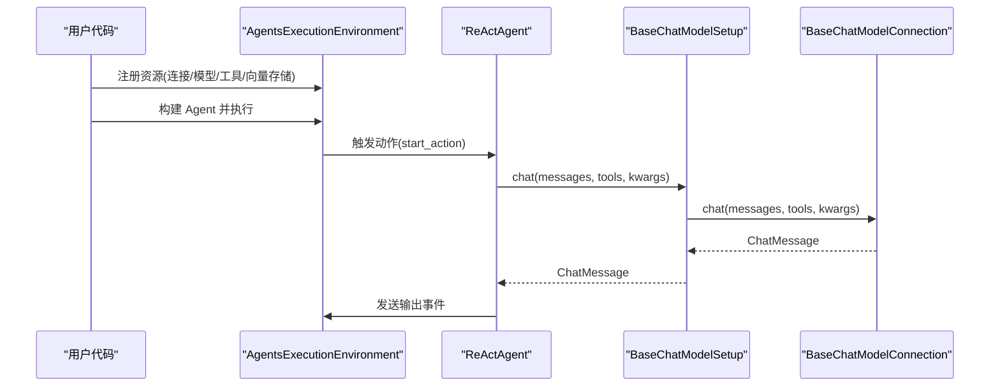

**图表来源**
- [python/flink_agents/api/execution_environment.py](file://python/flink_agents/api/execution_environment.py#L109-L154)
- [python/flink_agents/api/agents/react_agent.py](file://python/flink_agents/api/agents/react_agent.py#L144-L212)
- [python/flink_agents/api/chat_models/chat_model.py](file://python/flink_agents/api/chat_models/chat_model.py#L151-L210)

**章节来源**
- [python/flink_agents/api/agents/react_agent.py](file://python/flink_agents/api/agents/react_agent.py#L144-L212)
- [python/flink_agents/api/chat_models/chat_model.py](file://python/flink_agents/api/chat_models/chat_model.py#L151-L210)
- [python/flink_agents/api/execution_environment.py](file://python/flink_agents/api/execution_environment.py#L109-L154)

## 依赖关系分析
- 包元信息与依赖：pyproject.toml 指定 Python 版本范围、核心依赖（pydantic、docstring-parser、pyyaml、mcp、ollama、openai、anthropic、chromadb、onnxruntime 等）以及可选开发/测试/构建工具。
- 运行时 JAR 注入：远程执行环境根据 Flink 版本选择对应目录下的 JAR 并注入到 StreamExecutionEnvironment。

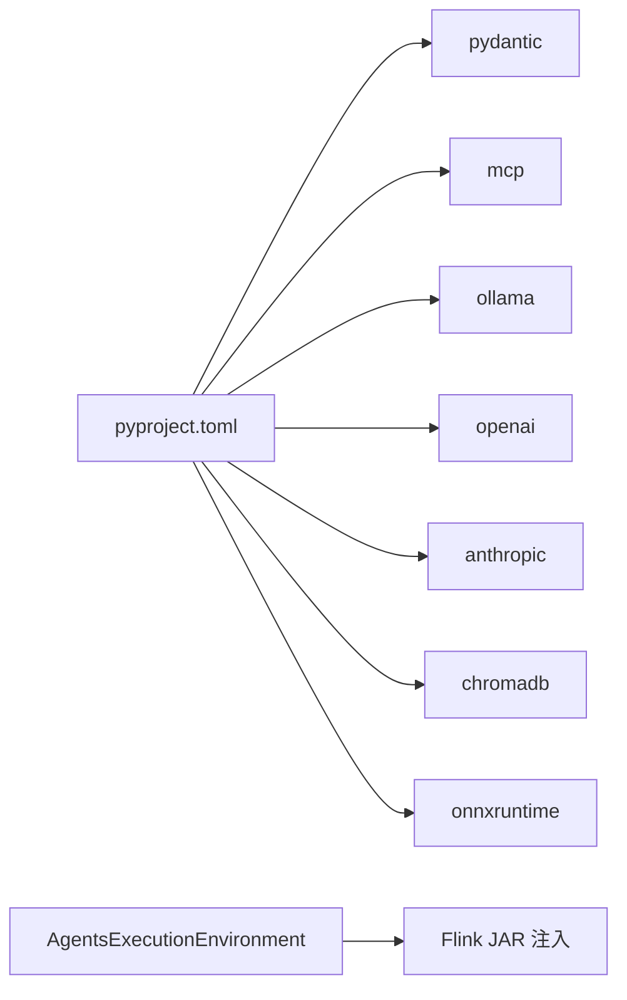

**图表来源**
- [python/pyproject.toml](file://python/pyproject.toml#L44-L59)
- [python/flink_agents/api/execution_environment.py](file://python/flink_agents/api/execution_environment.py#L134-L147)

**章节来源**
- [python/pyproject.toml](file://python/pyproject.toml#L44-L59)
- [python/flink_agents/api/execution_environment.py](file://python/flink_agents/api/execution_environment.py#L134-L147)

## 性能考量
- 嵌入与检索：向量存储在 add/query 时自动调用嵌入模型生成向量，建议合理设置 limit 与 extra_args，避免过大的集合规模导致检索开销上升。
- 参数合并：BaseChatModelSetup/BaseEmbeddingModelSetup 将设置层参数与调用层参数合并，注意避免频繁大字典更新带来的拷贝成本。
- 指标记录：聊天模型设置层支持令牌用量计数器，便于监控与成本控制。
- 本地/远程执行：本地执行适合快速迭代，远程执行适合大规模流式处理；根据场景选择合适的执行环境。

[本节为通用指导，无需特定文件引用]

## 故障排查指南
- 资源重复定义：注册同名资源会触发错误，检查资源名称与类型是否唯一。
- 版本不匹配：远程执行需正确安装 Flink，且存在对应版本的 JAR 目录；否则会抛出找不到 JAR 或未安装 Flink 的异常。
- 输入类型不匹配：ReActAgent 对非基础类型的输入需要提供提示词以完成消息格式化，否则会抛出运行时错误。
- 工具参数模式：ToolMetadata 的 args_schema 需遵循 Pydantic 模式，确保序列化/反序列化一致性。

**章节来源**
- [python/flink_agents/api/agents/agent.py](file://python/flink_agents/api/agents/agent.py#L129-L132)
- [python/flink_agents/api/execution_environment.py](file://python/flink_agents/api/execution_environment.py#L144-L154)
- [python/flink_agents/api/agents/react_agent.py](file://python/flink_agents/api/agents/react_agent.py#L166-L170)
- [python/flink_agents/api/tools/tool.py](file://python/flink_agents/api/tools/tool.py#L75-L82)

## 结论
Flink Agents 的 Python API 提供了统一的资源管理与执行框架，结合 ReActAgent 可快速构建具备函数调用能力的智能代理。通过 ResourceDescriptor 与序列化机制，实现了与 Java 生态的无缝互操作。配合合理的参数配置与性能优化策略，可在本地与远程环境下稳定高效地运行复杂工作流。

[本节为总结，无需特定文件引用]

## 附录

### 安装与配置
- Python 版本：要求 Python 3.10 至 3.11。
- 依赖：核心库与集成库（如 ollama、openai、anthropic、chromadb、onnxruntime）已在 pyproject.toml 中声明。
- 可选依赖：dev/build/test/lint 分组，便于开发与打包。
- 运行时 JAR：远程执行时自动注入对应版本的 JAR，确保与已安装的 Flink 版本匹配。

**章节来源**
- [python/pyproject.toml](file://python/pyproject.toml#L32-L59)
- [python/flink_agents/api/execution_environment.py](file://python/flink_agents/api/execution_environment.py#L134-L147)

### 示例与最佳实践
- 示例路径（示例代码请参考以下文件路径，避免直接粘贴代码内容）：
  - ReActAgent 基本用法：[示例路径](file://python/flink_agents/api/agents/react_agent.py#L53-L94)
  - 动作与资源注册（装饰器方式）：[示例路径](file://python/flink_agents/api/agents/agent.py#L35-L86)
  - 动作与资源注册（运行时方式）：[示例路径](file://python/flink_agents/api/agents/agent.py#L60-L86)
  - 聊天模型连接与设置：[示例路径](file://python/flink_agents/api/chat_models/chat_model.py#L121-L210)
  - 嵌入模型连接与设置：[示例路径](file://python/flink_agents/api/embedding_models/embedding_model.py#L64-L108)
  - 向量存储增删查与查询：[示例路径](file://python/flink_agents/api/vector_stores/vector_store.py#L163-L232)
  - 工具创建与元数据序列化：[示例路径](file://python/flink_agents/api/tools/tool.py#L103-L156)
- 最佳实践要点：
  - 明确区分连接层与设置层职责，避免在连接层做模板与工具绑定。
  - 使用 OutputSchema 约束输出格式，减少下游解析成本。
  - 合理设置向量存储的集合与过滤条件，控制检索范围。
  - 在远程执行前确认 Flink 版本与 JAR 匹配，避免运行时异常。

**章节来源**
- [python/flink_agents/api/agents/react_agent.py](file://python/flink_agents/api/agents/react_agent.py#L53-L94)
- [python/flink_agents/api/agents/agent.py](file://python/flink_agents/api/agents/agent.py#L35-L86)
- [python/flink_agents/api/chat_models/chat_model.py](file://python/flink_agents/api/chat_models/chat_model.py#L121-L210)
- [python/flink_agents/api/embedding_models/embedding_model.py](file://python/flink_agents/api/embedding_models/embedding_model.py#L64-L108)
- [python/flink_agents/api/vector_stores/vector_store.py](file://python/flink_agents/api/vector_stores/vector_store.py#L163-L232)
- [python/flink_agents/api/tools/tool.py](file://python/flink_agents/api/tools/tool.py#L103-L156)