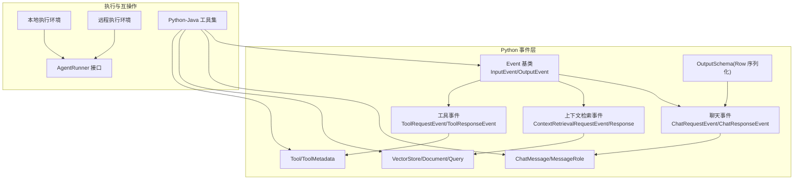
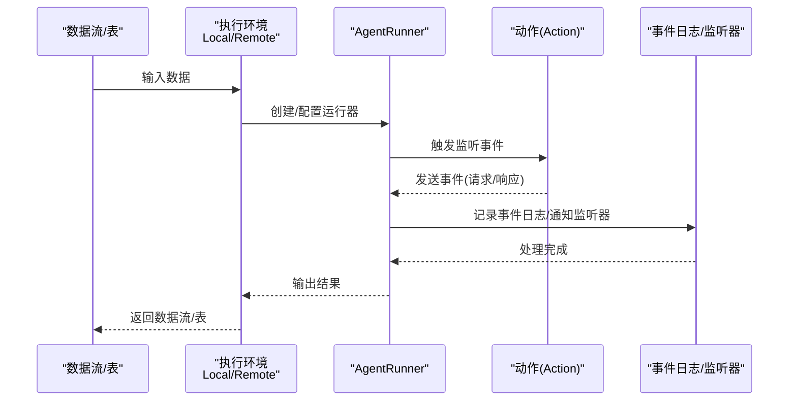
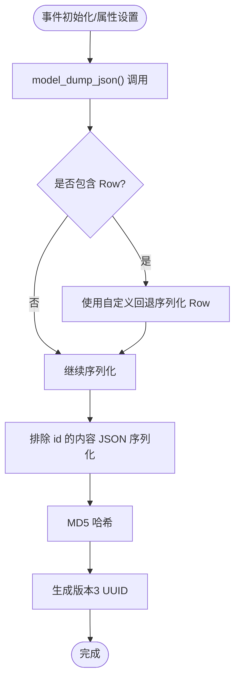
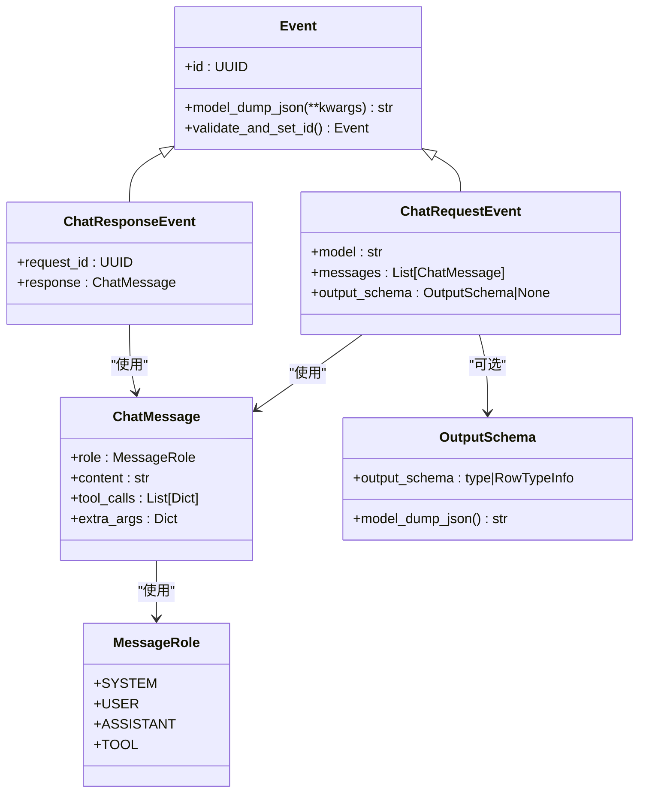
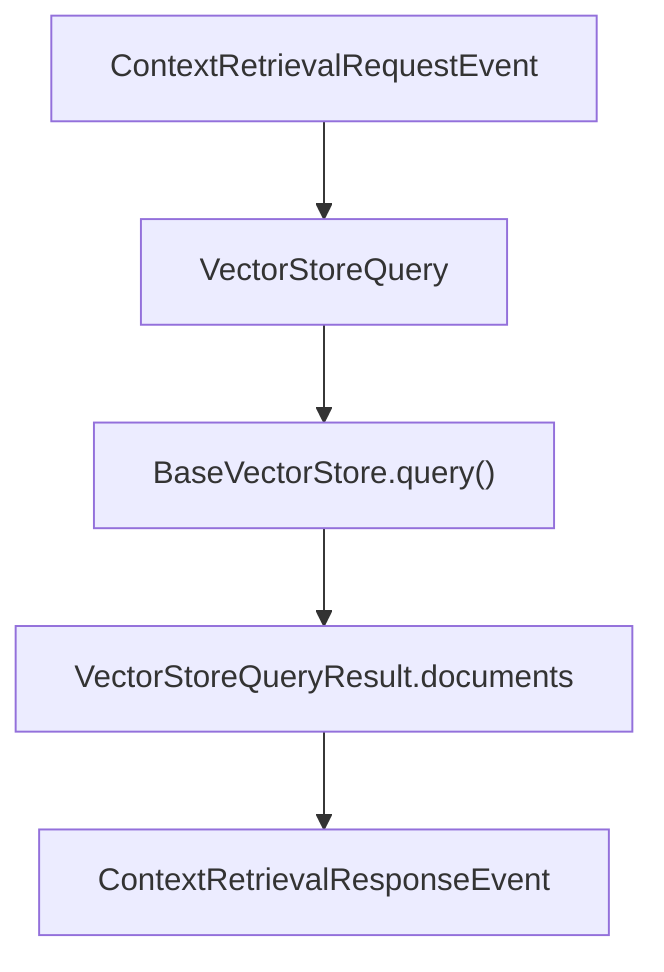
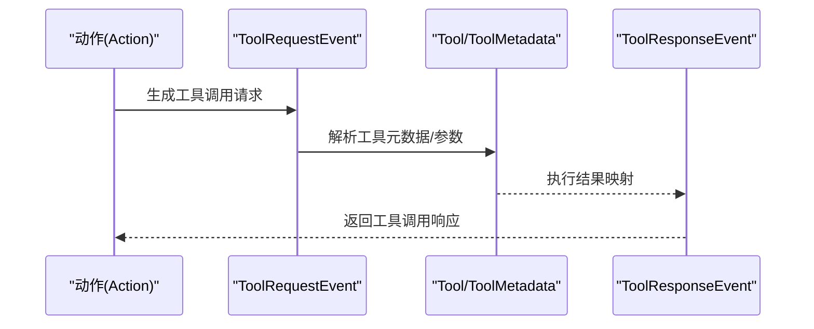
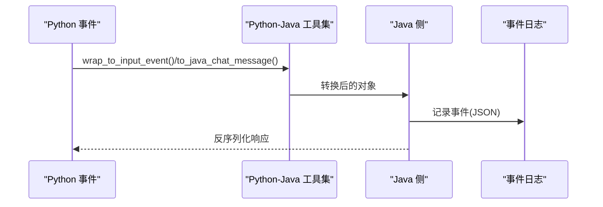
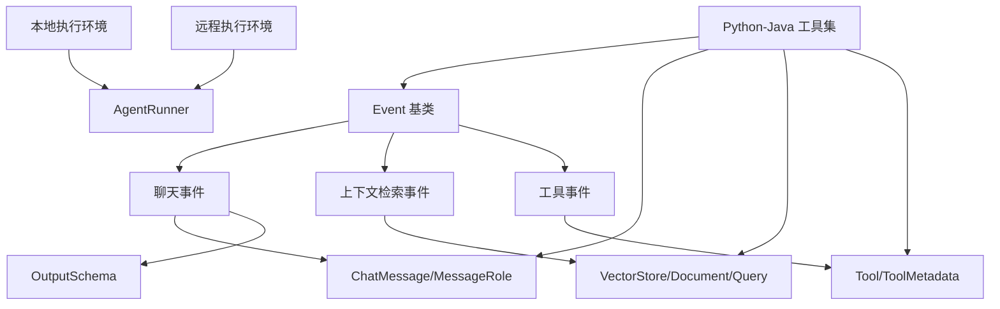

# Python 事件系统

<cite>
**本文档引用的文件**
- [event.py](file://python/flink_agents/api/events/event.py)
- [chat_event.py](file://python/flink_agents/api/events/chat_event.py)
- [context_retrieval_event.py](file://python/flink_agents/api/events/context_retrieval_event.py)
- [tool_event.py](file://python/flink_agents/api/events/tool_event.py)
- [chat_message.py](file://python/flink_agents/api/chat_message.py)
- [types.py](file://python/flink_agents/api/agents/types.py)
- [vector_store.py](file://python/flink_agents/api/vector_stores/vector_store.py)
- [tool.py](file://python/flink_agents/api/tools/tool.py)
- [python_java_utils.py](file://python/flink_agents/runtime/python_java_utils.py)
- [agent_runner.py](file://python/flink_agents/runtime/agent_runner.py)
- [local_execution_environment.py](file://python/flink_agents/runtime/local_execution_environment.py)
- [remote_execution_environment.py](file://python/flink_agents/runtime/remote_execution_environment.py)
- [test_event.py](file://python/flink_agents/api/tests/test_event.py)
- [python_event_logging_test.py](file://python/flink_agents/e2e_tests/e2e_tests_integration/python_event_logging_test.py)
- [EventListener.java](file://api/src/main/java/org/apache/flink/agents/api/listener/EventListener.java)
- [ChatRequestEvent.java](file://api/src/main/java/org/apache/flink/agents/api/event/ChatRequestEvent.java)
</cite>

## 目录
1. [简介](#简介)
2. [项目结构](#项目结构)
3. [核心组件](#核心组件)
4. [架构总览](#架构总览)
5. [详细组件分析](#详细组件分析)
6. [依赖关系分析](#依赖关系分析)
7. [性能考虑](#性能考虑)
8. [故障排除指南](#故障排除指南)
9. [结论](#结论)
10. [附录：完整示例与最佳实践](#附录完整示例与最佳实践)

## 简介
本文件系统性地介绍 Apache Flink Agents 的 Python 事件系统，涵盖事件模型设计、事件类型定义、事件处理机制以及与 Java 事件的互操作性。文档重点包括：
- Python 事件基类与输入/输出事件的实现
- Python 聊天事件（请求/响应）的消息传递与角色定义
- Python 上下文检索事件（向量检索）的触发条件、结果处理与性能优化
- Python 工具事件（工具调用请求/响应）的生成、传播与响应机制
- 事件日志记录、序列化与反序列化、Row 类型兼容处理
- 面向 Python 开发者的事件驱动开发指南与最佳实践

## 项目结构
Python 事件系统主要位于以下模块：
- 事件定义与基类：python/flink_agents/api/events/
- 消息与角色：python/flink_agents/api/chat_message.py
- 输出模式（Row 类型序列化）：python/flink_agents/api/agents/types.py
- 向量检索与文档模型：python/flink_agents/api/vector_stores/vector_store.py
- 工具元数据与工具抽象：python/flink_agents/api/tools/tool.py
- Python 与 Java 互操作：python/flink_agents/runtime/python_java_utils.py
- 执行环境与运行器：python/flink_agents/runtime/local_execution_environment.py、python/flink_agents/runtime/remote_execution_environment.py、python/flink_agents/runtime/agent_runner.py
- 测试与端到端验证：python/flink_agents/api/tests/test_event.py、python/flink_agents/e2e_tests/e2e_tests_integration/python_event_logging_test.py

**图表来源**
- [event.py](file://python/flink_agents/api/events/event.py#L33-L114)
- [chat_event.py](file://python/flink_agents/api/events/chat_event.py#L26-L57)
- [context_retrieval_event.py](file://python/flink_agents/api/events/context_retrieval_event.py#L25-L57)
- [tool_event.py](file://python/flink_agents/api/events/tool_event.py#L24-L56)
- [chat_message.py](file://python/flink_agents/api/chat_message.py#L24-L70)
- [types.py](file://python/flink_agents/api/agents/types.py#L25-L68)
- [vector_store.py](file://python/flink_agents/api/vector_stores/vector_store.py#L83-L134)
- [tool.py](file://python/flink_agents/api/tools/tool.py#L103-L156)
- [local_execution_environment.py](file://python/flink_agents/runtime/local_execution_environment.py#L92-L179)
- [remote_execution_environment.py](file://python/flink_agents/runtime/remote_execution_environment.py#L160-L335)
- [python_java_utils.py](file://python/flink_agents/runtime/python_java_utils.py#L48-L284)

**章节来源**
- [event.py](file://python/flink_agents/api/events/event.py#L33-L114)
- [chat_event.py](file://python/flink_agents/api/events/chat_event.py#L26-L57)
- [context_retrieval_event.py](file://python/flink_agents/api/events/context_retrieval_event.py#L25-L57)
- [tool_event.py](file://python/flink_agents/api/events/tool_event.py#L24-L56)
- [chat_message.py](file://python/flink_agents/api/chat_message.py#L24-L70)
- [types.py](file://python/flink_agents/api/agents/types.py#L25-L68)
- [vector_store.py](file://python/flink_agents/api/vector_stores/vector_store.py#L83-L134)
- [tool.py](file://python/flink_agents/api/tools/tool.py#L103-L156)
- [local_execution_environment.py](file://python/flink_agents/runtime/local_execution_environment.py#L92-L179)
- [remote_execution_environment.py](file://python/flink_agents/runtime/remote_execution_environment.py#L160-L335)
- [python_java_utils.py](file://python/flink_agents/runtime/python_java_utils.py#L48-L284)

## 核心组件
- Event 基类：提供内容决定的 UUID 标识、可扩展属性、Row 类型序列化回退、动态校验与 ID 再生成。
- InputEvent/OutputEvent：框架输入事件与代理输出事件，用于在流水线中传递数据与结果。
- ChatRequestEvent/ChatResponseEvent：聊天模型请求与响应事件，携带消息列表与可选输出模式。
- ContextRetrievalRequestEvent/Response：上下文检索请求与响应事件，支持向量检索与文档返回。
- ToolRequestEvent/ToolResponseEvent：工具调用请求与响应事件，支持批量工具调用与结果映射。
- ChatMessage/MessageRole：消息角色定义（system/user/assistant/tool），支持工具调用字段。
- OutputSchema：RowTypeInfo 与 Pydantic 模型的双向序列化，确保跨语言输出模式一致。
- VectorStore/Document/VectorStoreQuery：向量检索的统一接口与文档结构。
- Tool/ToolMetadata：工具抽象与元数据序列化，支持函数工具与参数模式。

**章节来源**
- [event.py](file://python/flink_agents/api/events/event.py#L33-L114)
- [chat_event.py](file://python/flink_agents/api/events/chat_event.py#L26-L57)
- [context_retrieval_event.py](file://python/flink_agents/api/events/context_retrieval_event.py#L25-L57)
- [tool_event.py](file://python/flink_agents/api/events/tool_event.py#L24-L56)
- [chat_message.py](file://python/flink_agents/api/chat_message.py#L24-L70)
- [types.py](file://python/flink_agents/api/agents/types.py#L25-L68)
- [vector_store.py](file://python/flink_agents/api/vector_stores/vector_store.py#L83-L134)
- [tool.py](file://python/flink_agents/api/tools/tool.py#L103-L156)

## 架构总览
Python 事件系统通过执行环境（本地/远程）与运行器对接，事件在 Action 执行前后被记录与分发，并通过 Python-Java 工具集实现跨语言互操作。

**图表来源**
- [local_execution_environment.py](file://python/flink_agents/runtime/local_execution_environment.py#L92-L179)
- [remote_execution_environment.py](file://python/flink_agents/runtime/remote_execution_environment.py#L160-L335)
- [agent_runner.py](file://python/flink_agents/runtime/agent_runner.py#L22-L44)
- [EventListener.java](file://api/src/main/java/org/apache/flink/agents/api/listener/EventListener.java#L35-L51)

## 详细组件分析

### 事件基类与序列化
- 内容决定的 UUID：基于事件内容（排除 id）进行 JSON 序列化后取 MD5，生成版本 3 的 UUID，保证相同内容事件具有相同 id，便于状态一致性检测。
- 可扩展属性：允许额外字段，但必须是 Pydantic 模型或 JSON 可序列化对象；Row 类型通过自定义回退函数序列化为 {"type":"Row","values":...}。
- 动态校验与 ID 再生成：每次设置属性时会重新校验序列化并按需更新 id，确保 id 与内容同步。

**图表来源**
- [event.py](file://python/flink_agents/api/events/event.py#L58-L93)

**章节来源**
- [event.py](file://python/flink_agents/api/events/event.py#L33-L114)
- [test_event.py](file://python/flink_agents/api/tests/test_event.py#L28-L128)

### Python 聊天事件
- ChatRequestEvent：包含模型名、消息列表与可选输出模式（Row 或 Pydantic 模型）。输出模式由 OutputSchema 统一序列化，确保跨语言一致。
- ChatResponseEvent：携带请求 id 与响应消息，用于事件关联与追踪。
- ChatMessage/MessageRole：定义消息角色与工具调用字段，支持 assistant/tool 角色的消息体。

**图表来源**
- [chat_event.py](file://python/flink_agents/api/events/chat_event.py#L26-L57)
- [chat_message.py](file://python/flink_agents/api/chat_message.py#L24-L70)
- [types.py](file://python/flink_agents/api/agents/types.py#L25-L68)
- [event.py](file://python/flink_agents/api/events/event.py#L33-L114)

**章节来源**
- [chat_event.py](file://python/flink_agents/api/events/chat_event.py#L26-L57)
- [chat_message.py](file://python/flink_agents/api/chat_message.py#L24-L70)
- [types.py](file://python/flink_agents/api/agents/types.py#L25-L68)

### Python 上下文检索事件
- ContextRetrievalRequestEvent：查询文本、向量存储资源名、最大结果数（默认 3）。
- ContextRetrievalResponseEvent：携带原始请求 id、查询文本与文档列表（Document）。
- Document/VectorStoreQuery：统一文档结构与查询模式（语义检索），支持嵌入向量与元数据。

**图表来源**
- [context_retrieval_event.py](file://python/flink_agents/api/events/context_retrieval_event.py#L25-L57)
- [vector_store.py](file://python/flink_agents/api/vector_stores/vector_store.py#L43-L134)

**章节来源**
- [context_retrieval_event.py](file://python/flink_agents/api/events/context_retrieval_event.py#L25-L57)
- [vector_store.py](file://python/flink_agents/api/vector_stores/vector_store.py#L43-L134)

### Python 工具事件
- ToolRequestEvent：模型名与批量工具调用字典列表。
- ToolResponseEvent：请求 id、响应映射（UUID->结果）、外部 ID 映射（可选）。
- 工具抽象：Tool/ToolMetadata 支持函数工具与参数模式序列化，便于跨语言工具注册与调用。

**图表来源**
- [tool_event.py](file://python/flink_agents/api/events/tool_event.py#L24-L56)
- [tool.py](file://python/flink_agents/api/tools/tool.py#L103-L156)

**章节来源**
- [tool_event.py](file://python/flink_agents/api/events/tool_event.py#L24-L56)
- [tool.py](file://python/flink_agents/api/tools/tool.py#L103-L156)

### Python 事件与 Java 事件的互操作性
- Python-Java 工具集：提供从 Java 对象到 Python 对象的转换（聊天消息、文档、查询、集合、工具元数据等），以及反向转换。
- 序列化/反序列化：使用 cloudpickle 进行 Python 对象序列化，配合事件 JSON 结构化记录。
- 事件日志：将事件转换为结构化 JSON，包含 eventType、id、attributes 等字段，便于 Java 侧解析与持久化。

**图表来源**
- [python_java_utils.py](file://python/flink_agents/runtime/python_java_utils.py#L48-L284)
- [ChatRequestEvent.java](file://api/src/main/java/org/apache/flink/agents/api/event/ChatRequestEvent.java#L29-L57)
- [EventListener.java](file://api/src/main/java/org/apache/flink/agents/api/listener/EventListener.java#L35-L51)

**章节来源**
- [python_java_utils.py](file://python/flink_agents/runtime/python_java_utils.py#L48-L284)
- [ChatRequestEvent.java](file://api/src/main/java/org/apache/flink/agents/api/event/ChatRequestEvent.java#L29-L57)
- [EventListener.java](file://api/src/main/java/org/apache/flink/agents/api/listener/EventListener.java#L35-L51)

## 依赖关系分析
- 事件基类 Event 是所有事件的父类，负责序列化与 ID 生成。
- 聊天事件依赖 ChatMessage/MessageRole 与 OutputSchema。
- 上下文检索事件依赖 VectorStore/Document/VectorStoreQuery。
- 工具事件依赖 Tool/ToolMetadata。
- 执行环境（本地/远程）通过 AgentRunner 接口驱动事件流转，Python-Java 工具集贯穿事件序列化与反序列化。

**图表来源**
- [event.py](file://python/flink_agents/api/events/event.py#L33-L114)
- [chat_event.py](file://python/flink_agents/api/events/chat_event.py#L26-L57)
- [context_retrieval_event.py](file://python/flink_agents/api/events/context_retrieval_event.py#L25-L57)
- [tool_event.py](file://python/flink_agents/api/events/tool_event.py#L24-L56)
- [chat_message.py](file://python/flink_agents/api/chat_message.py#L24-L70)
- [types.py](file://python/flink_agents/api/agents/types.py#L25-L68)
- [vector_store.py](file://python/flink_agents/api/vector_stores/vector_store.py#L83-L134)
- [tool.py](file://python/flink_agents/api/tools/tool.py#L103-L156)
- [local_execution_environment.py](file://python/flink_agents/runtime/local_execution_environment.py#L92-L179)
- [remote_execution_environment.py](file://python/flink_agents/runtime/remote_execution_environment.py#L160-L335)
- [python_java_utils.py](file://python/flink_agents/runtime/python_java_utils.py#L48-L284)

**章节来源**
- [event.py](file://python/flink_agents/api/events/event.py#L33-L114)
- [chat_event.py](file://python/flink_agents/api/events/chat_event.py#L26-L57)
- [context_retrieval_event.py](file://python/flink_agents/api/events/context_retrieval_event.py#L25-L57)
- [tool_event.py](file://python/flink_agents/api/events/tool_event.py#L24-L56)
- [chat_message.py](file://python/flink_agents/api/chat_message.py#L24-L70)
- [types.py](file://python/flink_agents/api/agents/types.py#L25-L68)
- [vector_store.py](file://python/flink_agents/api/vector_stores/vector_store.py#L83-L134)
- [tool.py](file://python/flink_agents/api/tools/tool.py#L103-L156)
- [local_execution_environment.py](file://python/flink_agents/runtime/local_execution_environment.py#L92-L179)
- [remote_execution_environment.py](file://python/flink_agents/runtime/remote_execution_environment.py#L160-L335)
- [python_java_utils.py](file://python/flink_agents/runtime/python_java_utils.py#L48-L284)

## 性能考虑
- Row 类型高效序列化：通过自定义回退函数将 Row 序列化为 {"type":"Row","values":[...]}，避免全量对象序列化开销。
- 内容决定的 UUID：仅在内容变化时更新 id，减少不必要的哈希计算。
- 向量检索限制：合理设置 max_results 与查询 limit，避免过大数据集扫描。
- 事件日志：结构化 JSON 记录包含 eventType、id、attributes，便于快速过滤与索引。
- 远程执行：使用 cloudpickle 传输 Python 对象，注意对象大小与序列化成本。

[本节为通用性能建议，不直接分析具体文件]

## 故障排除指南
- 序列化失败：当事件包含不可序列化字段（如类型对象）时，会抛出验证异常或序列化错误。请确保所有字段均可序列化，必要时使用 Pydantic 模型或自定义序列化。
- Row 类型问题：Row 字段可通过自定义回退函数正确序列化；若混合了不可序列化字段，将导致验证失败。
- 事件日志缺失：检查事件日志目录配置与权限，确认事件已写入预期路径。
- 工具调用 ID 不一致：确保工具调用 ID 统一为字符串格式，以满足外部系统兼容性。

**章节来源**
- [test_event.py](file://python/flink_agents/api/tests/test_event.py#L28-L128)
- [python_event_logging_test.py](file://python/flink_agents/e2e_tests/e2e_tests_integration/python_event_logging_test.py#L67-L143)

## 结论
Python 事件系统以 Event 基类为核心，围绕聊天、上下文检索与工具调用构建了完整的事件模型，并通过 Python-Java 工具集实现了跨语言互操作。结合本地/远程执行环境与事件日志/监听器机制，开发者可以构建高可靠、可观测的事件驱动应用。

[本节为总结性内容，不直接分析具体文件]

## 附录：完整示例与最佳实践

### 示例：创建、发送与处理事件
- 创建输入事件：使用 InputEvent 包装输入数据，支持 Row 类型自动序列化。
- 发送输出事件：在动作中通过 RunnerContext 发送 OutputEvent，作为代理结果。
- 日志验证：参考端到端测试，验证事件日志目录存在且包含结构化事件内容。

**章节来源**
- [python_event_logging_test.py](file://python/flink_agents/e2e_tests/e2e_tests_integration/python_event_logging_test.py#L53-L102)

### 最佳实践
- 使用 Pydantic 模型定义事件字段，确保类型安全与序列化一致性。
- 对于复杂输入，优先使用 RowTypeInfo 并通过 OutputSchema 序列化。
- 在工具调用中规范化 ID（字符串），提升外部系统兼容性。
- 控制事件日志大小，合理设置日志目录与轮转策略。
- 在远程执行环境中，注意 cloudpickle 传输对象的体积与依赖。

[本节为通用指导，不直接分析具体文件]