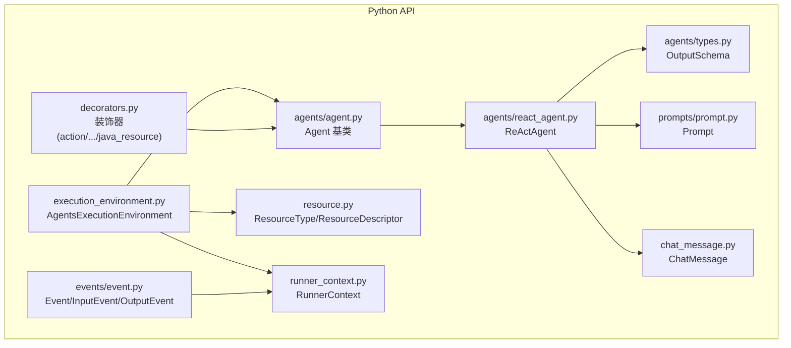
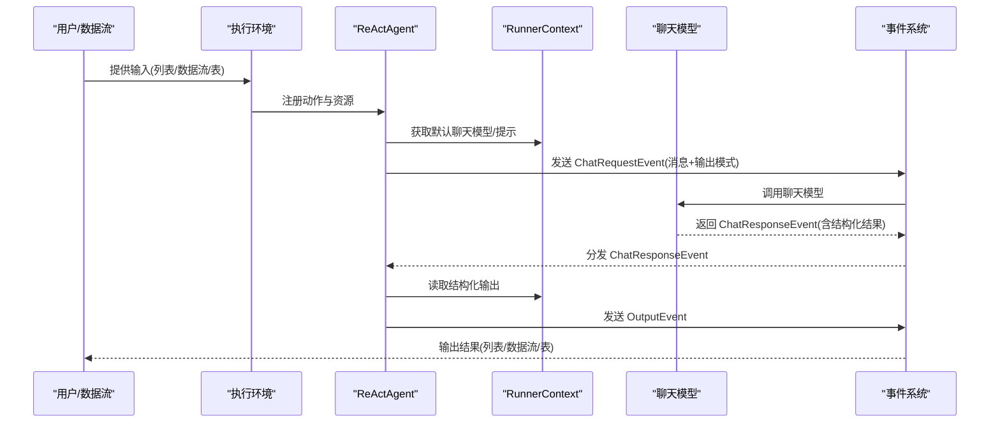
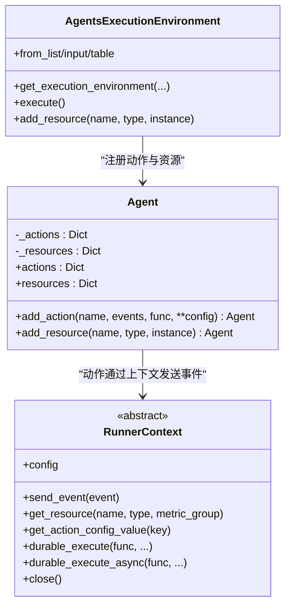
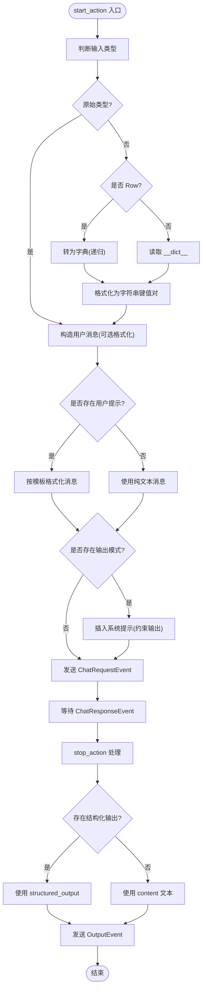
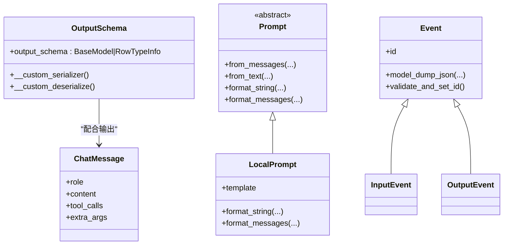
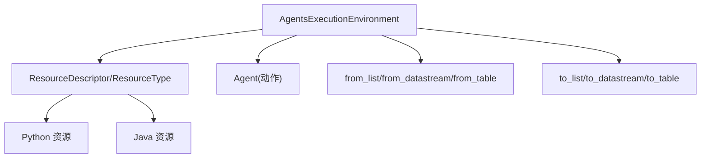
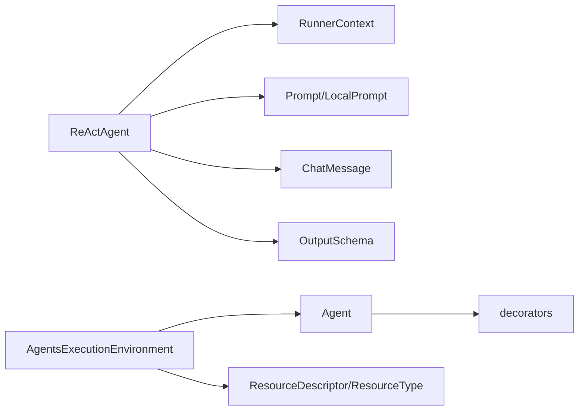

# Python 代理 API

<cite>
**本文引用的文件**
- [python/flink_agents/api/agents/agent.py](file://python/flink_agents/api/agents/agent.py)
- [python/flink_agents/api/agents/react_agent.py](file://python/flink_agents/api/agents/react_agent.py)
- [python/flink_agents/api/agents/types.py](file://python/flink_agents/api/agents/types.py)
- [python/flink_agents/api/decorators.py](file://python/flink_agents/api/decorators.py)
- [python/flink_agents/api/events/event.py](file://python/flink_agents/api/events/event.py)
- [python/flink_agents/api/execution_environment.py](file://python/flink_agents/api/execution_environment.py)
- [python/flink_agents/api/resource.py](file://python/flink_agents/api/resource.py)
- [python/flink_agents/api/runner_context.py](file://python/flink_agents/api/runner_context.py)
- [python/flink_agents/api/prompts/prompt.py](file://python/flink_agents/api/prompts/prompt.py)
- [python/flink_agents/api/chat_message.py](file://python/flink_agents/api/chat_message.py)
- [api/src/main/java/org/apache/flink/agents/api/agents/Agent.java](file://api/src/main/java/org/apache/flink/agents/api/agents/Agent.java)
- [api/src/main/java/org/apache/flink/agents/api/agents/ReActAgent.java](file://api/src/main/java/org/apache/flink/agents/api/agents/ReActAgent.java)
- [python/flink_agents/e2e_tests/e2e_tests_integration/react_agent_test.py](file://python/flink_agents/e2e_tests/e2e_tests_integration/react_agent_test.py)
</cite>

## 目录
1. [简介](#简介)
2. [项目结构](#项目结构)
3. [核心组件](#核心组件)
4. [架构总览](#架构总览)
5. [详细组件分析](#详细组件分析)
6. [依赖关系分析](#依赖关系分析)
7. [性能考量](#性能考量)
8. [故障排查指南](#故障排查指南)
9. [结论](#结论)
10. [附录：示例与最佳实践](#附录示例与最佳实践)

## 简介
本文件为 Apache Flink Agents 的 Python 代理 API 提供系统化、可操作的开发指南。内容覆盖：
- Agent 基类的设计理念与实现细节（生命周期、动作注册、资源管理、配置选项）
- ReActAgent 的 Python 实现与思维-行动-观察循环工作原理
- Python 类型系统在代理中的应用（类型注解、数据结构、序列化/反序列化）
- 与 Java 代理的差异与互操作性
- 丰富的示例路径、最佳实践、错误处理策略与性能优化建议

## 项目结构
Python 代理 API 主要位于 python/flink_agents/api 子目录，围绕“代理基类 + 执行环境 + 资源与提示 + 事件与上下文”组织。ReActAgent 作为内置代理，基于函数调用能力直接从模型响应中提取工具调用，避免文本解析。

图表来源
- [python/flink_agents/api/agents/agent.py](file://python/flink_agents/api/agents/agent.py#L31-L160)
- [python/flink_agents/api/agents/react_agent.py](file://python/flink_agents/api/agents/react_agent.py#L42-L212)
- [python/flink_agents/api/agents/types.py](file://python/flink_agents/api/agents/types.py#L25-L68)
- [python/flink_agents/api/execution_environment.py](file://python/flink_agents/api/execution_environment.py#L91-L253)
- [python/flink_agents/api/resource.py](file://python/flink_agents/api/resource.py#L29-L318)
- [python/flink_agents/api/prompts/prompt.py](file://python/flink_agents/api/prompts/prompt.py#L28-L98)
- [python/flink_agents/api/chat_message.py](file://python/flink_agents/api/chat_message.py#L46-L70)
- [python/flink_agents/api/events/event.py](file://python/flink_agents/api/events/event.py#L33-L114)
- [python/flink_agents/api/runner_context.py](file://python/flink_agents/api/runner_context.py#L76-L291)
- [python/flink_agents/api/decorators.py](file://python/flink_agents/api/decorators.py#L23-L196)

章节来源
- [python/flink_agents/api/agents/agent.py](file://python/flink_agents/api/agents/agent.py#L31-L160)
- [python/flink_agents/api/execution_environment.py](file://python/flink_agents/api/execution_environment.py#L91-L253)

## 核心组件
- Agent 基类：统一的动作注册与资源管理接口，支持通过装饰器或实例方法添加动作与资源。
- ReActAgent：内置 ReAct 代理，基于函数调用能力，自动注入系统提示与输出模式约束，并在响应后输出结构化结果。
- Execution Environment：提供本地与远程两种执行环境，负责资源注册、输入构建与输出导出。
- Resource 体系：ResourceType 枚举与 ResourceDescriptor 描述符，支持 Python 与 Java 资源混用。
- RunnerContext：动作执行上下文，提供事件发送、资源获取、持久化执行、内存对象访问等能力。
- Prompt/ChatMessage：提示模板与消息载体，支持字符串与消息列表格式化。
- 类型系统：OutputSchema 使用 Pydantic 序列化/反序列化 RowTypeInfo 或 Pydantic 模型类，确保跨语言传输一致性。

章节来源
- [python/flink_agents/api/agents/agent.py](file://python/flink_agents/api/agents/agent.py#L31-L160)
- [python/flink_agents/api/agents/react_agent.py](file://python/flink_agents/api/agents/react_agent.py#L42-L212)
- [python/flink_agents/api/execution_environment.py](file://python/flink_agents/api/execution_environment.py#L91-L253)
- [python/flink_agents/api/resource.py](file://python/flink_agents/api/resource.py#L29-L318)
- [python/flink_agents/api/runner_context.py](file://python/flink_agents/api/runner_context.py#L76-L291)
- [python/flink_agents/api/prompts/prompt.py](file://python/flink_agents/api/prompts/prompt.py#L28-L98)
- [python/flink_agents/api/chat_message.py](file://python/flink_agents/api/chat_message.py#L46-L70)
- [python/flink_agents/api/agents/types.py](file://python/flink_agents/api/agents/types.py#L25-L68)

## 架构总览
下图展示了 Python 代理从输入到输出的关键流程：输入事件驱动 ReActAgent 启动动作，构造 ChatMessage 并发送 ChatRequestEvent；收到 ChatResponseEvent 后，stop 动作将结构化输出写入 OutputEvent。

图表来源
- [python/flink_agents/api/agents/react_agent.py](file://python/flink_agents/api/agents/react_agent.py#L144-L212)
- [python/flink_agents/api/events/event.py](file://python/flink_agents/api/events/event.py#L95-L114)
- [python/flink_agents/api/execution_environment.py](file://python/flink_agents/api/execution_environment.py#L167-L222)

章节来源
- [python/flink_agents/api/agents/react_agent.py](file://python/flink_agents/api/agents/react_agent.py#L144-L212)
- [python/flink_agents/api/events/event.py](file://python/flink_agents/api/events/event.py#L95-L114)

## 详细组件分析

### Agent 基类设计与生命周期
- 设计理念
  - 统一的动作注册接口 add_action，支持事件监听类型校验与唯一性约束。
  - 统一的资源注册接口 add_resource，支持 ResourceType 分类与重复性校验。
  - 支持装饰器声明式注册（如 action、chat_model_connection、tool 等），便于在类上直接标注行为与资源。
- 生命周期
  - 初始化阶段：初始化动作与资源字典，按 ResourceType 预分配命名空间。
  - 运行阶段：由执行环境扫描 Agent 的动作与资源，注入 RunnerContext 后触发事件驱动。
  - 清理阶段：RunnerContext.close 释放资源与内存对象。
- 配置选项与执行模式
  - 通过 Execution Environment 的配置对象设置错误处理策略、重试次数等全局选项。
  - 动作级配置可通过 action_config/get_action_config_value 访问，用于传递输出模式等参数。

图表来源
- [python/flink_agents/api/agents/agent.py](file://python/flink_agents/api/agents/agent.py#L31-L160)
- [python/flink_agents/api/runner_context.py](file://python/flink_agents/api/runner_context.py#L76-L291)
- [python/flink_agents/api/execution_environment.py](file://python/flink_agents/api/execution_environment.py#L91-L253)

章节来源
- [python/flink_agents/api/agents/agent.py](file://python/flink_agents/api/agents/agent.py#L31-L160)
- [python/flink_agents/api/runner_context.py](file://python/flink_agents/api/runner_context.py#L76-L291)
- [python/flink_agents/api/execution_environment.py](file://python/flink_agents/api/execution_environment.py#L91-L253)

### ReActAgent：思维-行动-观察循环
- 工作原理
  - start_action：根据输入类型（原始值/Row/Pojo）构造 ChatMessage；若提供 Prompt，则使用模板格式化；若提供输出模式（Pydantic 模型或 RowTypeInfo），则注入系统提示以约束输出格式。
  - 发送 ChatRequestEvent，携带消息与输出模式，交由聊天模型处理。
  - stop_action：接收 ChatResponseEvent，优先读取结构化输出（extra_args 中的 structured_output），否则回退为文本内容，最终生成 OutputEvent。
- 内置功能特性
  - 自动注入输出模式提示，提升结构化输出稳定性。
  - 支持多种输入形态，自动转换为消息列表。
  - 与工具链集成（通过聊天模型工具集），实现外部能力调用。
- 自定义配置方法
  - 通过 ResourceDescriptor 指定聊天模型连接与设置，以及工具列表。
  - 通过 Prompt 提供任务与示例，增强推理质量。
  - 通过 OutputSchema 指定输出模式（Pydantic 模型类或 RowTypeInfo）。

图表来源
- [python/flink_agents/api/agents/react_agent.py](file://python/flink_agents/api/agents/react_agent.py#L144-L212)
- [python/flink_agents/api/prompts/prompt.py](file://python/flink_agents/api/prompts/prompt.py#L58-L98)
- [python/flink_agents/api/chat_message.py](file://python/flink_agents/api/chat_message.py#L46-L70)

章节来源
- [python/flink_agents/api/agents/react_agent.py](file://python/flink_agents/api/agents/react_agent.py#L42-L212)
- [python/flink_agents/api/prompts/prompt.py](file://python/flink_agents/api/prompts/prompt.py#L58-L98)
- [python/flink_agents/api/chat_message.py](file://python/flink_agents/api/chat_message.py#L46-L70)

### Python 类型系统与序列化
- OutputSchema
  - 支持两类输出模式：Pydantic 模型类与 RowTypeInfo。
  - 自定义序列化/反序列化逻辑：当为 RowTypeInfo 时序列化字段名与类型信息；当为 Pydantic 模型类时序列化模块与类名，运行时动态导入。
- ChatMessage
  - 角色枚举（SYSTEM/USER/ASSISTANT/TOOL），支持 tool_calls 与额外参数。
- Prompt
  - 支持从字符串或消息列表创建，提供 format_string 与 format_messages 两种格式化方式。
- 事件序列化
  - Event 对象在缺少序列化能力时抛出异常，确保内容可确定性地生成 ID 并可序列化。

图表来源
- [python/flink_agents/api/agents/types.py](file://python/flink_agents/api/agents/types.py#L25-L68)
- [python/flink_agents/api/chat_message.py](file://python/flink_agents/api/chat_message.py#L46-L70)
- [python/flink_agents/api/prompts/prompt.py](file://python/flink_agents/api/prompts/prompt.py#L28-L98)
- [python/flink_agents/api/events/event.py](file://python/flink_agents/api/events/event.py#L33-L114)

章节来源
- [python/flink_agents/api/agents/types.py](file://python/flink_agents/api/agents/types.py#L25-L68)
- [python/flink_agents/api/chat_message.py](file://python/flink_agents/api/chat_message.py#L46-L70)
- [python/flink_agents/api/prompts/prompt.py](file://python/flink_agents/api/prompts/prompt.py#L28-L98)
- [python/flink_agents/api/events/event.py](file://python/flink_agents/api/events/event.py#L33-L114)

### 执行环境与资源管理
- 执行环境
  - 本地/远程双环境：本地用于 IDE 调试，远程用于与 PyFlink 数据流/表集成。
  - 资源注册：统一通过 add_resource 注册聊天模型连接、设置、工具、向量库、提示等。
  - 输入构建：from_list/from_datastream/from_table 将外部数据接入代理。
  - 输出导出：to_list/to_datastream/to_table 将结果写出。
- 资源类型与描述符
  - ResourceType 定义资源类别（聊天模型、嵌入模型、向量库、提示、工具、MCP 服务器等）。
  - ResourceDescriptor 支持 Python 与 Java 资源类名，运行时动态导入实例化。

图表来源
- [python/flink_agents/api/execution_environment.py](file://python/flink_agents/api/execution_environment.py#L91-L253)
- [python/flink_agents/api/resource.py](file://python/flink_agents/api/resource.py#L29-L318)

章节来源
- [python/flink_agents/api/execution_environment.py](file://python/flink_agents/api/execution_environment.py#L91-L253)
- [python/flink_agents/api/resource.py](file://python/flink_agents/api/resource.py#L29-L318)

### 与 Java 代理的差异与互操作性
- 差异点
  - Java Agent 通过注解（如 @Action）在编译期绑定方法签名；Python Agent 通过装饰器与运行时反射/描述符实现。
  - Java Agent 的 ReActAgent 在构造时生成方法引用并注入动作配置；Python Agent 在 __init__ 中直接注册动作与资源。
  - Java Agent 的资源描述符更偏向强类型与 Jackson Schema；Python Agent 更灵活，支持动态导入与 Pydantic 序列化。
- 互操作性
  - ResourceName 提供 Java 与 Python 双通道资源名称映射，可在同一执行环境中混用。
  - Execution Environment 在远程模式下会加载对应版本的 Flink Agents JAR，保证与 Java 运行时兼容。
  - OutputSchema 支持 RowTypeInfo，便于与 PyFlink 表类型系统无缝对接。

章节来源
- [api/src/main/java/org/apache/flink/agents/api/agents/Agent.java](file://api/src/main/java/org/apache/flink/agents/api/agents/Agent.java#L34-L131)
- [api/src/main/java/org/apache/flink/agents/api/agents/ReActAgent.java](file://api/src/main/java/org/apache/flink/agents/api/agents/ReActAgent.java#L51-L183)
- [python/flink_agents/api/resource.py](file://python/flink_agents/api/resource.py#L215-L318)
- [python/flink_agents/api/execution_environment.py](file://python/flink_agents/api/execution_environment.py#L126-L154)

## 依赖关系分析
- 组件耦合
  - ReActAgent 强依赖 RunnerContext（事件发送、资源获取、动作配置）、Prompt/ChatMessage（消息构造）、OutputSchema（输出模式）。
  - Agent 基类与装饰器解耦动作注册，提高扩展性。
  - Execution Environment 与 RunnerContext 解耦，前者负责输入/输出与资源注册，后者负责动作执行上下文。
- 外部依赖
  - PyFlink（数据流/表）、Pydantic（模型与序列化）、typing/typing_extensions（类型注解）。
- 潜在环路
  - 未发现直接循环依赖；事件与资源通过描述符与名称解耦。

图表来源
- [python/flink_agents/api/agents/react_agent.py](file://python/flink_agents/api/agents/react_agent.py#L42-L212)
- [python/flink_agents/api/runner_context.py](file://python/flink_agents/api/runner_context.py#L76-L291)
- [python/flink_agents/api/prompts/prompt.py](file://python/flink_agents/api/prompts/prompt.py#L28-L98)
- [python/flink_agents/api/chat_message.py](file://python/flink_agents/api/chat_message.py#L46-L70)
- [python/flink_agents/api/agents/types.py](file://python/flink_agents/api/agents/types.py#L25-L68)
- [python/flink_agents/api/agents/agent.py](file://python/flink_agents/api/agents/agent.py#L31-L160)
- [python/flink_agents/api/decorators.py](file://python/flink_agents/api/decorators.py#L23-L196)
- [python/flink_agents/api/execution_environment.py](file://python/flink_agents/api/execution_environment.py#L91-L253)
- [python/flink_agents/api/resource.py](file://python/flink_agents/api/resource.py#L29-L318)

章节来源
- [python/flink_agents/api/agents/react_agent.py](file://python/flink_agents/api/agents/react_agent.py#L42-L212)
- [python/flink_agents/api/agents/agent.py](file://python/flink_agents/api/agents/agent.py#L31-L160)
- [python/flink_agents/api/execution_environment.py](file://python/flink_agents/api/execution_environment.py#L91-L253)

## 性能考量
- 事件序列化与 ID 生成
  - Event 的内容决定性 ID 有助于状态一致性与去重，但序列化开销需关注 Row 等复杂对象。
- 输出模式约束
  - 通过系统提示约束输出格式可减少后处理成本，提高下游解析效率。
- 异步与持久化执行
  - 使用 durable_execute_async 与 AsyncExecutionResult 可在不引入 asyncio 的前提下实现串行异步执行，降低线程池竞争。
- 远程执行与 JAR 加载
  - 远程模式下按 Flink 版本选择对应 JAR，避免运行时找不到依赖导致的失败。

## 故障排查指南
- 输入类型不匹配
  - 当输入非原始类型且未提供 Prompt 时会报错，需提供 Prompt 将输入转换为消息。
- 输出模式不支持
  - OutputSchema 仅支持 Pydantic 模型类或 RowTypeInfo，其他类型会抛出类型错误。
- 资源重复注册
  - 同一资源名在同一类型下重复注册会触发异常，检查资源命名与类型。
- 事件不可序列化
  - Event 的额外属性必须可序列化，否则在生成 ID 或 dump 时抛出异常。
- 错误处理策略
  - 通过配置错误处理策略与最大重试次数，结合 durable_execute/durable_execute_async 保证幂等性。

章节来源
- [python/flink_agents/api/agents/react_agent.py](file://python/flink_agents/api/agents/react_agent.py#L164-L171)
- [python/flink_agents/api/agents/types.py](file://python/flink_agents/api/agents/types.py#L52-L68)
- [python/flink_agents/api/execution_environment.py](file://python/flink_agents/api/execution_environment.py#L247-L252)
- [python/flink_agents/api/events/event.py](file://python/flink_agents/api/events/event.py#L49-L94)

## 结论
Python 代理 API 以 Agent 基类为核心，结合 Execution Environment、RunnerContext、Prompt/ChatMessage 与 Resource 体系，提供了清晰、可扩展的代理开发框架。ReActAgent 通过函数调用与输出模式约束，简化了思维-行动-观察循环的实现。与 Java 代理相比，Python 版本在灵活性与易用性方面具有优势，同时通过 ResourceName 与版本化 JAR 实现了良好的互操作性。

## 附录：示例与最佳实践
- 示例路径
  - ReActAgent 基本用法与输出模式（Pydantic 模型类）：[python/flink_agents/e2e_tests/e2e_tests_integration/react_agent_test.py](file://python/flink_agents/e2e_tests/e2e_tests_integration/react_agent_test.py#L110-L134)
  - ReActAgent 表输出（RowTypeInfo）：[python/flink_agents/e2e_tests/e2e_tests_integration/react_agent_test.py](file://python/flink_agents/e2e_tests/e2e_tests_integration/react_agent_test.py#L194-L214)
  - 装饰器声明动作与资源：[python/flink_agents/api/decorators.py](file://python/flink_agents/api/decorators.py#L23-L196)
  - Agent 动作注册与资源管理：[python/flink_agents/api/agents/agent.py](file://python/flink_agents/api/agents/agent.py#L108-L160)
- 最佳实践
  - 明确输入类型与 Prompt：对非原始输入提供 Prompt，确保消息构造稳定。
  - 使用 OutputSchema 约束输出：在复杂场景下优先使用 Pydantic 模型类，便于类型安全与下游消费。
  - 合理使用 durable_execute/durable_execute_async：保证确定性与幂等性，避免副作用。
  - 资源命名与类型分离：统一命名规范，避免同类型重复注册。
  - 远程执行前准备：确保正确加载对应版本 JAR，避免运行时找不到依赖。