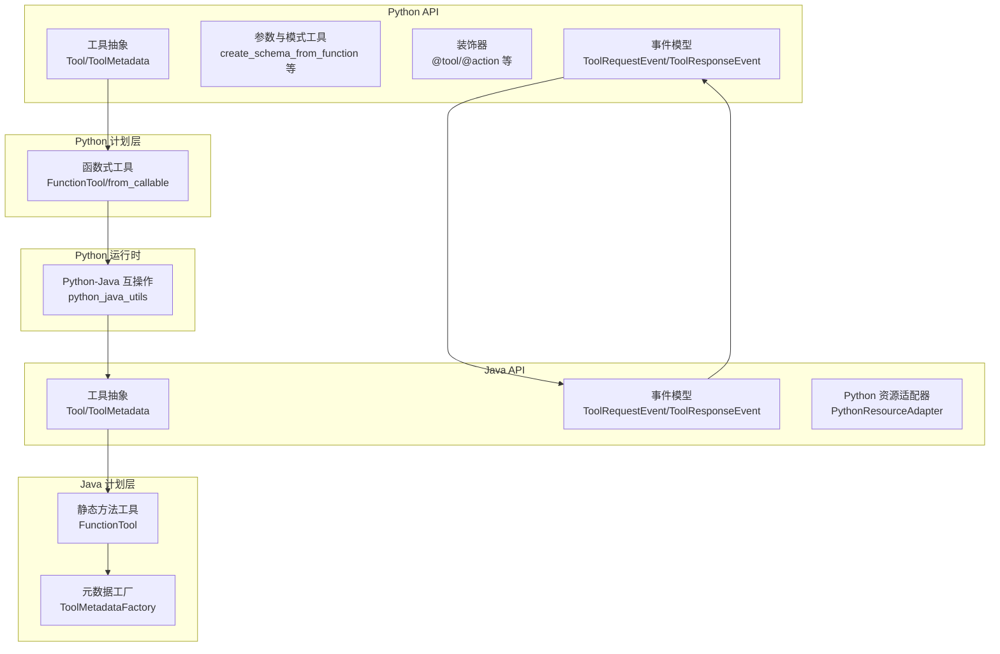
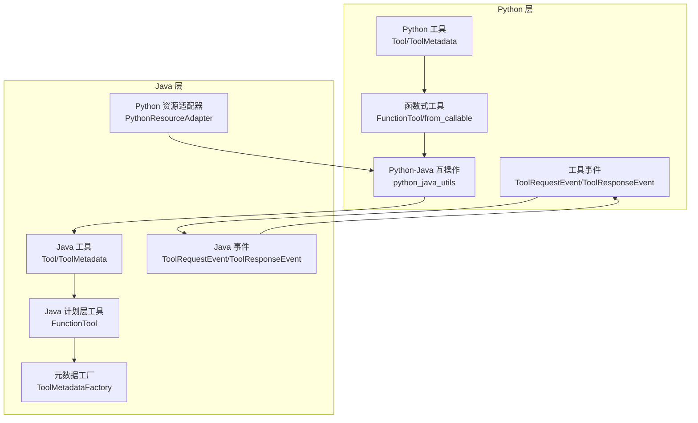
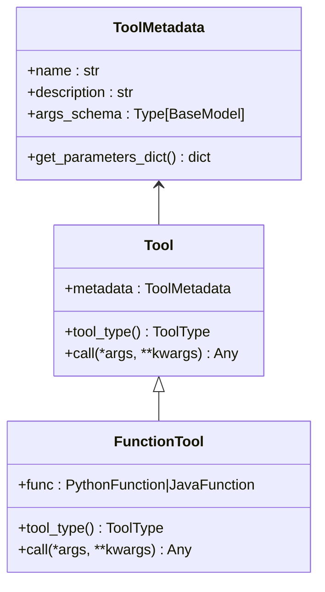
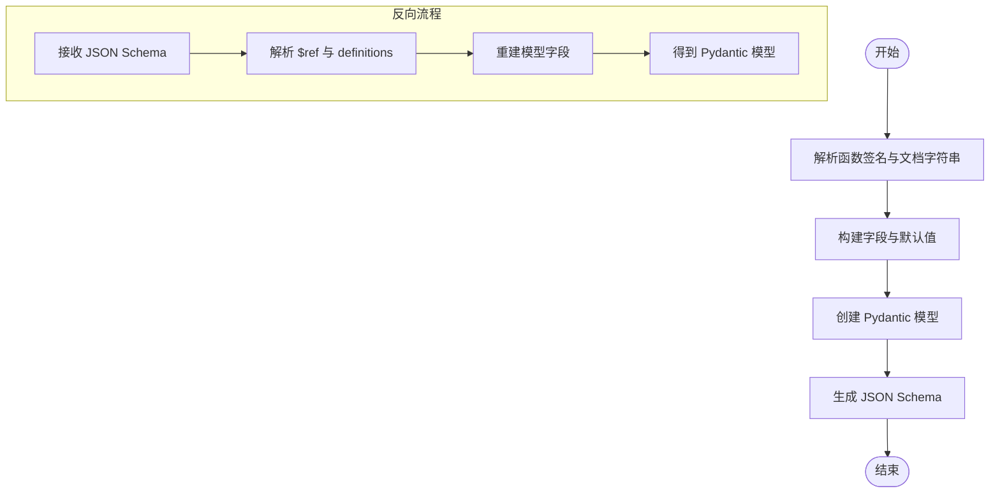
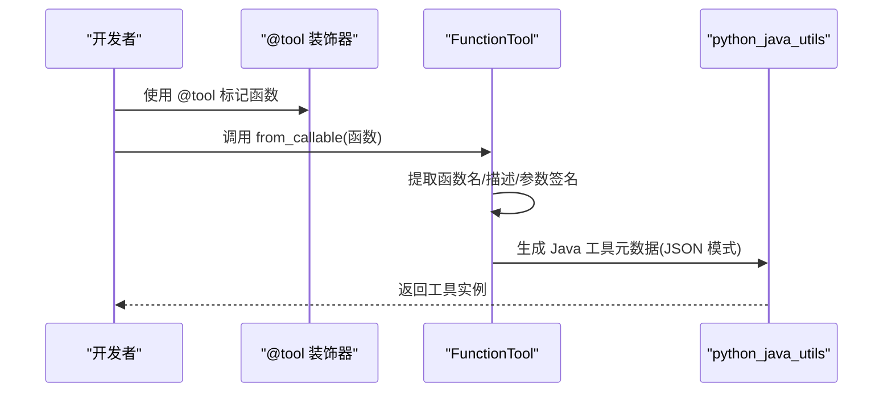
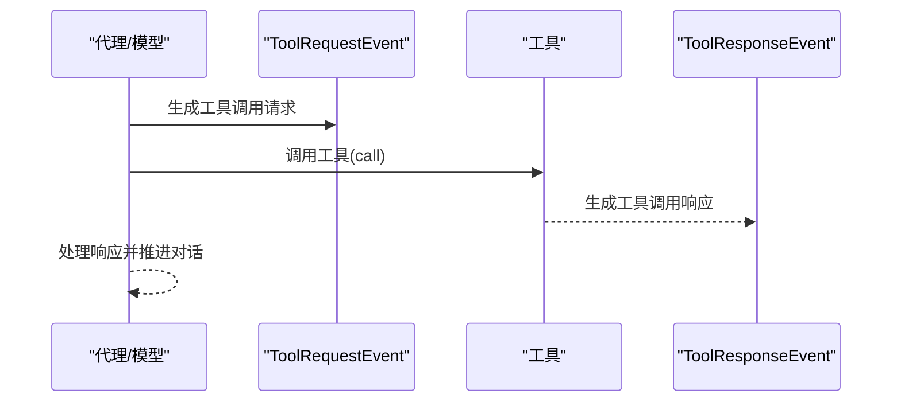
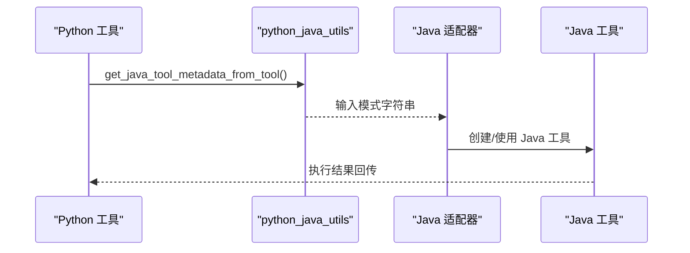
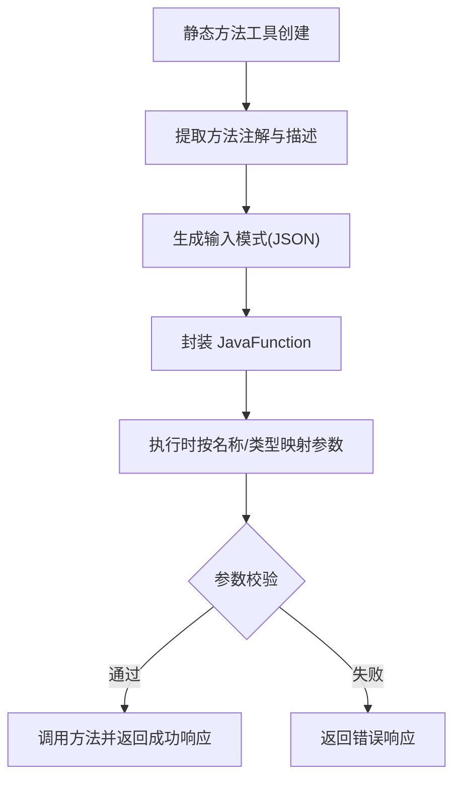
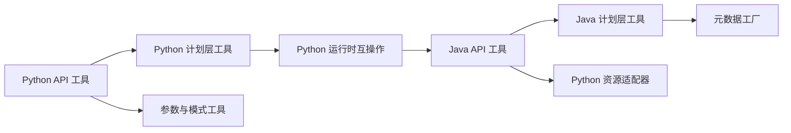

# Python 工具系统

<cite>
**本文引用的文件**
- [python/flink_agents/api/tools/tool.py](file://python/flink_agents/api/tools/tool.py)
- [python/flink_agents/api/tools/utils.py](file://python/flink_agents/api/tools/utils.py)
- [python/flink_agents/api/decorators.py](file://python/flink_agents/api/decorators.py)
- [python/flink_agents/api/events/tool_event.py](file://python/flink_agents/api/events/tool_event.py)
- [python/flink_agents/plan/tools/function_tool.py](file://python/flink_agents/plan/tools/function_tool.py)
- [python/flink_agents/runtime/python_java_utils.py](file://python/flink_agents/runtime/python_java_utils.py)
- [api/src/main/java/org/apache/flink/agents/api/tools/Tool.java](file://api/src/main/java/org/apache/flink/agents/api/tools/Tool.java)
- [api/src/main/java/org/apache/flink/agents/api/tools/ToolMetadata.java](file://api/src/main/java/org/apache/flink/agents/api/tools/ToolMetadata.java)
- [api/src/main/java/org/apache/flink/agents/api/event/ToolRequestEvent.java](file://api/src/main/java/org/apache/flink/agents/api/event/ToolRequestEvent.java)
- [api/src/main/java/org/apache/flink/agents/api/event/ToolResponseEvent.java](file://api/src/main/java/org/apache/flink/agents/api/event/ToolResponseEvent.java)
- [api/src/main/java/org/apache/flink/agents/api/resource/python/PythonResourceAdapter.java](file://api/src/main/java/org/apache/flink/agents/api/resource/python/PythonResourceAdapter.java)
- [api/src/main/java/org/apache/flink/agents/api/resource/python/PythonResourceWrapper.java](file://api/src/main/java/org/apache/flink/agents/api/resource/python/PythonResourceWrapper.java)
- [plan/src/main/java/org/apache/flink/agents/plan/tools/FunctionTool.java](file://plan/src/main/java/org/apache/flink/agents/plan/tools/FunctionTool.java)
- [plan/src/main/java/org/apache/flink/agents/plan/tools/ToolMetadataFactory.java](file://plan/src/main/java/org/apache/flink/agents/plan/tools/ToolMetadataFactory.java)
- [python/flink_agents/api/tests/test_tool.py](file://python/flink_agents/api/tests/test_tool.py)
- [python/flink_agents/e2e_tests/e2e_tests_integration/react_agent_tools.py](file://python/flink_agents/e2e_tests/e2e_tests_integration/react_agent_tools.py)
</cite>

## 目录
1. [引言](#引言)
2. [项目结构](#项目结构)
3. [核心组件](#核心组件)
4. [架构总览](#架构总览)
5. [组件详解](#组件详解)
6. [依赖关系分析](#依赖关系分析)
7. [性能考量](#性能考量)
8. [故障排查指南](#故障排查指南)
9. [结论](#结论)
10. [附录](#附录)

## 引言
本文件面向 Python 开发者，系统化梳理 Apache Flink Agents 的 Python 工具系统设计与实现，覆盖以下主题：
- Python 工具接口设计：Tool 抽象基类、工具元数据与参数处理机制
- 工具注册与发现：工具装饰器、元数据提取与类型验证
- 与事件系统的集成：工具调用事件的生成、处理与响应
- 跨语言互操作：Python 工具与 Java 工具的互操作、数据传递与序列化
- 实践指南：从零创建自定义工具、定义输入输出模式、实现业务逻辑
- 最佳实践、错误处理策略与性能优化建议

## 项目结构
Python 工具系统主要分布在以下模块：
- API 层（Python）：工具抽象、元数据、参数工具、装饰器、事件
- 计划层（Python）：函数式工具包装、从可调用对象生成工具
- 运行时（Python）：与 Java 的互操作工具、序列化与转换
- API 层（Java）：工具抽象、元数据、事件模型
- 计划层（Java）：静态方法工具、元数据工厂、参数映射与校验
- 资源适配（Java）：Python 资源适配器与包装器接口

**图表来源**
- [python/flink_agents/api/tools/tool.py](file://python/flink_agents/api/tools/tool.py#L116-L156)
- [python/flink_agents/plan/tools/function_tool.py](file://python/flink_agents/plan/tools/function_tool.py#L28-L65)
- [python/flink_agents/runtime/python_java_utils.py](file://python/flink_agents/runtime/python_java_utils.py#L104-L151)
- [api/src/main/java/org/apache/flink/agents/api/tools/Tool.java](file://api/src/main/java/org/apache/flink/agents/api/tools/Tool.java#L30-L70)
- [plan/src/main/java/org/apache/flink/agents/plan/tools/FunctionTool.java](file://plan/src/main/java/org/apache/flink/agents/plan/tools/FunctionTool.java#L47-L142)
- [plan/src/main/java/org/apache/flink/agents/plan/tools/ToolMetadataFactory.java](file://plan/src/main/java/org/apache/flink/agents/plan/tools/ToolMetadataFactory.java#L34-L54)
- [api/src/main/java/org/apache/flink/agents/api/event/ToolRequestEvent.java](file://api/src/main/java/org/apache/flink/agents/api/event/ToolRequestEvent.java#L26-L63)
- [api/src/main/java/org/apache/flink/agents/api/event/ToolResponseEvent.java](file://api/src/main/java/org/apache/flink/agents/api/event/ToolResponseEvent.java#L27-L95)
- [api/src/main/java/org/apache/flink/agents/api/resource/python/PythonResourceAdapter.java](file://api/src/main/java/org/apache/flink/agents/api/resource/python/PythonResourceAdapter.java#L37-L141)

**章节来源**
- [python/flink_agents/api/tools/tool.py](file://python/flink_agents/api/tools/tool.py#L1-L156)
- [python/flink_agents/plan/tools/function_tool.py](file://python/flink_agents/plan/tools/function_tool.py#L1-L65)
- [python/flink_agents/runtime/python_java_utils.py](file://python/flink_agents/runtime/python_java_utils.py#L1-L284)
- [api/src/main/java/org/apache/flink/agents/api/tools/Tool.java](file://api/src/main/java/org/apache/flink/agents/api/tools/Tool.java#L1-L70)
- [plan/src/main/java/org/apache/flink/agents/plan/tools/FunctionTool.java](file://plan/src/main/java/org/apache/flink/agents/plan/tools/FunctionTool.java#L1-L142)
- [plan/src/main/java/org/apache/flink/agents/plan/tools/ToolMetadataFactory.java](file://plan/src/main/java/org/apache/flink/agents/plan/tools/ToolMetadataFactory.java#L1-L54)
- [api/src/main/java/org/apache/flink/agents/api/event/ToolRequestEvent.java](file://api/src/main/java/org/apache/flink/agents/api/event/ToolRequestEvent.java#L1-L63)
- [api/src/main/java/org/apache/flink/agents/api/event/ToolResponseEvent.java](file://api/src/main/java/org/apache/flink/agents/api/event/ToolResponseEvent.java#L1-L95)
- [api/src/main/java/org/apache/flink/agents/api/resource/python/PythonResourceAdapter.java](file://api/src/main/java/org/apache/flink/agents/api/resource/python/PythonResourceAdapter.java#L1-L141)

## 核心组件
- 工具抽象与元数据
  - Python：Tool 抽象类、ToolMetadata（含参数模式）、工具类型枚举、函数式工具容器
  - Java：Tool 抽象类、ToolMetadata（JSON 字段名约定）
- 参数与模式工具
  - 从函数签名与文档字符串推导 Pydantic 模型；从 JSON Schema 反向构建模型；Java 工具模式互转
- 装饰器与注册
  - @tool 等装饰器标记资源与工具；计划层通过注解工厂生成元数据
- 事件系统
  - ToolRequestEvent/ToolResponseEvent 在 Python 与 Java 间对等存在
- 跨语言互操作
  - Python-Java 互操作工具：消息、文档、查询、集合、工具元数据的双向转换；Java 资源适配器接口

**章节来源**
- [python/flink_agents/api/tools/tool.py](file://python/flink_agents/api/tools/tool.py#L30-L156)
- [python/flink_agents/api/tools/utils.py](file://python/flink_agents/api/tools/utils.py#L28-L231)
- [python/flink_agents/api/decorators.py](file://python/flink_agents/api/decorators.py#L125-L140)
- [api/src/main/java/org/apache/flink/agents/api/tools/Tool.java](file://api/src/main/java/org/apache/flink/agents/api/tools/Tool.java#L30-L70)
- [api/src/main/java/org/apache/flink/agents/api/tools/ToolMetadata.java](file://api/src/main/java/org/apache/flink/agents/api/tools/ToolMetadata.java#L32-L89)
- [python/flink_agents/api/events/tool_event.py](file://python/flink_agents/api/events/tool_event.py#L24-L56)
- [api/src/main/java/org/apache/flink/agents/api/event/ToolRequestEvent.java](file://api/src/main/java/org/apache/flink/agents/api/event/ToolRequestEvent.java#L26-L63)
- [api/src/main/java/org/apache/flink/agents/api/event/ToolResponseEvent.java](file://api/src/main/java/org/apache/flink/agents/api/event/ToolResponseEvent.java#L27-L95)
- [python/flink_agents/runtime/python_java_utils.py](file://python/flink_agents/runtime/python_java_utils.py#L104-L151)
- [api/src/main/java/org/apache/flink/agents/api/resource/python/PythonResourceAdapter.java](file://api/src/main/java/org/apache/flink/agents/api/resource/python/PythonResourceAdapter.java#L37-L141)

## 架构总览
下图展示了 Python 工具在系统中的位置与交互路径，以及与 Java 层的互操作关系。

**图表来源**
- [python/flink_agents/api/tools/tool.py](file://python/flink_agents/api/tools/tool.py#L116-L156)
- [python/flink_agents/plan/tools/function_tool.py](file://python/flink_agents/plan/tools/function_tool.py#L28-L65)
- [python/flink_agents/runtime/python_java_utils.py](file://python/flink_agents/runtime/python_java_utils.py#L104-L151)
- [api/src/main/java/org/apache/flink/agents/api/tools/Tool.java](file://api/src/main/java/org/apache/flink/agents/api/tools/Tool.java#L30-L70)
- [plan/src/main/java/org/apache/flink/agents/plan/tools/FunctionTool.java](file://plan/src/main/java/org/apache/flink/agents/plan/tools/FunctionTool.java#L47-L142)
- [plan/src/main/java/org/apache/flink/agents/plan/tools/ToolMetadataFactory.java](file://plan/src/main/java/org/apache/flink/agents/plan/tools/ToolMetadataFactory.java#L34-L54)
- [api/src/main/java/org/apache/flink/agents/api/event/ToolRequestEvent.java](file://api/src/main/java/org/apache/flink/agents/api/event/ToolRequestEvent.java#L26-L63)
- [api/src/main/java/org/apache/flink/agents/api/event/ToolResponseEvent.java](file://api/src/main/java/org/apache/flink/agents/api/event/ToolResponseEvent.java#L27-L95)
- [api/src/main/java/org/apache/flink/agents/api/resource/python/PythonResourceAdapter.java](file://api/src/main/java/org/apache/flink/agents/api/resource/python/PythonResourceAdapter.java#L37-L141)

## 组件详解

### 工具抽象与元数据（Python）
- Tool 抽象类
  - 定义工具类型与调用接口，派生类需实现工具类型与调用逻辑
- ToolMetadata
  - 包含名称、描述与参数模式（Pydantic 模型），支持序列化为 JSON Schema 并反序列化
- 工具类型枚举
  - 支持内置模型工具、用户函数工具、远程函数、MCP 工具
- 函数式工具容器
  - FunctionTool 作为可序列化资源，封装可调用对象

**图表来源**
- [python/flink_agents/api/tools/tool.py](file://python/flink_agents/api/tools/tool.py#L116-L156)
- [python/flink_agents/api/tools/tool.py](file://python/flink_agents/api/tools/tool.py#L53-L101)

**章节来源**
- [python/flink_agents/api/tools/tool.py](file://python/flink_agents/api/tools/tool.py#L30-L156)

### 参数与模式工具（Python）
- 从函数签名与文档字符串生成 Pydantic 模型
  - 解析参数类型、默认值、描述，支持 Annotated 元信息
- 从 JSON Schema 反向构建 Pydantic 模型
  - 处理 $ref、anyOf、数组、对象等复杂类型
- Java 工具模式互转
  - 将 Java 工具输入模式转换为 Python 模型，或将 Python 模型转换为 Java 模式字符串

**图表来源**
- [python/flink_agents/api/tools/utils.py](file://python/flink_agents/api/tools/utils.py#L28-L72)
- [python/flink_agents/api/tools/utils.py](file://python/flink_agents/api/tools/utils.py#L109-L180)

**章节来源**
- [python/flink_agents/api/tools/utils.py](file://python/flink_agents/api/tools/utils.py#L28-L231)

### 工具注册与发现（Python）
- 装饰器
  - @tool 标记函数为工具；@action 标记动作监听事件
- 计划层工具
  - from_callable 从可调用对象创建函数式工具，自动提取元数据与参数模式
- 类型验证
  - 工具类型枚举统一管理工具类别

**图表来源**
- [python/flink_agents/api/decorators.py](file://python/flink_agents/api/decorators.py#L125-L140)
- [python/flink_agents/plan/tools/function_tool.py](file://python/flink_agents/plan/tools/function_tool.py#L50-L65)
- [python/flink_agents/runtime/python_java_utils.py](file://python/flink_agents/runtime/python_java_utils.py#L256-L259)

**章节来源**
- [python/flink_agents/api/decorators.py](file://python/flink_agents/api/decorators.py#L125-L140)
- [python/flink_agents/plan/tools/function_tool.py](file://python/flink_agents/plan/tools/function_tool.py#L28-L65)
- [python/flink_agents/runtime/python_java_utils.py](file://python/flink_agents/runtime/python_java_utils.py#L256-L259)

### 与事件系统的集成（Python）
- 工具请求事件
  - ToolRequestEvent：包含模型名与待执行的工具调用批次
- 工具响应事件
  - ToolResponseEvent：包含请求 ID、结果映射、成功/错误状态与外部 ID 映射
- 事件序列
  - 由聊天模型或代理生成 ToolRequestEvent，工具执行后产生 ToolResponseEvent

**图表来源**
- [python/flink_agents/api/events/tool_event.py](file://python/flink_agents/api/events/tool_event.py#L24-L56)
- [api/src/main/java/org/apache/flink/agents/api/event/ToolRequestEvent.java](file://api/src/main/java/org/apache/flink/agents/api/event/ToolRequestEvent.java#L26-L63)
- [api/src/main/java/org/apache/flink/agents/api/event/ToolResponseEvent.java](file://api/src/main/java/org/apache/flink/agents/api/event/ToolResponseEvent.java#L27-L95)

**章节来源**
- [python/flink_agents/api/events/tool_event.py](file://python/flink_agents/api/events/tool_event.py#L24-L56)
- [api/src/main/java/org/apache/flink/agents/api/event/ToolRequestEvent.java](file://api/src/main/java/org/apache/flink/agents/api/event/ToolRequestEvent.java#L26-L63)
- [api/src/main/java/org/apache/flink/agents/api/event/ToolResponseEvent.java](file://api/src/main/java/org/apache/flink/agents/api/event/ToolResponseEvent.java#L27-L95)

### 跨语言互操作（Python 与 Java）
- Java 工具到 Python 工具
  - 从 Java Tool 获取名称/描述与输入模式字符串，转换为 Python ToolMetadata，并封装为 Python JavaTool
- Python 工具到 Java 工具
  - 从 Python 工具的参数模式生成 Java 工具输入模式字符串，供 Java 层使用
- 资源适配与包装
  - PythonResourceAdapter 提供资源检索、初始化、对象转换与方法调用能力
  - PythonResourceWrapper 提供获取底层 Python 资源的能力

**图表来源**
- [python/flink_agents/runtime/python_java_utils.py](file://python/flink_agents/runtime/python_java_utils.py#L104-L151)
- [python/flink_agents/runtime/python_java_utils.py](file://python/flink_agents/runtime/python_java_utils.py#L256-L259)
- [api/src/main/java/org/apache/flink/agents/api/resource/python/PythonResourceAdapter.java](file://api/src/main/java/org/apache/flink/agents/api/resource/python/PythonResourceAdapter.java#L37-L141)
- [api/src/main/java/org/apache/flink/agents/api/resource/python/PythonResourceWrapper.java](file://api/src/main/java/org/apache/flink/agents/api/resource/python/PythonResourceWrapper.java#L24-L33)

**章节来源**
- [python/flink_agents/runtime/python_java_utils.py](file://python/flink_agents/runtime/python_java_utils.py#L104-L151)
- [python/flink_agents/runtime/python_java_utils.py](file://python/flink_agents/runtime/python_java_utils.py#L256-L259)
- [api/src/main/java/org/apache/flink/agents/api/resource/python/PythonResourceAdapter.java](file://api/src/main/java/org/apache/flink/agents/api/resource/python/PythonResourceAdapter.java#L37-L141)
- [api/src/main/java/org/apache/flink/agents/api/resource/python/PythonResourceWrapper.java](file://api/src/main/java/org/apache/flink/agents/api/resource/python/PythonResourceWrapper.java#L24-L33)

### Java 工具与参数映射（计划层）
- 静态方法工具
  - 仅支持静态方法；通过注解工厂提取元数据与输入模式
- 参数映射与校验
  - 按名称与类型映射 ToolParameters 到方法参数，支持 @ToolParam 的名称、必填与默认值约束

**图表来源**
- [plan/src/main/java/org/apache/flink/agents/plan/tools/FunctionTool.java](file://plan/src/main/java/org/apache/flink/agents/plan/tools/FunctionTool.java#L57-L97)
- [plan/src/main/java/org/apache/flink/agents/plan/tools/FunctionTool.java](file://plan/src/main/java/org/apache/flink/agents/plan/tools/FunctionTool.java#L104-L136)
- [plan/src/main/java/org/apache/flink/agents/plan/tools/ToolMetadataFactory.java](file://plan/src/main/java/org/apache/flink/agents/plan/tools/ToolMetadataFactory.java#L36-L52)

**章节来源**
- [plan/src/main/java/org/apache/flink/agents/plan/tools/FunctionTool.java](file://plan/src/main/java/org/apache/flink/agents/plan/tools/FunctionTool.java#L47-L142)
- [plan/src/main/java/org/apache/flink/agents/plan/tools/ToolMetadataFactory.java](file://plan/src/main/java/org/apache/flink/agents/plan/tools/ToolMetadataFactory.java#L34-L54)

### 示例：创建自定义工具
- 步骤
  - 编写带文档字符串的函数，明确参数与返回值
  - 使用 @tool 装饰器标记为工具
  - 使用 from_callable 或直接在计划中声明，系统自动提取元数据与参数模式
  - 在代理或动作中使用该工具进行调用
- 参考
  - 端到端示例：加法与乘法工具函数
  - 单元测试：ToolMetadata 序列化/反序列化验证

**章节来源**
- [python/flink_agents/e2e_tests/e2e_tests_integration/react_agent_tools.py](file://python/flink_agents/e2e_tests/e2e_tests_integration/react_agent_tools.py#L20-L54)
- [python/flink_agents/api/tests/test_tool.py](file://python/flink_agents/api/tests/test_tool.py#L31-L72)

## 依赖关系分析
- Python 工具层依赖
  - 工具抽象与元数据依赖 Pydantic 模型与序列化
  - 函数式工具依赖计划层函数包装与工具创建
- Java 工具层依赖
  - 工具抽象与元数据依赖 Jackson 注解与序列化
  - 静态方法工具依赖注解工厂与参数映射
- 互操作依赖
  - Python-Java 工具元数据互转依赖 JSON Schema 与类型映射
  - 资源适配器提供对象转换与方法调用桥接

**图表来源**
- [python/flink_agents/api/tools/tool.py](file://python/flink_agents/api/tools/tool.py#L116-L156)
- [python/flink_agents/plan/tools/function_tool.py](file://python/flink_agents/plan/tools/function_tool.py#L28-L65)
- [python/flink_agents/runtime/python_java_utils.py](file://python/flink_agents/runtime/python_java_utils.py#L104-L151)
- [api/src/main/java/org/apache/flink/agents/api/tools/Tool.java](file://api/src/main/java/org/apache/flink/agents/api/tools/Tool.java#L30-L70)
- [plan/src/main/java/org/apache/flink/agents/plan/tools/FunctionTool.java](file://plan/src/main/java/org/apache/flink/agents/plan/tools/FunctionTool.java#L47-L142)
- [plan/src/main/java/org/apache/flink/agents/plan/tools/ToolMetadataFactory.java](file://plan/src/main/java/org/apache/flink/agents/plan/tools/ToolMetadataFactory.java#L34-L54)
- [api/src/main/java/org/apache/flink/agents/api/resource/python/PythonResourceAdapter.java](file://api/src/main/java/org/apache/flink/agents/api/resource/python/PythonResourceAdapter.java#L37-L141)

**章节来源**
- 同“图表来源”所列文件

## 性能考量
- 模式生成与缓存
  - 对频繁使用的工具模式，建议缓存 Pydantic 模型与 JSON Schema，避免重复解析
- 序列化开销
  - Python-Java 互操作使用 cloudpickle 与 JSON Schema，注意大对象与深层嵌套结构的序列化成本
- 参数映射优化
  - Java 静态方法工具按名称映射参数，建议保持参数命名简洁一致，减少反射查找成本
- 事件处理
  - 批量工具调用（ToolRequestEvent.tool_calls）应尽量合并与并发执行，降低往返延迟

## 故障排查指南
- 工具类型不匹配
  - 确认工具类型枚举与实际实现一致，避免跨类型误用
- 参数模式不兼容
  - 检查 Python 与 Java 之间的模式互转是否正确，确保类型映射与约束一致
- 事件 ID 规范化
  - 工具调用 ID 应统一为字符串格式，避免下游系统差异导致的错误
- 方法参数缺失
  - Java 静态方法工具要求 @ToolParam 的必填参数必须提供，否则会返回错误响应

**章节来源**
- [python/flink_agents/runtime/python_java_utils.py](file://python/flink_agents/runtime/python_java_utils.py#L153-L173)
- [plan/src/main/java/org/apache/flink/agents/plan/tools/FunctionTool.java](file://plan/src/main/java/org/apache/flink/agents/plan/tools/FunctionTool.java#L120-L128)

## 结论
Apache Flink Agents 的 Python 工具系统以清晰的抽象与严格的元数据驱动为核心，结合事件系统与跨语言互操作，为开发者提供了从定义、注册、执行到响应的完整工具生命周期支持。通过 Pydantic 模式与 JSON Schema 的双向转换，系统实现了 Python 与 Java 工具的无缝衔接；通过装饰器与计划层注解工厂，简化了工具的声明与发现流程。遵循本文最佳实践与排错建议，可高效构建稳定可靠的工具扩展。

## 附录
- 快速参考
  - 工具装饰器：@tool、@action
  - 工具创建：from_callable
  - 元数据互转：get_java_tool_metadata_from_tool、create_java_tool_schema_str_from_model
  - 事件类型：ToolRequestEvent、ToolResponseEvent
  - 资源适配：PythonResourceAdapter、PythonResourceWrapper