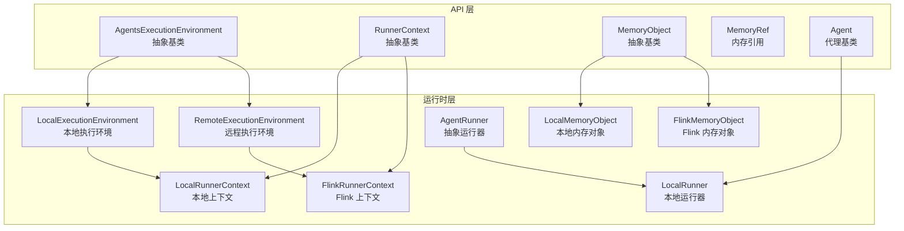
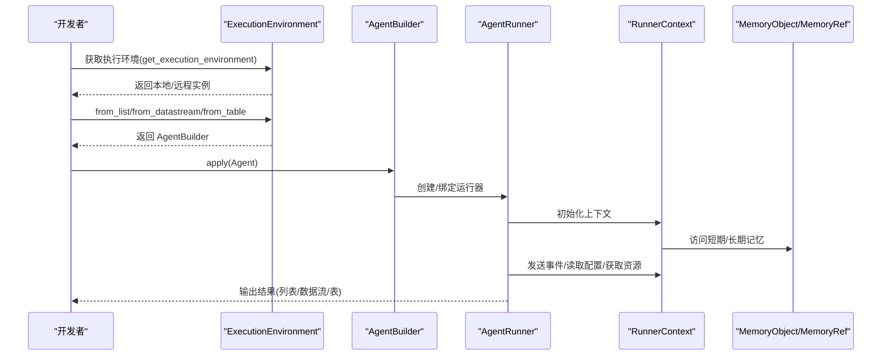
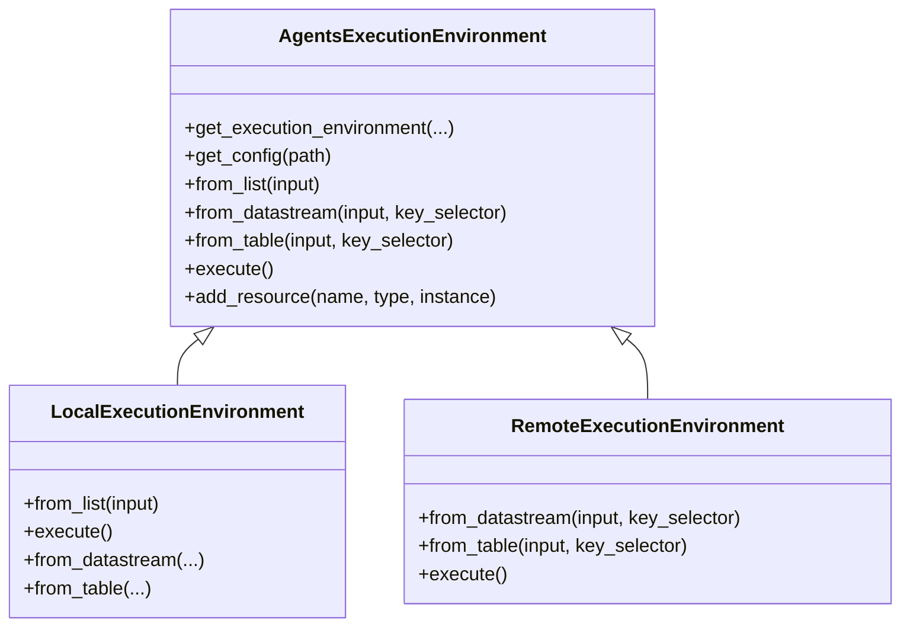
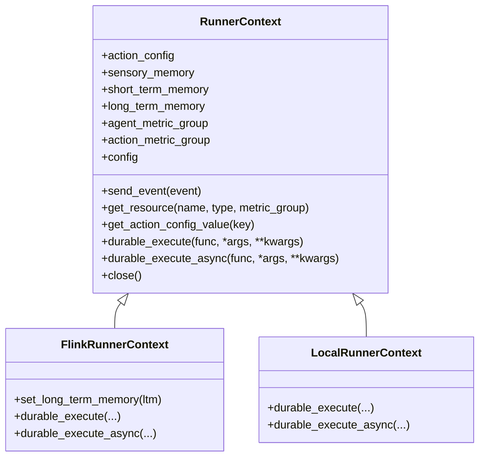
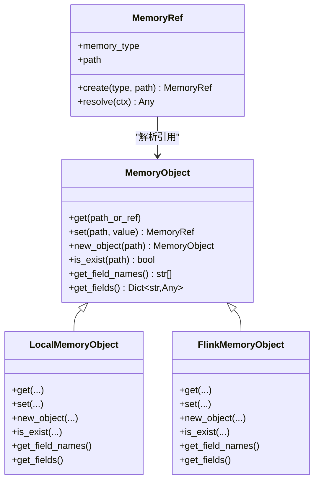
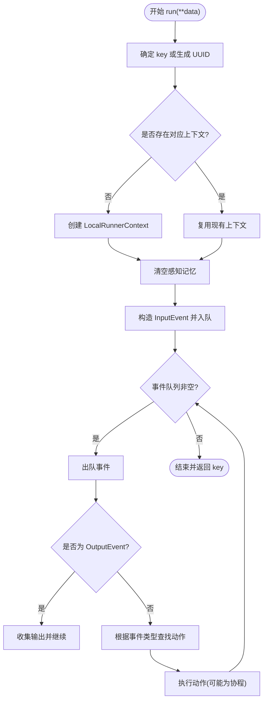
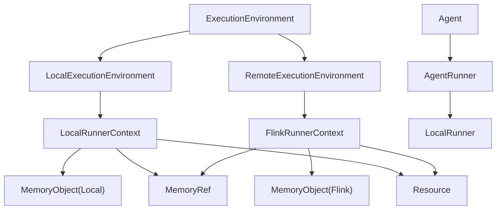

# Python 执行环境

<cite>
**本文档引用的文件**
- [execution_environment.py](file://python/flink_agents/api/execution_environment.py)
- [runner_context.py](file://python/flink_agents/api/runner_context.py)
- [memory_object.py](file://python/flink_agents/api/memory_object.py)
- [memory_reference.py](file://python/flink_agents/api/memory_reference.py)
- [local_execution_environment.py](file://python/flink_agents/runtime/local_execution_environment.py)
- [remote_execution_environment.py](file://python/flink_agents/runtime/remote_execution_environment.py)
- [flink_runner_context.py](file://python/flink_agents/runtime/flink_runner_context.py)
- [local_memory_object.py](file://python/flink_agents/runtime/local_memory_object.py)
- [flink_memory_object.py](file://python/flink_agents/runtime/flink_memory_object.py)
- [local_runner.py](file://python/flink_agents/runtime/local_runner.py)
- [agent_runner.py](file://python/flink_agents/runtime/agent_runner.py)
- [execute_test_agent.py](file://python/flink_agents/e2e_tests/e2e_tests_integration/execute_test_agent.py)
- [chat_model_integration_agent.py](file://python/flink_agents/e2e_tests/e2e_tests_integration/chat_model_integration_agent.py)
- [agent.py](file://python/flink_agents/api/agents/agent.py)
</cite>

## 目录
1. [简介](#简介)
2. [项目结构](#项目结构)
3. [核心组件](#核心组件)
4. [架构总览](#架构总览)
5. [详细组件分析](#详细组件分析)
6. [依赖关系分析](#依赖关系分析)
7. [性能考量](#性能考量)
8. [故障排除指南](#故障排除指南)
9. [结论](#结论)
10. [附录：完整示例与最佳实践](#附录完整示例与最佳实践)

## 简介
本文件面向 Python 开发者，系统化阐述 Apache Flink Agents 的 Python 执行环境设计与实现，覆盖以下主题：
- ExecutionEnvironment 基类与两类执行环境（本地/远程）的职责与差异
- 环境配置与生命周期管理
- Python RunnerContext 的使用方法、状态管理与资源访问
- Python 内存对象系统（MemoryObject）与内存引用（MemoryRef）
- Python 执行环境与 Java 执行环境的互操作性与桥接
- 完整示例与最佳实践、性能优化与故障排除建议

## 项目结构
Python 执行环境由“API 层”和“运行时层”组成：
- API 层：定义抽象接口与通用模型（ExecutionEnvironment、RunnerContext、MemoryObject、MemoryRef 等）
- 运行时层：提供本地与远程两种具体实现，并与 Java 运行时进行交互

图表来源
- [execution_environment.py](file://python/flink_agents/api/execution_environment.py#L91-L253)
- [runner_context.py](file://python/flink_agents/api/runner_context.py#L76-L291)
- [memory_object.py](file://python/flink_agents/api/memory_object.py#L32-L126)
- [memory_reference.py](file://python/flink_agents/api/memory_reference.py#L30-L76)
- [local_execution_environment.py](file://python/flink_agents/runtime/local_execution_environment.py#L92-L179)
- [remote_execution_environment.py](file://python/flink_agents/runtime/remote_execution_environment.py#L160-L335)
- [local_runner.py](file://python/flink_agents/runtime/local_runner.py#L45-L356)
- [flink_runner_context.py](file://python/flink_agents/runtime/flink_runner_context.py#L181-L572)
- [local_memory_object.py](file://python/flink_agents/runtime/local_memory_object.py#L24-L244)
- [flink_memory_object.py](file://python/flink_agents/runtime/flink_memory_object.py#L24-L109)
- [agent_runner.py](file://python/flink_agents/runtime/agent_runner.py#L22-L44)

章节来源
- [execution_environment.py](file://python/flink_agents/api/execution_environment.py#L91-L253)
- [local_execution_environment.py](file://python/flink_agents/runtime/local_execution_environment.py#L92-L179)
- [remote_execution_environment.py](file://python/flink_agents/runtime/remote_execution_environment.py#L160-L335)

## 核心组件
- ExecutionEnvironment 抽象基类：统一定义资源注册、输入构建（from_list/from_datastream/from_table）、执行入口（execute）与配置获取（get_config）。通过工厂方法按是否传入 PyFlink 环境选择本地或远程实现。
- RunnerContext 抽象基类：提供事件发送、资源获取、动作配置读取、短期/长期记忆访问、指标组访问以及持久化执行（durable_execute/durable_execute_async）等能力。
- MemoryObject 抽象基类：定义内存对象的统一接口（get/set/new_object/is_exist/get_field_names/get_fields），支持路径式访问与引用解析。
- MemoryRef 内存引用：封装内存类型与路径，用于跨上下文解析实际数据。

章节来源
- [execution_environment.py](file://python/flink_agents/api/execution_environment.py#L91-L253)
- [runner_context.py](file://python/flink_agents/api/runner_context.py#L76-L291)
- [memory_object.py](file://python/flink_agents/api/memory_object.py#L32-L126)
- [memory_reference.py](file://python/flink_agents/api/memory_reference.py#L30-L76)

## 架构总览
Python 执行环境通过“抽象接口 + 具体实现”的方式，将 Python 侧逻辑与 Java 运行时解耦。远程执行环境通过 PyFlink 将数据流/表与 Java 编译器连接；本地执行环境则直接驱动本地运行器，便于调试。

图表来源
- [execution_environment.py](file://python/flink_agents/api/execution_environment.py#L108-L154)
- [local_execution_environment.py](file://python/flink_agents/runtime/local_execution_environment.py#L107-L114)
- [remote_execution_environment.py](file://python/flink_agents/runtime/remote_execution_environment.py#L211-L231)
- [local_runner.py](file://python/flink_agents/runtime/local_runner.py#L286-L345)
- [flink_runner_context.py](file://python/flink_agents/runtime/flink_runner_context.py#L181-L572)

## 详细组件分析

### ExecutionEnvironment 与两类执行环境
- 抽象基类（AgentsExecutionEnvironment）负责：
  - 资源注册（add_resource）
  - 输入构建（from_list/from_datastream/from_table）
  - 配置获取（get_config）
  - 执行入口（execute）
- 本地执行环境（LocalExecutionEnvironment）：
  - 仅支持 from_list，不支持 from_datastream/from_table
  - 支持 execute，逐条处理输入并收集输出
  - 使用 LocalRunnerContext 和 LocalMemoryObject
- 远程执行环境（RemoteExecutionEnvironment）：
  - 支持 from_datastream/from_table，内部转换为 KeyedStream 并连接 Java 编译器
  - 支持 execute，委托给底层 StreamExecutionEnvironment.execute
  - 自动从 FLINK_CONF_DIR 加载配置文件

图表来源
- [execution_environment.py](file://python/flink_agents/api/execution_environment.py#L91-L253)
- [local_execution_environment.py](file://python/flink_agents/runtime/local_execution_environment.py#L92-L179)
- [remote_execution_environment.py](file://python/flink_agents/runtime/remote_execution_environment.py#L160-L335)

章节来源
- [execution_environment.py](file://python/flink_agents/api/execution_environment.py#L91-L253)
- [local_execution_environment.py](file://python/flink_agents/runtime/local_execution_environment.py#L92-L179)
- [remote_execution_environment.py](file://python/flink_agents/runtime/remote_execution_environment.py#L160-L335)

### RunnerContext 与持久化执行
- 抽象接口（RunnerContext）定义：
  - 事件发送（send_event）
  - 资源获取（get_resource）
  - 动作配置读取（action_config/get_action_config_value）
  - 记忆访问（sensory_memory/short_term_memory/long_term_memory）
  - 指标组（agent_metric_group/action_metric_group）
  - 持久化执行（durable_execute/durable_execute_async）
  - 关闭（close）
- FlinkRunnerContext 实现：
  - 与 Java RunnerContext 同步数据，提供事件序列化、函数调用持久化与缓存命中
  - 支持异步持久化执行，返回可等待对象
  - 提供线程池管理与长短期记忆访问
- LocalRunnerContext 实现：
  - 本地队列事件处理，不支持长短期记忆与指标
  - 持久化执行在本地不可恢复，仅同步执行

图表来源
- [runner_context.py](file://python/flink_agents/api/runner_context.py#L76-L291)
- [flink_runner_context.py](file://python/flink_agents/runtime/flink_runner_context.py#L181-L572)
- [local_runner.py](file://python/flink_agents/runtime/local_runner.py#L45-L356)

章节来源
- [runner_context.py](file://python/flink_agents/api/runner_context.py#L76-L291)
- [flink_runner_context.py](file://python/flink_agents/runtime/flink_runner_context.py#L181-L572)
- [local_runner.py](file://python/flink_agents/runtime/local_runner.py#L45-L356)

### 内存对象系统与引用
- MemoryObject 抽象定义统一接口：get/set/new_object/is_exist/get_field_names/get_fields
- MemoryRef 封装内存类型与路径，支持在 RunnerContext 中解析
- 本地实现（LocalMemoryObject）：扁平化键值存储，支持嵌套对象标记与字段集合维护
- Flink 实现（FlinkMemoryObject）：包装 Java 内存对象，提供路径访问与引用生成

图表来源
- [memory_object.py](file://python/flink_agents/api/memory_object.py#L32-L126)
- [memory_reference.py](file://python/flink_agents/api/memory_reference.py#L30-L76)
- [local_memory_object.py](file://python/flink_agents/runtime/local_memory_object.py#L24-L244)
- [flink_memory_object.py](file://python/flink_agents/runtime/flink_memory_object.py#L24-L109)

章节来源
- [memory_object.py](file://python/flink_agents/api/memory_object.py#L32-L126)
- [memory_reference.py](file://python/flink_agents/api/memory_reference.py#L30-L76)
- [local_memory_object.py](file://python/flink_agents/runtime/local_memory_object.py#L24-L244)
- [flink_memory_object.py](file://python/flink_agents/runtime/flink_memory_object.py#L24-L109)

### AgentRunner 与本地运行器
- AgentRunner 抽象定义 run 接口
- LocalRunner 实现：
  - 维护按 key 的上下文映射，清空感知记忆后处理事件队列
  - 驱动协程完成异步动作
  - 收集输出并返回处理的 key

图表来源
- [local_runner.py](file://python/flink_agents/runtime/local_runner.py#L286-L345)
- [agent_runner.py](file://python/flink_agents/runtime/agent_runner.py#L22-L44)

章节来源
- [local_runner.py](file://python/flink_agents/runtime/local_runner.py#L252-L356)
- [agent_runner.py](file://python/flink_agents/runtime/agent_runner.py#L22-L44)

### 与 Java 执行环境的互操作性
- 远程执行环境通过 PyFlink DataStream/Table 与 Java 编译器交互，使用 cloudpickle 序列化事件与结果
- FlinkRunnerContext 与 Java RunnerContext 同步数据，支持持久化执行的缓存命中与记录
- 本地执行环境不依赖 Java，适合开发调试

章节来源
- [remote_execution_environment.py](file://python/flink_agents/runtime/remote_execution_environment.py#L101-L149)
- [flink_runner_context.py](file://python/flink_agents/runtime/flink_runner_context.py#L220-L500)

## 依赖关系分析
- ExecutionEnvironment 与 Agent、Resource、Configuration 等模块协作
- RunnerContext 依赖 MemoryObject、MemoryRef、Resource、MetricGroup、ReadableConfiguration
- 本地与远程实现分别依赖不同的 RunnerContext 与 MemoryObject 实现
- AgentRunner 依赖 AgentPlan 与事件模型

图表来源
- [execution_environment.py](file://python/flink_agents/api/execution_environment.py#L91-L253)
- [local_execution_environment.py](file://python/flink_agents/runtime/local_execution_environment.py#L92-L179)
- [remote_execution_environment.py](file://python/flink_agents/runtime/remote_execution_environment.py#L160-L335)
- [local_runner.py](file://python/flink_agents/runtime/local_runner.py#L252-L356)
- [flink_runner_context.py](file://python/flink_agents/runtime/flink_runner_context.py#L181-L572)
- [local_memory_object.py](file://python/flink_agents/runtime/local_memory_object.py#L24-L244)
- [flink_memory_object.py](file://python/flink_agents/runtime/flink_memory_object.py#L24-L109)

章节来源
- [execution_environment.py](file://python/flink_agents/api/execution_environment.py#L91-L253)
- [local_execution_environment.py](file://python/flink_agents/runtime/local_execution_environment.py#L92-L179)
- [remote_execution_environment.py](file://python/flink_agents/runtime/remote_execution_environment.py#L160-L335)
- [local_runner.py](file://python/flink_agents/runtime/local_runner.py#L252-L356)
- [flink_runner_context.py](file://python/flink_agents/runtime/flink_runner_context.py#L181-L572)
- [local_memory_object.py](file://python/flink_agents/runtime/local_memory_object.py#L24-L244)
- [flink_memory_object.py](file://python/flink_agents/runtime/flink_memory_object.py#L24-L109)

## 性能考量
- 持久化执行（durable_execute/durable_execute_async）在远程环境中通过缓存命中避免重复计算，需确保函数与参数可序列化且调用顺序一致
- 异步持久化执行仅在结果被 await 时记录，避免“放飞自演”导致无法恢复
- 本地执行环境不支持持久化恢复，适合快速迭代
- 长期记忆（VectorStore）在远程环境中可选外部向量库，注意网络与序列化开销
- 线程池大小建议与 CPU 核数匹配，避免过度并发

## 故障排除指南
- 本地执行环境多次调用 from_list 或 execute 将抛出异常，需在单次生命周期内正确调用
- 远程执行环境必须提供 KeySelector（当输入不是 KeyedStream 时），否则抛出异常
- 配置文件加载失败时会记录错误日志，检查 FLINK_CONF_DIR 下的配置文件名与路径
- 持久化执行要求函数与参数可序列化，异常会被重新抛出以保证一致性
- 长短期记忆访问失败会抛出内存对象错误，检查路径与对象存在性

章节来源
- [local_execution_environment.py](file://python/flink_agents/runtime/local_execution_environment.py#L107-L129)
- [remote_execution_environment.py](file://python/flink_agents/runtime/remote_execution_environment.py#L200-L209)
- [remote_execution_environment.py](file://python/flink_agents/runtime/remote_execution_environment.py#L272-L312)
- [flink_runner_context.py](file://python/flink_agents/runtime/flink_runner_context.py#L327-L367)
- [flink_memory_object.py](file://python/flink_agents/runtime/flink_memory_object.py#L61-L63)

## 结论
Python 执行环境通过清晰的抽象与实现分离，既能在本地快速验证逻辑，又能在远程与 Java 运行时无缝协作。合理使用 RunnerContext 的持久化执行与内存系统，结合资源与配置管理，可构建高可靠、可观测的智能代理流水线。

## 附录：完整示例与最佳实践

### 示例一：使用持久化执行（durable_execute/durable_execute_async）
- 参考：[execute_test_agent.py](file://python/flink_agents/e2e_tests/e2e_tests_integration/execute_test_agent.py#L97-L159)
- 步骤要点：
  - 在动作中调用 ctx.durable_execute 执行幂等、可恢复的计算
  - 对于异步场景，使用 ctx.durable_execute_async 并 await 结果
  - 注意参数与返回值可序列化，且调用顺序一致

章节来源
- [execute_test_agent.py](file://python/flink_agents/e2e_tests/e2e_tests_integration/execute_test_agent.py#L97-L159)
- [runner_context.py](file://python/flink_agents/api/runner_context.py#L193-L275)
- [flink_runner_context.py](file://python/flink_agents/runtime/flink_runner_context.py#L408-L487)

### 示例二：聊天模型集成与工具调用
- 参考：[chat_model_integration_agent.py](file://python/flink_agents/e2e_tests/e2e_tests_integration/chat_model_integration_agent.py#L37-L191)
- 步骤要点：
  - 使用装饰器声明连接与模型设置
  - 在动作中发送 ChatRequestEvent 并接收响应
  - 工具函数通过资源注入并在动作中调用

章节来源
- [chat_model_integration_agent.py](file://python/flink_agents/e2e_tests/e2e_tests_integration/chat_model_integration_agent.py#L37-L191)
- [agent.py](file://python/flink_agents/api/agents/agent.py#L31-L160)

### 最佳实践
- 明确区分本地与远程执行环境的适用场景：本地用于开发调试，远程用于生产
- 使用 add_resource 注册资源，避免在动作中重复创建
- 利用 RunnerContext 的指标组记录关键指标，便于监控
- 对需要恢复的计算使用持久化执行，确保参数与顺序稳定
- 长短期记忆配合使用：短期用于临时状态，长期用于知识库

### 性能优化建议
- 控制持久化执行的粒度，避免频繁小函数调用
- 合理设置异步线程池大小，避免阻塞与上下文切换开销
- 使用 MemoryRef 减少重复路径解析，提升访问效率
- 远程执行时尽量减少 cloudpickle 序列化体积