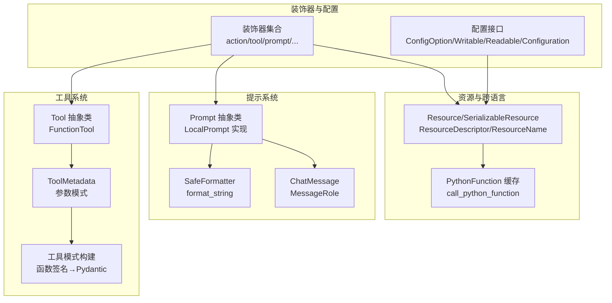
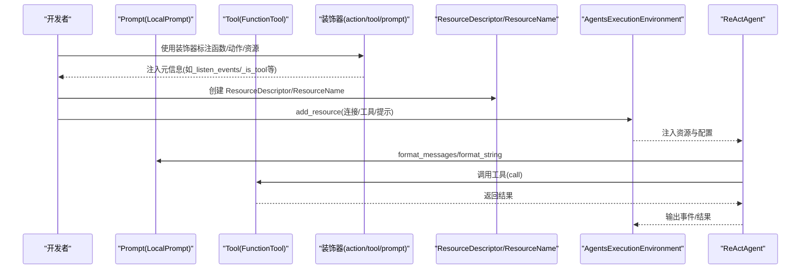
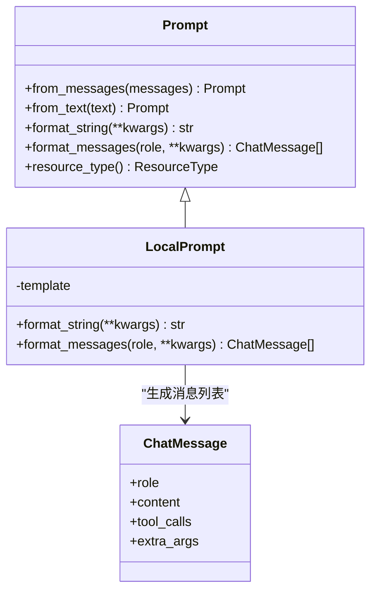
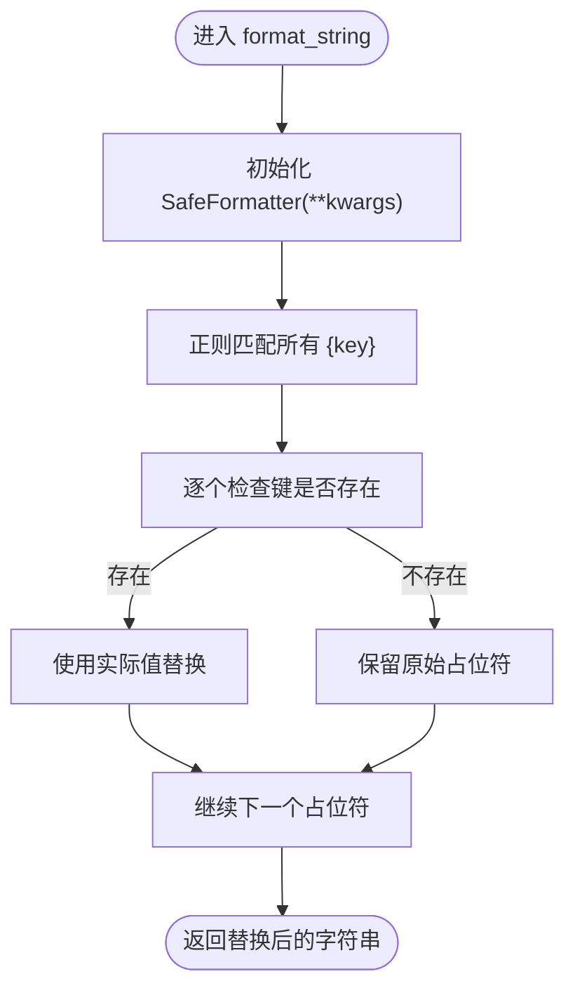
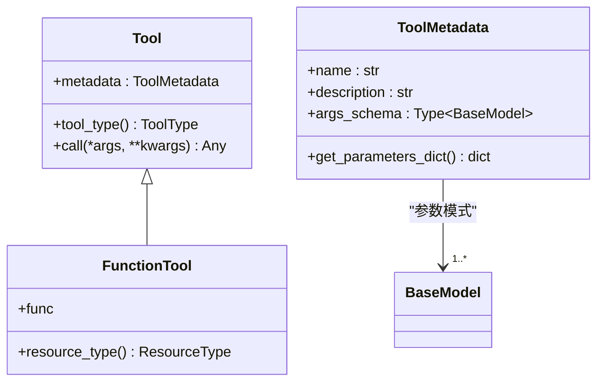
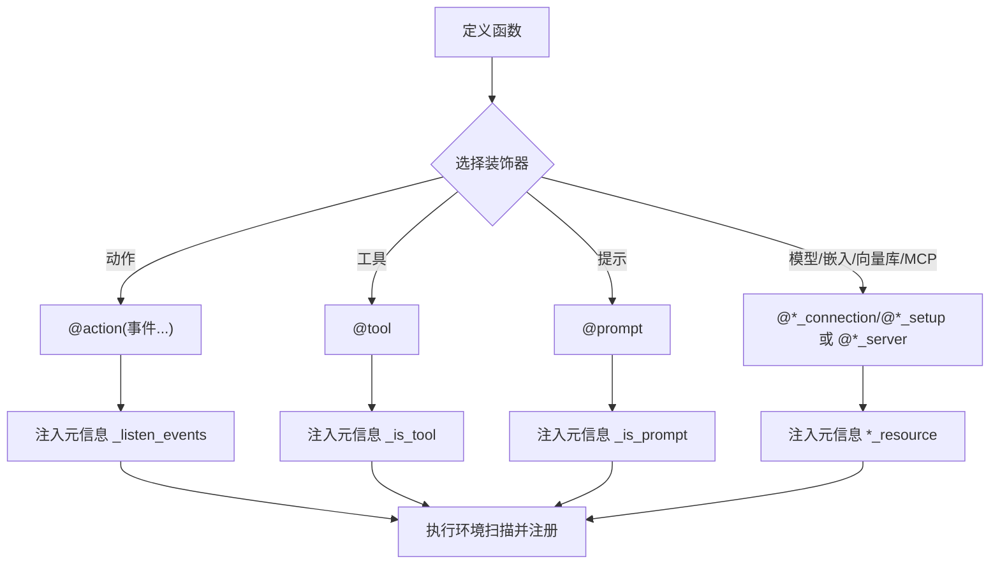
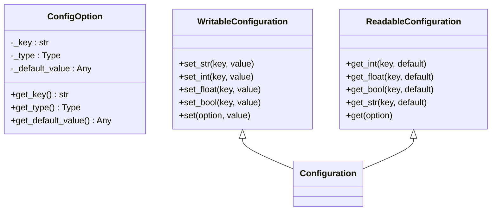
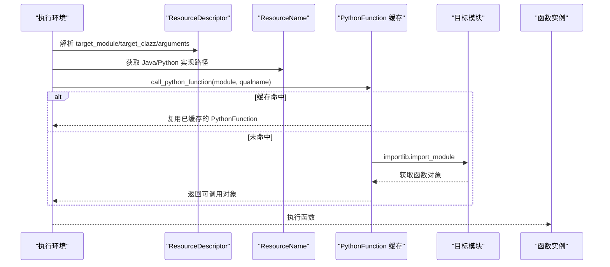
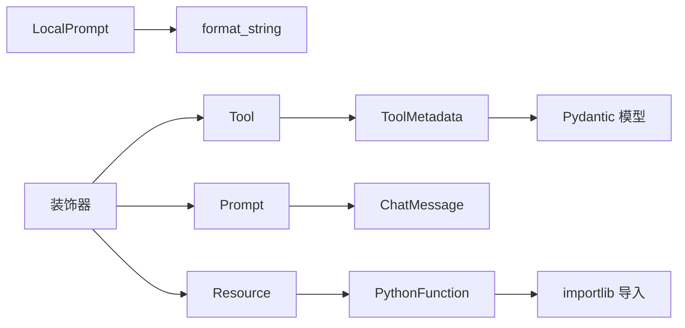

# Python 提示和工具函数

<cite>
**本文引用的文件**
- [python/flink_agents/api/prompts/prompt.py](file://python/flink_agents/api/prompts/prompt.py)
- [python/flink_agents/api/prompts/utils.py](file://python/flink_agents/api/prompts/utils.py)
- [python/flink_agents/api/chat_message.py](file://python/flink_agents/api/chat_message.py)
- [python/flink_agents/api/decorators.py](file://python/flink_agents/api/decorators.py)
- [python/flink_agents/api/configuration.py](file://python/flink_agents/api/configuration.py)
- [python/flink_agents/api/tools/tool.py](file://python/flink_agents/api/tools/tool.py)
- [python/flink_agents/api/tools/utils.py](file://python/flink_agents/api/tools/utils.py)
- [python/flink_agents/api/resource.py](file://python/flink_agents/api/resource.py)
- [python/flink_agents/api/tests/test_prompt.py](file://python/flink_agents/api/tests/test_prompt.py)
- [python/flink_agents/api/tests/test_tool.py](file://python/flink_agents/api/tests/test_tool.py)
- [python/flink_agents/api/tests/test_decorators.py](file://python/flink_agents/api/tests/test_decorators.py)
- [python/flink_agents/e2e_tests/e2e_tests_integration/react_agent_test.py](file://python/flink_agents/e2e_tests/e2e_tests_integration/react_agent_test.py)
- [python/flink_agents/integrations/mcp/tests/test_mcp.py](file://python/flink_agents/integrations/mcp/tests/test_mcp.py)
- [python/flink_agents/plan/function.py](file://python/flink_agents/plan/function.py)
</cite>

## 目录
1. [简介](#简介)
2. [项目结构](#项目结构)
3. [核心组件](#核心组件)
4. [架构总览](#架构总览)
5. [组件详解](#组件详解)
6. [依赖关系分析](#依赖关系分析)
7. [性能考量](#性能考量)
8. [故障排查指南](#故障排查指南)
9. [结论](#结论)
10. [附录：示例与最佳实践](#附录示例与最佳实践)

## 简介
本文件面向 Python 开发者，系统性梳理 Apache Flink Agents 中的 Python 提示与工具函数体系，涵盖以下主题：
- Prompt 抽象类与 LocalPrompt 实现、模板处理与动态生成机制
- 提示格式化工具 SafeFormatter 与 format_string
- 工具函数与工具元数据：从函数签名到 Pydantic 模型的自动推导
- 装饰器系统：代理动作、资源声明与 Java 资源标记
- 配置管理：ConfigOption、可读写配置接口与统一配置对象
- 与 Java 提示的互操作：序列化、反序列化与跨语言资源描述
- 使用示例、最佳实践、性能优化与调试技巧

## 项目结构
围绕 Python 提示与工具函数的关键模块如下：
- 提示与消息：prompts/prompt.py、prompts/utils.py、chat_message.py
- 工具与工具元数据：tools/tool.py、tools/utils.py
- 装饰器：decorators.py
- 配置：configuration.py
- 资源与名称空间：resource.py
- 测试与端到端示例：api/tests/*、e2e_tests_integration/react_agent_test.py、integrations/mcp/tests/test_mcp.py
- 函数计划与缓存：plan/function.py

**图表来源**
- [python/flink_agents/api/prompts/prompt.py](file://python/flink_agents/api/prompts/prompt.py#L28-L98)
- [python/flink_agents/api/prompts/utils.py](file://python/flink_agents/api/prompts/utils.py#L22-L42)
- [python/flink_agents/api/chat_message.py](file://python/flink_agents/api/chat_message.py#L24-L70)
- [python/flink_agents/api/tools/tool.py](file://python/flink_agents/api/tools/tool.py#L103-L156)
- [python/flink_agents/api/tools/utils.py](file://python/flink_agents/api/tools/utils.py#L28-L231)
- [python/flink_agents/api/decorators.py](file://python/flink_agents/api/decorators.py#L23-L196)
- [python/flink_agents/api/configuration.py](file://python/flink_agents/api/configuration.py#L22-L170)
- [python/flink_agents/api/resource.py](file://python/flink_agents/api/resource.py#L29-L318)
- [python/flink_agents/plan/function.py](file://python/flink_agents/plan/function.py#L116-L371)

**章节来源**
- [python/flink_agents/api/prompts/prompt.py](file://python/flink_agents/api/prompts/prompt.py#L28-L98)
- [python/flink_agents/api/prompts/utils.py](file://python/flink_agents/api/prompts/utils.py#L22-L42)
- [python/flink_agents/api/chat_message.py](file://python/flink_agents/api/chat_message.py#L24-L70)
- [python/flink_agents/api/tools/tool.py](file://python/flink_agents/api/tools/tool.py#L103-L156)
- [python/flink_agents/api/tools/utils.py](file://python/flink_agents/api/tools/utils.py#L28-L231)
- [python/flink_agents/api/decorators.py](file://python/flink_agents/api/decorators.py#L23-L196)
- [python/flink_agents/api/configuration.py](file://python/flink_agents/api/configuration.py#L22-L170)
- [python/flink_agents/api/resource.py](file://python/flink_agents/api/resource.py#L29-L318)
- [python/flink_agents/plan/function.py](file://python/flink_agents/plan/function.py#L116-L371)

## 核心组件
- Prompt 抽象类与 LocalPrompt 实现：支持从纯文本或消息列表创建提示；提供字符串与消息两种格式化输出；通过 SafeFormatter 安全地进行占位符替换。
- ChatMessage 与 MessageRole：标准化消息角色（system/user/assistant/tool），便于多轮对话与工具调用回传。
- 工具与工具元数据：Tool 抽象类、FunctionTool 与 ToolMetadata；ToolMetadata 支持序列化/反序列化参数模式，自动从函数签名与 docstring 推导 Pydantic 模型。
- 装饰器系统：action、tool、prompt、chat_model_connection/setup、embedding_model_connection/setup、mcp_server、vector_store、java_resource，用于标注资源与行为。
- 配置管理：ConfigOption 描述键/类型/默认值；WritableConfiguration/ReadableConfiguration 提供 set/get 方法族；统一的 Configuration 同时具备读写能力。
- 资源与跨语言：Resource/SerializableResource 抽象；ResourceDescriptor/ResourceName 提供资源描述与命名空间，支持 Python 与 Java 实现映射。

**章节来源**
- [python/flink_agents/api/prompts/prompt.py](file://python/flink_agents/api/prompts/prompt.py#L28-L98)
- [python/flink_agents/api/chat_message.py](file://python/flink_agents/api/chat_message.py#L24-L70)
- [python/flink_agents/api/tools/tool.py](file://python/flink_agents/api/tools/tool.py#L103-L156)
- [python/flink_agents/api/tools/utils.py](file://python/flink_agents/api/tools/utils.py#L28-L231)
- [python/flink_agents/api/decorators.py](file://python/flink_agents/api/decorators.py#L23-L196)
- [python/flink_agents/api/configuration.py](file://python/flink_agents/api/configuration.py#L22-L170)
- [python/flink_agents/api/resource.py](file://python/flink_agents/api/resource.py#L29-L318)

## 架构总览
下图展示了 Python 提示与工具在运行时的交互路径：从 Prompt/Tool 的定义，经由装饰器注册，到资源描述与执行环境的装配，最终在 ReActAgent 等执行器中被使用。

**图表来源**
- [python/flink_agents/api/decorators.py](file://python/flink_agents/api/decorators.py#L23-L196)
- [python/flink_agents/api/resource.py](file://python/flink_agents/api/resource.py#L107-L213)
- [python/flink_agents/e2e_tests/e2e_tests_integration/react_agent_test.py](file://python/flink_agents/e2e_tests/e2e_tests_integration/react_agent_test.py#L88-L120)

## 组件详解

### 提示系统：Prompt 与 LocalPrompt
- 设计要点
  - Prompt 抽象类提供静态工厂：from_text/from_messages，统一入口创建提示实例。
  - LocalPrompt 支持两种模板：纯文本与消息列表；format_string 将占位符安全替换；format_messages 可指定默认消息角色。
  - 采用 SafeFormatter 避免缺失键抛错，保留未匹配占位符。
- 关键流程
  - 文本模板：直接对模板字符串进行 SafeFormatter 替换。
  - 消息模板：逐条消息调用 SafeFormatter，并按“role: content”拼接或返回 ChatMessage 列表。
- 互操作性
  - Prompt 作为 SerializableResource，可被序列化并在 Java Plan 中重建；测试覆盖了 JSON 模式输出与格式化。

**图表来源**
- [python/flink_agents/api/prompts/prompt.py](file://python/flink_agents/api/prompts/prompt.py#L28-L98)
- [python/flink_agents/api/chat_message.py](file://python/flink_agents/api/chat_message.py#L46-L70)

**章节来源**
- [python/flink_agents/api/prompts/prompt.py](file://python/flink_agents/api/prompts/prompt.py#L28-L98)
- [python/flink_agents/api/prompts/utils.py](file://python/flink_agents/api/prompts/utils.py#L22-L42)
- [python/flink_agents/api/tests/test_prompt.py](file://python/flink_agents/api/tests/test_prompt.py#L24-L131)

### 提示格式化工具：SafeFormatter 与 format_string
- SafeFormatter
  - 使用正则匹配占位符，若键缺失则保留原占位符，避免异常中断。
  - 支持嵌套大括号转义（如 JSON 示例）。
- format_string
  - 包装 SafeFormatter，对外暴露简洁接口，供 Prompt 内部复用。

**图表来源**
- [python/flink_agents/api/prompts/utils.py](file://python/flink_agents/api/prompts/utils.py#L22-L42)

**章节来源**
- [python/flink_agents/api/prompts/utils.py](file://python/flink_agents/api/prompts/utils.py#L22-L42)

### 工具系统：Tool 与 ToolMetadata
- Tool 抽象类
  - 提供统一的工具接口：metadata（名称、描述、参数模式）、tool_type（枚举）、call 方法。
- FunctionTool
  - 保存可调用对象，作为“函数工具”的容器，便于序列化与后续编译。
- ToolMetadata
  - name/description/args_schema；args_schema 支持序列化为 JSON 模式，并在反序列化时自动重建 Pydantic 模型。
- 参数模式构建
  - create_schema_from_function：从函数签名与 docstring 推导字段类型、默认值与描述。
  - create_model_from_schema：从 JSON 模式反向构建 Pydantic 模型，支持 $ref、anyOf、数组与对象等复杂类型。
  - create_model_from_java_tool_schema_str / create_java_tool_schema_str_from_model：与 Java 工具输入模式互转。

**图表来源**
- [python/flink_agents/api/tools/tool.py](file://python/flink_agents/api/tools/tool.py#L103-L156)
- [python/flink_agents/api/tools/utils.py](file://python/flink_agents/api/tools/utils.py#L28-L231)

**章节来源**
- [python/flink_agents/api/tools/tool.py](file://python/flink_agents/api/tools/tool.py#L103-L156)
- [python/flink_agents/api/tools/utils.py](file://python/flink_agents/api/tools/utils.py#L28-L231)
- [python/flink_agents/api/tests/test_tool.py](file://python/flink_agents/api/tests/test_tool.py#L31-L72)

### 装饰器系统：动作、工具与配置
- 动作装饰器 action：校验监听事件类型非空且均为 Event 子类，注入 _listen_events 元信息。
- 资源装饰器：chat_model_connection/setup、embedding_model_connection/setup、tool、prompt、mcp_server、vector_store、java_resource，分别标记对应资源或行为。
- 使用建议
  - 在动作函数上使用 action(...) 指定监听事件类型。
  - 在工具函数上使用 @tool 标注，配合 Tool.from_callable 注册。
  - 在资源函数上使用相应装饰器，便于执行环境识别与装配。

**图表来源**
- [python/flink_agents/api/decorators.py](file://python/flink_agents/api/decorators.py#L23-L196)
- [python/flink_agents/api/tests/test_decorators.py](file://python/flink_agents/api/tests/test_decorators.py#L27-L65)

**章节来源**
- [python/flink_agents/api/decorators.py](file://python/flink_agents/api/decorators.py#L23-L196)
- [python/flink_agents/api/tests/test_decorators.py](file://python/flink_agents/api/tests/test_decorators.py#L27-L65)

### 配置管理：ConfigOption 与读写接口
- ConfigOption：封装键名、类型与默认值。
- WritableConfiguration：提供 set_str/set_int/set_float/set_bool/set(option, value)。
- ReadableConfiguration：提供 get_int/get_float/get_bool/get_str/get(option)。
- Configuration：同时继承读写接口，作为统一配置对象。

**图表来源**
- [python/flink_agents/api/configuration.py](file://python/flink_agents/api/configuration.py#L22-L170)

**章节来源**
- [python/flink_agents/api/configuration.py](file://python/flink_agents/api/configuration.py#L22-L170)

### 资源与跨语言互操作
- Resource/SerializableResource：统一资源抽象与序列化约束。
- ResourceDescriptor：目标模块、类名与初始化参数，支持动态导入与比较。
- ResourceName：资源名称空间，区分 Python 与 Java 实现，便于跨语言装配。
- PythonFunction 缓存：call_python_function 基于模块+限定名缓存可缓存函数，提升频繁调用性能；提供缓存大小查询与清理。

**图表来源**
- [python/flink_agents/api/resource.py](file://python/flink_agents/api/resource.py#L107-L213)
- [python/flink_agents/plan/function.py](file://python/flink_agents/plan/function.py#L265-L331)

**章节来源**
- [python/flink_agents/api/resource.py](file://python/flink_agents/api/resource.py#L107-L213)
- [python/flink_agents/plan/function.py](file://python/flink_agents/plan/function.py#L116-L371)

## 依赖关系分析
- 提示与消息：Prompt 依赖 ChatMessage；LocalPrompt 使用 format_string 进行模板替换。
- 工具与模式：ToolMetadata 依赖 Pydantic 模型；工具模式构建依赖 docstring_parser 与 inspect/signature。
- 装饰器：作用于函数/类，注入元信息，供执行环境扫描与注册。
- 配置：与资源/执行环境耦合，用于控制行为与参数。
- 跨语言：ResourceDescriptor/ResourceName 与 PythonFunction 缓存共同支撑 Python 与 Java 资源互操作。

**图表来源**
- [python/flink_agents/api/prompts/prompt.py](file://python/flink_agents/api/prompts/prompt.py#L28-L98)
- [python/flink_agents/api/tools/tool.py](file://python/flink_agents/api/tools/tool.py#L103-L156)
- [python/flink_agents/api/tools/utils.py](file://python/flink_agents/api/tools/utils.py#L28-L231)
- [python/flink_agents/api/decorators.py](file://python/flink_agents/api/decorators.py#L23-L196)
- [python/flink_agents/api/resource.py](file://python/flink_agents/api/resource.py#L107-L213)
- [python/flink_agents/plan/function.py](file://python/flink_agents/plan/function.py#L265-L331)

**章节来源**
- [python/flink_agents/api/prompts/prompt.py](file://python/flink_agents/api/prompts/prompt.py#L28-L98)
- [python/flink_agents/api/tools/tool.py](file://python/flink_agents/api/tools/tool.py#L103-L156)
- [python/flink_agents/api/tools/utils.py](file://python/flink_agents/api/tools/utils.py#L28-L231)
- [python/flink_agents/api/decorators.py](file://python/flink_agents/api/decorators.py#L23-L196)
- [python/flink_agents/api/resource.py](file://python/flink_agents/api/resource.py#L107-L213)
- [python/flink_agents/plan/function.py](file://python/flink_agents/plan/function.py#L265-L331)

## 性能考量
- 提示格式化
  - SafeFormatter 采用正则一次性替换，时间复杂度近似 O(N)（N 为文本长度），适合长模板。
  - 对缺失键保留原占位符，避免异常开销。
- 工具模式构建
  - create_schema_from_function 仅在注册阶段执行，运行时复用已构建的 Pydantic 模型。
  - create_model_from_schema 支持 $ref 与 anyOf，注意复杂模式可能带来序列化/反序列化成本。
- 函数缓存
  - PythonFunction 缓存可显著降低频繁调用的导入与解析开销；仅对无闭包、非协程、非生成器、无可变默认参数的函数启用缓存。
  - 提供缓存大小查询与清理接口，便于测试与运维。
- 资源装配
  - ResourceDescriptor 仅存储模块与类名，延迟导入；通过 ResourceName 快速定位实现。

[本节为通用指导，无需特定文件来源]

## 故障排查指南
- 提示格式化异常
  - 确认模板中的占位符是否与 kwargs 键一致；缺失键会被保留，需检查输出是否符合预期。
  - 若出现特殊字符或嵌套大括号，确保模板正确转义。
- 工具元数据不匹配
  - 检查 ToolMetadata 的 args_schema 是否与函数签名一致；必要时重新生成模式。
  - 反序列化失败时，确认 JSON 模式结构与字段类型映射。
- 装饰器使用错误
  - action 装饰器必须至少监听一个事件类型，且均为 Event 子类；否则断言失败。
- 跨语言资源
  - 确认 ResourceName 指向的实现路径正确；Python 与 Java 实现需保持接口一致。
  - 若函数无法缓存，检查是否为生成器、协程或带可变默认参数的函数。

**章节来源**
- [python/flink_agents/api/tests/test_prompt.py](file://python/flink_agents/api/tests/test_prompt.py#L115-L131)
- [python/flink_agents/api/tests/test_tool.py](file://python/flink_agents/api/tests/test_tool.py#L67-L72)
- [python/flink_agents/api/tests/test_decorators.py](file://python/flink_agents/api/tests/test_decorators.py#L49-L65)

## 结论
Flink Agents 的 Python 提示与工具函数体系以清晰的抽象与强类型模式为核心，结合装饰器与资源描述，实现了从提示模板、工具元数据到跨语言资源的完整链路。通过 SafeFormatter、Pydantic 模式构建与函数缓存等机制，在保证易用性的同时兼顾性能与可维护性。建议在生产环境中遵循本文最佳实践，充分利用测试与端到端示例，确保提示与工具的稳定性与一致性。

[本节为总结，无需特定文件来源]

## 附录：示例与最佳实践

### 示例一：创建与使用提示模板
- 从文本创建提示并格式化为字符串与消息列表
- 从消息列表创建提示并格式化为字符串与消息列表
- 缺失参数时的行为与 JSON 模式输出

参考测试用例路径：
- [python/flink_agents/api/tests/test_prompt.py](file://python/flink_agents/api/tests/test_prompt.py#L24-L131)

**章节来源**
- [python/flink_agents/api/tests/test_prompt.py](file://python/flink_agents/api/tests/test_prompt.py#L24-L131)

### 示例二：工具元数据与模式构建
- 从函数签名与 docstring 生成参数模式
- 序列化/反序列化 ToolMetadata
- 与 Java 工具输入模式互转

参考测试用例路径：
- [python/flink_agents/api/tests/test_tool.py](file://python/flink_agents/api/tests/test_tool.py#L31-L72)
- [python/flink_agents/api/tools/utils.py](file://python/flink_agents/api/tools/utils.py#L181-L231)

**章节来源**
- [python/flink_agents/api/tests/test_tool.py](file://python/flink_agents/api/tests/test_tool.py#L31-L72)
- [python/flink_agents/api/tools/utils.py](file://python/flink_agents/api/tools/utils.py#L181-L231)

### 示例三：装饰器使用与动作注册
- 使用 @action 标注动作函数并指定监听事件
- 多事件监听与断言错误

参考测试用例路径：
- [python/flink_agents/api/tests/test_decorators.py](file://python/flink_agents/api/tests/test_decorators.py#L27-L65)

**章节来源**
- [python/flink_agents/api/tests/test_decorators.py](file://python/flink_agents/api/tests/test_decorators.py#L27-L65)

### 示例四：ReActAgent 与提示/工具/资源装配
- 在执行环境中注册聊天模型连接与工具
- 使用 Prompt.from_messages 构建提示
- 通过 ResourceDescriptor 指定工具与模型参数

参考端到端测试路径：
- [python/flink_agents/e2e_tests/e2e_tests_integration/react_agent_test.py](file://python/flink_agents/e2e_tests/e2e_tests_integration/react_agent_test.py#L88-L120)

**章节来源**
- [python/flink_agents/e2e_tests/e2e_tests_integration/react_agent_test.py](file://python/flink_agents/e2e_tests/e2e_tests_integration/react_agent_test.py#L88-L120)

### 示例五：MCP 提示与工具
- 通过 MCPServer 列出提示与工具
- 使用提示格式化消息并进行工具发现

参考测试用例路径：
- [python/flink_agents/integrations/mcp/tests/test_mcp.py](file://python/flink_agents/integrations/mcp/tests/test_mcp.py#L36-L57)

**章节来源**
- [python/flink_agents/integrations/mcp/tests/test_mcp.py](file://python/flink_agents/integrations/mcp/tests/test_mcp.py#L36-L57)

### 最佳实践
- 提示模板
  - 使用清晰的占位符命名，避免歧义；对特殊字符与嵌套大括号进行转义。
  - 将提示拆分为多个消息，明确 system/user 角色，提升模型可控性。
- 工具元数据
  - 为函数编写清晰的 docstring，描述参数与返回值；必要时使用 Annotated 字段增强描述。
  - 对复杂参数使用 Pydantic 模型，确保序列化/反序列化一致性。
- 装饰器
  - 明确动作监听的事件类型；将工具函数与提示函数分别使用 @tool/@prompt 标注。
  - 资源装饰器与 java_resource 用于跨语言资源声明。
- 配置
  - 使用 ConfigOption 定义配置项，统一读写接口；在执行环境中集中管理。
- 性能
  - 对高频调用的 Python 函数启用缓存；避免生成器/协程/带可变默认参数的函数进入缓存。
  - 工具模式构建仅在注册阶段执行，运行时复用。

[本节为通用指导，无需特定文件来源]