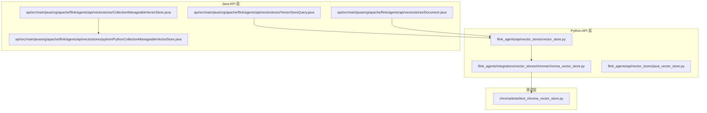
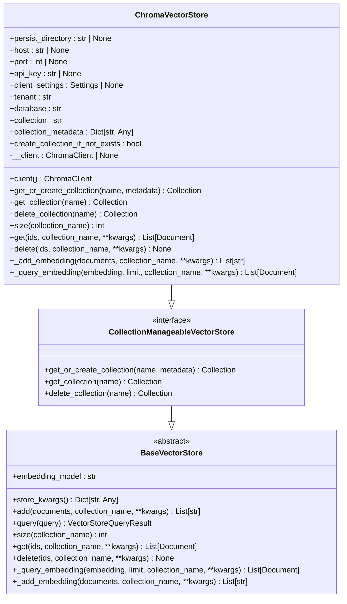
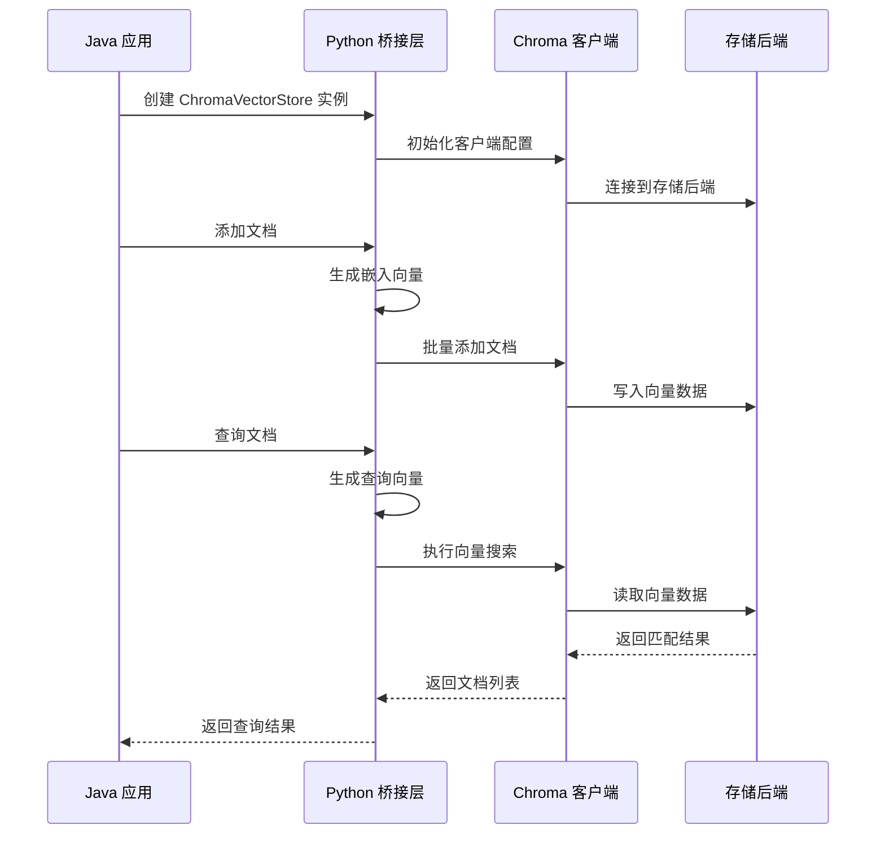
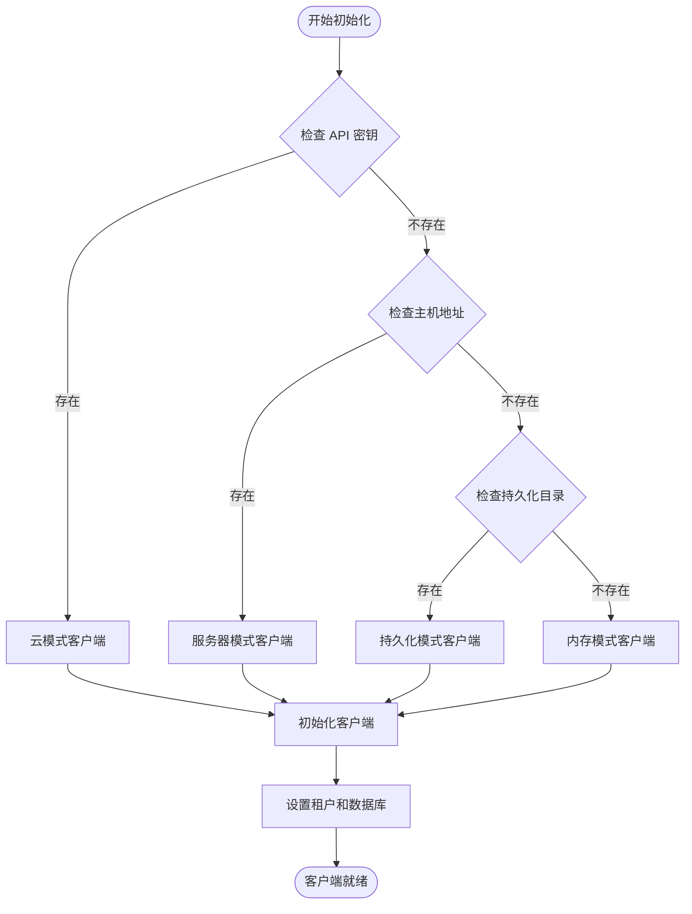
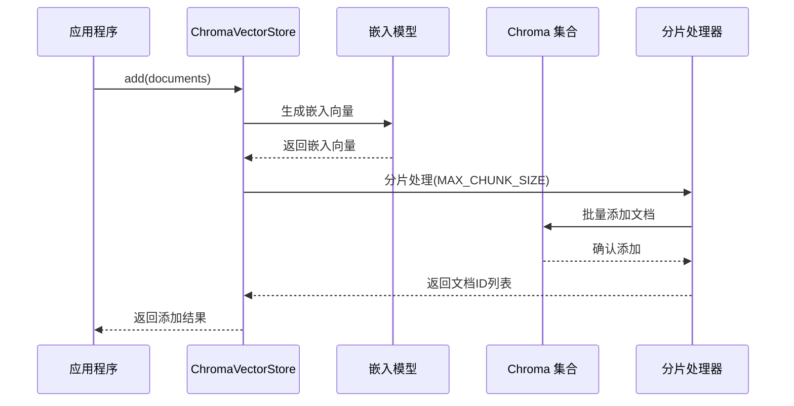
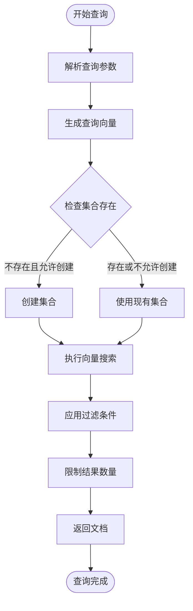
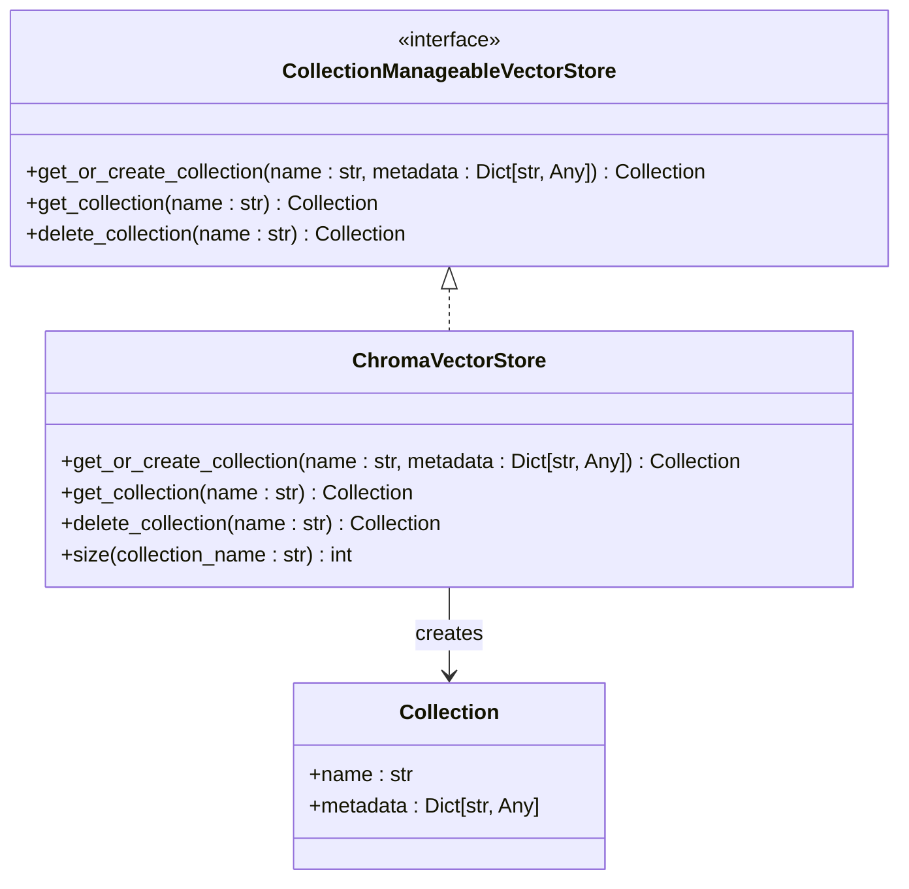
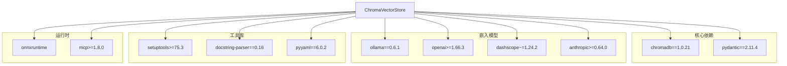
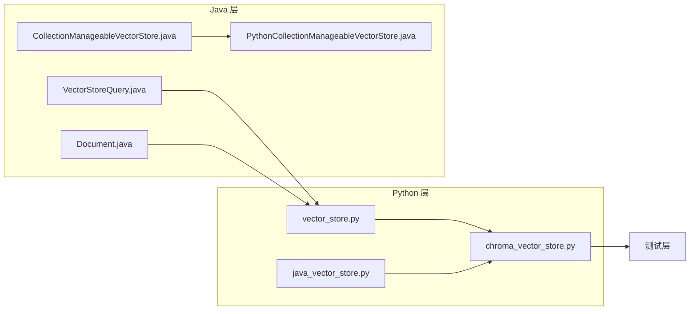

# Chroma 向量存储集成

<cite>
**本文档引用的文件**
- [chroma_vector_store.py](file://python/flink_agents/integrations/vector_stores/chroma/chroma_vector_store.py)
- [test_chroma_vector_store.py](file://python/flink_agents/integrations/vector_stores/chroma/tests/test_chroma_vector_store.py)
- [vector_store.py](file://python/flink_agents/api/vector_stores/vector_store.py)
- [VectorStoreQuery.java](file://api/src/main/java/org/apache/flink/agents/api/vectorstores/VectorStoreQuery.java)
- [Document.java](file://api/src/main/java/org/apache/flink/agents/api/vectorstores/Document.java)
- [CollectionManageableVectorStore.java](file://api/src/main/java/org/apache/flink/agents/api/vectorstores/CollectionManageableVectorStore.java)
- [PythonCollectionManageableVectorStore.java](file://api/src/main/java/org/apache/flink/agents/api/vectorstores/python/PythonCollectionManageableVectorStore.java)
- [java_vector_store.py](file://python/flink_agents/api/vector_stores/java_vector_store.py)
- [pyproject.toml](file://python/pyproject.toml)
- [README.md](file://README.md)
</cite>

## 目录
1. [简介](#简介)
2. [项目结构](#项目结构)
3. [核心组件](#核心组件)
4. [架构概览](#架构概览)
5. [详细组件分析](#详细组件分析)
6. [依赖关系分析](#依赖关系分析)
7. [性能考虑](#性能考虑)
8. [故障排除指南](#故障排除指南)
9. [结论](#结论)
10. [附录](#附录)

## 简介

Chroma 是一个开源的向量数据库，专为 AI 应用程序设计。它提供了嵌入式存储、零配置部署和高性能检索等特性。在 Flink Agents 框架中，ChromaVectorStore 提供了完整的向量存储集成，支持多种客户端模式（内存、持久化、服务器和云模式）以及完整的集合管理功能。

Chroma 的主要特点包括：
- **嵌入式存储**：无需外部依赖即可运行
- **零配置部署**：开箱即用的默认配置
- **高性能检索**：基于 ANN（近似最近邻）算法的快速相似性搜索
- **多租户支持**：通过 tenant 和 database 参数实现隔离
- **灵活的客户端模式**：支持本地开发和生产环境的不同需求

## 项目结构

Flink Agents 项目采用分层架构设计，Chroma 向量存储集成位于以下关键位置：



**图表来源**
- [chroma_vector_store.py](file://python/flink_agents/integrations/vector_stores/chroma/chroma_vector_store.py#L1-L50)
- [vector_store.py](file://python/flink_agents/api/vector_stores/vector_store.py#L1-L50)
- [VectorStoreQuery.java](file://api/src/main/java/org/apache/flink/agents/api/vectorstores/VectorStoreQuery.java#L1-L40)

**章节来源**
- [chroma_vector_store.py](file://python/flink_agents/integrations/vector_stores/chroma/chroma_vector_store.py#L1-L100)
- [vector_store.py](file://python/flink_agents/api/vector_stores/vector_store.py#L1-L100)

## 核心组件

### ChromaVectorStore 类

ChromaVectorStore 是整个集成的核心类，继承自 CollectionManageableVectorStore，提供了完整的向量存储功能：



**图表来源**
- [chroma_vector_store.py](file://python/flink_agents/integrations/vector_stores/chroma/chroma_vector_store.py#L58-L136)
- [vector_store.py](file://python/flink_agents/api/vector_stores/vector_store.py#L136-L356)

### 客户端配置系统

ChromaVectorStore 支持四种不同的客户端模式：

1. **云模式（Cloud Mode）**：使用 API 密钥连接到 Chroma Cloud
2. **服务器模式（Server Mode）**：通过 HTTP 客户端连接到远程 Chroma 服务器
3. **持久化模式（Persistent Mode）**：使用本地文件系统持久化存储
4. **内存模式（In-Memory Mode）**：临时内存存储，适合测试和开发

**章节来源**
- [chroma_vector_store.py](file://python/flink_agents/integrations/vector_stores/chroma/chroma_vector_store.py#L173-L210)

## 架构概览

Flink Agents 的 Chroma 集成采用了跨语言桥接架构，实现了 Java 和 Python 之间的无缝通信：



**图表来源**
- [chroma_vector_store.py](file://python/flink_agents/integrations/vector_stores/chroma/chroma_vector_store.py#L298-L337)
- [vector_store.py](file://python/flink_agents/api/vector_stores/vector_store.py#L163-L231)

## 详细组件分析

### 客户端初始化流程

ChromaVectorStore 的客户端初始化过程根据配置参数自动选择合适的客户端类型：



**图表来源**
- [chroma_vector_store.py](file://python/flink_agents/integrations/vector_stores/chroma/chroma_vector_store.py#L173-L208)

### 文档添加流程

文档添加操作包含了嵌入向量生成、批处理分片和批量插入等步骤：



**图表来源**
- [chroma_vector_store.py](file://python/flink_agents/integrations/vector_stores/chroma/chroma_vector_store.py#L298-L337)
- [vector_store.py](file://python/flink_agents/api/vector_stores/vector_store.py#L163-L202)

### 查询执行流程

查询操作涉及文本预处理、向量生成和相似性搜索：



**图表来源**
- [chroma_vector_store.py](file://python/flink_agents/integrations/vector_stores/chroma/chroma_vector_store.py#L339-L405)
- [vector_store.py](file://python/flink_agents/api/vector_stores/vector_store.py#L204-L231)

**章节来源**
- [chroma_vector_store.py](file://python/flink_agents/integrations/vector_stores/chroma/chroma_vector_store.py#L298-L405)

### 集合管理功能

ChromaVectorStore 提供了完整的集合管理能力，包括创建、获取和删除操作：



**图表来源**
- [chroma_vector_store.py](file://python/flink_agents/integrations/vector_stores/chroma/chroma_vector_store.py#L222-L237)
- [CollectionManageableVectorStore.java](file://api/src/main/java/org/apache/flink/agents/api/vectorstores/CollectionManageableVectorStore.java#L23-L67)

**章节来源**
- [chroma_vector_store.py](file://python/flink_agents/integrations/vector_stores/chroma/chroma_vector_store.py#L222-L243)
- [CollectionManageableVectorStore.java](file://api/src/main/java/org/apache/flink/agents/api/vectorstores/CollectionManageableVectorStore.java#L23-L67)

## 依赖关系分析

### 外部依赖

ChromaVectorStore 的主要依赖关系如下：



**图表来源**
- [pyproject.toml](file://python/pyproject.toml#L44-L59)

### 内部依赖关系



**图表来源**
- [vector_store.py](file://python/flink_agents/api/vector_stores/vector_store.py#L1-L50)
- [chroma_vector_store.py](file://python/flink_agents/integrations/vector_stores/chroma/chroma_vector_store.py#L28-L32)

**章节来源**
- [pyproject.toml](file://python/pyproject.toml#L44-L59)
- [vector_store.py](file://python/flink_agents/api/vector_stores/vector_store.py#L1-L50)

## 性能考虑

### 批处理优化

ChromaVectorStore 实现了智能的批处理机制来优化大规模数据操作：

1. **分片大小控制**：使用 `MAX_CHUNK_SIZE = 41665` 来平衡内存使用和网络传输效率
2. **批量插入**：利用 Chroma 的批量 API 减少网络往返次数
3. **异步处理**：嵌入向量生成与数据插入分离，提高并发性能

### 内存管理

- **惰性初始化**：客户端对象仅在首次使用时创建
- **连接池复用**：避免频繁的客户端创建销毁开销
- **资源清理**：确保嵌入模型资源正确释放

### 查询优化

- **索引策略**：Chroma 自动管理向量索引，支持高效的 ANN 搜索
- **过滤优化**：支持元数据过滤和文档内容过滤
- **结果缓存**：对于重复查询可考虑应用层缓存策略

## 故障排除指南

### 常见问题及解决方案

#### 1. 客户端连接问题

**症状**：无法连接到 Chroma 服务器
**可能原因**：
- 网络连接问题
- 认证失败
- 端口被占用

**解决方法**：
```python
# 检查连接配置
vector_store = ChromaVectorStore(
    embedding_model="your_embedding_model",
    host="localhost",  # 确保主机名正确
    port=8000,        # 确保端口开放
    api_key="your_api_key"  # 如果使用云模式
)
```

#### 2. 数据持久化问题

**症状**：重启后数据丢失
**可能原因**：
- 使用了内存模式而非持久化模式
- 持久化路径权限不足

**解决方法**：
```python
# 使用持久化模式
vector_store = ChromaVectorStore(
    embedding_model="your_embedding_model",
    persist_directory="/path/to/persistent/storage"
)
```

#### 3. 嵌入向量生成错误

**症状**：添加文档时报嵌入向量相关的错误
**可能原因**：
- 嵌入模型配置错误
- 文本编码问题

**解决方法**：
```python
# 确保嵌入模型正确配置
embedding_model = YourEmbeddingModel(
    model_name="your_model",
    api_key="your_api_key"
)
```

### 调试技巧

1. **启用详细日志**：在开发环境中增加日志级别
2. **检查集合状态**：使用 `size()` 方法验证数据是否正确存储
3. **验证查询结果**：通过小规模测试集验证查询准确性

**章节来源**
- [test_chroma_vector_store.py](file://python/flink_agents/integrations/vector_stores/chroma/tests/test_chroma_vector_store.py#L84-L111)

## 结论

ChromaVectorStore 为 Flink Agents 提供了一个强大而灵活的向量存储解决方案。通过支持多种客户端模式、完整的集合管理和优化的数据操作流程，它能够满足从开发测试到生产部署的各种需求。

主要优势包括：
- **易用性**：零配置部署和简单 API 设计
- **灵活性**：支持多种部署模式和配置选项
- **性能**：优化的批处理和查询机制
- **可靠性**：完善的错误处理和故障恢复机制

未来可以考虑的功能增强：
- 更丰富的查询语法支持
- 集群部署和高可用性配置
- 更细粒度的性能监控和调优工具

## 附录

### 安装和配置

#### 环境要求
- Python 3.10 或 3.11
- Java 11+
- Maven 3.x

#### 依赖安装
```bash
# 克隆项目
git clone https://github.com/apache/flink-agents.git
cd flink-agents

# 构建项目
./tools/build.sh
```

#### 基本配置示例

**内存模式（开发测试）**：
```python
from flink_agents.integrations.vector_stores.chroma.chroma_vector_store import ChromaVectorStore

vector_store = ChromaVectorStore(
    embedding_model="your_embedding_model",
    collection="test_collection"
)
```

**持久化模式（生产环境）**：
```python
vector_store = ChromaVectorStore(
    embedding_model="your_embedding_model",
    persist_directory="./chroma_data",
    collection="production_collection"
)
```

**云模式（云端部署）**：
```python
vector_store = ChromaVectorStore(
    embedding_model="your_embedding_model",
    api_key="your_chroma_cloud_api_key",
    tenant="your_tenant",
    database="your_database",
    collection="cloud_collection"
)
```

### 查询语法和过滤条件

Chroma 支持多种查询方式和过滤条件：

**基本查询**：
```python
from flink_agents.api.vector_stores.vector_store import VectorStoreQuery

query = VectorStoreQuery(
    query_text="你的查询文本",
    limit=10,
    collection_name="your_collection"
)
```

**带过滤条件的查询**：
```python
query = VectorStoreQuery(
    query_text="你的查询文本",
    limit=10,
    extra_args={
        "where": {"category": "database"},  # 元数据过滤
        "where_document": {"$contains": "ChromaDB"}  # 文档内容过滤
    }
)
```

**章节来源**
- [VectorStoreQuery.java](file://api/src/main/java/org/apache/flink/agents/api/vectorstores/VectorStoreQuery.java#L26-L83)
- [test_chroma_vector_store.py](file://python/flink_agents/integrations/vector_stores/chroma/tests/test_chroma_vector_store.py#L105-L110)