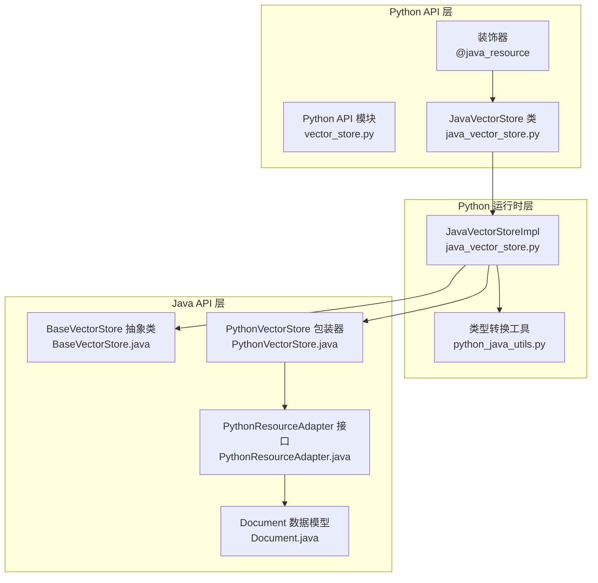
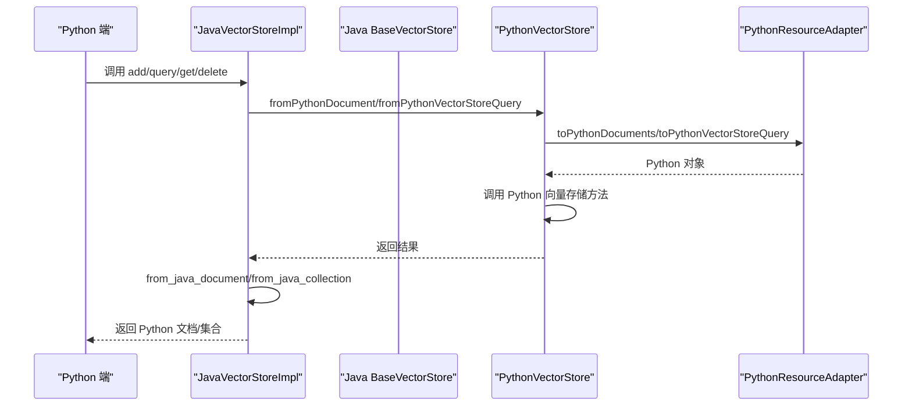
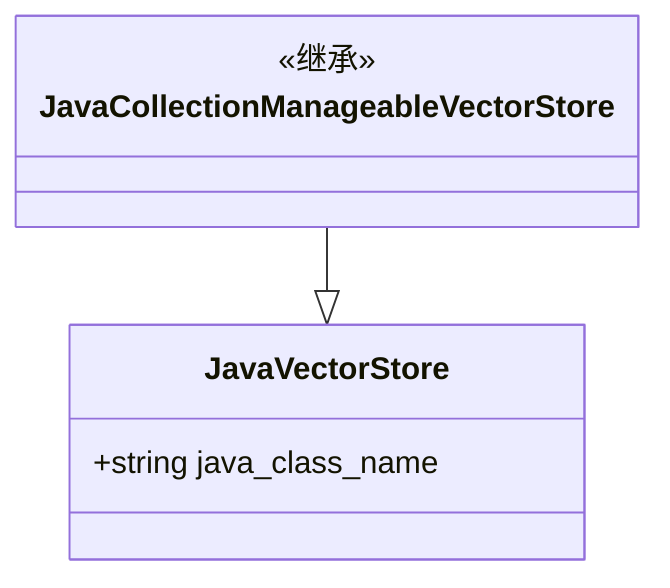
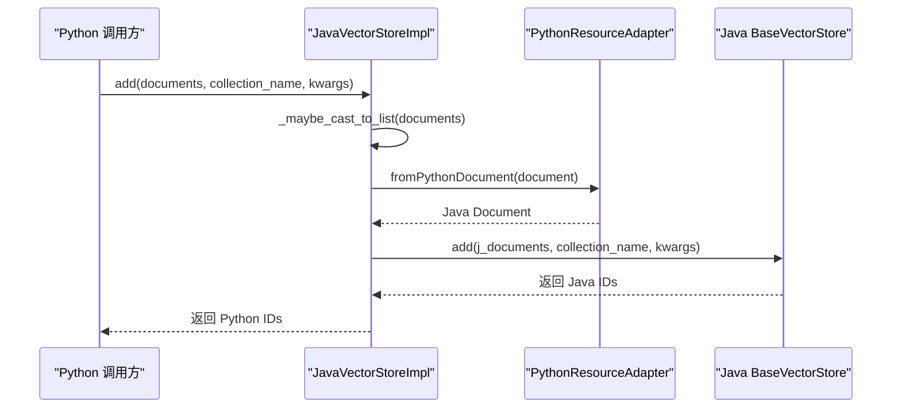
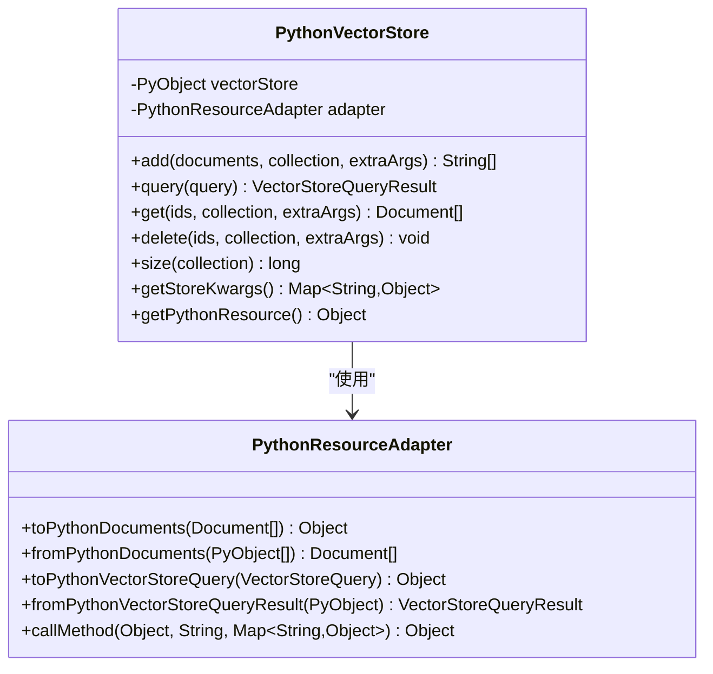
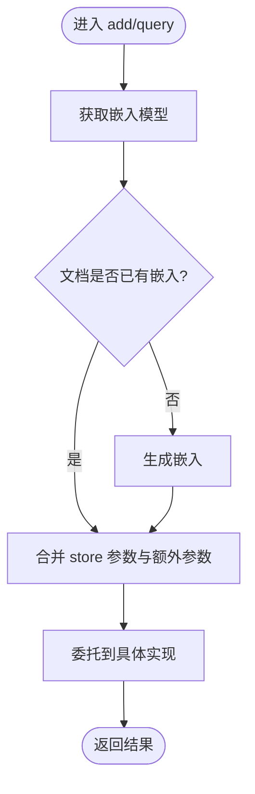
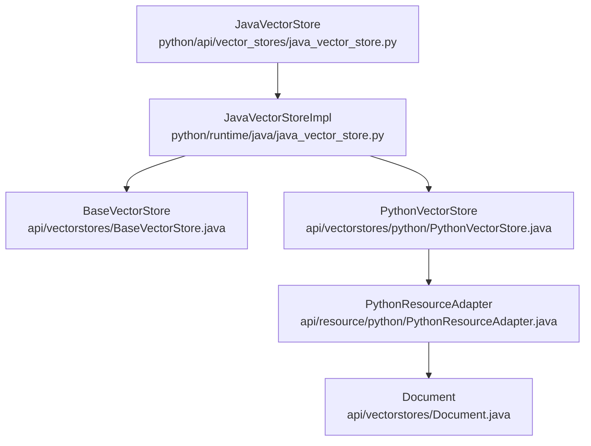
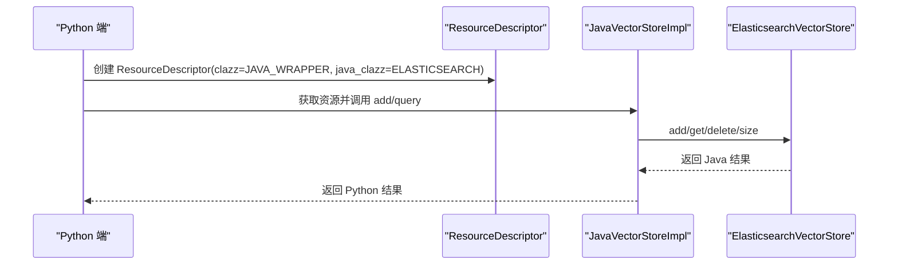

# Java 向量存储适配器

<cite>
**本文档引用的文件**
- [java_vector_store.py](file://python/flink_agents/api/vector_stores/java_vector_store.py)
- [java_vector_store.py](file://python/flink_agents/runtime/java/java_vector_store.py)
- [PythonVectorStore.java](file://api/src/main/java/org/apache/flink/agents/api/vectorstores/python/PythonVectorStore.java)
- [BaseVectorStore.java](file://api/src/main/java/org/apache/flink/agents/api/vectorstores/BaseVectorStore.java)
- [Document.java](file://api/src/main/java/org/apache/flink/agents/api/vectorstores/Document.java)
- [PythonResourceAdapter.java](file://api/src/main/java/org/apache/flink/agents/api/resource/python/PythonResourceAdapter.java)
- [PythonResourceWrapper.java](file://api/src/main/java/org/apache/flink/agents/api/resource/python/PythonResourceWrapper.java)
- [python_java_utils.py](file://python/flink_agents/runtime/python_java_utils.py)
- [vector_store.py](file://python/flink_agents/api/vector_stores/vector_store.py)
- [VectorStoreCrossLanguageAgent.java](file://e2e-test/flink-agents-end-to-end-tests-resource-cross-language/src/test/java/org/apache/flink/agents/resource/test/VectorStoreCrossLanguageAgent.java)
- [vector_store_cross_language_agent.py](file://python/flink_agents/e2e_tests/e2e_tests_resource_cross_language/vector_store_cross_language_agent.py)
- [ElasticsearchVectorStore.java](file://integrations/vector-stores/elasticsearch/src/main/java/org/apache/flink/agents/integrations/vectorstores/elasticsearch/ElasticsearchVectorStore.java)
</cite>

## 目录
1. [简介](#简介)
2. [项目结构](#项目结构)
3. [核心组件](#核心组件)
4. [架构概览](#架构概览)
5. [详细组件分析](#详细组件分析)
6. [依赖关系分析](#依赖关系分析)
7. [性能考虑](#性能考虑)
8. [故障排除指南](#故障排除指南)
9. [结论](#结论)
10. [附录](#附录)

## 简介
本文件详细介绍了 Flink Agents 项目中的 Java 向量存储适配器设计与实现。该适配器通过 Java-Python 互操作机制，桥接 Java 向量存储资源与 Python 接口，实现跨语言的向量存储能力。文档涵盖资源包装与类型转换、数据序列化、方法调用链路、异常处理策略、性能优化与内存管理机制，并提供完整的集成示例与调试技巧。

## 项目结构
适配器涉及三层关键模块：
- Python API 层：定义 Python 端的向量存储接口与装饰器，声明 Java 资源类。
- Python 运行时层：实现 Java 资源到 Python 的桥接，负责类型转换与方法调用。
- Java API 层：提供 Python 资源包装器与适配器接口，实现 Java 端的互操作。

**图表来源**
- [java_vector_store.py](file://python/flink_agents/api/vector_stores/java_vector_store.py#L25-L36)
- [java_vector_store.py](file://python/flink_agents/runtime/java/java_vector_store.py#L40-L149)
- [PythonVectorStore.java](file://api/src/main/java/org/apache/flink/agents/api/vectorstores/python/PythonVectorStore.java#L49-L156)
- [BaseVectorStore.java](file://api/src/main/java/org/apache/flink/agents/api/vectorstores/BaseVectorStore.java#L38-L174)
- [Document.java](file://api/src/main/java/org/apache/flink/agents/api/vectorstores/Document.java#L34-L111)
- [PythonResourceAdapter.java](file://api/src/main/java/org/apache/flink/agents/api/resource/python/PythonResourceAdapter.java#L37-L141)
- [python_java_utils.py](file://python/flink_agents/runtime/python_java_utils.py#L209-L251)

**章节来源**
- [java_vector_store.py](file://python/flink_agents/api/vector_stores/java_vector_store.py#L18-L36)
- [java_vector_store.py](file://python/flink_agents/runtime/java/java_vector_store.py#L19-L149)
- [PythonVectorStore.java](file://api/src/main/java/org/apache/flink/agents/api/vectorstores/python/PythonVectorStore.java#L49-L156)
- [BaseVectorStore.java](file://api/src/main/java/org/apache/flink/agents/api/vectorstores/BaseVectorStore.java#L38-L174)
- [Document.java](file://api/src/main/java/org/apache/flink/agents/api/vectorstores/Document.java#L34-L111)
- [PythonResourceAdapter.java](file://api/src/main/java/org/apache/flink/agents/api/resource/python/PythonResourceAdapter.java#L37-L141)
- [python_java_utils.py](file://python/flink_agents/runtime/python_java_utils.py#L209-L251)

## 核心组件
- JavaVectorStore 与 JavaCollectionManageableVectorStore：Python 端装饰器类，声明 Java 实现的向量存储资源。
- JavaVectorStoreImpl：Python 端运行时实现，持有 Java 资源对象与适配器，负责方法调用与类型转换。
- PythonVectorStore：Java 端包装器，将 Python 向量存储对象桥接到 Java 接口。
- PythonResourceAdapter：Java 端适配器接口，提供 Python 对象初始化、方法调用与类型转换。
- BaseVectorStore：Java 端抽象基类，定义统一的向量存储接口与嵌入模型集成。
- Document：Java 端文档数据模型，支持内容、元数据与嵌入向量。
- python_java_utils：Python 端类型转换工具，负责 Java 对象到 Python 对象的映射。

**章节来源**
- [java_vector_store.py](file://python/flink_agents/api/vector_stores/java_vector_store.py#L25-L36)
- [java_vector_store.py](file://python/flink_agents/runtime/java/java_vector_store.py#L40-L149)
- [PythonVectorStore.java](file://api/src/main/java/org/apache/flink/agents/api/vectorstores/python/PythonVectorStore.java#L49-L156)
- [BaseVectorStore.java](file://api/src/main/java/org/apache/flink/agents/api/vectorstores/BaseVectorStore.java#L38-L174)
- [Document.java](file://api/src/main/java/org/apache/flink/agents/api/vectorstores/Document.java#L34-L111)
- [python_java_utils.py](file://python/flink_agents/runtime/python_java_utils.py#L209-L251)

## 架构概览
Java 向量存储适配器通过双向互操作实现跨语言集成：

**图表来源**
- [java_vector_store.py](file://python/flink_agents/runtime/java/java_vector_store.py#L70-L115)
- [PythonVectorStore.java](file://api/src/main/java/org/apache/flink/agents/api/vectorstores/python/PythonVectorStore.java#L74-L132)
- [PythonResourceAdapter.java](file://api/src/main/java/org/apache/flink/agents/api/resource/python/PythonResourceAdapter.java#L74-L140)
- [python_java_utils.py](file://python/flink_agents/runtime/python_java_utils.py#L209-L251)

## 详细组件分析

### JavaVectorStore 与 JavaCollectionManageableVectorStore
- 装饰器声明：通过 @java_resource 将 Python 类标记为 Java 资源，便于资源提供者识别与实例化。
- 继承关系：JavaCollectionManageableVectorStore 同时继承 CollectionManageableVectorStore，支持集合管理操作。

**图表来源**
- [java_vector_store.py](file://python/flink_agents/api/vector_stores/java_vector_store.py#L25-L36)

**章节来源**
- [java_vector_store.py](file://python/flink_agents/api/vector_stores/java_vector_store.py#L25-L36)

### JavaVectorStoreImpl（Python 端桥接）
- 资源封装：持有 Java 资源对象与适配器，构造时提取 embedding_model 参数。
- 方法桥接：add、query、get、delete、size、集合管理等方法均委托给 Java 资源。
- 类型转换：使用 from_java_* 工具函数将 Java 对象转换为 Python 对象。

**图表来源**
- [java_vector_store.py](file://python/flink_agents/runtime/java/java_vector_store.py#L50-L85)
- [python_java_utils.py](file://python/flink_agents/runtime/python_java_utils.py#L209-L218)

**章节来源**
- [java_vector_store.py](file://python/flink_agents/runtime/java/java_vector_store.py#L40-L149)
- [python_java_utils.py](file://python/flink_agents/runtime/python_java_utils.py#L209-L251)

### PythonVectorStore（Java 端包装器）
- 资源包装：包装 Python 向量存储对象，实现 PythonResourceWrapper 接口。
- 方法调用：将 add、query、get、delete、size 等方法转发至 Python 对象。
- 类型转换：使用 adapter.toPython* 与 adapter.fromPython* 完成双向转换。

**图表来源**
- [PythonVectorStore.java](file://api/src/main/java/org/apache/flink/agents/api/vectorstores/python/PythonVectorStore.java#L49-L156)
- [PythonResourceAdapter.java](file://api/src/main/java/org/apache/flink/agents/api/resource/python/PythonResourceAdapter.java#L37-L141)

**章节来源**
- [PythonVectorStore.java](file://api/src/main/java/org/apache/flink/agents/api/vectorstores/python/PythonVectorStore.java#L49-L156)
- [PythonResourceAdapter.java](file://api/src/main/java/org/apache/flink/agents/api/resource/python/PythonResourceAdapter.java#L37-L141)

### BaseVectorStore（嵌入模型集成）
- 嵌入集成：在 add 与 query 中自动获取嵌入模型，生成或复用文档嵌入。
- 参数合并：将 store 级参数与查询/添加参数合并后传递给具体实现。

**图表来源**
- [BaseVectorStore.java](file://api/src/main/java/org/apache/flink/agents/api/vectorstores/BaseVectorStore.java#L71-L112)

**章节来源**
- [BaseVectorStore.java](file://api/src/main/java/org/apache/flink/agents/api/vectorstores/BaseVectorStore.java#L71-L112)

### Document 数据模型
- 字段定义：content、metadata、id、embedding，支持嵌入向量的可选设置。
- 转换工具：from_java_document 将 Java Document 映射到 Python Document。

**章节来源**
- [Document.java](file://api/src/main/java/org/apache/flink/agents/api/vectorstores/Document.java#L34-L111)
- [python_java_utils.py](file://python/flink_agents/runtime/python_java_utils.py#L209-L218)

### 类型转换与序列化
- Python 到 Java：fromPythonDocument、fromPythonVectorStoreQuery 等。
- Java 到 Python：from_java_document、from_java_vector_store_query_result、from_java_collection 等。
- 序列化：使用 cloudpickle 进行 Python 对象的序列化与反序列化。

**章节来源**
- [python_java_utils.py](file://python/flink_agents/runtime/python_java_utils.py#L209-L251)
- [python_java_utils.py](file://python/flink_agents/runtime/python_java_utils.py#L48-L51)

## 依赖关系分析
适配器的关键依赖关系如下：

**图表来源**
- [java_vector_store.py](file://python/flink_agents/api/vector_stores/java_vector_store.py#L25-L36)
- [java_vector_store.py](file://python/flink_agents/runtime/java/java_vector_store.py#L40-L149)
- [BaseVectorStore.java](file://api/src/main/java/org/apache/flink/agents/api/vectorstores/BaseVectorStore.java#L38-L174)
- [PythonVectorStore.java](file://api/src/main/java/org/apache/flink/agents/api/vectorstores/python/PythonVectorStore.java#L49-L156)
- [PythonResourceAdapter.java](file://api/src/main/java/org/apache/flink/agents/api/resource/python/PythonResourceAdapter.java#L37-L141)
- [Document.java](file://api/src/main/java/org/apache/flink/agents/api/vectorstores/Document.java#L34-L111)

**章节来源**
- [java_vector_store.py](file://python/flink_agents/api/vector_stores/java_vector_store.py#L25-L36)
- [java_vector_store.py](file://python/flink_agents/runtime/java/java_vector_store.py#L40-L149)
- [BaseVectorStore.java](file://api/src/main/java/org/apache/flink/agents/api/vectorstores/BaseVectorStore.java#L38-L174)
- [PythonVectorStore.java](file://api/src/main/java/org/apache/flink/agents/api/vectorstores/python/PythonVectorStore.java#L49-L156)
- [PythonResourceAdapter.java](file://api/src/main/java/org/apache/flink/agents/api/resource/python/PythonResourceAdapter.java#L37-L141)
- [Document.java](file://api/src/main/java/org/apache/flink/agents/api/vectorstores/Document.java#L34-L111)

## 性能考虑
- 嵌入生成：BaseVectorStore 在 add 与 query 中统一生成嵌入，避免重复计算；建议在 Python 端缓存嵌入结果以减少重复生成开销。
- 批量操作：JavaVectorStoreImpl 将 Python 文档批量转换为 Java 文档后再调用 Java 资源，减少跨语言调用次数。
- 序列化成本：cloudpickle 序列化/反序列化存在开销，建议在高频调用场景下减少不必要的序列化。
- 集合管理：Java 端实现（如 ElasticsearchVectorStore）对集合的创建与删除进行索引级操作，应避免频繁集合变更。

[本节为通用性能指导，无需特定文件来源]

## 故障排除指南
- Python 异常：Java 端通过 PythonException 抛出 Python 层异常，需检查 Python 端实现与参数传递。
- 类型不匹配：确保 fromPython* 与 toPython* 方法正确映射字段，避免空值或类型错误。
- 资源依赖：确认 embedding_model 资源名称与类型正确，否则无法生成嵌入。
- 集合管理：Java 端集合操作可能抛出运行时异常，需验证集合名与元数据格式。

**章节来源**
- [VectorStoreCrossLanguageAgent.java](file://e2e-test/flink-agents-end-to-end-tests-resource-cross-language/src/test/java/org/apache/flink/agents/resource/test/VectorStoreCrossLanguageAgent.java#L134-L136)

## 结论
Java 向量存储适配器通过清晰的分层设计与双向互操作机制，成功将 Java 向量存储资源无缝集成到 Python 环境中。其类型转换工具、方法桥接与嵌入模型集成确保了功能完整性与易用性。结合性能优化与故障排除策略，可在生产环境中稳定运行。

[本节为总结，无需特定文件来源]

## 附录

### 配置选项与参数
- embedding_model：指定嵌入模型资源名称，用于自动生成文档嵌入。
- collection_name：集合名称，用于多集合向量存储。
- extra_args：向量存储特定参数（如过滤条件、命名空间等），在 add 与 query 时合并。

**章节来源**
- [BaseVectorStore.java](file://api/src/main/java/org/apache/flink/agents/api/vectorstores/BaseVectorStore.java#L43-L47)
- [BaseVectorStore.java](file://api/src/main/java/org/apache/flink/agents/api/vectorstores/BaseVectorStore.java#L84-L87)
- [vector_store.py](file://python/flink_agents/api/vector_stores/vector_store.py#L163-L202)

### 调试技巧
- 启用日志：在 Python 端使用 cloudpickle 包装事件与输出，便于追踪跨语言调用。
- 断点调试：在 Java 端 PythonResourceAdapter 的 getResource 与 callMethod 处设置断点，检查参数与返回值。
- 单元测试：参考端到端测试用例，验证集合管理与文档 CRUD 操作。

**章节来源**
- [python_java_utils.py](file://python/flink_agents/runtime/python_java_utils.py#L63-L77)
- [VectorStoreCrossLanguageAgent.java](file://e2e-test/flink-agents-end-to-end-tests-resource-cross-language/src/test/java/org/apache/flink/agents/resource/test/VectorStoreCrossLanguageAgent.java#L106-L176)
- [vector_store_cross_language_agent.py](file://python/flink_agents/e2e_tests/e2e_tests_resource_cross_language/vector_store_cross_language_agent.py#L99-L178)

### 完整集成示例
- Java 端示例：使用 ElasticsearchVectorStore 作为 Java 实现，通过 ResourceDescriptor 指定 java_clazz 与参数。
- Python 端示例：使用 JavaWrapperCollectionManageableVectorStore，通过 ResourceDescriptor 指定 java_clazz 并注入 embedding_model。

**图表来源**
- [vector_store_cross_language_agent.py](file://python/flink_agents/e2e_tests/e2e_tests_resource_cross_language/vector_store_cross_language_agent.py#L86-L98)
- [ElasticsearchVectorStore.java](file://integrations/vector-stores/elasticsearch/src/main/java/org/apache/flink/agents/integrations/vectorstores/elasticsearch/ElasticsearchVectorStore.java#L169-L171)

**章节来源**
- [vector_store_cross_language_agent.py](file://python/flink_agents/e2e_tests/e2e_tests_resource_cross_language/vector_store_cross_language_agent.py#L86-L98)
- [ElasticsearchVectorStore.java](file://integrations/vector-stores/elasticsearch/src/main/java/org/apache/flink/agents/integrations/vectorstores/elasticsearch/ElasticsearchVectorStore.java#L169-L171)