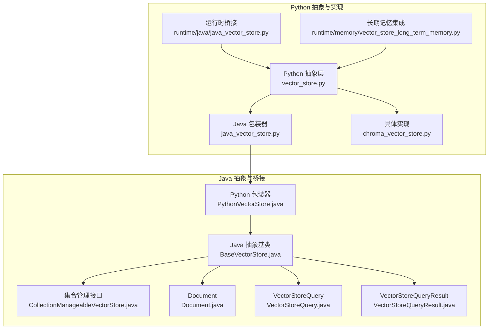
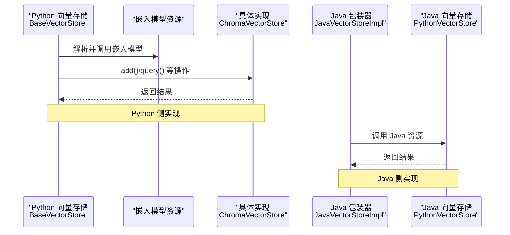
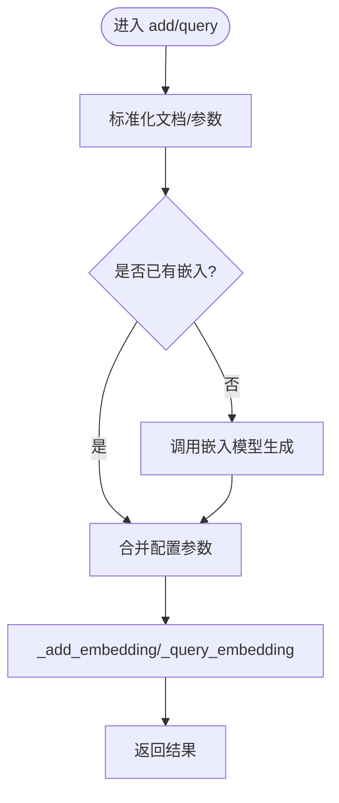
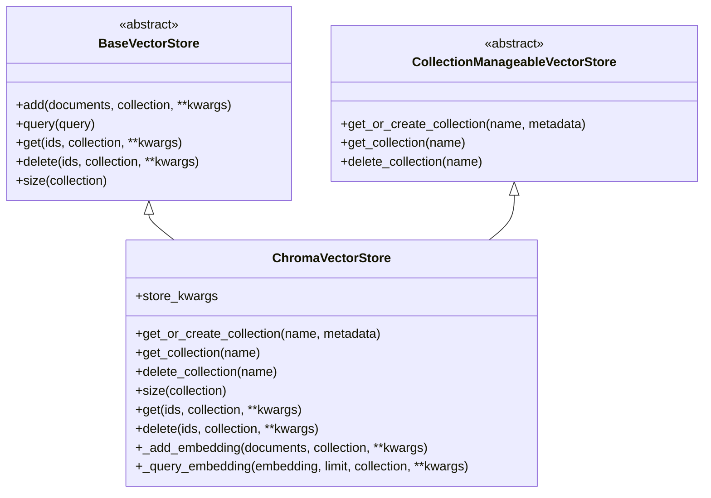
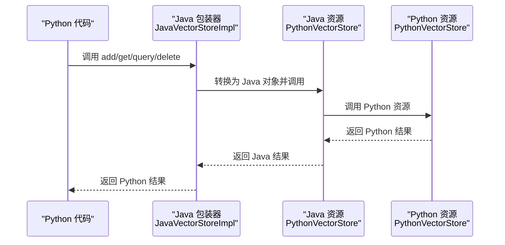
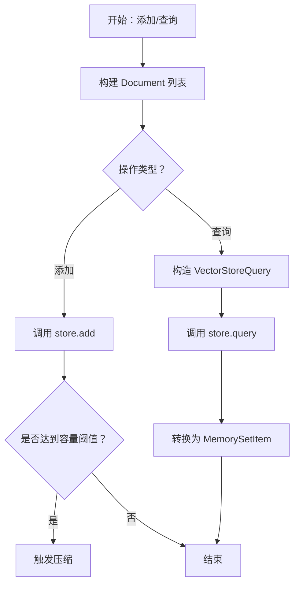
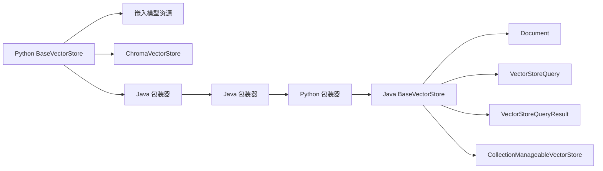

# Python 向量存储

<cite>
**本文引用的文件**
- [python/flink_agents/api/vector_stores/vector_store.py](file://python/flink_agents/api/vector_stores/vector_store.py)
- [python/flink_agents/api/vector_stores/java_vector_store.py](file://python/flink_agents/api/vector_stores/java_vector_store.py)
- [python/flink_agents/integrations/vector_stores/chroma/chroma_vector_store.py](file://python/flink_agents/integrations/vector_stores/chroma/chroma_vector_store.py)
- [python/flink_agents/runtime/java/java_vector_store.py](file://python/flink_agents/runtime/java/java_vector_store.py)
- [python/flink_agents/runtime/memory/vector_store_long_term_memory.py](file://python/flink_agents/runtime/memory/vector_store_long_term_memory.py)
- [api/src/main/java/org/apache/flink/agents/api/vectorstores/BaseVectorStore.java](file://api/src/main/java/org/apache/flink/agents/api/vectorstores/BaseVectorStore.java)
- [api/src/main/java/org/apache/flink/agents/api/vectorstores/CollectionManageableVectorStore.java](file://api/src/main/java/org/apache/flink/agents/api/vectorstores/CollectionManageableVectorStore.java)
- [api/src/main/java/org/apache/flink/agents/api/vectorstores/Document.java](file://api/src/main/java/org/apache/flink/agents/api/vectorstores/Document.java)
- [api/src/main/java/org/apache/flink/agents/api/vectorstores/VectorStoreQuery.java](file://api/src/main/java/org/apache/flink/agents/api/vectorstores/VectorStoreQuery.java)
- [api/src/main/java/org/apache/flink/agents/api/vectorstores/VectorStoreQueryResult.java](file://api/src/main/java/org/apache/flink/agents/api/vectorstores/VectorStoreQueryResult.java)
- [api/src/main/java/org/apache/flink/agents/api/vectorstores/python/PythonVectorStore.java](file://api/src/main/java/org/apache/flink/agents/api/vectorstores/python/PythonVectorStore.java)
- [api/src/main/java/org/apache/flink/agents/api/annotation/VectorStore.java](file://api/src/main/java/org/apache/flink/agents/api/annotation/VectorStore.java)
- [python/flink_agents/integrations/vector_stores/chroma/tests/test_chroma_vector_store.py](file://python/flink_agents/integrations/vector_stores/chroma/tests/test_chroma_vector_store.py)
- [python/flink_agents/e2e_tests/e2e_tests_resource_cross_language/vector_store_cross_language_agent.py](file://python/flink_agents/e2e_tests/e2e_tests_resource_cross_language/vector_store_cross_language_agent.py)
</cite>

## 目录
1. [简介](#简介)
2. [项目结构](#项目结构)
3. [核心组件](#核心组件)
4. [架构总览](#架构总览)
5. [详细组件分析](#详细组件分析)
6. [依赖关系分析](#依赖关系分析)
7. [性能考量](#性能考量)
8. [故障排查指南](#故障排查指南)
9. [结论](#结论)
10. [附录：使用示例与最佳实践](#附录使用示例与最佳实践)

## 简介
本文件面向 Apache Flink Agents 的 Python 向量存储子系统，系统性阐述其基础架构、核心功能、跨语言互操作机制、性能特征与扩展性，并提供可直接参考的使用示例路径与最佳实践。Python 向量存储以统一的抽象接口为基础，支持文档添加、查询检索、相似度搜索与集合管理；同时通过 Java 包装器与 Python 资源适配器实现与 Java 向量存储（如 Elasticsearch）的无缝互操作。

## 项目结构
- Python 抽象层与实现
  - 抽象基类与数据模型：位于 [python/flink_agents/api/vector_stores/vector_store.py](file://python/flink_agents/api/vector_stores/vector_store.py)
  - Java 包装器：位于 [python/flink_agents/api/vector_stores/java_vector_store.py](file://python/flink_agents/api/vector_stores/java_vector_store.py)，运行时桥接位于 [python/flink_agents/runtime/java/java_vector_store.py](file://python/flink_agents/runtime/java/java_vector_store.py)
  - 具体实现：Chroma 向量存储位于 [python/flink_agents/integrations/vector_stores/chroma/chroma_vector_store.py](file://python/flink_agents/integrations/vector_stores/chroma/chroma_vector_store.py)
  - 长期记忆集成：位于 [python/flink_agents/runtime/memory/vector_store_long_term_memory.py](file://python/flink_agents/runtime/memory/vector_store_long_term_memory.py)
- Java 抽象层与 Python 桥接
  - 抽象基类：位于 [api/src/main/java/org/apache/flink/agents/api/vectorstores/BaseVectorStore.java](file://api/src/main/java/org/apache/flink/agents/api/vectorstores/BaseVectorStore.java)
  - 集合管理接口：位于 [api/src/main/java/org/apache/flink/agents/api/vectorstores/CollectionManageableVectorStore.java](file://api/src/main/java/org/apache/flink/agents/api/vectorstores/CollectionManageableVectorStore.java)
  - 数据模型：Document、VectorStoreQuery、VectorStoreQueryResult 分别位于 [api/src/main/java/org/apache/flink/agents/api/vectorstores/Document.java](file://api/src/main/java/org/apache/flink/agents/api/vectorstores/Document.java)、[api/src/main/java/org/apache/flink/agents/api/vectorstores/VectorStoreQuery.java](file://api/src/main/java/org/apache/flink/agents/api/vectorstores/VectorStoreQuery.java)、[api/src/main/java/org/apache/flink/agents/api/vectorstores/VectorStoreQueryResult.java](file://api/src/main/java/org/apache/flink/agents/api/vectorstores/VectorStoreQueryResult.java)
  - Python 桥接包装器：位于 [api/src/main/java/org/apache/flink/agents/api/vectorstores/python/PythonVectorStore.java](file://api/src/main/java/org/apache/flink/agents/api/vectorstores/python/PythonVectorStore.java)
  - 注解：用于资源声明与扫描，位于 [api/src/main/java/org/apache/flink/agents/api/annotation/VectorStore.java](file://api/src/main/java/org/apache/flink/agents/api/annotation/VectorStore.java)

图表来源
- [python/flink_agents/api/vector_stores/vector_store.py](file://python/flink_agents/api/vector_stores/vector_store.py#L136-L363)
- [python/flink_agents/api/vector_stores/java_vector_store.py](file://python/flink_agents/api/vector_stores/java_vector_store.py#L25-L36)
- [python/flink_agents/integrations/vector_stores/chroma/chroma_vector_store.py](file://python/flink_agents/integrations/vector_stores/chroma/chroma_vector_store.py#L58-L406)
- [python/flink_agents/runtime/java/java_vector_store.py](file://python/flink_agents/runtime/java/java_vector_store.py#L40-L149)
- [python/flink_agents/runtime/memory/vector_store_long_term_memory.py](file://python/flink_agents/runtime/memory/vector_store_long_term_memory.py#L52-L329)
- [api/src/main/java/org/apache/flink/agents/api/vectorstores/BaseVectorStore.java](file://api/src/main/java/org/apache/flink/agents/api/vectorstores/BaseVectorStore.java#L38-L174)
- [api/src/main/java/org/apache/flink/agents/api/vectorstores/CollectionManageableVectorStore.java](file://api/src/main/java/org/apache/flink/agents/api/vectorstores/CollectionManageableVectorStore.java#L22-L68)
- [api/src/main/java/org/apache/flink/agents/api/vectorstores/Document.java](file://api/src/main/java/org/apache/flink/agents/api/vectorstores/Document.java#L34-L111)
- [api/src/main/java/org/apache/flink/agents/api/vectorstores/VectorStoreQuery.java](file://api/src/main/java/org/apache/flink/agents/api/vectorstores/VectorStoreQuery.java#L33-L110)
- [api/src/main/java/org/apache/flink/agents/api/vectorstores/VectorStoreQueryResult.java](file://api/src/main/java/org/apache/flink/agents/api/vectorstores/VectorStoreQueryResult.java#L29-L47)
- [api/src/main/java/org/apache/flink/agents/api/vectorstores/python/PythonVectorStore.java](file://api/src/main/java/org/apache/flink/agents/api/vectorstores/python/PythonVectorStore.java#L49-L157)

章节来源
- [python/flink_agents/api/vector_stores/vector_store.py](file://python/flink_agents/api/vector_stores/vector_store.py#L136-L363)
- [api/src/main/java/org/apache/flink/agents/api/vectorstores/BaseVectorStore.java](file://api/src/main/java/org/apache/flink/agents/api/vectorstores/BaseVectorStore.java#L38-L174)

## 核心组件
- 抽象基类 BaseVectorStore（Python）
  - 提供 add、query、get、delete、size 等统一接口
  - 内置嵌入模型资源解析与参数合并逻辑
  - 定义 _add_embedding 与 _query_embedding 两个私有抽象方法供具体实现
- 查询对象 VectorStoreQuery 与结果 VectorStoreQueryResult
  - 统一语义化查询参数（模式、文本、限制、集合名、额外参数）
  - 结果封装为文档列表
- 文档模型 Document
  - 内容、元数据、可选 ID 与嵌入向量
- 集合管理接口 CollectionManageableVectorStore
  - 支持集合的获取/创建、获取、删除
- Java 侧抽象与桥接
  - Java BaseVectorStore 与 Python BaseVectorStore 对齐行为
  - Python 包装器 PythonVectorStore 将 Java 调用映射到 Python 实现
  - 运行时 Java 包装器 JavaVectorStoreImpl 将 Python 调用映射到 Java 实现

章节来源
- [python/flink_agents/api/vector_stores/vector_store.py](file://python/flink_agents/api/vector_stores/vector_store.py#L136-L363)
- [api/src/main/java/org/apache/flink/agents/api/vectorstores/BaseVectorStore.java](file://api/src/main/java/org/apache/flink/agents/api/vectorstores/BaseVectorStore.java#L38-L174)
- [api/src/main/java/org/apache/flink/agents/api/vectorstores/VectorStoreQuery.java](file://api/src/main/java/org/apache/flink/agents/api/vectorstores/VectorStoreQuery.java#L33-L110)
- [api/src/main/java/org/apache/flink/agents/api/vectorstores/VectorStoreQueryResult.java](file://api/src/main/java/org/apache/flink/agents/api/vectorstores/VectorStoreQueryResult.java#L29-L47)
- [api/src/main/java/org/apache/flink/agents/api/vectorstores/Document.java](file://api/src/main/java/org/apache/flink/agents/api/vectorstores/Document.java#L34-L111)
- [api/src/main/java/org/apache/flink/agents/api/vectorstores/python/PythonVectorStore.java](file://api/src/main/java/org/apache/flink/agents/api/vectorstores/python/PythonVectorStore.java#L49-L157)

## 架构总览
Python 向量存储通过统一抽象与数据模型，向上提供一致的 API，向下对接多种实现（如 Chroma）。当需要与 Java 向量存储互操作时，通过 Python 包装器或运行时 Java 包装器完成跨语言调用与数据序列化。

图表来源
- [python/flink_agents/api/vector_stores/vector_store.py](file://python/flink_agents/api/vector_stores/vector_store.py#L163-L232)
- [python/flink_agents/runtime/java/java_vector_store.py](file://python/flink_agents/runtime/java/java_vector_store.py#L70-L116)
- [api/src/main/java/org/apache/flink/agents/api/vectorstores/python/PythonVectorStore.java](file://api/src/main/java/org/apache/flink/agents/api/vectorstores/python/PythonVectorStore.java#L72-L132)

## 详细组件分析

### 抽象基类与核心流程（Python）
- add 流程
  - 将单个或多个文档标准化为列表
  - 若文档未包含嵌入，则调用嵌入模型生成
  - 合并 store_kwargs 与调用参数后调用 _add_embedding
- query 流程
  - 从查询文本生成嵌入
  - 合并 store_kwargs 与 extra_args 后调用 _query_embedding
  - 封装为 VectorStoreQueryResult
- get/delete/size/_add_embedding/_query_embedding
  - 由具体实现覆盖，遵循统一签名与参数约定

图表来源
- [python/flink_agents/api/vector_stores/vector_store.py](file://python/flink_agents/api/vector_stores/vector_store.py#L163-L232)

章节来源
- [python/flink_agents/api/vector_stores/vector_store.py](file://python/flink_agents/api/vector_stores/vector_store.py#L136-L363)

### Chroma 向量存储实现
- 连接模式
  - 支持内存、持久化、服务端、云四种客户端模式
  - 通过配置字段选择对应模式
- 集合管理
  - get_or_create_collection/get_collection/delete_collection
- 文档管理
  - add：分块批量写入，支持自动生成 ID
  - get/delete：支持过滤条件 where/where_document
  - size：统计集合数量
- 查询
  - _query_embedding：执行向量检索并转换为 Document 列表

图表来源
- [python/flink_agents/api/vector_stores/vector_store.py](file://python/flink_agents/api/vector_stores/vector_store.py#L136-L363)
- [python/flink_agents/integrations/vector_stores/chroma/chroma_vector_store.py](file://python/flink_agents/integrations/vector_stores/chroma/chroma_vector_store.py#L58-L406)

章节来源
- [python/flink_agents/integrations/vector_stores/chroma/chroma_vector_store.py](file://python/flink_agents/integrations/vector_stores/chroma/chroma_vector_store.py#L58-L406)

### Java 互操作机制
- Python 包装器（Java → Python）
  - Python 侧通过 @java_resource 注解暴露 Java 实现
  - 运行时 JavaVectorStoreImpl 将 Python 文档/查询转换为 Java 对象并调用 Java 资源
- Java 包装器（Python → Java）
  - Java 侧 PythonVectorStore 将 Java 调用委托给 Python 资源对象
  - 使用 PythonResourceAdapter 完成序列化与反序列化
- 类型转换与序列化
  - 文档：Document ↔ Document
  - 查询：VectorStoreQuery ↔ VectorStoreQuery
  - 结果：VectorStoreQueryResult ↔ VectorStoreQueryResult
  - 集合：CollectionManageableVectorStore.Collection ↔ CollectionManageableVectorStore.Collection

图表来源
- [python/flink_agents/runtime/java/java_vector_store.py](file://python/flink_agents/runtime/java/java_vector_store.py#L70-L116)
- [api/src/main/java/org/apache/flink/agents/api/vectorstores/python/PythonVectorStore.java](file://api/src/main/java/org/apache/flink/agents/api/vectorstores/python/PythonVectorStore.java#L72-L132)

章节来源
- [python/flink_agents/api/vector_stores/java_vector_store.py](file://python/flink_agents/api/vector_stores/java_vector_store.py#L25-L36)
- [python/flink_agents/runtime/java/java_vector_store.py](file://python/flink_agents/runtime/java/java_vector_store.py#L40-L149)
- [api/src/main/java/org/apache/flink/agents/api/vectorstores/python/PythonVectorStore.java](file://api/src/main/java/org/apache/flink/agents/api/vectorstores/python/PythonVectorStore.java#L49-L157)

### 长期记忆集成
- VectorStoreLongTermMemory 基于集合管理的向量存储实现长期记忆
- 自动命名空间（job_id-key-name）隔离不同上下文
- 支持容量触发的压缩与异步执行
- 查询时构造 VectorStoreQuery 并调用 store.query

图表来源
- [python/flink_agents/runtime/memory/vector_store_long_term_memory.py](file://python/flink_agents/runtime/memory/vector_store_long_term_memory.py#L156-L248)

章节来源
- [python/flink_agents/runtime/memory/vector_store_long_term_memory.py](file://python/flink_agents/runtime/memory/vector_store_long_term_memory.py#L52-L329)

## 依赖关系分析
- Python 抽象层依赖嵌入模型资源进行向量化
- Chroma 实现依赖 chromadb 客户端库
- Java 互操作依赖 pemja 与 PythonResourceAdapter
- 集合管理接口在 Java 与 Python 两侧保持一致契约

图表来源
- [python/flink_agents/api/vector_stores/vector_store.py](file://python/flink_agents/api/vector_stores/vector_store.py#L136-L363)
- [python/flink_agents/integrations/vector_stores/chroma/chroma_vector_store.py](file://python/flink_agents/integrations/vector_stores/chroma/chroma_vector_store.py#L58-L406)
- [python/flink_agents/runtime/java/java_vector_store.py](file://python/flink_agents/runtime/java/java_vector_store.py#L40-L149)
- [api/src/main/java/org/apache/flink/agents/api/vectorstores/BaseVectorStore.java](file://api/src/main/java/org/apache/flink/agents/api/vectorstores/BaseVectorStore.java#L38-L174)
- [api/src/main/java/org/apache/flink/agents/api/vectorstores/CollectionManageableVectorStore.java](file://api/src/main/java/org/apache/flink/agents/api/vectorstores/CollectionManageableVectorStore.java#L22-L68)

章节来源
- [api/src/main/java/org/apache/flink/agents/api/vectorstores/CollectionManageableVectorStore.java](file://api/src/main/java/org/apache/flink/agents/api/vectorstores/CollectionManageableVectorStore.java#L22-L68)
- [api/src/main/java/org/apache/flink/agents/api/vectorstores/Document.java](file://api/src/main/java/org/apache/flink/agents/api/vectorstores/Document.java#L34-L111)
- [api/src/main/java/org/apache/flink/agents/api/vectorstores/VectorStoreQuery.java](file://api/src/main/java/org/apache/flink/agents/api/vectorstores/VectorStoreQuery.java#L33-L110)
- [api/src/main/java/org/apache/flink/agents/api/vectorstores/VectorStoreQueryResult.java](file://api/src/main/java/org/apache/flink/agents/api/vectorstores/VectorStoreQueryResult.java#L29-L47)

## 性能考量
- 批量写入与分块
  - Chroma 实现采用分块批量写入，避免单次请求过大
  - 参考：[chunk_list](file://python/flink_agents/integrations/vector_stores/chroma/chroma_vector_store.py#L39-L56)，[批量写入](file://python/flink_agents/integrations/vector_stores/chroma/chroma_vector_store.py#L324-L337)
- 查询参数合并
  - Python 层将 store_kwargs 与 extra_args 合并，减少重复参数传递
  - 参考：[参数合并](file://python/flink_agents/api/vector_stores/vector_store.py#L196-L223)
- 异步压缩（长期记忆）
  - 可配置异步压缩，降低写入延迟
  - 参考：[异步压缩](file://python/flink_agents/runtime/memory/vector_store_long_term_memory.py#L72-L218)
- Java 互操作开销
  - 序列化/反序列化存在成本，建议在批处理场景中合并调用
  - 参考：[Java 包装器调用链](file://python/flink_agents/runtime/java/java_vector_store.py#L70-L116)

## 故障排查指南
- 常见问题
  - Chroma 客户端未安装：测试用例中通过导入检测跳过相关测试
    - 参考：[导入检测](file://python/flink_agents/integrations/vector_stores/chroma/tests/test_chroma_vector_store.py#L24-L29)
  - 集合不存在或被删除：确保先 get_or_create_collection 或检查名称
    - 参考：[集合管理测试](file://python/flink_agents/integrations/vector_stores/chroma/tests/test_chroma_vector_store.py#L114-L147)
  - 删除后查询延迟：等待索引更新或重试
    - 参考：[删除后重试](file://python/flink_agents/e2e_tests/e2e_tests_resource_cross_language/vector_store_cross_language_agent.py#L159-L165)
- 错误处理最佳实践
  - 在 add 前确保文档内容与元数据格式正确
  - 在查询前检查集合是否存在且已建立索引
  - 在 Java 互操作场景下，优先使用批处理减少序列化次数

章节来源
- [python/flink_agents/integrations/vector_stores/chroma/tests/test_chroma_vector_store.py](file://python/flink_agents/integrations/vector_stores/chroma/tests/test_chroma_vector_store.py#L84-L200)
- [python/flink_agents/e2e_tests/e2e_tests_resource_cross_language/vector_store_cross_language_agent.py](file://python/flink_agents/e2e_tests/e2e_tests_resource_cross_language/vector_store_cross_language_agent.py#L159-L165)

## 结论
Python 向量存储以清晰的抽象与统一的数据模型为核心，既支持本地实现（如 Chroma），又通过 Java 包装器实现跨语言互操作。结合长期记忆集成，可在复杂应用场景中实现高效的知识检索与上下文管理。建议在生产环境中关注批处理、索引更新与序列化开销，并根据业务需求选择合适的集合管理策略与查询参数。

## 附录：使用示例与最佳实践
- 示例：Chroma 向量存储使用
  - 初始化与集合管理：[测试用例](file://python/flink_agents/integrations/vector_stores/chroma/tests/test_chroma_vector_store.py#L84-L147)
  - 文档增删查：[测试用例](file://python/flink_agents/integrations/vector_stores/chroma/tests/test_chroma_vector_store.py#L149-L200)
- 示例：跨语言向量存储（Java → Python）
  - 资源描述符与动作定义：[示例代理](file://python/flink_agents/e2e_tests/e2e_tests_resource_cross_language/vector_store_cross_language_agent.py#L86-L98)
  - 集合与文档管理验证：[示例代理](file://python/flink_agents/e2e_tests/e2e_tests_resource_cross_language/vector_store_cross_language_agent.py#L106-L176)
  - 上下文检索响应处理：[示例代理](file://python/flink_agents/e2e_tests/e2e_tests_resource_cross_language/vector_store_cross_language_agent.py#L180-L200)
- 最佳实践
  - 批量写入：利用分块策略减少单次请求大小
  - 参数合并：将 store_kwargs 与 extra_args 合理组织
  - 集合命名：使用唯一命名空间隔离不同任务与上下文
  - 异步压缩：在高写入场景启用异步压缩降低尾延迟
  - Java 互操作：尽量减少序列化次数，合并多次调用

章节来源
- [python/flink_agents/integrations/vector_stores/chroma/tests/test_chroma_vector_store.py](file://python/flink_agents/integrations/vector_stores/chroma/tests/test_chroma_vector_store.py#L84-L200)
- [python/flink_agents/e2e_tests/e2e_tests_resource_cross_language/vector_store_cross_language_agent.py](file://python/flink_agents/e2e_tests/e2e_tests_resource_cross_language/vector_store_cross_language_agent.py#L86-L200)