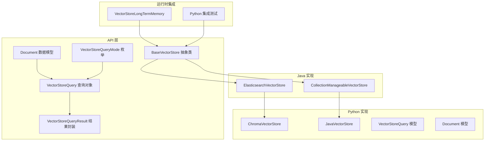
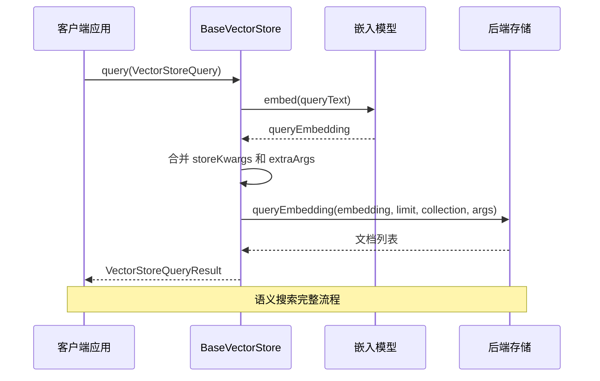
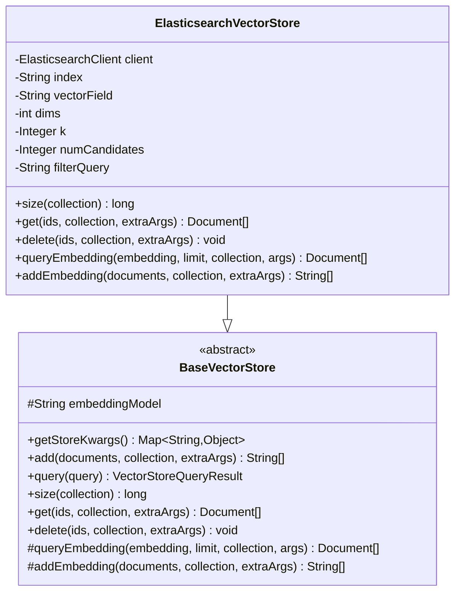
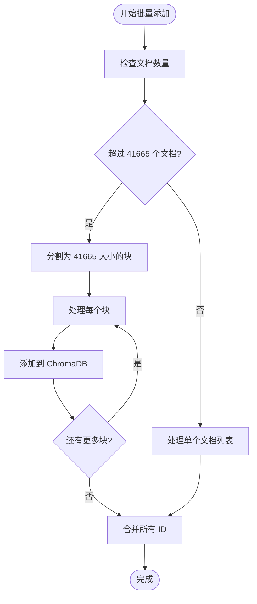
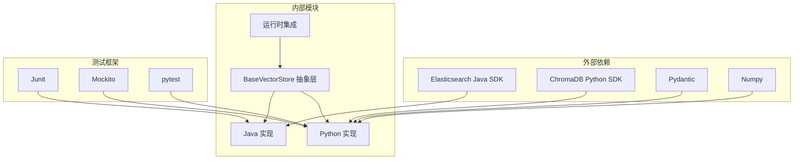

# 向量存储基础类

<cite>
**本文档引用的文件**
- [BaseVectorStore.java](file://api/src/main/java/org/apache/flink/agents/api/vectorstores/BaseVectorStore.java)
- [Document.java](file://api/src/main/java/org/apache/flink/agents/api/vectorstores/Document.java)
- [VectorStoreQuery.java](file://api/src/main/java/org/apache/flink/agents/api/vectorstores/VectorStoreQuery.java)
- [VectorStoreQueryResult.java](file://api/src/main/java/org/apache/flink/agents/api/vectorstores/VectorStoreQueryResult.java)
- [VectorStoreQueryMode.java](file://api/src/main/java/org/apache/flink/agents/api/vectorstores/VectorStoreQueryMode.java)
- [ElasticsearchVectorStore.java](file://integrations/vector-stores/elasticsearch/src/main/java/org/apache/flink/agents/integrations/vectorstores/elasticsearch/ElasticsearchVectorStore.java)
- [chroma_vector_store.py](file://python/flink_agents/integrations/vector_stores/chroma/chroma_vector_store.py)
- [vector_store.py](file://python/flink_agents/api/vector_stores/vector_store.py)
- [java_vector_store.py](file://python/flink_agents/api/vector_stores/java_vector_store.py)
- [VectorStoreLongTermMemory.java](file://python/flink_agents/runtime/memory/vector_store_long_term_memory.py)
- [PythonCollectionManageableVectorStoreTest.java](file://api/src/test/java/org/apache/flink/agents/api/vectorstores/python/PythonCollectionManageableVectorStoreTest.java)
</cite>

## 目录
1. [简介](#简介)
2. [项目结构](#项目结构)
3. [核心组件](#核心组件)
4. [架构概览](#架构概览)
5. [详细组件分析](#详细组件分析)
6. [依赖关系分析](#依赖关系分析)
7. [性能考虑](#性能考虑)
8. [故障排除指南](#故障排除指南)
9. [结论](#结论)
10. [附录](#附录)

## 简介

向量存储基础类是 Flink Agents 项目中用于处理语义搜索和文档检索的核心抽象层。该系统提供了统一的接口来管理文档嵌入、执行相似性搜索，并与多种后端存储（如 Elasticsearch 和 ChromaDB）进行集成。

本系统采用分层架构设计，通过抽象基类定义标准接口，具体实现类负责处理特定存储引擎的细节。系统支持批处理操作、集合管理、以及跨语言资源集成。

## 项目结构

向量存储系统在项目中的组织结构如下：



**图表来源**
- [BaseVectorStore.java](file://api/src/main/java/org/apache/flink/agents/api/vectorstores/BaseVectorStore.java#L38-L173)
- [ElasticsearchVectorStore.java](file://integrations/vector-stores/elasticsearch/src/main/java/org/apache/flink/agents/integrations/vectorstores/elasticsearch/ElasticsearchVectorStore.java#L118-L119)
- [chroma_vector_store.py](file://python/flink_agents/integrations/vector_stores/chroma/chroma_vector_store.py#L58-L406)

**章节来源**
- [BaseVectorStore.java](file://api/src/main/java/org/apache/flink/agents/api/vectorstores/BaseVectorStore.java#L1-L174)
- [Document.java](file://api/src/main/java/org/apache/flink/agents/api/vectorstores/Document.java#L1-L111)
- [VectorStoreQuery.java](file://api/src/main/java/org/apache/flink/agents/api/vectorstores/VectorStoreQuery.java#L1-L110)

## 核心组件

### BaseVectorStore 抽象基类

BaseVectorStore 是整个向量存储系统的核心抽象类，定义了所有向量存储实现必须遵循的标准接口。该类继承自 Resource 基类，集成了资源管理和嵌入模型连接功能。

主要特性包括：
- **嵌入模型集成**：自动管理嵌入模型资源的获取和使用
- **统一接口**：提供标准化的文档添加、查询、检索和删除操作
- **配置管理**：支持存储特定参数的合并和传递
- **类型安全**：通过泛型确保类型安全的文档操作

### Document 数据模型

Document 类代表从向量存储中检索到的单个文档，包含以下核心属性：
- **内容字段**：存储实际的文本内容
- **元数据**：支持任意键值对形式的文档元信息
- **标识符**：唯一文档标识符（可选）
- **嵌入向量**：文档的向量表示（可选）

### VectorStoreQuery 查询对象

VectorStoreQuery 提供结构化的查询接口，支持：
- **查询模式**：当前支持语义搜索模式
- **文本查询**：用户提供的自然语言查询文本
- **结果限制**：最大返回文档数量
- **集合指定**：可选的目标集合名称
- **额外参数**：存储特定的查询参数

### VectorStoreQueryResult 结果封装

VectorStoreQueryResult 简化了查询结果的处理，仅包含一个字段：
- **文档列表**：按相关性排序的匹配文档集合

### VectorStoreQueryMode 查询模式

当前支持的查询模式：
- **SEMANTIC**：基于嵌入向量的语义相似性搜索

**章节来源**
- [BaseVectorStore.java](file://api/src/main/java/org/apache/flink/agents/api/vectorstores/BaseVectorStore.java#L38-L173)
- [Document.java](file://api/src/main/java/org/apache/flink/agents/api/vectorstores/Document.java#L34-L111)
- [VectorStoreQuery.java](file://api/src/main/java/org/apache/flink/agents/api/vectorstores/VectorStoreQuery.java#L33-L110)
- [VectorStoreQueryResult.java](file://api/src/main/java/org/apache/flink/agents/api/vectorstores/VectorStoreQueryResult.java#L29-L47)
- [VectorStoreQueryMode.java](file://api/src/main/java/org/apache/flink/agents/api/vectorstores/VectorStoreQueryMode.java#L28-L62)

## 架构概览

系统采用分层架构设计，实现了跨语言的向量存储解决方案：



**图表来源**
- [BaseVectorStore.java](file://api/src/main/java/org/apache/flink/agents/api/vectorstores/BaseVectorStore.java#L97-L112)
- [VectorStoreQuery.java](file://api/src/main/java/org/apache/flink/agents/api/vectorstores/VectorStoreQuery.java#L72-L83)

系统架构的关键特点：
- **抽象统一**：通过 BaseVectorStore 提供统一的接口
- **嵌入集成**：自动处理文本到向量的转换
- **参数合并**：智能合并存储配置和查询参数
- **类型安全**：强类型的文档和查询对象

**章节来源**
- [BaseVectorStore.java](file://api/src/main/java/org/apache/flink/agents/api/vectorstores/BaseVectorStore.java#L71-L112)

## 详细组件分析

### ElasticsearchVectorStore 实现

ElasticsearchVectorStore 是 Java 生态系统的向量存储实现，提供了完整的集合管理和近似最近邻搜索功能。

#### 核心配置参数

| 参数名 | 类型 | 必需 | 默认值 | 描述 |
|--------|------|------|--------|------|
| index | String | 是 | - | 目标索引名称 |
| vector_field | String | 是 | content_vector | 向量字段名称 |
| dims | Integer | 否 | 768 | 向量维度 |
| k | Integer | 否 | - | 返回的邻居数量 |
| num_candidates | Integer | 否 | - | 候选集大小 |
| filter_query | String | 否 | - | Elasticsearch 过滤查询 |

#### 数据结构设计



**图表来源**
- [ElasticsearchVectorStore.java](file://integrations/vector-stores/elasticsearch/src/main/java/org/apache/flink/agents/integrations/vectorstores/elasticsearch/ElasticsearchVectorStore.java#L118-L119)
- [BaseVectorStore.java](file://api/src/main/java/org/apache/flink/agents/api/vectorstores/BaseVectorStore.java#L38-L173)

#### 性能特征

- **索引策略**：使用 Elasticsearch 的 KNN 搜索能力
- **内存管理**：支持大结果窗口限制（10000 文档）
- **认证支持**：支持基本认证和 API Key 认证
- **批量操作**：优化的批量插入和查询处理

**章节来源**
- [ElasticsearchVectorStore.java](file://integrations/vector-stores/elasticsearch/src/main/java/org/apache/flink/agents/integrations/vectorstores/elasticsearch/ElasticsearchVectorStore.java#L74-L200)

### ChromaVectorStore Python 实现

ChromaVectorStore 提供了纯 Python 的向量存储实现，支持多种客户端模式：

#### 支持的客户端模式

| 模式 | 配置参数 | 特点 |
|------|----------|------|
| 内存模式 | 无 | 临时存储，重启丢失 |
| 持久化模式 | persist_directory | 文件系统持久化 |
| 服务器模式 | host, port | 网络客户端 |
| 云服务模式 | api_key | Chroma Cloud |

#### 批量处理优化



**图表来源**
- [chroma_vector_store.py](file://python/flink_agents/integrations/vector_stores/chroma/chroma_vector_store.py#L39-L56)

**章节来源**
- [chroma_vector_store.py](file://python/flink_agents/integrations/vector_stores/chroma/chroma_vector_store.py#L58-L406)

### JavaVectorStore 跨语言集成

JavaVectorStore 展示了如何在 Python 中桥接 Java 向量存储实现：

#### 装饰器模式

```python
@java_resource
class JavaVectorStore(BaseVectorStore):
    """Java 基础实现的向量存储"""
    java_class_name: str = ""
```

这种设计允许 Python 代码透明地使用 Java 实现，同时保持一致的接口。

**章节来源**
- [java_vector_store.py](file://python/flink_agents/api/vector_stores/java_vector_store.py#L25-L36)

## 依赖关系分析

系统依赖关系呈现清晰的层次结构：



**图表来源**
- [ElasticsearchVectorStore.java](file://integrations/vector-stores/elasticsearch/src/main/java/org/apache/flink/agents/integrations/vectorstores/elasticsearch/ElasticsearchVectorStore.java#L21-L72)
- [chroma_vector_store.py](file://python/flink_agents/integrations/vector_stores/chroma/chroma_vector_store.py#L18-L26)

**章节来源**
- [PythonCollectionManageableVectorStoreTest.java](file://api/src/test/java/org/apache/flink/agents/api/vectorstores/python/PythonCollectionManageableVectorStoreTest.java#L21-L46)

## 性能考虑

### 索引策略优化

1. **Elasticsearch KNN 搜索**
   - 使用近似最近邻算法减少搜索复杂度
   - 支持候选集大小调优以平衡精度和性能
   - 连接池复用减少连接开销

2. **ChromaDB 批处理**
   - 最大批处理大小 41665 个文档
   - 分块处理避免内存溢出
   - UUID 自动生成确保唯一性

### 内存管理

- **流式处理**：长列表操作使用生成器模式
- **延迟加载**：文档内容按需解析
- **缓存策略**：嵌入模型结果缓存

### 并发处理

- **异步压缩**：长时操作不阻塞主线程
- **线程池管理**：合理配置执行器
- **资源清理**：自动关闭数据库连接

## 故障排除指南

### 常见问题诊断

#### 连接问题
1. **Elasticsearch 连接失败**
   - 检查主机地址和端口配置
   - 验证认证凭据
   - 确认网络连通性

2. **ChromaDB 连接异常**
   - 验证客户端模式配置
   - 检查持久化目录权限
   - 确认 API Key 有效性

#### 性能问题
1. **查询响应缓慢**
   - 调整 k 和 num_candidates 参数
   - 优化过滤查询条件
   - 检查索引状态

2. **内存使用过高**
   - 减少批量大小
   - 实施适当的缓存策略
   - 监控内存使用情况

**章节来源**
- [ElasticsearchVectorStore.java](file://integrations/vector-stores/elasticsearch/src/main/java/org/apache/flink/agents/integrations/vectorstores/elasticsearch/ElasticsearchVectorStore.java#L169-L200)

## 结论

向量存储基础类系统提供了强大而灵活的语义搜索能力，通过抽象设计实现了多后端支持和跨语言集成。系统的主要优势包括：

1. **统一接口**：通过 BaseVectorStore 提供一致的操作体验
2. **多后端支持**：Elasticsearch 和 ChromaDB 的原生支持
3. **类型安全**：强类型的文档和查询对象确保运行时安全
4. **性能优化**：针对不同存储引擎的特定优化
5. **扩展性**：易于实现新的向量存储后端

该系统为构建智能搜索和推荐系统提供了坚实的基础，支持从简单的本地开发到大规模生产部署的各种场景。

## 附录

### 使用示例

#### 基本查询流程

```java
// 创建查询对象
VectorStoreQuery query = new VectorStoreQuery(
    "机器学习算法", 
    10, 
    "documents", 
    Map.of("filter_query", "{\"term\":{\"category\":\"tech\"}}")
);

// 执行查询
VectorStoreQueryResult result = vectorStore.query(query);

// 处理结果
for (Document doc : result.getDocuments()) {
    System.out.println("文档ID: " + doc.getId());
    System.out.println("内容预览: " + doc.getContent().substring(0, Math.min(100, doc.getContent().length())));
}
```

#### 批量文档添加

```java
// 准备文档
List<Document> documents = Arrays.asList(
    new Document("内容1", Map.of("source", "file1"), "id1"),
    new Document("内容2", Map.of("source", "file2"), "id2")
);

// 添加到默认集合
List<String> ids = vectorStore.add(documents, null, Map.of("batch_size", 50));
```

### 扩展指南

要实现自定义向量存储，需要：

1. **继承 BaseVectorStore** 或相应的抽象类
2. **实现必需方法**：
   - `getStoreKwargs()` - 返回存储配置
   - `_add_embedding()` - 添加带嵌入的文档
   - `_query_embedding()` - 基于嵌入的查询
   - `size()`, `get()`, `delete()` - 基础操作
3. **处理嵌入生成** - 利用继承的嵌入模型资源
4. **参数合并逻辑** - 实现配置参数的合并
5. **错误处理** - 提供适当的异常处理

**章节来源**
- [BaseVectorStore.java](file://api/src/main/java/org/apache/flink/agents/api/vectorstores/BaseVectorStore.java#L60-L172)