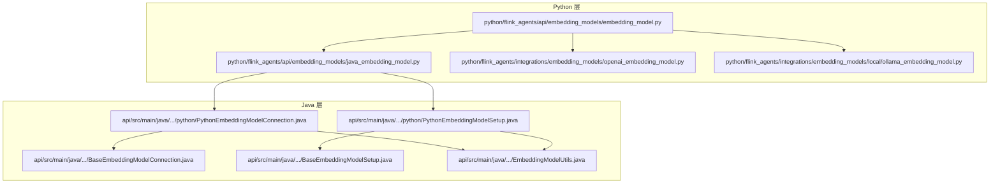
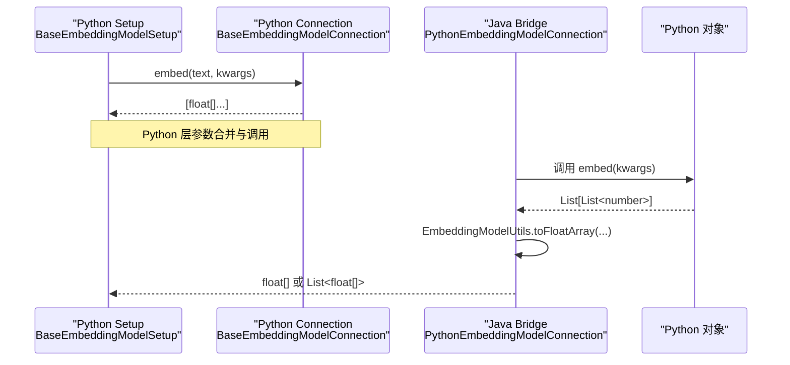
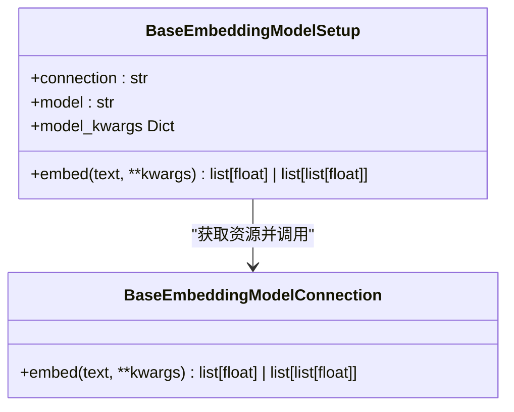
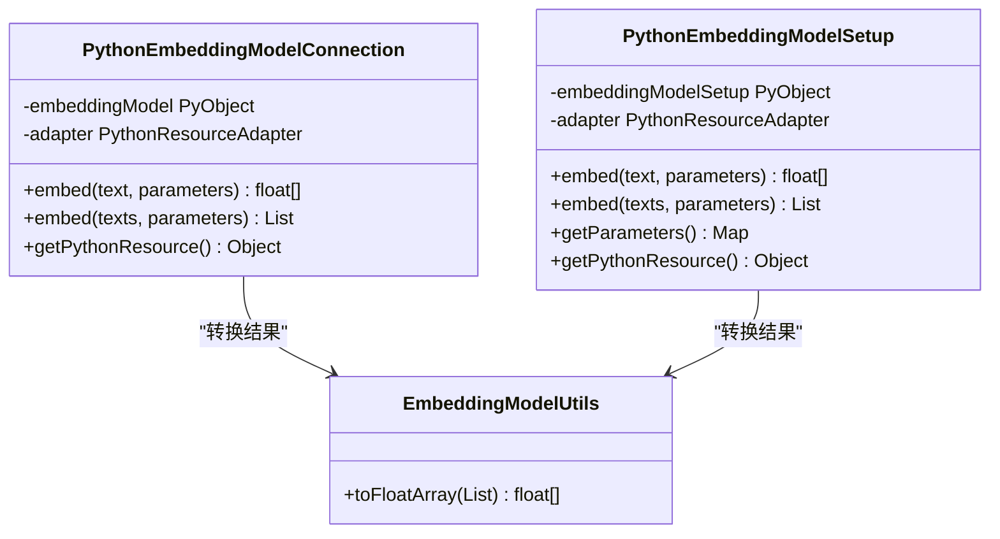
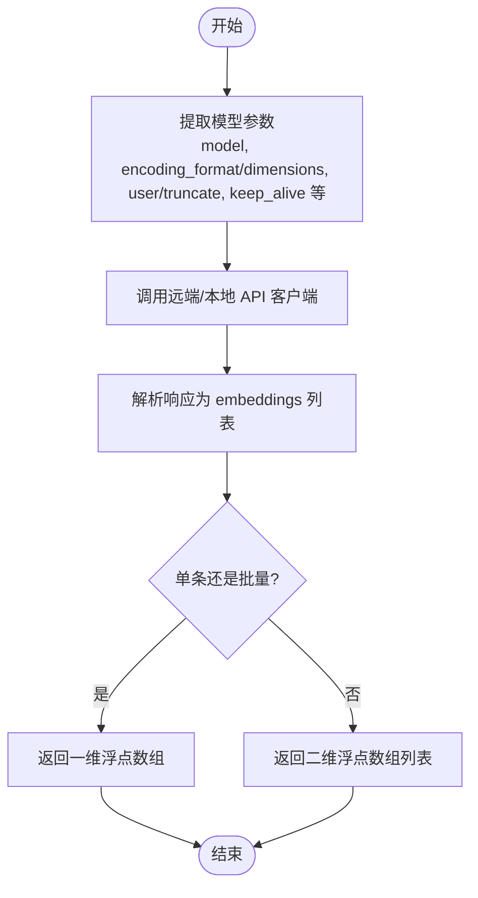
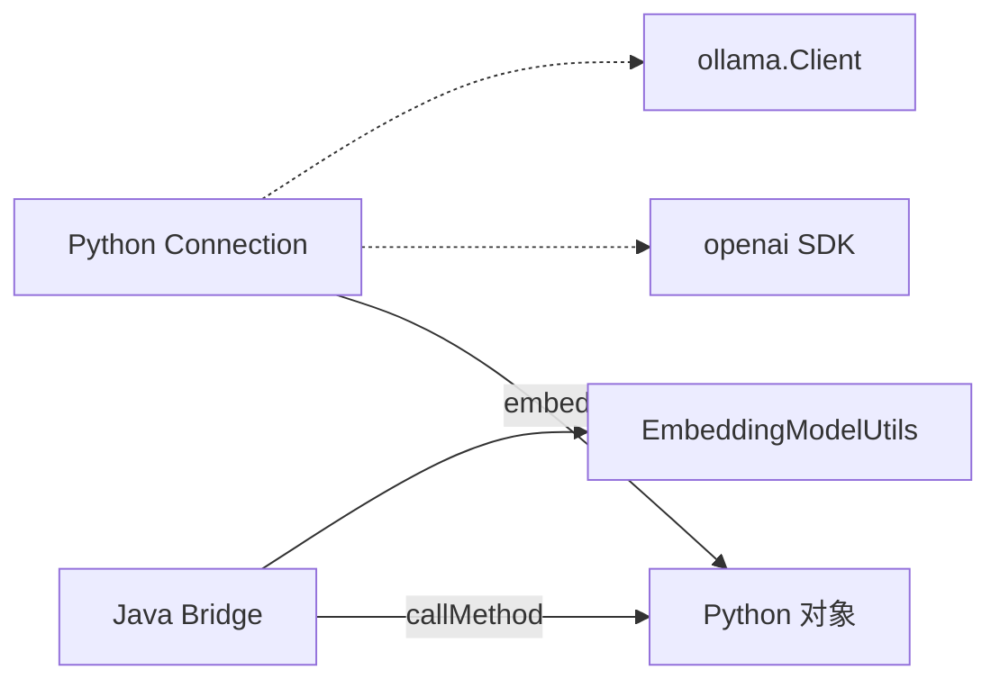

# Python 嵌入模型

<cite>
**本文引用的文件**
- [python/flink_agents/api/embedding_models/embedding_model.py](file://python/flink_agents/api/embedding_models/embedding_model.py)
- [python/flink_agents/api/embedding_models/java_embedding_model.py](file://python/flink_agents/api/embedding_models/java_embedding_model.py)
- [api/src/main/java/org/apache/flink/agents/api/embedding/model/BaseEmbeddingModelConnection.java](file://api/src/main/java/org/apache/flink/agents/api/embedding/model/BaseEmbeddingModelConnection.java)
- [api/src/main/java/org/apache/flink/agents/api/embedding/model/BaseEmbeddingModelSetup.java](file://api/src/main/java/org/apache/flink/agents/api/embedding/model/BaseEmbeddingModelSetup.java)
- [api/src/main/java/org/apache/flink/agents/api/embedding/model/python/PythonEmbeddingModelConnection.java](file://api/src/main/java/org/apache/flink/agents/api/embedding/model/python/PythonEmbeddingModelConnection.java)
- [api/src/main/java/org/apache/flink/agents/api/embedding/model/python/PythonEmbeddingModelSetup.java](file://api/src/main/java/org/apache/flink/agents/api/embedding/model/python/PythonEmbeddingModelSetup.java)
- [api/src/main/java/org/apache/flink/agents/api/embedding/model/EmbeddingModelUtils.java](file://api/src/main/java/org/apache/flink/agents/api/embedding/model/EmbeddingModelUtils.java)
- [python/flink_agents/integrations/embedding_models/openai_embedding_model.py](file://python/flink_agents/integrations/embedding_models/openai_embedding_model.py)
- [python/flink_agents/integrations/embedding_models/local/ollama_embedding_model.py](file://python/flink_agents/integrations/embedding_models/local/ollama_embedding_model.py)
- [api/src/test/java/org/apache/flink/agents/api/embedding/model/python/PythonEmbeddingModelConnectionTest.java](file://api/src/test/java/org/apache/flink/agents/api/embedding/model/python/PythonEmbeddingModelConnectionTest.java)
- [api/src/test/java/org/apache/flink/agents/api/embedding/model/python/PythonEmbeddingModelSetupTest.java](file://api/src/test/java/org/apache/flink/agents/api/embedding/model/python/PythonEmbeddingModelSetupTest.java)
- [python/flink_agents/e2e_tests/e2e_tests_resource_cross_language/embedding_model_cross_language_test.py](file://python/flink_agents/e2e_tests/e2e_tests_resource_cross_language/embedding_model_cross_language_test.py)
- [python/flink_agents/e2e_tests/e2e_tests_resource_cross_language/embedding_model_cross_language_agent.py](file://python/flink_agents/e2e_tests/e2e_tests_resource_cross_language/embedding_model_cross_language_agent.py)
- [python/flink_agents/integrations/embedding_models/tests/test_openai_embedding_model.py](file://python/flink_agents/integrations/embedding_models/tests/test_openai_embedding_model.py)
</cite>

## 目录
1. [引言](#引言)
2. [项目结构](#项目结构)
3. [核心组件](#核心组件)
4. [架构总览](#架构总览)
5. [详细组件分析](#详细组件分析)
6. [依赖关系分析](#依赖关系分析)
7. [性能考虑](#性能考虑)
8. [故障排查指南](#故障排查指南)
9. [结论](#结论)
10. [附录：使用示例与最佳实践](#附录使用示例与最佳实践)

## 引言
本文件面向 Apache Flink Agents 的 Python 嵌入模型子系统，系统性梳理嵌入模型的基础架构、数据流与跨语言互操作机制。重点覆盖：
- EmbeddingModel 基类设计与职责边界
- 文本预处理、模型推理与向量归一化的完整流程
- Python 与 Java 嵌入模型的互操作（数据序列化、类型转换、资源封装）
- 使用示例、性能特征与适用场景、缓存与批量处理、错误处理最佳实践

## 项目结构
Python 嵌入模型位于 flink_agents 包内，Java 层提供桥接实现与工具类；测试覆盖了跨语言桥接与端到端集成。

图表来源
- [python/flink_agents/api/embedding_models/embedding_model.py](file://python/flink_agents/api/embedding_models/embedding_model.py#L27-L107)
- [python/flink_agents/api/embedding_models/java_embedding_model.py](file://python/flink_agents/api/embedding_models/java_embedding_model.py#L25-L47)
- [api/src/main/java/org/apache/flink/agents/api/embedding/model/BaseEmbeddingModelConnection.java](file://api/src/main/java/org/apache/flink/agents/api/embedding/model/BaseEmbeddingModelConnection.java#L45-L83)
- [api/src/main/java/org/apache/flink/agents/api/embedding/model/BaseEmbeddingModelSetup.java](file://api/src/main/java/org/apache/flink/agents/api/embedding/model/BaseEmbeddingModelSetup.java#L36-L113)
- [api/src/main/java/org/apache/flink/agents/api/embedding/model/python/PythonEmbeddingModelConnection.java](file://api/src/main/java/org/apache/flink/agents/api/embedding/model/python/PythonEmbeddingModelConnection.java#L43-L132)
- [api/src/main/java/org/apache/flink/agents/api/embedding/model/python/PythonEmbeddingModelSetup.java](file://api/src/main/java/org/apache/flink/agents/api/embedding/model/python/PythonEmbeddingModelSetup.java#L43-L131)
- [api/src/main/java/org/apache/flink/agents/api/embedding/model/EmbeddingModelUtils.java](file://api/src/main/java/org/apache/flink/agents/api/embedding/model/EmbeddingModelUtils.java#L22-L37)

章节来源
- [python/flink_agents/api/embedding_models/embedding_model.py](file://python/flink_agents/api/embedding_models/embedding_model.py#L27-L107)
- [api/src/main/java/org/apache/flink/agents/api/embedding/model/BaseEmbeddingModelConnection.java](file://api/src/main/java/org/apache/flink/agents/api/embedding/model/BaseEmbeddingModelConnection.java#L45-L83)
- [api/src/main/java/org/apache/flink/agents/api/embedding/model/BaseEmbeddingModelSetup.java](file://api/src/main/java/org/apache/flink/agents/api/embedding/model/BaseEmbeddingModelSetup.java#L36-L113)

## 核心组件
- Python 基类层
  - BaseEmbeddingModelConnection：定义嵌入连接接口，负责单条与批量文本的 embed 调用，返回浮点数组或二维数组。
  - BaseEmbeddingModelSetup：定义嵌入设置接口，持有 connection 与 model 名称，负责参数合并与调用连接层。
- Java 桥接层
  - PythonEmbeddingModelConnection / PythonEmbeddingModelSetup：封装 Python 对象，通过 PythonResourceAdapter 调用 embed 方法，再由 EmbeddingModelUtils 将结果转为 float[]。
- 具体实现
  - OpenAIEmbeddingModelConnection/Setup：对接 OpenAI Embeddings API，支持 encoding_format、dimensions 等参数。
  - OllamaEmbeddingModelConnection/Setup：对接本地 Ollama 服务，支持 truncate、keep_alive 等参数。

章节来源
- [python/flink_agents/api/embedding_models/embedding_model.py](file://python/flink_agents/api/embedding_models/embedding_model.py#L27-L107)
- [api/src/main/java/org/apache/flink/agents/api/embedding/model/python/PythonEmbeddingModelConnection.java](file://api/src/main/java/org/apache/flink/agents/api/embedding/model/python/PythonEmbeddingModelConnection.java#L43-L132)
- [api/src/main/java/org/apache/flink/agents/api/embedding/model/python/PythonEmbeddingModelSetup.java](file://api/src/main/java/org/apache/flink/agents/api/embedding/model/python/PythonEmbeddingModelSetup.java#L43-L131)
- [python/flink_agents/integrations/embedding_models/openai_embedding_model.py](file://python/flink_agents/integrations/embedding_models/openai_embedding_model.py#L34-L224)
- [python/flink_agents/integrations/embedding_models/local/ollama_embedding_model.py](file://python/flink_agents/integrations/embedding_models/local/ollama_embedding_model.py#L31-L167)

## 架构总览
Python 与 Java 的嵌入模型通过“资源包装器”模式实现互操作：Java 侧的 PythonEmbeddingModelConnection/Setup 持有 Python 对象句柄，调用其 embed 方法并将返回值转换为 Java 浮点数组；Python 侧的 BaseEmbeddingModelSetup 通过资源引用获取连接对象，完成参数合并与调用。

图表来源
- [python/flink_agents/api/embedding_models/embedding_model.py](file://python/flink_agents/api/embedding_models/embedding_model.py#L88-L107)
- [api/src/main/java/org/apache/flink/agents/api/embedding/model/python/PythonEmbeddingModelConnection.java](file://api/src/main/java/org/apache/flink/agents/api/embedding/model/python/PythonEmbeddingModelConnection.java#L68-L121)
- [api/src/main/java/org/apache/flink/agents/api/embedding/model/EmbeddingModelUtils.java](file://api/src/main/java/org/apache/flink/agents/api/embedding/model/EmbeddingModelUtils.java#L23-L36)

## 详细组件分析

### Python 基类：BaseEmbeddingModelConnection 与 BaseEmbeddingModelSetup
- 设计要点
  - 连接层负责具体模型服务交互（如 OpenAI、Ollama），提供 embed 单条与批量接口。
  - 设置层负责参数合并与资源解析，屏蔽底层差异。
- 关键行为
  - 参数合并：设置层将 model_kwargs 与调用时 kwargs 合并后传递给连接层。
  - 返回格式：单条输入返回一维浮点数组；批量输入返回二维浮点数组列表。

图表来源
- [python/flink_agents/api/embedding_models/embedding_model.py](file://python/flink_agents/api/embedding_models/embedding_model.py#L27-L107)

章节来源
- [python/flink_agents/api/embedding_models/embedding_model.py](file://python/flink_agents/api/embedding_models/embedding_model.py#L27-L107)

### Java 桥接：PythonEmbeddingModelConnection 与 PythonEmbeddingModelSetup
- 设计要点
  - 通过 PythonResourceAdapter 调用 Python 对象的 embed 方法，传入 kwargs（含 text）。
  - 使用 EmbeddingModelUtils 将 Python 返回的 List<number> 转换为 float[]。
- 错误处理
  - 对空 Python 对象进行状态检查。
  - 对非 List 结果抛出 IllegalArgumentException。

图表来源
- [api/src/main/java/org/apache/flink/agents/api/embedding/model/python/PythonEmbeddingModelConnection.java](file://api/src/main/java/org/apache/flink/agents/api/embedding/model/python/PythonEmbeddingModelConnection.java#L43-L132)
- [api/src/main/java/org/apache/flink/agents/api/embedding/model/python/PythonEmbeddingModelSetup.java](file://api/src/main/java/org/apache/flink/agents/api/embedding/model/python/PythonEmbeddingModelSetup.java#L43-L131)
- [api/src/main/java/org/apache/flink/agents/api/embedding/model/EmbeddingModelUtils.java](file://api/src/main/java/org/apache/flink/agents/api/embedding/model/EmbeddingModelUtils.java#L22-L37)

章节来源
- [api/src/main/java/org/apache/flink/agents/api/embedding/model/python/PythonEmbeddingModelConnection.java](file://api/src/main/java/org/apache/flink/agents/api/embedding/model/python/PythonEmbeddingModelConnection.java#L43-L132)
- [api/src/main/java/org/apache/flink/agents/api/embedding/model/python/PythonEmbeddingModelSetup.java](file://api/src/main/java/org/apache/flink/agents/api/embedding/model/python/PythonEmbeddingModelSetup.java#L43-L131)
- [api/src/main/java/org/apache/flink/agents/api/embedding/model/EmbeddingModelUtils.java](file://api/src/main/java/org/apache/flink/agents/api/embedding/model/EmbeddingModelUtils.java#L22-L37)

### 具体实现：OpenAI 与 Ollama
- OpenAI
  - 支持 encoding_format、dimensions、user 等参数；内部通过 OpenAI SDK 发起请求并解析响应。
  - 返回值统一为浮点数组或二维数组列表。
- Ollama
  - 支持 truncate、keep_alive、options 等参数；内部通过 Ollama Client 发起请求并解析响应。
  - 返回值统一为浮点数组或二维数组列表。

图表来源
- [python/flink_agents/integrations/embedding_models/openai_embedding_model.py](file://python/flink_agents/integrations/embedding_models/openai_embedding_model.py#L114-L132)
- [python/flink_agents/integrations/embedding_models/local/ollama_embedding_model.py](file://python/flink_agents/integrations/embedding_models/local/ollama_embedding_model.py#L80-L97)

章节来源
- [python/flink_agents/integrations/embedding_models/openai_embedding_model.py](file://python/flink_agents/integrations/embedding_models/openai_embedding_model.py#L34-L224)
- [python/flink_agents/integrations/embedding_models/local/ollama_embedding_model.py](file://python/flink_agents/integrations/embedding_models/local/ollama_embedding_model.py#L31-L167)

### 跨语言互操作与数据序列化
- 数据流
  - Java 侧构造 kwargs（含 text），通过 PythonResourceAdapter 调用 Python 对象的 embed。
  - Python 返回 List<List<number>>，Java 侧用 EmbeddingModelUtils 转为 float[]。
- 类型转换
  - Python 数字列表 → Java float[]；批量时逐项转换。
- 资源封装
  - Java 侧实现 PythonResourceWrapper 接口，暴露 getPythonResource 以便上层管理生命周期。

章节来源
- [api/src/main/java/org/apache/flink/agents/api/embedding/model/python/PythonEmbeddingModelConnection.java](file://api/src/main/java/org/apache/flink/agents/api/embedding/model/python/PythonEmbeddingModelConnection.java#L68-L121)
- [api/src/main/java/org/apache/flink/agents/api/embedding/model/python/PythonEmbeddingModelSetup.java](file://api/src/main/java/org/apache/flink/agents/api/embedding/model/python/PythonEmbeddingModelSetup.java#L67-L120)
- [api/src/main/java/org/apache/flink/agents/api/embedding/model/EmbeddingModelUtils.java](file://api/src/main/java/org/apache/flink/agents/api/embedding/model/EmbeddingModelUtils.java#L23-L36)

## 依赖关系分析
- 组件耦合
  - Python 设置层依赖连接层；Java 桥接层依赖 Python 对象与工具类。
  - BaseEmbeddingModelConnection/Setup 在 Java 与 Python 两侧分别提供一致的抽象。
- 外部依赖
  - OpenAI：openai SDK
  - Ollama：ollama.Client
  - 跨语言：pemja.core.object.PyObject、PythonResourceAdapter

图表来源
- [python/flink_agents/integrations/embedding_models/openai_embedding_model.py](file://python/flink_agents/integrations/embedding_models/openai_embedding_model.py#L20-L27)
- [python/flink_agents/integrations/embedding_models/local/ollama_embedding_model.py](file://python/flink_agents/integrations/embedding_models/local/ollama_embedding_model.py#L20-L26)
- [api/src/main/java/org/apache/flink/agents/api/embedding/model/python/PythonEmbeddingModelConnection.java](file://api/src/main/java/org/apache/flink/agents/api/embedding/model/python/PythonEmbeddingModelConnection.java#L25-L27)
- [api/src/main/java/org/apache/flink/agents/api/embedding/model/python/PythonEmbeddingModelSetup.java](file://api/src/main/java/org/apache/flink/agents/api/embedding/model/python/PythonEmbeddingModelSetup.java#L25-L27)

## 性能考虑
- 批量处理
  - Java 层支持批量 embed，建议在上游聚合文本，减少网络往返与序列化开销。
  - Python 层在 OpenAI 与 Ollama 实现中均支持批量输入，注意控制单次 batch_size 与超时。
- 超时与重试
  - OpenAI 连接层提供 request_timeout 与 max_retries；Ollama 提供 request_timeout。
- 精度与维度
  - OpenAI 支持 dimensions 指定输出维度；不同模型的向量维度与语义质量存在差异，需结合任务选择。
- 缓存策略
  - 可在应用层对热点文本进行缓存；Java 桥接层未内置缓存，建议在 Python 设置层或业务层实现。
- 归一化
  - 仓库未提供内置归一化逻辑；可在应用层对输出向量进行 L2 归一化后再入库检索。

[本节为通用指导，不直接分析具体文件]

## 故障排查指南
- 常见异常与定位
  - “EmbeddingModelSetup/Connection 未初始化”：Java 侧检测到 Python 对象为空，检查资源注册与生命周期。
  - “期望 List 结果但得到其他类型”：Python 返回格式不符合约定，检查 Python 实现是否返回 List<List<number>>。
  - “List 值不是数值”：EmbeddingModelUtils 转换失败，检查 Python 输出元素类型。
- 单元测试参考
  - Java 侧针对单条/批量、空对象、非 List 结果等场景进行了断言验证。
- 端到端测试
  - 集成测试会拉取指定模型并在本地验证嵌入维度与批处理正确性。

章节来源
- [api/src/test/java/org/apache/flink/agents/api/embedding/model/python/PythonEmbeddingModelConnectionTest.java](file://api/src/test/java/org/apache/flink/agents/api/embedding/model/python/PythonEmbeddingModelConnectionTest.java#L92-L168)
- [api/src/test/java/org/apache/flink/agents/api/embedding/model/python/PythonEmbeddingModelSetupTest.java](file://api/src/test/java/org/apache/flink/agents/api/embedding/model/python/PythonEmbeddingModelSetupTest.java#L98-L174)
- [python/flink_agents/e2e_tests/e2e_tests_resource_cross_language/embedding_model_cross_language_test.py](file://python/flink_agents/e2e_tests/e2e_tests_resource_cross_language/embedding_model_cross_language_test.py#L50-L103)
- [python/flink_agents/e2e_tests/e2e_tests_resource_cross_language/embedding_model_cross_language_agent.py](file://python/flink_agents/e2e_tests/e2e_tests_resource_cross_language/embedding_model_cross_language_agent.py#L95-L123)

## 结论
- Python 嵌入模型通过清晰的基类抽象与参数合并机制，实现了与多种外部服务的一致接入。
- Java 桥接层提供了稳定的跨语言调用路径，配合工具类完成类型转换与错误处理。
- 在实际工程中，建议结合任务需求选择合适模型与参数，关注批量处理、超时与缓存策略，并在应用层进行必要的向量归一化与后处理。

[本节为总结性内容，不直接分析具体文件]

## 附录：使用示例与最佳实践

### 示例：在 Python 中生成嵌入向量
- 步骤概览
  - 定义连接对象（OpenAI 或 Ollama），设置认证与基础参数。
  - 定义设置对象，指定 connection 与 model 名称，以及 encoding_format/keep_alive 等可选参数。
  - 调用 embed(text) 或 embed([texts]) 获取向量。
- 参考路径
  - OpenAI 示例：[python/flink_agents/integrations/embedding_models/tests/test_openai_embedding_model.py](file://python/flink_agents/integrations/embedding_models/tests/test_openai_embedding_model.py#L32-L54)
  - OpenAI 连接与设置实现：[python/flink_agents/integrations/embedding_models/openai_embedding_model.py](file://python/flink_agents/integrations/embedding_models/openai_embedding_model.py#L34-L224)
  - Ollama 连接与设置实现：[python/flink_agents/integrations/embedding_models/local/ollama_embedding_model.py](file://python/flink_agents/integrations/embedding_models/local/ollama_embedding_model.py#L31-L167)

章节来源
- [python/flink_agents/integrations/embedding_models/tests/test_openai_embedding_model.py](file://python/flink_agents/integrations/embedding_models/tests/test_openai_embedding_model.py#L32-L54)
- [python/flink_agents/integrations/embedding_models/openai_embedding_model.py](file://python/flink_agents/integrations/embedding_models/openai_embedding_model.py#L34-L224)
- [python/flink_agents/integrations/embedding_models/local/ollama_embedding_model.py](file://python/flink_agents/integrations/embedding_models/local/ollama_embedding_model.py#L31-L167)

### 最佳实践
- 参数管理
  - 在设置层集中管理模型参数，避免分散配置；调用时仅传入差异化参数。
- 批量与并发
  - 合理聚合文本，控制 batch_size 与超时；避免单次请求过大导致内存压力。
- 错误处理
  - 明确区分“初始化失败”“返回格式错误”“数值类型不符”等异常场景，分别给出日志与回退策略。
- 性能优化
  - 在应用层缓存热点文本；必要时对向量进行 L2 归一化；根据检索需求选择合适维度与模型。
- 跨语言一致性
  - Java 侧通过 PythonResourceAdapter 调用 Python 对象，确保 kwargs 字段命名一致（如 text、model、encoding_format、truncate、keep_alive 等）。

[本节为通用指导，不直接分析具体文件]