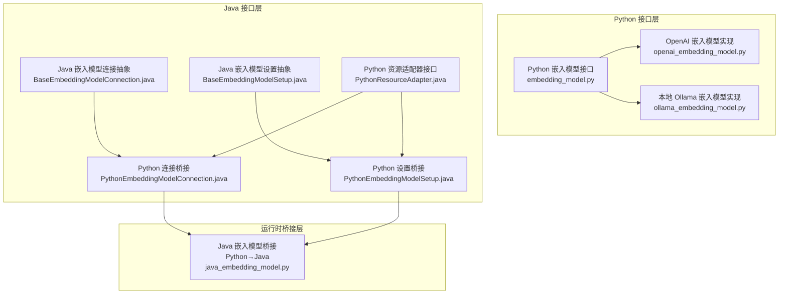
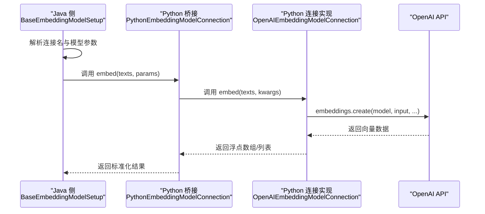
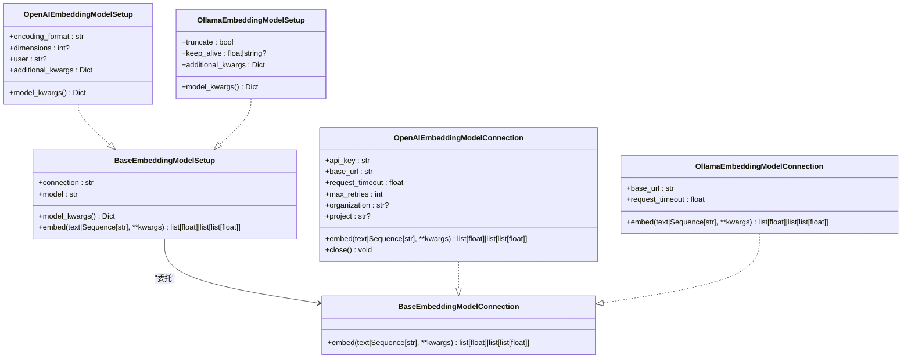
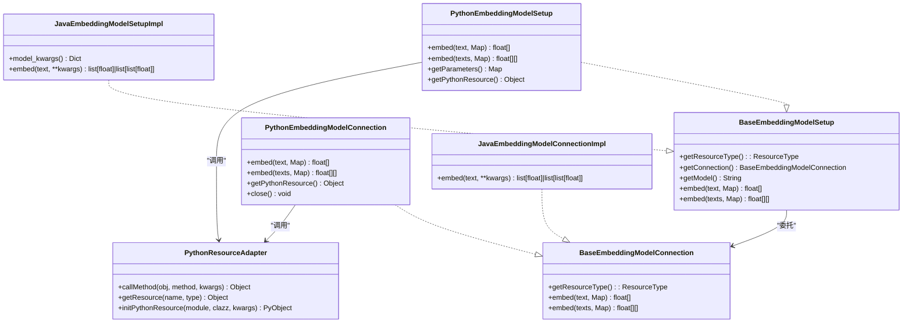

# 云端嵌入模型集成

<cite>
**本文引用的文件**   
- [Python 嵌入模型接口定义](file://python/flink_agents/api/embedding_models/embedding_model.py)
- [OpenAI 嵌入模型连接实现](file://python/flink_agents/integrations/embedding_models/openai_embedding_model.py)
- [本地 Ollama 嵌入模型连接实现](file://python/flink_agents/integrations/embedding_models/local/ollama_embedding_model.py)
- [Java 嵌入模型接口定义（抽象基类）](file://api/src/main/java/org/apache/flink/agents/api/embedding/model/BaseEmbeddingModelConnection.java)
- [Java 嵌入模型设置接口定义（抽象基类）](file://api/src/main/java/org/apache/flink/agents/api/embedding/model/BaseEmbeddingModelSetup.java)
- [Python 嵌入模型连接桥接（Java ↔ Python）](file://api/src/main/java/org/apache/flink/agents/api/embedding/model/python/PythonEmbeddingModelConnection.java)
- [Python 嵌入模型设置桥接（Java ↔ Python）](file://api/src/main/java/org/apache/flink/agents/api/embedding/model/python/PythonEmbeddingModelSetup.java)
- [Java ↔ Python 资源适配器接口](file://api/src/main/java/org/apache/flink/agents/api/resource/python/PythonResourceAdapter.java)
- [Java 嵌入模型桥接实现（Python → Java）](file://python/flink_agents/runtime/java/java_embedding_model.py)
- [OpenAI 嵌入模型单元测试](file://python/flink_agents/integrations/embedding_models/tests/test_openai_embedding_model.py)
- [端到端嵌入集成测试（Java）](file://e2e-test/flink-agents-end-to-end-tests-integration/src/test/java/org/apache/flink/agents/integration/test/EmbeddingIntegrationTest.java)
</cite>

## 目录
1. [简介](#简介)
2. [项目结构](#项目结构)
3. [核心组件](#核心组件)
4. [架构总览](#架构总览)
5. [组件详解](#组件详解)
6. [依赖关系分析](#依赖关系分析)
7. [性能与成本优化](#性能与成本优化)
8. [故障排除指南](#故障排除指南)
9. [结论](#结论)
10. [附录：完整集成示例与最佳实践](#附录完整集成示例与最佳实践)

## 简介
本文件面向在 Flink Agents 中集成云端嵌入模型（以 OpenAI 为例）的开发者，系统性说明 Python 层 OpenAI 嵌入模型的实现方式、参数配置、批量处理与自动扩展能力、错误处理与重试机制、成本控制策略，并提供从配置到运行的完整示例流程。同时，文档也解释了 Java 与 Python 之间的桥接机制，帮助读者理解跨语言资源管理与调用链路。

## 项目结构
围绕“云端嵌入模型”的关键代码分布在以下层次：
- Python 接口层：定义通用嵌入模型连接与设置抽象，以及 OpenAI/本地 Ollama 的具体实现。
- Java 接口层：定义资源类型、连接与设置抽象，以及 Java↔Python 桥接实现。
- 运行时桥接层：在 Python 中通过 Java 资源适配器调用 Java 嵌入模型，或直接调用 OpenAI 客户端。
- 测试与示例：提供单元测试与端到端测试，验证功能与集成路径。

**图表来源**
- [Python 嵌入模型接口定义](file://python/flink_agents/api/embedding_models/embedding_model.py#L27-L108)
- [OpenAI 嵌入模型连接实现](file://python/flink_agents/integrations/embedding_models/openai_embedding_model.py#L34-L142)
- [本地 Ollama 嵌入模型连接实现](file://python/flink_agents/integrations/embedding_models/local/ollama_embedding_model.py#L31-L98)
- [Java 嵌入模型接口定义（抽象基类）](file://api/src/main/java/org/apache/flink/agents/api/embedding/model/BaseEmbeddingModelConnection.java#L29-L84)
- [Java 嵌入模型设置接口定义（抽象基类）](file://api/src/main/java/org/apache/flink/agents/api/embedding/model/BaseEmbeddingModelSetup.java#L30-L114)
- [Python 嵌入模型连接桥接（Java ↔ Python）](file://api/src/main/java/org/apache/flink/agents/api/embedding/model/python/PythonEmbeddingModelConnection.java#L37-L133)
- [Python 嵌入模型设置桥接（Java ↔ Python）](file://api/src/main/java/org/apache/flink/agents/api/embedding/model/python/PythonEmbeddingModelSetup.java#L37-L132)
- [Java ↔ Python 资源适配器接口](file://api/src/main/java/org/apache/flink/agents/api/resource/python/PythonResourceAdapter.java#L32-L141)
- [Java 嵌入模型桥接实现（Python → Java）](file://python/flink_agents/runtime/java/java_embedding_model.py#L26-L112)

**章节来源**
- [Python 嵌入模型接口定义](file://python/flink_agents/api/embedding_models/embedding_model.py#L27-L108)
- [OpenAI 嵌入模型连接实现](file://python/flink_agents/integrations/embedding_models/openai_embedding_model.py#L34-L142)
- [本地 Ollama 嵌入模型连接实现](file://python/flink_agents/integrations/embedding_models/local/ollama_embedding_model.py#L31-L98)
- [Java 嵌入模型接口定义（抽象基类）](file://api/src/main/java/org/apache/flink/agents/api/embedding/model/BaseEmbeddingModelConnection.java#L29-L84)
- [Java 嵌入模型设置接口定义（抽象基类）](file://api/src/main/java/org/apache/flink/agents/api/embedding/model/BaseEmbeddingModelSetup.java#L30-L114)
- [Python 嵌入模型连接桥接（Java ↔ Python）](file://api/src/main/java/org/apache/flink/agents/api/embedding/model/python/PythonEmbeddingModelConnection.java#L37-L133)
- [Python 嵌入模型设置桥接（Java ↔ Python）](file://api/src/main/java/org/apache/flink/agents/api/embedding/model/python/PythonEmbeddingModelSetup.java#L37-L132)
- [Java ↔ Python 资源适配器接口](file://api/src/main/java/org/apache/flink/agents/api/resource/python/PythonResourceAdapter.java#L32-L141)
- [Java 嵌入模型桥接实现（Python → Java）](file://python/flink_agents/runtime/java/java_embedding_model.py#L26-L112)

## 核心组件
- Python 抽象接口
  - BaseEmbeddingModelConnection：定义统一的 embed 文本到向量的抽象方法，支持单文本与批量输入。
  - BaseEmbeddingModelSetup：封装连接名与模型名，负责合并参数并委托给连接执行。
- OpenAI 具体实现
  - OpenAIEmbeddingModelConnection：基于 OpenAI SDK 客户端发起请求，支持超时、重试、组织/项目等参数。
  - OpenAIEmbeddingModelSetup：集中管理 encoding_format、dimensions、user、additional_kwargs 等模型级参数。
- 本地 Ollama 实现（对比参考）
  - OllamaEmbeddingModelConnection/Setup：用于本地离线嵌入，便于开发与测试。
- Java 抽象与桥接
  - BaseEmbeddingModelConnection/Setup：定义资源类型、参数传递与连接解析。
  - PythonEmbeddingModelConnection/Setup：在 Java 中以 Python 对象形式暴露嵌入能力，通过 PythonResourceAdapter 调用。
  - JavaEmbeddingModelBridge：在 Python 中调用 Java 嵌入模型，形成双向桥接。

**章节来源**
- [Python 嵌入模型接口定义](file://python/flink_agents/api/embedding_models/embedding_model.py#L27-L108)
- [OpenAI 嵌入模型连接实现](file://python/flink_agents/integrations/embedding_models/openai_embedding_model.py#L34-L142)
- [OpenAI 嵌入模型设置桥接（Java ↔ Python）](file://api/src/main/java/org/apache/flink/agents/api/embedding/model/python/PythonEmbeddingModelSetup.java#L37-L132)
- [Java 嵌入模型桥接实现（Python → Java）](file://python/flink_agents/runtime/java/java_embedding_model.py#L26-L112)

## 架构总览
下图展示了从 Java 到 Python 再到 OpenAI 的典型调用链，以及参数与资源的传递关系。

**图表来源**
- [Java 嵌入模型设置接口定义（抽象基类）](file://api/src/main/java/org/apache/flink/agents/api/embedding/model/BaseEmbeddingModelSetup.java#L59-L112)
- [Python 嵌入模型连接桥接（Java ↔ Python）](file://api/src/main/java/org/apache/flink/agents/api/embedding/model/python/PythonEmbeddingModelConnection.java#L68-L121)
- [OpenAI 嵌入模型连接实现](file://python/flink_agents/integrations/embedding_models/openai_embedding_model.py#L114-L132)

## 组件详解

### Python 抽象接口与实现
- BaseEmbeddingModelConnection
  - 提供 embed(text|Sequence[str], **kwargs) 抽象，返回单个或批量向量。
  - 适合不同供应商（OpenAI、Ollama 等）的具体实现。
- BaseEmbeddingModelSetup
  - 通过连接名解析到具体连接实例，合并 model_kwargs 与调用参数后转发给连接。
- OpenAIEmbeddingModelConnection
  - 支持 api_key、base_url、request_timeout、max_retries、organization、project 等。
  - embed 方法提取 model、encoding_format、dimensions、user 等参数，调用 OpenAI SDK。
- OpenAIEmbeddingModelSetup
  - model_kwargs 合并 model、encoding_format、dimensions、user 及 additional_kwargs。
- OllamaEmbeddingModelConnection/Setup（对比参考）
  - 本地服务调用，便于离线测试与开发。

**图表来源**
- [Python 嵌入模型接口定义](file://python/flink_agents/api/embedding_models/embedding_model.py#L27-L108)
- [OpenAI 嵌入模型连接实现](file://python/flink_agents/integrations/embedding_models/openai_embedding_model.py#L34-L142)
- [OpenAI 嵌入模型设置桥接（Java ↔ Python）](file://api/src/main/java/org/apache/flink/agents/api/embedding/model/python/PythonEmbeddingModelSetup.java#L37-L132)
- [本地 Ollama 嵌入模型连接实现](file://python/flink_agents/integrations/embedding_models/local/ollama_embedding_model.py#L31-L98)

**章节来源**
- [Python 嵌入模型接口定义](file://python/flink_agents/api/embedding_models/embedding_model.py#L27-L108)
- [OpenAI 嵌入模型连接实现](file://python/flink_agents/integrations/embedding_models/openai_embedding_model.py#L34-L142)
- [本地 Ollama 嵌入模型连接实现](file://python/flink_agents/integrations/embedding_models/local/ollama_embedding_model.py#L31-L98)

### Java 抽象与桥接
- BaseEmbeddingModelConnection/Setup
  - 定义资源类型为 EMBEDDING_MODEL_CONNECTION 与 EMBEDDING_MODEL。
  - Setup 通过 getResource 解析连接，合并参数后调用连接的 embed。
- PythonEmbeddingModelConnection/Setup
  - 在 Java 中包装 Python 对象，通过 PythonResourceAdapter 调用 embed 并转换为 Java 数组。
- JavaEmbeddingModelBridge（Python → Java）
  - 在 Python 中直接调用 Java 嵌入模型对象，实现反向桥接。

**图表来源**
- [Java 嵌入模型接口定义（抽象基类）](file://api/src/main/java/org/apache/flink/agents/api/embedding/model/BaseEmbeddingModelConnection.java#L29-L84)
- [Java 嵌入模型设置接口定义（抽象基类）](file://api/src/main/java/org/apache/flink/agents/api/embedding/model/BaseEmbeddingModelSetup.java#L30-L114)
- [Python 嵌入模型连接桥接（Java ↔ Python）](file://api/src/main/java/org/apache/flink/agents/api/embedding/model/python/PythonEmbeddingModelConnection.java#L37-L133)
- [Python 嵌入模型设置桥接（Java ↔ Python）](file://api/src/main/java/org/apache/flink/agents/api/embedding/model/python/PythonEmbeddingModelSetup.java#L37-L132)
- [Java ↔ Python 资源适配器接口](file://api/src/main/java/org/apache/flink/agents/api/resource/python/PythonResourceAdapter.java#L32-L141)
- [Java 嵌入模型桥接实现（Python → Java）](file://python/flink_agents/runtime/java/java_embedding_model.py#L26-L112)

**章节来源**
- [Java 嵌入模型接口定义（抽象基类）](file://api/src/main/java/org/apache/flink/agents/api/embedding/model/BaseEmbeddingModelConnection.java#L29-L84)
- [Java 嵌入模型设置接口定义（抽象基类）](file://api/src/main/java/org/apache/flink/agents/api/embedding/model/BaseEmbeddingModelSetup.java#L30-L114)
- [Python 嵌入模型连接桥接（Java ↔ Python）](file://api/src/main/java/org/apache/flink/agents/api/embedding/model/python/PythonEmbeddingModelConnection.java#L37-L133)
- [Python 嵌入模型设置桥接（Java ↔ Python）](file://api/src/main/java/org/apache/flink/agents/api/embedding/model/python/PythonEmbeddingModelSetup.java#L37-L132)
- [Java ↔ Python 资源适配器接口](file://api/src/main/java/org/apache/flink/agents/api/resource/python/PythonResourceAdapter.java#L32-L141)
- [Java 嵌入模型桥接实现（Python → Java）](file://python/flink_agents/runtime/java/java_embedding_model.py#L26-L112)

### OpenAI 嵌入模型的参数与行为
- 连接参数
  - api_key：认证密钥
  - base_url：API 基础地址，默认 OpenAI 官方域名
  - request_timeout：请求超时
  - max_retries：最大重试次数
  - organization/project：可选的组织/项目标识
- 设置参数
  - model：嵌入模型名称
  - encoding_format：向量格式（float/base64）
  - dimensions：目标维度（部分模型支持）
  - user：用户标识，用于监控与风控
  - additional_kwargs：透传给底层 SDK 的额外参数
- 批量处理
  - embed 支持单文本与序列文本；OpenAI SDK 自动进行批量请求与分页，Python 层统一返回标准格式。

**章节来源**
- [OpenAI 嵌入模型连接实现](file://python/flink_agents/integrations/embedding_models/openai_embedding_model.py#L55-L76)
- [OpenAI 嵌入模型设置桥接（Java ↔ Python）](file://api/src/main/java/org/apache/flink/agents/api/embedding/model/python/PythonEmbeddingModelSetup.java#L166-L181)
- [OpenAI 嵌入模型连接实现](file://python/flink_agents/integrations/embedding_models/openai_embedding_model.py#L208-L224)

## 依赖关系分析
- 资源类型与解析
  - Java Setup 通过 ResourceDescriptor 获取 connection 与 model 参数，再通过 getResource 解析到具体连接实例。
- 跨语言调用
  - Java 侧通过 PythonResourceAdapter 调用 Python 对象的方法，Python 侧再调用 OpenAI SDK 或本地客户端。
- 参数合并与传递
  - Setup 的 model_kwargs 与调用时的 kwargs 合并，确保最终请求包含所有必要参数。

**图表来源**
- [Java 嵌入模型设置接口定义（抽象基类）](file://api/src/main/java/org/apache/flink/agents/api/embedding/model/BaseEmbeddingModelSetup.java#L59-L112)
- [Python 嵌入模型连接桥接（Java ↔ Python）](file://api/src/main/java/org/apache/flink/agents/api/embedding/model/python/PythonEmbeddingModelConnection.java#L68-L121)
- [Java ↔ Python 资源适配器接口](file://api/src/main/java/org/apache/flink/agents/api/resource/python/PythonResourceAdapter.java#L122-L141)
- [OpenAI 嵌入模型连接实现](file://python/flink_agents/integrations/embedding_models/openai_embedding_model.py#L114-L132)

**章节来源**
- [Java 嵌入模型设置接口定义（抽象基类）](file://api/src/main/java/org/apache/flink/agents/api/embedding/model/BaseEmbeddingModelSetup.java#L59-L112)
- [Python 嵌入模型连接桥接（Java ↔ Python）](file://api/src/main/java/org/apache/flink/agents/api/embedding/model/python/PythonEmbeddingModelConnection.java#L68-L121)
- [Java ↔ Python 资源适配器接口](file://api/src/main/java/org/apache/flink/agents/api/resource/python/PythonResourceAdapter.java#L122-L141)
- [OpenAI 嵌入模型连接实现](file://python/flink_agents/integrations/embedding_models/openai_embedding_model.py#L114-L132)

## 性能与成本优化
- 批量处理与分页
  - OpenAI SDK 在内部对输入进行批处理与分页，Python 层统一返回结果，减少网络往返。
- 超时与重试
  - 连接层支持 request_timeout 与 max_retries，避免长时间阻塞与抖动影响吞吐。
- 维度与编码格式
  - 使用 dimensions 与 encoding_format 控制输出大小与格式，平衡精度与带宽。
- 资源复用
  - 连接对象按需延迟初始化并在关闭时释放，降低资源占用。
- 成本控制建议
  - 优先选择合适模型与维度，避免不必要的高维向量。
  - 合理设置超时与重试，防止突发流量放大成本。
  - 在批处理场景中尽量合并请求，减少 API 调用次数。

**章节来源**
- [OpenAI 嵌入模型连接实现](file://python/flink_agents/integrations/embedding_models/openai_embedding_model.py#L29-L31)
- [OpenAI 嵌入模型连接实现](file://python/flink_agents/integrations/embedding_models/openai_embedding_model.py#L114-L132)
- [OpenAI 嵌入模型设置桥接（Java ↔ Python）](file://api/src/main/java/org/apache/flink/agents/api/embedding/model/python/PythonEmbeddingModelSetup.java#L170-L173)

## 故障排除指南
- 常见问题
  - API 密钥未配置或无效：检查 api_key 是否正确注入。
  - 请求超时：适当提高 request_timeout，检查网络连通性。
  - 模型不支持 dimensions：确认所选模型版本是否支持该参数。
  - 返回格式异常：核对 encoding_format 与预期一致。
- 错误处理与重试
  - 连接层提供 max_retries 与 request_timeout，建议在上层业务中结合指数退避策略。
  - 单元测试与端到端测试覆盖了基本调用路径，可作为回归参考。
- 资源清理
  - 连接关闭时会释放底层客户端，避免连接泄漏。

**章节来源**
- [OpenAI 嵌入模型连接实现](file://python/flink_agents/integrations/embedding_models/openai_embedding_model.py#L29-L31)
- [OpenAI 嵌入模型连接实现](file://python/flink_agents/integrations/embedding_models/openai_embedding_model.py#L135-L142)
- [OpenAI 嵌入模型单元测试](file://python/flink_agents/integrations/embedding_models/tests/test_openai_embedding_model.py#L32-L54)
- [端到端嵌入集成测试（Java）](file://e2e-test/flink-agents-end-to-end-tests-integration/src/test/java/org/apache/flink/agents/integration/test/EmbeddingIntegrationTest.java#L50-L108)

## 结论
通过统一的抽象接口与跨语言桥接，Flink Agents 将 OpenAI 嵌入模型无缝集成到流式处理管线中。OpenAI 实现提供了完善的参数化配置、批量处理与错误处理能力，配合合理的超时与重试策略，可在保证质量的同时有效控制成本。本地 Ollama 实现则为开发与测试提供了便捷替代方案。

## 附录：完整集成示例与最佳实践
- 快速开始（Python）
  - 创建 OpenAIEmbeddingModelConnection 并注册为资源，随后创建 OpenAIEmbeddingModelSetup，指定 connection 与 model。
  - 调用 embed(text|Sequence[str]) 即可获得向量结果。
- 最佳实践
  - 明确区分“连接配置”与“模型设置”，前者关注认证与网络，后者关注模型与输出格式。
  - 在批处理场景中合并请求，合理设置 dimensions 与 encoding_format。
  - 在生产环境启用适当的超时与重试，并记录埋点以便成本分析。
- 参考测试
  - 单测：验证连接与设置的基本行为。
  - 端到端：在真实环境中验证从数据流到嵌入生成的完整链路。

**章节来源**
- [OpenAI 嵌入模型连接实现](file://python/flink_agents/integrations/embedding_models/openai_embedding_model.py#L77-L96)
- [OpenAI 嵌入模型设置桥接（Java ↔ Python）](file://api/src/main/java/org/apache/flink/agents/api/embedding/model/python/PythonEmbeddingModelSetup.java#L183-L205)
- [OpenAI 嵌入模型单元测试](file://python/flink_agents/integrations/embedding_models/tests/test_openai_embedding_model.py#L32-L54)
- [端到端嵌入集成测试（Java）](file://e2e-test/flink-agents-end-to-end-tests-integration/src/test/java/org/apache/flink/agents/integration/test/EmbeddingIntegrationTest.java#L50-L108)