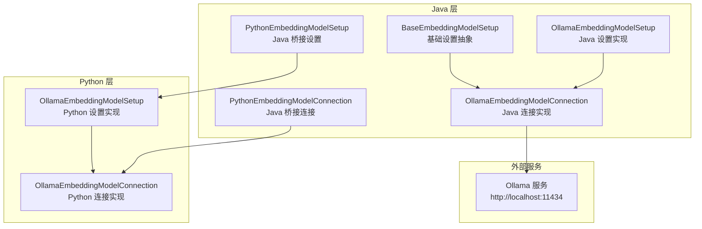
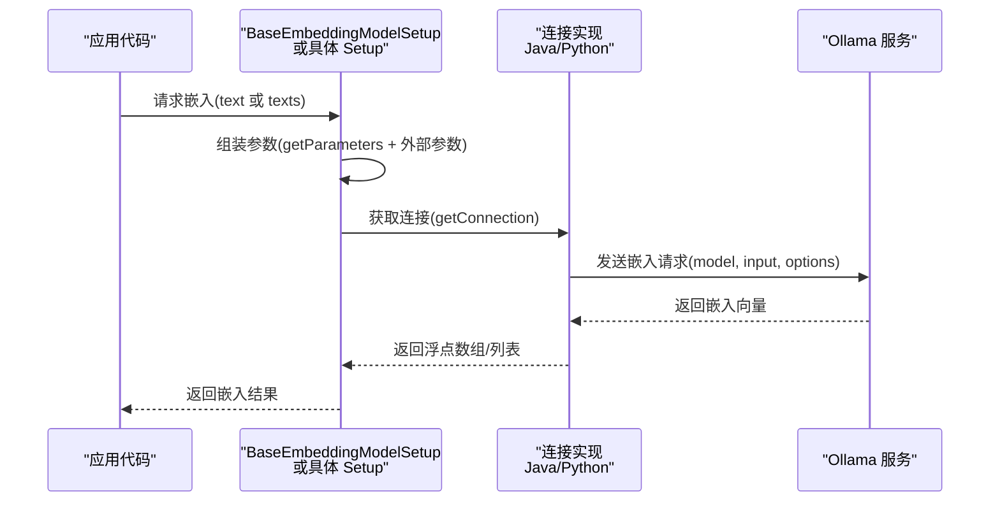
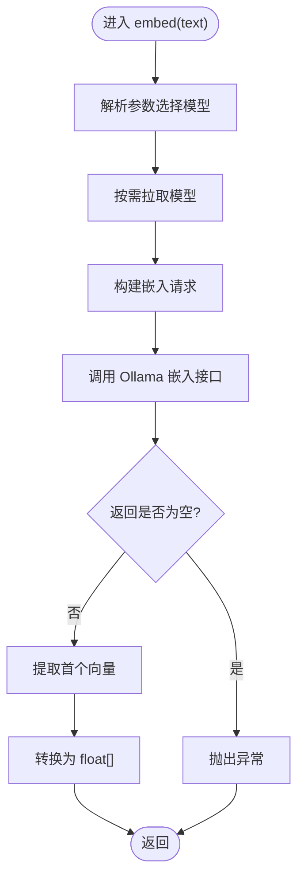
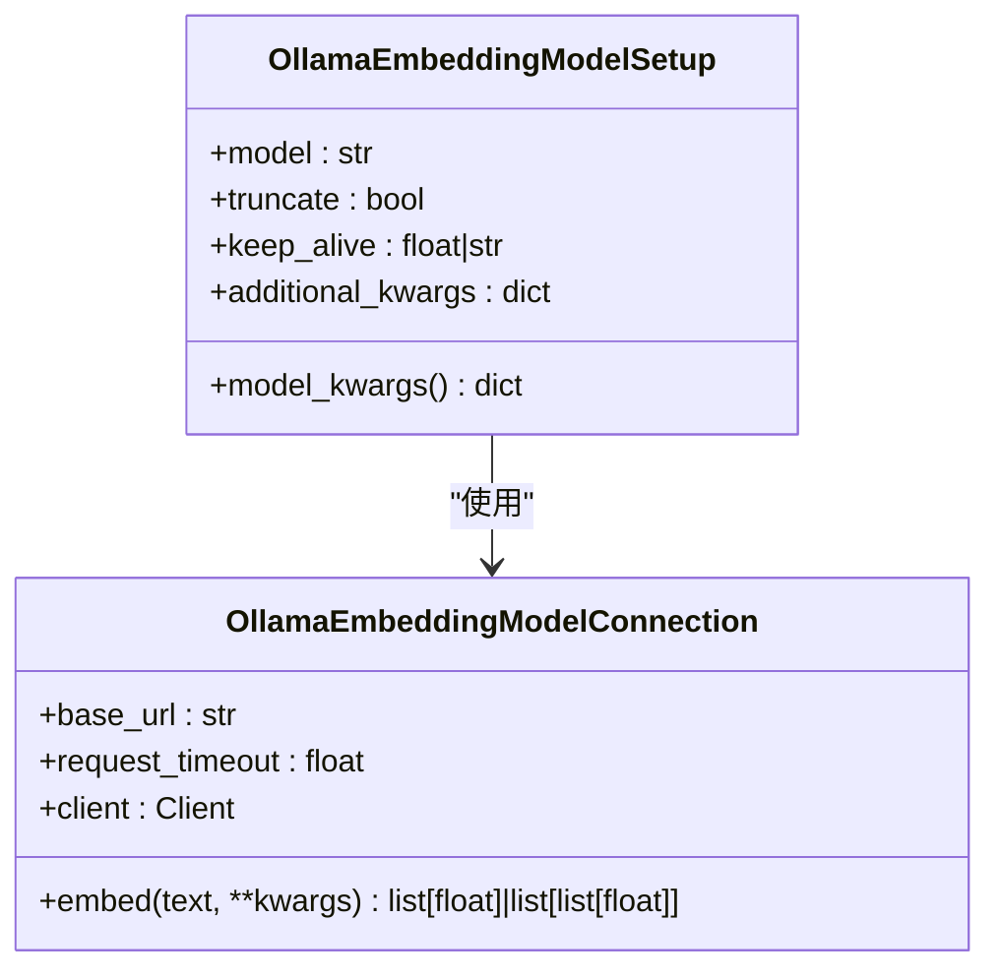
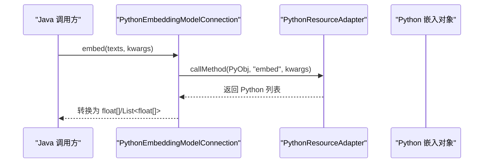
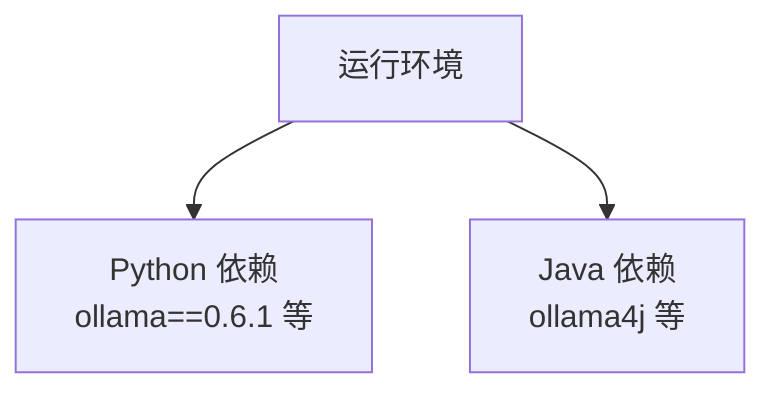

# 本地嵌入模型集成

<cite>
**本文引用的文件**
- [OllamaEmbeddingModelConnection.java](file://integrations/embedding-models/ollama/src/main/java/org/apache/flink/agents/integrations/embeddingmodels/ollama/OllamaEmbeddingModelConnection.java)
- [OllamaEmbeddingModelSetup.java](file://integrations/embedding-models/ollama/src/main/java/org/apache/flink/agents/integrations/embeddingmodels/ollama/OllamaEmbeddingModelSetup.java)
- [PythonEmbeddingModelConnection.java](file://api/src/main/java/org/apache/flink/agents/api/embedding/model/python/PythonEmbeddingModelConnection.java)
- [PythonEmbeddingModelSetup.java](file://api/src/main/java/org/apache/flink/agents/api/embedding/model/python/PythonEmbeddingModelSetup.java)
- [ollama_embedding_model.py](file://python/flink_agents/integrations/embedding_models/local/ollama_embedding_model.py)
- [BaseEmbeddingModelSetup.java](file://api/src/main/java/org/apache/flink/agents/api/embedding/model/BaseEmbeddingModelSetup.java)
- [EmbeddingIntegrationAgent.java](file://e2e-test/flink-agents-end-to-end-tests-integration/src/test/java/org/apache/flink/agents/integration/test/EmbeddingIntegrationAgent.java)
- [VectorStoreIntegrationAgent.java](file://e2e-test/flink-agents-end-to-end-tests-integration/src/test/java/org/apache/flink/agents/integration/test/VectorStoreIntegrationAgent.java)
- [ollama_pull_model.sh（e2e）](file://e2e-test/flink-agents-end-to-end-tests-integration/src/test/resources/ollama_pull_model.sh)
- [ollama_pull_model.sh（python e2e）](file://python/flink_agents/e2e_tests/scripts/ollama_pull_model.sh)
- [pyproject.toml](file://python/pyproject.toml)
- [README.md](file://README.md)
</cite>

## 目录
1. [简介](#简介)
2. [项目结构](#项目结构)
3. [核心组件](#核心组件)
4. [架构总览](#架构总览)
5. [组件详解](#组件详解)
6. [依赖关系分析](#依赖关系分析)
7. [性能考量](#性能考量)
8. [故障排除指南](#故障排除指南)
9. [结论](#结论)
10. [附录](#附录)

## 简介
本文件面向在本地环境中集成 Ollama 本地嵌入模型的用户，系统性介绍基于 Flink Agents 的 Java 与 Python 双栈实现方式，涵盖本地部署配置、模型下载与运行环境要求、优势与适用场景、安装配置与模型选择、性能特征、完整集成示例、与云端嵌入模型的对比以及部署维护与故障排除建议。

## 项目结构
围绕本地嵌入模型集成的关键模块分布于以下位置：
- Java 集成：位于 integrations/embedding-models/ollama 下，提供基于 ollama4j 客户端的连接与设置类。
- 跨语言桥接：位于 api/src/main/java/org/apache/flink/agents/api/embedding/model/python 下，提供 Java 与 Python 资源对象之间的桥接封装。
- Python 实现：位于 python/flink_agents/integrations/embedding_models/local 下，提供基于官方 ollama Python SDK 的连接与设置类。
- 测试与示例：位于 e2e-test 与 python/flink_agents/e2e_tests 中，包含资源脚本与端到端测试用例。
- 依赖声明：位于 python/pyproject.toml，声明了 ollama Python SDK 等依赖。

**图表来源**
- [OllamaEmbeddingModelConnection.java](file://integrations/embedding-models/ollama/src/main/java/org/apache/flink/agents/integrations/embeddingmodels/ollama/OllamaEmbeddingModelConnection.java#L35-L119)
- [OllamaEmbeddingModelSetup.java](file://integrations/embedding-models/ollama/src/main/java/org/apache/flink/agents/integrations/embeddingmodels/ollama/OllamaEmbeddingModelSetup.java#L31-L55)
- [PythonEmbeddingModelConnection.java](file://api/src/main/java/org/apache/flink/agents/api/embedding/model/python/PythonEmbeddingModelConnection.java#L43-L133)
- [PythonEmbeddingModelSetup.java](file://api/src/main/java/org/apache/flink/agents/api/embedding/model/python/PythonEmbeddingModelSetup.java#L43-L132)
- [ollama_embedding_model.py](file://python/flink_agents/integrations/embedding_models/local/ollama_embedding_model.py#L31-L168)

**章节来源**
- [OllamaEmbeddingModelConnection.java](file://integrations/embedding-models/ollama/src/main/java/org/apache/flink/agents/integrations/embeddingmodels/ollama/OllamaEmbeddingModelConnection.java#L35-L119)
- [PythonEmbeddingModelConnection.java](file://api/src/main/java/org/apache/flink/agents/api/embedding/model/python/PythonEmbeddingModelConnection.java#L43-L133)
- [ollama_embedding_model.py](file://python/flink_agents/integrations/embedding_models/local/ollama_embedding_model.py#L31-L168)

## 核心组件
- Java Ollama 嵌入模型连接与设置
  - 连接类负责通过 ollama4j 客户端与本地 Ollama 服务交互，支持单文本与批量文本嵌入生成，并在需要时自动拉取指定模型。
  - 设置类负责参数组装与连接获取，支持通过资源描述符传入 host、model 等参数。
- Python Ollama 嵌入模型连接与设置
  - 连接类基于官方 ollama Python SDK，提供 embed 接口，支持 model、truncate、keep_alive、options 等参数。
  - 设置类负责组装模型参数，支持 additional_kwargs 扩展传递给底层 SDK。
- Java 与 Python 桥接层
  - 通过 PythonEmbeddingModelConnection/Setup 将 Java 调用转发至 Python 对象，实现跨语言资源复用与统一接口。

**章节来源**
- [OllamaEmbeddingModelConnection.java](file://integrations/embedding-models/ollama/src/main/java/org/apache/flink/agents/integrations/embeddingmodels/ollama/OllamaEmbeddingModelConnection.java#L35-L119)
- [OllamaEmbeddingModelSetup.java](file://integrations/embedding-models/ollama/src/main/java/org/apache/flink/agents/integrations/embeddingmodels/ollama/OllamaEmbeddingModelSetup.java#L31-L55)
- [PythonEmbeddingModelConnection.java](file://api/src/main/java/org/apache/flink/agents/api/embedding/model/python/PythonEmbeddingModelConnection.java#L43-L133)
- [PythonEmbeddingModelSetup.java](file://api/src/main/java/org/apache/flink/agents/api/embedding/model/python/PythonEmbeddingModelSetup.java#L43-L132)
- [ollama_embedding_model.py](file://python/flink_agents/integrations/embedding_models/local/ollama_embedding_model.py#L31-L168)

## 架构总览
下图展示了从应用调用到本地 Ollama 服务的完整链路，包括 Java 与 Python 两种实现路径以及跨语言桥接。

**图表来源**
- [BaseEmbeddingModelSetup.java](file://api/src/main/java/org/apache/flink/agents/api/embedding/model/BaseEmbeddingModelSetup.java#L83-L87)
- [OllamaEmbeddingModelConnection.java](file://integrations/embedding-models/ollama/src/main/java/org/apache/flink/agents/integrations/embeddingmodels/ollama/OllamaEmbeddingModelConnection.java#L56-L83)
- [ollama_embedding_model.py](file://python/flink_agents/integrations/embedding_models/local/ollama_embedding_model.py#L80-L98)

## 组件详解

### Java Ollama 嵌入模型连接
- 默认主机与模型
  - 默认主机地址为本地 11434 端口；默认模型为 nomic-embed-text。
- 单文本嵌入流程
  - 根据参数选择模型，必要时拉取模型，构造请求并调用嵌入接口，提取第一个向量并转换为 float 数组。
- 批量文本嵌入流程
  - 同样根据参数选择模型，批量发送请求，校验返回向量数量与输入一致后逐个转换为 float 数组列表。
- 错误处理
  - 对空返回或异常进行包装抛出，便于上层捕获与记录。

**图表来源**
- [OllamaEmbeddingModelConnection.java](file://integrations/embedding-models/ollama/src/main/java/org/apache/flink/agents/integrations/embeddingmodels/ollama/OllamaEmbeddingModelConnection.java#L56-L83)

**章节来源**
- [OllamaEmbeddingModelConnection.java](file://integrations/embedding-models/ollama/src/main/java/org/apache/flink/agents/integrations/embeddingmodels/ollama/OllamaEmbeddingModelConnection.java#L35-L119)

### Java Ollama 嵌入模型设置
- 参数组装
  - 若设置了 model，则将其放入参数映射中，供连接层使用。
- 连接获取
  - 通过资源名称获取对应的连接实例，实现与连接层的解耦。

**章节来源**
- [OllamaEmbeddingModelSetup.java](file://integrations/embedding-models/ollama/src/main/java/org/apache/flink/agents/integrations/embeddingmodels/ollama/OllamaEmbeddingModelSetup.java#L31-L55)
- [BaseEmbeddingModelSetup.java](file://api/src/main/java/org/apache/flink/agents/api/embedding/model/BaseEmbeddingModelSetup.java#L59-L62)

### Python Ollama 嵌入模型连接
- 客户端初始化
  - 支持自定义 base_url 与 request_timeout，默认指向本地 11434 端口。
- 嵌入调用
  - 从 kwargs 中提取 model、keep_alive、truncate 等关键参数，其余参数作为 options 透传给 SDK。
  - 返回值统一为 list[float] 或 list[list[float]]，适配单文本与批量场景。

**图表来源**
- [ollama_embedding_model.py](file://python/flink_agents/integrations/embedding_models/local/ollama_embedding_model.py#L31-L168)

**章节来源**
- [ollama_embedding_model.py](file://python/flink_agents/integrations/embedding_models/local/ollama_embedding_model.py#L31-L168)

### Java 与 Python 桥接层
- PythonEmbeddingModelConnection/Setup
  - 在 Java 侧以 PythonResourceWrapper 形式持有 Python 对象句柄，通过 adapter.callMethod 调用 Python 方法。
  - 将返回的嵌入结果转换为 Java 的 float[] 或 List<float[]>，保证接口一致性。

**图表来源**
- [PythonEmbeddingModelConnection.java](file://api/src/main/java/org/apache/flink/agents/api/embedding/model/python/PythonEmbeddingModelConnection.java#L68-L121)
- [PythonEmbeddingModelSetup.java](file://api/src/main/java/org/apache/flink/agents/api/embedding/model/python/PythonEmbeddingModelSetup.java#L67-L120)

**章节来源**
- [PythonEmbeddingModelConnection.java](file://api/src/main/java/org/apache/flink/agents/api/embedding/model/python/PythonEmbeddingModelConnection.java#L43-L133)
- [PythonEmbeddingModelSetup.java](file://api/src/main/java/org/apache/flink/agents/api/embedding/model/python/PythonEmbeddingModelSetup.java#L43-L132)

## 依赖关系分析
- 运行环境与依赖
  - Python 环境：Python 3.10–3.11，依赖 ollama SDK（版本见 pyproject.toml）。
  - Java 环境：JDK 11，Maven，Unix-like 环境。
- 关键依赖
  - Python：ollama==0.6.1，pydantic，mcp 等。
  - Java：ollama4j 客户端（由 OllamaEmbeddingModelConnection 使用）。

**图表来源**
- [pyproject.toml](file://python/pyproject.toml#L44-L59)
- [README.md](file://README.md#L9-L16)

**章节来源**
- [pyproject.toml](file://python/pyproject.toml#L44-L59)
- [README.md](file://README.md#L9-L16)

## 性能考量
- 模型加载与常驻内存
  - Python 实现支持 keep_alive 参数，可控制模型在请求后的常驻时长，减少重复加载开销。
- 输入截断策略
  - Python 实现默认 truncate=True，避免超长文本导致的错误或性能退化。
- 批量处理
  - Java 与 Python 实现均支持批量文本嵌入，建议在数据规模较大时采用批量以提升吞吐。
- 超时与重试
  - Python 实现提供 request_timeout 控制请求超时；Java 实现通过 Ollama 客户端行为与网络配置影响整体耗时。

**章节来源**
- [ollama_embedding_model.py](file://python/flink_agents/integrations/embedding_models/local/ollama_embedding_model.py#L120-L132)
- [ollama_embedding_model.py](file://python/flink_agents/integrations/embedding_models/local/ollama_embedding_model.py#L80-L98)

## 故障排除指南
- 无法连接 Ollama 服务
  - 确认本地 11434 端口服务已启动；检查 host 配置是否正确。
  - 参考端到端脚本中的模型拉取命令，确保模型可用。
- 模型未找到或需下载
  - 使用端到端脚本中的 ollama pull 命令提前拉取所需模型（如 nomic-embed-text）。
- 嵌入结果为空或维度异常
  - 检查输入文本是否为空或过长；Python 端可启用 truncate；确认模型已成功拉取。
- 跨语言桥接异常
  - 确保 Python 嵌入对象已正确初始化并通过资源系统注册；检查返回值类型是否为列表。

**章节来源**
- [ollama_pull_model.sh（e2e）](file://e2e-test/flink-agents-end-to-end-tests-integration/src/test/resources/ollama_pull_model.sh#L19-L20)
- [ollama_pull_model.sh（python e2e）](file://python/flink_agents/e2e_tests/scripts/ollama_pull_model.sh#L20-L21)
- [OllamaEmbeddingModelConnection.java](file://integrations/embedding-models/ollama/src/main/java/org/apache/flink/agents/integrations/embeddingmodels/ollama/OllamaEmbeddingModelConnection.java#L72-L74)

## 结论
通过 Java 与 Python 双栈实现，Flink Agents 为本地嵌入模型提供了统一且可扩展的接入方式。Java 侧直接使用 ollama4j，Python 侧使用官方 SDK，二者均可与本地 Ollama 服务无缝协作。结合 keep_alive、truncate 等参数，可在隐私保护、离线可用与成本控制方面获得良好平衡。端到端测试与脚本进一步降低了部署与验证门槛。

## 附录

### 本地部署与运行环境要求
- 系统与工具
  - Unix-like 环境（Linux、macOS、WSL），Git，Maven，Java 11，Python 3.10–3.11。
- Ollama 服务
  - 默认监听 http://localhost:11434；可通过 host 参数调整。
- 模型准备
  - 使用端到端脚本或手动执行 ollama pull 拉取所需嵌入模型（如 nomic-embed-text）。

**章节来源**
- [README.md](file://README.md#L9-L16)
- [ollama_pull_model.sh（e2e）](file://e2e-test/flink-agents-end-to-end-tests-integration/src/test/resources/ollama_pull_model.sh#L19-L20)
- [ollama_pull_model.sh（python e2e）](file://python/flink_agents/e2e_tests/scripts/ollama_pull_model.sh#L20-L21)

### 安装与配置步骤（概览）
- Java 工程
  - 引入 ollama4j 客户端依赖（由连接类使用）。
  - 在资源描述符中配置 host 与 model。
- Python 工程
  - 安装 Python 包并确保 ollama SDK 版本满足要求。
  - 初始化 OllamaEmbeddingModelSetup 并传入 model、keep_alive、truncate 等参数。
- 资源注册与调用
  - 通过资源系统注册连接与设置，随后在业务逻辑中调用 embed 接口。

**章节来源**
- [pyproject.toml](file://python/pyproject.toml#L44-L59)
- [OllamaEmbeddingModelSetup.java](file://integrations/embedding-models/ollama/src/main/java/org/apache/flink/agents/integrations/embeddingmodels/ollama/OllamaEmbeddingModelSetup.java#L38-L48)
- [ollama_embedding_model.py](file://python/flink_agents/integrations/embedding_models/local/ollama_embedding_model.py#L100-L168)

### 模型选择与性能特征
- 模型选择
  - 示例中常用 nomic-embed-text；也可选择 all-minilm 等轻量模型以降低资源占用。
- 性能特征
  - keep_alive 控制模型常驻时间；truncate 控制超长文本处理策略；批量嵌入提升吞吐。

**章节来源**
- [VectorStoreIntegrationAgent.java](file://e2e-test/flink-agents-end-to-end-tests-integration/src/test/java/org/apache/flink/agents/integration/test/VectorStoreIntegrationAgent.java#L40-L40)
- [ollama_embedding_model.py](file://python/flink_agents/integrations/embedding_models/local/ollama_embedding_model.py#L120-L132)

### 与云端嵌入模型的对比与场景选择
- 隐私与合规
  - 本地嵌入模型完全在本地运行，适合对数据隐私有严格要求的场景。
- 离线可用性
  - 无需网络即可运行，适合网络不稳定或受限的环境。
- 成本控制
  - 无按次计费或 API 费用，长期使用更具成本优势。
- 云模型优势
  - 通常具备更丰富的模型族与更高的精度，但在隐私与成本方面需权衡。

[本节为概念性总结，不直接分析具体文件]

### 完整集成示例（端到端测试参考）
- Java 端
  - 通过资源描述符声明 Ollama 连接与设置，使用 BaseEmbeddingModelSetup.embed 生成嵌入。
- Python 端
  - 通过 ctx.get_resource 获取嵌入模型，调用 embed 接口生成单文本与批量嵌入。
- 验证逻辑
  - 计算向量范数与相似度，确保输出非空且数值合理。

**章节来源**
- [EmbeddingIntegrationAgent.java](file://e2e-test/flink-agents-end-to-end-tests-integration/src/test/java/org/apache/flink/agents/integration/test/EmbeddingIntegrationAgent.java#L132-L228)
- [EmbeddingIntegrationAgent.java](file://e2e-test/flink-agents-end-to-end-tests-integration/src/test/java/org/apache/flink/agents/integration/test/EmbeddingIntegrationAgent.java#L201-L218)