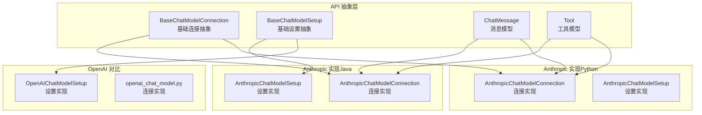
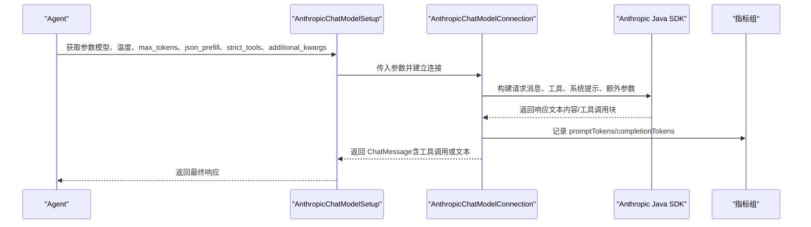
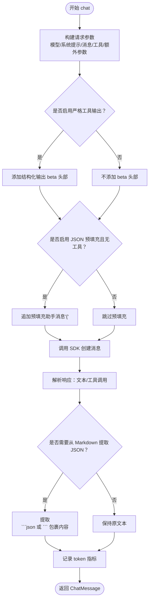
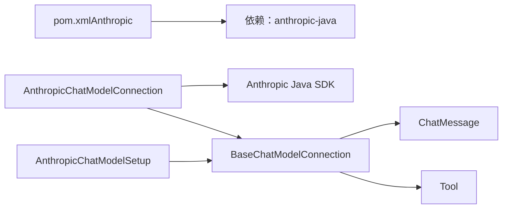

# Anthropic 集成

<cite>
**本文引用的文件**
- [AnthropicChatModelConnection.java](file://integrations/chat-models/anthropic/src/main/java/org/apache/flink/agents/integrations/chatmodels/anthropic/AnthropicChatModelConnection.java)
- [AnthropicChatModelSetup.java](file://integrations/chat-models/anthropic/src/main/java/org/apache/flink/agents/integrations/chatmodels/anthropic/AnthropicChatModelSetup.java)
- [anthropic_chat_model.py](file://python/flink_agents/integrations/chat_models/anthropic/anthropic_chat_model.py)
- [BaseChatModelConnection.java](file://api/src/main/java/org/apache/flink/agents/api/chat/model/BaseChatModelConnection.java)
- [BaseChatModelSetup.java](file://api/src/main/java/org/apache/flink/agents/api/chat/model/BaseChatModelSetup.java)
- [ChatMessage.java](file://api/src/main/java/org/apache/flink/agents/api/chat/messages/ChatMessage.java)
- [Tool.java](file://api/src/main/java/org/apache/flink/agents/api/tools/Tool.java)
- [OpenAIChatModelSetup.java](file://integrations/chat-models/openai/src/main/java/org/apache/flink/agents/integrations/chatmodels/openai/OpenAIChatModelSetup.java)
- [openai_chat_model.py](file://python/flink_agents/integrations/chat_models/openai/openai_chat_model.py)
- [pom.xml（Anthropic）](file://integrations/chat-models/anthropic/pom.xml)
</cite>

## 目录
1. [简介](#简介)
2. [项目结构](#项目结构)
3. [核心组件](#核心组件)
4. [架构总览](#架构总览)
5. [组件详解](#组件详解)
6. [依赖关系分析](#依赖关系分析)
7. [性能考量](#性能考量)
8. [故障排除指南](#故障排除指南)
9. [结论](#结论)
10. [附录：配置与示例](#附录配置与示例)

## 简介
本文件面向在 Flink Agents 中集成 Anthropic Claude 聊天模型的开发者，系统性介绍 AnthropicChatModel 的实现方式、参数配置、特性能力（如长上下文、推理与安全过滤）、与 OpenAI 的差异对比、迁移指南、性能优化与故障排除建议。文档同时提供完整的配置与使用示例路径，帮助快速落地。

## 项目结构
Flink Agents 将“模型接入”抽象为统一的资源体系：
- Java 层：通过 BaseChatModelConnection 与 BaseChatModelSetup 定义连接与设置接口，AnthropicChatModelConnection/AnthropicChatModelSetup 实现具体对接。
- Python 层：提供跨语言资源适配与工具转换，便于在 Python 环境中直接使用。
- API 抽象层：定义消息、工具、资源类型等通用模型，确保不同供应商实现的一致性。

图表来源
- [BaseChatModelConnection.java](file://api/src/main/java/org/apache/flink/agents/api/chat/model/BaseChatModelConnection.java#L32-L79)
- [BaseChatModelSetup.java](file://api/src/main/java/org/apache/flink/agents/api/chat/model/BaseChatModelSetup.java#L30-L128)
- [AnthropicChatModelConnection.java](file://integrations/chat-models/anthropic/src/main/java/org/apache/flink/agents/integrations/chatmodels/anthropic/AnthropicChatModelConnection.java#L81-L117)
- [AnthropicChatModelSetup.java](file://integrations/chat-models/anthropic/src/main/java/org/apache/flink/agents/integrations/chatmodels/anthropic/AnthropicChatModelSetup.java#L74-L124)
- [anthropic_chat_model.py](file://python/flink_agents/integrations/chat_models/anthropic/anthropic_chat_model.py#L113-L235)
- [OpenAIChatModelSetup.java](file://integrations/chat-models/openai/src/main/java/org/apache/flink/agents/integrations/chatmodels/openai/OpenAIChatModelSetup.java#L61-L127)
- [openai_chat_model.py](file://python/flink_agents/integrations/chat_models/openai/openai_chat_model.py#L41-L194)

章节来源
- [BaseChatModelConnection.java](file://api/src/main/java/org/apache/flink/agents/api/chat/model/BaseChatModelConnection.java#L32-L79)
- [BaseChatModelSetup.java](file://api/src/main/java/org/apache/flink/agents/api/chat/model/BaseChatModelSetup.java#L30-L128)
- [AnthropicChatModelConnection.java](file://integrations/chat-models/anthropic/src/main/java/org/apache/flink/agents/integrations/chatmodels/anthropic/AnthropicChatModelConnection.java#L81-L117)
- [AnthropicChatModelSetup.java](file://integrations/chat-models/anthropic/src/main/java/org/apache/flink/agents/integrations/chatmodels/anthropic/AnthropicChatModelSetup.java#L74-L124)
- [anthropic_chat_model.py](file://python/flink_agents/integrations/chat_models/anthropic/anthropic_chat_model.py#L113-L235)
- [OpenAIChatModelSetup.java](file://integrations/chat-models/openai/src/main/java/org/apache/flink/agents/integrations/chatmodels/openai/OpenAIChatModelSetup.java#L61-L127)
- [openai_chat_model.py](file://python/flink_agents/integrations/chat_models/openai/openai_chat_model.py#L41-L194)

## 核心组件
- AnthropicChatModelConnection（Java）
  - 负责与官方 Java SDK 交互，构建请求、处理响应、记录 Token 指标。
  - 支持工具调用、系统提示、温度、最大生成长度、JSON 预填充、严格工具输出等参数。
- AnthropicChatModelSetup（Java）
  - 提供 per-chat 参数装配，包括默认模型、温度、最大 tokens、JSON 预填充、严格工具等。
- AnthropicChatModelConnection（Python）
  - 提供 Python 端连接与消息/工具转换逻辑，支持 token 指标记录。
- AnthropicChatModelSetup（Python）
  - 提供 Python 端设置，包含默认模型、温度、最大 tokens 等。
- 基础抽象
  - BaseChatModelConnection/Setup：统一资源类型、参数合并、指标上报。
  - ChatMessage/Tool：统一的消息与工具模型。

章节来源
- [AnthropicChatModelConnection.java](file://integrations/chat-models/anthropic/src/main/java/org/apache/flink/agents/integrations/chatmodels/anthropic/AnthropicChatModelConnection.java#L81-L155)
- [AnthropicChatModelSetup.java](file://integrations/chat-models/anthropic/src/main/java/org/apache/flink/agents/integrations/chatmodels/anthropic/AnthropicChatModelSetup.java#L74-L152)
- [anthropic_chat_model.py](file://python/flink_agents/integrations/chat_models/anthropic/anthropic_chat_model.py#L113-L303)
- [BaseChatModelConnection.java](file://api/src/main/java/org/apache/flink/agents/api/chat/model/BaseChatModelConnection.java#L32-L79)
- [BaseChatModelSetup.java](file://api/src/main/java/org/apache/flink/agents/api/chat/model/BaseChatModelSetup.java#L30-L128)
- [ChatMessage.java](file://api/src/main/java/org/apache/flink/agents/api/chat/messages/ChatMessage.java#L29-L158)
- [Tool.java](file://api/src/main/java/org/apache/flink/agents/api/tools/Tool.java#L26-L70)

## 架构总览
下图展示了从 Agent 到模型服务的调用链路，以及 Anthropic 特有的参数与工具调用流程。

图表来源
- [BaseChatModelSetup.java](file://api/src/main/java/org/apache/flink/agents/api/chat/model/BaseChatModelSetup.java#L54-L101)
- [AnthropicChatModelConnection.java](file://integrations/chat-models/anthropic/src/main/java/org/apache/flink/agents/integrations/chatmodels/anthropic/AnthropicChatModelConnection.java#L119-L155)
- [anthropic_chat_model.py](file://python/flink_agents/integrations/chat_models/anthropic/anthropic_chat_model.py#L167-L226)

## 组件详解

### AnthropicChatModelConnection（Java）
- 关键职责
  - 解析连接参数：api_key、timeout、max_retries、model。
  - 构建请求：系统提示、用户/助手消息、工具定义、额外参数（top_k/top_p/stop_sequences）。
  - 工具调用：支持原生 tool_use 内容块与严格工具输出（beta 头部）。
  - JSON 预填充：当未启用工具时，可强制以 “{” 开头以引导 JSON 输出。
  - 响应解析：提取文本与 tool_use，必要时从 Markdown 代码块中抽取 JSON。
  - 指标记录：根据模型名与 usage 统计输入/输出 tokens。
- 特性
  - 严格工具输出：通过额外头部启用结构化输出。
  - JSON 预填充：与工具调用互斥，避免冲突。
  - 系统提示：独立的 system 文本块。
  - 额外参数透传：支持 top_k、top_p、stop_sequences 等。

图表来源
- [AnthropicChatModelConnection.java](file://integrations/chat-models/anthropic/src/main/java/org/apache/flink/agents/integrations/chatmodels/anthropic/AnthropicChatModelConnection.java#L157-L233)
- [AnthropicChatModelConnection.java](file://integrations/chat-models/anthropic/src/main/java/org/apache/flink/agents/integrations/chatmodels/anthropic/AnthropicChatModelConnection.java#L366-L421)
- [AnthropicChatModelConnection.java](file://integrations/chat-models/anthropic/src/main/java/org/apache/flink/agents/integrations/chatmodels/anthropic/AnthropicChatModelConnection.java#L434-L463)

章节来源
- [AnthropicChatModelConnection.java](file://integrations/chat-models/anthropic/src/main/java/org/apache/flink/agents/integrations/chatmodels/anthropic/AnthropicChatModelConnection.java#L81-L155)
- [AnthropicChatModelConnection.java](file://integrations/chat-models/anthropic/src/main/java/org/apache/flink/agents/integrations/chatmodels/anthropic/AnthropicChatModelConnection.java#L157-L233)
- [AnthropicChatModelConnection.java](file://integrations/chat-models/anthropic/src/main/java/org/apache/flink/agents/integrations/chatmodels/anthropic/AnthropicChatModelConnection.java#L366-L421)
- [AnthropicChatModelConnection.java](file://integrations/chat-models/anthropic/src/main/java/org/apache/flink/agents/integrations/chatmodels/anthropic/AnthropicChatModelConnection.java#L434-L463)

### AnthropicChatModelSetup（Java）
- 默认值与校验
  - 默认模型：claude-sonnet-4-20250514
  - 温度：0.0–1.0，默认 0.1
  - 最大 tokens：>0，默认 1024
  - JSON 预填充：默认 true
  - 严格工具：默认 false
- 参数装配
  - 合并用户传入参数与默认参数，支持 additional_kwargs 透传。
  - 可绑定工具名称列表，由连接层转换为工具定义。

章节来源
- [AnthropicChatModelSetup.java](file://integrations/chat-models/anthropic/src/main/java/org/apache/flink/agents/integrations/chatmodels/anthropic/AnthropicChatModelSetup.java#L74-L152)

### AnthropicChatModelConnection（Python）
- 连接与客户端
  - 使用 Anthropic Python SDK，支持 api_key、max_retries、timeout。
  - 可复用客户端以提升稳定性。
- 消息与工具转换
  - 将 ChatMessage 转换为 Anthropic 的 MessageParam/TextBlockParam。
  - 工具转换为 ToolParam，支持描述长度检查。
- 响应处理
  - 若 stop_reason 为 tool_use，则提取 tool_use 内容块为工具调用；否则返回文本。
  - 记录 token 指标（promptTokens/completionTokens）。

章节来源
- [anthropic_chat_model.py](file://python/flink_agents/integrations/chat_models/anthropic/anthropic_chat_model.py#L113-L235)
- [anthropic_chat_model.py](file://python/flink_agents/integrations/chat_models/anthropic/anthropic_chat_model.py#L35-L49)
- [anthropic_chat_model.py](file://python/flink_agents/integrations/chat_models/anthropic/anthropic_chat_model.py#L52-L81)
- [anthropic_chat_model.py](file://python/flink_agents/integrations/chat_models/anthropic/anthropic_chat_model.py#L242-L303)

### AnthropicChatModelSetup（Python）
- 默认值
  - 模型：claude-sonnet-4-20250514
  - 最大 tokens：1024
  - 温度：0.1
- 参数装配
  - 通过 model_kwargs 汇总模型相关参数。

章节来源
- [anthropic_chat_model.py](file://python/flink_agents/integrations/chat_models/anthropic/anthropic_chat_model.py#L242-L303)

### 与 OpenAI 的差异对比
- 参数范围与默认值
  - 温度范围：Anthropic 0.0–1.0；OpenAI 通常 0.0–2.0。
  - 默认模型：Anthropic 默认 claude-sonnet-4-20250514；OpenAI 默认 gpt-3.5-turbo。
  - 严格工具：Anthropic 通过 beta 头部启用结构化输出；OpenAI 通过 function schema 的 strict 字段控制。
- 工具调用
  - Anthropic：原生 tool_use 内容块；支持额外 beta 头部。
  - OpenAI：function 调用，支持 strict 与 additionalProperties 控制。
- 额外参数
  - Anthropic：top_k、top_p、stop_sequences 作为额外参数透传。
  - OpenAI：logprobs/top_logprobs、reasoning_effort 等。

章节来源
- [AnthropicChatModelSetup.java](file://integrations/chat-models/anthropic/src/main/java/org/apache/flink/agents/integrations/chatmodels/anthropic/AnthropicChatModelSetup.java#L91-L104)
- [OpenAIChatModelSetup.java](file://integrations/chat-models/openai/src/main/java/org/apache/flink/agents/integrations/chatmodels/openai/OpenAIChatModelSetup.java#L80-L115)
- [anthropic_chat_model.py](file://python/flink_agents/integrations/chat_models/anthropic/anthropic_chat_model.py#L167-L188)
- [openai_chat_model.py](file://python/flink_agents/integrations/chat_models/openai/openai_chat_model.py#L137-L185)

## 依赖关系分析
- 依赖 SDK
  - Java：com.anthropic:anthropic-java
  - Python：anthropic
- 与 API 抽象层耦合
  - 通过 BaseChatModelConnection/Setup 统一资源类型与参数传递。
- 与消息/工具模型耦合
  - ChatMessage/Tool 作为输入输出载体，保证跨供应商一致性。

图表来源
- [pom.xml（Anthropic）](file://integrations/chat-models/anthropic/pom.xml#L34-L45)
- [AnthropicChatModelConnection.java](file://integrations/chat-models/anthropic/src/main/java/org/apache/flink/agents/integrations/chatmodels/anthropic/AnthropicChatModelConnection.java#L81-L117)
- [BaseChatModelConnection.java](file://api/src/main/java/org/apache/flink/agents/api/chat/model/BaseChatModelConnection.java#L32-L79)
- [ChatMessage.java](file://api/src/main/java/org/apache/flink/agents/api/chat/messages/ChatMessage.java#L29-L158)
- [Tool.java](file://api/src/main/java/org/apache/flink/agents/api/tools/Tool.java#L26-L70)

章节来源
- [pom.xml（Anthropic）](file://integrations/chat-models/anthropic/pom.xml#L34-L45)
- [AnthropicChatModelConnection.java](file://integrations/chat-models/anthropic/src/main/java/org/apache/flink/agents/integrations/chatmodels/anthropic/AnthropicChatModelConnection.java#L81-L117)
- [BaseChatModelConnection.java](file://api/src/main/java/org/apache/flink/agents/api/chat/model/BaseChatModelConnection.java#L32-L79)
- [ChatMessage.java](file://api/src/main/java/org/apache/flink/agents/api/chat/messages/ChatMessage.java#L29-L158)
- [Tool.java](file://api/src/main/java/org/apache/flink/agents/api/tools/Tool.java#L26-L70)

## 性能考量
- 连接与重试
  - 设置合理的超时与最大重试次数，避免长时间阻塞。
  - Java 连接器支持连接关闭，释放底层资源。
- 工具调用与 JSON 预填充
  - 当存在工具时禁用 JSON 预填充，避免与原生工具调用冲突。
  - 严格工具输出可提升结构化数据质量，但需配合 schema 设计。
- 指标监控
  - 自动记录 promptTokens/completionTokens，便于成本与性能分析。
- Python 客户端复用
  - Python 连接器支持复用客户端，减少握手开销；在高并发场景可考虑关闭复用以提升稳定性。

章节来源
- [AnthropicChatModelConnection.java](file://integrations/chat-models/anthropic/src/main/java/org/apache/flink/agents/integrations/chatmodels/anthropic/AnthropicChatModelConnection.java#L89-L112)
- [AnthropicChatModelConnection.java](file://integrations/chat-models/anthropic/src/main/java/org/apache/flink/agents/integrations/chatmodels/anthropic/AnthropicChatModelConnection.java#L114-L117)
- [anthropic_chat_model.py](file://python/flink_agents/integrations/chat_models/anthropic/anthropic_chat_model.py#L141-L165)
- [anthropic_chat_model.py](file://python/flink_agents/integrations/chat_models/anthropic/anthropic_chat_model.py#L228-L235)

## 故障排除指南
- 常见错误与定位
  - 缺少 API Key：初始化阶段会校验 api_key 是否为空。
  - 角色不支持：仅支持 USER/ASSISTANT/TOOL，其他角色会抛出异常。
  - 工具调用缺失外部 ID：TOOL 消息必须包含 externalId。
  - 工具调用缺少 original_id：助手消息中的 tool_use 必须包含 original_id。
  - 响应无内容：若响应不含 content，会抛出异常。
- 建议排查步骤
  - 检查连接参数（api_key、timeout、max_retries、model）。
  - 确认消息角色与工具调用字段完整性。
  - 查看响应是否被包装在 Markdown 代码块中，必要时启用 JSON 预填充或解析逻辑。
  - 关注 SDK 返回的 usage 与指标，核对输入/输出 tokens。
- 相关实现位置
  - 参数校验与异常抛出：连接器初始化与消息转换。
  - 响应解析与 JSON 提取：响应解析与 Markdown 提取逻辑。

章节来源
- [AnthropicChatModelConnection.java](file://integrations/chat-models/anthropic/src/main/java/org/apache/flink/agents/integrations/chatmodels/anthropic/AnthropicChatModelConnection.java#L93-L96)
- [AnthropicChatModelConnection.java](file://integrations/chat-models/anthropic/src/main/java/org/apache/flink/agents/integrations/chatmodels/anthropic/AnthropicChatModelConnection.java#L272-L276)
- [AnthropicChatModelConnection.java](file://integrations/chat-models/anthropic/src/main/java/org/apache/flink/agents/integrations/chatmodels/anthropic/AnthropicChatModelConnection.java#L366-L370)
- [AnthropicChatModelConnection.java](file://integrations/chat-models/anthropic/src/main/java/org/apache/flink/agents/integrations/chatmodels/anthropic/AnthropicChatModelConnection.java#L434-L463)

## 结论
Anthropic 集成在 Flink Agents 中提供了清晰的抽象与一致的使用体验。通过连接与设置分离、严格的参数校验与响应解析、以及完善的指标记录，开发者可以高效地在 Java 与 Python 环境中使用 Claude 模型进行对话与工具调用。与 OpenAI 的差异主要体现在参数范围、工具调用机制与额外参数上，迁移时需关注这些差异点。

## 附录：配置与示例
以下为关键配置项与示例路径，便于快速上手。

- Java 连接器参数
  - api_key（必填）
  - timeout（可选，秒）
  - max_retries（可选）
  - model（可选，默认 claude-sonnet-4-20250514）
- Java 设置器参数
  - connection（必填，连接资源名）
  - model（可选，默认 claude-sonnet-4-20250514）
  - temperature（0.0–1.0，默认 0.1）
  - max_tokens（>0，默认 1024）
  - json_prefill（布尔，默认 true）
  - strict_tools（布尔，默认 false）
  - tools（可选，工具名称列表）
  - additional_kwargs（可选，透传参数）
- Python 连接器参数
  - api_key（必填）
  - max_retries（默认 3）
  - timeout（默认 60.0）
- Python 设置器参数
  - connection（必填）
  - model（默认 claude-sonnet-4-20250514）
  - max_tokens（默认 1024）
  - temperature（默认 0.1）

示例路径（请参考源码文件以获取完整示例）：
- Java 设置器示例（参数与默认值说明）
  - [AnthropicChatModelSetup.java](file://integrations/chat-models/anthropic/src/main/java/org/apache/flink/agents/integrations/chatmodels/anthropic/AnthropicChatModelSetup.java#L53-L72)
- Java 连接器示例（参数与行为说明）
  - [AnthropicChatModelConnection.java](file://integrations/chat-models/anthropic/src/main/java/org/apache/flink/agents/integrations/chatmodels/anthropic/AnthropicChatModelConnection.java#L55-L80)
- Python 连接器与设置器示例
  - [anthropic_chat_model.py](file://python/flink_agents/integrations/chat_models/anthropic/anthropic_chat_model.py#L113-L303)

章节来源
- [AnthropicChatModelSetup.java](file://integrations/chat-models/anthropic/src/main/java/org/apache/flink/agents/integrations/chatmodels/anthropic/AnthropicChatModelSetup.java#L31-L72)
- [AnthropicChatModelConnection.java](file://integrations/chat-models/anthropic/src/main/java/org/apache/flink/agents/integrations/chatmodels/anthropic/AnthropicChatModelConnection.java#L55-L80)
- [anthropic_chat_model.py](file://python/flink_agents/integrations/chat_models/anthropic/anthropic_chat_model.py#L113-L303)