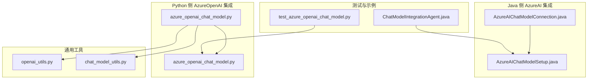
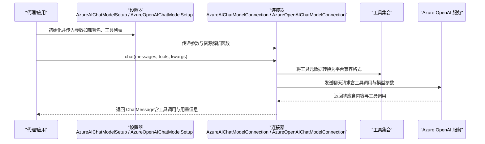
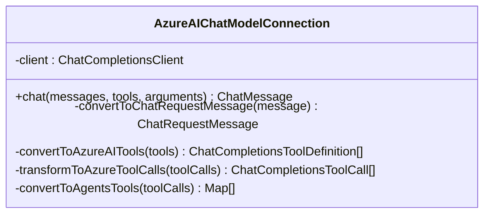
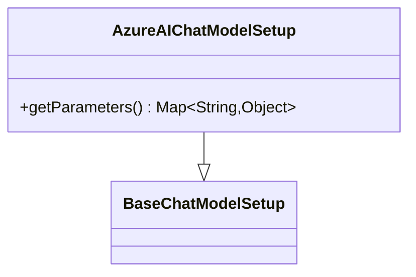
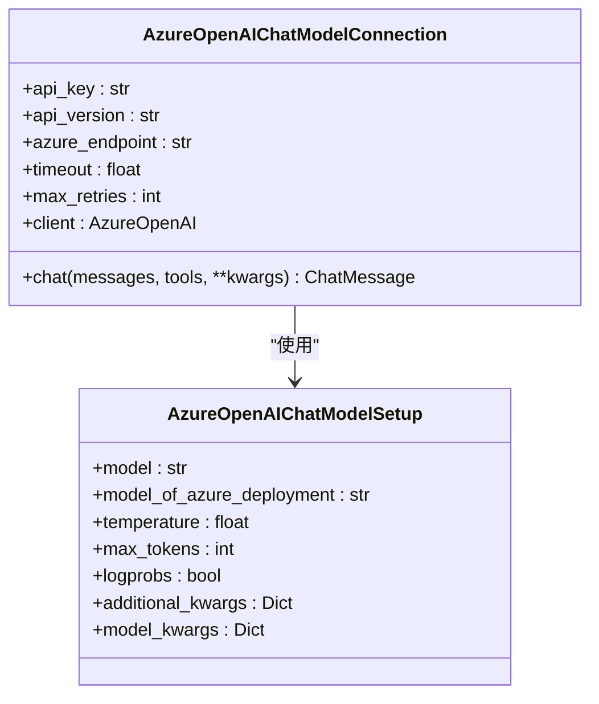
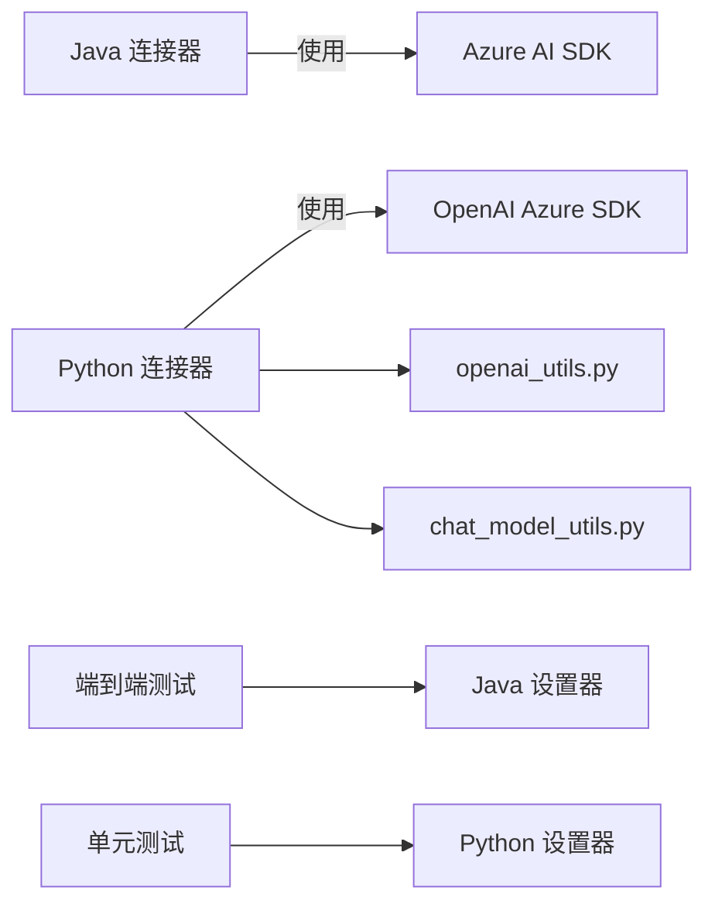

# Azure OpenAI 集成

<cite>
**本文引用的文件**
- [AzureAIChatModelConnection.java](file://integrations/chat-models/azureai/src/main/java/org/apache/flink/agents/integrations/chatmodels/azureai/AzureAIChatModelConnection.java)
- [AzureAIChatModelSetup.java](file://integrations/chat-models/azureai/src/main/java/org/apache/flink/agents/integrations/chatmodels/azureai/AzureAIChatModelSetup.java)
- [azure_openai_chat_model.py](file://python/flink_agents/integrations/chat_models/azure/azure_openai_chat_model.py)
- [test_azure_openai_chat_model.py](file://python/flink_agents/integrations/chat_models/azure/tests/test_azure_openai_chat_model.py)
- [openai_utils.py](file://python/flink_agents/integrations/chat_models/openai/openai_utils.py)
- [chat_model_utils.py](file://python/flink_agents/integrations/chat_models/chat_model_utils.py)
- [ChatModelIntegrationAgent.java](file://e2e-test/flink-agents-end-to-end-tests-integration/src/test/java/org/apache/flink/agents/integration/test/ChatModelIntegrationAgent.java)
</cite>

## 目录
1. [简介](#简介)
2. [项目结构](#项目结构)
3. [核心组件](#核心组件)
4. [架构总览](#架构总览)
5. [组件详解](#组件详解)
6. [依赖关系分析](#依赖关系分析)
7. [性能与成本](#性能与成本)
8. [故障排查](#故障排查)
9. [结论](#结论)
10. [附录：完整集成示例](#附录完整集成示例)

## 简介
本文件面向在 Azure 环境中集成 OpenAI 聊天模型的用户与工程师，系统性说明两种 Azure OpenAI 实现路径：
- Java 侧：基于 Azure AI Chat Completions SDK 的连接器（AzureAIChatModelConnection）与设置器（AzureAIChatModelSetup）
- Python 侧：基于 OpenAI 官方 SDK 的 AzureOpenAIChatModelConnection 与 AzureOpenAIChatModelSetup

文档重点覆盖：
- Azure 认证配置与资源端点设置
- 部署名称（Azure Deployment）与模型名称管理
- 与标准 OpenAI API 的差异与迁移注意事项
- 企业级安全、合规性与多区域部署建议
- 定价模式、配额管理与成本控制策略
- 完整集成示例与运维最佳实践

## 项目结构
与 Azure OpenAI 集成直接相关的模块分布如下：
- Java 侧集成：integrations/chat-models/azureai 下的连接器与设置器
- Python 侧集成：python/flink_agents/integrations/chat_models/azure 下的连接器与设置器
- 工具与消息转换：openai_utils.py、chat_model_utils.py
- 端到端测试：e2e-test 中对 AZURE 提供商的集成用例

图表来源
- [AzureAIChatModelConnection.java](file://integrations/chat-models/azureai/src/main/java/org/apache/flink/agents/integrations/chatmodels/azureai/AzureAIChatModelConnection.java#L63-L90)
- [AzureAIChatModelSetup.java](file://integrations/chat-models/azureai/src/main/java/org/apache/flink/agents/integrations/chatmodels/azureai/AzureAIChatModelSetup.java#L51-L66)
- [azure_openai_chat_model.py](file://python/flink_agents/integrations/chat_models/azure/azure_openai_chat_model.py#L36-L156)
- [openai_utils.py](file://python/flink_agents/integrations/chat_models/openai/openai_utils.py#L124-L223)
- [chat_model_utils.py](file://python/flink_agents/integrations/chat_models/chat_model_utils.py#L23-L41)
- [ChatModelIntegrationAgent.java](file://e2e-test/flink-agents-end-to-end-tests-integration/src/test/java/org/apache/flink/agents/integration/test/ChatModelIntegrationAgent.java#L112-L119)
- [test_azure_openai_chat_model.py](file://python/flink_agents/integrations/chat_models/azure/tests/test_azure_openai_chat_model.py#L36-L108)

章节来源
- [AzureAIChatModelConnection.java](file://integrations/chat-models/azureai/src/main/java/org/apache/flink/agents/integrations/chatmodels/azureai/AzureAIChatModelConnection.java#L1-L234)
- [AzureAIChatModelSetup.java](file://integrations/chat-models/azureai/src/main/java/org/apache/flink/agents/integrations/chatmodels/azureai/AzureAIChatModelSetup.java#L1-L67)
- [azure_openai_chat_model.py](file://python/flink_agents/integrations/chat_models/azure/azure_openai_chat_model.py#L1-L261)
- [openai_utils.py](file://python/flink_agents/integrations/chat_models/openai/openai_utils.py#L1-L223)
- [chat_model_utils.py](file://python/flink_agents/integrations/chat_models/chat_model_utils.py#L1-L41)
- [ChatModelIntegrationAgent.java](file://e2e-test/flink-agents-end-to-end-tests-integration/src/test/java/org/apache/flink/agents/integration/test/ChatModelIntegrationAgent.java#L103-L125)
- [test_azure_openai_chat_model.py](file://python/flink_agents/integrations/chat_models/azure/tests/test_azure_openai_chat_model.py#L1-L109)

## 核心组件
- Java 侧 AzureAI 连接器
  - 负责通过 Azure AI Chat Completions SDK 建立认证与客户端，并执行聊天请求；支持工具函数调用的双向转换。
- Java 侧 AzureAI 设置器
  - 负责将模型参数（如 model 名称）打包为调用参数。
- Python 侧 AzureOpenAI 连接器
  - 负责通过 OpenAI 官方 SDK 的 AzureOpenAI 客户端进行聊天请求；支持工具函数调用与令牌用量统计。
- Python 侧 AzureOpenAI 设置器
  - 负责将部署名、温度、最大令牌数等参数打包为调用参数。
- 通用工具
  - openai_utils.py：负责消息格式转换与工具调用格式转换
  - chat_model_utils.py：负责将工具元数据转换为 OpenAI 兼容的函数规范

章节来源
- [AzureAIChatModelConnection.java](file://integrations/chat-models/azureai/src/main/java/org/apache/flink/agents/integrations/chatmodels/azureai/AzureAIChatModelConnection.java#L63-L205)
- [AzureAIChatModelSetup.java](file://integrations/chat-models/azureai/src/main/java/org/apache/flink/agents/integrations/chatmodels/azureai/AzureAIChatModelSetup.java#L51-L66)
- [azure_openai_chat_model.py](file://python/flink_agents/integrations/chat_models/azure/azure_openai_chat_model.py#L36-L261)
- [openai_utils.py](file://python/flink_agents/integrations/chat_models/openai/openai_utils.py#L124-L223)
- [chat_model_utils.py](file://python/flink_agents/integrations/chat_models/chat_model_utils.py#L23-L41)

## 架构总览
下图展示了 Java 与 Python 两套 Azure OpenAI 集成在调用链路中的位置与交互关系。

图表来源
- [AzureAIChatModelConnection.java](file://integrations/chat-models/azureai/src/main/java/org/apache/flink/agents/integrations/chatmodels/azureai/AzureAIChatModelConnection.java#L164-L205)
- [AzureAIChatModelSetup.java](file://integrations/chat-models/azureai/src/main/java/org/apache/flink/agents/integrations/chatmodels/azureai/AzureAIChatModelSetup.java#L61-L65)
- [azure_openai_chat_model.py](file://python/flink_agents/integrations/chat_models/azure/azure_openai_chat_model.py#L109-L156)
- [openai_utils.py](file://python/flink_agents/integrations/chat_models/openai/openai_utils.py#L124-L223)

## 组件详解

### Java 侧 AzureAI 连接器（AzureAIChatModelConnection）
- 认证与客户端
  - 使用 endpoint 与 apiKey 构建 ChatCompletionsClient
  - 不支持工具时自动忽略工具参数
- 消息与工具映射
  - 将框架内的 ChatMessage 映射为 Azure AI 的系统/用户/助手/工具消息
  - 将工具调用在框架内部与 Azure 格式之间双向转换
- 参数与调用
  - 从 arguments 中读取 model 名称作为 Azure 模型部署名
  - 支持记录令牌用量（promptTokens、completionTokens）

图表来源
- [AzureAIChatModelConnection.java](file://integrations/chat-models/azureai/src/main/java/org/apache/flink/agents/integrations/chatmodels/azureai/AzureAIChatModelConnection.java#L63-L234)

章节来源
- [AzureAIChatModelConnection.java](file://integrations/chat-models/azureai/src/main/java/org/apache/flink/agents/integrations/chatmodels/azureai/AzureAIChatModelConnection.java#L63-L90)
- [AzureAIChatModelConnection.java](file://integrations/chat-models/azureai/src/main/java/org/apache/flink/agents/integrations/chatmodels/azureai/AzureAIChatModelConnection.java#L114-L162)
- [AzureAIChatModelConnection.java](file://integrations/chat-models/azureai/src/main/java/org/apache/flink/agents/integrations/chatmodels/azureai/AzureAIChatModelConnection.java#L164-L205)

### Java 侧 AzureAI 设置器（AzureAIChatModelSetup）
- 参数打包
  - 将 model 名称放入返回参数字典，供连接器使用
- 扩展点
  - 可按需扩展其他参数（例如温度、最大令牌数等），参考 ChatCompletionsOptions

图表来源
- [AzureAIChatModelSetup.java](file://integrations/chat-models/azureai/src/main/java/org/apache/flink/agents/integrations/chatmodels/azureai/AzureAIChatModelSetup.java#L51-L66)

章节来源
- [AzureAIChatModelSetup.java](file://integrations/chat-models/azureai/src/main/java/org/apache/flink/agents/integrations/chatmodels/azureai/AzureAIChatModelSetup.java#L51-L66)

### Python 侧 AzureOpenAI 连接器（AzureOpenAIChatModelConnection）
- 认证与客户端
  - 通过 azure_endpoint、api_key、api_version 构建 AzureOpenAI 客户端
  - 支持超时与重试次数配置
- 消息与工具映射
  - 使用 openai_utils 将框架消息转换为 OpenAI 兼容格式
  - 使用 chat_model_utils 将工具元数据转换为 OpenAI function 规范
- 参数与调用
  - 必须传入 model（即 Azure 部署名）
  - 可选 model_of_azure_deployment 用于令牌用量统计与成本计算
  - 支持 temperature、max_tokens、logprobs 等参数透传

图表来源
- [azure_openai_chat_model.py](file://python/flink_agents/integrations/chat_models/azure/azure_openai_chat_model.py#L36-L156)
- [azure_openai_chat_model.py](file://python/flink_agents/integrations/chat_models/azure/azure_openai_chat_model.py#L158-L261)

章节来源
- [azure_openai_chat_model.py](file://python/flink_agents/integrations/chat_models/azure/azure_openai_chat_model.py#L54-L107)
- [azure_openai_chat_model.py](file://python/flink_agents/integrations/chat_models/azure/azure_openai_chat_model.py#L109-L156)
- [azure_openai_chat_model.py](file://python/flink_agents/integrations/chat_models/azure/azure_openai_chat_model.py#L158-L261)

### 通用工具与消息转换
- openai_utils.py
  - convert_to_openai_messages / convert_to_openai_message：将框架消息转换为 OpenAI 兼容的消息结构
  - convert_from_openai_message：将 OpenAI 响应转换为框架消息，保留工具调用与额外参数
  - _convert_to_openai_tool_call：工具调用格式转换
- chat_model_utils.py
  - to_openai_tool：将工具元数据转换为 OpenAI function 规范

章节来源
- [openai_utils.py](file://python/flink_agents/integrations/chat_models/openai/openai_utils.py#L124-L223)
- [chat_model_utils.py](file://python/flink_agents/integrations/chat_models/chat_model_utils.py#L23-L41)

## 依赖关系分析
- Java 侧
  - AzureAIChatModelConnection 依赖 Azure AI Chat Completions SDK（ChatCompletionsClient）
  - 通过 BaseChatModelConnection 生命周期与资源解析函数获取工具
- Python 侧
  - AzureOpenAIChatModelConnection 依赖 OpenAI 官方 SDK 的 AzureOpenAI 客户端
  - 通过 openai_utils 与 chat_model_utils 进行消息与工具转换
- 测试与示例
  - ChatModelIntegrationAgent.java 展示了 AZURE 提供商的集成方式
  - test_azure_openai_chat_model.py 展示了 Python 侧的端到端用法

图表来源
- [AzureAIChatModelConnection.java](file://integrations/chat-models/azureai/src/main/java/org/apache/flink/agents/integrations/chatmodels/azureai/AzureAIChatModelConnection.java#L20-L27)
- [azure_openai_chat_model.py](file://python/flink_agents/integrations/chat_models/azure/azure_openai_chat_model.py#L20-L33)
- [openai_utils.py](file://python/flink_agents/integrations/chat_models/openai/openai_utils.py#L18-L36)
- [chat_model_utils.py](file://python/flink_agents/integrations/chat_models/chat_model_utils.py#L18-L21)
- [ChatModelIntegrationAgent.java](file://e2e-test/flink-agents-end-to-end-tests-integration/src/test/java/org/apache/flink/agents/integration/test/ChatModelIntegrationAgent.java#L112-L119)
- [test_azure_openai_chat_model.py](file://python/flink_agents/integrations/chat_models/azure/tests/test_azure_openai_chat_model.py#L36-L108)

章节来源
- [AzureAIChatModelConnection.java](file://integrations/chat-models/azureai/src/main/java/org/apache/flink/agents/integrations/chatmodels/azureai/AzureAIChatModelConnection.java#L20-L27)
- [azure_openai_chat_model.py](file://python/flink_agents/integrations/chat_models/azure/azure_openai_chat_model.py#L20-L33)
- [openai_utils.py](file://python/flink_agents/integrations/chat_models/openai/openai_utils.py#L18-L36)
- [chat_model_utils.py](file://python/flink_agents/integrations/chat_models/chat_model_utils.py#L18-L21)
- [ChatModelIntegrationAgent.java](file://e2e-test/flink-agents-end-to-end-tests-integration/src/test/java/org/apache/flink/agents/integration/test/ChatModelIntegrationAgent.java#L112-L119)
- [test_azure_openai_chat_model.py](file://python/flink_agents/integrations/chat_models/azure/tests/test_azure_openai_chat_model.py#L36-L108)

## 性能与成本
- 性能特性
  - Java 侧：通过 ChatCompletionsOptions 设置工具与模型参数，支持并发调用；令牌用量可直接从响应中获取并记录
  - Python 侧：AzureOpenAI 客户端支持超时与重试配置；可通过 model_of_azure_deployment 字段记录令牌用量，便于成本归集
- 成本控制
  - 建议在 Python 侧设置 model_of_azure_deployment 并启用 usage 记录，以便按底层模型进行成本核算
  - 合理设置 temperature、max_tokens，避免不必要的长输出导致成本上升
- 配额与速率限制
  - Azure OpenAI 服务端会根据订阅与配额限制请求速率与并发；建议在应用层增加指数退避与限流策略

[本节为通用指导，不直接分析具体文件]

## 故障排查
- 常见错误与定位
  - Java 侧 endpoint 缺失：构造函数会抛出非法参数异常
  - Python 侧未提供 model（部署名）：chat 方法会抛出值错误
  - 工具调用格式不正确：openai_utils 与 chat_model_utils 对工具描述长度与格式有约束
- 日志与可观测性
  - Java 侧：连接器在成功时记录令牌用量；异常统一包装为运行时异常
  - Python 侧：当提供 model_of_azure_deployment 且响应包含 usage 时，会记录 promptTokens 与 completionTokens

章节来源
- [AzureAIChatModelConnection.java](file://integrations/chat-models/azureai/src/main/java/org/apache/flink/agents/integrations/chatmodels/azureai/AzureAIChatModelConnection.java#L80-L84)
- [azure_openai_chat_model.py](file://python/flink_agents/integrations/chat_models/azure/azure_openai_chat_model.py#L131-L136)
- [openai_utils.py](file://python/flink_agents/integrations/chat_models/openai/openai_utils.py#L27-L32)

## 结论
- Java 与 Python 两套 Azure OpenAI 集成均提供了完整的消息与工具转换能力，满足企业级场景下的对话与工具调用需求
- Java 侧更贴近 Azure AI SDK 生态，Python 侧则复用 OpenAI 官方 SDK 的生态与工具链
- 建议在生产环境中启用令牌用量记录与合理的超时/重试策略，并结合企业级合规与多区域部署要求进行配置

[本节为总结性内容，不直接分析具体文件]

## 附录：完整集成示例

### Java 侧（Azure AI Chat Completions）
- 步骤概览
  - 在资源描述中提供 endpoint 与 apiKey
  - 在设置器中提供 model 名称
  - 在 chat 调用中传入消息与工具列表
- 关键参数
  - endpoint：Azure AI 服务端点
  - apiKey：Azure AI 密钥
  - model：Azure 模型部署名
- 参考实现路径
  - [AzureAIChatModelConnection 构造与 chat](file://integrations/chat-models/azureai/src/main/java/org/apache/flink/agents/integrations/chatmodels/azureai/AzureAIChatModelConnection.java#L76-L90)
  - [AzureAIChatModelConnection.chat](file://integrations/chat-models/azureai/src/main/java/org/apache/flink/agents/integrations/chatmodels/azureai/AzureAIChatModelConnection.java#L164-L205)
  - [AzureAIChatModelSetup.getParameters](file://integrations/chat-models/azureai/src/main/java/org/apache/flink/agents/integrations/chatmodels/azureai/AzureAIChatModelSetup.java#L61-L65)

章节来源
- [AzureAIChatModelConnection.java](file://integrations/chat-models/azureai/src/main/java/org/apache/flink/agents/integrations/chatmodels/azureai/AzureAIChatModelConnection.java#L76-L90)
- [AzureAIChatModelConnection.java](file://integrations/chat-models/azureai/src/main/java/org/apache/flink/agents/integrations/chatmodels/azureai/AzureAIChatModelConnection.java#L164-L205)
- [AzureAIChatModelSetup.java](file://integrations/chat-models/azureai/src/main/java/org/apache/flink/agents/integrations/chatmodels/azureai/AzureAIChatModelSetup.java#L61-L65)

### Python 侧（OpenAI Azure SDK）
- 步骤概览
  - 初始化 AzureOpenAIChatModelConnection（提供 api_key、azure_endpoint、api_version）
  - 初始化 AzureOpenAIChatModelSetup（提供 model 与可选的 model_of_azure_deployment）
  - 调用 chat 发送消息并接收响应
- 关键参数
  - api_key、azure_endpoint、api_version：Azure OpenAI 认证与端点
  - model：Azure 部署名（必填）
  - model_of_azure_deployment：底层模型名（可选，用于令牌用量与成本统计）
- 参考实现路径
  - [AzureOpenAIChatModelConnection.__init__ 与 client](file://python/flink_agents/integrations/chat_models/azure/azure_openai_chat_model.py#L74-L107)
  - [AzureOpenAIChatModelConnection.chat](file://python/flink_agents/integrations/chat_models/azure/azure_openai_chat_model.py#L109-L156)
  - [AzureOpenAIChatModelSetup.model_kwargs](file://python/flink_agents/integrations/chat_models/azure/azure_openai_chat_model.py#L246-L261)

章节来源
- [azure_openai_chat_model.py](file://python/flink_agents/integrations/chat_models/azure/azure_openai_chat_model.py#L74-L107)
- [azure_openai_chat_model.py](file://python/flink_agents/integrations/chat_models/azure/azure_openai_chat_model.py#L109-L156)
- [azure_openai_chat_model.py](file://python/flink_agents/integrations/chat_models/azure/azure_openai_chat_model.py#L246-L261)

### 端到端测试参考
- Java 端到端测试（AZURE 提供商）
  - [ChatModelIntegrationAgent.java](file://e2e-test/flink-agents-end-to-end-tests-integration/src/test/java/org/apache/flink/agents/integration/test/ChatModelIntegrationAgent.java#L112-L119)
- Python 单元测试（AzureOpenAI）
  - [test_azure_openai_chat_model.py](file://python/flink_agents/integrations/chat_models/azure/tests/test_azure_openai_chat_model.py#L36-L108)

章节来源
- [ChatModelIntegrationAgent.java](file://e2e-test/flink-agents-end-to-end-tests-integration/src/test/java/org/apache/flink/agents/integration/test/ChatModelIntegrationAgent.java#L112-L119)
- [test_azure_openai_chat_model.py](file://python/flink_agents/integrations/chat_models/azure/tests/test_azure_openai_chat_model.py#L36-L108)

### 与标准 OpenAI API 的差异与迁移注意事项
- 部署名称与模型名称
  - AzureOpenAI：必须使用 Azure 部署名作为 model 参数；底层模型名可选用于成本统计
  - Azure AI SDK：通过 ChatCompletionsOptions 的 model 字段指定部署名
- 工具调用格式
  - Python 侧通过 openai_utils 与 chat_model_utils 进行格式转换
  - Java 侧通过内置转换方法处理工具调用
- 认证与端点
  - AzureOpenAI：使用 azure_endpoint、api_key、api_version
  - Azure AI SDK：使用 endpoint、apiKey
- 迁移建议
  - 统一工具元数据格式与消息角色映射
  - 在 Python 侧启用 model_of_azure_deployment 以获得准确的令牌用量与成本统计
  - 在 Java 侧确保 endpoint 与 apiKey 配置正确

章节来源
- [azure_openai_chat_model.py](file://python/flink_agents/integrations/chat_models/azure/azure_openai_chat_model.py#L131-L156)
- [openai_utils.py](file://python/flink_agents/integrations/chat_models/openai/openai_utils.py#L124-L223)
- [AzureAIChatModelConnection.java](file://integrations/chat-models/azureai/src/main/java/org/apache/flink/agents/integrations/chatmodels/azureai/AzureAIChatModelConnection.java#L164-L205)

### 安全最佳实践与运维指南
- 安全
  - 使用受管身份或密钥保管库管理 api_key 与 api_version
  - 限制 azure_endpoint 的访问范围，仅允许必要的网络出口
- 运维
  - 启用超时与重试策略，合理设置 max_retries
  - 记录并监控令牌用量与错误率，及时发现异常
  - 在多区域部署时，选择就近区域以降低延迟

[本节为通用指导，不直接分析具体文件]