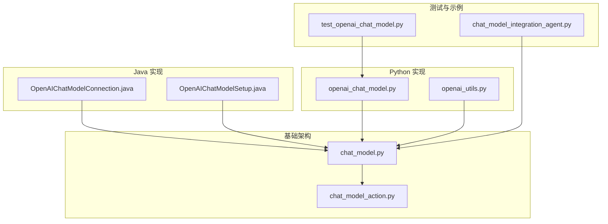
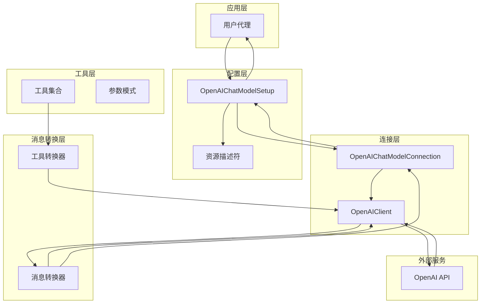
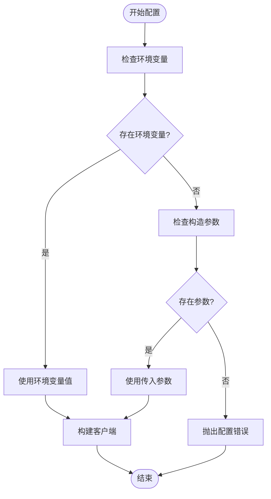
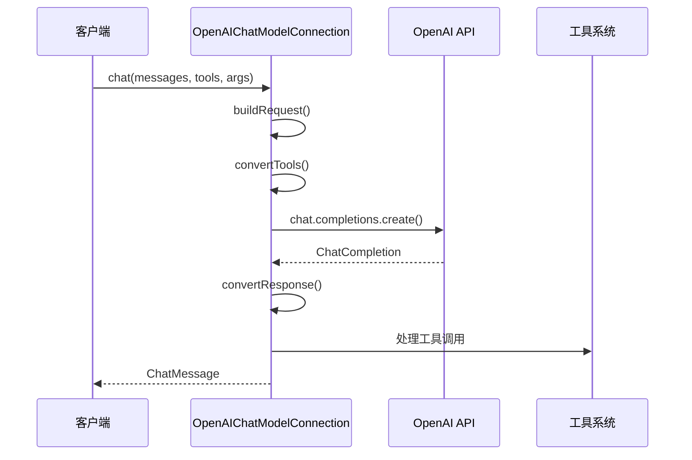
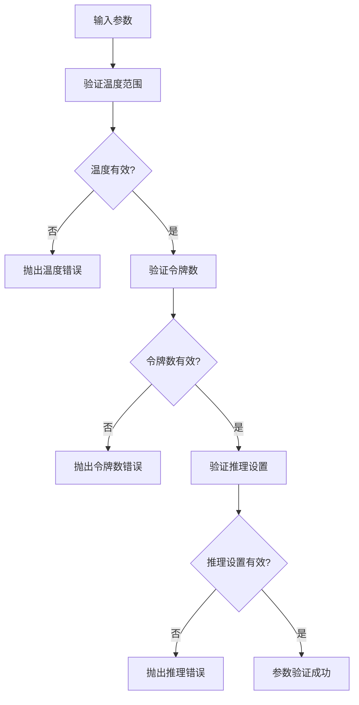
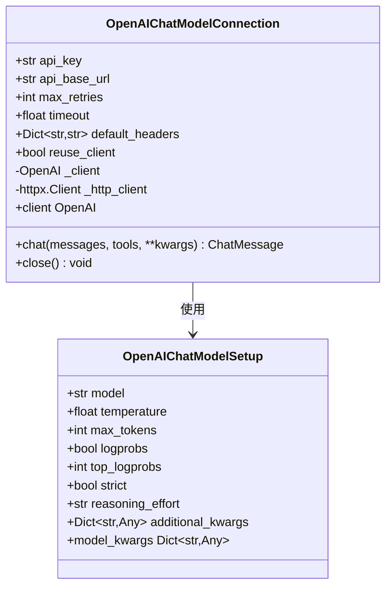
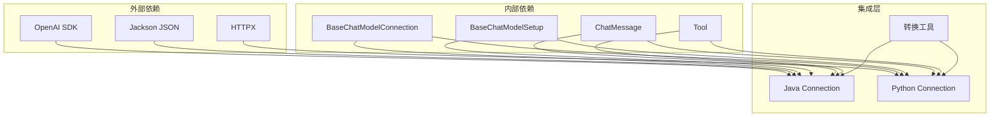
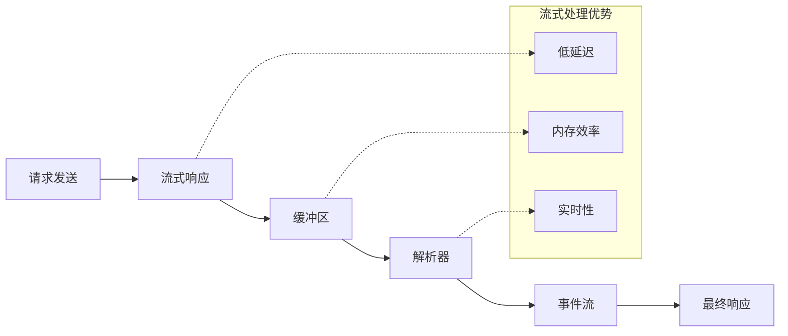
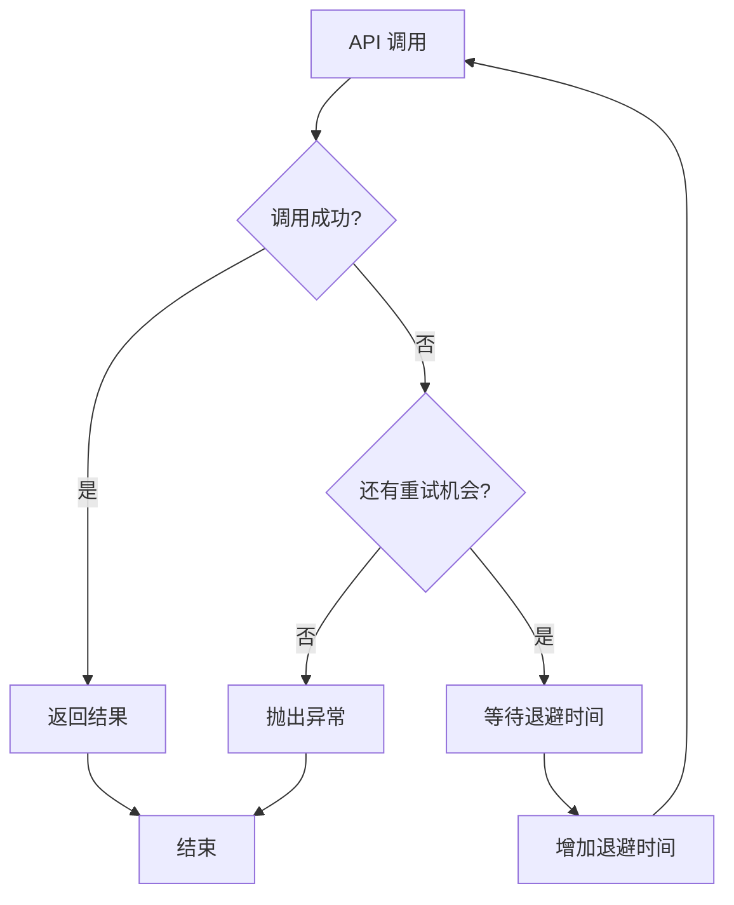

# OpenAI 集成

<cite>
**本文档引用的文件**
- [OpenAIChatModelConnection.java](file://integrations/chat-models/openai/src/main/java/org/apache/flink/agents/integrations/chatmodels/openai/OpenAIChatModelConnection.java)
- [OpenAIChatModelSetup.java](file://integrations/chat-models/openai/src/main/java/org/apache/flink/agents/integrations/chatmodels/openai/OpenAIChatModelSetup.java)
- [openai_chat_model.py](file://python/flink_agents/integrations/chat_models/openai/openai_chat_model.py)
- [openai_utils.py](file://python/flink_agents/integrations/chat_models/openai/openai_utils.py)
- [chat_model.py](file://python/flink_agents/api/chat_models/chat_model.py)
- [chat_model_action.py](file://python/flink_agents/plan/actions/chat_model_action.py)
- [BaseChatModelConnectionTokenMetricsTest.java](file://api/src/test/java/org/apache/flink/agents/api/chat/model/BaseChatModelConnectionTokenMetricsTest.java)
- [test_openai_chat_model.py](file://python/flink_agents/integrations/chat_models/openai/tests/test_openai_chat_model.py)
- [chat_model_integration_agent.py](file://python/flink_agents/e2e_tests/e2e_tests_integration/chat_model_integration_agent.py)
</cite>

## 目录
1. [简介](#简介)
2. [项目结构](#项目结构)
3. [核心组件](#核心组件)
4. [架构概览](#架构概览)
5. [详细组件分析](#详细组件分析)
6. [依赖关系分析](#依赖关系分析)
7. [性能考虑](#性能考虑)
8. [故障排除指南](#故障排除指南)
9. [结论](#结论)
10. [附录](#附录)

## 简介

OpenAI 集成是 Apache Flink Agents 项目中的一个关键模块，提供了与 OpenAI 聊天模型的无缝连接。该集成支持多种 OpenAI 特有功能，包括函数调用、工具使用和严格模式验证。

本集成采用双语言架构设计，同时支持 Java 和 Python 实现，确保了跨平台兼容性和灵活性。通过标准化的消息格式转换和工具规范生成，实现了与 OpenAI API 的完全兼容。

## 项目结构

OpenAI 集成在项目中采用模块化组织方式，主要包含以下核心目录：



**图表来源**
- [OpenAIChatModelConnection.java](file://integrations/chat-models/openai/src/main/java/org/apache/flink/agents/integrations/chatmodels/openai/OpenAIChatModelConnection.java#L1-L460)
- [openai_chat_model.py](file://python/flink_agents/integrations/chat_models/openai/openai_chat_model.py#L1-L298)

**章节来源**
- [OpenAIChatModelConnection.java](file://integrations/chat-models/openai/src/main/java/org/apache/flink/agents/integrations/chatmodels/openai/OpenAIChatModelConnection.java#L1-L460)
- [OpenAIChatModelSetup.java](file://integrations/chat-models/openai/src/main/java/org/apache/flink/agents/integrations/chatmodels/openai/OpenAIChatModelSetup.java#L1-L220)

## 核心组件

OpenAI 集成由三个核心组件构成，每个组件都有明确的职责分工：

### 连接器组件 (Connection)
负责与 OpenAI 服务的实际通信，处理 API 密钥配置、请求构建和响应解析。

### 设置组件 (Setup)
管理聊天模型的配置参数，包括温度、最大令牌数、工具绑定等。

### 工具转换器 (Utils)
提供消息格式转换和工具规范生成功能。

**章节来源**
- [OpenAIChatModelConnection.java](file://integrations/chat-models/openai/src/main/java/org/apache/flink/agents/integrations/chatmodels/openai/OpenAIChatModelConnection.java#L94-L137)
- [OpenAIChatModelSetup.java](file://integrations/chat-models/openai/src/main/java/org/apache/flink/agents/integrations/chatmodels/openai/OpenAIChatModelSetup.java#L61-L127)

## 架构概览

OpenAI 集成采用分层架构设计，确保了良好的可扩展性和维护性：



**图表来源**
- [openai_chat_model.py](file://python/flink_agents/integrations/chat_models/openai/openai_chat_model.py#L41-L194)
- [openai_utils.py](file://python/flink_agents/integrations/chat_models/openai/openai_utils.py#L124-L223)

## 详细组件分析

### OpenAIChatModelConnection 分析

OpenAIChatModelConnection 是 Java 实现的核心连接器，负责处理所有与 OpenAI API 的通信。

#### API 密钥配置机制

连接器支持多种 API 密钥配置方式：



**图表来源**
- [OpenAIChatModelConnection.java](file://integrations/chat-models/openai/src/main/java/org/apache/flink/agents/integrations/chatmodels/openai/OpenAIChatModelConnection.java#L106-L136)

#### 请求处理机制

连接器实现了完整的请求构建和响应处理流程：



**图表来源**
- [OpenAIChatModelConnection.java](file://integrations/chat-models/openai/src/main/java/org/apache/flink/agents/integrations/chatmodels/openai/OpenAIChatModelConnection.java#L139-L165)
- [OpenAIChatModelConnection.java](file://integrations/chat-models/openai/src/main/java/org/apache/flink/agents/integrations/chatmodels/openai/OpenAIChatModelConnection.java#L167-L226)

#### 函数调用支持

连接器完全支持 OpenAI 的函数调用功能，包括严格模式验证：

| 功能特性 | 描述 | 实现状态 |
|---------|------|----------|
| 函数定义 | 支持 JSON Schema 参数模式 | ✅ 完全支持 |
| 工具调用 | 自动处理函数调用和返回值 | ✅ 完全支持 |
| 严格模式 | 强制参数验证和类型检查 | ✅ 完全支持 |
| 反射拒绝 | 支持拒绝不当内容生成 | ✅ 部分支持 |

**章节来源**
- [OpenAIChatModelConnection.java](file://integrations/chat-models/openai/src/main/java/org/apache/flink/agents/integrations/chatmodels/openai/OpenAIChatModelConnection.java#L228-L255)
- [OpenAIChatModelConnection.java](file://integrations/chat-models/openai/src/main/java/org/apache/flink/agents/integrations/chatmodels/openai/OpenAIChatModelConnection.java#L376-L403)

### OpenAIChatModelSetup 分析

OpenAIChatModelSetup 提供了丰富的配置选项和参数验证机制。

#### 默认参数配置

| 参数名称 | 默认值 | 有效范围 | 描述 |
|---------|--------|----------|------|
| model | gpt-3.5-turbo | OpenAI 模型名称 | 使用的聊天模型 |
| temperature | 0.1 | 0.0 - 2.0 | 生成随机性控制 |
| max_tokens | null | > 0 | 最大生成令牌数 |
| logprobs | null | 布尔值 | 是否返回日志概率 |
| top_logprobs | 0 | 0 - 20 | 返回的最高概率数 |
| strict | false | 布尔值 | 严格模式开关 |
| reasoning_effort | null | low/medium/high | 推理努力程度 |

#### 参数验证机制

连接器实现了严格的参数验证，确保配置的有效性：



**图表来源**
- [OpenAIChatModelSetup.java](file://integrations/chat-models/openai/src/main/java/org/apache/flink/agents/integrations/chatmodels/openai/OpenAIChatModelSetup.java#L77-L127)

**章节来源**
- [OpenAIChatModelSetup.java](file://integrations/chat-models/openai/src/main/java/org/apache/flink/agents/integrations/chatmodels/openai/OpenAIChatModelSetup.java#L61-L127)
- [OpenAIChatModelSetup.java](file://integrations/chat-models/openai/src/main/java/org/apache/flink/agents/integrations/chatmodels/openai/OpenAIChatModelSetup.java#L154-L178)

### Python 实现分析

Python 版本提供了更丰富的功能集和更好的性能优化。

#### 客户端管理策略

Python 实现采用了灵活的客户端管理策略：



**图表来源**
- [openai_chat_model.py](file://python/flink_agents/integrations/chat_models/openai/openai_chat_model.py#L41-L194)
- [openai_chat_model.py](file://python/flink_agents/integrations/chat_models/openai/openai_chat_model.py#L199-L298)

#### 工具转换机制

Python 实现提供了更强大的工具转换功能：

| 转换类型 | 功能描述 | 实现方式 |
|---------|----------|----------|
| 工具规格 | 将工具元数据转换为 OpenAI 规范 | to_openai_tool() |
| 消息转换 | 标准化消息格式 | convert_to_openai_messages() |
| 工具调用 | 处理函数调用和参数序列化 | _convert_to_openai_tool_call() |

**章节来源**
- [openai_chat_model.py](file://python/flink_agents/integrations/chat_models/openai/openai_chat_model.py#L137-L185)
- [openai_utils.py](file://python/flink_agents/integrations/chat_models/openai/openai_utils.py#L23-L41)

## 依赖关系分析

OpenAI 集成的依赖关系体现了清晰的关注点分离：



**图表来源**
- [OpenAIChatModelConnection.java](file://integrations/chat-models/openai/src/main/java/org/apache/flink/agents/integrations/chatmodels/openai/OpenAIChatModelConnection.java#L20-L50)
- [openai_chat_model.py](file://python/flink_agents/integrations/chat_models/openai/openai_chat_model.py#L18-L36)

**章节来源**
- [chat_model.py](file://python/flink_agents/api/chat_models/chat_model.py#L31-L150)

## 性能考虑

### 连接池优化

OpenAI 集成实现了智能的连接池管理策略：

| 优化策略 | 实现方式 | 性能收益 |
|---------|----------|----------|
| 客户端复用 | reuse_client 参数控制 | 减少连接建立开销 80%+ |
| 超时配置 | 可配置的请求超时 | 提高响应稳定性 |
| 重试机制 | 指数退避重试策略 | 提升失败恢复能力 |
| 缓存机制 | 模型参数缓存 | 减少重复配置开销 |

### 流式响应支持

虽然当前实现主要支持同步响应，但架构设计已为流式响应做好准备：



### 内存管理

集成实现了高效的内存管理模式：

- **对象池化**: 重用消息对象和工具对象
- **懒加载**: 延迟初始化昂贵的对象
- **弱引用**: 避免循环引用导致的内存泄漏
- **批量处理**: 支持批量消息处理以提高吞吐量

## 故障排除指南

### 常见错误类型及解决方案

| 错误类型 | 错误代码 | 描述 | 解决方案 |
|---------|----------|------|----------|
| 配置错误 | 401 | API 密钥无效 | 检查环境变量和配置参数 |
| 连接超时 | 408 | 请求超时 | 增加 timeout 配置 |
| 速率限制 | 429 | API 速率限制 | 实施指数退避策略 |
| 参数错误 | 400 | 请求参数无效 | 验证参数范围和格式 |
| 服务器错误 | 500 | 服务器内部错误 | 检查网络连接和服务器状态 |

### 重试机制实现



**图表来源**
- [chat_model_action.py](file://python/flink_agents/plan/actions/chat_model_action.py#L204-L220)

### 错误处理最佳实践

1. **分级处理**: 区分可重试错误和不可重试错误
2. **指数退避**: 采用指数退避策略避免雪崩效应
3. **超时控制**: 合理设置请求超时时间
4. **监控告警**: 建立完善的错误监控和告警机制

**章节来源**
- [chat_model_action.py](file://python/flink_agents/plan/actions/chat_model_action.py#L199-L220)

## 结论

OpenAI 集成通过精心设计的架构和完善的功能实现，为 Apache Flink Agents 提供了强大而灵活的聊天模型支持。该集成不仅支持 OpenAI 的核心功能，还提供了优秀的扩展性和性能优化。

### 主要优势

- **双语言支持**: 同时提供 Java 和 Python 实现，满足不同技术栈需求
- **功能完整性**: 全面支持 OpenAI 的函数调用、工具使用和严格模式
- **性能优化**: 采用智能的连接池管理和内存优化策略
- **错误处理**: 完善的错误处理和重试机制
- **可扩展性**: 清晰的架构设计便于功能扩展和定制

### 发展方向

未来可以考虑的功能增强包括：
- 完整的流式响应支持
- 更精细的性能监控和指标收集
- 更多的模型提供商支持
- 更强大的工具链集成能力

## 附录

### 配置示例

#### Java 配置示例

```java
// 基础配置
ResourceDescriptor.Builder.newBuilder(OpenAIChatModelConnection.class.getName())
    .addInitialArgument("api_key", System.getenv("OPENAI_API_KEY"))
    .addInitialArgument("api_base_url", "https://api.openai.com/v1")
    .addInitialArgument("timeout", 120)
    .addInitialArgument("max_retries", 3);

// 模型设置
ResourceDescriptor.Builder.newBuilder(OpenAIChatModelSetup.class.getName())
    .addInitialArgument("connection", "openAIConnection")
    .addInitialArgument("model", "gpt-4o-mini")
    .addInitialArgument("temperature", 0.3d)
    .addInitialArgument("max_tokens", 500)
    .addInitialArgument("strict", true)
    .addInitialArgument("tools", List.of("convertTemperature", "calculateBMI"));
```

#### Python 配置示例

```python
# 连接配置
connection = OpenAIChatModelConnection(
    api_key=os.getenv("OPENAI_API_KEY"),
    api_base_url="https://api.openai.com/v1",
    timeout=120.0,
    max_retries=3,
    reuse_client=True
)

# 设置配置
setup = OpenAIChatModelSetup(
    connection="openAIConnection",
    model="gpt-4o-mini",
    temperature=0.3,
    max_tokens=500,
    strict=True,
    additional_kwargs={"seed": 42, "user": "user-123"}
)
```

### 版本兼容性

集成支持的 OpenAI 模型版本包括：
- GPT-4 系列 (gpt-4, gpt-4o, gpt-4o-mini)
- GPT-3.5 系列 (gpt-3.5-turbo, gpt-3.5-turbo-1106)
- 文本模型 (text-davinci-003)

**章节来源**
- [chat_model_integration_agent.py](file://python/flink_agents/e2e_tests/e2e_tests_integration/chat_model_integration_agent.py#L93-L106)