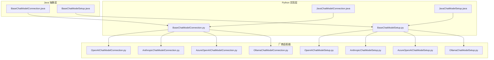
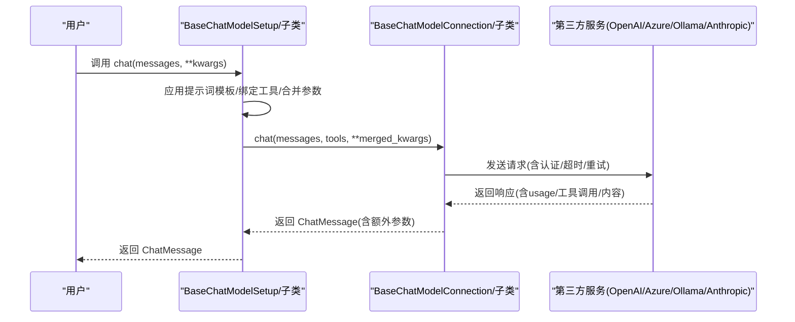
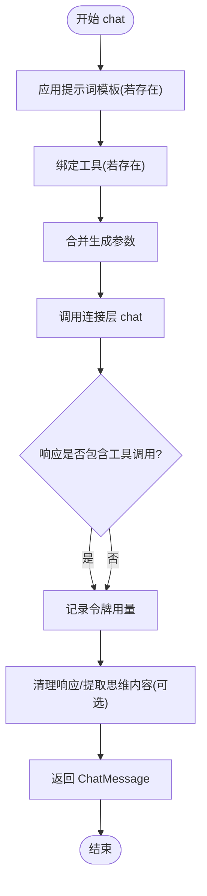
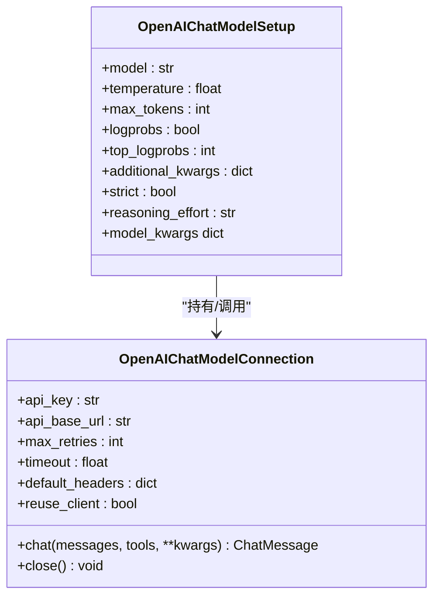
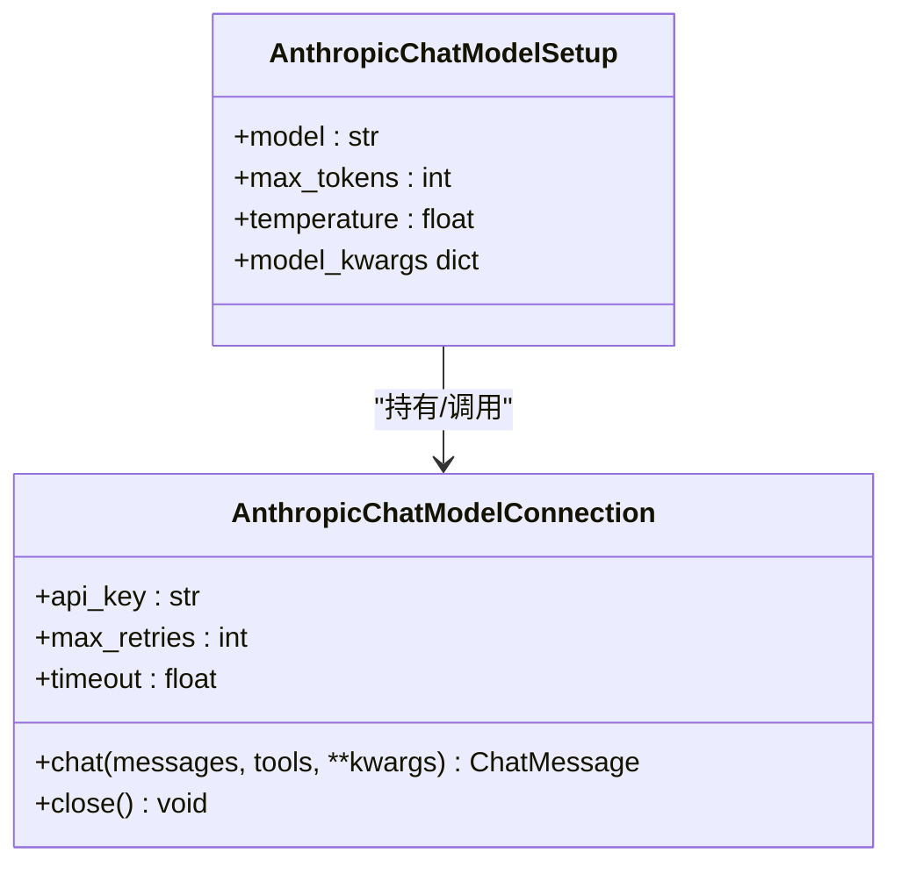
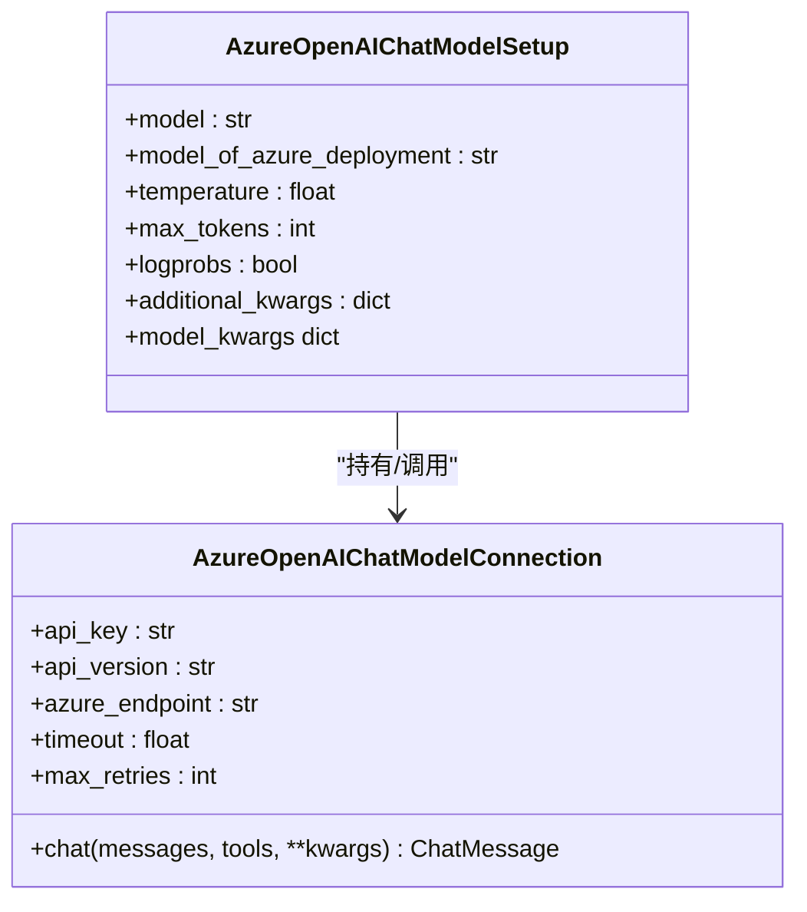
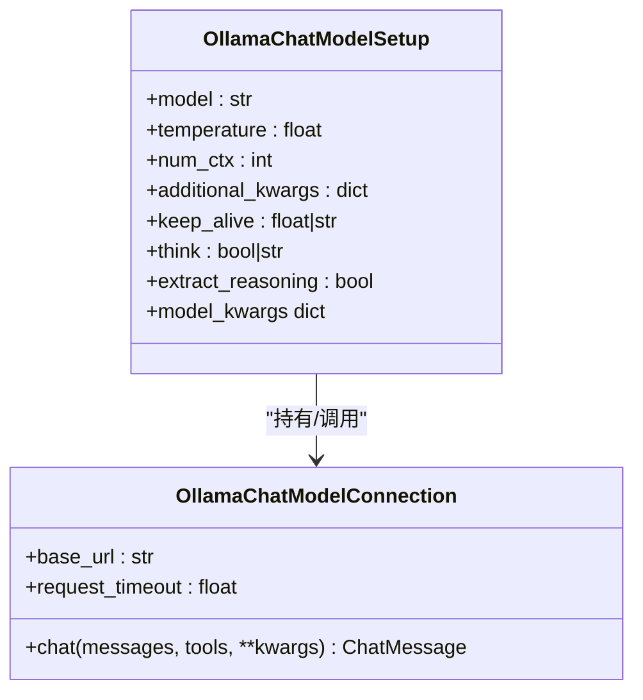
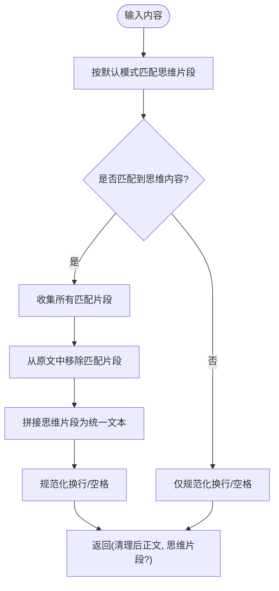
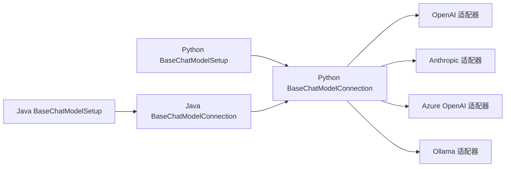

# Python 聊天模型

<cite>
**本文引用的文件**   
- [BaseChatModelConnection.java](file://api/src/main/java/org/apache/flink/agents/api/chat/model/BaseChatModelConnection.java)
- [BaseChatModelSetup.java](file://api/src/main/java/org/apache/flink/agents/api/chat/model/BaseChatModelSetup.java)
- [BaseChatModelConnection.py](file://python/flink_agents/api/chat_models/chat_model.py)
- [BaseChatModelSetup.py](file://python/flink_agents/api/chat_models/chat_model.py)
- [JavaChatModelConnection.java](file://python/flink_agents/api/chat_models/java_chat_model.py)
- [JavaChatModelSetup.java](file://python/flink_agents/api/chat_models/java_chat_model.py)
- [OpenAIChatModelConnection.py](file://python/flink_agents/integrations/chat_models/openai/openai_chat_model.py)
- [OpenAIChatModelSetup.py](file://python/flink_agents/integrations/chat_models/openai/openai_chat_model.py)
- [AnthropicChatModelConnection.py](file://python/flink_agents/integrations/chat_models/anthropic/anthropic_chat_model.py)
- [AnthropicChatModelSetup.py](file://python/flink_agents/integrations/chat_models/anthropic/anthropic_chat_model.py)
- [AzureOpenAIChatModelConnection.py](file://python/flink_agents/integrations/chat_models/azure/azure_openai_chat_model.py)
- [AzureOpenAIChatModelSetup.py](file://python/flink_agents/integrations/chat_models/azure/azure_openai_chat_model.py)
- [OllamaChatModelConnection.py](file://python/flink_agents/integrations/chat_models/ollama_chat_model.py)
- [OllamaChatModelSetup.py](file://python/flink_agents/integrations/chat_models/ollama_chat_model.py)
</cite>

## 目录
1. [简介](#简介)
2. [项目结构](#项目结构)
3. [核心组件](#核心组件)
4. [架构总览](#架构总览)
5. [详细组件分析](#详细组件分析)
6. [依赖关系分析](#依赖关系分析)
7. [性能考虑](#性能考虑)
8. [故障排查指南](#故障排查指南)
9. [结论](#结论)
10. [附录：使用示例与最佳实践](#附录使用示例与最佳实践)

## 简介
本文件系统性梳理 Apache Flink Agents 的 Python 聊天模型体系，围绕抽象基类 BaseChatModelConnection 与 BaseChatModelSetup 的设计理念与实现细节展开，覆盖聊天模型连接管理、配置参数与认证机制；详解从消息预处理、工具绑定到响应处理的完整生命周期；阐述 OpenAI、Anthropic、Azure AI、Ollama 等第三方服务的适配器模式；并提供推理内容提取、思维模式匹配与响应清理功能说明，以及性能优化、错误处理与最佳实践建议。

## 项目结构
- Java 层定义了抽象基类与资源类型，Python 层实现具体适配器与工具转换逻辑。
- 聊天模型资源分为两类：
  - 连接层（Connection）：封装认证、超时、客户端复用等网络与服务端细节。
  - 设置层（Setup）：封装提示词模板、工具列表、生成参数等业务配置。
- 不同厂商适配器均遵循统一接口，通过转换函数将通用消息与工具格式映射到各平台 API。

图表来源
- [BaseChatModelConnection.java](file://api/src/main/java/org/apache/flink/agents/api/chat/model/BaseChatModelConnection.java#L32-L79)
- [BaseChatModelSetup.java](file://api/src/main/java/org/apache/flink/agents/api/chat/model/BaseChatModelSetup.java#L37-L128)
- [BaseChatModelConnection.py](file://python/flink_agents/api/chat_models/chat_model.py#L31-L232)
- [BaseChatModelSetup.py](file://python/flink_agents/api/chat_models/chat_model.py#L121-L232)
- [OpenAIChatModelConnection.py](file://python/flink_agents/integrations/chat_models/openai/openai_chat_model.py#L41-L298)
- [AnthropicChatModelConnection.py](file://python/flink_agents/integrations/chat_models/anthropic/anthropic_chat_model.py#L113-L303)
- [AzureOpenAIChatModelConnection.py](file://python/flink_agents/integrations/chat_models/azure/azure_openai_chat_model.py#L36-L261)
- [OllamaChatModelConnection.py](file://python/flink_agents/integrations/chat_models/ollama_chat_model.py#L36-L276)
- [JavaChatModelConnection.java](file://python/flink_agents/api/chat_models/java_chat_model.py#L25-L47)
- [JavaChatModelSetup.java](file://python/flink_agents/api/chat_models/java_chat_model.py#L37-L47)

章节来源
- [BaseChatModelConnection.java](file://api/src/main/java/org/apache/flink/agents/api/chat/model/BaseChatModelConnection.java#L32-L79)
- [BaseChatModelSetup.java](file://api/src/main/java/org/apache/flink/agents/api/chat/model/BaseChatModelSetup.java#L37-L128)
- [BaseChatModelConnection.py](file://python/flink_agents/api/chat_models/chat_model.py#L31-L232)
- [BaseChatModelSetup.py](file://python/flink_agents/api/chat_models/chat_model.py#L121-L232)

## 核心组件
- 抽象基类职责
  - BaseChatModelConnection：定义统一的 chat 接口，负责连接配置（如认证、超时、重试、客户端复用）、令牌用量指标记录与关闭资源。
  - BaseChatModelSetup：负责提示词模板应用、工具绑定、参数合并与调用连接层执行聊天。
- Python 实现要点
  - 统一字段与行为：连接层支持默认思维模式匹配与响应清理；设置层支持 prompt 模板与工具列表注入。
  - Java 资源桥接：JavaChatModelConnection/Setup 提供装饰器标记，用于跨语言资源桥接。

章节来源
- [BaseChatModelConnection.java](file://api/src/main/java/org/apache/flink/agents/api/chat/model/BaseChatModelConnection.java#L32-L79)
- [BaseChatModelSetup.java](file://api/src/main/java/org/apache/flink/agents/api/chat/model/BaseChatModelSetup.java#L37-L128)
- [BaseChatModelConnection.py](file://python/flink_agents/api/chat_models/chat_model.py#L31-L232)
- [BaseChatModelSetup.py](file://python/flink_agents/api/chat_models/chat_model.py#L121-L232)
- [JavaChatModelConnection.java](file://python/flink_agents/api/chat_models/java_chat_model.py#L25-L47)
- [JavaChatModelSetup.java](file://python/flink_agents/api/chat_models/java_chat_model.py#L37-L47)

## 架构总览
下图展示了从设置层到连接层再到第三方服务的整体调用链路，以及 Java 与 Python 的资源桥接关系。

图表来源
- [BaseChatModelSetup.java](file://api/src/main/java/org/apache/flink/agents/api/chat/model/BaseChatModelSetup.java#L54-L101)
- [BaseChatModelConnection.java](file://api/src/main/java/org/apache/flink/agents/api/chat/model/BaseChatModelConnection.java#L58-L77)
- [BaseChatModelSetup.py](file://python/flink_agents/api/chat_models/chat_model.py#L151-L209)
- [BaseChatModelConnection.py](file://python/flink_agents/api/chat_models/chat_model.py#L95-L119)

## 详细组件分析

### 抽象基类设计与生命周期
- 设计理念
  - 连接层关注“如何连”，设置层关注“如何用”。二者解耦，便于多设置共享同一连接或切换不同连接。
  - 统一的 chat 接口与资源类型标识，确保跨语言与跨实现的一致性。
- 生命周期流程
  1) 输入消息与可选提示词模板应用
  2) 工具元数据绑定与规格化
  3) 合并参数（设置层默认参数与调用方传入参数）
  4) 调用连接层执行请求
  5) 处理响应（提取工具调用、记录令牌用量、清理与提取思维内容）

图表来源
- [BaseChatModelSetup.java](file://api/src/main/java/org/apache/flink/agents/api/chat/model/BaseChatModelSetup.java#L54-L101)
- [BaseChatModelConnection.java](file://api/src/main/java/org/apache/flink/agents/api/chat/model/BaseChatModelConnection.java#L58-L77)
- [BaseChatModelSetup.py](file://python/flink_agents/api/chat_models/chat_model.py#L151-L209)
- [BaseChatModelConnection.py](file://python/flink_agents/api/chat_models/chat_model.py#L95-L119)

章节来源
- [BaseChatModelConnection.java](file://api/src/main/java/org/apache/flink/agents/api/chat/model/BaseChatModelConnection.java#L32-L79)
- [BaseChatModelSetup.java](file://api/src/main/java/org/apache/flink/agents/api/chat/model/BaseChatModelSetup.java#L37-L128)
- [BaseChatModelConnection.py](file://python/flink_agents/api/chat_models/chat_model.py#L31-L232)
- [BaseChatModelSetup.py](file://python/flink_agents/api/chat_models/chat_model.py#L121-L232)

### OpenAI 适配器
- 连接层特性
  - 支持 API Key、基础 URL、最大重试次数、超时、默认头、HTTP 客户端复用。
  - 将工具元数据转换为 OpenAI 函数规范，必要时启用严格模式与参数校验。
  - 记录 promptTokens/completionTokens 以供指标统计。
- 设置层特性
  - 默认模型、温度、最大生成长度、日志概率、顶部对数概率、附加参数、严格模式、推理强度等。
  - 通过 model_kwargs 合并生成参数。

图表来源
- [OpenAIChatModelConnection.py](file://python/flink_agents/integrations/chat_models/openai/openai_chat_model.py#L41-L198)
- [OpenAIChatModelSetup.py](file://python/flink_agents/integrations/chat_models/openai/openai_chat_model.py#L199-L298)

章节来源
- [OpenAIChatModelConnection.py](file://python/flink_agents/integrations/chat_models/openai/openai_chat_model.py#L41-L298)
- [OpenAIChatModelSetup.py](file://python/flink_agents/integrations/chat_models/openai/openai_chat_model.py#L199-L298)

### Anthropic 适配器
- 连接层特性
  - 使用 Anthropic SDK，支持 API Key、最大重试次数、超时。
  - 将消息转换为 Anthropic 的 messages/system 格式；当 stop_reason 为 tool_use 时，构造工具调用。
  - 记录 input_tokens/output_tokens。
- 设置层特性
  - 默认模型、最大生成长度、温度等；通过 model_kwargs 传递参数。

图表来源
- [AnthropicChatModelConnection.py](file://python/flink_agents/integrations/chat_models/anthropic/anthropic_chat_model.py#L113-L235)
- [AnthropicChatModelSetup.py](file://python/flink_agents/integrations/chat_models/anthropic/anthropic_chat_model.py#L242-L303)

章节来源
- [AnthropicChatModelConnection.py](file://python/flink_agents/integrations/chat_models/anthropic/anthropic_chat_model.py#L113-L303)
- [AnthropicChatModelSetup.py](file://python/flink_agents/integrations/chat_models/anthropic/anthropic_chat_model.py#L242-L303)

### Azure OpenAI 适配器
- 连接层特性
  - 使用 AzureOpenAI SDK，需提供 azure_endpoint、api_key、api_version。
  - 必须通过 kwargs 提供 model（部署名），可选 model_of_azure_deployment 用于令牌统计。
  - 工具规范与 OpenAI 相同。
- 设置层特性
  - 部署名、底层模型名（用于计费/统计）、温度、最大生成长度、日志概率、附加参数等。

图表来源
- [AzureOpenAIChatModelConnection.py](file://python/flink_agents/integrations/chat_models/azure/azure_openai_chat_model.py#L36-L156)
- [AzureOpenAIChatModelSetup.py](file://python/flink_agents/integrations/chat_models/azure/azure_openai_chat_model.py#L158-L261)

章节来源
- [AzureOpenAIChatModelConnection.py](file://python/flink_agents/integrations/chat_models/azure/azure_openai_chat_model.py#L36-L261)
- [AzureOpenAIChatModelSetup.py](file://python/flink_agents/integrations/chat_models/azure/azure_openai_chat_model.py#L158-L261)

### Ollama 适配器
- 连接层特性
  - 使用本地 Ollama 客户端，默认 base_url 与 request_timeout。
  - 将消息与工具转换为 Ollama 协议；支持 keep_alive、think 控制与工具调用。
  - 可选提取思维内容（通过 extract_reasoning），并记录 prompt_eval_count/eval_count。
- 设置层特性
  - 模型名、温度、上下文窗口、附加参数、keep_alive、think、是否提取思维内容等。

图表来源
- [OllamaChatModelConnection.py](file://python/flink_agents/integrations/chat_models/ollama_chat_model.py#L36-L169)
- [OllamaChatModelSetup.py](file://python/flink_agents/integrations/chat_models/ollama_chat_model.py#L171-L276)

章节来源
- [OllamaChatModelConnection.py](file://python/flink_agents/integrations/chat_models/ollama_chat_model.py#L36-L276)
- [OllamaChatModelSetup.py](file://python/flink_agents/integrations/chat_models/ollama_chat_model.py#L171-L276)

### 思维模式匹配与响应清理
- 默认思维模式匹配规则集合包含多种标签与块级代码块形式的思维内容识别。
- 清理流程会去除匹配到的思维片段，保留正文，并进行换行与空格规范化。
- Ollama 适配器支持通过参数开启提取与清理。

图表来源
- [BaseChatModelConnection.py](file://python/flink_agents/api/chat_models/chat_model.py#L52-L94)
- [OllamaChatModelConnection.py](file://python/flink_agents/integrations/chat_models/ollama_chat_model.py#L127-L148)

章节来源
- [BaseChatModelConnection.py](file://python/flink_agents/api/chat_models/chat_model.py#L52-L94)
- [OllamaChatModelConnection.py](file://python/flink_agents/integrations/chat_models/ollama_chat_model.py#L127-L148)

### Java 资源桥接
- JavaChatModelConnection/Setup 通过装饰器标记，作为 Python 侧资源对象，实际能力由底层 Java 实现提供。
- 适用于需要在 Java 环境中直接使用聊天模型的场景。

章节来源
- [JavaChatModelConnection.java](file://python/flink_agents/api/chat_models/java_chat_model.py#L25-L47)
- [JavaChatModelSetup.java](file://python/flink_agents/api/chat_models/java_chat_model.py#L37-L47)

## 依赖关系分析
- 解耦与复用
  - 多个设置层可共享同一连接层实例，降低连接成本。
  - 工具通过资源名称解析，避免硬编码，提升可配置性。
- 第三方差异
  - OpenAI/Azure 均基于 OpenAI SDK，差异主要在认证与参数命名（如 Azure 的部署名）。
  - Anthropic 使用专用 SDK，消息与系统提示格式不同。
  - Ollama 为本地服务，参数与计费统计方式独特。

图表来源
- [BaseChatModelSetup.py](file://python/flink_agents/api/chat_models/chat_model.py#L121-L232)
- [BaseChatModelConnection.py](file://python/flink_agents/api/chat_models/chat_model.py#L31-L232)
- [OpenAIChatModelConnection.py](file://python/flink_agents/integrations/chat_models/openai/openai_chat_model.py#L41-L198)
- [AnthropicChatModelConnection.py](file://python/flink_agents/integrations/chat_models/anthropic/anthropic_chat_model.py#L113-L235)
- [AzureOpenAIChatModelConnection.py](file://python/flink_agents/integrations/chat_models/azure/azure_openai_chat_model.py#L36-L156)
- [OllamaChatModelConnection.py](file://python/flink_agents/integrations/chat_models/ollama_chat_model.py#L36-L169)
- [JavaChatModelConnection.java](file://python/flink_agents/api/chat_models/java_chat_model.py#L25-L47)
- [JavaChatModelSetup.java](file://python/flink_agents/api/chat_models/java_chat_model.py#L37-L47)

## 性能考虑
- 客户端复用
  - OpenAI 连接层支持 reuse_client，建议在高并发或批量请求场景开启以减少连接开销。
- 超时与重试
  - 合理设置 timeout 与 max_retries，避免阻塞与资源浪费；对易抖动网络适当提高重试次数。
- 本地推理优化
  - Ollama 适配器支持 keep_alive 控制模型常驻内存时间，减少重复加载开销。
  - 通过 num_ctx 控制上下文窗口，平衡性能与质量。
- 工具调用与参数合并
  - 仅在需要时启用工具调用，避免不必要的 schema 校验与序列化开销。
  - 合理合并参数，减少无效字段传输。

## 故障排查指南
- 常见问题定位
  - 认证失败：检查 API Key、基础 URL/Endpoint 是否正确；确认网络可达。
  - 参数不生效：核对设置层 model_kwargs 与调用方 kwargs 的合并顺序；Azure 需提供部署名。
  - 工具调用未触发：确认工具元数据与平台规范一致；OpenAI/Anthropic 的严格模式可能影响参数校验。
  - 令牌统计缺失：确认响应中包含 usage 或等价字段；Azure 需提供底层模型名以便计费统计。
- 日志与指标
  - 利用指标组记录 promptTokens/completionTokens，结合模型名分组定位异常。
  - 对于 Ollama，可通过提取思维开关观察响应清理效果。

章节来源
- [OpenAIChatModelConnection.py](file://python/flink_agents/integrations/chat_models/openai/openai_chat_model.py#L137-L186)
- [AnthropicChatModelConnection.py](file://python/flink_agents/integrations/chat_models/anthropic/anthropic_chat_model.py#L167-L227)
- [AzureOpenAIChatModelConnection.py](file://python/flink_agents/integrations/chat_models/azure/azure_openai_chat_model.py#L109-L156)
- [OllamaChatModelConnection.py](file://python/flink_agents/integrations/chat_models/ollama_chat_model.py#L84-L148)

## 结论
通过抽象基类与适配器模式，Flink Agents 的 Python 聊天模型实现了统一的生命周期管理与多厂商无缝对接。连接层与设置层的清晰分工，使得配置灵活、扩展便捷；工具绑定、思维提取与响应清理等功能进一步提升了工程可用性。结合合理的性能优化与完善的错误处理策略，可在生产环境中稳定高效地运行各类聊天模型。

## 附录：使用示例与最佳实践
- 示例思路（以 OpenAI 为例）
  - 创建连接：提供 API Key 与基础 URL，设置超时与重试。
  - 创建设置：指定模型、温度、最大生成长度、工具列表与提示词模板。
  - 执行聊天：传入消息序列，自动应用模板与工具，返回 ChatMessage。
- 最佳实践
  - 参数优先级：设置层默认参数作为基线，调用方 kwargs 用于临时覆盖。
  - 工具规范：确保工具元数据描述简洁且参数 schema 完整，避免严格模式导致的调用失败。
  - 本地推理：合理设置 num_ctx 与 keep_alive，平衡延迟与资源占用。
  - 观察指标：开启令牌统计，定期监控 promptTokens/completionTokens，评估成本与性能。

章节来源
- [BaseChatModelSetup.py](file://python/flink_agents/api/chat_models/chat_model.py#L151-L209)
- [OpenAIChatModelSetup.py](file://python/flink_agents/integrations/chat_models/openai/openai_chat_model.py#L199-L298)
- [OllamaChatModelSetup.py](file://python/flink_agents/integrations/chat_models/ollama_chat_model.py#L171-L276)