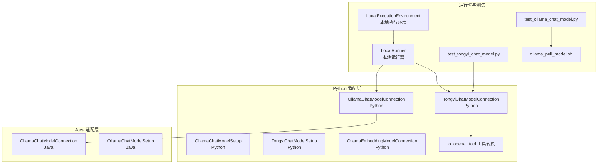
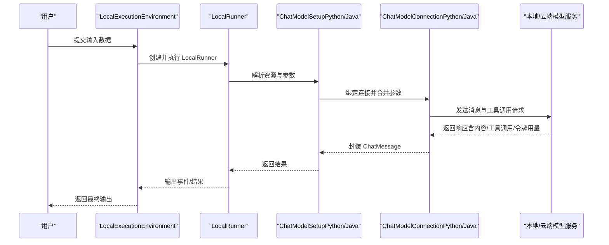
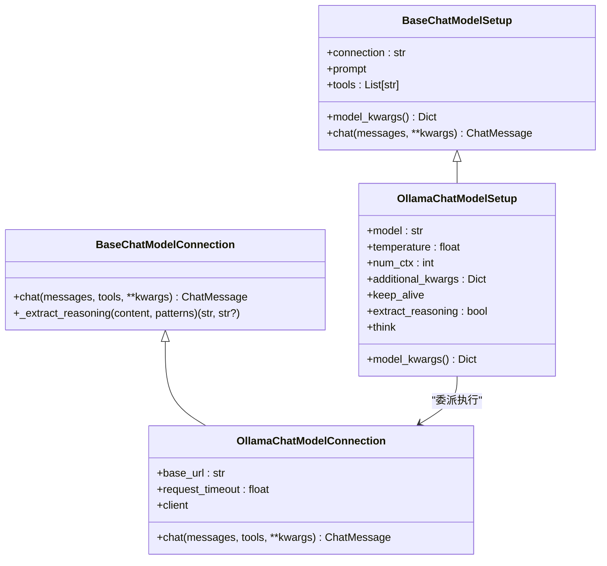
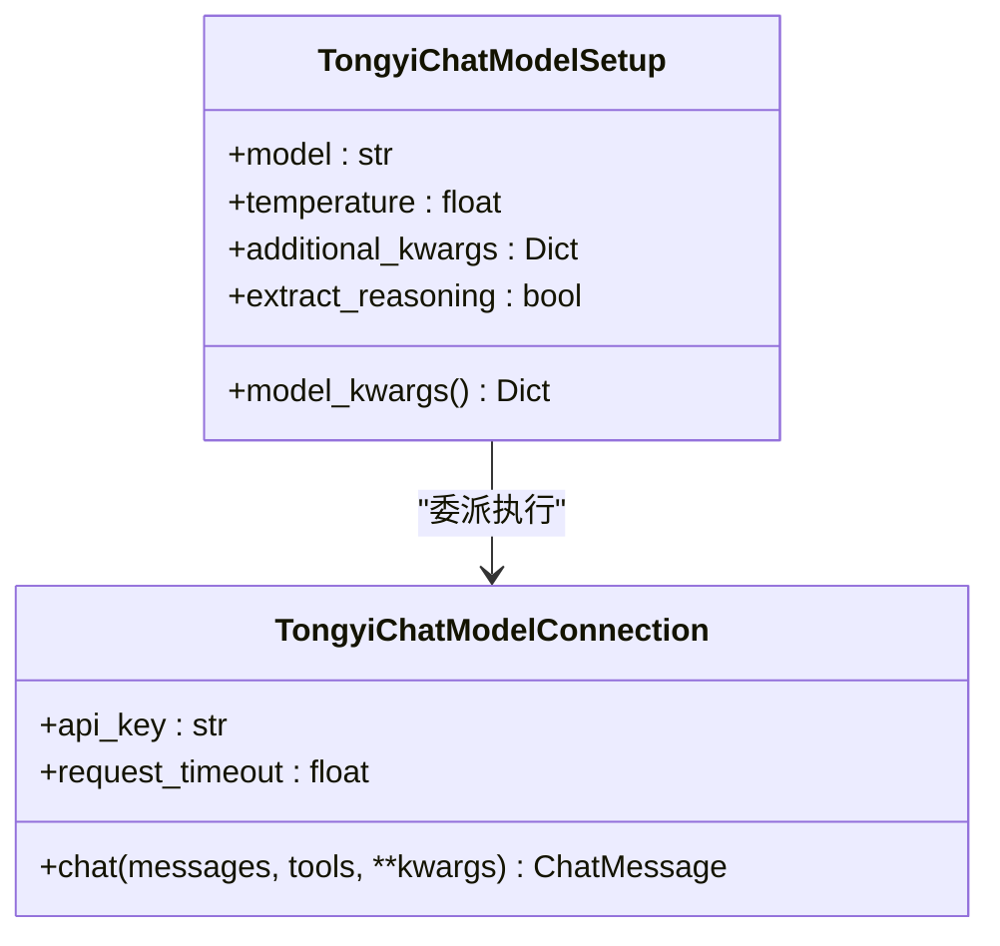
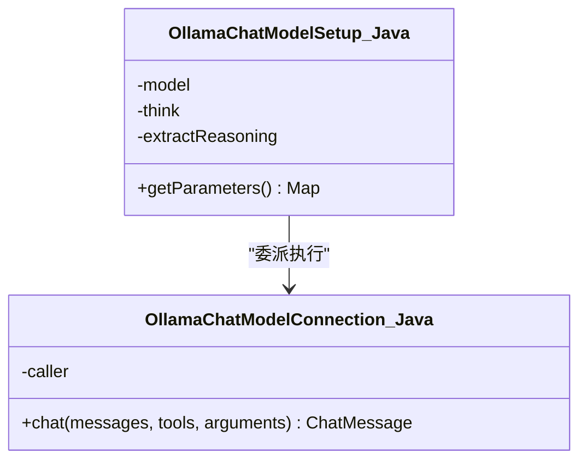
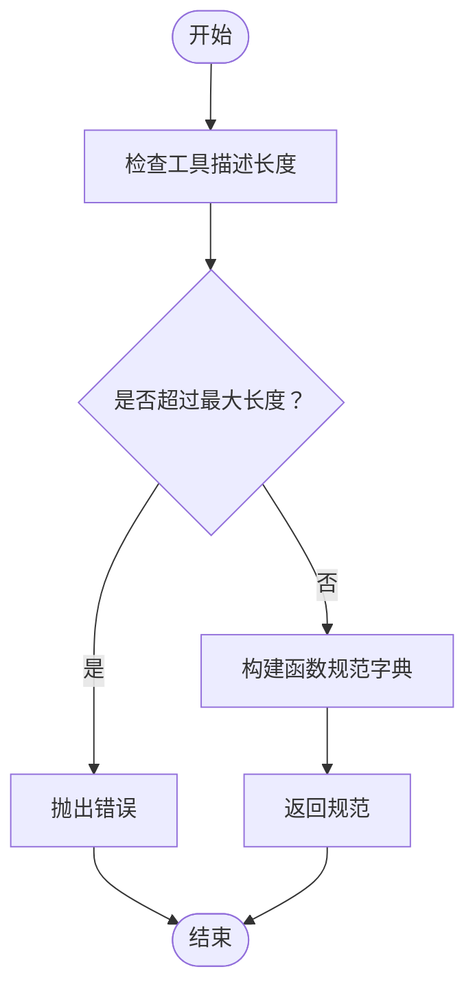
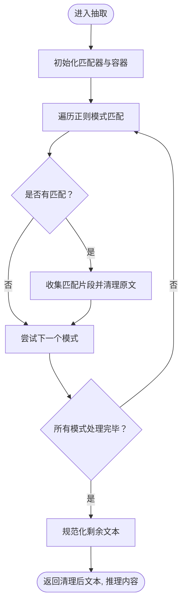
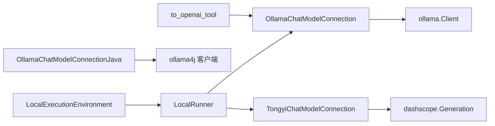

# 本地模型集成

<cite>
**本文引用的文件**
- [ollama_chat_model.py](file://python/flink_agents/integrations/chat_models/ollama_chat_model.py)
- [tongyi_chat_model.py](file://python/flink_agents/integrations/chat_models/tongyi_chat_model.py)
- [chat_model_utils.py](file://python/flink_agents/integrations/chat_models/chat_model_utils.py)
- [chat_model.py（Python 基类）](file://python/flink_agents/api/chat_models/chat_model.py)
- [OllamaChatModelConnection.java（Java 实现）](file://integrations/chat-models/ollama/src/main/java/org/apache/flink/agents/integrations/chatmodels/ollama/OllamaChatModelConnection.java)
- [OllamaChatModelSetup.java（Java 实现）](file://integrations/chat-models/ollama/src/main/java/org/apache/flink/agents/integrations/chatmodels/ollama/OllamaChatModelSetup.java)
- [ollama_embedding_model.py](file://python/flink_agents/integrations/embedding_models/local/ollama_embedding_model.py)
- [ollama_pull_model.sh（端到端测试脚本）](file://e2e-test/flink-agents-end-to-end-tests-integration/src/test/resources/ollama_pull_model.sh)
- [ollama_pull_model.sh（Python 测试脚本）](file://python/flink_agents/e2e_tests/scripts/ollama_pull_model.sh)
- [test_ollama_chat_model.py](file://python/flink_agents/integrations/chat_models/tests/test_ollama_chat_model.py)
- [test_tongyi_chat_model.py](file://python/flink_agents/integrations/chat_models/tests/test_tongyi_chat_model.py)
- [local_execution_environment.py](file://python/flink_agents/runtime/local_execution_environment.py)
- [local_runner.py](file://python/flink_agents/runtime/local_runner.py)
</cite>

## 目录
1. [简介](#简介)
2. [项目结构](#项目结构)
3. [核心组件](#核心组件)
4. [架构总览](#架构总览)
5. [详细组件分析](#详细组件分析)
6. [依赖关系分析](#依赖关系分析)
7. [性能考量](#性能考量)
8. [故障排除指南](#故障排除指南)
9. [结论](#结论)
10. [附录](#附录)

## 简介
本文件面向在本地部署与集成聊天模型的开发者，系统性介绍 Flink Agents 中的本地模型能力，重点覆盖以下内容：
- 本地模型的安装与运行环境要求：Ollama 服务端、模型镜像拉取、Python 客户端依赖。
- 本地模型的优势：隐私保护、离线可用、成本可控。
- 与云端模型（以通义千问 DashScope 为例）的对比与使用场景选择。
- 完整集成示例：从资源注册、连接配置、工具调用到推理执行的全流程。
- 部署指南、维护建议与常见问题排查。

## 项目结构
本项目采用“跨语言资源桥接”的设计，Java 层提供与 Ollama 的原生集成，Python 层提供与 Ollama、通义千问等服务的适配器。核心目录与职责如下：
- Python 聊天模型适配层：提供 Ollama 与通义千问的连接与设置类，统一抽象于 BaseChatModelConnection/BaseChatModelSetup。
- Java Ollama 集成：通过 ollama4j 客户端对接本地 Ollama 服务，支持工具调用与思考模式。
- 嵌入向量模型：提供 Ollama 嵌入模型的连接与设置类，用于本地向量化。
- 运行时与测试：本地执行环境与运行器，以及端到端与单元测试脚本。

**图表来源**
- [ollama_chat_model.py](file://python/flink_agents/integrations/chat_models/ollama_chat_model.py#L36-L276)
- [tongyi_chat_model.py](file://python/flink_agents/integrations/chat_models/tongyi_chat_model.py#L59-L286)
- [chat_model_utils.py](file://python/flink_agents/integrations/chat_models/chat_model_utils.py#L23-L41)
- [OllamaChatModelConnection.java](file://integrations/chat-models/ollama/src/main/java/org/apache/flink/agents/integrations/chatmodels/ollama/OllamaChatModelConnection.java#L62-L279)
- [OllamaChatModelSetup.java](file://integrations/chat-models/ollama/src/main/java/org/apache/flink/agents/integrations/chatmodels/ollama/OllamaChatModelSetup.java#L56-L100)
- [ollama_embedding_model.py](file://python/flink_agents/integrations/embedding_models/local/ollama_embedding_model.py#L31-L168)
- [local_execution_environment.py](file://python/flink_agents/runtime/local_execution_environment.py#L92-L179)
- [local_runner.py](file://python/flink_agents/runtime/local_runner.py#L252-L356)
- [test_ollama_chat_model.py](file://python/flink_agents/integrations/chat_models/tests/test_ollama_chat_model.py#L64-L203)
- [test_tongyi_chat_model.py](file://python/flink_agents/integrations/chat_models/tests/test_tongyi_chat_model.py#L36-L167)
- [ollama_pull_model.sh（端到端测试脚本）](file://e2e-test/flink-agents-end-to-end-tests-integration/src/test/resources/ollama_pull_model.sh#L19-L20)
- [ollama_pull_model.sh（Python 测试脚本）](file://python/flink_agents/e2e_tests/scripts/ollama_pull_model.sh#L20-L21)

**章节来源**
- [ollama_chat_model.py](file://python/flink_agents/integrations/chat_models/ollama_chat_model.py#L36-L276)
- [tongyi_chat_model.py](file://python/flink_agents/integrations/chat_models/tongyi_chat_model.py#L59-L286)
- [OllamaChatModelConnection.java](file://integrations/chat-models/ollama/src/main/java/org/apache/flink/agents/integrations/chatmodels/ollama/OllamaChatModelConnection.java#L62-L279)
- [OllamaChatModelSetup.java](file://integrations/chat-models/ollama/src/main/java/org/apache/flink/agents/integrations/chatmodels/ollama/OllamaChatModelSetup.java#L56-L100)
- [ollama_embedding_model.py](file://python/flink_agents/integrations/embedding_models/local/ollama_embedding_model.py#L31-L168)
- [local_execution_environment.py](file://python/flink_agents/runtime/local_execution_environment.py#L92-L179)
- [local_runner.py](file://python/flink_agents/runtime/local_runner.py#L252-L356)
- [test_ollama_chat_model.py](file://python/flink_agents/integrations/chat_models/tests/test_ollama_chat_model.py#L64-L203)
- [test_tongyi_chat_model.py](file://python/flink_agents/integrations/chat_models/tests/test_tongyi_chat_model.py#L36-L167)
- [ollama_pull_model.sh（端到端测试脚本）](file://e2e-test/flink-agents-end-to-end-tests-integration/src/test/resources/ollama_pull_model.sh#L19-L20)
- [ollama_pull_model.sh（Python 测试脚本）](file://python/flink_agents/e2e_tests/scripts/ollama_pull_model.sh#L20-L21)

## 核心组件
- Python 聊天模型基类
  - BaseChatModelConnection：定义统一的 chat 接口与推理内容抽取逻辑。
  - BaseChatModelSetup：负责提示模板、工具绑定与参数合并，并委派给连接层执行。
- Ollama 聊天模型（Python）
  - OllamaChatModelConnection：封装 ollama.Client，支持工具调用、思考模式、推理内容抽取与令牌用量记录。
  - OllamaChatModelSetup：管理模型参数（温度、上下文窗口、额外选项、保持加载时间等），并提供 model_kwargs。
- 通义千问聊天模型（Python）
  - TongyiChatModelConnection：封装 dashscope.Generation，支持工具调用、推理内容抽取与令牌用量记录。
  - TongyiChatModelSetup：管理模型参数（温度、额外选项、推理抽取开关）。
- Java Ollama 集成
  - OllamaChatModelConnection（Java）：基于 ollama4j 客户端，支持工具规格转换、思考模式、令牌用量记录。
  - OllamaChatModelSetup（Java）：提供参数映射（模型名、思考模式、推理抽取）。
- Ollama 嵌入模型（Python）
  - OllamaEmbeddingModelConnection：封装 ollama.Client 执行嵌入生成。
  - OllamaEmbeddingModelSetup：管理嵌入模型参数（截断、保持加载时间、额外选项）。
- 工具格式转换
  - to_openai_tool：将工具元数据转换为 OpenAI 风格的函数规范，供 Ollama 使用。

**章节来源**
- [chat_model.py（Python 基类）](file://python/flink_agents/api/chat_models/chat_model.py#L31-L232)
- [ollama_chat_model.py](file://python/flink_agents/integrations/chat_models/ollama_chat_model.py#L36-L276)
- [tongyi_chat_model.py](file://python/flink_agents/integrations/chat_models/tongyi_chat_model.py#L59-L286)
- [OllamaChatModelConnection.java](file://integrations/chat-models/ollama/src/main/java/org/apache/flink/agents/integrations/chatmodels/ollama/OllamaChatModelConnection.java#L62-L279)
- [OllamaChatModelSetup.java](file://integrations/chat-models/ollama/src/main/java/org/apache/flink/agents/integrations/chatmodels/ollama/OllamaChatModelSetup.java#L56-L100)
- [ollama_embedding_model.py](file://python/flink_agents/integrations/embedding_models/local/ollama_embedding_model.py#L31-L168)
- [chat_model_utils.py](file://python/flink_agents/integrations/chat_models/chat_model_utils.py#L23-L41)

## 架构总览
下图展示了本地聊天模型在 Flink Agents 中的运行架构：资源注册后，由本地运行器在本地环境中解析资源、构建消息序列与工具列表，再通过适配层连接到本地或云端模型服务，最终返回统一的 ChatMessage 结果。

**图表来源**
- [local_execution_environment.py](file://python/flink_agents/runtime/local_execution_environment.py#L92-L179)
- [local_runner.py](file://python/flink_agents/runtime/local_runner.py#L252-L356)
- [chat_model.py（Python 基类）](file://python/flink_agents/api/chat_models/chat_model.py#L151-L210)
- [ollama_chat_model.py](file://python/flink_agents/integrations/chat_models/ollama_chat_model.py#L84-L148)
- [tongyi_chat_model.py](file://python/flink_agents/integrations/chat_models/tongyi_chat_model.py#L100-L172)
- [OllamaChatModelConnection.java](file://integrations/chat-models/ollama/src/main/java/org/apache/flink/agents/integrations/chatmodels/ollama/OllamaChatModelConnection.java#L179-L244)

## 详细组件分析

### Ollama 聊天模型（Python）
- 连接类职责
  - 管理 base_url 与请求超时；延迟初始化 ollama.Client。
  - 将框架消息转换为 Ollama 消息格式；支持工具调用转换与思考模式。
  - 支持从响应中提取推理内容与记录令牌用量。
- 设置类职责
  - 维护模型参数（温度、上下文窗口、额外选项、保持加载时间、思考模式、推理抽取）。
  - 合并参数并传递给连接类执行 chat。

**图表来源**
- [chat_model.py（Python 基类）](file://python/flink_agents/api/chat_models/chat_model.py#L31-L232)
- [ollama_chat_model.py](file://python/flink_agents/integrations/chat_models/ollama_chat_model.py#L36-L276)

**章节来源**
- [ollama_chat_model.py](file://python/flink_agents/integrations/chat_models/ollama_chat_model.py#L36-L276)
- [chat_model.py（Python 基类）](file://python/flink_agents/api/chat_models/chat_model.py#L31-L232)

### 通义千问聊天模型（Python）
- 连接类职责
  - 从环境变量读取 DashScope API Key；封装 Generation.call。
  - 支持工具调用、推理内容抽取与令牌用量记录。
- 设置类职责
  - 维护模型参数（温度、额外选项、推理抽取开关）。

**图表来源**
- [tongyi_chat_model.py](file://python/flink_agents/integrations/chat_models/tongyi_chat_model.py#L59-L286)

**章节来源**
- [tongyi_chat_model.py](file://python/flink_agents/integrations/chat_models/tongyi_chat_model.py#L59-L286)

### Java Ollama 集成
- 连接类职责
  - 基于 ollama4j 客户端发起同步请求；将工具输入模式转换为 Ollama 规范；支持思考模式与推理抽取。
  - 记录令牌用量指标。
- 设置类职责
  - 提供模型名、思考模式与推理抽取参数映射。

**图表来源**
- [OllamaChatModelConnection.java](file://integrations/chat-models/ollama/src/main/java/org/apache/flink/agents/integrations/chatmodels/ollama/OllamaChatModelConnection.java#L62-L279)
- [OllamaChatModelSetup.java](file://integrations/chat-models/ollama/src/main/java/org/apache/flink/agents/integrations/chatmodels/ollama/OllamaChatModelSetup.java#L56-L100)

**章节来源**
- [OllamaChatModelConnection.java](file://integrations/chat-models/ollama/src/main/java/org/apache/flink/agents/integrations/chatmodels/ollama/OllamaChatModelConnection.java#L62-L279)
- [OllamaChatModelSetup.java](file://integrations/chat-models/ollama/src/main/java/org/apache/flink/agents/integrations/chatmodels/ollama/OllamaChatModelSetup.java#L56-L100)

### 工具格式转换
- to_openai_tool：将工具元数据转换为 OpenAI 风格的函数规范，限制描述长度并校验输入。

**图表来源**
- [chat_model_utils.py](file://python/flink_agents/integrations/chat_models/chat_model_utils.py#L23-L41)

**章节来源**
- [chat_model_utils.py](file://python/flink_agents/integrations/chat_models/chat_model_utils.py#L23-L41)

### 推理内容抽取流程
- Ollama（Python）与 Java 实现均内置正则模式抽取<think>、<analysis>、<reasoning>等标签内的内容，并清理剩余文本。

**图表来源**
- [chat_model.py（Python 基类）](file://python/flink_agents/api/chat_models/chat_model.py#L61-L94)
- [ollama_chat_model.py](file://python/flink_agents/integrations/chat_models/ollama_chat_model.py#L128-L132)

**章节来源**
- [chat_model.py（Python 基类）](file://python/flink_agents/api/chat_models/chat_model.py#L61-L94)
- [ollama_chat_model.py](file://python/flink_agents/integrations/chat_models/ollama_chat_model.py#L128-L132)

## 依赖关系分析
- Python 侧
  - Ollama 聊天模型依赖 ollama.Client；工具调用依赖 to_openai_tool。
  - 通义千问聊天模型依赖 dashscope.Generation；工具调用依赖 to_dashscope_tool。
  - 嵌入模型依赖 ollama.Client。
- Java 侧
  - Ollama 聊天模型依赖 ollama4j 客户端与工具规格转换。
- 运行时
  - LocalExecutionEnvironment 与 LocalRunner 负责本地调试执行，解析资源并驱动动作执行。

**图表来源**
- [ollama_chat_model.py](file://python/flink_agents/integrations/chat_models/ollama_chat_model.py#L21-L30)
- [tongyi_chat_model.py](file://python/flink_agents/integrations/chat_models/tongyi_chat_model.py#L24-L32)
- [chat_model_utils.py](file://python/flink_agents/integrations/chat_models/chat_model_utils.py#L23-L41)
- [OllamaChatModelConnection.java](file://integrations/chat-models/ollama/src/main/java/org/apache/flink/agents/integrations/chatmodels/ollama/OllamaChatModelConnection.java#L21-L28)
- [local_execution_environment.py](file://python/flink_agents/runtime/local_execution_environment.py#L92-L179)
- [local_runner.py](file://python/flink_agents/runtime/local_runner.py#L252-L356)

**章节来源**
- [ollama_chat_model.py](file://python/flink_agents/integrations/chat_models/ollama_chat_model.py#L21-L30)
- [tongyi_chat_model.py](file://python/flink_agents/integrations/chat_models/tongyi_chat_model.py#L24-L32)
- [chat_model_utils.py](file://python/flink_agents/integrations/chat_models/chat_model_utils.py#L23-L41)
- [OllamaChatModelConnection.java](file://integrations/chat-models/ollama/src/main/java/org/apache/flink/agents/integrations/chatmodels/ollama/OllamaChatModelConnection.java#L21-L28)
- [local_execution_environment.py](file://python/flink_agents/runtime/local_execution_environment.py#L92-L179)
- [local_runner.py](file://python/flink_agents/runtime/local_runner.py#L252-L356)

## 性能考量
- 本地模型优势
  - 隐私保护：推理过程完全在本地进行，避免敏感数据外泄。
  - 离线可用：无需网络即可运行，适合内网或弱网环境。
  - 成本控制：无按次计费或按 token 计费，长期使用更经济。
- 与云端模型对比
  - 通义千问（DashScope）具备更强的多模态与大规模上下文能力，但需要网络与 API Key，且存在调用成本。
  - 本地 Ollama 更适合对隐私与成本敏感的场景，模型规模与算力取决于本地硬件。
- 参数优化建议
  - 温度与上下文窗口：根据任务稳定性与上下文长度调整。
  - 工具调用：合理设计工具输入模式，减少不必要的重复调用。
  - 推理抽取：仅在需要解释性输出时启用，避免额外解析开销。

[本节为通用指导，不直接分析具体文件]

## 故障排除指南
- Ollama 未启动或模型未拉取
  - 确认本地 Ollama 服务已启动并监听默认端口。
  - 使用脚本拉取所需模型镜像。
  - 参考测试脚本路径：[ollama_pull_model.sh（端到端测试脚本）](file://e2e-test/flink-agents-end-to-end-tests-integration/src/test/resources/ollama_pull_model.sh#L19-L20)、[ollama_pull_model.sh（Python 测试脚本）](file://python/flink_agents/e2e_tests/scripts/ollama_pull_model.sh#L20-L21)
- 通义千问 API Key 缺失
  - 在环境变量中设置 DASHSCOPE_API_KEY，或在连接类构造时显式传入。
  - 参考测试用例：[test_tongyi_chat_model.py](file://python/flink_agents/integrations/chat_models/tests/test_tongyi_chat_model.py#L32-L34)
- 工具描述过长
  - 工具描述长度超过限制会触发异常，请缩短描述或移至提示词。
  - 参考转换函数：[chat_model_utils.py](file://python/flink_agents/integrations/chat_models/chat_model_utils.py#L27-L32)
- 本地执行环境限制
  - 本地运行器当前不支持持久化执行与长程内存，调试完成后请切换到远程执行环境。
  - 参考运行器实现：[local_runner.py](file://python/flink_agents/runtime/local_runner.py#L164-L181)
- 令牌用量记录
  - Java 实现支持自动记录 promptTokens 与 completionTokens；Python 实现需确保响应字段可用。
  - 参考记录逻辑：[OllamaChatModelConnection.java](file://integrations/chat-models/ollama/src/main/java/org/apache/flink/agents/integrations/chatmodels/ollama/OllamaChatModelConnection.java#L230-L239)、[ollama_chat_model.py](file://python/flink_agents/integrations/chat_models/ollama_chat_model.py#L134-L142)

**章节来源**
- [ollama_pull_model.sh（端到端测试脚本）](file://e2e-test/flink-agents-end-to-end-tests-integration/src/test/resources/ollama_pull_model.sh#L19-L20)
- [ollama_pull_model.sh（Python 测试脚本）](file://python/flink_agents/e2e_tests/scripts/ollama_pull_model.sh#L20-L21)
- [test_tongyi_chat_model.py](file://python/flink_agents/integrations/chat_models/tests/test_tongyi_chat_model.py#L32-L34)
- [chat_model_utils.py](file://python/flink_agents/integrations/chat_models/chat_model_utils.py#L27-L32)
- [local_runner.py](file://python/flink_agents/runtime/local_runner.py#L164-L181)
- [OllamaChatModelConnection.java](file://integrations/chat-models/ollama/src/main/java/org/apache/flink/agents/integrations/chatmodels/ollama/OllamaChatModelConnection.java#L230-L239)
- [ollama_chat_model.py](file://python/flink_agents/integrations/chat_models/ollama_chat_model.py#L134-L142)

## 结论
本项目提供了完善的本地聊天模型集成方案，涵盖 Python 与 Java 两端适配层、工具调用与推理抽取、令牌用量记录等关键能力。结合本地执行环境与运行器，可在本地快速验证与调试智能体工作流。对于隐私敏感与成本控制需求，优先考虑本地 Ollama；对于需要更强模型能力与多模态支持的场景，可选用通义千问等云端模型。

[本节为总结性内容，不直接分析具体文件]

## 附录

### 安装与运行环境要求
- Ollama
  - 安装 Ollama 并启动服务端，默认监听本地端口。
  - 使用脚本拉取所需模型镜像。
  - 参考脚本：[ollama_pull_model.sh（端到端测试脚本）](file://e2e-test/flink-agents-end-to-end-tests-integration/src/test/resources/ollama_pull_model.sh#L19-L20)、[ollama_pull_model.sh（Python 测试脚本）](file://python/flink_agents/e2e_tests/scripts/ollama_pull_model.sh#L20-L21)
- 通义千问
  - 准备 DashScope API Key，并设置环境变量或在连接类中传入。
  - 参考测试用例：[test_tongyi_chat_model.py](file://python/flink_agents/integrations/chat_models/tests/test_tongyi_chat_model.py#L32-L34)
- Python 依赖
  - ollama、dashscope、pydantic、typing_extensions 等。
  - 参考导入位置：[ollama_chat_model.py](file://python/flink_agents/integrations/chat_models/ollama_chat_model.py#L21-L22)、[tongyi_chat_model.py](file://python/flink_agents/integrations/chat_models/tongyi_chat_model.py#L24-L25)

**章节来源**
- [ollama_pull_model.sh（端到端测试脚本）](file://e2e-test/flink-agents-end-to-end-tests-integration/src/test/resources/ollama_pull_model.sh#L19-L20)
- [ollama_pull_model.sh（Python 测试脚本）](file://python/flink_agents/e2e_tests/scripts/ollama_pull_model.sh#L20-L21)
- [test_tongyi_chat_model.py](file://python/flink_agents/integrations/chat_models/tests/test_tongyi_chat_model.py#L32-L34)
- [ollama_chat_model.py](file://python/flink_agents/integrations/chat_models/ollama_chat_model.py#L21-L22)
- [tongyi_chat_model.py](file://python/flink_agents/integrations/chat_models/tongyi_chat_model.py#L24-L25)

### 集成示例（步骤说明）
- 注册资源
  - 在代理计划中声明 ChatModelConnection 与 ChatModelSetup 资源，指定模型名、工具与参数。
- 本地执行
  - 使用 LocalExecutionEnvironment 与 LocalRunner 在本地运行，自动解析资源并执行动作。
- 工具调用
  - 通过工具元数据生成函数规范，Ollama 使用 to_openai_tool，通义千问使用 to_dashscope_tool。
- 推理抽取
  - 启用 extract_reasoning 可从响应中抽取<think>等标签内的推理内容。
- 令牌用量
  - Java 实现自动记录 promptTokens 与 completionTokens；Python 需确保响应字段可用。

**章节来源**
- [local_execution_environment.py](file://python/flink_agents/runtime/local_execution_environment.py#L92-L179)
- [local_runner.py](file://python/flink_agents/runtime/local_runner.py#L252-L356)
- [chat_model_utils.py](file://python/flink_agents/integrations/chat_models/chat_model_utils.py#L23-L41)
- [OllamaChatModelConnection.java](file://integrations/chat-models/ollama/src/main/java/org/apache/flink/agents/integrations/chatmodels/ollama/OllamaChatModelConnection.java#L230-L239)
- [ollama_chat_model.py](file://python/flink_agents/integrations/chat_models/ollama_chat_model.py#L134-L142)