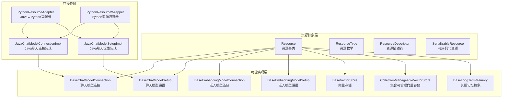
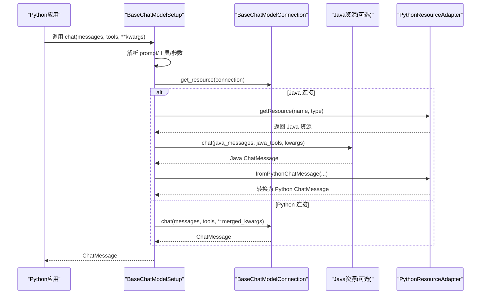
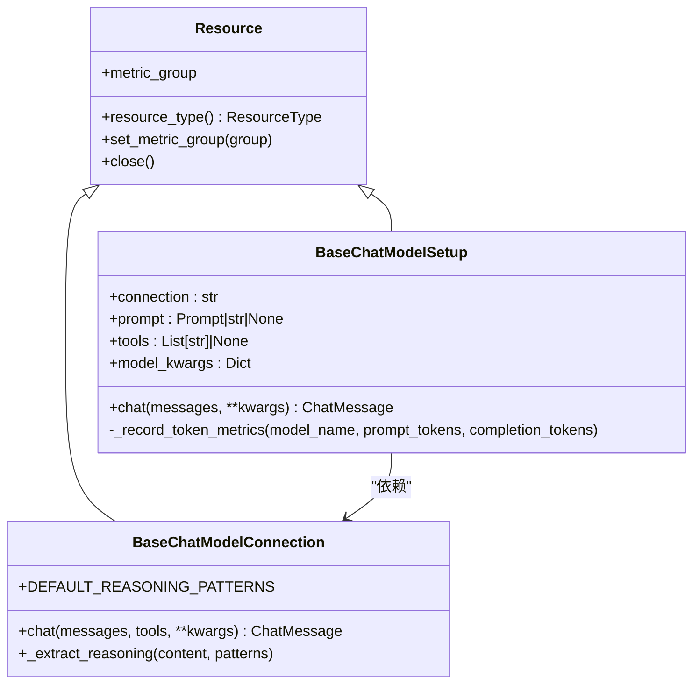
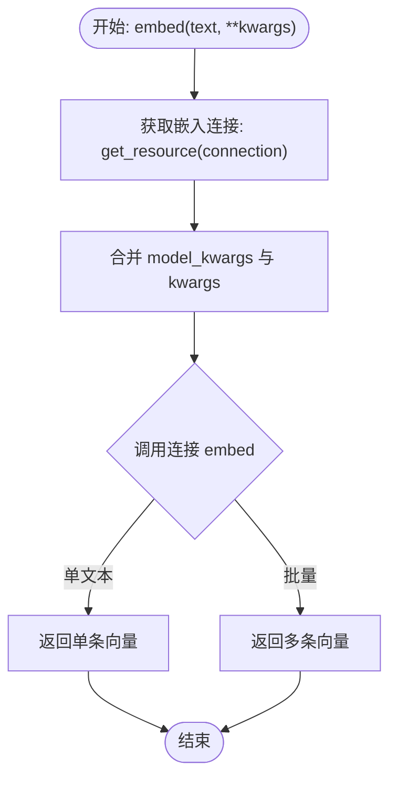
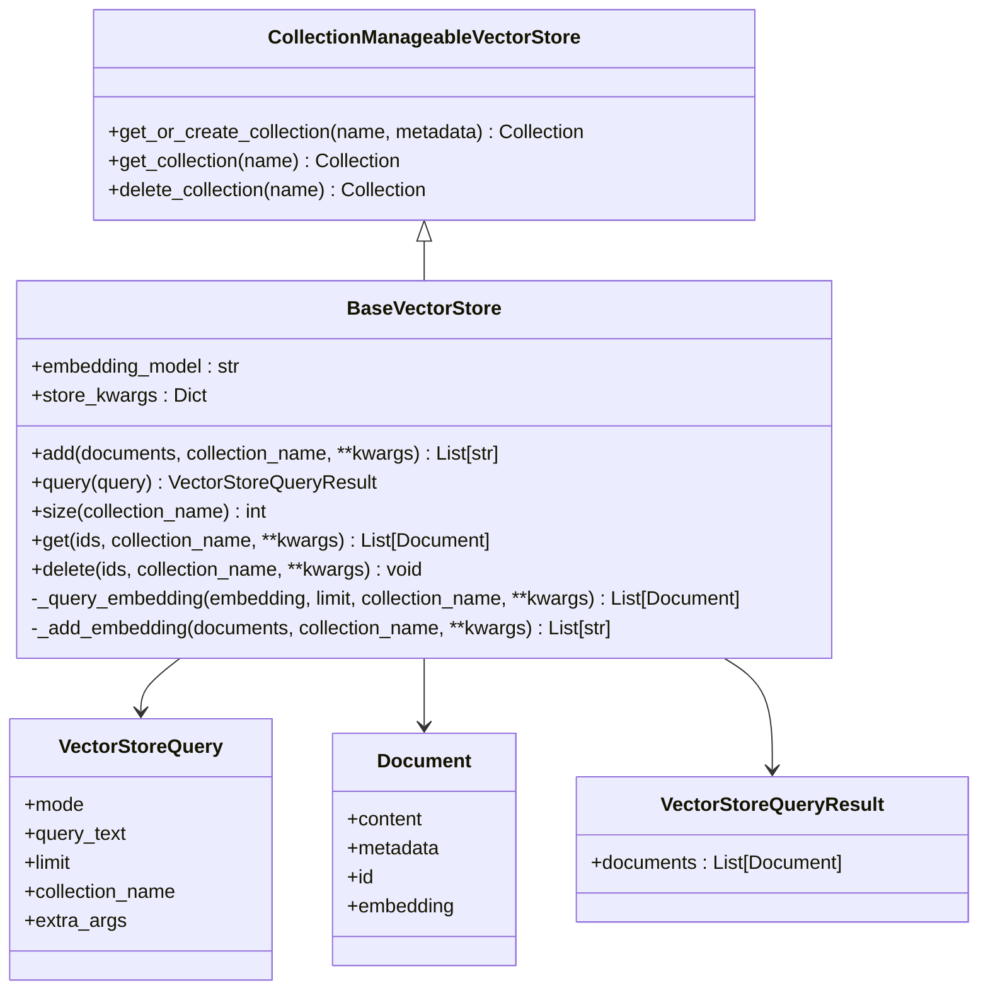
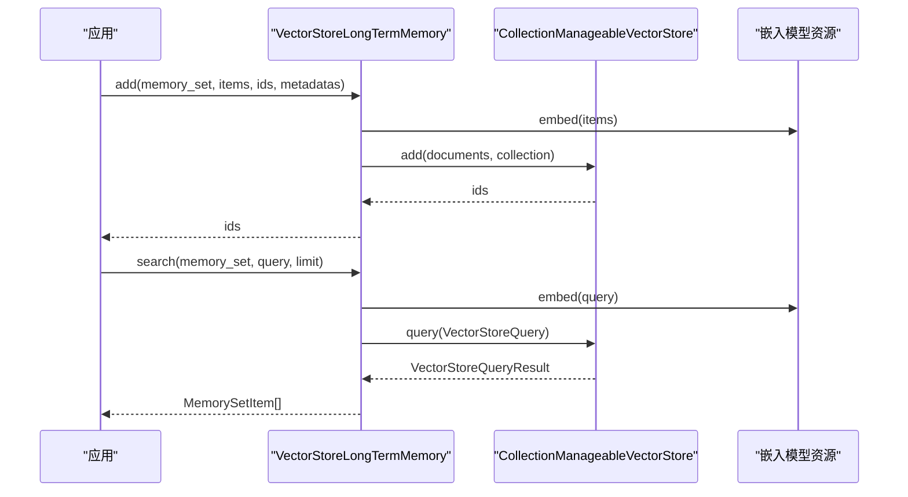
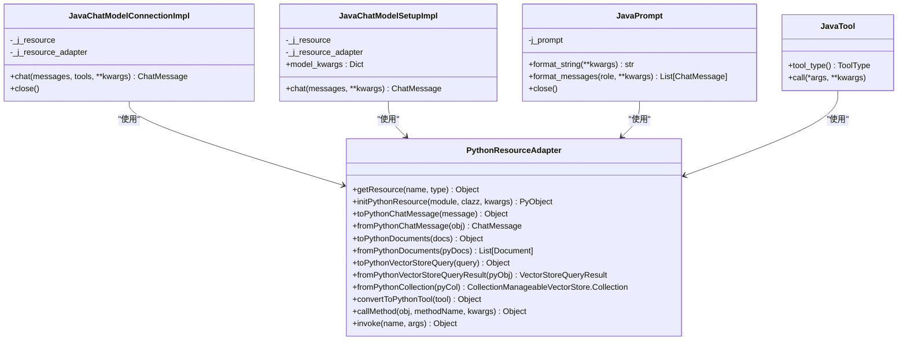
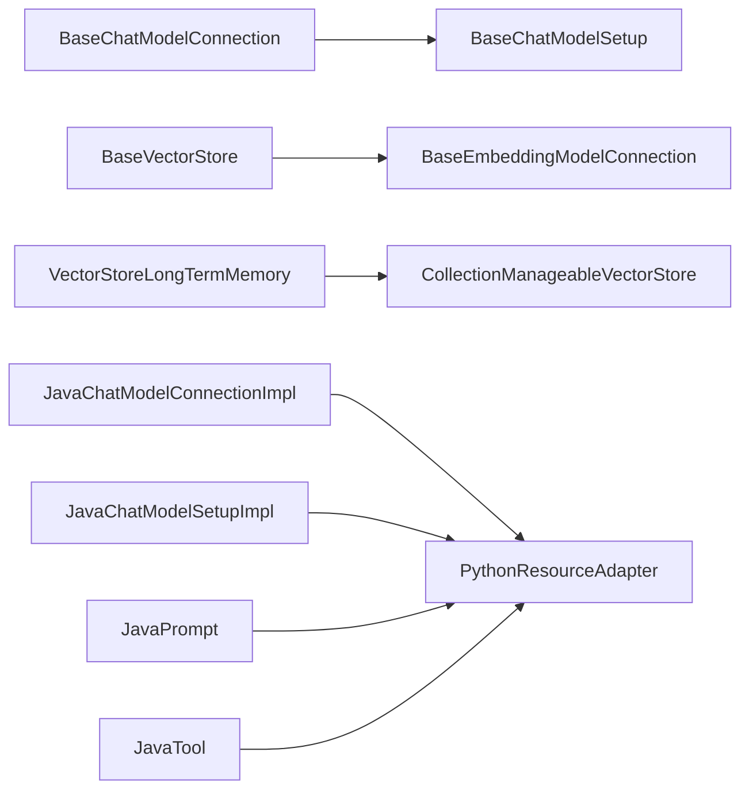

# Python 资源管理

<cite>
**本文引用的文件**
- [python/flink_agents/api/resource.py](file://python/flink_agents/api/resource.py)
- [python/flink_agents/api/chat_models/chat_model.py](file://python/flink_agents/api/chat_models/chat_model.py)
- [python/flink_agents/api/embedding_models/embedding_model.py](file://python/flink_agents/api/embedding_models/embedding_model.py)
- [python/flink_agents/api/vector_stores/vector_store.py](file://python/flink_agents/api/vector_stores/vector_store.py)
- [python/flink_agents/api/memory/long_term_memory.py](file://python/flink_agents/api/memory/long_term_memory.py)
- [python/flink_agents/runtime/java/java_resource_wrapper.py](file://python/flink_agents/runtime/java/java_resource_wrapper.py)
- [python/flink_agents/runtime/java/java_chat_model.py](file://python/flink_agents/runtime/java/java_chat_model.py)
- [python/flink_agents/runtime/memory/vector_store_long_term_memory.py](file://python/flink_agents/runtime/memory/vector_store_long_term_memory.py)
- [python/flink_agents/integrations/chat_models/ollama_chat_model.py](file://python/flink_agents/integrations/chat_models/ollama_chat_model.py)
- [python/flink_agents/integrations/embedding_models/local/ollama_embedding_model.py](file://python/flink_agents/integrations/embedding_models/local/ollama_embedding_model.py)
- [python/flink_agents/integrations/vector_stores/chroma/chroma_vector_store.py](file://python/flink_agents/integrations/vector_stores/chroma/chroma_vector_store.py)
- [api/src/main/java/org/apache/flink/agents/api/resource/python/PythonResourceAdapter.java](file://api/src/main/java/org/apache/flink/agents/api/resource/python/PythonResourceAdapter.java)
- [api/src/main/java/org/apache/flink/agents/api/resource/python/PythonResourceWrapper.java](file://api/src/main/java/org/apache/flink/agents/api/resource/python/PythonResourceWrapper.java)
- [api/src/main/java/org/apache/flink/agents/api/embedding/model/python/PythonEmbeddingModelConnection.java](file://api/src/main/java/org/apache/flink/agents/api/embedding/model/python/PythonEmbeddingModelConnection.java)
- [api/src/main/java/org/apache/flink/agents/api/vectorstores/python/PythonVectorStore.java](file://api/src/main/java/org/apache/flink/agents/api/vectorstores/python/PythonVectorStore.java)
</cite>

## 目录
1. [简介](#简介)
2. [项目结构](#项目结构)
3. [核心组件](#核心组件)
4. [架构总览](#架构总览)
5. [详细组件分析](#详细组件分析)
6. [依赖关系分析](#依赖关系分析)
7. [性能考虑](#性能考虑)
8. [故障排查指南](#故障排查指南)
9. [结论](#结论)
10. [附录：完整示例与最佳实践](#附录完整示例与最佳实践)

## 简介
本文件面向 Python 开发者，系统性梳理 Apache Flink Agents 在 Python 环境中的“资源管理”能力，覆盖以下主题：
- Python 聊天模型接口：ChatModel 基类、连接与设置分离、参数合并与指标记录
- Python 嵌入模型：嵌入向量生成、模型初始化与性能优化
- Python 向量存储接口：文档存储、查询检索、集合管理与索引策略
- Python 长期记忆系统：内存对象管理、数据持久化、压缩与访问控制
- Python 资源管理示例：如何在 Python 中集成外部资源（聊天、嵌入、向量存储）
- Python 与 Java 资源互操作：数据序列化与类型转换、适配器与包装器
- 最佳实践、错误处理与性能调优建议

## 项目结构
Flink Agents 的 Python 资源管理由三层组成：
- 资源抽象层：定义资源类型、描述符、可序列化约束与名称空间
- 功能实现层：聊天模型、嵌入模型、向量存储、长期记忆的具体实现
- 互操作层：Java 与 Python 的桥接适配器与包装器

图表来源
- [python/flink_agents/api/resource.py](file://python/flink_agents/api/resource.py#L46-L95)
- [python/flink_agents/api/chat_models/chat_model.py](file://python/flink_agents/api/chat_models/chat_model.py#L31-L149)
- [python/flink_agents/api/embedding_models/embedding_model.py](file://python/flink_agents/api/embedding_models/embedding_model.py#L27-L81)
- [python/flink_agents/api/vector_stores/vector_store.py](file://python/flink_agents/api/vector_stores/vector_store.py#L136-L152)
- [python/flink_agents/runtime/java/java_chat_model.py](file://python/flink_agents/runtime/java/java_chat_model.py#L31-L155)
- [api/src/main/java/org/apache/flink/agents/api/resource/python/PythonResourceAdapter.java](file://api/src/main/java/org/apache/flink/agents/api/resource/python/PythonResourceAdapter.java#L37-L140)
- [api/src/main/java/org/apache/flink/agents/api/resource/python/PythonResourceWrapper.java](file://api/src/main/java/org/apache/flink/agents/api/resource/python/PythonResourceWrapper.java#L24-L32)

章节来源
- [python/flink_agents/api/resource.py](file://python/flink_agents/api/resource.py#L29-L95)
- [python/flink_agents/api/chat_models/chat_model.py](file://python/flink_agents/api/chat_models/chat_model.py#L31-L149)
- [python/flink_agents/api/embedding_models/embedding_model.py](file://python/flink_agents/api/embedding_models/embedding_model.py#L27-L81)
- [python/flink_agents/api/vector_stores/vector_store.py](file://python/flink_agents/api/vector_stores/vector_store.py#L136-L152)
- [python/flink_agents/runtime/java/java_chat_model.py](file://python/flink_agents/runtime/java/java_chat_model.py#L31-L155)
- [api/src/main/java/org/apache/flink/agents/api/resource/python/PythonResourceAdapter.java](file://api/src/main/java/org/apache/flink/agents/api/resource/python/PythonResourceAdapter.java#L37-L140)
- [api/src/main/java/org/apache/flink/agents/api/resource/python/PythonResourceWrapper.java](file://api/src/main/java/org/apache/flink/agents/api/resource/python/PythonResourceWrapper.java#L24-L32)

## 核心组件
- 资源类型与描述符
  - 资源类型枚举覆盖聊天模型、嵌入模型、向量存储、提示词、工具、MCP 服务器等
  - 资源描述符用于序列化/反序列化资源类，支持动态导入与相等性比较
- 可序列化资源
  - 通过 Pydantic 校验确保资源可 JSON 序列化，便于跨语言传递
- 资源名称空间
  - 提供 Python 实现与 Java 实现的统一命名，便于在计划中声明与解析

章节来源
- [python/flink_agents/api/resource.py](file://python/flink_agents/api/resource.py#L29-L95)
- [python/flink_agents/api/resource.py](file://python/flink_agents/api/resource.py#L107-L198)
- [python/flink_agents/api/resource.py](file://python/flink_agents/api/resource.py#L215-L318)

## 架构总览
Python 资源管理通过“连接-设置”分层设计，结合可选的 Java 互操作层，形成统一的资源生命周期与调用链。

图表来源
- [python/flink_agents/api/chat_models/chat_model.py](file://python/flink_agents/api/chat_models/chat_model.py#L151-L210)
- [python/flink_agents/runtime/java/java_chat_model.py](file://python/flink_agents/runtime/java/java_chat_model.py#L55-L82)
- [api/src/main/java/org/apache/flink/agents/api/resource/python/PythonResourceAdapter.java](file://api/src/main/java/org/apache/flink/agents/api/resource/python/PythonResourceAdapter.java#L39-L72)

## 详细组件分析

### 聊天模型接口
- BaseChatModelConnection
  - 负责连接级配置（如 base_url、超时、模型名、鉴权），提供直接聊天接口
  - 支持从响应中提取推理内容（正则模式）并清洗
- BaseChatModelSetup
  - 负责设置级配置（prompt、tools、generation 参数），内部委托连接执行
  - 统一参数合并、prompt 模板填充、工具绑定与响应处理
  - 记录 token 使用指标到 MetricGroup

图表来源
- [python/flink_agents/api/chat_models/chat_model.py](file://python/flink_agents/api/chat_models/chat_model.py#L31-L149)
- [python/flink_agents/api/chat_models/chat_model.py](file://python/flink_agents/api/chat_models/chat_model.py#L151-L232)

章节来源
- [python/flink_agents/api/chat_models/chat_model.py](file://python/flink_agents/api/chat_models/chat_model.py#L31-L149)
- [python/flink_agents/api/chat_models/chat_model.py](file://python/flink_agents/api/chat_models/chat_model.py#L151-L232)

### 嵌入模型接口
- BaseEmbeddingModelConnection
  - 负责嵌入服务连接配置，提供 embed 接口（单文本或批量）
- BaseEmbeddingModelSetup
  - 负责嵌入模型设置（connection、model），内部委托连接执行
  - 统一参数合并后调用连接的 embed

图表来源
- [python/flink_agents/api/embedding_models/embedding_model.py](file://python/flink_agents/api/embedding_models/embedding_model.py#L88-L108)

章节来源
- [python/flink_agents/api/embedding_models/embedding_model.py](file://python/flink_agents/api/embedding_models/embedding_model.py#L27-L81)
- [python/flink_agents/api/embedding_models/embedding_model.py](file://python/flink_agents/api/embedding_models/embedding_model.py#L88-L108)

### 向量存储接口
- VectorStoreQuery/Document/VectorStoreQueryResult
  - 结构化查询对象，支持语义检索、限制结果数、集合名与额外参数
- BaseVectorStore
  - 对外提供 add/query/get/delete 等操作；内部通过嵌入模型生成向量
  - 抽象出 _add_embedding/_query_embedding 以适配不同后端
- CollectionManageableVectorStore
  - 支持集合的创建/获取/删除

图表来源
- [python/flink_agents/api/vector_stores/vector_store.py](file://python/flink_agents/api/vector_stores/vector_store.py#L43-L152)
- [python/flink_agents/api/vector_stores/vector_store.py](file://python/flink_agents/api/vector_stores/vector_store.py#L136-L312)

章节来源
- [python/flink_agents/api/vector_stores/vector_store.py](file://python/flink_agents/api/vector_stores/vector_store.py#L28-L152)
- [python/flink_agents/api/vector_stores/vector_store.py](file://python/flink_agents/api/vector_stores/vector_store.py#L136-L312)

### 长期记忆系统
- BaseLongTermMemory
  - 定义集合的创建、获取、删除、大小、增删改查等抽象
- VectorStoreLongTermMemory
  - 基于集合可管理的向量存储实现，支持异步压缩、指标上报、键空间隔离
  - 将内存项序列化为文档写入向量集合，读取时反序列化

图表来源
- [python/flink_agents/runtime/memory/vector_store_long_term_memory.py](file://python/flink_agents/runtime/memory/vector_store_long_term_memory.py#L157-L248)
- [python/flink_agents/api/memory/long_term_memory.py](file://python/flink_agents/api/memory/long_term_memory.py#L183-L301)

章节来源
- [python/flink_agents/api/memory/long_term_memory.py](file://python/flink_agents/api/memory/long_term_memory.py#L57-L301)
- [python/flink_agents/runtime/memory/vector_store_long_term_memory.py](file://python/flink_agents/runtime/memory/vector_store_long_term_memory.py#L53-L329)

### Python 与 Java 资源互操作
- Java 资源包装器
  - JavaChatModelConnectionImpl/JavaChatModelSetupImpl：将 Python 消息与工具转换为 Java 对象，调用 Java 资源后转换回 Python
  - JavaPrompt/JavaTool：封装 Java Prompt/Tool，支持格式化与关闭
- Java 适配器接口
  - PythonResourceAdapter：提供资源获取、消息/文档/查询对象的双向转换、方法调用等
  - PythonResourceWrapper：暴露底层 Python 资源对象

图表来源
- [python/flink_agents/runtime/java/java_chat_model.py](file://python/flink_agents/runtime/java/java_chat_model.py#L31-L155)
- [python/flink_agents/runtime/java/java_resource_wrapper.py](file://python/flink_agents/runtime/java/java_resource_wrapper.py#L29-L80)
- [api/src/main/java/org/apache/flink/agents/api/resource/python/PythonResourceAdapter.java](file://api/src/main/java/org/apache/flink/agents/api/resource/python/PythonResourceAdapter.java#L37-L140)
- [api/src/main/java/org/apache/flink/agents/api/resource/python/PythonResourceWrapper.java](file://api/src/main/java/org/apache/flink/agents/api/resource/python/PythonResourceWrapper.java#L24-L32)

章节来源
- [python/flink_agents/runtime/java/java_chat_model.py](file://python/flink_agents/runtime/java/java_chat_model.py#L31-L155)
- [python/flink_agents/runtime/java/java_resource_wrapper.py](file://python/flink_agents/runtime/java/java_resource_wrapper.py#L29-L80)
- [api/src/main/java/org/apache/flink/agents/api/resource/python/PythonResourceAdapter.java](file://api/src/main/java/org/apache/flink/agents/api/resource/python/PythonResourceAdapter.java#L37-L140)
- [api/src/main/java/org/apache/flink/agents/api/resource/python/PythonResourceWrapper.java](file://api/src/main/java/org/apache/flink/agents/api/resource/python/PythonResourceWrapper.java#L24-L32)

## 依赖关系分析
- 资源依赖
  - ChatModelSetup 依赖 ChatModelConnection
  - VectorStore 依赖 EmbeddingModel
  - VectorStoreLongTermMemory 依赖 CollectionManageableVectorStore
- Java 互操作
  - Java 实现通过适配器进行消息/文档/查询对象的双向转换
  - Python 资源包装器暴露底层资源以便 Java 侧直接调用

图表来源
- [python/flink_agents/api/chat_models/chat_model.py](file://python/flink_agents/api/chat_models/chat_model.py#L151-L210)
- [python/flink_agents/api/vector_stores/vector_store.py](file://python/flink_agents/api/vector_stores/vector_store.py#L186-L231)
- [python/flink_agents/runtime/memory/vector_store_long_term_memory.py](file://python/flink_agents/runtime/memory/vector_store_long_term_memory.py#L106-L140)
- [python/flink_agents/runtime/java/java_chat_model.py](file://python/flink_agents/runtime/java/java_chat_model.py#L55-L82)
- [api/src/main/java/org/apache/flink/agents/api/resource/python/PythonResourceAdapter.java](file://api/src/main/java/org/apache/flink/agents/api/resource/python/PythonResourceAdapter.java#L37-L140)

章节来源
- [python/flink_agents/api/chat_models/chat_model.py](file://python/flink_agents/api/chat_models/chat_model.py#L151-L210)
- [python/flink_agents/api/vector_stores/vector_store.py](file://python/flink_agents/api/vector_stores/vector_store.py#L186-L231)
- [python/flink_agents/runtime/memory/vector_store_long_term_memory.py](file://python/flink_agents/runtime/memory/vector_store_long_term_memory.py#L106-L140)
- [python/flink_agents/runtime/java/java_chat_model.py](file://python/flink_agents/runtime/java/java_chat_model.py#L55-L82)
- [api/src/main/java/org/apache/flink/agents/api/resource/python/PythonResourceAdapter.java](file://api/src/main/java/org/apache/flink/agents/api/resource/python/PythonResourceAdapter.java#L37-L140)

## 性能考虑
- 批量嵌入与分块
  - 向量存储 add 时对文档进行分块，避免单次请求过大
  - 嵌入模型支持批量输入，减少往返次数
- 查询参数合并
  - 设置级参数与查询级参数合并，避免重复构造
- 异步压缩
  - 长期记忆达到容量阈值时可异步触发压缩，降低主线程阻塞
- 指标与日志
  - 记录 token 使用与异常处理，便于定位性能瓶颈

## 故障排查指南
- 资源不可序列化
  - 确保资源可通过 model_dump_json 序列化；检查 ResourceDescriptor 的 target_module/target_clazz 是否正确
- Java 互操作异常
  - 检查 PythonResourceAdapter 的方法签名与对象类型；确认消息/文档/查询对象转换是否正确
- 嵌入失败
  - 核对嵌入模型参数（如模型名、keep_alive、truncate）与服务端兼容性
- 向量存储异常
  - 检查集合是否存在、元数据是否为空、查询过滤条件是否合法
- 长期记忆异常
  - 关注异步压缩回调中的异常；核对集合命名与键空间隔离

章节来源
- [python/flink_agents/api/resource.py](file://python/flink_agents/api/resource.py#L100-L104)
- [python/flink_agents/runtime/java/java_chat_model.py](file://python/flink_agents/runtime/java/java_chat_model.py#L75-L82)
- [python/flink_agents/runtime/memory/vector_store_long_term_memory.py](file://python/flink_agents/runtime/memory/vector_store_long_term_memory.py#L286-L294)

## 结论
Flink Agents 的 Python 资源管理以“连接-设置”分层与可序列化资源为核心，结合 Java 互操作适配器，实现了聊天、嵌入、向量存储与长期记忆的统一抽象。通过结构化查询、集合管理与异步压缩，系统在易用性与性能之间取得平衡。开发者可基于本文档快速集成外部资源并实现跨语言协作。

## 附录：完整示例与最佳实践
- 示例：在 Python 中集成 Ollama 聊天与嵌入
  - 聊天连接：参考 OllamaChatModelConnection 的连接参数与消息转换
  - 嵌入连接：参考 OllamaEmbeddingModelConnection 的嵌入参数与批量处理
  - 向量存储：参考 ChromaVectorStore 的集合管理与分块添加
- 最佳实践
  - 明确“连接-设置”职责边界，避免在设置中混入连接细节
  - 使用 ResourceDescriptor 统一资源声明，便于跨语言解析
  - 对大文本进行分块与批量化处理，提升吞吐
  - 合理设置长期记忆容量与压缩策略，平衡存储与检索效率
  - 在 Java 互操作场景下，严格校验消息/文档/查询对象的类型与字段

章节来源
- [python/flink_agents/integrations/chat_models/ollama_chat_model.py](file://python/flink_agents/integrations/chat_models/ollama_chat_model.py#L36-L168)
- [python/flink_agents/integrations/embedding_models/local/ollama_embedding_model.py](file://python/flink_agents/integrations/embedding_models/local/ollama_embedding_model.py#L31-L98)
- [python/flink_agents/integrations/vector_stores/chroma/chroma_vector_store.py](file://python/flink_agents/integrations/vector_stores/chroma/chroma_vector_store.py#L58-L406)
- [python/flink_agents/runtime/java/java_chat_model.py](file://python/flink_agents/runtime/java/java_chat_model.py#L55-L82)
- [api/src/main/java/org/apache/flink/agents/api/embedding/model/python/PythonEmbeddingModelConnection.java](file://api/src/main/java/org/apache/flink/agents/api/embedding/model/python/PythonEmbeddingModelConnection.java#L68-L121)
- [api/src/main/java/org/apache/flink/agents/api/vectorstores/python/PythonVectorStore.java](file://api/src/main/java/org/apache/flink/agents/api/vectorstores/python/PythonVectorStore.java#L74-L132)