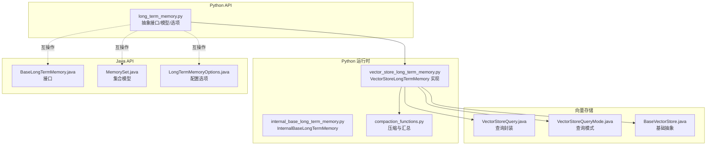
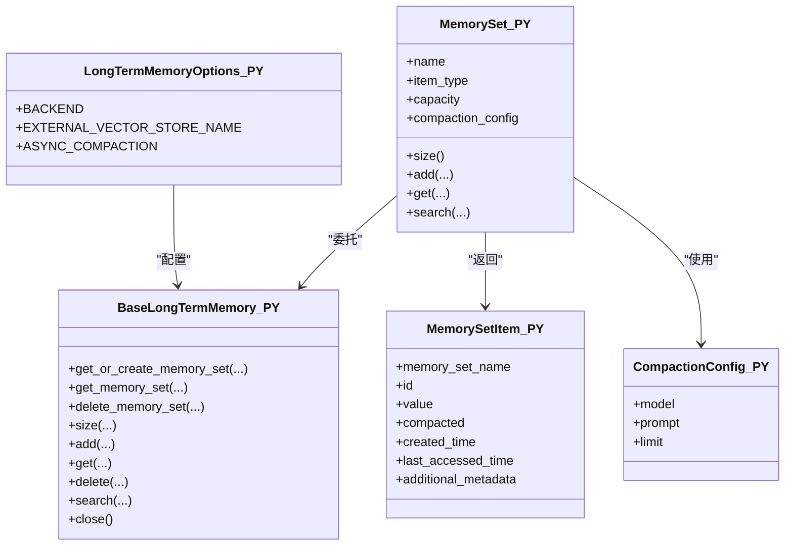
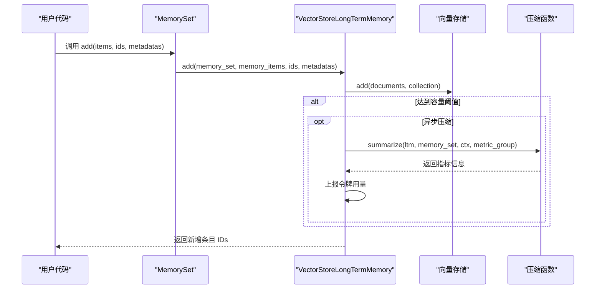
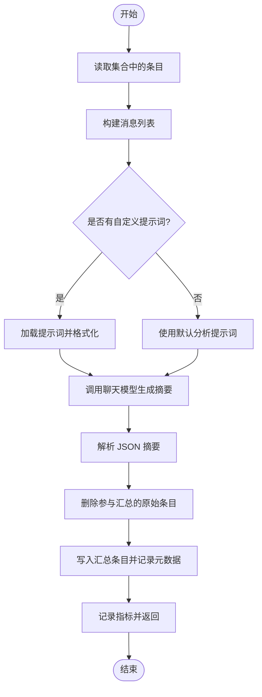
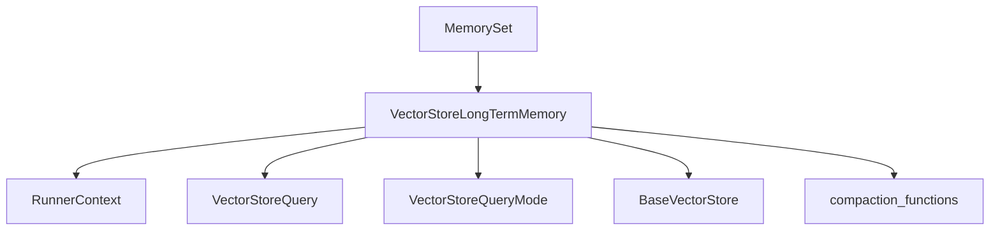

# Python 长期记忆

<cite>
**本文引用的文件**   
- [python/flink_agents/api/memory/long_term_memory.py](file://python/flink_agents/api/memory/long_term_memory.py)
- [python/flink_agents/runtime/memory/vector_store_long_term_memory.py](file://python/flink_agents/runtime/memory/vector_store_long_term_memory.py)
- [python/flink_agents/runtime/memory/internal_base_long_term_memory.py](file://python/flink_agents/runtime/memory/internal_base_long_term_memory.py)
- [python/flink_agents/runtime/memory/compaction_functions.py](file://python/flink_agents/runtime/memory/compaction_functions.py)
- [api/src/main/java/org/apache/flink/agents/api/memory/BaseLongTermMemory.java](file://api/src/main/java/org/apache/flink/agents/api/memory/BaseLongTermMemory.java)
- [api/src/main/java/org/apache/flink/agents/api/memory/MemorySet.java](file://api/src/main/java/org/apache/flink/agents/api/memory/MemorySet.java)
- [api/src/main/java/org/apache/flink/agents/api/memory/LongTermMemoryOptions.java](file://api/src/main/java/org/apache/flink/agents/api/memory/LongTermMemoryOptions.java)
- [api/src/main/java/org/apache/flink/agents/api/vectorstores/VectorStoreQuery.java](file://api/src/main/java/org/apache/flink/agents/api/vectorstores/VectorStoreQuery.java)
- [api/src/main/java/org/apache/flink/agents/api/vectorstores/VectorStoreQueryMode.java](file://api/src/main/java/org/apache/flink/agents/api/vectorstores/VectorStoreQueryMode.java)
- [api/src/main/java/org/apache/flink/agents/api/vectorstores/BaseVectorStore.java](file://api/src/main/java/org/apache/flink/agents/api/vectorstores/BaseVectorStore.java)
- [python/flink_agents/e2e_tests/e2e_tests_integration/long_term_memory_test.py](file://python/flink_agents/e2e_tests/e2e_tests_integration/long_term_memory_test.py)
- [e2e-test/flink-agents-end-to-end-tests-integration/src/test/java/org/apache/flink/agents/integration/test/VectorStoreLongTermMemoryTest.java](file://e2e-test/flink-agents-end-to-end-tests-integration/src/test/java/org/apache/flink/agents/integration/test/VectorStoreLongTermMemoryTest.java)
- [python/flink_agents/runtime/local_execution_environment.py](file://python/flink_agents/runtime/local_execution_environment.py)
</cite>

## 目录
1. [引言](#引言)
2. [项目结构](#项目结构)
3. [核心组件](#核心组件)
4. [架构总览](#架构总览)
5. [详细组件分析](#详细组件分析)
6. [依赖关系分析](#依赖关系分析)
7. [性能考量](#性能考量)
8. [故障排查指南](#故障排查指南)
9. [结论](#结论)
10. [附录：使用示例与最佳实践](#附录使用示例与最佳实践)

## 引言
本文件面向 Apache Flink Agents 的 Python 长期记忆系统，系统性梳理其基础架构、接口设计、实现细节与跨语言互操作机制。重点覆盖以下方面：
- 长期记忆接口与模型定义（Python 侧）
- 基于向量存储的长期记忆实现（VectorStoreLongTermMemory）
- 记忆集合管理、检索、持久化与压缩（压缩与汇总）
- 与 Java 长期记忆接口的互操作与配置映射
- 性能特征、扩展性与适用场景
- 缓存策略、数据压缩与错误处理最佳实践
- 完整的使用示例与测试用例路径

## 项目结构
围绕 Python 长期记忆的关键模块分布如下：
- Python API 层：定义抽象接口、模型与选项
- Python 运行时层：基于向量存储的具体实现、压缩函数与内部基类
- Java API 层：与 Python 对应的接口与模型，用于跨语言互操作
- 向量存储层：查询模式、查询参数与基础向量存储抽象
- 测试与端到端验证：本地与流式执行环境下的用例



**图表来源**
- [python/flink_agents/api/memory/long_term_memory.py](file://python/flink_agents/api/memory/long_term_memory.py#L183-L305)
- [python/flink_agents/runtime/memory/vector_store_long_term_memory.py](file://python/flink_agents/runtime/memory/vector_store_long_term_memory.py#L52-L329)
- [python/flink_agents/runtime/memory/internal_base_long_term_memory.py](file://python/flink_agents/runtime/memory/internal_base_long_term_memory.py#L23-L37)
- [python/flink_agents/runtime/memory/compaction_functions.py](file://python/flink_agents/runtime/memory/compaction_functions.py#L62-L186)
- [api/src/main/java/org/apache/flink/agents/api/memory/BaseLongTermMemory.java](file://api/src/main/java/org/apache/flink/agents/api/memory/BaseLongTermMemory.java#L33-L134)
- [api/src/main/java/org/apache/flink/agents/api/memory/MemorySet.java](file://api/src/main/java/org/apache/flink/agents/api/memory/MemorySet.java#L32-L160)
- [api/src/main/java/org/apache/flink/agents/api/memory/LongTermMemoryOptions.java](file://api/src/main/java/org/apache/flink/agents/api/memory/LongTermMemoryOptions.java#L22-L53)
- [api/src/main/java/org/apache/flink/agents/api/vectorstores/VectorStoreQuery.java](file://api/src/main/java/org/apache/flink/agents/api/vectorstores/VectorStoreQuery.java#L63-L109)
- [api/src/main/java/org/apache/flink/agents/api/vectorstores/VectorStoreQueryMode.java](file://api/src/main/java/org/apache/flink/agents/api/vectorstores/VectorStoreQueryMode.java#L36-L61)
- [api/src/main/java/org/apache/flink/agents/api/vectorstores/BaseVectorStore.java](file://api/src/main/java/org/apache/flink/agents/api/vectorstores/BaseVectorStore.java#L38-L60)

**章节来源**
- [python/flink_agents/api/memory/long_term_memory.py](file://python/flink_agents/api/memory/long_term_memory.py#L1-L305)
- [python/flink_agents/runtime/memory/vector_store_long_term_memory.py](file://python/flink_agents/runtime/memory/vector_store_long_term_memory.py#L1-L329)
- [api/src/main/java/org/apache/flink/agents/api/memory/BaseLongTermMemory.java](file://api/src/main/java/org/apache/flink/agents/api/memory/BaseLongTermMemory.java#L1-L134)

## 核心组件
- 抽象接口与模型（Python）：定义长期记忆抽象、记忆集合、项模型、压缩配置与选项；提供 Pydantic 模型序列化/反序列化支持。
- 具体实现（VectorStoreLongTermMemory）：以可管理集合的向量存储为后端，负责添加、检索、删除、搜索与关闭时度量上报；支持异步压缩。
- 内部基类（InternalBaseLongTermMemory）：隐藏给用户的内部接口，暴露上下文切换能力。
- 压缩函数（compaction_functions）：从集合中读取项，调用聊天模型生成摘要，删除原始项并写入汇总项，同时记录令牌用量等指标。
- Java 互操作接口：MemorySet、BaseLongTermMemory 与 LongTermMemoryOptions，确保 Python 与 Java 在概念与配置上一致。

**章节来源**
- [python/flink_agents/api/memory/long_term_memory.py](file://python/flink_agents/api/memory/long_term_memory.py#L37-L305)
- [python/flink_agents/runtime/memory/vector_store_long_term_memory.py](file://python/flink_agents/runtime/memory/vector_store_long_term_memory.py#L52-L329)
- [python/flink_agents/runtime/memory/internal_base_long_term_memory.py](file://python/flink_agents/runtime/memory/internal_base_long_term_memory.py#L23-L37)
- [python/flink_agents/runtime/memory/compaction_functions.py](file://python/flink_agents/runtime/memory/compaction_functions.py#L62-L186)
- [api/src/main/java/org/apache/flink/agents/api/memory/BaseLongTermMemory.java](file://api/src/main/java/org/apache/flink/agents/api/memory/BaseLongTermMemory.java#L33-L134)
- [api/src/main/java/org/apache/flink/agents/api/memory/MemorySet.java](file://api/src/main/java/org/apache/flink/agents/api/memory/MemorySet.java#L32-L160)
- [api/src/main/java/org/apache/flink/agents/api/memory/LongTermMemoryOptions.java](file://api/src/main/java/org/apache/flink/agents/api/memory/LongTermMemoryOptions.java#L22-L53)

## 架构总览
Python 长期记忆通过“集合（MemorySet）+ 实现（VectorStoreLongTermMemory）”的分层设计，将业务语义与底层存储解耦。实现类依赖 RunnerContext 获取资源（如向量存储与聊天模型），并在容量达到阈值时触发压缩流程。

```mermaid
classDiagram
class BaseLongTermMemory_PY {
<<abstract>>
+get_or_create_memory_set(...)
+get_memory_set(...)
+delete_memory_set(...)
+size(...)
+add(...)
+get(...)
+delete(...)
+search(...)
+close()
}
class MemorySet_PY {
+name
+item_type
+capacity
+compaction_config
+size()
+add(...)
+get(...)
+search(...)
}
class VectorStoreLongTermMemory_PY {
+ctx
+vector_store
+job_id
+key
+async_compaction
+metric_group
+switch_context(key)
+get_or_create_memory_set(...)
+get_memory_set(...)
+delete_memory_set(...)
+size(...)
+add(...)
+get(...)
+delete(...)
+search(...)
+close()
}
class InternalBaseLongTermMemory_PY {
<<abstract>>
+switch_context(key)
}
class CompactionFunctions_PY {
+summarize(ltm, memory_set, ctx, metric_group, ids)
}
class BaseLongTermMemory_JAVA {
<<interface>>
}
class MemorySet_JAVA {
}
class LongTermMemoryOptions_JAVA {
}
BaseLongTermMemory_PY <|-- InternalBaseLongTermMemory_PY
InternalBaseLongTermMemory_PY <|-- VectorStoreLongTermMemory_PY
MemorySet_PY --> BaseLongTermMemory_PY : "委托"
VectorStoreLongTermMemory_PY --> CompactionFunctions_PY : "调用"
BaseLongTermMemory_PY -.互操作.-> BaseLongTermMemory_JAVA
MemorySet_PY -.互操作.-> MemorySet_JAVA
MemorySet_PY -.配置.-> LongTermMemoryOptions_JAVA
```

**图表来源**
- [python/flink_agents/api/memory/long_term_memory.py](file://python/flink_agents/api/memory/long_term_memory.py#L183-L305)
- [python/flink_agents/runtime/memory/internal_base_long_term_memory.py](file://python/flink_agents/runtime/memory/internal_base_long_term_memory.py#L23-L37)
- [python/flink_agents/runtime/memory/vector_store_long_term_memory.py](file://python/flink_agents/runtime/memory/vector_store_long_term_memory.py#L52-L329)
- [python/flink_agents/runtime/memory/compaction_functions.py](file://python/flink_agents/runtime/memory/compaction_functions.py#L62-L186)
- [api/src/main/java/org/apache/flink/agents/api/memory/BaseLongTermMemory.java](file://api/src/main/java/org/apache/flink/agents/api/memory/BaseLongTermMemory.java#L33-L134)
- [api/src/main/java/org/apache/flink/agents/api/memory/MemorySet.java](file://api/src/main/java/org/apache/flink/agents/api/memory/MemorySet.java#L32-L160)
- [api/src/main/java/org/apache/flink/agents/api/memory/LongTermMemoryOptions.java](file://api/src/main/java/org/apache/flink/agents/api/memory/LongTermMemoryOptions.java#L22-L53)

## 详细组件分析

### 抽象接口与模型（Python）
- BaseLongTermMemory：定义集合的创建、获取、删除、计数、新增、检索、删除条目、语义检索与关闭。
- MemorySet：封装集合名称、条目类型、容量与压缩配置，并在运行时持有对具体实现的引用，提供便捷方法。
- MemorySetItem：检索返回的条目模型，包含 ID、值、是否已压缩、创建时间、最后访问时间与附加元数据。
- CompactionConfig：压缩配置，包含模型名、提示词（可选）、限制数量。
- 选项 LongTermMemoryOptions：后端类型、外部向量存储名称、异步压缩开关等。



**图表来源**
- [python/flink_agents/api/memory/long_term_memory.py](file://python/flink_agents/api/memory/long_term_memory.py#L183-L305)

**章节来源**
- [python/flink_agents/api/memory/long_term_memory.py](file://python/flink_agents/api/memory/long_term_memory.py#L37-L305)

### VectorStoreLongTermMemory 实现
- 上下文与资源：通过 RunnerContext 获取向量存储与指标组；支持按 key 切换上下文隔离。
- 集合命名：内部对集合名进行“作业ID-键-原名”的规范化，避免冲突。
- 存储与检索：将条目序列化为文档，写入向量存储；检索时转换回 MemorySetItem。
- 压缩：当集合大小达到容量阈值时，根据配置决定同步或异步执行压缩；压缩完成后上报令牌用量指标。
- 异常处理：异步压缩异常通过回调抛出，便于定位失败集合。



**图表来源**
- [python/flink_agents/runtime/memory/vector_store_long_term_memory.py](file://python/flink_agents/runtime/memory/vector_store_long_term_memory.py#L156-L221)
- [python/flink_agents/runtime/memory/compaction_functions.py](file://python/flink_agents/runtime/memory/compaction_functions.py#L62-L135)

**章节来源**
- [python/flink_agents/runtime/memory/vector_store_long_term_memory.py](file://python/flink_agents/runtime/memory/vector_store_long_term_memory.py#L52-L329)

### 压缩与汇总（Compaction）
- 数据读取：从长期记忆中获取全部或指定条目。
- 提示词与输入变量：根据条目类型构造消息列表；若未提供自定义提示词则使用默认模板。
- 汇总生成：调用聊天模型生成 JSON 结构的摘要，包含主题与对应的消息索引。
- 写回与清理：删除参与汇总的原始条目，写入一条汇总条目，并记录压缩标记与时间范围。
- 指标上报：将模型名与令牌用量写入队列，由实现类统一上报。



**图表来源**
- [python/flink_agents/runtime/memory/compaction_functions.py](file://python/flink_agents/runtime/memory/compaction_functions.py#L62-L186)

**章节来源**
- [python/flink_agents/runtime/memory/compaction_functions.py](file://python/flink_agents/runtime/memory/compaction_functions.py#L62-L186)

### 互操作机制（Python ↔ Java）
- 接口与模型映射：Python 的 BaseLongTermMemory、MemorySet 与 Java 的 BaseLongTermMemory、MemorySet 在职责与字段上一一对应。
- 配置映射：Python 的 LongTermMemoryOptions 与 Java 的 LongTermMemoryOptions 含义一致，均用于选择后端、指定外部向量存储与控制异步压缩。
- 查询与模式：Python 的 VectorStoreQuery 与 Java 的 VectorStoreQuery、VectorStoreQueryMode 在语义与参数上保持一致，确保跨语言查询行为一致。

```mermaid
graph LR
PY_LTM["Python BaseLongTermMemory"] -- 互操作 -- JAVA_LTM["Java BaseLongTermMemory"]
PY_SET["Python MemorySet"] -- 互操作 -- JAVA_SET["Java MemorySet"]
PY_OPTS["Python LongTermMemoryOptions"] -- 互操作 -- JAVA_OPTS["Java LongTermMemoryOptions"]
PY_QUERY["Python VectorStoreQuery"] -- 互操作 -- JAVA_QUERY["Java VectorStoreQuery"]
PY_MODE["Python VectorStoreQueryMode"] -- 互操作 -- JAVA_MODE["Java VectorStoreQueryMode"]
```

**图表来源**
- [python/flink_agents/api/memory/long_term_memory.py](file://python/flink_agents/api/memory/long_term_memory.py#L183-L305)
- [api/src/main/java/org/apache/flink/agents/api/memory/BaseLongTermMemory.java](file://api/src/main/java/org/apache/flink/agents/api/memory/BaseLongTermMemory.java#L33-L134)
- [api/src/main/java/org/apache/flink/agents/api/memory/MemorySet.java](file://api/src/main/java/org/apache/flink/agents/api/memory/MemorySet.java#L32-L160)
- [api/src/main/java/org/apache/flink/agents/api/memory/LongTermMemoryOptions.java](file://api/src/main/java/org/apache/flink/agents/api/memory/LongTermMemoryOptions.java#L22-L53)
- [api/src/main/java/org/apache/flink/agents/api/vectorstores/VectorStoreQuery.java](file://api/src/main/java/org/apache/flink/agents/api/vectorstores/VectorStoreQuery.java#L63-L109)
- [api/src/main/java/org/apache/flink/agents/api/vectorstores/VectorStoreQueryMode.java](file://api/src/main/java/org/apache/flink/agents/api/vectorstores/VectorStoreQueryMode.java#L36-L61)

**章节来源**
- [api/src/main/java/org/apache/flink/agents/api/memory/BaseLongTermMemory.java](file://api/src/main/java/org/apache/flink/agents/api/memory/BaseLongTermMemory.java#L33-L134)
- [api/src/main/java/org/apache/flink/agents/api/memory/MemorySet.java](file://api/src/main/java/org/apache/flink/agents/api/memory/MemorySet.java#L32-L160)
- [api/src/main/java/org/apache/flink/agents/api/memory/LongTermMemoryOptions.java](file://api/src/main/java/org/apache/flink/agents/api/memory/LongTermMemoryOptions.java#L22-L53)
- [api/src/main/java/org/apache/flink/agents/api/vectorstores/VectorStoreQuery.java](file://api/src/main/java/org/apache/flink/agents/api/vectorstores/VectorStoreQuery.java#L63-L109)
- [api/src/main/java/org/apache/flink/agents/api/vectorstores/VectorStoreQueryMode.java](file://api/src/main/java/org/apache/flink/agents/api/vectorstores/VectorStoreQueryMode.java#L36-L61)

## 依赖关系分析
- 组件耦合
  - VectorStoreLongTermMemory 依赖 RunnerContext 获取资源与指标组，耦合度适中，便于替换向量存储实现。
  - MemorySet 作为门面持有 BaseLongTermMemory 引用，降低上层对具体实现的感知。
  - 压缩函数独立于实现类，仅依赖抽象接口，具备良好可测试性。
- 外部依赖
  - 向量存储查询封装（VectorStoreQuery）与查询模式（VectorStoreQueryMode）保证了跨实现的一致性。
  - 基础向量存储抽象（BaseVectorStore）定义了嵌入模型参数与资源类型，便于扩展新后端。



**图表来源**
- [python/flink_agents/runtime/memory/vector_store_long_term_memory.py](file://python/flink_agents/runtime/memory/vector_store_long_term_memory.py#L52-L329)
- [api/src/main/java/org/apache/flink/agents/api/vectorstores/VectorStoreQuery.java](file://api/src/main/java/org/apache/flink/agents/api/vectorstores/VectorStoreQuery.java#L63-L109)
- [api/src/main/java/org/apache/flink/agents/api/vectorstores/VectorStoreQueryMode.java](file://api/src/main/java/org/apache/flink/agents/api/vectorstores/VectorStoreQueryMode.java#L36-L61)
- [api/src/main/java/org/apache/flink/agents/api/vectorstores/BaseVectorStore.java](file://api/src/main/java/org/apache/flink/agents/api/vectorstores/BaseVectorStore.java#L38-L60)
- [python/flink_agents/runtime/memory/compaction_functions.py](file://python/flink_agents/runtime/memory/compaction_functions.py#L62-L186)

**章节来源**
- [python/flink_agents/runtime/memory/vector_store_long_term_memory.py](file://python/flink_agents/runtime/memory/vector_store_long_term_memory.py#L52-L329)
- [api/src/main/java/org/apache/flink/agents/api/vectorstores/VectorStoreQuery.java](file://api/src/main/java/org/apache/flink/agents/api/vectorstores/VectorStoreQuery.java#L63-L109)
- [api/src/main/java/org/apache/flink/agents/api/vectorstores/VectorStoreQueryMode.java](file://api/src/main/java/org/apache/flink/agents/api/vectorstores/VectorStoreQueryMode.java#L36-L61)
- [api/src/main/java/org/apache/flink/agents/api/vectorstores/BaseVectorStore.java](file://api/src/main/java/org/apache/flink/agents/api/vectorstores/BaseVectorStore.java#L38-L60)
- [python/flink_agents/runtime/memory/compaction_functions.py](file://python/flink_agents/runtime/memory/compaction_functions.py#L62-L186)

## 性能考量
- 异步压缩：通过线程池提交压缩任务，避免阻塞主流程；适合高吞吐场景。
- 度量上报：在关闭阶段统一上报令牌用量，便于成本控制与容量规划。
- 集合命名隔离：通过“作业ID-键-原名”命名，支持多键隔离，减少跨键干扰。
- 压缩策略：当前实现对所有条目进行汇总，后续可引入分批摘要以规避上下文窗口限制。

[本节为通用性能讨论，不直接分析具体文件]

## 故障排查指南
- 异步压缩异常：异步压缩失败会通过回调抛出异常，建议检查聊天模型资源可用性与提示词配置。
- 令牌用量缺失：确认指标队列非空且指标组有效，避免因并发消费导致遗漏。
- 集合命名冲突：确保作业ID与键唯一，避免不同键的数据互相污染。
- 端到端验证：参考集成测试与端到端测试，核对集合创建、添加、检索与压缩后的结果。

**章节来源**
- [python/flink_agents/runtime/memory/vector_store_long_term_memory.py](file://python/flink_agents/runtime/memory/vector_store_long_term_memory.py#L286-L295)
- [python/flink_agents/runtime/memory/vector_store_long_term_memory.py](file://python/flink_agents/runtime/memory/vector_store_long_term_memory.py#L255-L272)
- [e2e-test/flink-agents-end-to-end-tests-integration/src/test/java/org/apache/flink/agents/integration/test/VectorStoreLongTermMemoryTest.java](file://e2e-test/flink-agents-end-to-end-tests-integration/src/test/java/org/apache/flink/agents/integration/test/VectorStoreLongTermMemoryTest.java#L182-L202)

## 结论
Python 长期记忆系统以清晰的抽象与实现分离为核心，结合向量存储与压缩机制，提供了可扩展、可观测的长期记忆能力。通过与 Java 接口与配置的互操作，能够在混合语言环境中无缝集成。建议在生产中启用异步压缩、合理设置容量与压缩限制，并结合指标监控持续优化。

[本节为总结性内容，不直接分析具体文件]

## 附录：使用示例与最佳实践
- 使用示例（端到端测试）
  - 创建聊天模型与嵌入模型资源描述符
  - 定义向量存储资源（如 Chroma）
  - 在动作中获取长期记忆集合，添加字符串条目，随后检索并输出
  - 设置作业标识、后端类型与外部向量存储名称，启用异步压缩
  - 参考路径：
    - [python/flink_agents/e2e_tests/e2e_tests_integration/long_term_memory_test.py](file://python/flink_agents/e2e_tests/e2e_tests_integration/long_term_memory_test.py#L119-L266)
    - [e2e-test/flink-agents-end-to-end-tests-integration/src/test/java/org/apache/flink/agents/integration/test/VectorStoreLongTermMemoryTest.java](file://e2e-test/flink-agents-end-to-end-tests-integration/src/test/java/org/apache/flink/agents/integration/test/VectorStoreLongTermMemoryTest.java#L182-L202)
- 最佳实践
  - 缓存策略：利用 MemorySet 的容量与压缩配置控制增长；对热点条目可考虑额外缓存层。
  - 数据压缩：合理设置压缩限制与提示词，平衡召回质量与存储成本。
  - 错误处理：开启异步压缩并捕获异常；为聊天模型与向量存储配置重试与超时。
  - 执行环境：本地测试使用 LocalExecutionEnvironment，生产使用远程执行环境；确保资源注册与配置一致。

**章节来源**
- [python/flink_agents/e2e_tests/e2e_tests_integration/long_term_memory_test.py](file://python/flink_agents/e2e_tests/e2e_tests_integration/long_term_memory_test.py#L119-L266)
- [python/flink_agents/runtime/local_execution_environment.py](file://python/flink_agents/runtime/local_execution_environment.py#L92-L179)
- [e2e-test/flink-agents-end-to-end-tests-integration/src/test/java/org/apache/flink/agents/integration/test/VectorStoreLongTermMemoryTest.java](file://e2e-test/flink-agents-end-to-end-tests-integration/src/test/java/org/apache/flink/agents/integration/test/VectorStoreLongTermMemoryTest.java#L182-L202)