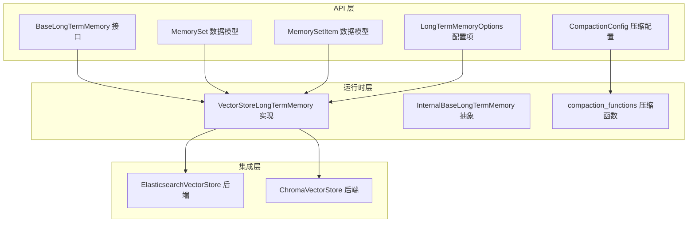
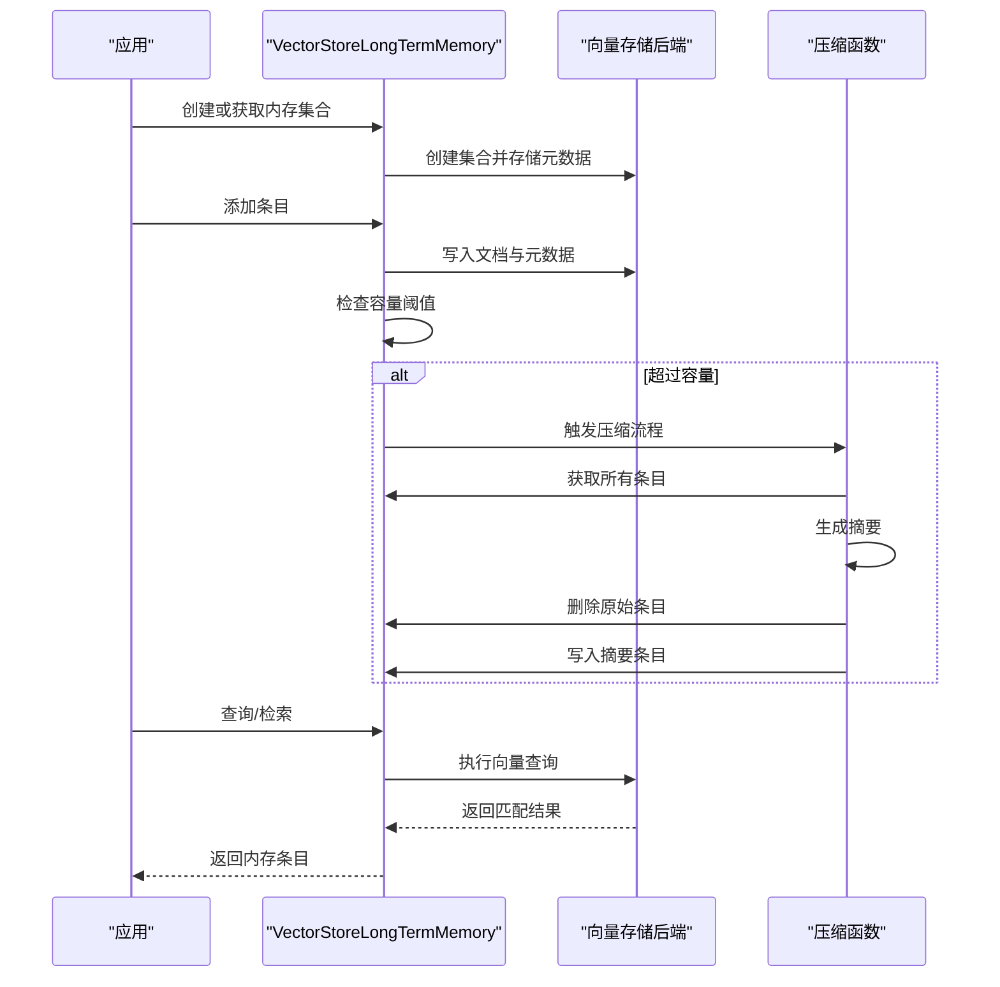
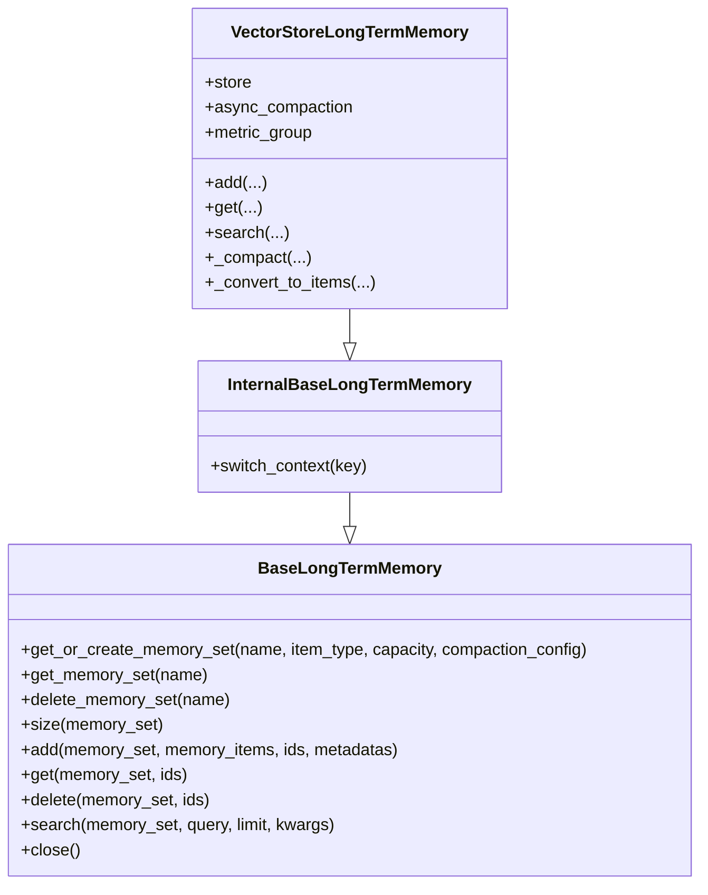
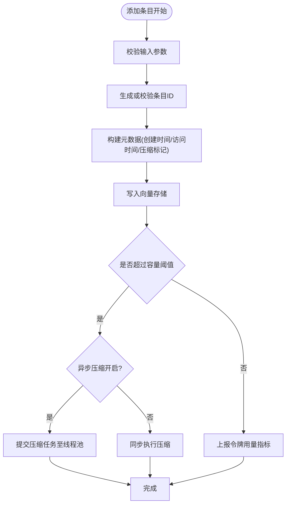
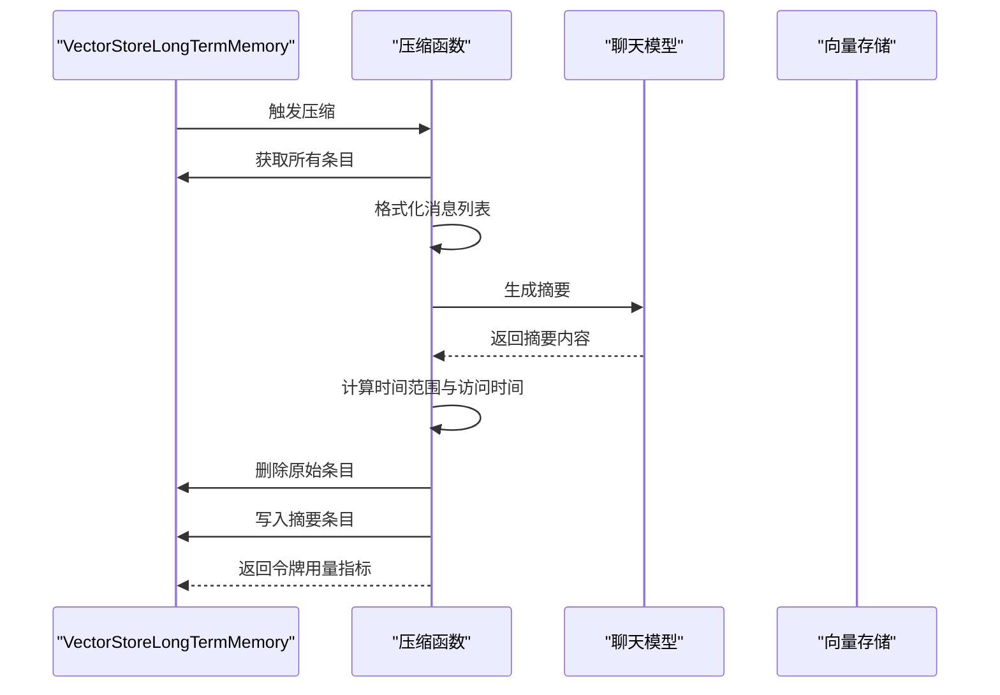
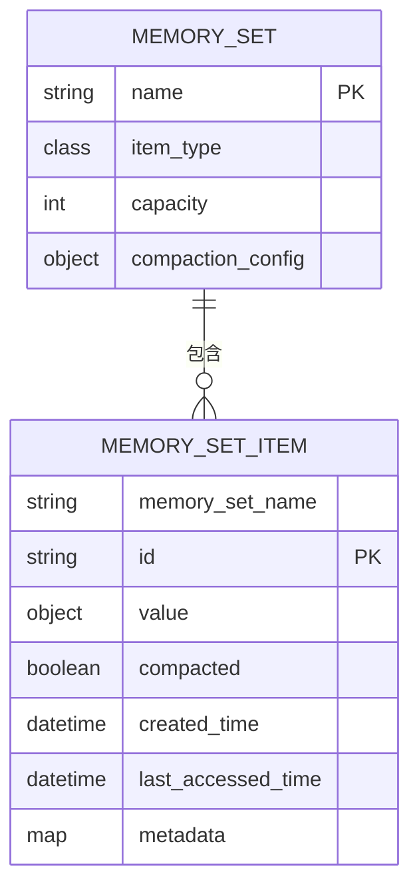
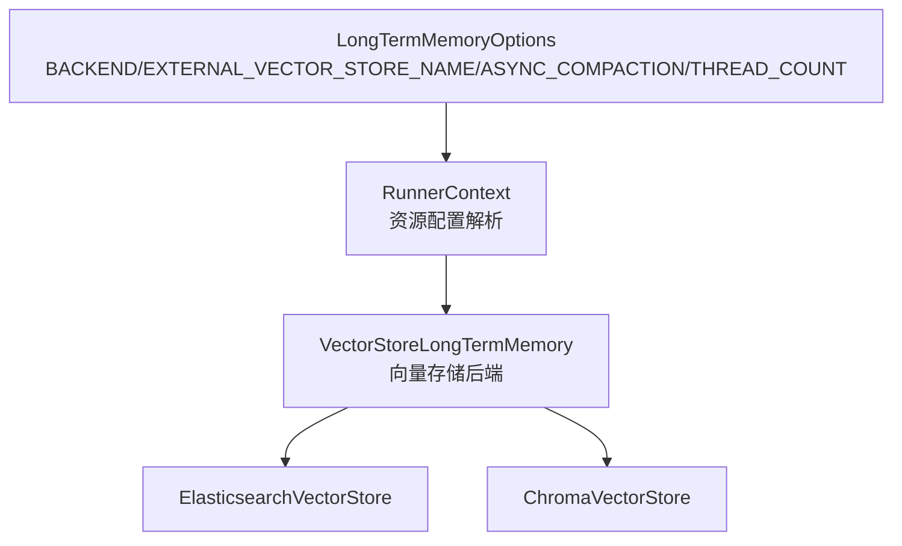
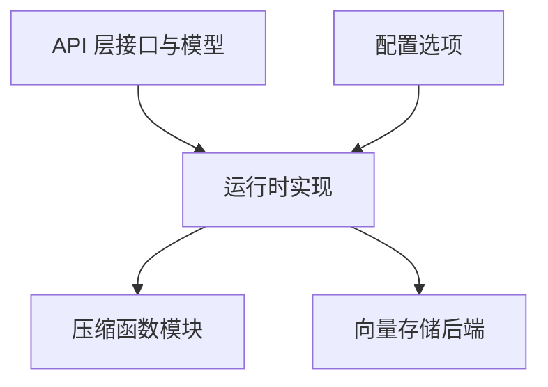

# 内部长存记忆实现

<cite>
**本文档引用的文件**
- [BaseLongTermMemory.java](file://api/src/main/java/org/apache/flink/agents/api/memory/BaseLongTermMemory.java)
- [LongTermMemoryOptions.java](file://api/src/main/java/org/apache/flink/agents/api/memory/LongTermMemoryOptions.java)
- [MemorySet.java](file://api/src/main/java/org/apache/flink/agents/api/memory/MemorySet.java)
- [MemorySetItem.java](file://api/src/main/java/org/apache/flink/agents/api/memory/MemorySetItem.java)
- [CompactionConfig.java](file://api/src/main/java/org/apache/flink/agents/api/memory/compaction/CompactionConfig.java)
- [InternalBaseLongTermMemory.py](file://python/flink_agents/runtime/memory/internal_base_long_term_memory.py)
- [VectorStoreLongTermMemory.py](file://python/flink_agents/runtime/memory/vector_store_long_term_memory.py)
- [compaction_functions.py](file://python/flink_agents/runtime/memory/compaction_functions.py)
- [long_term_memory.py](file://python/flink_agents/api/memory/long_term_memory.py)
- [long_term_memory_test.py](file://python/flink_agents/e2e_tests/e2e_tests_integration/long_term_memory_test.py)
- [test_vector_store_long_term_memory.py](file://python/flink_agents/runtime/memory/tests/test_vector_store_long_term_memory.py)
- [ElasticsearchVectorStore.java](file://integrations/vector-stores/elasticsearch/src/main/java/org/apache/flink/agents/integrations/vectorstores/elasticsearch/ElasticsearchVectorStore.java)
</cite>

## 目录
1. [简介](#简介)
2. [项目结构](#项目结构)
3. [核心组件](#核心组件)
4. [架构概览](#架构概览)
5. [详细组件分析](#详细组件分析)
6. [依赖关系分析](#依赖关系分析)
7. [性能考虑](#性能考虑)
8. [故障排除指南](#故障排除指南)
9. [结论](#结论)
10. [附录](#附录)

## 简介
本文件详细介绍了 Flink Agents 项目中内部长期记忆（Internal Base Long-Term Memory）的设计与实现。内部长期记忆系统通过统一的接口抽象，结合向量存储后端，实现了对大规模数据的高效检索、压缩与持久化管理。系统支持异步压缩、容量控制、元数据管理以及与外部存储系统的无缝集成。

## 项目结构
内部长期记忆实现主要由以下层次构成：
- API 层：定义通用接口与数据模型，确保跨语言一致性
- 运行时层：提供基于向量存储的具体实现
- 集成层：支持多种外部向量存储后端（如 Elasticsearch、Chroma 等）
- 测试与示例：验证功能正确性与性能表现

**图表来源**
- [BaseLongTermMemory.java](file://api/src/main/java/org/apache/flink/agents/api/memory/BaseLongTermMemory.java#L27-L133)
- [MemorySet.java](file://api/src/main/java/org/apache/flink/agents/api/memory/MemorySet.java#L32-L159)
- [MemorySetItem.java](file://api/src/main/java/org/apache/flink/agents/api/memory/MemorySetItem.java#L23-L94)
- [CompactionConfig.java](file://api/src/main/java/org/apache/flink/agents/api/memory/compaction/CompactionConfig.java#L29-L92)
- [LongTermMemoryOptions.java](file://api/src/main/java/org/apache/flink/agents/api/memory/LongTermMemoryOptions.java#L22-L52)
- [VectorStoreLongTermMemory.py](file://python/flink_agents/runtime/memory/vector_store_long_term_memory.py#L52-L328)
- [InternalBaseLongTermMemory.py](file://python/flink_agents/runtime/memory/internal_base_long_term_memory.py#L23-L36)
- [compaction_functions.py](file://python/flink_agents/runtime/memory/compaction_functions.py#L62-L185)
- [ElasticsearchVectorStore.java](file://integrations/vector-stores/elasticsearch/src/main/java/org/apache/flink/agents/integrations/vectorstores/elasticsearch/ElasticsearchVectorStore.java#L118-L200)

**章节来源**
- [BaseLongTermMemory.java](file://api/src/main/java/org/apache/flink/agents/api/memory/BaseLongTermMemory.java#L27-L133)
- [LongTermMemoryOptions.java](file://api/src/main/java/org/apache/flink/agents/api/memory/LongTermMemoryOptions.java#L22-L52)

## 核心组件
内部长期记忆系统的核心组件包括：
- BaseLongTermMemory：定义统一的长期记忆操作接口，包括创建、检索、删除、搜索等
- MemorySet：内存集合的封装，包含名称、条目类型、容量限制与压缩配置
- MemorySetItem：内存条目的数据模型，支持时间戳、元数据与压缩标记
- CompactionConfig：压缩配置，定义用于生成摘要的模型、提示词与摘要数量上限
- LongTermMemoryOptions：系统配置项，包括后端选择、异步压缩开关与线程数等

这些组件共同构成了内部长期记忆的抽象层，确保上层应用无需关心底层存储细节即可进行高效的数据管理。

**章节来源**
- [BaseLongTermMemory.java](file://api/src/main/java/org/apache/flink/agents/api/memory/BaseLongTermMemory.java#L27-L133)
- [MemorySet.java](file://api/src/main/java/org/apache/flink/agents/api/memory/MemorySet.java#L32-L159)
- [MemorySetItem.java](file://api/src/main/java/org/apache/flink/agents/api/memory/MemorySetItem.java#L23-L94)
- [CompactionConfig.java](file://api/src/main/java/org/apache/flink/agents/api/memory/compaction/CompactionConfig.java#L29-L92)
- [LongTermMemoryOptions.java](file://api/src/main/java/org/apache/flink/agents/api/memory/LongTermMemoryOptions.java#L22-L52)

## 架构概览
内部长期记忆采用分层架构，通过统一接口屏蔽不同存储后端的差异。运行时实现基于向量存储，支持异步压缩与容量控制，确保在高吞吐场景下的稳定性与性能。

**图表来源**
- [VectorStoreLongTermMemory.py](file://python/flink_agents/runtime/memory/vector_store_long_term_memory.py#L120-L248)
- [compaction_functions.py](file://python/flink_agents/runtime/memory/compaction_functions.py#L62-L185)

**章节来源**
- [VectorStoreLongTermMemory.py](file://python/flink_agents/runtime/memory/vector_store_long_term_memory.py#L52-L328)
- [compaction_functions.py](file://python/flink_agents/runtime/memory/compaction_functions.py#L62-L185)

## 详细组件分析

### InternalBaseLongTermMemory 抽象层
InternalBaseLongTermMemory 在 Python 运行时中扩展了基础接口，引入上下文切换能力，允许同一实例在不同键下隔离数据，提升多租户或多任务场景下的资源利用率。

**图表来源**
- [InternalBaseLongTermMemory.py](file://python/flink_agents/runtime/memory/internal_base_long_term_memory.py#L23-L36)
- [VectorStoreLongTermMemory.py](file://python/flink_agents/runtime/memory/vector_store_long_term_memory.py#L52-L328)
- [long_term_memory.py](file://python/flink_agents/api/memory/long_term_memory.py#L183-L305)

**章节来源**
- [InternalBaseLongTermMemory.py](file://python/flink_agents/runtime/memory/internal_base_long_term_memory.py#L23-L36)
- [long_term_memory.py](file://python/flink_agents/api/memory/long_term_memory.py#L183-L305)

### VectorStoreLongTermMemory 实现
VectorStoreLongTermMemory 是内部长期记忆的核心实现，负责：
- 集合管理：创建、获取与删除集合，并将集合元信息存储到向量存储中
- 条目写入：自动分配 ID、记录时间戳与元数据，并在容量超限时触发压缩
- 异步压缩：通过线程池执行压缩任务，避免阻塞主流程
- 结果转换：将向量存储返回的文档转换为内存条目对象

**图表来源**
- [VectorStoreLongTermMemory.py](file://python/flink_agents/runtime/memory/vector_store_long_term_memory.py#L156-L221)

**章节来源**
- [VectorStoreLongTermMemory.py](file://python/flink_agents/runtime/memory/vector_store_long_term_memory.py#L52-L328)

### 压缩函数与算法
压缩函数负责在容量超限时对历史条目进行摘要生成与替换，以减少存储占用并保持检索效果。核心流程包括：
- 获取全部条目并格式化为消息列表
- 使用指定模型与提示词生成摘要
- 计算摘要的时间范围与最后访问时间
- 删除原始条目并写入摘要条目
- 上报令牌用量指标

**图表来源**
- [compaction_functions.py](file://python/flink_agents/runtime/memory/compaction_functions.py#L62-L185)
- [VectorStoreLongTermMemory.py](file://python/flink_agents/runtime/memory/vector_store_long_term_memory.py#L277-L284)

**章节来源**
- [compaction_functions.py](file://python/flink_agents/runtime/memory/compaction_functions.py#L62-L185)

### 数据模型与序列化
内存集合与条目的数据模型支持跨语言序列化与反序列化，确保在 Java 与 Python 之间的兼容性。MemorySet 包含集合元信息，MemorySetItem 包含条目值、时间戳与元数据。

**图表来源**
- [MemorySet.java](file://api/src/main/java/org/apache/flink/agents/api/memory/MemorySet.java#L32-L159)
- [MemorySetItem.java](file://api/src/main/java/org/apache/flink/agents/api/memory/MemorySetItem.java#L23-L94)

**章节来源**
- [MemorySet.java](file://api/src/main/java/org/apache/flink/agents/api/memory/MemorySet.java#L32-L159)
- [MemorySetItem.java](file://api/src/main/java/org/apache/flink/agents/api/memory/MemorySetItem.java#L23-L94)

### 配置选项与后端集成
系统通过配置选项控制后端选择与压缩行为，当前仅支持外部向量存储后端。运行时根据配置从资源管理器中解析具体的向量存储实现。

**图表来源**
- [LongTermMemoryOptions.java](file://api/src/main/java/org/apache/flink/agents/api/memory/LongTermMemoryOptions.java#L22-L52)
- [VectorStoreLongTermMemory.py](file://python/flink_agents/runtime/memory/vector_store_long_term_memory.py#L83-L99)
- [ElasticsearchVectorStore.java](file://integrations/vector-stores/elasticsearch/src/main/java/org/apache/flink/agents/integrations/vectorstores/elasticsearch/ElasticsearchVectorStore.java#L118-L200)

**章节来源**
- [LongTermMemoryOptions.java](file://api/src/main/java/org/apache/flink/agents/api/memory/LongTermMemoryOptions.java#L22-L52)
- [VectorStoreLongTermMemory.py](file://python/flink_agents/runtime/memory/vector_store_long_term_memory.py#L83-L99)

## 依赖关系分析
内部长期记忆系统的关键依赖关系如下：
- 接口与实现解耦：BaseLongTermMemory 定义接口，VectorStoreLongTermMemory 提供具体实现
- 压缩逻辑独立：compaction_functions 封装压缩算法，便于测试与复用
- 向量存储后端可插拔：通过 RunnerContext 解析资源，支持多种后端实现
- 配置驱动：LongTermMemoryOptions 控制运行时行为，降低硬编码耦合

**图表来源**
- [BaseLongTermMemory.java](file://api/src/main/java/org/apache/flink/agents/api/memory/BaseLongTermMemory.java#L27-L133)
- [VectorStoreLongTermMemory.py](file://python/flink_agents/runtime/memory/vector_store_long_term_memory.py#L52-L328)
- [compaction_functions.py](file://python/flink_agents/runtime/memory/compaction_functions.py#L62-L185)
- [LongTermMemoryOptions.java](file://api/src/main/java/org/apache/flink/agents/api/memory/LongTermMemoryOptions.java#L22-L52)

**章节来源**
- [BaseLongTermMemory.java](file://api/src/main/java/org/apache/flink/agents/api/memory/BaseLongTermMemory.java#L27-L133)
- [VectorStoreLongTermMemory.py](file://python/flink_agents/runtime/memory/vector_store_long_term_memory.py#L52-L328)
- [compaction_functions.py](file://python/flink_agents/runtime/memory/compaction_functions.py#L62-L185)
- [LongTermMemoryOptions.java](file://api/src/main/java/org/apache/flink/agents/api/memory/LongTermMemoryOptions.java#L22-L52)

## 性能考虑
- 异步压缩：通过线程池异步执行压缩任务，避免阻塞主流程，提高吞吐量
- 容量控制：当条目数量达到容量阈值时触发压缩，防止存储膨胀
- 元数据优化：在写入时合并元数据，减少额外开销
- 指标上报：记录令牌用量等关键指标，便于性能监控与成本控制

[本节为一般性指导，不直接分析具体文件]

## 故障排除指南
- 压缩异常处理：异步压缩任务失败时会抛出异常，需检查模型连接与提示词配置
- 存储后端问题：确认向量存储服务可用性与索引配置，必要时清理损坏集合
- 配置错误：核对后端选择与资源名称，确保配置项与资源定义一致
- 性能瓶颈：监控令牌用量与压缩频率，调整容量阈值与线程数以平衡性能与成本

**章节来源**
- [VectorStoreLongTermMemory.py](file://python/flink_agents/runtime/memory/vector_store_long_term_memory.py#L286-L294)

## 结论
内部长期记忆系统通过清晰的接口抽象、灵活的实现与强大的压缩算法，在保证检索效果的同时有效控制存储成本。其异步压缩与容量控制机制适用于高吞吐场景，配合完善的指标监控与故障处理，能够满足生产环境的稳定性与可维护性要求。

[本节为总结性内容，不直接分析具体文件]

## 附录

### 完整使用示例（运行时环境）
以下示例展示了如何在运行时环境中使用内部长期记忆系统：
- 配置后端与资源：设置后端类型与向量存储资源名称
- 创建内存集合：指定条目类型、容量与压缩配置
- 添加与检索条目：支持批量添加与语义检索
- 异步压缩验证：通过测试用例验证异步压缩不会阻塞其他键的操作

**章节来源**
- [long_term_memory_test.py](file://python/flink_agents/e2e_tests/e2e_tests_integration/long_term_memory_test.py#L215-L306)
- [test_vector_store_long_term_memory.py](file://python/flink_agents/runtime/memory/tests/test_vector_store_long_term_memory.py#L133-L259)

### 压缩函数实现与配置选项
- 压缩函数：支持自定义提示词与摘要数量上限，按主题聚类并生成摘要
- 配置选项：支持后端选择、异步压缩开关与线程数配置，便于按需调优

**章节来源**
- [compaction_functions.py](file://python/flink_agents/runtime/memory/compaction_functions.py#L62-L185)
- [LongTermMemoryOptions.java](file://api/src/main/java/org/apache/flink/agents/api/memory/LongTermMemoryOptions.java#L22-L52)