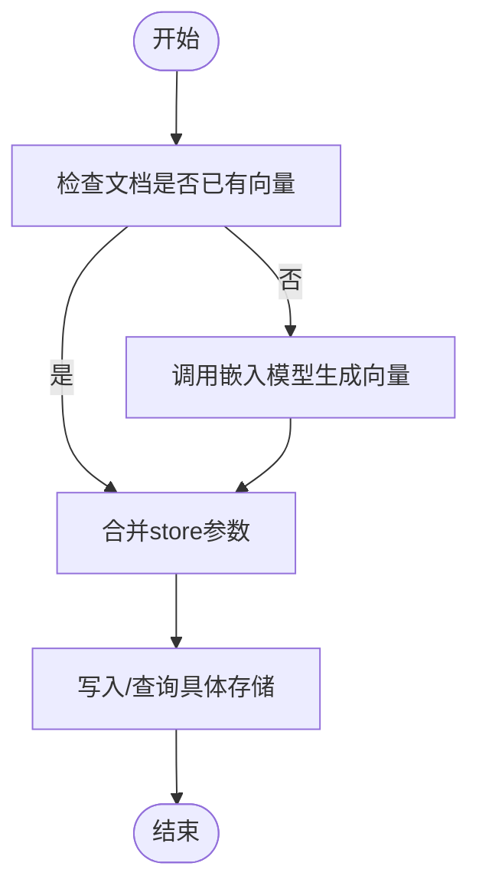

# 向量存储长期记忆

<cite>
**本文引用的文件**
- [VectorStoreLongTermMemory.java](file://runtime/src/main/java/org/apache/flink/agents/runtime/memory/VectorStoreLongTermMemory.java)
- [BaseLongTermMemory.java](file://api/src/main/java/org/apache/flink/agents/api/memory/BaseLongTermMemory.java)
- [BaseVectorStore.java](file://api/src/main/java/org/apache/flink/agents/api/vectorstores/BaseVectorStore.java)
- [Document.java](file://api/src/main/java/org/apache/flink/agents/api/vectorstores/Document.java)
- [VectorStoreQuery.java](file://api/src/main/java/org/apache/flink/agents/api/vectorstores/VectorStoreQuery.java)
- [MemorySet.java](file://api/src/main/java/org/apache/flink/agents/api/memory/MemorySet.java)
- [MemorySetItem.java](file://api/src/main/java/org/apache/flink/agents/api/memory/MemorySetItem.java)
- [CompactionConfig.java](file://api/src/main/java/org/apache/flink/agents/api/memory/compaction/CompactionConfig.java)
- [CompactionFunctions.java](file://runtime/src/main/java/org/apache/flink/agents/runtime/memory/CompactionFunctions.java)
- [LongTermMemoryOptions.java](file://api/src/main/java/org/apache/flink/agents/api/memory/LongTermMemoryOptions.java)
- [VectorStoreLongTermMemoryTest.java](file://e2e-test/flink-agents-end-to-end-tests-integration/src/test/java/org/apache/flink/agents/integration/test/VectorStoreLongTermMemoryTest.java)
- [VectorStoreLongTermMemoryAgent.java](file://e2e-test/flink-agents-end-to-end-tests-integration/src/test/java/org/apache/flink/agents/integration/test/VectorStoreLongTermMemoryAgent.java)
- [internal_base_long_term_memory.py](file://python/flink_agents/runtime/memory/internal_base_long_term_memory.py)
- [vector_store_long_term_memory.py](file://python/flink_agents/runtime/memory/vector_store_long_term_memory.py)
</cite>

## 目录
1. [简介](#简介)
2. [项目结构](#项目结构)
3. [核心组件](#核心组件)
4. [架构总览](#架构总览)
5. [组件详解](#组件详解)
6. [依赖关系分析](#依赖关系分析)
7. [性能考量](#性能考量)
8. [故障排查指南](#故障排查指南)
9. [结论](#结论)
10. [附录：完整示例与最佳实践](#附录完整示例与最佳实践)

## 简介
本文件系统性阐述基于向量存储的长期记忆实现（VectorStoreLongTermMemory），涵盖其设计思想、数据结构、处理流程、与传统键值存储长期记忆的差异，以及在实际工程中的配置、使用、性能优化与最佳实践。该实现通过向量化检索与语义搜索，显著提升记忆的语义理解能力、模糊匹配能力和上下文关联能力。

## 项目结构
围绕向量存储长期记忆的关键模块分布于以下位置：
- Java运行时实现：runtime/src/main/java/.../runtime/memory/VectorStoreLongTermMemory.java
- API接口与模型：api/src/main/java/.../api/memory 与 api/src/main/java/.../api/vectorstores
- 端到端测试与示例代理：e2e-test/.../integration/test/VectorStoreLongTermMemory*.java
- Python侧实现与内部接口：python/flink_agents/runtime/memory/*.py

**图示来源**
- [BaseLongTermMemory.java](file://api/src/main/java/org/apache/flink/agents/api/memory/BaseLongTermMemory.java#L33-L134)
- [MemorySet.java](file://api/src/main/java/org/apache/flink/agents/api/memory/MemorySet.java#L32-L160)
- [MemorySetItem.java](file://api/src/main/java/org/apache/flink/agents/api/memory/MemorySetItem.java#L23-L95)
- [BaseVectorStore.java](file://api/src/main/java/org/apache/flink/agents/api/vectorstores/BaseVectorStore.java#L38-L174)
- [Document.java](file://api/src/main/java/org/apache/flink/agents/api/vectorstores/Document.java#L34-L111)
- [VectorStoreQuery.java](file://api/src/main/java/org/apache/flink/agents/api/vectorstores/VectorStoreQuery.java#L33-L110)
- [CompactionConfig.java](file://api/src/main/java/org/apache/flink/agents/api/memory/compaction/CompactionConfig.java#L28-L93)
- [VectorStoreLongTermMemory.java](file://runtime/src/main/java/org/apache/flink/agents/runtime/memory/VectorStoreLongTermMemory.java#L57-L315)
- [CompactionFunctions.java](file://runtime/src/main/java/org/apache/flink/agents/runtime/memory/CompactionFunctions.java#L47-L216)
- [LongTermMemoryOptions.java](file://api/src/main/java/org/apache/flink/agents/api/memory/LongTermMemoryOptions.java#L22-L53)
- [VectorStoreLongTermMemoryTest.java](file://e2e-test/flink-agents-end-to-end-tests-integration/src/test/java/org/apache/flink/agents/integration/test/VectorStoreLongTermMemoryTest.java#L74-L331)
- [VectorStoreLongTermMemoryAgent.java](file://e2e-test/flink-agents-end-to-end-tests-integration/src/test/java/org/apache/flink/agents/integration/test/VectorStoreLongTermMemoryAgent.java#L55-L183)

**章节来源**
- [VectorStoreLongTermMemory.java](file://runtime/src/main/java/org/apache/flink/agents/runtime/memory/VectorStoreLongTermMemory.java#L57-L315)
- [BaseLongTermMemory.java](file://api/src/main/java/org/apache/flink/agents/api/memory/BaseLongTermMemory.java#L27-L134)

## 核心组件
- 向量存储长期记忆实现：负责内存集合的创建、增删查、语义检索、压缩与资源管理。
- 向量存储抽象：封装嵌入模型调用、文档添加、查询、计数与删除等操作。
- 记忆集合与单项：定义集合容量、类型、压缩策略，以及返回项的元信息。
- 压缩函数：基于对话或文本内容生成摘要，合并时间窗口，减少存储与检索开销。
- 配置选项：控制后端类型、异步压缩、线程池大小等。

**章节来源**
- [VectorStoreLongTermMemory.java](file://runtime/src/main/java/org/apache/flink/agents/runtime/memory/VectorStoreLongTermMemory.java#L57-L315)
- [BaseVectorStore.java](file://api/src/main/java/org/apache/flink/agents/api/vectorstores/BaseVectorStore.java#L38-L174)
- [MemorySet.java](file://api/src/main/java/org/apache/flink/agents/api/memory/MemorySet.java#L32-L160)
- [MemorySetItem.java](file://api/src/main/java/org/apache/flink/agents/api/memory/MemorySetItem.java#L23-L95)
- [CompactionFunctions.java](file://runtime/src/main/java/org/apache/flink/agents/runtime/memory/CompactionFunctions.java#L47-L216)
- [LongTermMemoryOptions.java](file://api/src/main/java/org/apache/flink/agents/api/memory/LongTermMemoryOptions.java#L22-L53)

## 架构总览
向量存储长期记忆以“集合-项”为核心组织单元，通过向量存储实现语义检索；当集合容量达到阈值时，触发压缩流程，将多条记录聚合成摘要并保留时间范围信息，从而在保持语义的同时降低存储与检索成本。

**图示来源**
- [VectorStoreLongTermMemory.java](file://runtime/src/main/java/org/apache/flink/agents/runtime/memory/VectorStoreLongTermMemory.java#L137-L244)
- [BaseVectorStore.java](file://api/src/main/java/org/apache/flink/agents/api/vectorstores/BaseVectorStore.java#L71-L112)
- [VectorStoreQuery.java](file://api/src/main/java/org/apache/flink/agents/api/vectorstores/VectorStoreQuery.java#L33-L110)
- [Document.java](file://api/src/main/java/org/apache/flink/agents/api/vectorstores/Document.java#L34-L111)

## 组件详解

### 向量存储长期记忆实现（VectorStoreLongTermMemory）
- 角色定位：实现长期记忆接口，桥接RunnerContext与向量存储，提供集合管理、增删查、语义检索与压缩。
- 关键职责
  - 集合管理：创建/获取/删除集合，持久化集合元信息（含压缩配置）。
  - 数据写入：序列化项为字符串，注入时间戳与标记，批量写入向量存储。
  - 语义检索：构建查询对象，调用向量存储执行相似度检索。
  - 压缩：容量超限时触发压缩，支持同步/异步两种模式。
  - 资源管理：按需从RunnerContext解析向量存储资源，优雅关闭线程池。
- 名称混淆：集合名由作业ID、上下文键与原始名称拼接，确保隔离与唯一性。
- 元数据约定：写入时附加“是否已压缩”、“创建时间”、“最后访问时间”，检索时转换为MemorySetItem并剥离元数据。

**图示来源**
- [BaseLongTermMemory.java](file://api/src/main/java/org/apache/flink/agents/api/memory/BaseLongTermMemory.java#L33-L134)
- [VectorStoreLongTermMemory.java](file://runtime/src/main/java/org/apache/flink/agents/runtime/memory/VectorStoreLongTermMemory.java#L57-L315)
- [BaseVectorStore.java](file://api/src/main/java/org/apache/flink/agents/api/vectorstores/BaseVectorStore.java#L38-L174)

**章节来源**
- [VectorStoreLongTermMemory.java](file://runtime/src/main/java/org/apache/flink/agents/runtime/memory/VectorStoreLongTermMemory.java#L70-L315)

### 向量存储抽象（BaseVectorStore）
- 职责：统一向量存储接入，自动注入嵌入模型，完成向量化与查询。
- 核心方法
  - add：若未提供向量则调用嵌入模型生成，再写入存储。
  - query：将查询文本转为向量，合并store参数后执行检索。
  - size/get/delete：对集合进行计数、读取与删除。
  - 抽象扩展：子类实现具体存储的addEmbedding与queryEmbedding。

**图示来源**
- [BaseVectorStore.java](file://api/src/main/java/org/apache/flink/agents/api/vectorstores/BaseVectorStore.java#L71-L112)

**章节来源**
- [BaseVectorStore.java](file://api/src/main/java/org/apache/flink/agents/api/vectorstores/BaseVectorStore.java#L38-L174)

### 记忆集合与单项（MemorySet/MemorySetItem）
- MemorySet：封装集合名称、元素类型、容量与压缩配置，作为集合级操作入口。
- MemorySetItem：封装检索返回项，包含值、是否压缩、创建/访问时间、附加元数据等。

**图示来源**
- [MemorySet.java](file://api/src/main/java/org/apache/flink/agents/api/memory/MemorySet.java#L32-L160)
- [MemorySetItem.java](file://api/src/main/java/org/apache/flink/agents/api/memory/MemorySetItem.java#L23-L95)

**章节来源**
- [MemorySet.java](file://api/src/main/java/org/apache/flink/agents/api/memory/MemorySet.java#L32-L160)
- [MemorySetItem.java](file://api/src/main/java/org/apache/flink/agents/api/memory/MemorySetItem.java#L23-L95)

### 压缩与摘要（CompactionFunctions）
- 触发条件：集合容量达到上限。
- 处理流程：读取全部或指定项，构造提示词，调用聊天模型生成摘要，按主题拆分并去重，删除原项，写入摘要项并记录时间窗口。
- 输出：写入压缩标记与时间范围，便于后续检索与统计。

**图示来源**
- [CompactionFunctions.java](file://runtime/src/main/java/org/apache/flink/agents/runtime/memory/CompactionFunctions.java#L86-L160)

**章节来源**
- [CompactionFunctions.java](file://runtime/src/main/java/org/apache/flink/agents/runtime/memory/CompactionFunctions.java#L47-L216)
- [CompactionConfig.java](file://api/src/main/java/org/apache/flink/agents/api/memory/compaction/CompactionConfig.java#L28-L93)

### 配置与资源（LongTermMemoryOptions）
- 支持的后端：外部向量存储。
- 关键配置：
  - 后端类型
  - 外部向量存储资源名
  - 是否异步压缩
  - 异步压缩线程数

**章节来源**
- [LongTermMemoryOptions.java](file://api/src/main/java/org/apache/flink/agents/api/memory/LongTermMemoryOptions.java#L22-L53)

## 依赖关系分析
- VectorStoreLongTermMemory依赖RunnerContext获取资源与配置，委托BaseVectorStore执行向量化与检索。
- BaseVectorStore依赖嵌入模型Setup生成向量，再与具体存储实现交互。
- MemorySet作为门面，持有BaseLongTermMemory引用，屏蔽底层细节。
- CompactionFunctions依赖RunnerContext解析聊天模型与提示词资源，执行摘要生成与写回。

**图示来源**
- [VectorStoreLongTermMemory.java](file://runtime/src/main/java/org/apache/flink/agents/runtime/memory/VectorStoreLongTermMemory.java#L92-L97)
- [BaseVectorStore.java](file://api/src/main/java/org/apache/flink/agents/api/vectorstores/BaseVectorStore.java#L74-L112)
- [CompactionFunctions.java](file://runtime/src/main/java/org/apache/flink/agents/runtime/memory/CompactionFunctions.java#L180-L214)

**章节来源**
- [VectorStoreLongTermMemory.java](file://runtime/src/main/java/org/apache/flink/agents/runtime/memory/VectorStoreLongTermMemory.java#L57-L315)
- [BaseVectorStore.java](file://api/src/main/java/org/apache/flink/agents/api/vectorstores/BaseVectorStore.java#L38-L174)
- [CompactionFunctions.java](file://runtime/src/main/java/org/apache/flink/agents/runtime/memory/CompactionFunctions.java#L47-L216)

## 性能考量
- 异步压缩：通过线程池并发执行压缩任务，避免阻塞主线程；可通过配置调整线程数。
- 批量写入：add支持批量文档写入，减少网络往返与I/O开销。
- 语义检索：向量检索通常优于关键词匹配，但需权衡嵌入模型调用与存储检索成本。
- 存储隔离：集合名包含作业ID与上下文键，避免跨任务/分区污染，提高检索准确性。
- 压缩策略：定期压缩可显著降低存储与检索规模，建议根据业务吞吐量设置合适的容量阈值与压缩频率。

[本节为通用指导，无需特定文件引用]

## 故障排查指南
- 嵌入模型不可用：确认嵌入模型连接与模型名配置正确，检查网络连通性与超时设置。
- 向量存储异常：检查主机地址、维度与安全配置；对于某些存储可能需要禁用安全校验。
- 压缩失败：查看异步压缩回调日志，定位具体异常；必要时切换为同步压缩验证问题。
- 检索结果不准确：调整查询参数（如过滤条件）、增加限制数量或优化提示词。

**章节来源**
- [VectorStoreLongTermMemoryTest.java](file://e2e-test/flink-agents-end-to-end-tests-integration/src/test/java/org/apache/flink/agents/integration/test/VectorStoreLongTermMemoryTest.java#L74-L331)
- [VectorStoreLongTermMemory.java](file://runtime/src/main/java/org/apache/flink/agents/runtime/memory/VectorStoreLongTermMemory.java#L194-L210)

## 结论
向量存储长期记忆通过“集合-向量检索-压缩摘要”的闭环，实现了高语义、低耦合、可扩展的记忆管理方案。相比传统键值存储，它在语义理解、模糊匹配与上下文关联方面具有明显优势；同时通过异步压缩与批处理等手段，兼顾了性能与可维护性。

[本节为总结，无需特定文件引用]

## 附录：完整示例与最佳实践

### 工作原理与关键流程
- 嵌入向量生成：BaseVectorStore在写入前自动调用嵌入模型生成向量。
- 相似度计算：查询时将文本转为向量，交由具体存储执行相似度检索。
- 记忆检索：返回文档列表，转换为MemorySetItem并剥离元数据，供上层使用。

**章节来源**
- [BaseVectorStore.java](file://api/src/main/java/org/apache/flink/agents/api/vectorstores/BaseVectorStore.java#L71-L112)
- [VectorStoreLongTermMemory.java](file://runtime/src/main/java/org/apache/flink/agents/runtime/memory/VectorStoreLongTermMemory.java#L235-L244)

### 与传统键值存储长期记忆的差异与适用场景
- 差异
  - 键值存储：精确匹配、简单高效，适合结构化数据与固定字段检索。
  - 向量存储：语义检索、模糊匹配、上下文关联更强，适合非结构化文本与动态语义需求。
- 适用场景
  - 对话历史、知识库问答、意图识别、推荐系统等需要语义理解的场景优先选择向量存储长期记忆。

[本节为概念性说明，无需特定文件引用]

### 完整示例：在Flink中使用向量存储长期记忆
- 步骤概览
  - 准备嵌入与聊天模型资源。
  - 配置外部向量存储资源与长期记忆选项。
  - 在代理动作中获取长期记忆集合，写入/读取/检索。
  - 使用异步压缩以提升吞吐。

- 参考路径
  - 资源声明与配置：见示例代理中的注解与描述符定义。
  - 集合操作与检索：见代理动作中的集合获取与查询。
  - 端到端测试：包含异步压缩与集合清理的完整流程。

**章节来源**
- [VectorStoreLongTermMemoryAgent.java](file://e2e-test/flink-agents-end-to-end-tests-integration/src/test/java/org/apache/flink/agents/integration/test/VectorStoreLongTermMemoryAgent.java#L107-L182)
- [VectorStoreLongTermMemoryTest.java](file://e2e-test/flink-agents-end-to-end-tests-integration/src/test/java/org/apache/flink/agents/integration/test/VectorStoreLongTermMemoryTest.java#L256-L329)

### 配置与使用要点
- 后端选择：设置外部向量存储后端与资源名。
- 压缩策略：根据数据增长速率设定容量阈值与压缩模型；启用异步压缩以提升吞吐。
- 线程池：合理设置线程数，避免过度并发导致资源争用。

**章节来源**
- [LongTermMemoryOptions.java](file://api/src/main/java/org/apache/flink/agents/api/memory/LongTermMemoryOptions.java#L37-L52)
- [VectorStoreLongTermMemory.java](file://runtime/src/main/java/org/apache/flink/agents/runtime/memory/VectorStoreLongTermMemory.java#L294-L305)

### 性能优化与最佳实践
- 批量写入：尽量合并多次写入为批量提交。
- 合理容量：结合业务峰值与压缩效果，设置合适的集合容量。
- 异步压缩：在高吞吐场景下开启异步压缩，并监控线程池饱和情况。
- 元数据精简：仅保留必要元数据，减少序列化与传输开销。
- 检索参数：根据业务需求调整limit与过滤条件，平衡召回率与性能。

[本节为通用指导，无需特定文件引用]