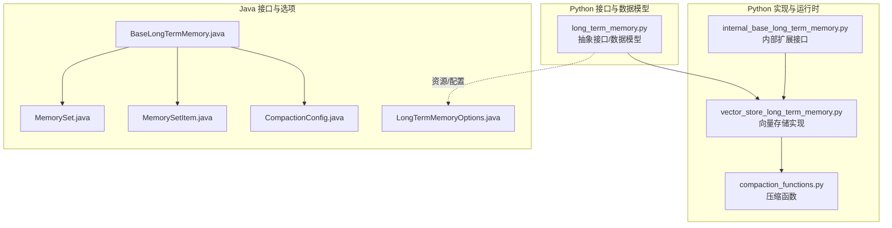
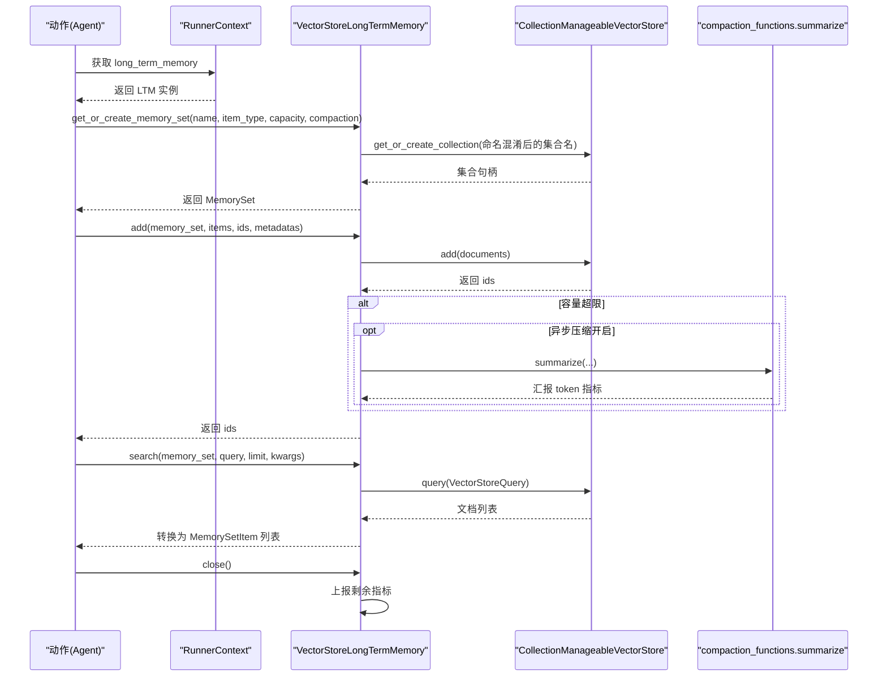
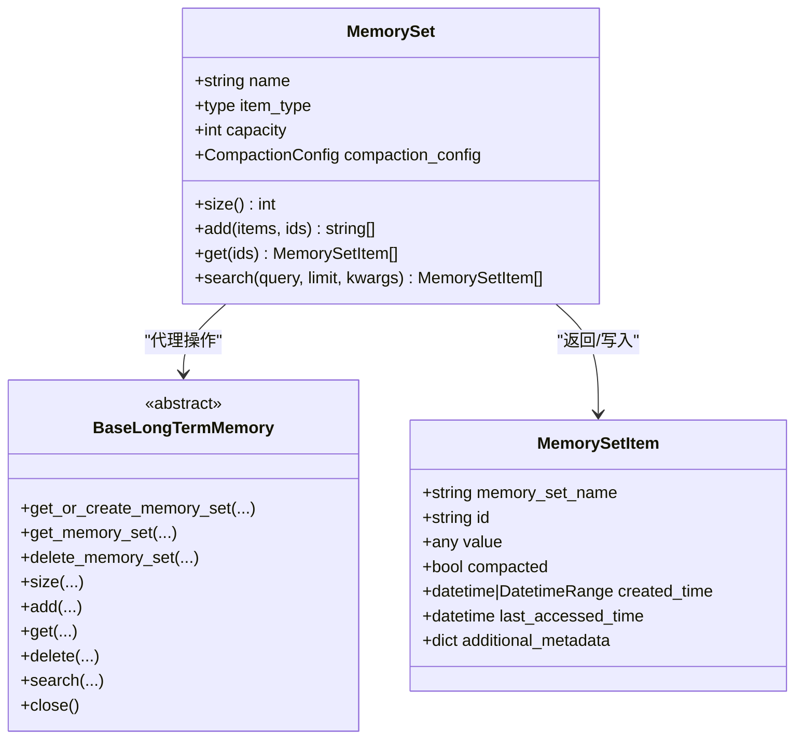
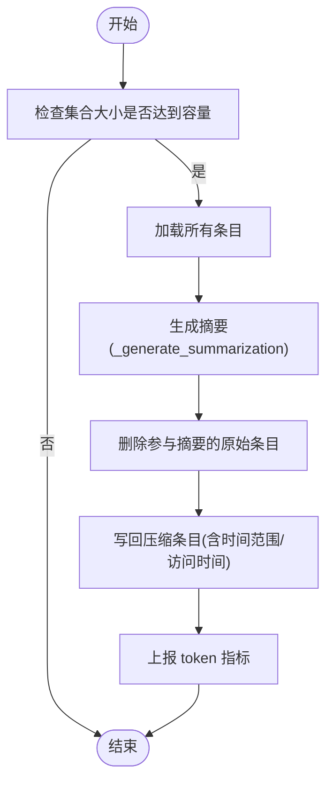
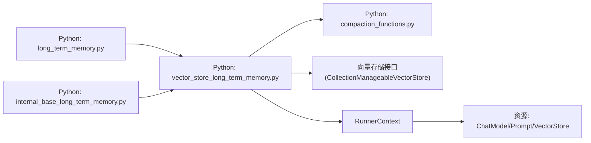

# 长期记忆接口

<cite>
**本文引用的文件**
- [python/flink_agents/api/memory/long_term_memory.py](file://python/flink_agents/api/memory/long_term_memory.py)
- [python/flink_agents/runtime/memory/internal_base_long_term_memory.py](file://python/flink_agents/runtime/memory/internal_base_long_term_memory.py)
- [python/flink_agents/runtime/memory/vector_store_long_term_memory.py](file://python/flink_agents/runtime/memory/vector_store_long_term_memory.py)
- [python/flink_agents/runtime/memory/compaction_functions.py](file://python/flink_agents/runtime/memory/compaction_functions.py)
- [python/flink_agents/api/memory/tests/test_long_term_memory.py](file://python/flink_agents/api/memory/tests/test_long_term_memory.py)
- [python/flink_agents/e2e_tests/e2e_tests_integration/long_term_memory_test.py](file://python/flink_agents/e2e_tests/e2e_tests_integration/long_term_memory_test.py)
- [api/src/main/java/org/apache/flink/agents/api/memory/BaseLongTermMemory.java](file://api/src/main/java/org/apache/flink/agents/api/memory/BaseLongTermMemory.java)
- [api/src/main/java/org/apache/flink/agents/api/memory/MemorySet.java](file://api/src/main/java/org/apache/flink/agents/api/memory/MemorySet.java)
- [api/src/main/java/org/apache/flink/agents/api/memory/MemorySetItem.java](file://api/src/main/java/org/apache/flink/agents/api/memory/MemorySetItem.java)
- [api/src/main/java/org/apache/flink/agents/api/memory/compaction/CompactionConfig.java](file://api/src/main/java/org/apache/flink/agents/api/memory/compaction/CompactionConfig.java)
- [api/src/main/java/org/apache/flink/agents/api/memory/LongTermMemoryOptions.java](file://api/src/main/java/org/apache/flink/agents/api/memory/LongTermMemoryOptions.java)
</cite>

## 目录
1. [简介](#简介)
2. [项目结构](#项目结构)
3. [核心组件](#核心组件)
4. [架构总览](#架构总览)
5. [组件详解](#组件详解)
6. [依赖关系分析](#依赖关系分析)
7. [性能与容量特性](#性能与容量特性)
8. [故障排查指南](#故障排查指南)
9. [结论](#结论)
10. [附录：使用示例与实现指南](#附录使用示例与实现指南)

## 简介
本文件系统性地阐述 Python 长期记忆接口的设计与实现，围绕 LongTermMemory 抽象接口、记忆集合（MemorySet）与条目（MemorySetItem）、压缩配置（CompactionConfig）等核心数据模型，详细说明记忆存储接口、检索机制、生命周期管理、数据结构与访问模式、性能特征、输入输出格式、元数据管理与批量操作支持，并提供扩展自定义长期记忆实现的实践指南。

## 项目结构
面向 Python 的长期记忆接口由三层构成：
- 接口与数据模型层：定义抽象接口与数据模型（Python 层）
- 运行时实现层：基于向量存储的默认实现与压缩逻辑（Python 层）
- Java 对应接口层：跨语言桥接与资源类型定义（Java 层）

**图表来源**
- [python/flink_agents/api/memory/long_term_memory.py](file://python/flink_agents/api/memory/long_term_memory.py#L183-L305)
- [python/flink_agents/runtime/memory/internal_base_long_term_memory.py](file://python/flink_agents/runtime/memory/internal_base_long_term_memory.py#L23-L37)
- [python/flink_agents/runtime/memory/vector_store_long_term_memory.py](file://python/flink_agents/runtime/memory/vector_store_long_term_memory.py#L52-L329)
- [python/flink_agents/runtime/memory/compaction_functions.py](file://python/flink_agents/runtime/memory/compaction_functions.py#L62-L186)
- [api/src/main/java/org/apache/flink/agents/api/memory/BaseLongTermMemory.java](file://api/src/main/java/org/apache/flink/agents/api/memory/BaseLongTermMemory.java#L27-L134)
- [api/src/main/java/org/apache/flink/agents/api/memory/MemorySet.java](file://api/src/main/java/org/apache/flink/agents/api/memory/MemorySet.java#L32-L160)
- [api/src/main/java/org/apache/flink/agents/api/memory/MemorySetItem.java](file://api/src/main/java/org/apache/flink/agents/api/memory/MemorySetItem.java#L23-L95)
- [api/src/main/java/org/apache/flink/agents/api/memory/compaction/CompactionConfig.java](file://api/src/main/java/org/apache/flink/agents/api/memory/compaction/CompactionConfig.java#L28-L93)
- [api/src/main/java/org/apache/flink/agents/api/memory/LongTermMemoryOptions.java](file://api/src/main/java/org/apache/flink/agents/api/memory/LongTermMemoryOptions.java#L22-L53)

**章节来源**
- [python/flink_agents/api/memory/long_term_memory.py](file://python/flink_agents/api/memory/long_term_memory.py#L183-L305)
- [python/flink_agents/runtime/memory/vector_store_long_term_memory.py](file://python/flink_agents/runtime/memory/vector_store_long_term_memory.py#L52-L329)
- [api/src/main/java/org/apache/flink/agents/api/memory/BaseLongTermMemory.java](file://api/src/main/java/org/apache/flink/agents/api/memory/BaseLongTermMemory.java#L27-L134)

## 核心组件
- 抽象接口 BaseLongTermMemory：定义创建/获取/删除记忆集合、查询集合大小、添加/获取/删除条目、语义检索与关闭生命周期等方法。
- 记忆集合 MemorySet：封装集合名称、条目类型、容量、压缩配置，并通过 LTM 实例代理具体操作。
- 条目模型 MemorySetItem：描述单个记忆条目的标识、值、是否已压缩、创建时间/最后访问时间、附加元数据。
- 压缩配置 CompactionConfig：指定用于摘要生成的 LLM 名称、可选提示模板、摘要数量上限。
- 内部扩展 InternalBaseLongTermMemory：在抽象接口之上增加上下文切换能力，便于多键隔离。
- 默认实现 VectorStoreLongTermMemory：以向量存储为后端，负责集合的持久化、写入、检索、删除与异步压缩。
- 压缩函数 summarize/_generate_summarization：负责读取条目、调用 LLM 生成摘要、删除原始条目并写回压缩后的条目。

**章节来源**
- [python/flink_agents/api/memory/long_term_memory.py](file://python/flink_agents/api/memory/long_term_memory.py#L183-L305)
- [python/flink_agents/runtime/memory/internal_base_long_term_memory.py](file://python/flink_agents/runtime/memory/internal_base_long_term_memory.py#L23-L37)
- [python/flink_agents/runtime/memory/vector_store_long_term_memory.py](file://python/flink_agents/runtime/memory/vector_store_long_term_memory.py#L52-L329)
- [python/flink_agents/runtime/memory/compaction_functions.py](file://python/flink_agents/runtime/memory/compaction_functions.py#L62-L186)
- [api/src/main/java/org/apache/flink/agents/api/memory/BaseLongTermMemory.java](file://api/src/main/java/org/apache/flink/agents/api/memory/BaseLongTermMemory.java#L27-L134)
- [api/src/main/java/org/apache/flink/agents/api/memory/MemorySet.java](file://api/src/main/java/org/apache/flink/agents/api/memory/MemorySet.java#L32-L160)
- [api/src/main/java/org/apache/flink/agents/api/memory/MemorySetItem.java](file://api/src/main/java/org/apache/flink/agents/api/memory/MemorySetItem.java#L23-L95)
- [api/src/main/java/org/apache/flink/agents/api/memory/compaction/CompactionConfig.java](file://api/src/main/java/org/apache/flink/agents/api/memory/compaction/CompactionConfig.java#L28-L93)

## 架构总览
下图展示了从动作到长期记忆再到向量存储的整体调用链路与职责划分：

**图表来源**
- [python/flink_agents/runtime/memory/vector_store_long_term_memory.py](file://python/flink_agents/runtime/memory/vector_store_long_term_memory.py#L120-L248)
- [python/flink_agents/runtime/memory/compaction_functions.py](file://python/flink_agents/runtime/memory/compaction_functions.py#L62-L136)
- [python/flink_agents/api/memory/long_term_memory.py](file://python/flink_agents/api/memory/long_term_memory.py#L183-L305)

## 组件详解

### 抽象接口 BaseLongTermMemory
- 职责：统一定义长期记忆的 CRUD、检索与生命周期管理。
- 关键方法：
  - get_or_create_memory_set：按名称创建或获取集合。
  - get_memory_set/delete_memory_set：获取/删除集合。
  - size/add/get/delete/search：集合维度的操作。
  - close：作业结束时的清理与指标上报。
- 设计要点：面向接口编程，便于替换不同后端（如向量存储、数据库等）。

**章节来源**
- [python/flink_agents/api/memory/long_term_memory.py](file://python/flink_agents/api/memory/long_term_memory.py#L183-L305)
- [api/src/main/java/org/apache/flink/agents/api/memory/BaseLongTermMemory.java](file://api/src/main/java/org/apache/flink/agents/api/memory/BaseLongTermMemory.java#L27-L134)

### 记忆集合 MemorySet 与条目 MemorySetItem
- MemorySet
  - 字段：name、item_type、capacity、compaction_config、ltm（内部引用）。
  - 行为：size、add、get、search 代理至 LTM；支持序列化/反序列化 item_type。
- MemorySetItem
  - 字段：memory_set_name、id、value、compacted、created_time（可为时间范围）、last_accessed_time、additional_metadata。
  - 语义：表示检索结果或存储条目，支持“压缩”状态与时间范围记录。

**图表来源**
- [python/flink_agents/api/memory/long_term_memory.py](file://python/flink_agents/api/memory/long_term_memory.py#L86-L181)
- [api/src/main/java/org/apache/flink/agents/api/memory/MemorySet.java](file://api/src/main/java/org/apache/flink/agents/api/memory/MemorySet.java#L32-L160)
- [api/src/main/java/org/apache/flink/agents/api/memory/MemorySetItem.java](file://api/src/main/java/org/apache/flink/agents/api/memory/MemorySetItem.java#L23-L95)

**章节来源**
- [python/flink_agents/api/memory/long_term_memory.py](file://python/flink_agents/api/memory/long_term_memory.py#L86-L181)
- [api/src/main/java/org/apache/flink/agents/api/memory/MemorySet.java](file://api/src/main/java/org/apache/flink/agents/api/memory/MemorySet.java#L32-L160)
- [api/src/main/java/org/apache/flink/agents/api/memory/MemorySetItem.java](file://api/src/main/java/org/apache/flink/agents/api/memory/MemorySetItem.java#L23-L95)

### 压缩配置 CompactionConfig 与压缩流程
- CompactionConfig
  - 字段：model（摘要使用的 LLM 名称）、prompt（可选提示模板或名称）、limit（摘要主题数上限）。
- 压缩流程
  - 触发条件：当集合 size 达到 capacity 时，可能异步执行。
  - 执行步骤：读取全部条目 → 生成摘要（可带提示）→ 删除参与摘要的原始条目 → 写回压缩条目（含时间范围与访问时间）→ 汇报 token 指标。

**图表来源**
- [python/flink_agents/runtime/memory/compaction_functions.py](file://python/flink_agents/runtime/memory/compaction_functions.py#L62-L136)
- [api/src/main/java/org/apache/flink/agents/api/memory/compaction/CompactionConfig.java](file://api/src/main/java/org/apache/flink/agents/api/memory/compaction/CompactionConfig.java#L28-L93)

**章节来源**
- [python/flink_agents/runtime/memory/compaction_functions.py](file://python/flink_agents/runtime/memory/compaction_functions.py#L62-L186)
- [api/src/main/java/org/apache/flink/agents/api/memory/compaction/CompactionConfig.java](file://api/src/main/java/org/apache/flink/agents/api/memory/compaction/CompactionConfig.java#L28-L93)

### 默认实现：VectorStoreLongTermMemory
- 后端：CollectionManageableVectorStore（例如 Chroma），集合命名采用“job_id-key-name”混淆策略。
- 生命周期：
  - 初始化：读取配置（异步压缩开关、指标组）。
  - 关闭：上报剩余指标。
- 核心操作：
  - add：批量写入，自动填充元数据（compacted、created_time、last_accessed_time），必要时触发压缩。
  - get/search：委托向量存储读取/查询，再转换为 MemorySetItem。
  - delete：按 id 删除。
  - switch_context：设置 key 以支持多键隔离。
- 异常处理：压缩任务异常通过回调抛出，避免阻塞主流程。

**章节来源**
- [python/flink_agents/runtime/memory/vector_store_long_term_memory.py](file://python/flink_agents/runtime/memory/vector_store_long_term_memory.py#L52-L329)

### 内部扩展：InternalBaseLongTermMemory
- 在抽象接口基础上新增 switch_context，允许同一实例按 key 隔离数据，便于多键场景复用。

**章节来源**
- [python/flink_agents/runtime/memory/internal_base_long_term_memory.py](file://python/flink_agents/runtime/memory/internal_base_long_term_memory.py#L23-L37)

## 依赖关系分析
- Python 接口层依赖 Java 资源类型（向量存储、聊天模型、提示）进行跨语言调用。
- 默认实现依赖向量存储查询协议（VectorStoreQuery）与文档模型（Document）。
- 压缩流程依赖 RunnerContext 获取资源（LLM/提示），并上报指标。

**图表来源**
- [python/flink_agents/api/memory/long_term_memory.py](file://python/flink_agents/api/memory/long_term_memory.py#L183-L305)
- [python/flink_agents/runtime/memory/vector_store_long_term_memory.py](file://python/flink_agents/runtime/memory/vector_store_long_term_memory.py#L52-L329)
- [python/flink_agents/runtime/memory/compaction_functions.py](file://python/flink_agents/runtime/memory/compaction_functions.py#L62-L186)

**章节来源**
- [python/flink_agents/runtime/memory/vector_store_long_term_memory.py](file://python/flink_agents/runtime/memory/vector_store_long_term_memory.py#L52-L329)
- [python/flink_agents/runtime/memory/compaction_functions.py](file://python/flink_agents/runtime/memory/compaction_functions.py#L62-L186)

## 性能与容量特性
- 写入路径
  - 批量写入：add 支持批量 items、ids、metadatas，减少网络往返。
  - 自动压缩：达到容量阈值时触发压缩，降低存储与检索开销。
  - 异步压缩：可配置异步执行，避免阻塞写入。
- 检索路径
  - 语义检索：基于向量相似度，支持额外参数（如过滤器、距离度量）。
  - 结果转换：将底层文档转换为 MemorySetItem，保留时间戳与元数据。
- 指标上报
  - 压缩过程会将模型 token 使用情况上报到指标组，便于成本控制与容量规划。

**章节来源**
- [python/flink_agents/runtime/memory/vector_store_long_term_memory.py](file://python/flink_agents/runtime/memory/vector_store_long_term_memory.py#L156-L248)
- [python/flink_agents/runtime/memory/compaction_functions.py](file://python/flink_agents/runtime/memory/compaction_functions.py#L137-L186)

## 故障排查指南
- 写入阻塞
  - 现象：写入被压缩阻塞。
  - 排查：确认异步压缩开关；检查压缩线程池配置；观察日志中压缩异常回调。
- 检索为空
  - 现象：search 返回空列表。
  - 排查：确认集合命名混淆后的名称正确；检查向量存储中集合是否存在；核对查询文本与嵌入模型一致性。
- 元数据丢失
  - 现象：MemorySetItem 中 additional_metadata 缺失。
  - 排查：确认 add 时传入 metadatas；检查转换逻辑是否遗漏字段。
- 压缩失败
  - 现象：压缩任务抛出异常但不中断作业。
  - 排查：查看回调日志；确认 LLM/提示资源可用；检查输入条目数量与上下文窗口限制。

**章节来源**
- [python/flink_agents/runtime/memory/vector_store_long_term_memory.py](file://python/flink_agents/runtime/memory/vector_store_long_term_memory.py#L285-L295)
- [python/flink_agents/runtime/memory/compaction_functions.py](file://python/flink_agents/runtime/memory/compaction_functions.py#L137-L186)

## 结论
该长期记忆接口以清晰的抽象与可替换的实现为核心，结合向量存储后端与智能压缩机制，在保证检索质量的同时有效控制存储与计算成本。通过 MemorySet/MemorySetItem 的标准化数据模型与 CompactionConfig 的灵活配置，用户可在不同业务场景下快速落地长期记忆能力。

## 附录：使用示例与实现指南

### 使用示例
- 创建集合并写入条目
  - 步骤：通过 RunnerContext 获取 LTM → get_or_create_memory_set → add。
  - 参考：[python/flink_agents/e2e_tests/e2e_tests_integration/long_term_memory_test.py](file://python/flink_agents/e2e_tests/e2e_tests_integration/long_term_memory_test.py#L174-L181)
- 获取集合并检索
  - 步骤：get_memory_set → get 或 search。
  - 参考：[python/flink_agents/e2e_tests/e2e_tests_integration/long_term_memory_test.py](file://python/flink_agents/e2e_tests/e2e_tests_integration/long_term_memory_test.py#L204-L212)
- 配置后端与异步压缩
  - 步骤：设置 LongTermMemoryOptions.BACKEND 与 EXTERNAL_VECTOR_STORE_NAME；开启 ASYNC_COMPACTION。
  - 参考：[python/flink_agents/e2e_tests/e2e_tests_integration/long_term_memory_test.py](file://python/flink_agents/e2e_tests/e2e_tests_integration/long_term_memory_test.py#L236-L243)

**章节来源**
- [python/flink_agents/e2e_tests/e2e_tests_integration/long_term_memory_test.py](file://python/flink_agents/e2e_tests/e2e_tests_integration/long_term_memory_test.py#L174-L212)
- [python/flink_agents/e2e_tests/e2e_tests_integration/long_term_memory_test.py](file://python/flink_agents/e2e_tests/e2e_tests_integration/long_term_memory_test.py#L236-L243)

### 实现指南：扩展自定义长期记忆实现
- 必要步骤
  - 实现 BaseLongTermMemory 抽象方法：get_or_create_memory_set、get_memory_set、delete_memory_set、size、add、get、delete、search、close。
  - 若需要多键隔离，继承 InternalBaseLongTermMemory 并实现 switch_context。
  - 在 add 中处理容量与压缩策略；在 search 中实现语义检索与结果转换。
- 数据模型
  - 使用 MemorySet/MemorySetItem 作为对外数据模型，确保序列化/反序列化一致。
  - 元数据建议包含 compacted、created_time、last_accessed_time 以及业务所需字段。
- 配置与资源
  - 通过 RunnerContext 获取资源（如 LLM/提示/向量存储），并上报指标。
- 测试建议
  - 单元测试：验证 MemorySet 序列化、add/get/search/delete 的正确性。
    - 参考：[python/flink_agents/api/memory/tests/test_long_term_memory.py](file://python/flink_agents/api/memory/tests/test_long_term_memory.py#L26-L39)
  - 端到端测试：验证异步写入与压缩不阻塞其他键处理。
    - 参考：[python/flink_agents/e2e_tests/e2e_tests_integration/long_term_memory_test.py](file://python/flink_agents/e2e_tests/e2e_tests_integration/long_term_memory_test.py#L215-L306)

**章节来源**
- [python/flink_agents/api/memory/long_term_memory.py](file://python/flink_agents/api/memory/long_term_memory.py#L183-L305)
- [python/flink_agents/runtime/memory/internal_base_long_term_memory.py](file://python/flink_agents/runtime/memory/internal_base_long_term_memory.py#L23-L37)
- [python/flink_agents/api/memory/tests/test_long_term_memory.py](file://python/flink_agents/api/memory/tests/test_long_term_memory.py#L26-L39)
- [python/flink_agents/e2e_tests/e2e_tests_integration/long_term_memory_test.py](file://python/flink_agents/e2e_tests/e2e_tests_integration/long_term_memory_test.py#L215-L306)