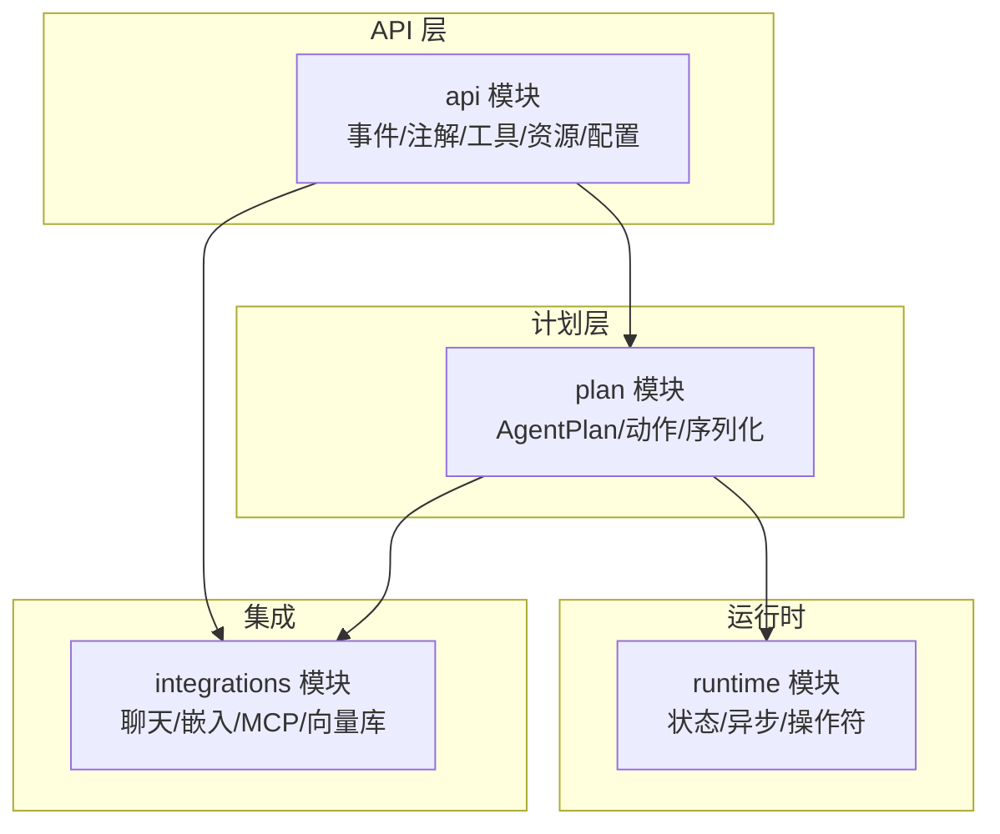
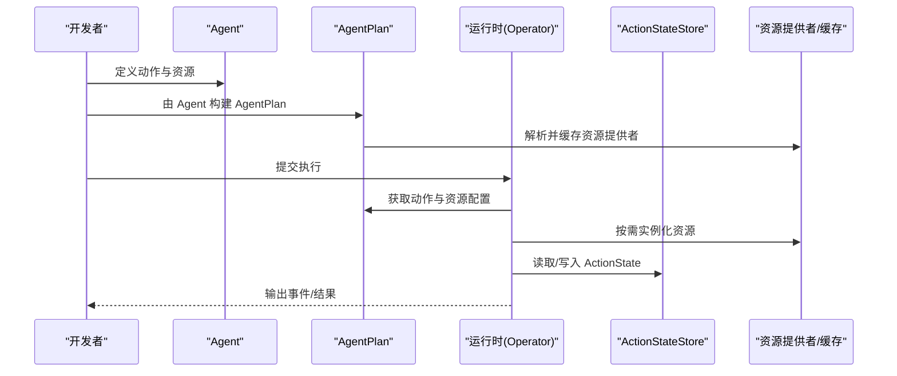
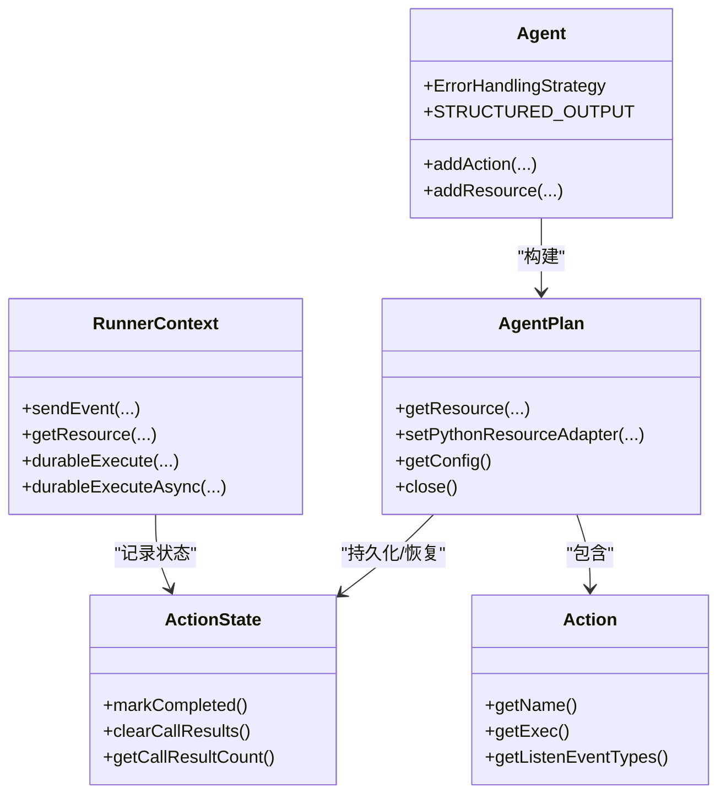
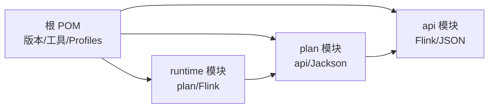

# Java 代码规范

<cite>
**本文引用的文件**
- [pom.xml](file://pom.xml)
- [api/pom.xml](file://api/pom.xml)
- [tools/lint.sh](file://tools/lint.sh)
- [README.md](file://README.md)
- [api/src/main/java/org/apache/flink/agents/api/agents/Agent.java](file://api/src/main/java/org/apache/flink/agents/api/agents/Agent.java)
- [api/src/main/java/org/apache/flink/agents/api/AgentBuilder.java](file://api/src/main/java/org/apache/flink/agents/api/AgentBuilder.java)
- [api/src/main/java/org/apache/flink/agents/api/configuration/Configuration.java](file://api/src/main/java/org/apache/flink/agents/api/configuration/Configuration.java)
- [plan/src/main/java/org/apache/flink/agents/plan/AgentPlan.java](file://plan/src/main/java/org/apache/flink/agents/plan/AgentPlan.java)
- [runtime/src/main/java/org/apache/flink/agents/runtime/actionstate/ActionState.java](file://runtime/src/main/java/org/apache/flink/agents/runtime/actionstate/ActionState.java)
- [api/src/main/java/org/apache/flink/agents/api/annotation/Action.java](file://api/src/main/java/org/apache/flink/agents/api/annotation/Action.java)
- [api/src/main/java/org/apache/flink/agents/api/tools/Tool.java](file://api/src/main/java/org/apache/flink/agents/api/tools/Tool.java)
- [api/src/main/java/org/apache/flink/agents/api/context/RunnerContext.java](file://api/src/main/java/org/apache/flink/agents/api/context/RunnerContext.java)
- [plan/src/main/java/org/apache/flink/agents/plan/actions/Action.java](file://plan/src/main/java/org/apache/flink/agents/plan/actions/Action.java)
- [api/src/test/java/org/apache/flink/agents/api/agents/ReActAgentTest.java](file://api/src/test/java/org/apache/flink/agents/api/agents/ReActAgentTest.java)
</cite>

## 目录
1. 引言
2. 项目结构
3. 核心组件
4. 架构总览
5. 组件详解
6. 依赖关系分析
7. 性能与内存优化
8. 故障排查指南
9. 结论
10. 附录

## 引言
本规范旨在为 Apache Flink Agents 项目的 Java 模块提供统一的编码标准，覆盖命名约定、包结构、代码格式、注释、异常处理、接口设计、性能与内存优化等方面，帮助开发者提升代码质量与可维护性。

## 项目结构
项目采用多模块聚合工程结构，核心模块包括：
- api：对外 API 与注解、事件、资源、工具等定义
- plan：编译期计划（AgentPlan）与序列化器、动作模型
- runtime：运行时执行、状态存储、异步与恢复机制
- integrations：第三方集成（聊天模型、嵌入模型、MCP、向量库等）
- e2e-test：端到端测试
- 其他模块：examples、dist、ide-support 等

图表来源
- [pom.xml](file://pom.xml#L58-L67)
- [api/pom.xml](file://api/pom.xml#L20-L65)

章节来源
- [pom.xml](file://pom.xml#L58-L67)
- [api/pom.xml](file://api/pom.xml#L20-L65)

## 核心组件
- Agent：定义动作注册与资源注入能力，提供错误处理策略枚举与常量
- AgentBuilder：面向用户的构建器接口，支持输出到列表、数据流、表
- Configuration：读写配置接口
- AgentPlan：从 Agent 抽象出可序列化的执行计划，负责资源提供者与缓存
- ActionState：动作执行状态，支持持久化与恢复
- Action 注解：声明方法为动作并指定监听事件类型
- Tool：工具基类，封装元数据与调用入口
- RunnerContext：动作执行上下文，提供事件发送、内存访问、资源获取、指标与配置

章节来源
- [api/src/main/java/org/apache/flink/agents/api/agents/Agent.java](file://api/src/main/java/org/apache/flink/agents/api/agents/Agent.java#L34-L131)
- [api/src/main/java/org/apache/flink/agents/api/AgentBuilder.java](file://api/src/main/java/org/apache/flink/agents/api/AgentBuilder.java#L35-L76)
- [api/src/main/java/org/apache/flink/agents/api/configuration/Configuration.java](file://api/src/main/java/org/apache/flink/agents/api/configuration/Configuration.java#L20-L24)
- [plan/src/main/java/org/apache/flink/agents/plan/AgentPlan.java](file://plan/src/main/java/org/apache/flink/agents/plan/AgentPlan.java#L73-L281)
- [runtime/src/main/java/org/apache/flink/agents/runtime/actionstate/ActionState.java](file://runtime/src/main/java/org/apache/flink/agents/runtime/actionstate/ActionState.java#L28-L180)
- [api/src/main/java/org/apache/flink/agents/api/annotation/Action.java](file://api/src/main/java/org/apache/flink/agents/api/annotation/Action.java#L28-L53)
- [api/src/main/java/org/apache/flink/agents/api/tools/Tool.java](file://api/src/main/java/org/apache/flink/agents/api/tools/Tool.java#L26-L69)
- [api/src/main/java/org/apache/flink/agents/api/context/RunnerContext.java](file://api/src/main/java/org/apache/flink/agents/api/context/RunnerContext.java#L29-L137)

## 架构总览
下图展示从用户定义 Agent 到运行时执行的关键交互路径，以及跨语言资源适配与持久化恢复机制。

图表来源
- [plan/src/main/java/org/apache/flink/agents/plan/AgentPlan.java](file://plan/src/main/java/org/apache/flink/agents/plan/AgentPlan.java#L132-L281)
- [runtime/src/main/java/org/apache/flink/agents/runtime/actionstate/ActionState.java](file://runtime/src/main/java/org/apache/flink/agents/runtime/actionstate/ActionState.java#L28-L180)

## 组件详解

### 命名约定
- 包命名
  - 使用反向域名分段，按功能域细分，如 org.apache.flink.agents.api、org.apache.flink.agents.plan、org.apache.flink.agents.runtime
  - 子包按职责拆分：agents、annotation、chat、embedding、vectorstores、memory、metrics、resource 等
- 类与接口
  - 类名使用名词或复合名词，首字母大写，采用驼峰命名；如 Agent、AgentPlan、ActionState、RunnerContext
  - 接口以抽象能力命名，常用后缀如 Builder、Configuration、Context、Resource 等
- 方法名
  - 动作方法体现“动词+宾语”语义，如 addResource、getResource、addAction、toList、toDataStream、toTable
  - 访问器遵循 get/is/set 前缀，布尔值使用 isXxx
- 常量
  - 使用全大写下划线命名，如 STRUCTURED_OUTPUT
- 枚举
  - 枚举值全大写，构造函数与 getter 明确语义，如 ErrorHandlingStrategy 的 FAIL/RETRY/IGNORE

章节来源
- [api/src/main/java/org/apache/flink/agents/api/agents/Agent.java](file://api/src/main/java/org/apache/flink/agents/api/agents/Agent.java#L113-L131)
- [api/src/main/java/org/apache/flink/agents/api/AgentBuilder.java](file://api/src/main/java/org/apache/flink/agents/api/AgentBuilder.java#L35-L76)
- [plan/src/main/java/org/apache/flink/agents/plan/AgentPlan.java](file://plan/src/main/java/org/apache/flink/agents/plan/AgentPlan.java#L73-L123)

### 包结构组织原则
- 分层清晰：api 定义契约，plan 负责编译与序列化，runtime 实现执行与状态
- 模块化：integrations 将第三方能力解耦，便于按需引入
- 可扩展：通过注解与资源提供者机制，支持 Java 与 Python 资源桥接

章节来源
- [pom.xml](file://pom.xml#L58-L67)
- [api/pom.xml](file://api/pom.xml#L20-L65)

### 代码格式化标准
- 工具与流程
  - 使用 Maven Spotless 插件进行 Java 格式化，脚本 tools/lint.sh 同时支持 Java 与 Python 格式检查/修复
  - 针对 JDK 21 环境默认跳过 Spotless 校验，避免兼容性问题
- 缩进与空格
  - 统一使用空格缩进，保持一致的层级表达
- 换行与括号
  - 控制块与参数分行策略，保持可读性
- 注解与泛型
  - 注解与泛型使用遵循现有风格，保持一致性

章节来源
- [tools/lint.sh](file://tools/lint.sh#L131-L139)
- [tools/lint.sh](file://tools/lint.sh#L158-L166)
- [pom.xml](file://pom.xml#L109-L131)

### 注释标准
- Javadoc
  - 公共类与接口应提供 Javadoc，说明用途、行为与注意事项
  - 关键方法需标注参数、返回值与异常
- 行内注释
  - 复杂逻辑处添加简要说明，解释“为什么”而非“是什么”
- 示例与用法
  - 注解示例中给出典型用法片段，便于快速上手

章节来源
- [api/src/main/java/org/apache/flink/agents/api/annotation/Action.java](file://api/src/main/java/org/apache/flink/agents/api/annotation/Action.java#L28-L42)
- [api/src/main/java/org/apache/flink/agents/api/AgentBuilder.java](file://api/src/main/java/org/apache/flink/agents/api/AgentBuilder.java#L29-L35)

### 异常处理规范
- 异常类型选择
  - 参数非法使用 IllegalArgumentException
  - 资源未找到使用 IllegalArgumentException 或自定义业务异常
  - 序列化/反序列化使用 RuntimeException 包裹
- 错误传播
  - 在资源解析与动作执行链路中，捕获底层异常并转换为运行时异常，保留原始原因
- 资源清理
  - 提供 close 方法释放资源，确保在关闭阶段清理缓存与连接

章节来源
- [api/src/main/java/org/apache/flink/agents/api/agents/Agent.java](file://api/src/main/java/org/apache/flink/agents/api/agents/Agent.java#L66-L109)
- [plan/src/main/java/org/apache/flink/agents/plan/AgentPlan.java](file://plan/src/main/java/org/apache/flink/agents/plan/AgentPlan.java#L274-L281)

### 接口设计原则
- 接口隔离
  - 将不同职责拆分为独立接口，如 RunnerContext、AgentBuilder、Configuration
- 依赖倒置
  - 上层仅依赖抽象（接口），具体实现通过资源提供者注入
- 稳定契约
  - 对外接口保持稳定，内部实现可演进

章节来源
- [api/src/main/java/org/apache/flink/agents/api/context/RunnerContext.java](file://api/src/main/java/org/apache/flink/agents/api/context/RunnerContext.java#L33-L137)
- [api/src/main/java/org/apache/flink/agents/api/AgentBuilder.java](file://api/src/main/java/org/apache/flink/agents/api/AgentBuilder.java#L35-L76)
- [api/src/main/java/org/apache/flink/agents/api/configuration/Configuration.java](file://api/src/main/java/org/apache/flink/agents/api/configuration/Configuration.java#L20-L24)

### 数据模型与序列化
- 模型类
  - 使用简单字段与明确的 getter，必要时提供构造函数与 equals/hashCode
- 序列化
  - 通过 Jackson 注解控制序列化/反序列化，保证跨语言互通
- 持久化
  - ActionState 支持持久化与恢复，提供清理与校验方法

图表来源
- [api/src/main/java/org/apache/flink/agents/api/agents/Agent.java](file://api/src/main/java/org/apache/flink/agents/api/agents/Agent.java#L34-L131)
- [plan/src/main/java/org/apache/flink/agents/plan/AgentPlan.java](file://plan/src/main/java/org/apache/flink/agents/plan/AgentPlan.java#L73-L281)
- [runtime/src/main/java/org/apache/flink/agents/runtime/actionstate/ActionState.java](file://runtime/src/main/java/org/apache/flink/agents/runtime/actionstate/ActionState.java#L28-L180)
- [api/src/main/java/org/apache/flink/agents/api/context/RunnerContext.java](file://api/src/main/java/org/apache/flink/agents/api/context/RunnerContext.java#L33-L137)
- [plan/src/main/java/org/apache/flink/agents/plan/actions/Action.java](file://plan/src/main/java/org/apache/flink/agents/plan/actions/Action.java#L43-L99)

## 依赖关系分析
- 版本与工具
  - Java 目标版本与编译器属性在根 POM 中统一管理
  - 通过 Maven Profiles 针对 JDK 11/21 设置不同策略
- 依赖管理
  - Jackson 采用 BOM 管理版本，确保一致性
- 模块间依赖
  - api 依赖 Flink Streaming/Table 与 Jackson
  - plan 依赖 api 与 Jackson，用于序列化
  - runtime 依赖 plan 与 Flink 运行时组件

图表来源
- [pom.xml](file://pom.xml#L37-L56)
- [pom.xml](file://pom.xml#L109-L131)
- [api/pom.xml](file://api/pom.xml#L30-L65)

章节来源
- [pom.xml](file://pom.xml#L37-L56)
- [pom.xml](file://pom.xml#L109-L131)
- [api/pom.xml](file://api/pom.xml#L30-L65)

## 性能与内存优化
- 对象与集合
  - 使用并发安全的 Map（如 ConcurrentHashMap）作为缓存容器，降低锁竞争
- 序列化与传输
  - 通过 Jackson 序列化/反序列化，减少手动序列化开销
- 状态持久化
  - ActionState 提供清理与标记完成的能力，避免冗余状态占用
- 资源复用
  - AgentPlan 内部缓存资源实例，避免重复创建
- 异步与恢复
  - RunnerContext 提供同步/异步持久化执行能力，结合 ActionStateStore 实现细粒度恢复

章节来源
- [plan/src/main/java/org/apache/flink/agents/plan/AgentPlan.java](file://plan/src/main/java/org/apache/flink/agents/plan/AgentPlan.java#L92-L99)
- [plan/src/main/java/org/apache/flink/agents/plan/AgentPlan.java](file://plan/src/main/java/org/apache/flink/agents/plan/AgentPlan.java#L231-L264)
- [runtime/src/main/java/org/apache/flink/agents/runtime/actionstate/ActionState.java](file://runtime/src/main/java/org/apache/flink/agents/runtime/actionstate/ActionState.java#L152-L180)
- [api/src/main/java/org/apache/flink/agents/api/context/RunnerContext.java](file://api/src/main/java/org/apache/flink/agents/api/context/RunnerContext.java#L120-L133)

## 故障排查指南
- 构建与格式
  - 使用 tools/lint.sh 执行 Java/Python 格式检查与修复，确保提交前一致性
  - JDK 21 环境下 Spotless 校验被跳过，注意本地开发环境与 CI 差异
- 单元测试
  - 通过 JUnit 与 AssertJ/Mockito 进行断言与模拟，确保行为正确
- 常见问题定位
  - 资源未找到：检查资源名称与类型是否匹配，确认资源提供者已注册
  - 动作重复定义：确保动作名唯一，避免重复注册
  - 序列化异常：核对 Jackson 注解与字段可见性

章节来源
- [tools/lint.sh](file://tools/lint.sh#L131-L139)
- [tools/lint.sh](file://tools/lint.sh#L158-L166)
- [api/src/test/java/org/apache/flink/agents/api/agents/ReActAgentTest.java](file://api/src/test/java/org/apache/flink/agents/api/agents/ReActAgentTest.java#L30-L44)

## 结论
本规范基于现有代码库提炼出统一的命名、结构、格式、注释、异常与接口设计实践，并结合运行时状态与资源管理提出性能与内存优化建议。建议团队在日常开发中严格遵循，持续通过工具链保障一致性与质量。

## 附录

### 快速参考清单
- 命名
  - 包：反向域名 + 功能域
  - 类/接口：首字母大写驼峰
  - 方法：动词+宾语，布尔用 isXxx
  - 常量：全大写下划线
- 格式
  - 使用 Maven Spotless 与 tools/lint.sh
  - JDK 21 环境跳过 Spotless 校验
- 注释
  - Javadoc 覆盖公共 API
  - 行内注释解释复杂逻辑
- 异常
  - 参数非法：IllegalArgumentException
  - 资源/序列化：RuntimeException 包裹
- 接口
  - 面向抽象编程，依赖倒置
- 性能
  - 并发缓存、状态清理、资源复用、异步持久化